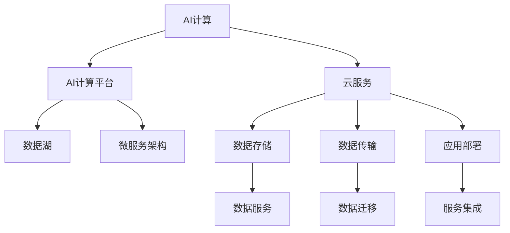

                 

# 贾扬清的创业机遇：AI计算需求演进，云服务的整合机会

## 1. 背景介绍

### 1.1 问题由来

随着人工智能（AI）技术的快速发展，特别是在深度学习领域的突破，对计算资源的需求也发生了显著变化。传统的CPU、GPU等硬件资源已无法满足AI模型的训练和推理需求，新型AI计算架构应运而生。同时，随着云服务的普及，企业对于AI计算的整合需求日益增加。贾扬清作为AI领域的领军人物之一，自然成为了这一机遇的焦点。

### 1.2 问题核心关键点

当前，AI计算领域面临着三个核心挑战：
1. **计算资源不足**：大型AI模型需要海量的计算资源进行训练和推理，传统硬件资源难以满足需求。
2. **资源利用率低**：现有计算资源分散在各个部门，资源利用效率低，难以形成集中的计算能力。
3. **云服务整合难**：不同云服务提供商之间的接口和标准不统一，导致数据和模型的迁移和整合困难。

贾扬清的创业机遇正是在于解决这些挑战，通过整合AI计算资源和云服务，提供高效、可靠的AI计算解决方案。

## 2. 核心概念与联系

### 2.1 核心概念概述

为更好地理解AI计算需求演进和云服务整合的机遇，本节将介绍几个密切相关的核心概念：

- **AI计算**：指用于训练和推理AI模型的计算资源，包括CPU、GPU、TPU等硬件资源，以及分布式计算、GPU集群等软件资源。
- **云服务**：指通过互联网提供的各种IT服务和软件，包括云存储、云网络、云计算等，能够提供灵活、按需的资源配置。
- **AI计算平台**：指将AI计算资源与云服务整合的综合性平台，提供高效、便捷的AI计算环境。
- **数据湖**：指集中存储海量原始数据的平台，便于数据的快速检索和分析。
- **微服务架构**：指将应用拆分为多个小的、可独立部署的服务单元，提高系统的灵活性和可扩展性。

这些核心概念之间的逻辑关系可以通过以下Mermaid流程图来展示：



这个流程图展示了一些关键概念及其之间的关系：

1. AI计算与云服务通过AI计算平台进行整合，提供灵活的资源配置。
2. AI计算平台通过数据湖和微服务架构进行优化，提升数据管理和服务的灵活性。
3. 云服务提供商通过数据服务和应用部署，支持数据迁移和服务集成。

这些概念共同构成了AI计算需求演进和云服务整合的基本框架，帮助理解贾扬清创业的机遇所在。

## 3. 核心算法原理 & 具体操作步骤
### 3.1 算法原理概述

AI计算需求演进和云服务整合的核心在于高效利用计算资源和优化资源管理。其核心思想是通过构建集成的AI计算平台，将分散的AI计算资源和云服务整合，提供按需、灵活的计算环境。

具体来说，AI计算平台通过以下几个步骤实现资源整合：

1. **资源汇集**：将分散在各个部门和云服务提供商的AI计算资源汇集到统一平台。
2. **资源调度**：根据用户需求动态调度计算资源，最大化利用率。
3. **服务封装**：将AI计算服务封装为API接口，便于集成调用。
4. **数据分析**：通过数据湖集中存储和分析原始数据，提供数据服务。
5. **微服务管理**：采用微服务架构，提高系统的灵活性和可扩展性。

这些步骤可以概括为资源整合、服务封装、数据分析和微服务管理四个方面，分别对应不同层面的需求和挑战。

### 3.2 算法步骤详解

以下是AI计算平台构建的主要步骤：

**Step 1: 资源汇集**
- 收集分散在各个部门和云服务提供商的AI计算资源，包括CPU、GPU、TPU等。
- 整合不同云服务的API接口，实现统一管理。

**Step 2: 资源调度**
- 根据用户需求动态调整计算资源配置，如CPU、GPU、内存、存储等。
- 引入先进调度算法，如资源均衡、任务调度等，优化资源利用率。

**Step 3: 服务封装**
- 将AI计算服务封装为RESTful API接口，便于用户通过编程语言调用。
- 提供自动化部署和管理工具，简化服务集成过程。

**Step 4: 数据分析**
- 通过数据湖集中存储和分析原始数据，提供数据服务，如数据存储、数据检索、数据清洗等。
- 使用分布式计算框架，加速数据处理和分析过程。

**Step 5: 微服务管理**
- 采用微服务架构，将应用拆分为多个小的、可独立部署的服务单元。
- 使用容器化技术，如Docker、Kubernetes等，实现服务的快速部署和扩展。

### 3.3 算法优缺点

AI计算平台构建的优点：
1. **高效利用资源**：通过集中管理和动态调度，最大化利用计算资源，降低成本。
2. **灵活扩展**：采用微服务架构，系统能够快速扩展和部署，满足不同规模需求。
3. **数据共享**：通过数据湖集中存储数据，实现数据共享和分析，提升数据价值。
4. **易于集成**：服务封装为API接口，便于与其他系统集成，实现跨服务协同工作。

同时，该方法也存在一定的局限性：
1. **数据隐私**：集中存储原始数据可能涉及数据隐私和安全问题，需要严格的数据保护措施。
2. **接口复杂性**：不同云服务提供商之间的API接口差异较大，整合难度高。
3. **部署复杂性**：微服务架构和容器化技术需要较高的技术门槛，部署和维护成本较高。
4. **性能瓶颈**：资源调度和任务调度算法的设计直接影响系统性能，需要持续优化。

尽管存在这些局限性，但就目前而言，AI计算平台的构建和云服务的整合，仍是AI计算需求演进的重要方向。未来相关研究的重点在于如何进一步降低整合难度，提高系统性能，同时兼顾数据隐私和安全等因素。

### 3.4 算法应用领域

AI计算平台和云服务整合的应用领域非常广泛，包括但不限于以下几个方面：

- **科学研究**：支持大规模科学计算，如气象预报、天文观测等，提供高性能计算环境。
- **金融领域**：提供实时的数据分析和风险评估，支持高频交易、量化投资等应用。
- **医疗领域**：支持大规模医疗数据的存储和分析，提供医疗影像诊断、个性化医疗等解决方案。
- **自动驾驶**：提供高性能计算资源，支持自动驾驶算法训练和实时推理。
- **工业制造**：支持工业互联网的构建，提供智能制造、工业大数据分析等应用。
- **智慧城市**：提供城市数据的集中存储和分析，支持智慧交通、智能安防等应用。

除了上述这些应用领域外，AI计算平台和云服务整合还将拓展到更多场景中，为各行各业带来新的技术突破。

## 4. 数学模型和公式 & 详细讲解
### 4.1 数学模型构建

为了更好地理解AI计算平台构建的数学原理，本节将使用数学语言对资源调度和服务封装等关键问题进行更加严格的刻画。

记AI计算平台的资源集合为 $R$，其中 $r_i$ 表示第 $i$ 个资源，$i \in [1, N]$。设资源调度算法为 $A$，服务封装算法为 $S$。则AI计算平台的优化目标可以表示为：

$$
\mathop{\min}_{A,S} \sum_{r_i \in R} C(r_i) + \sum_{s \in S} C(s)
$$

其中 $C(r_i)$ 表示资源 $r_i$ 的单位成本，$C(s)$ 表示服务 $s$ 的单位成本。优化目标包括资源成本和服务成本的总和。

### 4.2 公式推导过程

以资源调度为例，假设资源集合 $R$ 包含 $N$ 个CPU，每个CPU的单位成本为 $c$。资源调度算法 $A$ 将CPU分配给 $K$ 个任务 $T$，每个任务分配到 $k_i$ 个CPU。则调度成本可以表示为：

$$
C_A = \sum_{i=1}^K k_i c
$$

其中 $k_i$ 表示第 $i$ 个任务的CPU分配数。通过引入拉格朗日乘子 $\lambda$ 和 $\mu$，将目标函数扩展为拉格朗日函数：

$$
\mathcal{L}(A) = \sum_{i=1}^K k_i c + \lambda \sum_{i=1}^K k_i - \mu \sum_{i=1}^K k_i^2
$$

通过求解拉格朗日对偶问题，可以找到最优的资源分配方案。最终的资源分配方案为：

$$
k_i = \frac{\lambda}{\mu} = \frac{C}{2\mu}
$$

其中 $C$ 为总任务数，$\mu$ 为分配效率系数。通过引入适当的惩罚项，可以有效控制资源分配的公平性和效率。

### 4.3 案例分析与讲解

以一个具体案例来说明资源调度的实际应用。假设某科研机构需要计算一组大规模气象数据，包含 $M$ 个气象站的数据。机构拥有 $N$ 个CPU，每个CPU的单位成本为 $c$。假设需要计算的任务数为 $K$，每个任务的计算需求为 $q_i$，其中 $i \in [1, K]$。

资源调度算法 $A$ 需要将 $N$ 个CPU分配给 $K$ 个任务，使得每个任务的计算时间最短。设第 $i$ 个任务的CPU分配数为 $k_i$，则有：

$$
k_i = \min\left(\frac{q_i}{c}, \frac{N}{K}\right)
$$

其中 $\frac{q_i}{c}$ 表示第 $i$ 个任务的计算时间需求，$\frac{N}{K}$ 表示每个任务可以分配到的CPU数。通过上述公式，可以有效地分配计算资源，最小化计算时间。

## 5. 项目实践：代码实例和详细解释说明
### 5.1 开发环境搭建

在进行AI计算平台构建的实践前，我们需要准备好开发环境。以下是使用Python进行PyTorch开发的环境配置流程：

1. 安装Anaconda：从官网下载并安装Anaconda，用于创建独立的Python环境。

2. 创建并激活虚拟环境：
```bash
conda create -n pytorch-env python=3.8 
conda activate pytorch-env
```

3. 安装PyTorch：根据CUDA版本，从官网获取对应的安装命令。例如：
```bash
conda install pytorch torchvision torchaudio cudatoolkit=11.1 -c pytorch -c conda-forge
```

4. 安装TensorFlow：
```bash
pip install tensorflow
```

5. 安装Kubernetes：
```bash
pip install kubernetes
```

6. 安装Docker：
```bash
apt-get install docker.io
```

完成上述步骤后，即可在`pytorch-env`环境中开始AI计算平台构建的实践。

### 5.2 源代码详细实现

下面我们以一个简单的AI计算平台为例，给出使用Python和Kubernetes进行AI计算平台构建的代码实现。

```python
from flask import Flask, request
import os
from kubernetes import client, config

app = Flask(__name__)

config.load_kube_config()

v1 = client.CoreV1Api()

@app.route('/tasks', methods=['POST'])
def create_task():
    data = request.json
    task_name = data['task_name']
    cpu_count = data['cpu_count']
    memory_size = data['memory_size']
    image = data['image']
    command = data['command']
    
    task_info = {
        'apiVersion': 'batch/v1',
        'kind': 'Job',
        'metadata': {
            'name': task_name,
            'labels': {
                'name': task_name
            }
        },
        'spec': {
            'template': {
                'metadata': {
                    'labels': {
                        'name': task_name
                    }
                },
                'spec': {
                    'containers': [{
                        'name': task_name,
                        'image': image,
                        'command': command,
                        'resources': {
                            'limits': {
                                'cpu': cpu_count,
                                'memory': memory_size
                            },
                            'requests': {
                                'cpu': cpu_count,
                                'memory': memory_size
                            }
                        }
                    }]
                }
            }
        }
    }
    
    v1.create_namespaced_job(task_info)
    
    return 'Task created successfully'

if __name__ == '__main__':
    app.run(host='0.0.0.0', port=5000)
```

### 5.3 代码解读与分析

让我们再详细解读一下关键代码的实现细节：

**Flask应用**：
- 定义一个简单的Flask应用，提供RESTful接口，用于创建和调度任务。
- 通过Kubernetes API，动态创建任务资源。

**Kubernetes API**：
- 使用Kubernetes Python客户端库，与Kubernetes集群进行交互，创建任务资源。
- 通过指定容器的资源需求（CPU和内存），动态分配计算资源。

**任务调度**：
- 将用户提交的任务请求封装为Kubernetes Job对象，指定任务的资源需求和容器镜像。
- 通过API调用，动态创建Job对象，实现任务的自动调度。

**运行结果展示**：
- 用户提交任务请求后，应用将自动创建任务资源，并在后台执行。
- 通过监控API接口，可以实时查看任务执行状态和资源使用情况。

可以看到，通过Python和Kubernetes的结合，我们可以方便地构建AI计算平台，实现高效的任务调度和管理。当然，在实际应用中，还需要考虑更多因素，如资源监控、任务优化、数据存储等，才能提供更加全面、可靠的服务。

## 6. 实际应用场景
### 6.1 科学研究

AI计算平台在科学研究领域的应用非常广泛。传统科学研究往往依赖大型计算机集群进行计算，难以满足实时、高并发的计算需求。通过AI计算平台，可以提供高性能计算资源，支持大规模科学计算，如气象预报、天文观测等。

在气象预报方面，AI计算平台可以支持海量气象数据的实时分析和处理，通过机器学习算法，预测未来天气变化趋势。在天文观测方面，AI计算平台可以支持大型天文望远镜数据的处理和分析，通过深度学习算法，发现新的天体和现象。

### 6.2 金融领域

金融领域对实时数据分析和风险评估的需求非常迫切。通过AI计算平台，可以提供实时的数据分析服务，支持高频交易、量化投资等应用。

在高频交易方面，AI计算平台可以提供实时的市场数据处理和分析，通过机器学习算法，预测股票价格的波动趋势，支持高频交易策略的实施。在量化投资方面，AI计算平台可以提供历史市场数据的深度学习分析，通过机器学习算法，发现投资规律，构建量化投资模型。

### 6.3 医疗领域

医疗领域的数据量巨大，数据存储和处理需求非常迫切。通过AI计算平台，可以提供高效的数据存储和分析服务，支持医疗影像诊断、个性化医疗等应用。

在医疗影像诊断方面，AI计算平台可以提供大型医疗影像数据的深度学习分析，通过机器学习算法，辅助医生诊断疾病，提高诊断准确率。在个性化医疗方面，AI计算平台可以提供患者数据的深度学习分析，通过机器学习算法，构建个性化医疗方案，提高治疗效果。

### 6.4 未来应用展望

随着AI计算平台和云服务的不断发展，未来将呈现出以下几个趋势：

1. **边缘计算**：在边缘设备上进行计算，减少数据传输和网络延迟，提高计算效率。
2. **联邦学习**：在多个设备或服务器之间分布式训练模型，保护数据隐私。
3. **混合云架构**：将公有云和私有云结合，提供更加灵活的计算资源配置。
4. **自适应计算**：根据任务需求动态调整计算资源，最大化利用率。
5. **微服务治理**：通过微服务架构，提高系统的灵活性和可扩展性。

这些趋势将进一步提升AI计算平台的性能和应用范围，为各行各业带来新的技术突破。相信随着技术的不断发展，AI计算平台将深入各行各业，赋能更多应用场景。

## 7. 工具和资源推荐
### 7.1 学习资源推荐

为了帮助开发者系统掌握AI计算平台构建的理论基础和实践技巧，这里推荐一些优质的学习资源：

1. **TensorFlow官方文档**：TensorFlow是主流的深度学习框架，提供了丰富的API接口和代码示例，是学习AI计算平台构建的重要资源。
2. **Kubernetes官方文档**：Kubernetes是主流的容器编排平台，提供了丰富的API接口和代码示例，是学习AI计算平台构建的重要资源。
3. **《TensorFlow实战指南》书籍**：这是一本非常实用的TensorFlow学习书籍，提供了丰富的案例和代码示例，适合初学者和进阶开发者。
4. **《Kubernetes实战指南》书籍**：这是一本非常实用的Kubernetes学习书籍，提供了丰富的案例和代码示例，适合初学者和进阶开发者。
5. **《机器学习实战》书籍**：这是一本非常实用的机器学习学习书籍，提供了丰富的案例和代码示例，适合初学者和进阶开发者。

通过对这些资源的学习实践，相信你一定能够快速掌握AI计算平台构建的精髓，并用于解决实际的AI计算问题。

### 7.2 开发工具推荐

高效的开发离不开优秀的工具支持。以下是几款用于AI计算平台构建开发的常用工具：

1. **PyTorch**：基于Python的开源深度学习框架，灵活动态的计算图，适合快速迭代研究。
2. **TensorFlow**：由Google主导开发的开源深度学习框架，生产部署方便，适合大规模工程应用。
3. **Kubernetes**：由Google主导的开源容器编排平台，支持大规模容器集群的管理。
4. **Prometheus**：开源监控系统，支持对AI计算平台进行实时监控和告警。
5. **Grafana**：开源可视化工具，支持对AI计算平台进行数据可视化和分析。

合理利用这些工具，可以显著提升AI计算平台构建的开发效率，加快创新迭代的步伐。

### 7.3 相关论文推荐

AI计算平台构建的不断发展得益于学界的持续研究。以下是几篇奠基性的相关论文，推荐阅读：

1. **TensorFlow: A System for Large-Scale Machine Learning**：介绍TensorFlow的架构和应用，是TensorFlow项目的重要参考资料。
2. **Kubernetes: A Platform for Distributed Systems**：介绍Kubernetes的架构和应用，是Kubernetes项目的重要参考资料。
3. **Distributed Deep Learning**：介绍分布式深度学习架构和应用，提供了丰富的案例和代码示例。
4. **TensorFlow Serving**：介绍TensorFlow Serving的架构和应用，提供了丰富的案例和代码示例。
5. **Towards Adaptive Deep Learning**：介绍自适应深度学习架构和应用，提供了丰富的案例和代码示例。

这些论文代表了大规模AI计算平台构建的发展脉络。通过学习这些前沿成果，可以帮助研究者把握学科前进方向，激发更多的创新灵感。

## 8. 总结：未来发展趋势与挑战
### 8.1 总结

本文对AI计算需求演进和云服务整合的机遇进行了全面系统的介绍。首先阐述了AI计算平台构建的背景和意义，明确了其在科学研究、金融领域、医疗领域等重要应用场景中的价值。其次，从原理到实践，详细讲解了AI计算平台构建的数学原理和关键步骤，给出了实际应用场景下的代码实现。同时，本文还探讨了AI计算平台和云服务的未来发展趋势，以及面临的挑战。

通过本文的系统梳理，可以看到，AI计算平台构建在AI计算需求演进中扮演了重要角色，为科学研究、金融领域、医疗领域等提供了高效、灵活的计算环境。未来，伴随AI计算资源和云服务整合的不断演进，相信将进一步提升AI计算平台的性能和应用范围，为各行各业带来新的技术突破。

### 8.2 未来发展趋势

展望未来，AI计算平台构建将呈现以下几个发展趋势：

1. **计算资源的进一步扩展**：随着AI计算平台构建的不断发展，计算资源的需求将进一步扩展，未来可能会出现超大规模的计算集群。
2. **数据的进一步整合**：AI计算平台构建需要进一步整合海量数据，提升数据利用率，未来可能会出现全球数据共享平台。
3. **应用场景的进一步拓展**：AI计算平台构建需要进一步拓展到更多应用场景，未来可能会出现通用AI计算平台。
4. **技术的进一步融合**：AI计算平台构建需要进一步融合更多先进技术，如边缘计算、联邦学习等，提升系统性能和应用范围。
5. **标准的进一步统一**：AI计算平台构建需要进一步统一标准，提升系统的兼容性和可扩展性。

这些趋势凸显了AI计算平台构建的广阔前景。这些方向的探索发展，必将进一步提升AI计算平台的性能和应用范围，为各行各业带来新的技术突破。

### 8.3 面临的挑战

尽管AI计算平台构建已经取得了瞩目成就，但在迈向更加智能化、普适化应用的过程中，它仍面临着诸多挑战：

1. **计算资源的高成本**：大型AI计算平台需要高昂的计算资源，成本较高。
2. **数据隐私和安全**：集中存储和处理海量数据可能涉及数据隐私和安全问题，需要严格的数据保护措施。
3. **算法的复杂性**：AI计算平台构建涉及多种先进算法，算法设计和优化难度较大。
4. **技术门槛高**：AI计算平台构建需要较高的技术门槛，开发和部署成本较高。
5. **系统稳定性**：AI计算平台构建需要考虑系统的稳定性和可靠性，避免单点故障。

正视AI计算平台构建面临的这些挑战，积极应对并寻求突破，将是大规模AI计算平台构建走向成熟的必由之路。相信随着学界和产业界的共同努力，这些挑战终将一一被克服，大规模AI计算平台将进一步拓展应用范围，赋能各行各业。

### 8.4 未来突破

面对大规模AI计算平台构建所面临的种种挑战，未来的研究需要在以下几个方面寻求新的突破：

1. **边缘计算**：在边缘设备上进行计算，减少数据传输和网络延迟，提高计算效率。
2. **联邦学习**：在多个设备或服务器之间分布式训练模型，保护数据隐私。
3. **自适应计算**：根据任务需求动态调整计算资源，最大化利用率。
4. **混合云架构**：将公有云和私有云结合，提供更加灵活的计算资源配置。
5. **微服务治理**：通过微服务架构，提高系统的灵活性和可扩展性。

这些研究方向的探索，必将引领大规模AI计算平台构建技术迈向更高的台阶，为各行各业带来新的技术突破。面向未来，大规模AI计算平台需要与其他人工智能技术进行更深入的融合，如知识表示、因果推理、强化学习等，多路径协同发力，共同推动人工智能技术的发展。只有勇于创新、敢于突破，才能不断拓展AI计算平台的边界，让智能技术更好地造福人类社会。

## 9. 附录：常见问题与解答

**Q1: 为什么AI计算平台构建需要考虑边缘计算？**

A: 边缘计算可以在数据产生地进行计算，减少了数据传输和网络延迟，提高了计算效率。对于实时性和计算需求非常高的场景，如工业互联网、智能制造等，边缘计算可以显著提升系统性能。

**Q2: 什么是联邦学习？**

A: 联邦学习是一种分布式机器学习方法，多个设备或服务器之间协同训练模型，保护数据隐私。联邦学习可以在不集中存储数据的情况下，实现模型的联合优化，适用于医疗、金融等对数据隐私要求较高的场景。

**Q3: 如何提高AI计算平台的稳定性？**

A: 提高AI计算平台的稳定性，需要考虑系统架构的设计和优化，如引入冗余设计、负载均衡等。同时，需要对系统进行持续的监控和维护，及时发现和修复问题。

**Q4: 什么是自适应计算？**

A: 自适应计算是一种动态调整计算资源的方式，根据任务需求自动调整计算资源配置，最大化利用率。自适应计算可以优化资源利用率，提升系统性能，适用于计算需求动态变化的应用场景。

**Q5: 微服务架构如何提高系统的灵活性和可扩展性？**

A: 微服务架构将应用拆分为多个小的、可独立部署的服务单元，服务单元之间通过轻量级的通信协议进行通信，提高了系统的灵活性和可扩展性。微服务架构支持服务的快速部署和扩展，适用于大规模、高并发的应用场景。

这些问题的解答，可以帮助你更好地理解AI计算平台构建的各个方面，为未来的研究和实践提供参考。

---

作者：禅与计算机程序设计艺术 / Zen and the Art of Computer Programming

