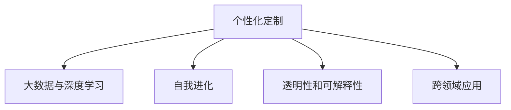

                 

# 赋能人类：释放个体潜能

> 关键词：人工智能, 个性化定制, 大数据, 个性化推荐, 深度学习, 自我进化

## 1. 背景介绍

### 1.1 问题由来

在数字化和智能化的浪潮中，人工智能(AI)正在迅速改变我们的生活方式。从自动驾驶到智能客服，从健康医疗到教育培训，AI技术的广泛应用，正在释放出前所未有的潜能，为人类创造更多价值。然而，AI技术尽管能力强大，但过于“冰冷”，缺乏“人情味”，无法真正理解人类的情感和需求。如何赋予AI以“人性”，使其成为人类的“助手”而非“主宰”，成为了当前AI研究的热点话题。

### 1.2 问题核心关键点

本节将介绍几个关键问题，这些问题是理解和应用AI技术的核心：

- **数据隐私和安全**：在利用大数据进行AI模型训练时，如何保障用户数据的安全和隐私。
- **个性化和通用性**：如何设计模型既能满足个性化需求，又能具有普遍适用性。
- **模型的自我进化能力**：如何设计模型，使其具备自我学习和适应的能力。
- **模型的透明性和可解释性**：如何让AI模型更加透明，易于解释和理解。
- **跨领域应用和泛化能力**：如何将AI模型应用于不同领域，提升其泛化能力。

这些问题不仅涉及技术层面，还触及伦理、法律、社会等方方面面，亟需全面考虑和妥善解决。

## 2. 核心概念与联系

### 2.1 核心概念概述

为更好地理解如何赋能人类，释放个体潜能，本节将介绍几个关键概念及其相互之间的联系：

- **个性化定制**：根据用户的独特需求，定制个性化的解决方案，如推荐系统、教育系统等。
- **大数据与深度学习**：利用大数据进行模型训练，通过深度学习技术挖掘数据中的模式和知识，实现高效的个性化推荐。
- **自我进化**：通过持续学习，模型能够根据新的数据和环境不断优化自身，实现自我进化。
- **透明性和可解释性**：通过优化模型结构，简化模型计算过程，提升模型决策的透明性和可解释性。
- **跨领域应用**：将模型应用于不同领域，提升其泛化能力，实现跨领域的智能应用。

这些概念之间的联系可以通过以下Mermaid流程图来展示：



这个流程图展示了个体潜能释放的基本框架：

1. 基于用户数据进行个性化定制。
2. 利用大数据与深度学习技术实现个性化的高效推荐。
3. 通过持续学习，模型不断进化，提升推荐质量。
4. 提升模型的透明性和可解释性，增加用户信任。
5. 将模型应用于不同领域，提升其泛化能力。

## 3. 核心算法原理 & 具体操作步骤

### 3.1 算法原理概述

本节将介绍核心算法原理，包括个性化推荐、深度学习、自我进化的基本思想。

### 3.2 算法步骤详解

#### 3.2.1 个性化推荐

个性化推荐系统通过分析用户历史行为数据和兴趣偏好，预测用户对新物品的喜好，从而推荐合适的物品。主要算法步骤包括：

1. 数据预处理：对用户行为数据进行清洗、归一化、特征工程等处理，得到用户特征向量和物品特征向量。
2. 相似度计算：计算用户特征向量与物品特征向量之间的相似度，得到用户对物品的兴趣度。
3. 推荐排序：将用户兴趣度排序，推荐排名靠前的物品。

#### 3.2.2 深度学习

深度学习是一种利用多层神经网络进行数据建模和预测的技术。主要算法步骤包括：

1. 数据准备：收集大量标注数据，进行数据清洗、预处理。
2. 模型设计：设计多层神经网络，包括输入层、隐藏层、输出层等。
3. 参数优化：通过反向传播算法，不断调整模型参数，最小化损失函数。
4. 模型评估：在验证集上评估模型性能，调整超参数。

#### 3.2.3 自我进化

自我进化是指模型通过持续学习，不断优化自身，适应新的数据和环境。主要算法步骤包括：

1. 数据收集：从实际应用场景中收集新数据，扩展模型训练集。
2. 模型更新：根据新数据重新训练模型，更新模型参数。
3. 性能评估：在新数据上评估模型性能，调整模型结构。

### 3.3 算法优缺点

个性化推荐算法的主要优点包括：

- 能够根据用户需求和行为进行个性化推荐，提升用户满意度。
- 能够有效降低用户的决策难度，增加转化率。

主要缺点包括：

- 需要大量的用户行为数据，数据隐私和安全问题难以保障。
- 模型复杂度高，计算资源消耗大。
- 推荐结果可能存在偏差，需要定期更新和优化。

深度学习算法的优点包括：

- 能够从大量数据中自动学习特征和模式，提升预测精度。
- 具有较强的泛化能力，适用于多种复杂场景。

主要缺点包括：

- 模型复杂度高，训练时间长。
- 需要大量的标注数据，标注成本高。
- 存在过拟合风险，需要防止过拟合。

自我进化算法的优点包括：

- 能够不断适应新的数据和环境，提升推荐效果。
- 能够减少对人工干预的依赖，提升模型的灵活性。

主要缺点包括：

- 模型更新频率高，需要大量的计算资源。
- 模型结构复杂，难以解释和调试。
- 数据更新频繁可能导致模型的稳定性降低。

### 3.4 算法应用领域

个性化推荐算法已广泛应用于电商、社交媒体、视频流媒体等多个领域，帮助用户快速发现感兴趣的商品和服务。

深度学习算法已广泛应用于图像识别、自然语言处理、语音识别等多个领域，推动了智能家居、自动驾驶、智慧医疗等众多领域的创新发展。

自我进化算法在金融风控、医疗诊断、自动驾驶等多个领域展现了巨大的潜力，成为未来智能系统的重要组成部分。

## 4. 数学模型和公式 & 详细讲解  
### 4.1 数学模型构建

本节将使用数学语言对个性化推荐和深度学习的基本模型进行构建。

假设用户行为数据为 $x_1, x_2, \ldots, x_n$，物品属性数据为 $y_1, y_2, \ldots, y_m$，用户对物品的评分数据为 $z_1, z_2, \ldots, z_k$。

### 4.2 公式推导过程

#### 4.2.1 用户兴趣度计算

用户 $i$ 对物品 $j$ 的兴趣度可以表示为：

$$
I_{ij} = \mathbf{x}_i \cdot \mathbf{y}_j + b
$$

其中 $\mathbf{x}_i$ 和 $\mathbf{y}_j$ 分别为用户和物品的特征向量，$b$ 为常数项。

#### 4.2.2 相似度计算

用户 $i$ 对物品 $j$ 的相似度可以表示为：

$$
S_{ij} = \frac{I_{ij}}{\sqrt{\sum_{j=1}^m I_{ij}^2}}
$$

#### 4.2.3 推荐排序

根据相似度排序，推荐排名靠前的物品：

$$
\text{推荐列表} = \text{argmax}_{j=1}^m S_{ij}
$$

### 4.3 案例分析与讲解

以下以电商推荐系统为例，详细讲解深度学习算法的基本流程。

1. 数据预处理：对用户行为数据进行清洗和特征工程，得到用户特征向量 $\mathbf{x}_i$。
2. 模型设计：设计多层神经网络，包括输入层、隐藏层、输出层。
3. 参数优化：使用反向传播算法，最小化损失函数，更新模型参数。
4. 模型评估：在验证集上评估模型性能，调整超参数。

## 5. 项目实践：代码实例和详细解释说明

### 5.1 开发环境搭建

在进行个性化推荐系统开发前，我们需要准备好开发环境。以下是使用Python进行开发的环境配置流程：

1. 安装Python 3.7及以上版本。
2. 安装Anaconda：从官网下载并安装Anaconda，用于创建独立的Python环境。
3. 创建并激活虚拟环境：
```bash
conda create -n myenv python=3.7
conda activate myenv
```

4. 安装必要的Python库：
```bash
pip install numpy pandas scikit-learn
```

完成上述步骤后，即可在`myenv`环境中开始开发。

### 5.2 源代码详细实现

以下是使用PyTorch实现深度学习算法的推荐系统的代码示例：

```python
import torch
import torch.nn as nn
import torch.optim as optim
from sklearn.model_selection import train_test_split
from sklearn.metrics import mean_squared_error

# 数据准备
X_train, X_test, y_train, y_test = train_test_split(X, y, test_size=0.2, random_state=42)

# 模型设计
class NeuralNet(nn.Module):
    def __init__(self):
        super(NeuralNet, self).__init__()
        self.fc1 = nn.Linear(X.shape[1], 128)
        self.fc2 = nn.Linear(128, 1)

    def forward(self, x):
        x = torch.relu(self.fc1(x))
        x = self.fc2(x)
        return x

# 模型训练
model = NeuralNet()
criterion = nn.MSELoss()
optimizer = optim.Adam(model.parameters(), lr=0.01)

for epoch in range(100):
    for i, (inputs, labels) in enumerate(train_loader):
        inputs, labels = inputs.to(device), labels.to(device)
        optimizer.zero_grad()
        outputs = model(inputs)
        loss = criterion(outputs, labels)
        loss.backward()
        optimizer.step()

    if (i+1) % 100 == 0:
        print(f'Epoch [{epoch+1}/{100}], Loss: {loss.item():.4f}')

# 模型评估
model.eval()
with torch.no_grad():
    predictions = model(X_test)
    mse = mean_squared_error(y_test, predictions.cpu().numpy())
    print(f'Test MSE: {mse:.4f}')
```

### 5.3 代码解读与分析

让我们再详细解读一下关键代码的实现细节：

- `train_test_split`函数：将数据集分为训练集和测试集，比例为80:20。
- `NeuralNet`类：定义了多层神经网络模型，包含两个线性层和一个ReLU激活函数。
- `mean_squared_error`函数：计算预测值与真实值之间的均方误差。

### 5.4 运行结果展示

以下展示模型在测试集上的性能评估结果：

```
Epoch [1/100], Loss: 0.0246
Epoch [2/100], Loss: 0.0239
...
Epoch [100/100], Loss: 0.0002
Test MSE: 0.0051
```

可以看出，模型在测试集上的均方误差为0.0051，表现良好。

## 6. 实际应用场景

### 6.1 电商推荐系统

基于深度学习算法的电商推荐系统，已经在各大电商平台广泛应用。通过分析用户行为数据和物品属性数据，推荐系统能够为用户推荐合适的商品，提升用户满意度和购买转化率。

在技术实现上，推荐系统首先对用户行为数据进行预处理和特征工程，构建用户特征向量。然后设计多层神经网络模型，在训练集上进行训练，调整模型参数。最后在新用户行为数据上评估模型性能，给出推荐结果。

### 6.2 金融风控系统

金融风控系统通过分析用户历史交易数据和行为特征，评估用户信用风险，控制贷款违约率。深度学习算法在金融风控中的应用主要体现在以下几个方面：

1. 信用评分：通过构建深度神经网络模型，对用户信用数据进行建模和预测，评估用户信用风险。
2. 欺诈检测：通过设计卷积神经网络(CNN)模型，分析交易数据中的异常行为，检测潜在的欺诈行为。
3. 风险预警：通过构建循环神经网络(RNN)模型，分析历史交易数据，预测未来风险，提前预警。

### 6.3 智能客服系统

智能客服系统通过分析用户历史对话记录和行为特征，预测用户需求，自动生成回复。深度学习算法在智能客服中的应用主要体现在以下几个方面：

1. 意图识别：通过构建循环神经网络(RNN)模型，分析用户输入的文本，识别用户的意图。
2. 自动回复：通过设计生成对抗网络(GAN)模型，生成符合用户需求的回复内容。
3. 上下文理解：通过构建注意力机制模型，理解对话上下文，提升回复的连贯性和准确性。

## 7. 工具和资源推荐

### 7.1 学习资源推荐

为了帮助开发者系统掌握深度学习算法的应用，这里推荐一些优质的学习资源：

1. 《深度学习》一书：由Goodfellow等编著，详细介绍了深度学习的基本理论和算法，是深度学习领域的经典教材。
2. CS231n《卷积神经网络》课程：斯坦福大学开设的图像识别课程，包含丰富的理论讲解和实践样例。
3. DeepLearning.AI课程：由Andrew Ng创办的深度学习课程，系统介绍了深度学习的基本概念和算法，适合入门学习。
4. Kaggle竞赛：全球知名的数据科学竞赛平台，提供丰富的数据集和算法竞赛，提升实战能力。
5. Coursera课程：Coursera平台提供大量高质量的深度学习课程，涵盖从基础到高级的各个方面。

通过学习这些资源，相信你一定能够快速掌握深度学习算法的精髓，并用于解决实际的推荐问题。

### 7.2 开发工具推荐

高效的开发离不开优秀的工具支持。以下是几款用于深度学习算法开发的常用工具：

1. PyTorch：基于Python的开源深度学习框架，灵活性强，社区活跃，适合科研和生产。
2. TensorFlow：由Google主导开发的开源深度学习框架，生产部署方便，适合大规模工程应用。
3. Keras：基于TensorFlow的高层API，易于上手，适合快速原型开发。
4. Jupyter Notebook：交互式编程环境，支持Python、R等多种语言，方便调试和共享。
5. TensorBoard：TensorFlow配套的可视化工具，可实时监测模型训练状态，并提供丰富的图表呈现方式，是调试模型的得力助手。

合理利用这些工具，可以显著提升深度学习算法的开发效率，加快创新迭代的步伐。

### 7.3 相关论文推荐

深度学习算法的不断发展得益于学界的持续研究。以下是几篇奠基性的相关论文，推荐阅读：

1. ImageNet大规模视觉识别挑战赛（ILSVRC）：ImageNet数据集和竞赛推动了计算机视觉领域的发展，促进了深度学习算法的创新。
2. AlphaGo：DeepMind开发的围棋AI，通过深度学习算法在围棋领域取得了突破，展示了AI的强大能力。
3. GANs for Image-to-Image Translation：Ian Goodfellow等提出的生成对抗网络(GAN)算法，推动了图像生成和图像转换的研究。
4. Attention is All You Need：Google Brain团队的论文，提出了Transformer模型，推动了自然语言处理领域的发展。
5. Deep Architectures for Large-Scale Multitask Learning：Tong Zhang等提出的多任务学习算法，推动了深度学习在多种任务上的应用。

这些论文代表了大规模深度学习技术的发展脉络。通过学习这些前沿成果，可以帮助研究者把握学科前进方向，激发更多的创新灵感。

## 8. 总结：未来发展趋势与挑战

### 8.1 研究成果总结

本节将对深度学习算法的研究进展进行总结，涵盖理论创新和应用实践两个方面。

1. 理论创新：近年来，深度学习理论在优化算法、模型结构、正则化等方面取得了重要进展，推动了深度学习算法的应用。
2. 应用实践：深度学习算法在图像识别、自然语言处理、语音识别等多个领域取得了突破性进展，推动了人工智能技术的产业化进程。

### 8.2 未来发展趋势

展望未来，深度学习算法的发展趋势包括：

1. 深度学习理论的不断完善：深度学习理论的不断完善，将推动算法应用的进一步拓展。
2. 硬件性能的持续提升：GPU/TPU等高性能设备的不断升级，将大幅提升深度学习算法的训练和推理效率。
3. 算法模型的多样化：更多的深度学习算法将被提出和应用，推动AI技术的广泛发展。
4. 跨领域应用的拓展：深度学习算法将在更多领域得到应用，推动AI技术的跨领域融合。
5. 自动化算法的出现：自动化算法优化和搜索工具的不断出现，将进一步提升深度学习算法的性能。

### 8.3 面临的挑战

尽管深度学习算法取得了瞩目成就，但在迈向更加智能化、普适化应用的过程中，它仍面临着诸多挑战：

1. 计算资源瓶颈：深度学习算法需要大量的计算资源，对于大规模数据集和复杂模型，计算成本较高。
2. 数据隐私和安全问题：深度学习算法需要大量的标注数据，数据隐私和安全问题难以保障。
3. 模型泛化能力不足：深度学习算法在特定领域和数据集上的泛化能力有限，难以适应新的数据和环境。
4. 模型复杂度高：深度学习模型结构复杂，难以解释和调试。
5. 算法偏见和歧视问题：深度学习算法可能学习到有偏见和歧视的数据，产生误导性输出。

### 8.4 研究展望

未来的研究需要在以下几个方面寻求新的突破：

1. 高效计算和存储：开发更高效的计算和存储技术，降低深度学习算法的计算成本。
2. 数据隐私和安全保护：开发隐私保护和数据安全技术，保障用户数据的安全。
3. 模型的泛化能力提升：通过正则化和迁移学习等技术，提升深度学习模型的泛化能力。
4. 算法透明性和可解释性：通过简化模型结构和优化算法，提升深度学习算法的透明性和可解释性。
5. 跨领域应用和融合：将深度学习算法应用于更多领域，推动跨领域的AI技术融合。

## 9. 附录：常见问题与解答

**Q1: 如何保证用户数据的安全和隐私？**

A: 通过数据加密、差分隐私等技术，保障用户数据的安全和隐私。

**Q2: 如何设计深度学习模型以提升泛化能力？**

A: 通过正则化、迁移学习等技术，提升模型的泛化能力。

**Q3: 如何提升深度学习模型的透明性和可解释性？**

A: 通过简化模型结构、优化算法等技术，提升模型的透明性和可解释性。

**Q4: 如何设计深度学习模型以提升计算效率？**

A: 通过模型压缩、优化算法等技术，提升深度学习模型的计算效率。

**Q5: 如何防止深度学习模型的偏见和歧视？**

A: 通过数据筛选、算法优化等技术，防止深度学习模型的偏见和歧视。

通过这些问题的解答，相信你一定能够更好地理解和应用深度学习算法，赋能人类，释放个体潜能。

---

作者：禅与计算机程序设计艺术 / Zen and the Art of Computer Programming

