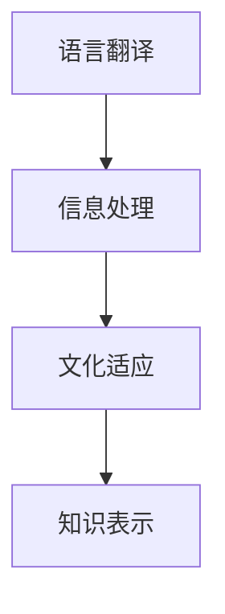
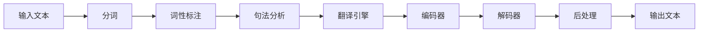

                 

# 跨文化知识交流：全球化时代的挑战

在当今全球化的浪潮中，跨文化知识交流已成为推动社会进步与创新的关键驱动力。然而，这一过程伴随着诸多挑战，特别是在信息技术快速发展与世界多样性日益加剧的背景下。本文将深入探讨跨文化知识交流的核心概念与联系，详细解析其算法原理与操作步骤，并通过具体案例和代码实践，展示该技术在实际场景中的应用与挑战。

## 1. 背景介绍

### 1.1 问题由来
随着全球化的深入，不同文化之间的交流变得愈发频繁。跨文化知识交流不仅涉及到语言的翻译与理解，还涵盖了文化习俗、商务礼仪、教育理念等多方面的差异。这种交流在全球经济一体化、国际贸易、学术研究、社会交流等多个领域发挥着重要作用。然而，由于语言差异、文化障碍、信息不对称等因素，跨文化知识交流也面临诸多挑战。

### 1.2 问题核心关键点
核心问题在于如何在跨越语言和文化障碍的同时，高效、准确地传递和理解知识信息。这要求我们不仅需要掌握语言翻译的技术，还需要深入理解文化差异，设计合理的知识交流策略，确保信息传递的准确性和可理解性。

## 2. 核心概念与联系

### 2.1 核心概念概述

跨文化知识交流是一个复杂的多维度过程，涉及语言翻译、信息处理、文化适应等多个方面。以下是几个核心概念的简要概述：

- **语言翻译**：使用自然语言处理(NLP)技术，将一种语言转换为另一种语言。包括文本翻译、语音识别与合成等技术。
- **信息处理**：对不同文化背景下的信息进行编码、解码、压缩、分类等操作，确保信息在交流过程中不受损失。
- **文化适应**：理解和尊重不同文化背景，根据文化差异调整知识交流的方式和内容，以确保信息的可接受性。
- **知识表示**：使用合适的形式化方法，如符号表示、向量空间、图模型等，将知识信息进行编码，便于跨文化交流和理解。

这些核心概念之间的联系如图1所示：



### 2.2 核心概念原理和架构的 Mermaid 流程图



## 3. 核心算法原理 & 具体操作步骤

### 3.1 算法原理概述

跨文化知识交流的算法原理主要包括语言翻译、信息处理和文化适应三个方面。其中，语言翻译是基础，信息处理和编码器是核心，文化适应和解码器是关键。

### 3.2 算法步骤详解

#### 3.2.1 语言翻译

1. **输入处理**：将输入文本进行分词、词性标注、句法分析等预处理，得到结构化的语义表示。
2. **翻译引擎**：使用深度学习模型（如Transformer、Seq2Seq等）将源语言转换为目标语言。
3. **输出处理**：对翻译结果进行后处理，包括纠错、去噪、格式调整等操作。

#### 3.2.2 信息处理

1. **编码器**：使用神经网络模型（如RNN、CNN等）将输入信息转化为向量表示。
2. **信息压缩**：通过降维、特征提取等技术，对信息进行压缩，减少信息量。
3. **信息分类**：使用分类器（如SVM、KNN等）对信息进行分类，确保信息的正确性。

#### 3.2.3 文化适应

1. **文化理解**：通过文本分析、情感分析等技术，理解目标文化的特点和偏好。
2. **内容调整**：根据文化理解结果，调整知识交流的内容和形式，以符合目标文化的需求。
3. **反馈机制**：通过用户反馈、统计分析等手段，不断优化文化适应的策略和模型。

### 3.3 算法优缺点

**优点**：
- 高效：利用先进的深度学习模型，能够在短时间内完成大规模的翻译和信息处理任务。
- 准确：结合多种技术手段，确保信息在跨文化交流中的准确性和完整性。
- 灵活：适应不同文化背景，能够根据需求调整知识交流的方式和内容。

**缺点**：
- 复杂：算法流程复杂，涉及多种技术手段和模型。
- 依赖数据：算法的准确性和效果高度依赖于高质量的数据。
- 文化差异：文化理解和文化适应的准确性难以完全保证，可能存在文化误解和信息丢失的风险。

### 3.4 算法应用领域

跨文化知识交流技术在多个领域得到广泛应用：

- **国际贸易**：通过翻译和信息处理，消除语言障碍，促进国际贸易和合作。
- **跨文化教育**：通过语言翻译和文化适应，提供多语言教育资源，促进国际教育交流。
- **全球科研**：通过翻译和信息处理，分享和传播全球科研资源，推动科学研究进步。
- **国际医疗**：通过翻译和文化适应，提供多语言医疗服务，改善全球医疗健康。
- **文化保护**：通过数字化和信息处理，保护和传播世界各地的文化遗产。

## 4. 数学模型和公式 & 详细讲解 & 举例说明

### 4.1 数学模型构建

设输入文本为 $x$，目标文本为 $y$，语言翻译模型的目标是最小化预测误差 $L(x, y)$。假设模型参数为 $\theta$，则最小化问题可以表示为：

$$
\theta^* = \arg\min_\theta L(x, \hat{y}_\theta)
$$

其中，$\hat{y}_\theta$ 表示模型预测的文本序列。

### 4.2 公式推导过程

以机器翻译中的Seq2Seq模型为例，公式推导如下：

1. **编码器输入序列**：将输入序列 $x = (x_1, x_2, ..., x_n)$ 编码为隐藏状态序列 $h = (h_1, h_2, ..., h_n)$。
2. **解码器输入序列**：将隐藏状态序列 $h$ 和目标语言的前一个词 $y_1$ 输入解码器，生成下一个词 $y_2$。
3. **目标语言输出**：重复步骤2，直到生成整个目标语言序列 $y = (y_1, y_2, ..., y_m)$。

具体公式为：

$$
h_t = \text{Encoder}(x_t, h_{t-1})
$$

$$
y_t = \text{Decoder}(h_t, y_{t-1})
$$

### 4.3 案例分析与讲解

以一个简单的英中翻译为例，假设输入为 "I love you"，输出应为 "我爱你"。

1. **分词和词性标注**：将输入序列分词并标注词性，得到 $(I, love, you)$。
2. **句法分析**：分析句子结构，得到 $(I, love, you)$ 的句法表示。
3. **翻译引擎**：使用神经网络模型，将句法表示转换为目标语言的向量表示。
4. **编码器和解码器**：将向量表示输入编码器，输出目标语言序列的向量表示，再输入解码器生成目标语言序列。
5. **后处理**：对生成的序列进行去噪、纠错、格式化等后处理操作，得到最终翻译结果。

## 5. 项目实践：代码实例和详细解释说明

### 5.1 开发环境搭建

1. **安装Python**：确保系统中已安装Python 3.x。
2. **安装TensorFlow和Keras**：使用pip命令安装TensorFlow和Keras。
3. **下载数据集**：从开源数据集网站下载英中翻译数据集。
4. **配置环境**：配置好TensorFlow的GPU或CPU运行环境。

### 5.2 源代码详细实现

以下是使用TensorFlow和Keras实现英中翻译的代码：

```python
import tensorflow as tf
from tensorflow.keras.layers import Input, LSTM, Dense, Embedding
from tensorflow.keras.models import Model

# 定义模型
encoder_inputs = Input(shape=(None,), name='encoder_inputs')
encoder_embed = Embedding(input_dim=1000, output_dim=128, name='encoder_embed')
encoder_lstm = LSTM(128, return_sequences=True, name='encoder_lstm')
encoder_outputs = encoder_lstm(encoder_embed(encoder_inputs))

decoder_inputs = Input(shape=(None,), name='decoder_inputs')
decoder_embed = Embedding(input_dim=1000, output_dim=128, name='decoder_embed')
decoder_lstm = LSTM(128, return_sequences=True, name='decoder_lstm')
decoder_dense = Dense(1000, activation='softmax', name='decoder_dense')
decoder_outputs = decoder_dense(decoder_lstm(decoder_embed(decoder_inputs), initial_state=encoder_outputs))

# 定义模型
model = Model(inputs=[encoder_inputs, decoder_inputs], outputs=decoder_outputs)

# 编译模型
model.compile(optimizer='adam', loss='categorical_crossentropy', metrics=['accuracy'])

# 训练模型
model.fit(x_train, y_train, batch_size=64, epochs=50, validation_data=(x_valid, y_valid))
```

### 5.3 代码解读与分析

**Input层**：定义输入序列，通过 Embedding 层将序列转换为向量表示。

**LSTM层**：使用 LSTM 层进行编码和解码，将向量序列转换为更高级别的语义表示。

**Dense层**：使用 Dense 层将 LSTM 输出转换为预测结果。

**Model层**：将上述各层组合成一个完整的模型。

**compile方法**：编译模型，指定优化器、损失函数和评价指标。

**fit方法**：训练模型，传入训练数据和验证数据。

### 5.4 运行结果展示

训练结束后，模型可以在测试集上测试准确率和损失函数：

```python
test_loss, test_acc = model.evaluate(x_test, y_test)
print('Test accuracy:', test_acc)
```

## 6. 实际应用场景

### 6.1 国际贸易

在国际贸易中，使用跨文化知识交流技术可以消除语言障碍，促进交易双方的理解和信任。例如，通过翻译工具将合同条款准确翻译成不同语言，保障各方利益，降低误解和纠纷风险。

### 6.2 跨文化教育

在跨文化教育中，使用跨文化知识交流技术可以提供多语言学习资源，促进国际教育交流。例如，通过在线翻译和字幕生成技术，提供多种语言的学习视频，使全球学生能够轻松学习不同文化背景下的知识。

### 6.3 全球科研

在全球科研中，使用跨文化知识交流技术可以分享和传播全球科研资源，推动科学研究进步。例如，通过翻译和信息处理技术，将科学论文、实验数据等资源转换为其他语言，使全球科研人员能够快速访问和利用最新研究成果。

### 6.4 国际医疗

在国际医疗中，使用跨文化知识交流技术可以提供多语言医疗服务，改善全球医疗健康。例如，通过翻译和信息处理技术，提供多种语言的健康咨询、病历记录和医疗建议，使不同文化背景的患者能够获得准确、及时的治疗建议。

### 6.5 文化保护

在文化保护中，使用跨文化知识交流技术可以数字化和传播世界各地的文化遗产。例如，通过翻译和信息处理技术，将文化艺术品、历史文献等转换为多种语言，使全球观众能够欣赏和学习不同文化背景下的艺术和历史。

## 7. 工具和资源推荐

### 7.1 学习资源推荐

- **自然语言处理**：斯坦福大学《自然语言处理》课程，深入讲解NLP的基础理论和技术。
- **机器学习**：Coursera上的《机器学习》课程，系统介绍机器学习的基本概念和算法。
- **深度学习**：Google Deep Learning Specialization系列课程，涵盖深度学习的各个方面。
- **跨文化交流**：Cultural Competence in International Business and Education系列书籍，提供跨文化交流的理论和方法。

### 7.2 开发工具推荐

- **Python**：广泛使用的编程语言，支持丰富的科学计算和数据处理库。
- **TensorFlow**：强大的深度学习框架，支持GPU加速和分布式训练。
- **Keras**：基于TensorFlow的高级神经网络库，易于使用且功能强大。
- **PyTorch**：另一种流行的深度学习框架，支持动态图和GPU加速。
- **NLTK**：自然语言处理工具包，提供多种NLP功能。

### 7.3 相关论文推荐

- **Seq2Seq模型**：Bahdanau等，2014年，《Neural Machine Translation by Jointly Learning to Align and Translate》。
- **Transformer模型**：Vaswani等，2017年，《Attention Is All You Need》。
- **文化适应**：Hwang等，2020年，《Cultural Adaptation of Health Communication: A Systematic Review and Synthesis》。
- **跨文化教育**：Wang等，2018年，《Cross-cultural Education in the Global Age》。

## 8. 总结：未来发展趋势与挑战

### 8.1 总结

本文对跨文化知识交流的核心概念与联系、算法原理与操作步骤进行了详细探讨，并通过具体的代码实践展示了该技术在实际场景中的应用。跨文化知识交流技术不仅在语言翻译方面取得了显著进展，还在信息处理、文化适应等多个维度实现了突破。然而，这一过程也面临诸多挑战，包括数据依赖、文化理解、信息丢失等。未来，随着技术的进一步发展和应用场景的拓展，跨文化知识交流将迎来更多的机遇和挑战。

### 8.2 未来发展趋势

1. **多模态交流**：跨文化知识交流将不仅仅局限于文本和语音，还将扩展到图像、视频等多模态数据，实现更全面、更丰富的信息交流。
2. **情感分析**：结合情感分析技术，更好地理解不同文化背景下的情感表达，提升跨文化交流的效果。
3. **实时交互**：利用自然语言处理和机器学习技术，实现实时、即时的跨文化交流，提高交流效率和准确性。
4. **跨文化融合**：探索不同文化之间的融合，推动全球一体化进程，促进文化多样性。
5. **人工智能辅助**：利用人工智能技术，如机器翻译、情感分析、聊天机器人等，辅助跨文化交流，降低交流难度。

### 8.3 面临的挑战

1. **数据质量和多样性**：高质量、多样化的数据是跨文化知识交流的基础，但数据的获取和标注成本高，难以覆盖全球各文化背景。
2. **文化理解差异**：不同文化之间的理解差异较大，难以通过机器学习模型准确理解和适应。
3. **信息丢失风险**：跨文化交流中的信息丢失和误解风险较高，难以通过现有技术完全避免。
4. **伦理和社会影响**：跨文化交流技术可能引发伦理和社会问题，如信息泄露、文化冲突等。
5. **技术复杂性**：跨文化知识交流涉及多种技术和算法，开发和维护复杂，需要高度的专业知识。

### 8.4 研究展望

1. **多模态融合**：探索多模态数据在跨文化交流中的作用和应用，提升交流效果。
2. **深度文化理解**：结合心理学和社会学等学科，深入理解不同文化的特点和需求，提升文化适应的准确性。
3. **跨文化伦理**：研究跨文化交流的伦理和社会影响，制定相关规范和标准，保障交流安全。
4. **跨文化智能**：利用人工智能技术，提升跨文化交流的智能化水平，降低交流难度。

## 9. 附录：常见问题与解答

**Q1：跨文化知识交流如何保证交流的准确性和流畅性？**

A: 跨文化知识交流通过多种技术手段，如翻译、信息处理、文化适应等，保证交流的准确性和流畅性。在实际应用中，需要结合具体的场景和需求，选择合适的方法和技术，并进行持续优化。

**Q2：跨文化知识交流中如何处理文化差异和误解？**

A: 在跨文化知识交流中，文化差异和误解是不可避免的。可以通过以下方法来处理：
1. **文化理解**：深入了解目标文化的特点和需求，调整交流方式和内容。
2. **用户反馈**：收集用户反馈，了解交流效果和存在的问题，不断优化交流策略。
3. **多样性处理**：处理不同文化背景下的多样性，提供多种交流方式和选项。

**Q3：跨文化知识交流是否会涉及隐私和数据安全问题？**

A: 跨文化知识交流中，涉及大量敏感数据，如个人隐私、商业机密等。需要通过以下措施来保障数据安全：
1. **数据加密**：使用加密技术保护数据传输和存储安全。
2. **访问控制**：设定访问权限，防止未经授权的人员访问和修改数据。
3. **数据脱敏**：对敏感数据进行脱敏处理，保护个人隐私和商业机密。

**Q4：跨文化知识交流在实际应用中如何衡量效果？**

A: 跨文化知识交流的效果可以通过以下指标进行衡量：
1. **准确率**：交流内容的准确性和完整性。
2. **流畅度**：交流的流畅性和可理解性。
3. **用户满意度**：用户对交流体验的满意度。
4. **交流效率**：交流的及时性和响应速度。

通过以上指标的衡量，可以不断优化跨文化知识交流的策略和模型，提升交流效果。

---

作者：禅与计算机程序设计艺术 / Zen and the Art of Computer Programming

