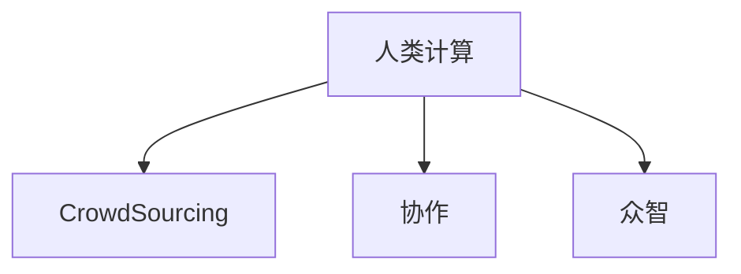
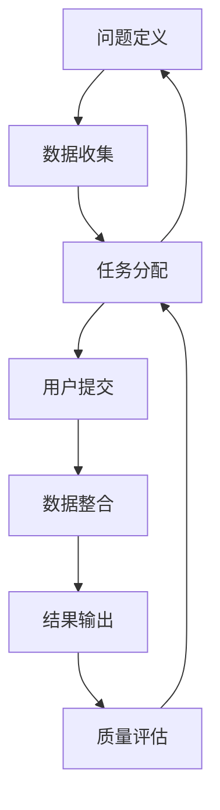

                 

# 跨越学科边界：人类计算的多元化应用

## 1. 背景介绍

### 1.1 问题由来
随着科技的迅猛发展和人工智能的崛起，人类计算的概念已经从传统的计算机科学领域扩展到更广泛的跨学科领域。人工智能与量子计算、神经科学、生物信息学等领域的交叉融合，推动了新一轮的技术创新和应用变革。

人类计算（Human Computation）是一种利用人类的认知能力、计算能力和知识背景，通过众包、协作、众智等形式，解决复杂问题的新范式。这一范式打破了传统计算模式的局限，能够高效处理高度复杂、数据密集、难以自动化的问题。

本文将探讨人类计算的多元化应用，重点从跨学科的角度，分析人类计算的优势、挑战和未来发展方向。

### 1.2 问题核心关键点
人类计算的核心关键点在于，它能够充分利用人类的智慧和创造力，以创新的方式解决复杂的计算问题。与传统计算相比，人类计算的优势在于：
- 高度灵活：能够处理各种复杂的非结构化数据，如文本、图像、语音等。
- 高效协作：通过众包平台和协作工具，将问题拆分成小任务，由众多用户协同解决。
- 创新思维：能够引入人类专家的知识背景和领域经验，带来新的视角和方法。
- 适用性强：对于高度复杂的问题，如疾病预测、社会治理等，传统计算难以有效处理，人类计算则提供了一种新的解决方案。

然而，人类计算也面临诸多挑战，包括：
- 数据隐私：跨学科合作可能涉及敏感数据的共享和处理，需要严格的数据隐私保护。
- 认知偏差：不同领域专家可能存在认知偏差，影响计算结果的公正性和准确性。
- 标准化困难：不同领域和学科之间的数据格式、知识体系、计算方法差异较大，难以统一标准化。
- 动态适应：随着问题环境的不断变化，人类计算方法需要快速动态适应。

## 2. 核心概念与联系

### 2.1 核心概念概述

要全面理解人类计算的多元化应用，首先需要明确几个核心概念：

- **人类计算**：利用人类智慧和创造力解决复杂计算问题的新范式。包括众包、协作、众智等形式。
- **众包**：通过网络平台将任务拆分为小任务，由众多用户共同完成。常见平台如Amazon Mechanical Turk (MTurk)、CrowdFlower等。
- **协作**：多个人在同一个任务上共同工作，分享信息和资源，协同完成目标。常见工具如Slack、Google Docs等。
- **众智**：利用集体智慧和专业知识解决复杂问题，如专家咨询、知识图谱构建等。

这些概念之间通过一个综合框架联系起来：



### 2.2 核心概念原理和架构的 Mermaid 流程图



此流程图展示了人类计算的基本流程：
1. **问题定义**：明确计算问题及其目标。
2. **数据收集**：收集相关数据，准备计算所需。
3. **任务分配**：将问题拆分成小任务，分配给用户或专家。
4. **用户提交**：用户完成任务并提交结果。
5. **数据整合**：整合所有提交结果，生成最终输出。
6. **结果输出**：输出最终计算结果，供用户或决策者使用。
7. **质量评估**：评估结果质量，并进行反馈优化。

这些步骤构成了一个闭环的反馈系统，确保了计算过程的可控性和持续优化。

## 3. 核心算法原理 & 具体操作步骤

### 3.1 算法原理概述

人类计算的算法原理主要基于分布式计算和集体智慧的结合。具体来说，人类计算算法包括以下几个关键步骤：

1. **问题分解**：将复杂问题拆分为多个可独立解决的子问题。
2. **任务分配**：将子问题分配给不同的用户或专家，确保任务难度和规模合理。
3. **数据收集与整合**：收集所有用户的输入和结果，并进行数据整合，生成统一的结果格式。
4. **质量评估**：通过用户评价、专家评审等方式，评估结果的质量和一致性。
5. **反馈优化**：根据评估结果，对问题定义、任务分配等进行优化调整。

### 3.2 算法步骤详解

以疾病预测为例，展示人类计算的具体操作步骤：

1. **问题定义**：确定需要预测的疾病类型（如癌症、心脏病）。
2. **数据收集**：收集相关医疗数据，包括病历、基因数据、环境因素等。
3. **任务分配**：将数据集分配给不同的用户或专家，每个用户负责处理一部分数据。
4. **用户提交**：每个用户根据分配到的数据进行预测，提交预测结果。
5. **数据整合**：将所有预测结果汇总，生成总体预测报告。
6. **质量评估**：通过专家评审和用户反馈，评估预测报告的准确性和一致性。
7. **反馈优化**：根据评估结果，对数据集、任务分配等进行调整，优化后续预测。

### 3.3 算法优缺点

人类计算的优点在于：
- 灵活性高：能够处理各种复杂问题，特别是不规则、非结构化数据。
- 适应性强：随着问题环境的不断变化，可以灵活调整计算策略。
- 创新性强：引入专家智慧和专业知识，带来新的解决方案。

但同时也存在一些缺点：
- 效率较低：需要大量人力和时间进行数据收集、任务分配和结果整合。
- 质量控制难：不同用户和专家的预测结果可能存在差异，难以统一标准。
- 隐私问题：数据共享可能涉及敏感信息，需要严格的数据隐私保护。

### 3.4 算法应用领域

人类计算已在多个领域得到了广泛应用，包括：

- **医疗健康**：疾病预测、基因分析、药物设计等。通过众包平台，将复杂医疗数据分解为小任务，由众多用户共同完成。
- **科学研究**：科学实验设计、数据标注、知识图谱构建等。利用协作工具，集思广益，快速解决问题。
- **社会科学**：社会调查、舆情分析、公共政策研究等。通过众包和协作，收集大量社会数据，进行深度分析。
- **环境保护**：物种识别、生态系统监测、气候变化研究等。利用众包平台，对大量环境数据进行分类和标注。
- **艺术创作**：设计创作、音乐创作、游戏开发等。通过众包和协作，激发创意，提升作品多样性。

## 4. 数学模型和公式 & 详细讲解 & 举例说明

### 4.1 数学模型构建

人类计算的数学模型通常基于概率模型和统计模型。以疾病预测为例，假设我们有一组医疗数据 $D=\{(x_i, y_i)\}_{i=1}^N$，其中 $x_i$ 为患者特征向量，$y_i$ 为疾病标签。

我们可以使用以下数学模型来描述人类计算的过程：

1. **特征提取**：将患者特征向量 $x_i$ 映射为高维特征表示 $z_i$。
2. **概率预测**：使用概率模型 $P(y|z_i)$ 预测每个患者 $i$ 的疾病标签 $y_i$。
3. **结果合并**：将每个用户的预测结果合并，得到总体预测结果 $y$。

### 4.2 公式推导过程

假设我们使用了线性回归模型，即 $P(y|z_i) = \sigma(\theta \cdot z_i + b)$，其中 $\sigma$ 为 sigmoid 函数，$\theta$ 和 $b$ 为模型参数。

对于每个患者 $i$，其预测标签 $y_i$ 为：
$$
y_i = \sigma(\theta \cdot z_i + b)
$$

假设共有 $K$ 个用户，其预测结果分别为 $y_{i1}, y_{i2}, ..., y_{iK}$，则总体预测结果 $y$ 为：
$$
y = \frac{1}{K} \sum_{k=1}^K y_{ik}
$$

### 4.3 案例分析与讲解

以疾病预测为例，我们收集了 $N=1000$ 名患者的基因数据，每个患者有 $d=100$ 个基因特征。我们通过线性回归模型对这些基因数据进行预测，每个用户负责处理一部分数据。

假设共有 $K=10$ 个用户，每个用户处理 $N/K=100$ 个患者数据。每个用户提交的预测结果分别为 $y_{i1}, y_{i2}, ..., y_{iK}$，则总体预测结果为：
$$
y = \frac{1}{10} \sum_{k=1}^{10} y_{ik}
$$

## 5. 项目实践：代码实例和详细解释说明

### 5.1 开发环境搭建

开发人类计算项目，需要准备以下开发环境：

1. **编程语言**：Python、R等。
2. **数据平台**：Hadoop、Spark等大数据处理平台。
3. **协作工具**：Amazon MTurk、CrowdFlower等。
4. **分析工具**：Excel、Tableau等。
5. **代码托管**：GitHub、Bitbucket等。

### 5.2 源代码详细实现

以下是一个使用Python进行疾病预测的示例代码：

```python
from sklearn.linear_model import LogisticRegression
import pandas as pd

# 加载数据
data = pd.read_csv('patient_data.csv')

# 特征提取
X = data[['gene1', 'gene2', 'gene3', ...]]  # 基因特征
y = data['disease']  # 疾病标签

# 训练模型
model = LogisticRegression()
model.fit(X, y)

# 预测结果
predictions = model.predict(X)

# 保存结果
results = {'predictions': predictions.tolist()}
with open('predictions.json', 'w') as f:
    json.dump(results, f)
```

### 5.3 代码解读与分析

- **数据加载**：使用pandas加载CSV格式的数据。
- **特征提取**：提取基因特征作为输入数据。
- **模型训练**：使用Logistic Regression模型进行训练。
- **预测结果**：对测试数据进行预测，生成预测结果。
- **结果保存**：将预测结果保存为JSON格式。

## 6. 实际应用场景

### 6.1 医疗健康

在医疗健康领域，人类计算已广泛应用于疾病预测、基因分析、药物设计等。通过众包平台，将复杂医疗数据分解为小任务，由众多用户共同完成。例如，通过众包平台收集癌症患者的数据，将数据拆分为多个小任务，由众多用户对每个患者进行基因分析，最后整合结果生成总体预测报告。

### 6.2 科学研究

科学研究中，人类计算可应用于科学实验设计、数据标注、知识图谱构建等。例如，通过协作工具，收集不同学科专家的意见，对实验设计进行优化。或通过众包平台，对大规模科学数据进行标注，构建知识图谱。

### 6.3 社会科学

社会科学领域中，人类计算可用于社会调查、舆情分析、公共政策研究等。例如，通过众包平台收集大规模社会调查数据，进行深度分析，生成舆情报告。或通过协作工具，对公共政策进行专家评审，优化政策设计。

### 6.4 环境保护

环境保护领域中，人类计算可用于物种识别、生态系统监测、气候变化研究等。例如，通过众包平台，对大量环境数据进行分类和标注，构建环境监测系统。

### 6.5 艺术创作

艺术创作领域中，人类计算可用于设计创作、音乐创作、游戏开发等。例如，通过众包平台，集思广益，激发创意，提升作品多样性。

## 7. 工具和资源推荐

### 7.1 学习资源推荐

1. **《人类计算：创新与未来》**：介绍人类计算的基本概念和应用场景。
2. **Coursera上的《Human Computation》课程**：讲解人类计算的核心方法和应用实例。
3. **IEEE Transactions on Human-Computer Interaction**：发表关于人类计算的研究论文和案例。
4. **人类计算学会（Human Computation Society）**：提供最新的人类计算研究动态和社区资源。
5. **Crowdsourcing in Public Health**：探讨人类计算在公共卫生中的应用。

### 7.2 开发工具推荐

1. **Amazon Mechanical Turk (MTurk)**：领先的众包平台，提供丰富任务类型和用户资源。
2. **CrowdFlower**：另一个著名的众包平台，提供自动化任务管理和用户审核功能。
3. **Slack**：协作工具，方便团队成员进行实时沟通和任务分配。
4. **Google Docs**：协作文档工具，支持多人共同编辑和数据整合。
5. **Jupyter Notebook**：数据科学和协作工具，支持代码编写和结果展示。

### 7.3 相关论文推荐

1. **《Crowdsourcing for Healthcare: A Survey and Outlook》**：综述了人类计算在医疗健康领域的应用。
2. **《Human Computation: Concepts, Applications, and Future Directions》**：探讨人类计算的理论基础和应用前景。
3. **《Collaborative Filtering for Crowdsourced Data in the Sciences》**：讨论了人类计算在科学研究中的应用。
4. **《Human Computation for Public Health: A Survey》**：介绍了人类计算在公共卫生中的应用。
5. **《Crowdsourcing for Model Selection and Design》**：探讨了人类计算在模型选择和设计中的应用。

## 8. 总结：未来发展趋势与挑战

### 8.1 研究成果总结

本文系统介绍了人类计算的基本概念、核心算法和具体操作步骤，探讨了其在医疗健康、科学研究、社会科学、环境保护和艺术创作等领域的广泛应用。同时，分析了人类计算的优缺点和未来发展方向。

### 8.2 未来发展趋势

未来人类计算将呈现以下几个发展趋势：
1. **自动化程度提高**：随着人工智能和机器学习技术的发展，自动标注、自动化任务分配等技术将不断提升。
2. **数据质量提升**：大数据技术和深度学习技术的应用，将进一步提升数据的准确性和可靠性。
3. **跨领域融合**：人类计算将更多地与其他学科和技术融合，如人工智能、区块链等，带来新的应用场景和解决方案。
4. **隐私保护加强**：随着数据隐私保护的法律法规不断完善，隐私保护技术将不断提升。
5. **全球协作加强**：全球范围内的协作和资源共享将进一步促进人类计算的发展。

### 8.3 面临的挑战

尽管人类计算具备诸多优点，但仍然面临以下挑战：
1. **数据隐私保护**：数据共享可能涉及敏感信息，需要严格的数据隐私保护。
2. **任务分配和结果整合**：任务分配和结果整合的标准化难度较大，需要新的技术和工具。
3. **质量控制**：不同用户和专家的预测结果可能存在差异，难以统一标准。
4. **技术复杂性**：人类计算需要多学科知识和技术支持，技术实现复杂性较高。

### 8.4 研究展望

未来研究需要在以下几个方面进行突破：
1. **自动化技术**：开发自动化标注、任务分配和结果整合技术，提升效率和精度。
2. **数据隐私保护**：开发数据隐私保护技术，确保数据共享的安全性。
3. **标准化技术**：建立跨学科的标准化体系，提升任务分配和结果整合的规范性。
4. **跨领域融合**：加强与其他学科和技术的融合，拓展应用场景和解决方案。
5. **模型优化**：开发更高效的数学模型和算法，提升计算效率和准确性。

## 9. 附录：常见问题与解答

**Q1: 人类计算和传统计算有何区别？**

A: 人类计算与传统计算的区别主要在于：
1. 利用人类智慧和创造力：人类计算能够处理复杂、非结构化的问题，而传统计算依赖算法和规则。
2. 高度灵活性和适应性：人类计算能够灵活适应问题环境的变化，而传统计算难以快速调整。
3. 需要数据和人力的双重投入：人类计算需要大量数据和人力参与，而传统计算依靠计算资源。

**Q2: 如何提高人类计算的质量？**

A: 提高人类计算的质量需要从以下几个方面进行优化：
1. 数据收集和清洗：确保数据的高质量和完整性。
2. 任务分配和激励机制：设计合理的任务分配机制和激励机制，确保用户和专家的积极性。
3. 结果评估和反馈：建立科学的评估标准和反馈机制，及时发现和修正问题。
4. 标准化和规范化：建立统一的标准化体系，提升任务分配和结果整合的规范性。

**Q3: 人类计算有哪些典型的应用案例？**

A: 人类计算的典型应用案例包括：
1. **疾病预测**：通过众包平台收集医疗数据，进行疾病预测和基因分析。
2. **科学研究**：通过协作工具和众包平台，进行科学实验设计和数据标注。
3. **社会科学**：通过众包平台和协作工具，进行社会调查和舆情分析。
4. **环境保护**：通过众包平台，进行物种识别和生态系统监测。
5. **艺术创作**：通过众包平台和协作工具，进行设计创作和音乐创作。

**Q4: 人类计算面临哪些挑战？**

A: 人类计算面临的主要挑战包括：
1. 数据隐私保护：数据共享可能涉及敏感信息，需要严格的数据隐私保护。
2. 任务分配和结果整合：任务分配和结果整合的标准化难度较大，需要新的技术和工具。
3. 质量控制：不同用户和专家的预测结果可能存在差异，难以统一标准。
4. 技术复杂性：人类计算需要多学科知识和技术支持，技术实现复杂性较高。

**Q5: 人类计算的未来发展方向是什么？**

A: 人类计算的未来发展方向包括：
1. 自动化技术：开发自动化标注、任务分配和结果整合技术，提升效率和精度。
2. 数据隐私保护：开发数据隐私保护技术，确保数据共享的安全性。
3. 标准化技术：建立跨学科的标准化体系，提升任务分配和结果整合的规范性。
4. 跨领域融合：加强与其他学科和技术的融合，拓展应用场景和解决方案。
5. 模型优化：开发更高效的数学模型和算法，提升计算效率和准确性。

作者：禅与计算机程序设计艺术 / Zen and the Art of Computer Programming

