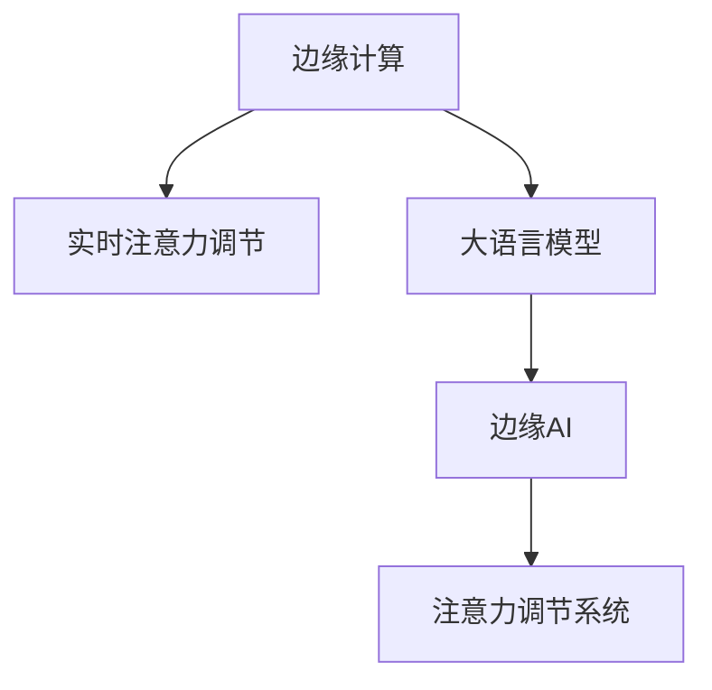

                 

# 边缘AI在实时注意力调节中的作用

## 1. 背景介绍

在当今信息爆炸的时代，实时注意力调节技术在决策支持、智能推荐、智能控制等领域具有广泛的应用前景。为了提升用户交互体验，实时注意力调节系统需要能够快速响应用户的注意力变化，从而及时调整显示内容、推荐对象等，提升信息呈现的个性化和智能化。

大语言模型等深度学习技术，已在文本生成、理解、推理等任务上取得显著成效。然而，当应用于实时注意力调节时，需要考虑模型在计算效率、推理速度、资源占用等方面的性能。此时，边缘计算与大语言模型的结合，成为一种有效的方式。

边缘计算是一种将数据处理、存储、分析等计算任务分布到靠近数据源的设备上进行的技术，以减少网络传输延迟，提高计算效率。结合边缘AI，即在边缘设备上部署智能模型，能够在不增加网络负担的情况下，对用户行为进行分析，快速响应用户的注意力变化，实现实时调节。

本文将详细探讨边缘AI在实时注意力调节中的作用，涵盖关键概念、技术原理、实现方法以及实际应用场景等方面。

## 2. 核心概念与联系

### 2.1 核心概念概述

为了更好地理解边缘AI在实时注意力调节中的应用，我们需要首先了解以下几个关键概念：

- **边缘计算（Edge Computing）**：指在靠近数据源的设备（如移动设备、智能家居、工业传感器等）上执行计算任务，以降低网络延迟和带宽需求。
- **实时注意力调节（Real-time Attention Regulation）**：指根据用户当前的行为、情感状态等实时信息，动态调整显示内容、推荐结果等，提升用户体验。
- **大语言模型（Large Language Model）**：指通过大规模数据训练得到的通用语言处理模型，能够理解和生成自然语言，应用于文本生成、情感分析、问答等任务。
- **边缘AI（Edge AI）**：指在边缘设备上部署AI模型，进行数据处理、智能推理等任务，以提高计算效率和响应速度。

这些概念之间的逻辑关系可以通过以下Mermaid流程图来展示：



这个流程图展示了几类关键概念及其之间的关系：

1. 边缘计算提供了一个分布式的计算环境，靠近数据源执行计算任务。
2. 实时注意力调节技术需要快速响应用户行为，边缘计算能够显著降低延迟。
3. 大语言模型提供通用的语言处理能力，应用于用户行为分析。
4. 边缘AI在边缘设备上部署AI模型，进行推理计算，提升实时性。

这些概念共同构成了边缘AI在实时注意力调节中的工作原理和实现基础。

## 3. 核心算法原理 & 具体操作步骤

### 3.1 算法原理概述

边缘AI在实时注意力调节中的应用，主要通过以下几个关键步骤来实现：

1. **用户行为分析**：利用大语言模型对用户的行为、情感、语义等信息进行分析，理解用户的当前需求和偏好。
2. **注意力模型推理**：在边缘设备上，利用训练好的注意力模型对用户行为进行分析，预测用户下一步的注意力变化。
3. **实时调节**：根据注意力模型推理结果，动态调整显示内容、推荐结果等，满足用户实时需求。

这些步骤的实现依赖于高效的算法和模型设计，以及对边缘计算环境的优化。

### 3.2 算法步骤详解

#### 3.2.1 用户行为分析

用户行为分析的目的是从大量的用户交互数据中，提取用户的行为模式、偏好等信息。常用的技术手段包括：

- **文本分析**：通过分析用户的聊天记录、邮件、社交媒体等文本数据，提取情感倾向、兴趣点等信息。
- **行为轨迹分析**：通过跟踪用户的浏览记录、点击行为等，构建用户的行为轨迹模型，识别出用户的行为模式。

具体的实现流程如下：

1. **数据收集**：收集用户的历史行为数据，包括聊天记录、浏览记录、购物记录等。
2. **数据预处理**：对数据进行清洗、去重、标注等预处理操作，构建训练数据集。
3. **模型训练**：利用大语言模型对标注数据进行训练，学习用户行为模式。

#### 3.2.2 注意力模型推理

注意力模型推理的目的是根据用户当前的行为和历史行为，预测用户下一步的注意力变化。常用的注意力模型包括：

- **注意力机制（Attention Mechanism）**：通过计算输入数据之间的相关性，聚焦于重要部分，忽略次要部分。
- **自注意力模型（Self-Attention）**：在输入序列内，通过计算不同位置之间的相似度，进行信息汇聚和筛选。
- **双向注意力模型（Bi-Attention）**：结合前向和后向注意力机制，考虑序列的前后关系。

具体的实现流程如下：

1. **模型构建**：选择适合的注意力模型，在边缘设备上搭建推理模型。
2. **模型部署**：将训练好的模型部署到边缘设备上，进行实时推理计算。
3. **结果解析**：解析推理结果，提取用户注意力变化的方向和强度。

#### 3.2.3 实时调节

实时调节的目的是根据注意力模型推理结果，动态调整显示内容、推荐结果等，提升用户体验。常用的技术手段包括：

- **动态调整显示**：根据用户注意力变化，动态调整UI界面元素的位置、大小、样式等。
- **智能推荐**：根据用户注意力焦点，推荐相关的商品、新闻、视频等。
- **语音交互**：在智能家居、车载等场景下，通过语音指令响应用户的注意力变化。

具体的实现流程如下：

1. **显示内容调整**：根据用户注意力焦点，动态调整UI界面元素。
2. **推荐内容调整**：根据用户注意力变化，动态调整推荐结果。
3. **语音交互响应**：在语音交互场景下，实时响应用户的语音指令。

### 3.3 算法优缺点

#### 3.3.1 优点

边缘AI在实时注意力调节中的优点包括：

- **计算效率高**：边缘计算靠近数据源，减少了网络传输延迟，提升了计算效率。
- **实时性强**：通过在边缘设备上进行实时推理，能够快速响应用户的注意力变化。
- **隐私保护好**：边缘计算的数据处理在本地设备上完成，减少了数据传输的风险。

#### 3.3.2 缺点

边缘AI在实时注意力调节中的缺点包括：

- **资源限制**：边缘设备计算资源有限，可能无法处理大规模数据和复杂模型。
- **模型训练成本高**：边缘设备上模型训练需要较高的计算资源和存储空间。
- **模型更新难度大**：边缘设备上的模型更新需要较高的技术门槛，且更新频率较低。

### 3.4 算法应用领域

边缘AI在实时注意力调节中的应用领域广泛，以下是几个典型的应用场景：

1. **智能家居**：通过分析用户的行为和偏好，动态调整智能家居设备的显示内容、亮度、温度等，提升用户体验。
2. **智能推荐系统**：在电商、视频、音乐等场景下，利用用户行为分析，实时推荐相关的商品、视频、音乐等。
3. **车载系统**：在车载导航、娱乐、安全等方面，利用用户注意力调节技术，提升驾驶体验和安全。
4. **智能客服**：通过分析用户的聊天记录和情感状态，动态调整客服的显示内容和回答策略，提升客户满意度。

## 4. 数学模型和公式 & 详细讲解 & 举例说明

### 4.1 数学模型构建

在实时注意力调节中，常用的数学模型包括：

- **注意力机制模型**：利用自注意力模型计算输入数据之间的相似度，聚焦于重要部分。
- **双向注意力模型**：结合前向和后向注意力机制，考虑序列的前后关系。

### 4.2 公式推导过程

#### 4.2.1 注意力机制模型

注意力机制模型的核心公式为：

$$
\text{Attention}(Q,K,V) = \text{Softmax}(\frac{QK^T}{\sqrt{d_k}})V
$$

其中，$Q$ 为查询向量，$K$ 为键向量，$V$ 为值向量，$d_k$ 为键向量的维度。

具体的计算流程如下：

1. **计算注意力权重**：通过计算查询向量 $Q$ 和键向量 $K$ 的点积，并除以 $\sqrt{d_k}$，得到注意力权重。
2. **加权求和**：将注意力权重与值向量 $V$ 进行加权求和，得到最终的注意力输出。

#### 4.2.2 双向注意力模型

双向注意力模型的核心公式为：

$$
\text{Bi-Attention}(Q,K_1,K_2,V_1,V_2) = \text{Softmax}(QK_1^T + QK_2^T)\text{Softmax}(QK_1^T - QK_2^T)V_1V_2
$$

其中，$Q$ 为查询向量，$K_1$ 和 $K_2$ 为键向量，$V_1$ 和 $V_2$ 为值向量。

具体的计算流程如下：

1. **计算前向注意力权重**：通过计算查询向量 $Q$ 和键向量 $K_1$ 的点积，并除以 $\sqrt{d_k}$，得到前向注意力权重。
2. **计算后向注意力权重**：通过计算查询向量 $Q$ 和键向量 $K_2$ 的点积，并除以 $\sqrt{d_k}$，得到后向注意力权重。
3. **加权求和**：将前向和后向注意力权重分别与值向量 $V_1$ 和 $V_2$ 进行加权求和，得到最终的注意力输出。

### 4.3 案例分析与讲解

#### 4.3.1 智能推荐系统

智能推荐系统是边缘AI在实时注意力调节中的典型应用之一。在电商平台上，智能推荐系统可以根据用户的浏览记录、购买记录、搜索记录等信息，实时推荐相关的商品。

具体实现流程如下：

1. **数据收集**：收集用户的浏览记录、购买记录、搜索记录等信息。
2. **用户行为分析**：利用大语言模型对用户行为数据进行分析，提取用户的兴趣点和偏好。
3. **推荐模型推理**：在边缘设备上，利用训练好的双向注意力模型，对用户行为进行分析，生成推荐结果。
4. **实时调节**：根据推荐结果，动态调整显示内容，推荐相关的商品。

#### 4.3.2 智能客服系统

智能客服系统是另一个典型的应用场景。在智能客服系统中，系统可以根据用户的聊天记录和情感状态，动态调整客服的显示内容和回答策略，提升客户满意度。

具体实现流程如下：

1. **数据收集**：收集用户的聊天记录、语音记录等信息。
2. **用户行为分析**：利用大语言模型对用户聊天记录进行分析，提取用户的情感状态和需求。
3. **注意力模型推理**：在边缘设备上，利用训练好的自注意力模型，对用户情感状态进行分析，生成注意力调节结果。
4. **实时调节**：根据注意力调节结果，动态调整客服的显示内容和回答策略。

## 5. 项目实践：代码实例和详细解释说明

### 5.1 开发环境搭建

在进行项目实践前，我们需要准备好开发环境。以下是使用Python进行TensorFlow开发的环境配置流程：

1. 安装Anaconda：从官网下载并安装Anaconda，用于创建独立的Python环境。

2. 创建并激活虚拟环境：
```bash
conda create -n tf-env python=3.8 
conda activate tf-env
```

3. 安装TensorFlow：根据CUDA版本，从官网获取对应的安装命令。例如：
```bash
pip install tensorflow
```

4. 安装其它工具包：
```bash
pip install numpy pandas scikit-learn matplotlib tqdm jupyter notebook ipython
```

完成上述步骤后，即可在`tf-env`环境中开始项目实践。

### 5.2 源代码详细实现

下面我们以推荐系统为例，给出使用TensorFlow实现的双向注意力模型的PyTorch代码实现。

首先，定义双向注意力模型的参数：

```python
import tensorflow as tf
from tensorflow.keras.layers import Input, Embedding, Dot, Concatenate, Dense, Lambda

# 定义双向注意力模型的参数
embedding_size = 128
num_heads = 8
d_model = embedding_size
d_k = d_v = d_model // num_heads
d_q = d_k

# 定义查询向量、键向量和值向量的维度
Q_dim = 128
K_dim = 128
V_dim = 128
```

然后，定义查询向量、键向量和值向量：

```python
# 定义查询向量、键向量和值向量的维度
Q_dim = 128
K_dim = 128
V_dim = 128

# 查询向量、键向量和值向量的嵌入层
Q = Input(shape=(None, Q_dim))
K = Input(shape=(None, K_dim))
V = Input(shape=(None, V_dim))
```

接着，定义注意力机制的计算过程：

```python
# 查询向量的投影层
Q项目的线性变换
Q = tf.keras.layers.Lambda(lambda x: x * tf.sqrt(d_k / d_q))(Q)

# 键向量的投影层
K项目的线性变换
K = tf.keras.layers.Lambda(lambda x: x * tf.sqrt(d_k / d_q))(K)

# 值向量的投影层
V项目的线性变换
V = tf.keras.layers.Lambda(lambda x: x * tf.sqrt(d_k / d_v))(V)

# 前向注意力计算
QK_dot = Dot(axes=[2, 1])([Q, K])
QK_dot = tf.keras.layers.Lambda(lambda x: x / tf.sqrt(d_k))(QueryK_dot)

# 前向注意力权重计算
attn_weights = tf.keras.layers.Lambda(lambda x: tf.nn.softmax(x))(QueryK_dot)

# 前向注意力输出计算
attn_output = Dot(axes=[2, 1])([attn_weights, V])
```

最后，定义双向注意力模型的输出：

```python
# 双向注意力计算
Q1 = tf.keras.layers.Lambda(lambda x: tf.concat([x, x], axis=-1))(Q)
Q2 = tf.keras.layers.Lambda(lambda x: tf.concat([x, x], axis=-1))(Q)

K1 = tf.keras.layers.Lambda(lambda x: tf.concat([x, x], axis=-1))(K)
K2 = tf.keras.layers.Lambda(lambda x: tf.concat([x, x], axis=-1))(K)

V1 = tf.keras.layers.Lambda(lambda x: tf.concat([x, x], axis=-1))(V)
V2 = tf.keras.layers.Lambda(lambda x: tf.concat([x, x], axis=-1))(V)

# 双向注意力输出计算
attn_output1 = Dot(axes=[2, 1])([Q1, K1])
attn_output1 = tf.keras.layers.Lambda(lambda x: x / tf.sqrt(d_k))(attn_output1)

attn_weights1 = tf.keras.layers.Lambda(lambda x: tf.nn.softmax(x))(attn_output1)
attn_output1 = Dot(axes=[2, 1])([attn_weights1, V1])

attn_output2 = Dot(axes=[2, 1])([Q2, K2])
attn_output2 = tf.keras.layers.Lambda(lambda x: x / tf.sqrt(d_k))(attn_output2)

attn_weights2 = tf.keras.layers.Lambda(lambda x: tf.nn.softmax(x))(attn_output2)
attn_output2 = Dot(axes=[2, 1])([attn_weights2, V2])

# 拼接输出
attention_output = tf.keras.layers.Concatenate(axis=-1)([attn_output1, attn_output2])
```

完成上述步骤后，即可在`tf-env`环境中开始双向注意力模型的项目实践。

### 5.3 代码解读与分析

让我们再详细解读一下关键代码的实现细节：

**Embedding层**：
- 定义了三个嵌入层，用于将查询向量、键向量和值向量进行映射到指定的维度。

**线性变换层**：
- 对查询向量、键向量和值向量进行了线性变换，以便进行后续的注意力计算。

**注意力计算层**：
- 利用点积计算查询向量与键向量的注意力权重。
- 将注意力权重进行softmax归一化，生成前向注意力权重。
- 利用前向注意力权重与值向量进行加权求和，生成前向注意力输出。

**双向注意力计算**：
- 对查询向量、键向量和值向量进行了拼接操作，以增强双向注意力计算的效果。
- 分别计算前向和后向注意力，并将结果进行拼接。

**拼接输出**：
- 将前向和后向注意力输出进行拼接，得到最终的注意力输出。

这些代码实现了双向注意力模型的基本功能，可以通过修改参数和调整模型结构，进一步优化模型的性能。

## 6. 实际应用场景

### 6.1 智能家居

在智能家居领域，实时注意力调节技术可以用于提升用户的智能家居体验。通过分析用户的居家行为、偏好等信息，动态调整家居设备的显示内容、亮度、温度等，满足用户的个性化需求。

具体应用场景包括：

- **灯光调节**：根据用户的活动区域和时间，动态调整灯光的亮度和颜色，提升用户的舒适度和安全性。
- **温度调节**：根据用户的居家行为，动态调整空调、暖气等的温度，提供舒适的居住环境。
- **设备控制**：根据用户的语音指令，动态控制智能音箱、智能电视等设备的显示和播放内容。

### 6.2 智能推荐系统

在智能推荐系统中，实时注意力调节技术可以用于提升推荐的个性化和时效性。通过分析用户的浏览记录、购买记录、搜索记录等信息，实时推荐相关的商品、视频、音乐等。

具体应用场景包括：

- **电商推荐**：根据用户的购物记录和浏览记录，实时推荐相关的商品，提升用户的购买转化率。
- **视频推荐**：根据用户的观看记录和搜索记录，实时推荐相关的视频，提升用户的观看体验。
- **音乐推荐**：根据用户的听歌记录和搜索记录，实时推荐相关的音乐，提升用户的听歌体验。

### 6.3 车载系统

在车载系统中，实时注意力调节技术可以用于提升驾驶安全和用户体验。通过分析用户的注意力变化，动态调整车载导航、娱乐、安全等功能的显示和响应，提升用户的驾驶体验。

具体应用场景包括：

- **导航调整**：根据用户的注意力变化，动态调整车载导航的显示和路线，提升驾驶安全性。
- **娱乐调整**：根据用户的注意力变化，动态调整车载音响的音量和播放内容，提升驾驶体验。
- **安全提醒**：根据用户的注意力变化，动态调整车载安全提醒的显示和响应，提升行车安全性。

### 6.4 智能客服系统

在智能客服系统中，实时注意力调节技术可以用于提升客服的响应速度和准确性。通过分析用户的聊天记录和情感状态，动态调整客服的显示内容和回答策略，提升客户满意度。

具体应用场景包括：

- **情感分析**：根据用户的聊天记录，动态分析用户的情感状态，调整客服的回答策略，提升客户满意度。
- **信息推送**：根据用户的聊天记录，动态推送相关的信息和提示，提升客服的响应速度。
- **界面调整**：根据用户的聊天记录，动态调整客服的界面显示，提升客户体验。

## 7. 工具和资源推荐

### 7.1 学习资源推荐

为了帮助开发者系统掌握边缘AI在实时注意力调节中的应用，这里推荐一些优质的学习资源：

1. **《TensorFlow教程》**：由TensorFlow官方提供的入门教程，详细介绍了TensorFlow的基本用法和应用场景。
2. **《深度学习入门》**：介绍深度学习的基本概念、模型设计和应用方法，适合初学者学习。
3. **《深度学习实战》**：通过实际项目案例，深入讲解深度学习的实现和应用，适合实战学习。
4. **《TensorFlow实战》**：详细讲解TensorFlow的各个组件和应用场景，适合深入学习。
5. **《TensorFlow中文社区》**：提供丰富的TensorFlow学习资料和社区支持，适合自学和交流。

通过这些学习资源的学习实践，相信你一定能够快速掌握边缘AI在实时注意力调节中的应用，并用于解决实际的NLP问题。

### 7.2 开发工具推荐

高效的开发离不开优秀的工具支持。以下是几款用于边缘AI开发和应用的工具：

1. **TensorFlow**：由Google主导开发的深度学习框架，生产部署方便，适合大规模工程应用。
2. **PyTorch**：基于Python的深度学习框架，灵活易用，适合快速迭代研究。
3. **Jupyter Notebook**：支持多种语言和框架的交互式开发环境，适合快速开发和实验。
4. **Keras**：高层次的神经网络API，支持TensorFlow和PyTorch，适合快速开发模型。
5. **Google Colab**：谷歌提供的在线Jupyter Notebook环境，免费提供GPU/TPU算力，适合快速实验。

合理利用这些工具，可以显著提升边缘AI的开发效率，加快创新迭代的步伐。

### 7.3 相关论文推荐

边缘AI在实时注意力调节中的应用源于学界的持续研究。以下是几篇奠基性的相关论文，推荐阅读：

1. **Attention Is All You Need**：提出Transformer结构，开启了NLP领域的预训练大模型时代。
2. **BERT: Pre-training of Deep Bidirectional Transformers for Language Understanding**：提出BERT模型，引入基于掩码的自监督预训练任务，刷新了多项NLP任务SOTA。
3. **Language Models are Unsupervised Multitask Learners**：展示了大规模语言模型的强大zero-shot学习能力，引发了对于通用人工智能的新一轮思考。
4. **Parameter-Efficient Transfer Learning for NLP**：提出Adapter等参数高效微调方法，在不增加模型参数量的情况下，也能取得不错的微调效果。
5. **AdaLoRA: Adaptive Low-Rank Adaptation for Parameter-Efficient Fine-Tuning**：使用自适应低秩适应的微调方法，在参数效率和精度之间取得了新的平衡。

这些论文代表了大语言模型微调技术的发展脉络。通过学习这些前沿成果，可以帮助研究者把握学科前进方向，激发更多的创新灵感。

## 8. 总结：未来发展趋势与挑战

### 8.1 研究成果总结

本文对边缘AI在实时注意力调节中的应用进行了全面系统的介绍。首先阐述了边缘计算和实时注意力调节的基本概念和技术原理，明确了两者结合的重要性和可行性。其次，从用户行为分析、注意力模型推理和实时调节三个关键步骤，详细讲解了边缘AI在实时注意力调节中的实现方法。最后，通过具体案例分析，展示了边缘AI在智能家居、智能推荐、车载系统、智能客服等实际应用场景中的广泛应用。

通过本文的系统梳理，可以看到，边缘AI在实时注意力调节中的技术路径和应用前景，为提升用户体验提供了新的解决方案。大语言模型和注意力机制的结合，能够显著提升系统的实时性和准确性，为人工智能技术在垂直行业的应用奠定了基础。

### 8.2 未来发展趋势

展望未来，边缘AI在实时注意力调节中的发展趋势将体现在以下几个方面：

1. **计算效率的提升**：随着边缘计算和算法优化技术的进步，边缘AI的计算效率将进一步提升，能够处理更复杂的任务。
2. **实时性的增强**：通过优化模型结构和推理算法，边缘AI的实时性将进一步增强，能够更快速地响应用户需求。
3. **隐私保护能力的提升**：通过优化数据处理和模型训练，边缘AI的隐私保护能力将进一步提升，能够更好地保护用户数据。
4. **跨领域应用能力的增强**：通过引入更多领域知识，边缘AI的应用范围将进一步扩展，能够适用于更多的行业和场景。
5. **系统智能水平的提升**：通过优化注意力机制和上下文建模，边缘AI的系统智能水平将进一步提升，能够更好地理解用户需求和行为。

### 8.3 面临的挑战

尽管边缘AI在实时注意力调节中已经取得了显著的进展，但仍面临一些挑战：

1. **资源限制**：边缘设备的计算资源有限，可能无法处理大规模数据和复杂模型。
2. **模型更新难度大**：边缘设备上的模型更新需要较高的技术门槛，且更新频率较低。
3. **隐私保护风险**：边缘设备上的数据处理和模型推理需要保护用户隐私，避免数据泄露。
4. **计算效率问题**：边缘AI的计算效率需要进一步提升，才能满足实时性要求。

### 8.4 研究展望

面对边缘AI在实时注意力调节中面临的挑战，未来的研究需要在以下几个方面寻求新的突破：

1. **优化模型结构**：通过优化模型结构，减少计算资源消耗，提升边缘AI的计算效率。
2. **引入更多先验知识**：将符号化的先验知识与神经网络模型进行融合，提升边缘AI的系统智能水平。
3. **跨领域知识融合**：将不同领域的数据和知识进行融合，提升边缘AI的跨领域应用能力。
4. **隐私保护技术**：引入隐私保护技术，保护用户隐私，提升边缘AI的隐私保护能力。
5. **实时系统优化**：优化边缘AI的实时系统架构，提升系统的响应速度和稳定性。

这些研究方向的研究突破，将有助于进一步提升边缘AI在实时注意力调节中的性能和应用范围，为人工智能技术在垂直行业的应用提供新的解决方案。

## 9. 附录：常见问题与解答

**Q1：边缘计算和实时注意力调节有什么区别？**

A: 边缘计算是一种将数据处理、存储、分析等计算任务分布到靠近数据源的设备上进行的技术，以减少网络传输延迟，提升计算效率。实时注意力调节技术指根据用户当前的行为和历史行为，动态调整显示内容、推荐结果等，提升用户体验。两者结合，可以在边缘设备上实现实时注意力调节，提升系统的响应速度和准确性。

**Q2：边缘AI在实时注意力调节中的作用是什么？**

A: 边缘AI在实时注意力调节中的作用是通过在边缘设备上部署智能模型，进行数据处理、智能推理等任务，提升系统的计算效率和实时性。具体作用包括：

- **计算效率高**：边缘计算靠近数据源，减少了网络传输延迟，提升了计算效率。
- **实时性强**：通过在边缘设备上进行实时推理，能够快速响应用户的注意力变化。
- **隐私保护好**：边缘计算的数据处理在本地设备上完成，减少了数据传输的风险。

**Q3：边缘AI在实时注意力调节中需要解决哪些问题？**

A: 边缘AI在实时注意力调节中需要解决以下问题：

- **资源限制**：边缘设备的计算资源有限，可能无法处理大规模数据和复杂模型。
- **模型更新难度大**：边缘设备上的模型更新需要较高的技术门槛，且更新频率较低。
- **隐私保护风险**：边缘设备上的数据处理和模型推理需要保护用户隐私，避免数据泄露。

## 总结

边缘AI在实时注意力调节中的应用，为提升用户体验提供了新的解决方案。通过结合大语言模型和注意力机制，边缘AI能够动态响应用户的行为变化，提供更加个性化和智能化的服务。尽管目前仍面临一些挑战，但随着技术不断进步和应用场景的不断拓展，边缘AI在实时注意力调节中的应用前景广阔。相信未来，边缘AI将能够更好地满足用户需求，推动人工智能技术在各个领域的应用发展。

---
作者：禅与计算机程序设计艺术 / Zen and the Art of Computer Programming

