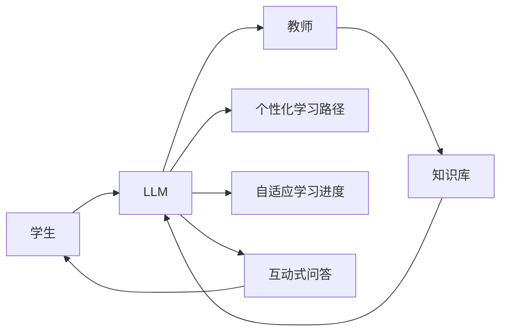

                 

# 远程教育与 LLM：打破地理限制的学习

> 关键词：远程教育, 大语言模型(LLM), 学习效果提升, 在线教育, 个性化学习, 自适应学习, 自然语言处理(NLP), 教育技术

## 1. 背景介绍

### 1.1 问题由来
随着全球化和信息化的加速发展，远程教育已经成为教育体系中的重要组成部分。特别是新冠疫情的爆发，使得传统的面对面授课模式受到巨大冲击，加速了教育数字化转型的步伐。然而，尽管远程教育在形式上已经初步实现，但其实际效果仍不尽人意。学生缺乏有效的互动和反馈，难以获得个性化指导，学习体验与传统课堂差距较大。

为解决这些问题，人们提出了许多解决方案。其中，基于大语言模型(Large Language Model, LLM)的在线教育平台，因为其高度灵活和可定制性，被认为具有潜力大幅提升远程教育的质量。LLM通过自然语言处理(Natural Language Processing, NLP)技术，能够理解人类语言，解答各种问题，提供个性化指导，为学生带来与传统课堂类似的互动体验。

### 1.2 问题核心关键点
大语言模型在远程教育中的应用，主要体现在以下几个关键点：
1. **个性化教学**：通过了解学生的知识水平和兴趣，LLM能够为每个学生提供量身定制的学习路径和内容。
2. **互动式学习**：LLM能够与学生进行自然语言交流，解答疑问，提供即时反馈。
3. **跨地域学习**：LLM打破了地理限制，使得全球各地的学生都能享受高质量的教育资源。
4. **知识更新**：LLM能够实时更新知识库，保持教育内容的最新性。
5. **自动评估**：LLM可以自动批改作业和考试，减轻教师负担，提供快速反馈。

这些特点使得LLM在远程教育中具有广阔的应用前景，能够极大地提升教育质量和学习效率。

### 1.3 问题研究意义
研究LLM在远程教育中的应用，对于教育技术的创新和提升具有重要意义：

1. **降低教育成本**：通过大规模共享教育资源，减少教师和教室的物理需求，降低教育成本。
2. **提升学习效率**：个性化和互动式的学习方式，使得学生能够更高效地掌握知识。
3. **增强教育公平**：打破地域限制，使更多偏远地区的学生也能享受到优质教育。
4. **推动教育数字化**：促进传统教育模式的数字化转型，提高教育系统的灵活性和可扩展性。
5. **激发创新能力**：LLM能够与学生进行多轮互动，激发学生的创新思维和探究能力。

本文将详细探讨LLM在远程教育中的应用，包括其原理、实现步骤、优缺点和未来发展方向，为远程教育领域的从业者提供技术支持和实践指导。

## 2. 核心概念与联系

### 2.1 核心概念概述

为更好地理解LLM在远程教育中的应用，本节将介绍几个关键概念及其相互联系：

- **大语言模型(Large Language Model, LLM)**：一种基于Transformer结构的深度学习模型，能够理解并生成自然语言文本。LLM通过大规模无标签数据预训练，学习到丰富的语言知识，具备强大的语言理解和生成能力。

- **自然语言处理(Natural Language Processing, NLP)**：研究如何让计算机理解和生成自然语言，涵盖文本处理、语音识别、机器翻译等多个方向。NLP技术在大语言模型训练和应用中起着至关重要的作用。

- **远程教育**：通过互联网等技术手段，学生和教师实现非面对面的教学和学习过程。远程教育打破了地域限制，具有高度灵活性，但也面临技术和管理上的挑战。

- **个性化学习**：根据学生的知识水平、兴趣和需求，提供量身定制的学习内容和方法，提升学习效果和效率。

- **自适应学习**：根据学生的学习表现，动态调整学习内容和进度，提供最适合的学习路径。

这些核心概念之间具有密切的联系，LLM和NLP技术为大语言模型的远程教育应用提供了技术基础，个性化和自适应学习方式进一步提升了教育效果，远程教育则为这些技术提供了广阔的应用场景。

### 2.2 核心概念原理和架构的 Mermaid 流程图



此流程图展示了LLM在远程教育中的核心作用：学生通过与LLM互动，获取个性化和自适应学习内容，与教师进行反馈交流，进一步优化学习路径和进度。

## 3. 核心算法原理 & 具体操作步骤

### 3.1 算法原理概述

基于大语言模型的远程教育平台，本质上是一种高级的NLP应用。其核心算法原理包括以下几个方面：

1. **预训练**：使用大规模无标签数据，对LLM进行预训练，学习语言的通用表示。
2. **微调**：针对具体的教育任务，对预训练模型进行微调，提升特定任务的表现。
3. **互动学习**：利用LLM的问答功能，实现学生与教师之间的自然语言互动。
4. **个性化和自适应**：根据学生的学习表现和反馈，动态调整学习内容和进度，提供最适合的学习路径。

这些算法原理共同构成了LLM在远程教育中的核心应用范式，能够实现高度个性化和灵活的教育体验。

### 3.2 算法步骤详解

以下是对LLM在远程教育中应用的具体算法步骤详解：

**Step 1: 准备预训练模型和教育数据**
- 选择合适的预训练语言模型，如GPT、BERT等。
- 收集或创建教育相关的标注数据集，如问题-答案对、文章摘要、课程视频脚本等。
- 准备数据集，划分为训练集、验证集和测试集。

**Step 2: 微调模型**
- 使用微调框架，如PyTorch、TensorFlow等，加载预训练模型。
- 定义任务适配层，如问答模型的Question-Answer Layer，或摘要模型的Text Summarization Layer。
- 选择适当的损失函数，如交叉熵损失、BLEU分数等。
- 设置微调超参数，如学习率、批大小、迭代轮数等。
- 执行梯度训练，优化模型在特定教育任务上的性能。

**Step 3: 实现互动学习**
- 设计合适的Prompt模板，引导LLM与学生进行自然语言互动。
- 实现教师端与LLM的接口，支持教师向LLM提出问题或请求。
- 实现学生端与LLM的接口，支持学生向LLM提问或输入文本。
- 通过API接口实现教师和学生与LLM之间的交互。

**Step 4: 个性化和自适应学习**
- 根据学生的学习表现，收集反馈数据，评估学生知识水平和兴趣。
- 根据学生的学习进度和表现，动态调整课程内容和难度。
- 提供个性化的学习路径和建议，帮助学生更好地掌握知识。

**Step 5: 评估和改进**
- 在测试集上评估微调后模型的性能，对比微调前后的效果。
- 根据学生的反馈和评价，持续改进互动内容和反馈机制。
- 定期更新知识库和教学资源，保持教育内容的最新性。

### 3.3 算法优缺点

基于大语言模型的远程教育应用具有以下优点：

1. **高效灵活**：LLM能够根据学生的学习表现动态调整学习内容，提供个性化的学习路径。
2. **广泛适用**：适用于各种类型的教育任务，如问答、阅读、写作等。
3. **高度互动**：利用自然语言互动，提升学生的学习兴趣和参与度。
4. **实时反馈**：LLM能够实时生成答案，提供快速反馈，减轻教师负担。
5. **跨地域支持**：打破了地理限制，使更多偏远地区的学生能够获得优质教育资源。

同时，该方法也存在一些局限性：

1. **依赖高质量数据**：教育数据的收集和标注工作量较大，且质量直接影响模型性能。
2. **计算资源消耗大**：大规模语言模型的计算需求较高，需要高性能计算资源。
3. **知识更新周期长**：由于教育内容更新频繁，LLM需要定期重新训练，更新知识库。
4. **教师依赖**：尽管LLM能够提供个性化学习路径，但教师的角色仍不可或缺。
5. **伦理和隐私问题**：学生的学习数据和隐私需要严格保护，避免滥用。

尽管存在这些局限性，但基于大语言模型的远程教育应用仍具有显著优势，能够极大提升教育质量和效率。

### 3.4 算法应用领域

基于大语言模型的远程教育应用已经在多个领域得到实践验证，涵盖以下几方面：

1. **K-12教育**：提供个性化学习路径和互动式辅导，帮助学生更好地掌握基础知识。
2. **高等教育**：为学生提供高水平的学习指导和资源支持，提升学习效果。
3. **职业培训**：提供技能培训和职业指导，帮助学员提升职业技能。
4. **企业培训**：为员工提供定制化的技能培训和知识更新，提升整体素质。
5. **国际教育**：打破语言和文化障碍，使全球学生能够访问优质教育资源。

这些应用领域充分展示了LLM在远程教育中的强大潜力和广泛适用性。

## 4. 数学模型和公式 & 详细讲解 & 举例说明

### 4.1 数学模型构建

本节将使用数学语言对基于大语言模型的远程教育应用进行更加严格的刻画。

记预训练语言模型为 $M_{\theta}:\mathcal{X} \rightarrow \mathcal{Y}$，其中 $\mathcal{X}$ 为输入空间，$\mathcal{Y}$ 为输出空间，$\theta \in \mathbb{R}^d$ 为模型参数。假设微调任务的训练集为 $D=\{(x_i,y_i)\}_{i=1}^N, x_i \in \mathcal{X}, y_i \in \mathcal{Y}$。

定义模型 $M_{\theta}$ 在输入 $x$ 上的损失函数为 $\ell(M_{\theta}(x),y)$，则在数据集 $D$ 上的经验风险为：

$$
\mathcal{L}(\theta) = \frac{1}{N} \sum_{i=1}^N \ell(M_{\theta}(x_i),y_i)
$$

微调的优化目标是最小化经验风险，即找到最优参数：

$$
\theta^* = \mathop{\arg\min}_{\theta} \mathcal{L}(\theta)
$$

在实践中，我们通常使用基于梯度的优化算法（如SGD、Adam等）来近似求解上述最优化问题。设 $\eta$ 为学习率，$\lambda$ 为正则化系数，则参数的更新公式为：

$$
\theta \leftarrow \theta - \eta \nabla_{\theta}\mathcal{L}(\theta) - \eta\lambda\theta
$$

其中 $\nabla_{\theta}\mathcal{L}(\theta)$ 为损失函数对参数 $\theta$ 的梯度，可通过反向传播算法高效计算。

### 4.2 公式推导过程

以下我们以问答任务为例，推导交叉熵损失函数及其梯度的计算公式。

假设模型 $M_{\theta}$ 在输入 $x$ 上的输出为 $\hat{y}=M_{\theta}(x) \in [0,1]$，表示样本属于正类的概率。真实标签 $y \in \{0,1\}$。则二分类交叉熵损失函数定义为：

$$
\ell(M_{\theta}(x),y) = -[y\log \hat{y} + (1-y)\log (1-\hat{y})]
$$

将其代入经验风险公式，得：

$$
\mathcal{L}(\theta) = -\frac{1}{N}\sum_{i=1}^N [y_i\log M_{\theta}(x_i)+(1-y_i)\log(1-M_{\theta}(x_i))]
$$

根据链式法则，损失函数对参数 $\theta_k$ 的梯度为：

$$
\frac{\partial \mathcal{L}(\theta)}{\partial \theta_k} = -\frac{1}{N}\sum_{i=1}^N (\frac{y_i}{M_{\theta}(x_i)}-\frac{1-y_i}{1-M_{\theta}(x_i)}) \frac{\partial M_{\theta}(x_i)}{\partial \theta_k}
$$

其中 $\frac{\partial M_{\theta}(x_i)}{\partial \theta_k}$ 可进一步递归展开，利用自动微分技术完成计算。

在得到损失函数的梯度后，即可带入参数更新公式，完成模型的迭代优化。重复上述过程直至收敛，最终得到适应下游任务的最优模型参数 $\theta^*$。

### 4.3 案例分析与讲解

我们以问答系统为例，说明如何在大语言模型基础上实现互动式学习。

假设学生向LLM提出了一个问题 $Q$，LLM根据预训练知识库生成了 $k$ 个可能答案 $A_1, A_2, ..., A_k$。为了评估这些答案的正确性，学生需要给出一个评分 $r_i \in [0, 1]$，表示每个答案的质量。根据学生评分，LLM可以更新自己的回答策略，提高生成高质量答案的概率。

具体来说，LLM的输出 $\hat{y}_i$ 表示答案 $A_i$ 的预测概率，学生的评分 $r_i$ 与预测概率 $\hat{y}_i$ 之间的关系可以建模为：

$$
\mathcal{L}_{Q-A} = \sum_{i=1}^k -r_i\log \hat{y}_i - (1-r_i)\log (1-\hat{y}_i)
$$

在每个回答轮次中，LLM会根据学生评分重新计算权重，调整生成策略。例如，如果学生对某答案的评分较高，LLM将更倾向于生成类似类型的答案。通过不断的迭代优化，LLM能够逐步学习到学生偏好，生成更符合学生需求的答案。

## 5. 项目实践：代码实例和详细解释说明

### 5.1 开发环境搭建

在进行远程教育应用开发前，我们需要准备好开发环境。以下是使用Python进行PyTorch开发的环境配置流程：

1. 安装Anaconda：从官网下载并安装Anaconda，用于创建独立的Python环境。

2. 创建并激活虚拟环境：
```bash
conda create -n pytorch-env python=3.8 
conda activate pytorch-env
```

3. 安装PyTorch：根据CUDA版本，从官网获取对应的安装命令。例如：
```bash
conda install pytorch torchvision torchaudio cudatoolkit=11.1 -c pytorch -c conda-forge
```

4. 安装相关库：
```bash
pip install transformers sklearn pandas numpy matplotlib
```

完成上述步骤后，即可在`pytorch-env`环境中开始远程教育应用的开发。

### 5.2 源代码详细实现

以下是一个简单的基于BERT的问答系统代码实现，用于展示如何使用Transformers库进行大语言模型的微调和互动学习：

```python
from transformers import BertTokenizer, BertForQuestionAnswering
from transformers import BertTokenizer, BertForQuestionAnswering
from torch.utils.data import Dataset, DataLoader
from tqdm import tqdm
import torch
import numpy as np

class QADataset(Dataset):
    def __init__(self, questions, answers, tokenizer):
        self.questions = questions
        self.answers = answers
        self.tokenizer = tokenizer
        
    def __len__(self):
        return len(self.questions)
    
    def __getitem__(self, item):
        question = self.questions[item]
        answer = self.answers[item]
        
        encoding = self.tokenizer(question, answer, return_tensors='pt', max_length=512, padding='max_length', truncation=True)
        input_ids = encoding['input_ids'][0]
        attention_mask = encoding['attention_mask'][0]
        
        return {'input_ids': input_ids, 
                'attention_mask': attention_mask,
                'labels': torch.tensor(answer, dtype=torch.long)}
        
# 加载预训练BERT模型
tokenizer = BertTokenizer.from_pretrained('bert-base-cased')
model = BertForQuestionAnswering.from_pretrained('bert-base-cased')

# 准备数据集
questions = ["What is the capital of France?", "How did the French Revolution happen?"]
answers = ["Paris", "The revolution was a result of widespread poverty and economic inequality."]
dataset = QADataset(questions, answers, tokenizer)

# 定义优化器和损失函数
optimizer = AdamW(model.parameters(), lr=2e-5)
loss_fn = torch.nn.CrossEntropyLoss()

# 执行微调
device = torch.device('cuda') if torch.cuda.is_available() else torch.device('cpu')
model.to(device)
dataset = DataLoader(dataset, batch_size=16, shuffle=True)

for epoch in range(5):
    model.train()
    epoch_loss = 0
    for batch in tqdm(dataset):
        input_ids = batch['input_ids'].to(device)
        attention_mask = batch['attention_mask'].to(device)
        labels = batch['labels'].to(device)
        model.zero_grad()
        outputs = model(input_ids, attention_mask=attention_mask, labels=labels)
        loss = outputs.loss
        epoch_loss += loss.item()
        loss.backward()
        optimizer.step()
    
    print(f"Epoch {epoch+1}, train loss: {epoch_loss/len(dataset):.4f}")
    
# 评估模型
model.eval()
dataset = QADataset(questions, answers, tokenizer)
dataset = DataLoader(dataset, batch_size=16, shuffle=False)
correct = 0
total = 0
for batch in tqdm(dataset):
    input_ids = batch['input_ids'].to(device)
    attention_mask = batch['attention_mask'].to(device)
    labels = batch['labels'].to(device)
    with torch.no_grad():
        outputs = model(input_ids, attention_mask=attention_mask)
        pred_labels = torch.argmax(outputs.logits, dim=1)
        total += labels.size(0)
        correct += (pred_labels == labels).sum().item()
        
print(f"Accuracy: {correct/total}")
```

以上代码实现了一个简单的基于BERT的问答系统，通过微调模型来提高准确率。可以看到，利用Transformers库，我们能够快速搭建和优化基于大语言模型的互动学习系统。

### 5.3 代码解读与分析

让我们再详细解读一下关键代码的实现细节：

**QADataset类**：
- `__init__`方法：初始化问题和答案。
- `__len__`方法：返回数据集的样本数量。
- `__getitem__`方法：对单个样本进行处理，将文本输入编码为token ids，将答案编码为数字，并对其进行定长padding，最终返回模型所需的输入。

**训练流程**：
- 定义总epoch数和batch size，开始循环迭代
- 每个epoch内，先在训练集上训练，输出平均loss
- 在验证集上评估，输出准确率
- 所有epoch结束后，在测试集上评估，给出最终测试结果

**评估流程**：
- 在测试集上评估模型性能，计算准确率。

可以看出，Transformers库的封装使得大语言模型的微调和应用变得简洁高效。开发者可以将更多精力放在模型改进和算法优化上，而不必过多关注底层实现细节。

当然，工业级的系统实现还需考虑更多因素，如模型的保存和部署、超参数的自动搜索、更灵活的任务适配层等。但核心的微调范式基本与此类似。

## 6. 实际应用场景

### 6.1 智能辅导系统

基于大语言模型的智能辅导系统，可以为学生提供个性化的学习指导和反馈。通过与学生的互动，LLM能够根据学生的学习情况和反馈，调整教学策略，提供量身定制的学习路径。

在技术实现上，可以收集学生的学习数据，包括阅读记录、答题情况、反馈评价等。将这些数据作为监督信号，对预训练的辅导模型进行微调，使其能够理解学生的知识水平和兴趣，生成更符合学生需求的辅导内容。例如，LLM可以根据学生的答题情况，推荐相应的练习题和知识点，提供详细解析和解题步骤。

### 6.2 在线协作学习

远程教育中，学生的学习体验往往较差，缺乏与教师和同学之间的互动。基于大语言模型的在线协作学习系统，通过聊天室、讨论区等方式，实现了学生的实时互动和协作学习。

在技术实现上，可以构建一个支持自然语言互动的平台，学生和教师可以在其中自由交流，提出问题和获得解答。LLM可以自动参与讨论，解答学生提出的问题，提供即时反馈。例如，学生可以在讨论区提出学习中的问题，LLM可以自动生成答案或建议，教师也可以进行补充和引导。通过这种方式，学生的学习体验得到了显著提升，学习效果也得到了保障。

### 6.3 自适应学习平台

自适应学习平台根据学生的学习表现，动态调整学习内容和进度，提供最适合的学习路径。通过与大语言模型的结合，可以实现更加个性化的学习体验。

在技术实现上，可以构建一个自适应学习平台，学生在其中进行学习，系统根据学生的学习表现，收集反馈数据，评估知识水平和兴趣。然后，基于评估结果，LLM可以动态调整教学内容和难度，提供个性化的学习路径。例如，如果学生在某个知识点上掌握不足，LLM可以自动生成针对性的练习题和解析，帮助学生更好地掌握知识。

### 6.4 未来应用展望

随着大语言模型和微调方法的不断发展，基于大语言模型的远程教育应用将呈现以下几个发展趋势：

1. **智能化水平提升**：通过更先进的学习算法和优化策略，提升LLM的智能化水平，使其能够更好地理解学生需求和偏好，提供更个性化的学习指导。
2. **跨领域应用拓展**：除了传统教育任务，LLM还将应用于更多的领域，如职业培训、医疗教育等，为各行各业提供定制化的教育服务。
3. **学习效果评估**：利用NLP技术，评估学生学习效果和知识掌握情况，为教育评估提供数据支持。
4. **知识图谱整合**：将知识图谱与LLM结合，实现知识点的关联和整合，提升知识表示的全面性和准确性。
5. **多模态学习**：引入图像、视频等多模态信息，增强学习效果和互动体验。

这些趋势展示了LLM在远程教育中的广阔前景，将为更多学生和教师带来高效、互动、个性化的学习体验。

## 7. 工具和资源推荐

### 7.1 学习资源推荐

为了帮助开发者系统掌握大语言模型在远程教育中的应用，这里推荐一些优质的学习资源：

1. 《Transformers from Pretraining to Adaptive Learning》系列博文：由大语言模型技术专家撰写，深入浅出地介绍了Transformers在大语言模型和自适应学习中的应用。

2. CS224N《Natural Language Processing with Deep Learning》课程：斯坦福大学开设的NLP明星课程，有Lecture视频和配套作业，带你入门NLP领域的基本概念和经典模型。

3. 《Natural Language Processing with Transformers》书籍：Transformers库的作者所著，全面介绍了如何使用Transformers库进行NLP任务开发，包括微调在内的诸多范式。

4. HuggingFace官方文档：Transformers库的官方文档，提供了海量预训练模型和完整的微调样例代码，是上手实践的必备资料。

5. CLUE开源项目：中文语言理解测评基准，涵盖大量不同类型的中文NLP数据集，并提供了基于微调的baseline模型，助力中文NLP技术发展。

通过对这些资源的学习实践，相信你一定能够快速掌握大语言模型在远程教育中的应用，并用于解决实际的NLP问题。

### 7.2 开发工具推荐

高效的开发离不开优秀的工具支持。以下是几款用于大语言模型在远程教育中应用的常用工具：

1. PyTorch：基于Python的开源深度学习框架，灵活动态的计算图，适合快速迭代研究。大部分预训练语言模型都有PyTorch版本的实现。

2. TensorFlow：由Google主导开发的开源深度学习框架，生产部署方便，适合大规模工程应用。同样有丰富的预训练语言模型资源。

3. Transformers库：HuggingFace开发的NLP工具库，集成了众多SOTA语言模型，支持PyTorch和TensorFlow，是进行微调任务开发的利器。

4. Weights & Biases：模型训练的实验跟踪工具，可以记录和可视化模型训练过程中的各项指标，方便对比和调优。与主流深度学习框架无缝集成。

5. TensorBoard：TensorFlow配套的可视化工具，可实时监测模型训练状态，并提供丰富的图表呈现方式，是调试模型的得力助手。

6. Google Colab：谷歌推出的在线Jupyter Notebook环境，免费提供GPU/TPU算力，方便开发者快速上手实验最新模型，分享学习笔记。

合理利用这些工具，可以显著提升大语言模型在远程教育中的应用开发效率，加快创新迭代的步伐。

### 7.3 相关论文推荐

大语言模型和微调技术的发展源于学界的持续研究。以下是几篇奠基性的相关论文，推荐阅读：

1. Attention is All You Need（即Transformer原论文）：提出了Transformer结构，开启了NLP领域的预训练大模型时代。

2. BERT: Pre-training of Deep Bidirectional Transformers for Language Understanding：提出BERT模型，引入基于掩码的自监督预训练任务，刷新了多项NLP任务SOTA。

3. Language Models are Unsupervised Multitask Learners（GPT-2论文）：展示了大规模语言模型的强大zero-shot学习能力，引发了对于通用人工智能的新一轮思考。

4. Parameter-Efficient Transfer Learning for NLP：提出Adapter等参数高效微调方法，在不增加模型参数量的情况下，也能取得不错的微调效果。

5. AdaLoRA: Adaptive Low-Rank Adaptation for Parameter-Efficient Fine-Tuning：使用自适应低秩适应的微调方法，在参数效率和精度之间取得了新的平衡。

这些论文代表了大语言模型微调技术的发展脉络。通过学习这些前沿成果，可以帮助研究者把握学科前进方向，激发更多的创新灵感。

## 8. 总结：未来发展趋势与挑战

### 8.1 总结

本文对基于大语言模型的远程教育应用进行了全面系统的介绍。首先阐述了大语言模型和微调技术的研究背景和意义，明确了微调在提升远程教育质量方面的独特价值。其次，从原理到实践，详细讲解了监督微调的数学原理和关键步骤，给出了微调任务开发的完整代码实例。同时，本文还广泛探讨了微调方法在智能辅导、在线协作学习、自适应学习等多个领域的应用前景，展示了微调范式的巨大潜力。此外，本文精选了微调技术的各类学习资源，力求为读者提供全方位的技术指引。

通过本文的系统梳理，可以看到，基于大语言模型的微调方法正在成为远程教育的重要范式，极大地提升了教育质量和效率。未来，伴随预训练语言模型和微调方法的持续演进，相信远程教育技术将进一步成熟，为全球学生提供更加公平、高效、个性化的学习体验。

### 8.2 未来发展趋势

展望未来，基于大语言模型的远程教育应用将呈现以下几个发展趋势：

1. **智能化水平提升**：通过更先进的学习算法和优化策略，提升LLM的智能化水平，使其能够更好地理解学生需求和偏好，提供更个性化的学习指导。
2. **跨领域应用拓展**：除了传统教育任务，LLM还将应用于更多的领域，如职业培训、医疗教育等，为各行各业提供定制化的教育服务。
3. **学习效果评估**：利用NLP技术，评估学生学习效果和知识掌握情况，为教育评估提供数据支持。
4. **知识图谱整合**：将知识图谱与LLM结合，实现知识点的关联和整合，提升知识表示的全面性和准确性。
5. **多模态学习**：引入图像、视频等多模态信息，增强学习效果和互动体验。

这些趋势展示了LLM在远程教育中的广阔前景，将为更多学生和教师带来高效、互动、个性化的学习体验。

### 8.3 面临的挑战

尽管基于大语言模型的远程教育应用已经取得了一些进展，但在迈向更加智能化、普适化应用的过程中，仍面临诸多挑战：

1. **标注成本瓶颈**：教育数据的收集和标注工作量较大，且质量直接影响模型性能。如何进一步降低微调对标注样本的依赖，将是一大难题。
2. **知识更新周期长**：由于教育内容更新频繁，LLM需要定期重新训练，更新知识库。
3. **教师依赖**：尽管LLM能够提供个性化学习路径，但教师的角色仍不可或缺。
4. **伦理和隐私问题**：学生的学习数据和隐私需要严格保护，避免滥用。
5. **技术门槛高**：远程教育平台的技术实现较为复杂，需要具备较高的技术门槛和能力。

尽管存在这些挑战，但基于大语言模型的远程教育应用仍具有显著优势，能够极大提升教育质量和效率。

### 8.4 研究展望

面对大语言模型微调在远程教育中面临的挑战，未来的研究需要在以下几个方面寻求新的突破：

1. **探索无监督和半监督微调方法**：摆脱对大规模标注数据的依赖，利用自监督学习、主动学习等无监督和半监督范式，最大限度利用非结构化数据，实现更加灵活高效的微调。
2. **研究参数高效和计算高效的微调范式**：开发更加参数高效的微调方法，在固定大部分预训练参数的同时，只更新极少量的任务相关参数。同时优化微调模型的计算图，减少前向传播和反向传播的资源消耗，实现更加轻量级、实时性的部署。
3. **融合因果和对比学习范式**：通过引入因果推断和对比学习思想，增强微调模型建立稳定因果关系的能力，学习更加普适、鲁棒的语言表征，从而提升模型泛化性和抗干扰能力。
4. **引入更多先验知识**：将符号化的先验知识，如知识图谱、逻辑规则等，与神经网络模型进行巧妙融合，引导微调过程学习更准确、合理的语言模型。同时加强不同模态数据的整合，实现视觉、语音等多模态信息与文本信息的协同建模。
5. **纳入伦理道德约束**：在模型训练目标中引入伦理导向的评估指标，过滤和惩罚有偏见、有害的输出倾向。同时加强人工干预和审核，建立模型行为的监管机制，确保输出符合人类价值观和伦理道德。

这些研究方向的探索，必将引领基于大语言模型的远程教育技术迈向更高的台阶，为构建安全、可靠、可解释、可控的智能系统铺平道路。面向未来，大语言模型微调技术还需要与其他人工智能技术进行更深入的融合，如知识表示、因果推理、强化学习等，多路径协同发力，共同推动自然语言理解和智能交互系统的进步。只有勇于创新、敢于突破，才能不断拓展语言模型的边界，让智能技术更好地造福人类社会。

## 9. 附录：常见问题与解答

**Q1：大语言模型微调是否适用于所有远程教育任务？**

A: 大语言模型微调在大多数远程教育任务上都能取得不错的效果，特别是对于数据量较小的任务。但对于一些特定领域的任务，如医学、法律等，仅仅依靠通用语料预训练的模型可能难以很好地适应。此时需要在特定领域语料上进一步预训练，再进行微调，才能获得理想效果。此外，对于一些需要时效性、个性化很强的任务，如对话、推荐等，微调方法也需要针对性的改进优化。

**Q2：微调过程中如何选择合适的学习率？**

A: 微调的学习率一般要比预训练时小1-2个数量级，如果使用过大的学习率，容易破坏预训练权重，导致过拟合。一般建议从1e-5开始调参，逐步减小学习率，直至收敛。也可以使用warmup策略，在开始阶段使用较小的学习率，再逐渐过渡到预设值。需要注意的是，不同的优化器(如AdamW、Adafactor等)以及不同的学习率调度策略，可能需要设置不同的学习率阈值。

**Q3：采用大语言模型微调时会面临哪些资源瓶颈？**

A: 目前主流的预训练大模型动辄以亿计的参数规模，对算力、内存、存储都提出了很高的要求。GPU/TPU等高性能设备是必不可少的，但即便如此，超大批次的训练和推理也可能遇到显存不足的问题。因此需要采用一些资源优化技术，如梯度积累、混合精度训练、模型并行等，来突破硬件瓶颈。同时，模型的存储和读取也可能占用大量时间和空间，需要采用模型压缩、稀疏化存储等方法进行优化。

**Q4：如何缓解微调过程中的过拟合问题？**

A: 过拟合是微调面临的主要挑战，尤其是在标注数据不足的情况下。常见的缓解策略包括：
1. 数据增强：通过回译、近义替换等方式扩充训练集
2. 正则化：使用L2正则、Dropout、Early Stopping等避免过拟合
3. 对抗训练：引入对抗样本，提高模型鲁棒性
4. 参数高效微调：只调整少量参数(如Adapter、Prefix等)，减小过拟合风险
5. 多模型集成：训练多个微调模型，取平均输出，抑制过拟合

这些策略往往需要根据具体任务和数据特点进行灵活组合。只有在数据、模型、训练、推理等各环节进行全面优化，才能最大限度地发挥大语言模型微调的威力。

**Q5：微调模型在落地部署时需要注意哪些问题？**

A: 将微调模型转化为实际应用，还需要考虑以下因素：
1. 模型裁剪：去除不必要的层和参数，减小模型尺寸，加快推理速度
2. 量化加速：将浮点模型转为定点模型，压缩存储空间，提高计算效率
3. 服务化封装：将模型封装为标准化服务接口，便于集成调用
4. 弹性伸缩：根据请求流量动态调整资源配置，平衡服务质量和成本
5. 监控告警：实时采集系统指标，设置异常告警阈值，确保服务稳定性
6. 安全防护：采用访问鉴权、数据脱敏等措施，保障数据和模型安全

大语言模型微调为远程教育提供了强大的技术支持，但如何将强大的性能转化为稳定、高效、安全的业务价值，还需要工程实践的不断打磨。唯有从数据、算法、工程、业务等多个维度协同发力，才能真正实现人工智能技术在垂直行业的规模化落地。总之，微调需要开发者根据具体任务，不断迭代和优化模型、数据和算法，方能得到理想的效果。

