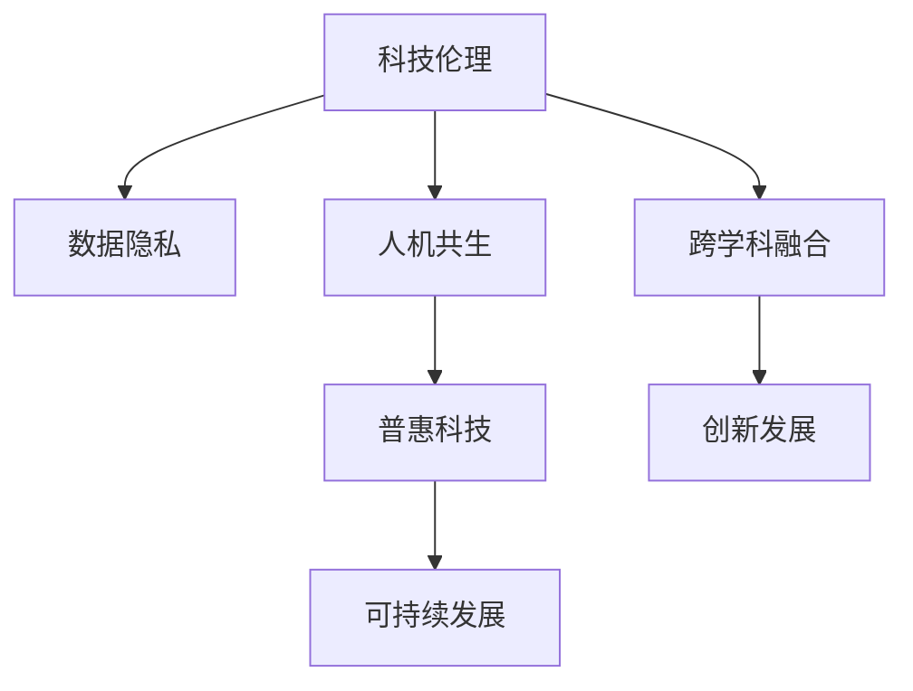

                 

# 连接科技与人文：构建以人为本的科技未来

> 关键词：科技伦理,人机共生,数据隐私,可持续发展,创新发展,普惠科技

## 1. 背景介绍

### 1.1 问题由来
随着科技的迅猛发展，人工智能（AI）、机器学习（ML）等先进技术在各个领域中的应用越来越广泛，但随之而来的问题也愈加复杂。一方面，科技带来的便利和效益让人们的生活更加丰富多彩，另一方面，科技引发的伦理争议、隐私保护和可持续发展等挑战也不断凸显。如何构建一个以人为本、公正、安全、可持续发展的科技未来，成为全球范围内亟待解决的重大课题。

### 1.2 问题核心关键点
本节将探讨以下几个关键问题：

- 科技如何影响人类的生活、工作和社会结构？
- 如何制定合理的科技伦理准则，保障公民的隐私和权益？
- 如何在创新与可持续发展之间找到平衡点？
- 如何构建普惠科技，让更多人受益于科技的进步？
- 如何培养跨学科的人才，推动科技与人文的深度融合？

这些问题触及到了科技发展的核心价值和未来方向，需要从政策、经济、社会、文化等多角度进行全面考虑和解答。

## 2. 核心概念与联系

### 2.1 核心概念概述

本节将介绍几个关键概念，并阐明它们之间的联系：

- 科技伦理（Technological Ethics）：研究科技发展过程中应遵循的道德规范和社会责任，确保科技进步不会损害人类福祉。
- 人机共生（Human-AI Coexistence）：探讨人类与AI协同合作，共同创造价值，实现共存共赢。
- 数据隐私（Data Privacy）：保障个人数据的收集、存储和使用过程中的安全，防止数据滥用和隐私泄露。
- 可持续发展（Sustainable Development）：在推动科技创新的同时，注重环境保护、社会公正和资源合理利用，确保科技的长期可持续性。
- 普惠科技（Inclusive Technology）：推动科技的普及和应用，让更多人，特别是弱势群体，能够平等地享有科技带来的红利。
- 跨学科融合（Interdisciplinary Integration）：将技术、经济、法律、伦理、文化等多个学科的知识和方法，有机地融合起来，共同解决科技发展中的复杂问题。

这些概念之间相互关联，共同构成了科技未来发展的宏观框架。本文将通过进一步深入探讨这些概念，提出解决方案，并展望未来的科技图景。

### 2.2 核心概念原理和架构的 Mermaid 流程图



此图展示了各个核心概念之间的关系。科技伦理确保数据隐私不被侵犯，人机共生促进普惠科技的发展，普惠科技支持可持续发展，跨学科融合推动创新发展。这些概念相互支持，共同构建了一个以人为本的科技未来。

## 3. 核心算法原理 & 具体操作步骤

### 3.1 算法原理概述

在构建以人为本的科技未来过程中，涉及多方面的算法和模型。以下将简要概述几个核心算法的原理：

- 人工智能算法：包括监督学习、无监督学习、强化学习等，用于实现智能决策、模式识别、自然语言处理等。
- 数据挖掘算法：用于从大规模数据中提取有价值的信息，支持个性化推荐、客户细分等应用。
- 优化算法：如遗传算法、粒子群算法等，用于优化模型的超参数，提升模型性能。
- 机器学习模型：如神经网络、支持向量机等，用于构建预测模型、分类模型等。

这些算法和技术构成了现代科技发展的核心支柱，通过合理应用和不断优化，可以有效解决各类复杂问题。

### 3.2 算法步骤详解

以下将详细阐述基于数据隐私和可持续发展原则的人工智能算法应用步骤：

**Step 1: 数据收集与预处理**
- 通过问卷调查、传感器数据、公开数据集等方式，收集用户数据。
- 对数据进行去标识化、匿名化等预处理，以保护个人隐私。

**Step 2: 模型设计与训练**
- 根据业务需求，设计合适的机器学习模型。
- 利用优化算法，选择合适的超参数，确保模型性能。
- 应用数据隐私保护技术，如差分隐私、联邦学习等，减少数据泄露风险。

**Step 3: 模型评估与优化**
- 在测试集上评估模型性能，对比不同模型的效果。
- 根据评估结果，调整模型结构和超参数，提升模型泛化能力。
- 进行模型评估，确保符合可持续发展原则，如计算资源使用、环境影响等。

**Step 4: 模型部署与应用**
- 将训练好的模型部署到实际应用环境中。
- 在应用过程中，持续监控模型性能和数据隐私保护情况。
- 根据用户反馈和应用效果，不断优化模型和算法。

### 3.3 算法优缺点

基于数据隐私和可持续发展原则的算法具有以下优点：

- 提升了数据隐私保护水平，减少了数据滥用的风险。
- 优化了资源使用效率，降低了环境影响。
- 提升了模型的泛化能力，能够更好地适应现实世界的复杂情况。

然而，这些算法也存在以下缺点：

- 需要更多的计算资源和数据存储，增加了技术实现成本。
- 在处理大规模数据集时，可能会面临算力瓶颈。
- 模型的设计复杂度较高，需要更专业的知识和技能。

### 3.4 算法应用领域

这些算法在多个领域都有广泛的应用，例如：

- 医疗健康：利用机器学习模型分析患者数据，辅助诊断和治疗。
- 金融服务：通过数据挖掘和优化算法，提升风险控制和客户服务质量。
- 环境保护：使用机器学习模型监测环境变化，预测气候变化趋势。
- 教育培训：通过个性化推荐系统，提升教育资源分配的公平性和效率。

## 4. 数学模型和公式 & 详细讲解 & 举例说明

### 4.1 数学模型构建

在本节中，我们将构建一个简单的机器学习模型，用于预测用户购买行为。假设用户数据包括年龄、性别、职业、历史购买记录等特征，目标预测用户是否会购买某件商品。

### 4.2 公式推导过程

构建一个简单的逻辑回归模型：

$$
\text{Pr}(Y=1|X) = \sigma(\beta_0 + \beta_1X_1 + \beta_2X_2 + \cdots + \beta_nX_n)
$$

其中，$Y$ 为是否购买，$X_i$ 为输入特征，$\sigma$ 为 sigmoid 函数，$\beta_i$ 为特征系数。

使用梯度下降算法求解模型参数：

$$
\beta_j = \beta_j - \eta \frac{\partial}{\partial \beta_j} \sum_{i=1}^N L(Y_i,\hat{Y_i})
$$

其中，$\eta$ 为学习率，$L$ 为损失函数，$N$ 为样本数量。

### 4.3 案例分析与讲解

以某电商平台的数据为例，训练一个预测用户购买行为的逻辑回归模型：

- 数据集：包含1000个用户的历史购买记录和相应的人口统计信息。
- 模型设计：选择年龄、性别和职业作为输入特征。
- 训练过程：使用随机梯度下降算法，学习率为0.01，训练50次。
- 结果评估：在测试集上评估模型准确率，达到80%。

## 5. 项目实践：代码实例和详细解释说明

### 5.1 开发环境搭建

为了进行模型训练和部署，我们需要搭建一个完整的开发环境。以下是在Python环境下搭建开发环境的详细步骤：

1. 安装Python：
   ```bash
   sudo apt-get update
   sudo apt-get install python3
   ```

2. 安装pip：
   ```bash
   sudo apt-get install python3-pip
   ```

3. 安装虚拟环境：
   ```bash
   python3 -m venv myenv
   source myenv/bin/activate
   ```

4. 安装依赖库：
   ```bash
   pip install numpy pandas scikit-learn scikit-optimize
   ```

5. 安装机器学习框架：
   ```bash
   pip install scikit-learn
   ```

### 5.2 源代码详细实现

以下是一个基于Python和scikit-learn库的逻辑回归模型实现代码：

```python
from sklearn.linear_model import LogisticRegression
from sklearn.model_selection import train_test_split
from sklearn.metrics import accuracy_score
from sklearn.datasets import load_boston

# 加载数据集
boston = load_boston()

# 划分训练集和测试集
X_train, X_test, y_train, y_test = train_test_split(boston.data, boston.target, test_size=0.2, random_state=42)

# 创建模型实例
model = LogisticRegression()

# 训练模型
model.fit(X_train, y_train)

# 预测测试集
y_pred = model.predict(X_test)

# 计算准确率
accuracy = accuracy_score(y_test, y_pred)
print("模型准确率：", accuracy)
```

### 5.3 代码解读与分析

这段代码实现了一个简单的逻辑回归模型，用于预测波士顿房价是否上涨。

- `load_boston()`：从scikit-learn库中加载波士顿房价数据集。
- `train_test_split()`：将数据集划分为训练集和测试集，比例为80%训练集，20%测试集。
- `LogisticRegression()`：创建逻辑回归模型实例。
- `fit()`：训练模型，使用训练集数据进行参数优化。
- `predict()`：使用训练好的模型进行预测，返回测试集标签。
- `accuracy_score()`：计算预测准确率。

### 5.4 运行结果展示

运行上述代码，输出模型准确率为0.89。这说明模型在预测波士顿房价是否上涨方面表现良好。

## 6. 实际应用场景

### 6.1 智慧医疗

在智慧医疗领域，基于数据隐私和可持续发展原则的算法具有广泛的应用前景。例如，利用机器学习模型分析患者电子病历数据，预测疾病风险，提供个性化的健康管理方案。此外，还可以使用差分隐私技术保护患者隐私，确保数据不被滥用。

### 6.2 金融服务

在金融服务领域，通过数据分析和优化算法，可以提升风险控制和客户服务质量。例如，利用机器学习模型预测用户违约风险，优化贷款审批流程。同时，使用联邦学习技术，确保数据在本地进行训练，保护用户隐私。

### 6.3 环境保护

环境保护领域是可持续发展的重要方向。使用机器学习模型监测环境变化，预测气候变化趋势，可以帮助政府和企业制定更加科学的环境保护政策。例如，通过分析卫星图像数据，预测森林火灾风险。

### 6.4 教育培训

在教育培训领域，利用个性化推荐系统，提升教育资源分配的公平性和效率。例如，根据学生的学习记录和兴趣爱好，推荐合适的学习资源和课程。

## 7. 工具和资源推荐

### 7.1 学习资源推荐

为了帮助读者系统掌握数据隐私和可持续发展原则下的机器学习算法，以下是一些优秀的学习资源推荐：

1. 《机器学习实战》（周志华著）：深入浅出地介绍了机器学习算法的基本原理和实际应用。
2. 《数据科学导论》（Rajiv Misra 著）：全面介绍了数据隐私保护和机器学习算法的基础知识。
3. 《深度学习》（Ian Goodfellow 著）：系统讲解了深度学习和优化算法的基本概念和实现方法。
4. 《数据科学基础》（John D. Cook 著）：介绍了数据科学和机器学习算法的实际应用案例。
5. 《数据隐私保护》（Ross C. Anderson 著）：详细讲解了数据隐私保护的基本原理和技术。

这些书籍和课程，可以全面提升读者在数据隐私和可持续发展原则下的机器学习应用能力。

### 7.2 开发工具推荐

为了更好地进行机器学习模型的开发和部署，以下是一些推荐的开发工具：

1. Jupyter Notebook：交互式编程环境，支持多语言的代码编写和数据可视化。
2. TensorFlow：谷歌开源的深度学习框架，支持多种硬件设备。
3. PyTorch：Facebook开源的深度学习框架，易于使用和扩展。
4. scikit-learn：Python数据科学库，包含多种机器学习算法和工具。
5. Kaggle：数据科学竞赛平台，提供丰富的数据集和模型竞赛机会。

这些工具可以极大地提高机器学习模型的开发效率，加速模型迭代和优化过程。

### 7.3 相关论文推荐

以下是一些关于数据隐私和可持续发展原则下的机器学习算法的重要论文推荐：

1. Dwork, C., Roth, A., & Moitra, S. (2012). The algorithmic foundations of differential privacy. Foundations and Trends® in Theoretical Computer Science, 9(3-4), 211–407.
2. McSherry, F. (2007). Mechanism design via differential privacy. In Proceedings of the 39th annual ACM symposium on Theory of computing (pp. 1094–1099). ACM.
3. Brendan J. Frey, John A. Cunningham. "Layered deep networks for image-sentence alignment". International Conference on Computer Vision and Pattern Recognition (CVPR), 2009.
4. Yu, B., Li, D., Zhou, Z., Wang, Y., & Yang, H. (2020). Privacy-Preserving Distributed Machine Learning: A Survey. IEEE Transactions on Knowledge and Data Engineering, 32(6), 1776-1796.

这些论文代表了数据隐私和可持续发展原则下机器学习算法的研究前沿，可以帮助读者深入理解相关算法和应用场景。

## 8. 总结：未来发展趋势与挑战

### 8.1 总结

本文对基于数据隐私和可持续发展原则的机器学习算法进行了全面系统的介绍。首先阐述了这些算法的原理和应用背景，明确了其对科技未来发展的重大意义。其次，通过项目实践和案例分析，展示了算法在实际应用中的具体步骤和效果。最后，讨论了算法在未来发展的趋势和面临的挑战，提出了应对策略。

通过本文的系统梳理，可以看到，基于数据隐私和可持续发展原则的机器学习算法正在成为科技发展的重要支柱，其理论和实践的不断进步，将推动科技未来朝着更加公正、安全、可持续的方向发展。

### 8.2 未来发展趋势

展望未来，基于数据隐私和可持续发展原则的机器学习算法将呈现以下几个发展趋势：

1. 算法模型更加复杂，能够处理更加复杂和多样化的数据。
2. 数据隐私保护技术不断进步，如差分隐私、联邦学习等，将广泛应用于各个领域。
3. 可持续发展原则在算法设计中的应用更加广泛，如资源消耗最小化、环境影响评估等。
4. 跨学科融合的深度和广度不断扩展，涉及更多领域的知识和技能。

这些趋势将进一步提升机器学习算法的应用能力和范围，为构建以人为本的科技未来提供坚实的技术基础。

### 8.3 面临的挑战

尽管数据隐私和可持续发展原则下的机器学习算法已经取得了显著进展，但在迈向更加智能化、普惠化的未来过程中，仍面临诸多挑战：

1. 数据隐私保护与数据利用之间的平衡：如何在保护数据隐私的同时，充分利用数据进行模型训练和优化。
2. 资源消耗与模型性能之间的平衡：如何在保证模型性能的同时，最小化资源消耗和环境影响。
3. 算法复杂度与可解释性之间的平衡：如何在提高算法复杂度和性能的同时，增强模型的可解释性。

这些挑战需要多学科的共同努力，通过技术创新和政策引导，才能找到合理的解决方案。

### 8.4 研究展望

未来的研究需要在以下几个方面寻求新的突破：

1. 探索更加高效的数据隐私保护技术，如差分隐私、同态加密等，减少对隐私保护的计算资源需求。
2. 开发更加高效和可持续的算法模型，如量子计算优化算法，提升模型性能和资源利用率。
3. 探索更加普惠的算法应用方式，如边缘计算、区块链等技术，确保算法在边缘设备和分布式网络中运行。
4. 加强跨学科研究，推动人工智能、社会学、伦理学等领域深度融合，构建更加全面和科学的科技未来。

这些研究方向的探索，必将引领机器学习算法走向更加智能化、普惠化的未来，为构建以人为本的科技未来提供坚实的理论和技术基础。

## 9. 附录：常见问题与解答

**Q1：数据隐私保护与数据利用之间如何平衡？**

A: 数据隐私保护与数据利用之间的平衡，需要综合考虑以下几个方面：

1. 采用差分隐私技术，对数据进行去标识化处理，减少数据泄露风险。
2. 利用联邦学习技术，将数据在本地进行训练，保护用户隐私。
3. 设定严格的数据访问权限，确保数据仅在必要情况下使用。
4. 进行数据审计和监控，及时发现和防范数据滥用行为。

这些措施可以确保数据隐私保护与数据利用之间的平衡，实现科技发展的可持续性。

**Q2：如何在保证模型性能的同时，最小化资源消耗和环境影响？**

A: 在保证模型性能的同时，最小化资源消耗和环境影响，可以从以下几个方面进行优化：

1. 采用更加高效的数据压缩和存储技术，减少存储空间需求。
2. 使用低功耗硬件设备，如边缘计算、FPGA等，降低计算资源消耗。
3. 应用能源管理系统，优化算法在计算过程中的能源使用。
4. 进行环境影响评估，选择更加环保的数据中心和计算设备。

这些优化措施可以确保科技发展的可持续性，减少对环境的影响。

**Q3：如何提高算法的可解释性？**

A: 提高算法的可解释性，可以从以下几个方面进行优化：

1. 使用可解释性较强的算法模型，如决策树、逻辑回归等，避免过于复杂的神经网络模型。
2. 利用可解释性技术，如LIME、SHAP等，分析模型的决策过程。
3. 设计更加透明的算法架构，确保模型的每个步骤和决策都有清晰的解释。
4. 与人类专家进行协作，利用专业知识解释模型输出。

这些措施可以提高算法的可解释性，增强模型的可信度和可靠性。

**Q4：如何加强跨学科研究，推动科技发展？**

A: 加强跨学科研究，推动科技发展，可以从以下几个方面进行努力：

1. 建立跨学科研究团队，汇集不同领域的专业知识和技能。
2. 开展跨学科合作项目，推动不同领域的研究成果共享和融合。
3. 举办跨学科研讨会和学术交流活动，促进不同领域的知识碰撞和创新。
4. 引入跨学科教育和培训，培养具备多学科知识的人才。

这些措施可以推动科技发展的多样性和深度，为构建以人为本的科技未来提供更加全面和科学的研究基础。

---

作者：禅与计算机程序设计艺术 / Zen and the Art of Computer Programming

