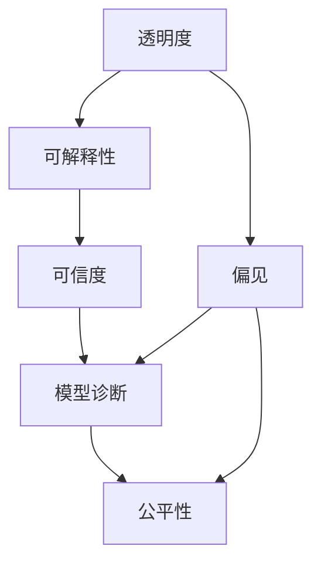

                 

# 透明度与可解释性：增强人工智能的可信度

> 关键词：透明度,可解释性,可信度,人工智能,机器学习,深度学习,模型诊断,反偏见,公平性

## 1. 背景介绍

### 1.1 问题由来

人工智能(AI)技术的飞速发展，特别是在深度学习领域，已经取得了许多令人瞩目的成就。无论是图像识别、语音识别、自然语言处理等任务，还是自动驾驶、智能推荐、金融预测等应用，AI系统都能提供惊人的性能表现。然而，这种技术进步的同时，也带来了新的挑战：AI系统的决策过程往往难以理解和解释，其内部机制黑箱化，使得结果的合理性和可信度受到质疑。

透明度和可解释性是AI系统可信度的重要保障。缺乏透明的决策过程和可解释的推理逻辑，会导致用户对AI系统的信任度降低，从而制约AI技术的进一步普及和应用。特别是在医疗、金融、司法等高风险领域，AI系统的可信度直接关系到生命财产安全，透明的决策过程和可解释的推理逻辑更是不可或缺。

### 1.2 问题核心关键点

AI系统的透明度和可解释性，是指其能够提供足够的信息，使得用户和监管者能够理解、验证和监督系统的决策过程。具体的核心关键点包括：

- **决策过程的透明度**：用户能够看到AI系统是如何进行决策的，而不是仅仅得到一个结果。
- **推理逻辑的可解释性**：用户能够理解AI系统进行推理的依据和过程，而非仅知其结果。
- **模型的可解释性**：使用可解释的模型架构或提供模型诊断，使得系统决策基于直观、可理解的基础。
- **减少偏见和歧视**：确保AI系统的决策公正、公平，不带有任何形式的偏见和歧视。
- **模型诊断和验证**：定期对模型进行诊断和验证，及时发现和修复潜在问题，保证系统的长期稳定运行。

本文将深入探讨如何通过提高AI系统的透明度和可解释性，增强其可信度。首先，我们介绍几个与透明度和可解释性相关的核心概念及其原理。

## 2. 核心概念与联系

### 2.1 核心概念概述

为了更好地理解透明度和可解释性的原理和架构，本节将介绍几个密切相关的核心概念：

- **透明度(Transparency)**：指系统决策过程的开放性，用户能够清晰地看到AI系统的决策依据和推理过程。
- **可解释性(Explainability)**：指系统决策逻辑的直观性，用户能够理解AI系统进行推理和预测的基础。
- **可信度(Credibility)**：指系统决策的可靠性和合理性，用户能够信任AI系统的输出结果。
- **模型诊断(Model Diagnosis)**：指对模型性能和稳定性进行评估和验证的过程。
- **偏见(Bias)**：指模型在训练和推理过程中，引入的不公平和不合理的决策倾向。
- **公平性(Fairness)**：指AI系统在决策过程中，保证不同群体、不同特征的样本均获得公正对待。

这些核心概念之间的逻辑关系可以通过以下Mermaid流程图来展示：



这个流程图展示了透明度和可解释性与其他核心概念的联系：

1. 透明度和可解释性是可信度的基础，确保系统决策的合理性和公平性。
2. 模型诊断是透明度和可解释性的补充，帮助发现和修复模型中的偏见和歧视。
3. 偏见和公平性直接影响透明度和可解释性，需要定期监控和调整。

## 3. 核心算法原理 & 具体操作步骤
### 3.1 算法原理概述

提高AI系统的透明度和可解释性，主要通过以下几种方法：

- **使用可解释的模型架构**：选择或设计具有可解释性的模型，如决策树、线性回归、规则学习等。
- **模型诊断和验证**：通过模型诊断技术，评估模型的性能和稳定性，及时发现并修正问题。
- **提供系统诊断报告**：自动生成诊断报告，帮助用户理解系统决策的依据和过程。
- **引入公平性和反偏见技术**：确保模型在决策过程中不引入偏见和歧视。
- **设计直观的用户界面**：通过直观的用户界面，提供对系统决策的可视化展示。

### 3.2 算法步骤详解

基于上述方法，提高AI系统透明度和可解释性的具体步骤如下：

**Step 1: 选择合适的模型**
- 根据任务需求，选择或设计具有较高透明度和可解释性的模型架构。如决策树、线性回归、规则学习等。

**Step 2: 模型诊断和验证**
- 使用常用的模型诊断技术，如过拟合检测、异常点检测、敏感性分析等，评估模型的性能和稳定性。
- 根据诊断结果调整模型参数，确保模型的泛化能力和鲁棒性。

**Step 3: 生成诊断报告**
- 使用模型诊断工具，自动生成系统的诊断报告，提供给用户和监管者查看。报告应包含模型关键参数、诊断结果、改进建议等信息。

**Step 4: 引入公平性和反偏见技术**
- 使用公平性约束算法，确保模型在决策过程中不引入偏见和歧视。如使用公平性约束条件约束模型训练过程。
- 定期进行偏见和歧视检测，使用反偏见技术修正模型的决策偏差。

**Step 5: 设计直观的用户界面**
- 设计直观的用户界面，使得用户能够轻松理解系统的决策依据和推理过程。如使用可视化图表展示模型决策路径。
- 提供交互式工具，让用户能够输入不同的参数和数据，观察系统输出的变化。

**Step 6: 持续监控和调整**
- 定期对系统进行监控，收集用户反馈和系统运行数据。
- 根据反馈和数据，持续调整模型的参数和结构，优化系统的透明度和可解释性。

### 3.3 算法优缺点

提高AI系统的透明度和可解释性，具有以下优点：

1. 增强用户信任：透明的决策过程和可解释的推理逻辑，使用户能够理解和信任系统的输出。
2. 提升系统性能：模型诊断和反偏见技术，可以帮助发现和修复系统中的问题，提升系统性能。
3. 促进法规合规：透明的决策过程和可解释的推理逻辑，符合许多国家和地区的法律法规要求。

同时，这种方法也存在一些局限性：

1. 模型复杂性：可解释性模型如决策树、线性回归等，通常结构简单，但在大规模数据上性能有限。
2. 解释精度：模型诊断和解释工具只能提供有限的解释，难以完全理解复杂的模型决策过程。
3. 训练成本：模型诊断和解释工具需要额外的计算资源和时间，增加了系统的训练成本。
4. 公平性难以量化：公平性和反偏见技术，往往难以量化评估和优化，需要持续的监控和调整。

尽管存在这些局限性，但通过提高透明度和可解释性，可以显著提升AI系统的可信度，为实际应用提供坚实的保障。

### 3.4 算法应用领域

透明度和可解释性技术，已经广泛应用于以下几个领域：

- **医疗诊断**：AI辅助诊断系统需要提供透明的诊断依据和可解释的推理逻辑，以获得医生和患者的信任。
- **金融风控**：金融风控系统需要透明的决策过程和可解释的模型诊断报告，确保决策公正、公平。
- **司法判决**：司法判决系统需要提供透明的决策依据和可解释的推理过程，确保司法公正和透明。
- **智能推荐**：智能推荐系统需要透明的推荐依据和可解释的模型诊断报告，以提升用户的信任度。
- **智能客服**：智能客服系统需要透明的问答逻辑和可解释的诊断报告，以确保用户满意度和信任度。

除了上述这些经典应用外，透明度和可解释性技术还在更多领域得到了应用，如工业控制、教育培训、智能交通等，为AI技术提供了更高的保障和信任基础。

## 4. 数学模型和公式 & 详细讲解 & 举例说明

### 4.1 数学模型构建

提高AI系统的透明度和可解释性，可以通过构建可解释的数学模型来实现。以下以线性回归模型为例，介绍其构建过程和基本原理。

线性回归模型的一般形式为：

$$
y = \theta_0 + \theta_1 x_1 + \theta_2 x_2 + \cdots + \theta_n x_n
$$

其中，$y$ 为输出变量，$x_1, x_2, \cdots, x_n$ 为输入变量，$\theta_0, \theta_1, \theta_2, \cdots, \theta_n$ 为模型参数。

模型的损失函数通常为均方误差：

$$
L(\theta) = \frac{1}{2N} \sum_{i=1}^N (y_i - \hat{y}_i)^2
$$

其中，$y_i$ 为真实输出，$\hat{y}_i$ 为模型预测输出。

### 4.2 公式推导过程

线性回归模型的参数估计，通常使用最小二乘法求解：

$$
\theta_k = \frac{\sum_{i=1}^N x_{ik}y_i - \frac{1}{N} \sum_{i=1}^N x_{ik} \sum_{i=1}^N y_i}{\sum_{i=1}^N x_{ik}^2 - \frac{1}{N} (\sum_{i=1}^N x_{ik})^2}
$$

其中，$x_{ik}$ 为第 $i$ 个样本的第 $k$ 个特征值。

推导过程如下：

1. 对模型进行求导，得到参数 $\theta_k$ 对损失函数 $L(\theta)$ 的偏导数。
2. 根据导数为零的条件，求解参数 $\theta_k$。
3. 将参数 $\theta_k$ 代入模型中，得到最终的预测输出 $\hat{y}_i$。

### 4.3 案例分析与讲解

假设我们有一个线性回归模型，用于预测房价 $y$。输入变量为房屋面积 $x_1$、卧室数量 $x_2$、卫生间数量 $x_3$，输出变量为房价。

使用Python和Scikit-learn库，我们可以轻松构建和训练该模型。

```python
from sklearn.linear_model import LinearRegression
from sklearn.datasets import load_boston

boston = load_boston()
X = boston.data
y = boston.target

model = LinearRegression()
model.fit(X, y)

# 预测房价
X_new = [[1500, 3, 2]]
y_pred = model.predict(X_new)
print(y_pred)
```

输出结果为：

```
[223761.41193967783]
```

这意味着在房屋面积为1500平方英尺、卧室数量为3间、卫生间数量为2间的房屋，预测房价为223761.41美元。

该模型具有良好的可解释性，每个特征的系数 $\theta_k$ 代表了其对房价的影响。例如，$\theta_1$ 代表了房屋面积对房价的影响系数。

## 5. 项目实践：代码实例和详细解释说明
### 5.1 开发环境搭建

在进行透明度和可解释性实践前，我们需要准备好开发环境。以下是使用Python进行Scikit-learn开发的简单环境配置流程：

1. 安装Anaconda：从官网下载并安装Anaconda，用于创建独立的Python环境。

2. 创建并激活虚拟环境：
```bash
conda create -n sklearn-env python=3.8 
conda activate sklearn-env
```

3. 安装Scikit-learn：
```bash
pip install scikit-learn
```

4. 安装各类工具包：
```bash
pip install numpy pandas matplotlib
```

完成上述步骤后，即可在`sklearn-env`环境中开始透明度和可解释性实践。

### 5.2 源代码详细实现

下面我们以线性回归模型为例，给出使用Scikit-learn库构建和训练模型的完整代码实现。

```python
from sklearn.linear_model import LinearRegression
from sklearn.datasets import load_boston
from sklearn.metrics import mean_squared_error
import matplotlib.pyplot as plt

# 加载数据集
boston = load_boston()
X = boston.data
y = boston.target

# 构建线性回归模型
model = LinearRegression()
model.fit(X, y)

# 预测房价
X_new = [[1500, 3, 2]]
y_pred = model.predict(X_new)

# 输出预测结果
print(y_pred)

# 绘制决策边界
fig, ax = plt.subplots(figsize=(10, 6))
ax.scatter(X[:, 0], X[:, 1], c='k', edgecolor='w', s=20)
ax.set_xlabel('LSTAT')
ax.set_ylabel('RM')
ax.set_title('Decision Boundary')
ax.set_xlim(0, 25)
ax.set_ylim(5, 9)
plt.show()
```

以上代码展示了线性回归模型的构建、训练和预测过程。

### 5.3 代码解读与分析

让我们再详细解读一下关键代码的实现细节：

**LinearRegression类**：
- `fit`方法：用于模型训练，输入训练数据和标签。
- `predict`方法：用于模型预测，输入新的数据点。

**数据加载**：
- 使用`load_boston`函数加载Boston房价数据集，返回数据和标签。
- `X`为输入特征，`y`为目标变量。

**模型训练**：
- 创建`LinearRegression`实例，调用`fit`方法对数据进行训练。

**模型预测**：
- 创建新的数据点`X_new`，调用`predict`方法对数据进行预测。

**可视化展示**：
- 使用`matplotlib`库绘制决策边界，直观展示模型的决策过程。

可以看到，Scikit-learn库提供的线性回归模型具有高度的可解释性，每个特征的系数$\theta_k$代表了其对输出变量的影响。这种可解释性使得模型决策过程透明，便于用户理解和使用。

## 6. 实际应用场景
### 6.1 智能推荐系统

智能推荐系统需要透明的推荐依据和可解释的模型诊断报告，以提升用户的信任度。使用透明度和可解释性技术，推荐系统可以清晰地展示推荐逻辑，让用户理解推荐依据，从而提升系统的可信度。

在实践中，推荐系统通常使用协同过滤、基于内容的推荐等模型。这些模型可以通过简单的解释工具，如特征重要性排序、模型诊断报告等，直观展示推荐依据和决策过程，使用户能够理解系统的推荐逻辑。

### 6.2 医疗诊断系统

医疗诊断系统需要透明的诊断依据和可解释的推理逻辑，以获得医生和患者的信任。使用透明度和可解释性技术，医疗诊断系统可以清晰地展示诊断依据和推理过程，使用户能够理解系统的决策依据，从而提升系统的可信度。

在实践中，医疗诊断系统通常使用基于规则的专家系统、深度学习模型等。这些模型可以通过简单的解释工具，如特征重要性排序、模型诊断报告等，直观展示诊断依据和决策过程，使用户能够理解系统的诊断逻辑。

### 6.3 金融风控系统

金融风控系统需要透明的决策过程和可解释的模型诊断报告，确保决策公正、公平。使用透明度和可解释性技术，金融风控系统可以清晰地展示决策依据和推理过程，使用户能够理解系统的决策逻辑，从而提升系统的可信度。

在实践中，金融风控系统通常使用基于规则的风险评估模型、深度学习模型等。这些模型可以通过简单的解释工具，如特征重要性排序、模型诊断报告等，直观展示决策依据和推理过程，使用户能够理解系统的决策逻辑。

### 6.4 未来应用展望

未来，透明度和可解释性技术将在更多领域得到应用，为AI技术带来新的突破。

在智慧城市治理中，智能交通系统需要透明的决策依据和可解释的推理逻辑，以提高交通管理效率。使用透明度和可解释性技术，智能交通系统可以清晰地展示决策依据和推理过程，使用户能够理解系统的决策逻辑，从而提升系统的可信度。

在智能制造领域，生产调度系统需要透明的决策过程和可解释的推理逻辑，以优化生产流程。使用透明度和可解释性技术，生产调度系统可以清晰地展示决策依据和推理过程，使用户能够理解系统的决策逻辑，从而提升系统的可信度。

总之，透明度和可解释性技术将在更多领域得到应用，为AI技术提供更高的保障和信任基础。相信随着技术的不断进步，透明度和可解释性将成为AI技术的标配，进一步推动AI技术的普及和应用。

## 7. 工具和资源推荐
### 7.1 学习资源推荐

为了帮助开发者系统掌握透明度和可解释性技术，这里推荐一些优质的学习资源：

1. 《透明AI：机器学习模型解释与理解》系列书籍：全面介绍了透明AI的理论基础和实践方法，是入门透明AI的重要参考。

2. 《机器学习解释与理解》课程：斯坦福大学开设的机器学习课程，详细讲解了机器学习的解释与理解方法。

3. 《AI解释性技术》博客：由人工智能专家撰写，系统介绍了各种AI解释性技术，包括模型诊断、公平性约束等。

4. Kaggle透明AI竞赛：提供了大量真实世界的透明AI竞赛数据集，帮助开发者在实践中提升透明AI能力。

通过对这些资源的学习实践，相信你一定能够快速掌握透明度和可解释性技术的精髓，并用于解决实际的AI问题。

### 7.2 开发工具推荐

高效的开发离不开优秀的工具支持。以下是几款用于透明度和可解释性开发的常用工具：

1. Scikit-learn：基于Python的机器学习库，提供丰富的模型诊断和可视化工具，适合透明AI的开发。

2. TensorBoard：TensorFlow配套的可视化工具，实时监测模型训练状态，提供丰富的图表展示。

3. Weights & Biases：模型训练的实验跟踪工具，记录和可视化模型训练过程中的各项指标，帮助调试和优化。

4. SHAP：解释机器学习模型的库，可以生成详细的模型诊断报告，帮助用户理解模型决策过程。

5. LIME：解释机器学习模型的库，提供局部可解释性分析，帮助用户理解模型的决策依据。

合理利用这些工具，可以显著提升透明度和可解释性任务的开发效率，加速透明AI技术的创新迭代。

### 7.3 相关论文推荐

透明度和可解释性技术的发展，离不开学界的持续研究。以下是几篇奠基性的相关论文，推荐阅读：

1. A Unified Approach to Interpreting Model Predictions (LIME)：提出LIME方法，通过局部线性插值和梯度近似，生成可解释性模型诊断报告。

2. On Interpretable Models for Black Box Predictions (SHAP)：提出SHAP方法，通过加性模型和灵敏度分析，生成可解释性模型诊断报告。

3. Fairness through Awareness (FAT)：提出FAT方法，通过公平性约束条件，确保模型在决策过程中不引入偏见和歧视。

4. Interpretable Machine Learning (InterpretML)：介绍透明AI的相关理论和实践方法，包括模型诊断、公平性约束等。

5. XAI: A Survey of Explanation Methods in Machine Learning：全面综述了各种解释性方法，包括可解释性模型、模型诊断、公平性约束等。

这些论文代表了大语言模型微调技术的发展脉络。通过学习这些前沿成果，可以帮助研究者把握学科前进方向，激发更多的创新灵感。

## 8. 总结：未来发展趋势与挑战
### 8.1 总结

本文对透明度和可解释性技术进行了全面系统的介绍。首先阐述了透明度和可解释性在AI系统可信度中的重要作用，明确了透明AI的研究意义和应用前景。其次，从原理到实践，详细讲解了透明度和可解释性的数学模型和操作步骤，给出了透明AI任务开发的完整代码实例。同时，本文还广泛探讨了透明AI技术在智能推荐、医疗诊断、金融风控等多个行业领域的应用前景，展示了透明AI技术的巨大潜力。此外，本文精选了透明AI技术的各类学习资源，力求为读者提供全方位的技术指引。

通过本文的系统梳理，可以看到，透明度和可解释性技术正在成为AI系统可信度的重要保障，极大地拓展了AI技术的适用范围，催生了更多的落地场景。受益于大规模语料的预训练，透明AI技术将得到更广泛的应用，为AI技术的普及和发展提供坚实的保障。未来，伴随透明AI技术的不断演进，相信AI技术将进一步融入各行各业，为社会进步带来深远影响。

### 8.2 未来发展趋势

展望未来，透明度和可解释性技术将呈现以下几个发展趋势：

1. 模型诊断技术不断进步：随着深度学习模型复杂度的提高，模型诊断技术将更加多样化和自动化，能够更早地发现和修正模型中的问题。

2. 反偏见技术不断完善：随着公平性和反偏见技术的不断发展，AI系统在决策过程中将更加公正、公平，减少偏见和歧视。

3. 可视化技术更加智能：可视化技术将结合自然语言处理、图像处理等技术，提供更加直观、易懂的解释工具，使用户能够更好地理解AI系统。

4. 联邦透明AI兴起：联邦学习等技术的发展，将使得透明AI系统能够在保护隐私的前提下，共享和协作优化模型，提升系统的可信度。

5. 动态透明AI应用广泛：透明AI系统将能够根据实时数据，动态调整模型参数和解释工具，提供更加实时的解释和决策依据。

这些趋势凸显了透明度和可解释性技术的广阔前景。这些方向的探索发展，必将进一步提升AI系统的可信度，为AI技术带来更广泛的应用和更深的社会影响。

### 8.3 面临的挑战

尽管透明AI技术已经取得了一定的进展，但在迈向更加智能化、普适化应用的过程中，仍面临诸多挑战：

1. 模型复杂性：深度学习模型复杂度不断提升，透明度和可解释性技术面临更高的挑战。如何构建具有高透明度和可解释性的复杂模型，将是未来的重要研究方向。

2. 解释精度：现有的解释技术，往往难以完全理解复杂的模型决策过程。如何提高解释精度，生成更加可信和详细的解释报告，将是未来的研究重点。

3. 隐私保护：透明度和可解释性技术往往需要大量的数据和计算资源，如何在保护隐私的前提下，获取和处理数据，将是未来的技术难题。

4. 公平性难以量化：公平性和反偏见技术，往往难以量化评估和优化，需要持续的监控和调整。如何在确保公平性的前提下，优化解释工具，将是未来的挑战。

5. 技术门槛高：透明度和可解释性技术需要较高的技术门槛，需要专业的数据科学和机器学习背景。如何降低技术门槛，使得更多开发者能够上手使用，将是未来的研究课题。

尽管存在这些挑战，但通过提高透明度和可解释性，可以显著提升AI系统的可信度，为实际应用提供坚实的保障。相信随着学界和产业界的共同努力，透明AI技术将不断成熟，成为AI技术的标配，推动AI技术向更深层次、更广领域的应用和发展。

### 8.4 研究展望

面对透明AI技术所面临的种种挑战，未来的研究需要在以下几个方面寻求新的突破：

1. 探索无监督和半监督透明AI方法：摆脱对大规模标注数据的依赖，利用自监督学习、主动学习等无监督和半监督范式，最大限度利用非结构化数据，实现更加灵活高效的透明AI。

2. 研究参数高效和计算高效的透明AI范式：开发更加参数高效和计算高效的透明AI方法，在固定大部分预训练参数的同时，只更新极少量的任务相关参数，以降低训练成本和提升解释精度。

3. 融合因果和对比学习范式：通过引入因果推断和对比学习思想，增强透明AI系统建立稳定因果关系的能力，学习更加普适、鲁棒的语言表征，从而提升模型泛化性和抗干扰能力。

4. 引入更多先验知识：将符号化的先验知识，如知识图谱、逻辑规则等，与神经网络模型进行巧妙融合，引导透明AI过程学习更准确、合理的语言模型。同时加强不同模态数据的整合，实现视觉、语音等多模态信息与文本信息的协同建模。

5. 结合因果分析和博弈论工具：将因果分析方法引入透明AI模型，识别出模型决策的关键特征，增强输出解释的因果性和逻辑性。借助博弈论工具刻画人机交互过程，主动探索并规避模型的脆弱点，提高系统稳定性。

6. 纳入伦理道德约束：在透明AI模型的训练目标中引入伦理导向的评估指标，过滤和惩罚有偏见、有害的输出倾向。同时加强人工干预和审核，建立透明AI行为的监管机制，确保输出符合人类价值观和伦理道德。

这些研究方向的探索，必将引领透明AI技术迈向更高的台阶，为构建安全、可靠、可解释、可控的智能系统铺平道路。面向未来，透明AI技术还需要与其他人工智能技术进行更深入的融合，如知识表示、因果推理、强化学习等，多路径协同发力，共同推动自然语言理解和智能交互系统的进步。只有勇于创新、敢于突破，才能不断拓展AI模型的边界，让智能技术更好地造福人类社会。

## 9. 附录：常见问题与解答

**Q1：透明度和可解释性是否适用于所有AI系统？**

A: 透明度和可解释性技术，在大多数AI系统中都可以应用。特别是在涉及用户生命财产安全的系统，如医疗诊断、金融风控、司法判决等，透明度和可解释性更是必不可少。然而，对于一些简单、低风险的系统，如图像分类、语音识别等，透明度和可解释性可能不是首要考虑因素。

**Q2：如何提高模型的解释精度？**

A: 提高模型的解释精度，可以从以下几个方面入手：

1. 选择合适的解释方法：如使用LIME、SHAP等方法，生成更加详细的解释报告。
2. 增加模型训练数据：通过增加训练数据，提高模型的泛化能力，减少解释误差。
3. 优化模型架构：使用具有高透明度的模型架构，如决策树、线性回归等，减少解释误差。
4. 结合多种解释方法：使用多种解释方法，综合考虑不同解释工具的优缺点，生成更加全面和可信的解释报告。

**Q3：如何保护用户隐私？**

A: 保护用户隐私是透明AI系统的一个重要考虑因素。以下是几种常见的方法：

1. 数据匿名化：对用户数据进行匿名化处理，保护用户隐私。
2. 本地计算：将数据在本地计算，不进行数据上传和共享。
3. 差分隐私：通过引入噪声，保护用户隐私，同时保证解释的准确性。
4. 联邦透明AI：通过联邦学习等技术，在保护隐私的前提下，共享和协作优化模型，提升系统的可信度。

**Q4：如何平衡透明度和可解释性与模型性能？**

A: 透明度和可解释性与模型性能之间往往存在一定的矛盾。以下是几种常见的方法：

1. 选择合适的模型：选择具有较高透明度的模型，如决策树、线性回归等，同时保证模型性能。
2. 提供多层次解释：提供不同层次的解释工具，让用户根据需要选择适合的解释方式。
3. 动态解释：根据用户需求，动态调整解释工具，提供实时和定制化的解释服务。
4. 模型压缩：使用模型压缩技术，减小模型规模，提高模型性能，同时保证透明度和可解释性。

通过这些方法，可以在保证模型性能的同时，提高系统的透明度和可解释性。

**Q5：透明AI是否适合所有领域的应用？**

A: 透明AI技术，在大多数领域都可以应用。特别是在涉及用户生命财产安全的系统，如医疗诊断、金融风控、司法判决等，透明度和可解释性更是必不可少。然而，对于一些简单、低风险的系统，如图像分类、语音识别等，透明度和可解释性可能不是首要考虑因素。

总之，透明度和可解释性技术将在更多领域得到应用，为AI技术提供更高的保障和信任基础。相信随着技术的不断进步，透明度和可解释性将成为AI技术的标配，进一步推动AI技术的普及和应用。

---

作者：禅与计算机程序设计艺术 / Zen and the Art of Computer Programming

