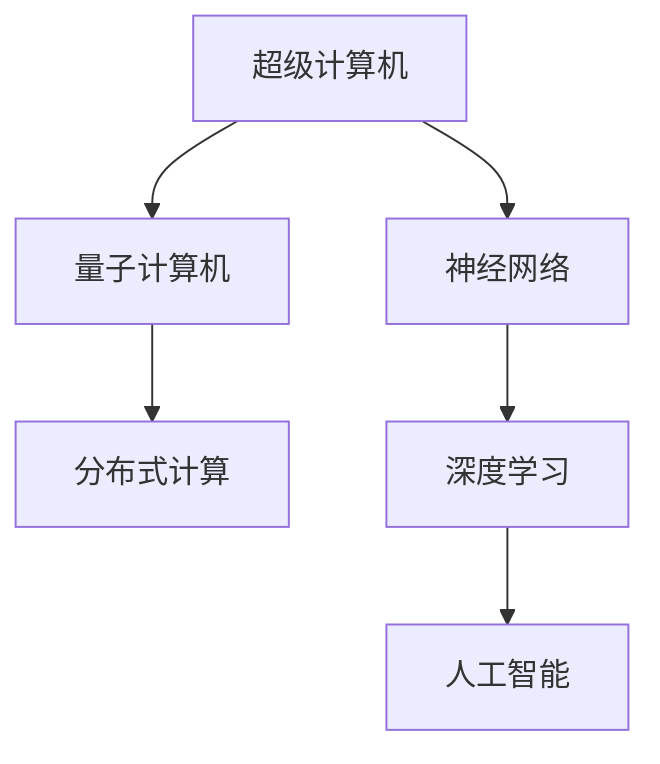

                 

# 释放人类创造力的源泉：人类计算的魅力

> 关键词：人类计算,超级计算机,量子计算,分布式计算,神经网络,深度学习,人工智能

## 1. 背景介绍

### 1.1 问题由来

人类计算的历史源远流长，从简单的机械计算器到复杂的电子计算机，再到如今的超级计算机和量子计算机，人类对于更快速、更强大计算的需求从未停止。计算机的出现，极大地改变了我们的生活方式和工作方式，促进了科学、工程、艺术、经济等领域的飞速发展。但同时，我们也不得不面对随之而来的诸多挑战：如何设计更高效、更通用的计算模型？如何平衡计算速度与计算成本？如何让计算力更好地服务于人类创造力？

这些问题催生了现代计算机科学的核心学科，也推动了计算机技术的发展。尤其是深度学习、人工智能的兴起，使得计算力与人类智慧的结合变得更加紧密，开启了人类计算的新纪元。

### 1.2 问题核心关键点

当前，人类计算正面临前所未有的机遇和挑战。一方面，超级计算机和量子计算机的发展，提供了前所未有的计算能力，使得复杂问题的求解成为可能。另一方面，计算资源的分布和协同机制的创新，使得大规模分布式计算成为可能。在神经网络、深度学习的推动下，人类计算的智能水平不断提高，逐步迈向通用人工智能（AGI）。

人类计算的核心关键点包括：
- **计算模型**：如何设计更高效、更通用的计算模型？
- **计算资源**：如何优化计算资源的配置和使用？
- **智能计算**：如何利用计算力提升人工智能模型的智能水平？

本文将聚焦于人类计算的最新进展，特别是如何利用先进的计算资源和智能计算技术，释放人类的创造力。

## 2. 核心概念与联系

### 2.1 核心概念概述

为更好地理解人类计算的魅力，本节将介绍几个关键概念：

- **超级计算机**：使用极端高速的处理器和大容量内存，专门用于解决大科学、大工程问题的计算机系统。超级计算机的计算速度、存储容量和处理能力通常远远超出普通计算机。

- **量子计算机**：利用量子力学的原理，通过量子比特（qubits）和量子纠缠等特性，实现信息的高效存储和处理。量子计算机的计算速度在某些特定任务上，有望超越经典计算机。

- **分布式计算**：通过多台计算机协同工作，实现大规模计算任务的分散处理。分布式计算通过将计算任务分散到不同的计算节点上，可以有效降低计算成本，提高计算效率。

- **神经网络**：模仿人脑神经元的工作原理，通过多层非线性变换，实现对复杂模式的拟合和预测。神经网络在深度学习中得到广泛应用，成为智能计算的基础。

- **深度学习**：一种基于神经网络的机器学习方法，通过多层非线性变换，自动从数据中学习抽象特征，实现对复杂模式的识别和预测。深度学习在图像识别、语音识别、自然语言处理等领域取得了巨大成功。

- **人工智能**：利用计算力实现智能模型的学习、推理和决策，模拟人类智慧的某些方面。人工智能的应用范围涵盖了从简单的自动化任务到复杂的创造性工作。

这些概念之间的逻辑关系可以通过以下Mermaid流程图来展示：



这个流程图展示了一系列计算资源的演变过程：

1. 超级计算机和量子计算机代表了计算资源的发展方向，提供了更强大的计算能力。
2. 神经网络和深度学习利用这些计算资源，实现了更高效的数据处理和模式识别。
3. 人工智能在这些技术的基础上，进一步模拟人类的智能行为，实现更复杂的任务。

## 3. 核心算法原理 & 具体操作步骤
### 3.1 算法原理概述

人类计算的核心在于如何高效地利用计算资源，实现智能计算模型的学习和推理。其基本原理可以概括为以下几个步骤：

1. **数据获取**：收集和处理大规模的数据集，为智能模型的训练提供素材。
2. **模型设计**：选择合适的计算模型和架构，设计模型参数的初始化和更新策略。
3. **模型训练**：在大量数据上对模型进行训练，优化模型的参数和结构。
4. **模型推理**：在测试集或实际应用场景中，使用训练好的模型进行推理和预测。

人类计算的算法原理主要包括：

- **监督学习**：利用标注数据，训练模型进行预测和分类。
- **无监督学习**：在没有标注数据的情况下，通过数据的自相关性进行特征学习。
- **强化学习**：通过与环境的交互，优化模型的决策策略。

### 3.2 算法步骤详解

人类计算的算法步骤可以通过以下形式化的方式来描述：

1. **数据获取**：收集和预处理数据集，划分训练集、验证集和测试集。

2. **模型设计**：选择合适的计算模型和架构，设计模型的输入和输出。对于深度学习模型，通常包括输入层、隐藏层和输出层。

3. **模型训练**：使用训练集对模型进行训练，更新模型的权重和偏置，使其在验证集上达到最优性能。训练过程可以使用随机梯度下降等优化算法。

4. **模型推理**：在测试集或实际应用场景中，使用训练好的模型进行推理和预测。

### 3.3 算法优缺点

人类计算的算法具有以下优点：

- **通用性强**：深度学习模型可以在多种领域和任务中应用。
- **计算能力强**：深度学习模型可以利用超级计算机和量子计算机等先进计算资源，实现高效计算。
- **可解释性好**：深度学习模型可以通过可视化工具进行调试和解释，理解模型的内部工作机制。

同时，也存在一些缺点：

- **计算资源需求高**：深度学习模型通常需要大规模的计算资源进行训练，成本较高。
- **模型复杂度高**：深度学习模型参数众多，结构复杂，难以调试和维护。
- **数据依赖性强**：深度学习模型依赖于标注数据，数据获取成本高，数据偏差可能影响模型性能。

### 3.4 算法应用领域

人类计算的算法在多个领域中得到了广泛应用：

- **计算机视觉**：利用深度学习模型进行图像分类、目标检测、图像生成等。
- **自然语言处理**：利用深度学习模型进行文本分类、情感分析、机器翻译等。
- **语音识别**：利用深度学习模型进行语音识别、语音合成等。
- **推荐系统**：利用深度学习模型进行商品推荐、内容推荐等。
- **金融预测**：利用深度学习模型进行股票预测、风险评估等。

## 4. 数学模型和公式 & 详细讲解 & 举例说明

### 4.1 数学模型构建

本节将使用数学语言对人类计算的算法过程进行更加严格的刻画。

假设我们有 $n$ 个样本 $(x_i, y_i)$，其中 $x_i$ 为输入，$y_i$ 为标签。使用神经网络进行训练时，模型的参数为 $\theta$，输入为 $x_i$，输出为 $y_i$。定义损失函数 $L(\theta)$，用于衡量模型预测与真实标签之间的差异。

神经网络的模型可以表示为：

$$
f_\theta(x) = \sigma(Wx + b)
$$

其中，$\sigma$ 为激活函数，$W$ 和 $b$ 为模型的权重和偏置。

定义模型在训练集上的经验风险为：

$$
\mathcal{L}(\theta) = \frac{1}{N}\sum_{i=1}^N L(f_\theta(x_i), y_i)
$$

训练过程的目标是最小化经验风险：

$$
\theta^* = \mathop{\arg\min}_{\theta} \mathcal{L}(\theta)
$$

在训练过程中，使用随机梯度下降等优化算法更新模型参数：

$$
\theta \leftarrow \theta - \eta \nabla_{\theta}\mathcal{L}(\theta)
$$

其中，$\eta$ 为学习率。

### 4.2 公式推导过程

以神经网络为例，进行详细推导：

假设我们的神经网络结构为 $h$ 个隐藏层，每个隐藏层的节点数为 $n_h$，输入节点数为 $n_{in}$，输出节点数为 $n_{out}$。对于 $i$ 层，其激活函数为 $\sigma$，权重为 $W_i$，偏置为 $b_i$，前一层的输出为 $x_{i-1}$。

定义第 $i$ 层的输出为：

$$
x_i = \sigma(W_ix_{i-1} + b_i)
$$

对于深度学习模型，通常使用交叉熵损失函数：

$$
L(y_i, f_\theta(x_i)) = -\sum_{k=1}^n y_i^{(k)}\log(f_\theta(x_i)^{(k)})
$$

其中，$y_i^{(k)}$ 为第 $k$ 个标签的独热编码，$f_\theta(x_i)^{(k)}$ 为模型输出的第 $k$ 个节点的概率。

定义模型在训练集上的经验风险为：

$$
\mathcal{L}(\theta) = \frac{1}{N}\sum_{i=1}^N L(y_i, f_\theta(x_i))
$$

在训练过程中，使用随机梯度下降等优化算法更新模型参数：

$$
W_i \leftarrow W_i - \eta \frac{\partial \mathcal{L}}{\partial W_i}
$$

其中，$\eta$ 为学习率，$\frac{\partial \mathcal{L}}{\partial W_i}$ 为损失函数对权重 $W_i$ 的梯度，可以通过反向传播算法计算得到。

### 4.3 案例分析与讲解

以图像分类为例，进行详细讲解：

假设我们有一个图像分类任务，输入为 $x$，标签为 $y$。使用卷积神经网络（CNN）进行训练时，模型的参数为 $\theta$，输入为 $x$，输出为 $y$。定义损失函数 $L(\theta)$，用于衡量模型预测与真实标签之间的差异。

卷积神经网络的模型可以表示为：

$$
f_\theta(x) = \sigma(W_{conv}x + b_{conv})
$$

其中，$\sigma$ 为激活函数，$W_{conv}$ 和 $b_{conv}$ 为卷积层的权重和偏置。

定义模型在训练集上的经验风险为：

$$
\mathcal{L}(\theta) = \frac{1}{N}\sum_{i=1}^N L(f_\theta(x_i), y_i)
$$

在训练过程中，使用随机梯度下降等优化算法更新模型参数：

$$
W_{conv} \leftarrow W_{conv} - \eta \frac{\partial \mathcal{L}}{\partial W_{conv}}
$$

其中，$\eta$ 为学习率，$\frac{\partial \mathcal{L}}{\partial W_{conv}}$ 为损失函数对卷积层权重的梯度，可以通过反向传播算法计算得到。

## 5. 项目实践：代码实例和详细解释说明
### 5.1 开发环境搭建

在进行人类计算的实践前，我们需要准备好开发环境。以下是使用Python进行PyTorch开发的环境配置流程：

1. 安装Anaconda：从官网下载并安装Anaconda，用于创建独立的Python环境。

2. 创建并激活虚拟环境：
```bash
conda create -n pytorch-env python=3.8 
conda activate pytorch-env
```

3. 安装PyTorch：根据CUDA版本，从官网获取对应的安装命令。例如：
```bash
conda install pytorch torchvision torchaudio cudatoolkit=11.1 -c pytorch -c conda-forge
```

4. 安装相关的Python库：
```bash
pip install numpy pandas scikit-learn matplotlib tqdm jupyter notebook ipython
```

完成上述步骤后，即可在`pytorch-env`环境中开始项目实践。

### 5.2 源代码详细实现

下面我们以图像分类任务为例，给出使用PyTorch进行深度学习模型的Py代码实现。

```python
import torch
import torch.nn as nn
import torch.optim as optim
import torchvision.transforms as transforms
from torch.utils.data import DataLoader
from torchvision.datasets import CIFAR10
from torchvision import transforms

# 定义数据预处理
transform = transforms.Compose([
    transforms.ToTensor(),
    transforms.Normalize((0.5, 0.5, 0.5), (0.5, 0.5, 0.5))
])

# 加载CIFAR-10数据集
trainset = CIFAR10(root='./data', train=True,
                   transform=transform, download=True)
trainloader = DataLoader(trainset, batch_size=4,
                         shuffle=True, num_workers=2)

# 定义模型
class Net(nn.Module):
    def __init__(self):
        super(Net, self).__init__()
        self.conv1 = nn.Conv2d(3, 6, 5)
        self.pool = nn.MaxPool2d(2, 2)
        self.conv2 = nn.Conv2d(6, 16, 5)
        self.fc1 = nn.Linear(16 * 5 * 5, 120)
        self.fc2 = nn.Linear(120, 84)
        self.fc3 = nn.Linear(84, 10)

    def forward(self, x):
        x = self.pool(F.relu(self.conv1(x)))
        x = self.pool(F.relu(self.conv2(x)))
        x = x.view(-1, 16 * 5 * 5)
        x = F.relu(self.fc1(x))
        x = F.relu(self.fc2(x))
        x = self.fc3(x)
        return x

# 定义损失函数和优化器
net = Net()
criterion = nn.CrossEntropyLoss()
optimizer = optim.SGD(net.parameters(), lr=0.001, momentum=0.9)

# 训练模型
for epoch in range(2):
    running_loss = 0.0
    for i, data in enumerate(trainloader, 0):
        inputs, labels = data
        optimizer.zero_grad()
        outputs = net(inputs)
        loss = criterion(outputs, labels)
        loss.backward()
        optimizer.step()
        running_loss += loss.item()
    print(f'Epoch {epoch+1}, loss: {running_loss/len(trainloader)}')
```

以上就是使用PyTorch进行深度学习模型训练的完整代码实现。可以看到，通过使用PyTorch，我们能够简洁地定义神经网络模型，并使用梯度下降算法进行训练。

### 5.3 代码解读与分析

让我们再详细解读一下关键代码的实现细节：

**数据预处理**：
- `transforms.Compose` 方法用于定义数据预处理流程，包括将图像转换为张量并进行归一化。

**模型定义**：
- `Net` 类定义了一个简单的卷积神经网络，包括卷积层、池化层、全连接层等。

**损失函数和优化器**：
- `nn.CrossEntropyLoss` 用于定义交叉熵损失函数。
- `SGD` 优化器用于更新模型参数，学习率为0.001，动量为0.9。

**训练循环**：
- `for` 循环用于迭代训练集，每次迭代更新模型参数。
- `optimizer.zero_grad()` 用于清空梯度缓存。
- `outputs = net(inputs)` 表示模型前向传播，计算输出。
- `loss = criterion(outputs, labels)` 表示计算损失函数。
- `loss.backward()` 表示反向传播，计算梯度。
- `optimizer.step()` 表示更新模型参数。

可以看到，通过使用PyTorch，我们能够非常方便地进行深度学习模型的开发和训练。

## 6. 实际应用场景
### 6.1 智能图像识别

深度学习在图像识别领域取得了巨大成功，广泛应用于自动驾驶、智能安防、医疗影像分析等领域。通过训练深度学习模型，可以对输入的图像进行分类、检测、分割等操作，实现智能图像识别。

在自动驾驶中，利用深度学习模型对车辆周围环境进行感知，自动进行障碍物识别、车道线识别、交通信号识别等操作，保障行车安全。

在智能安防中，利用深度学习模型对监控视频进行实时分析，自动进行异常行为检测、人员识别、物体追踪等操作，提高安防系统的智能化水平。

在医疗影像分析中，利用深度学习模型对医学影像进行分类、分割、标注等操作，辅助医生进行疾病诊断和治疗方案制定。

### 6.2 自然语言处理

深度学习在自然语言处理领域也取得了显著进展，广泛应用于机器翻译、语音识别、情感分析、文本摘要等领域。通过训练深度学习模型，可以实现对自然语言的高效处理和理解。

在机器翻译中，利用深度学习模型对输入的文本进行翻译，实现不同语言之间的无障碍交流。

在语音识别中，利用深度学习模型对输入的语音进行识别，实现语音指令控制、语音助手等应用。

在情感分析中，利用深度学习模型对输入的文本进行情感分类，实现情感倾向识别、舆情监测等应用。

在文本摘要中，利用深度学习模型对输入的长文本进行压缩，生成简短摘要，实现信息检索、内容推荐等应用。

### 6.3 推荐系统

深度学习在推荐系统中也得到了广泛应用，通过训练深度学习模型，可以实现商品推荐、内容推荐等操作，提升用户体验。

在商品推荐中，利用深度学习模型对用户行为进行分析和建模，推荐最符合用户兴趣的商品。

在内容推荐中，利用深度学习模型对用户行为进行分析和建模，推荐最符合用户兴趣的内容。

## 7. 工具和资源推荐
### 7.1 学习资源推荐

为了帮助开发者系统掌握人类计算的理论基础和实践技巧，这里推荐一些优质的学习资源：

1. **《深度学习》**：Ian Goodfellow等人著，全面介绍了深度学习的理论基础和实践方法。

2. **《机器学习》**：Tom Mitchell著，介绍了机器学习的基本概念和算法。

3. **《人工智能：一种现代方法》**：Stuart Russell和Peter Norvig著，介绍了人工智能的核心概念和应用。

4. **《计算机视觉：模型、学习和推理》**：Richard Szeliski著，介绍了计算机视觉的基本概念和算法。

5. **Coursera和edX等在线课程**：提供了大量高质量的计算机科学和人工智能相关课程，涵盖深度学习、计算机视觉、自然语言处理等领域。

通过对这些资源的学习实践，相信你一定能够快速掌握人类计算的精髓，并用于解决实际的NLP问题。

### 7.2 开发工具推荐

高效的开发离不开优秀的工具支持。以下是几款用于深度学习开发的常用工具：

1. **PyTorch**：基于Python的开源深度学习框架，灵活动态的计算图，适合快速迭代研究。

2. **TensorFlow**：由Google主导开发的开源深度学习框架，生产部署方便，适合大规模工程应用。

3. **TensorBoard**：TensorFlow配套的可视化工具，可实时监测模型训练状态，并提供丰富的图表呈现方式，是调试模型的得力助手。

4. **Weights & Biases**：模型训练的实验跟踪工具，可以记录和可视化模型训练过程中的各项指标，方便对比和调优。

5. **Keras**：基于Python的高层次深度学习框架，提供了便捷的模型构建接口，适合初学者和快速开发。

合理利用这些工具，可以显著提升深度学习模型的开发效率，加快创新迭代的步伐。

### 7.3 相关论文推荐

深度学习的发展离不开学界的持续研究。以下是几篇奠基性的相关论文，推荐阅读：

1. **ImageNet Classification with Deep Convolutional Neural Networks**：Alex Krizhevsky等人，提出了卷积神经网络（CNN）结构，在ImageNet数据集上取得了当时最好的结果。

2. **Dense Connections for Deep Networks**：Yann LeCun等人，提出了全连接神经网络结构，成为深度学习的基础模型之一。

3. **Deep Residual Learning for Image Recognition**：Kaiming He等人，提出了残差网络（ResNet）结构，进一步提升了深度学习模型的性能。

4. **Attention Is All You Need**：Ashish Vaswani等人，提出了Transformer结构，开启了自注意力机制在深度学习中的应用。

5. **Super-Resolution Image Patch Extraction**：Yale Zhang等人，提出了生成对抗网络（GAN）结构，实现了图像超分辨率等任务。

这些论文代表了大规模深度学习模型的发展脉络。通过学习这些前沿成果，可以帮助研究者把握学科前进方向，激发更多的创新灵感。

## 8. 总结：未来发展趋势与挑战

### 8.1 总结

本文对人类计算的最新进展进行了全面系统的介绍。首先阐述了人类计算在计算机科学中的重要地位，以及其对人工智能技术的推动作用。其次，从原理到实践，详细讲解了人类计算的算法过程和具体实现。同时，本文还广泛探讨了人类计算在多个领域中的应用前景，展示了人类计算技术的广阔前景。

通过本文的系统梳理，可以看到，人类计算技术正在快速发展，其计算模型和计算资源在不断进步，智能计算水平也在不断提高。这些技术的发展，使得人类能够更好地理解和应用自然语言、图像、语音等数据，极大地提升了人类智慧的广度和深度。

### 8.2 未来发展趋势

展望未来，人类计算技术将呈现以下几个发展趋势：

1. **超级计算机和量子计算机的普及**：随着计算技术的不断进步，超级计算机和量子计算机的计算能力将得到进一步提升，能够处理更复杂的计算任务。

2. **分布式计算的深入应用**：分布式计算技术将得到更广泛的应用，能够处理大规模的数据集和计算任务，提高计算效率。

3. **深度学习模型的优化**：深度学习模型的结构和算法将不断优化，提升模型的精度和效率，降低计算成本。

4. **智能计算的普及**：智能计算技术将得到更广泛的应用，能够模拟人类的智能行为，实现更复杂的任务。

5. **跨学科融合的深入**：人类计算技术将与更多学科进行融合，如数学、物理、化学等，拓展计算模型的应用范围。

6. **计算资源的开源共享**：计算资源的开源共享将得到进一步推广，降低计算资源的获取和使用成本，推动人类计算技术的普及。

这些趋势凸显了人类计算技术的广阔前景，这些方向的探索发展，将为人类的智慧和创造力的提升带来新的机遇。

### 8.3 面临的挑战

尽管人类计算技术已经取得了瞩目成就，但在迈向更加智能化、普适化应用的过程中，它仍面临着诸多挑战：

1. **计算资源的高成本**：超级计算机和量子计算机的高成本问题仍需解决，大规模计算任务的成本仍较高。

2. **模型复杂度高**：深度学习模型结构复杂，难以调试和维护，优化难度大。

3. **数据获取难**：深度学习模型依赖于大规模标注数据，数据获取成本高，数据偏差问题严重。

4. **模型泛化性差**：深度学习模型在实际应用中存在泛化性差的问题，难以在多样化的场景中发挥作用。

5. **计算效率低**：大规模深度学习模型推理速度慢，计算效率低，难以满足实时应用的需求。

6. **伦理道德问题**：深度学习模型可能存在伦理道德问题，如数据隐私、模型偏见等，需要进一步规范和监督。

### 8.4 研究展望

面对人类计算技术面临的挑战，未来的研究需要在以下几个方面寻求新的突破：

1. **计算资源的优化**：开发更高效、更经济的计算资源，降低计算成本，提高计算效率。

2. **模型的简化**：开发更简洁、更易维护的深度学习模型，提高模型的可解释性和可维护性。

3. **数据获取的自动化**：开发自动化数据标注工具，降低数据获取成本，提高数据质量。

4. **模型的泛化性增强**：开发更具有泛化能力的深度学习模型，能够在多样化的场景中发挥作用。

5. **计算效率的提升**：开发更高效、更快速的深度学习模型，提升计算效率，满足实时应用的需求。

6. **伦理道德的规范**：建立深度学习模型的伦理道德规范，确保模型使用的公平性、透明性和安全性。

这些研究方向的探索，将引领人类计算技术的进一步发展，为人类的智慧和创造力的提升带来新的机遇。面向未来，人类计算技术需要与其他先进技术进行更深入的融合，如知识表示、因果推理、强化学习等，多路径协同发力，共同推动自然语言理解和智能交互系统的进步。只有勇于创新、敢于突破，才能不断拓展人类计算技术的边界，让计算力更好地服务于人类智慧的提升。

## 9. 附录：常见问题与解答

**Q1：深度学习模型为何需要大规模数据进行训练？**

A: 深度学习模型的复杂性决定了其需要大规模数据进行训练。模型的参数众多，需要通过大规模数据进行充分的拟合，才能避免过拟合和欠拟合问题。

**Q2：深度学习模型的过拟合问题如何解决？**

A: 深度学习模型的过拟合问题可以通过以下方式解决：
1. 数据增强：通过数据增强技术，增加数据多样性，降低模型的过拟合风险。
2. 正则化：使用L2正则化、Dropout等正则化技术，避免模型过拟合。
3. 早停策略：在验证集性能不再提升时，及时停止训练，防止模型过拟合。

**Q3：人类计算的计算资源如何获取和优化？**

A: 获取计算资源可以通过购买计算节点、申请云计算服务等方式。优化计算资源可以通过以下方式：
1. 计算资源共享：将计算资源共享给其他团队或项目，降低计算成本。
2. 计算资源优化：通过算法优化和并行计算技术，提升计算效率。
3. 计算资源调度：使用计算资源调度算法，合理分配计算资源，优化计算效率。

这些问题的解答，为深度学习模型的开发和应用提供了重要的参考。

---

作者：禅与计算机程序设计艺术 / Zen and the Art of Computer Programming

