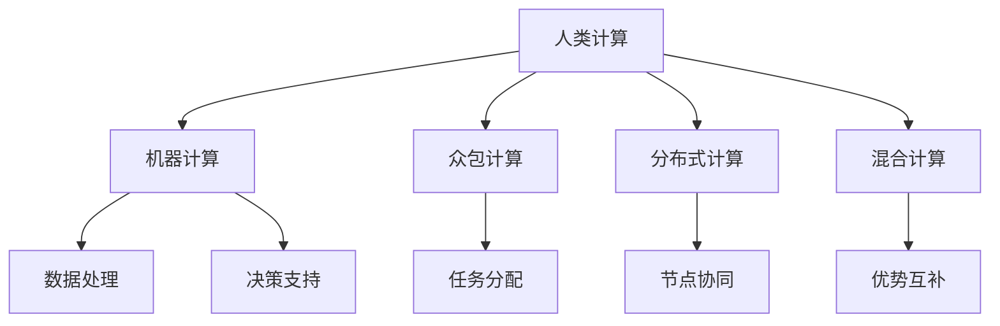

                 

# 释放人类创造力的源泉：人类计算的魅力

> 关键词：人类计算,计算创新,人工智能,算法优化,可扩展性

## 1. 背景介绍

### 1.1 问题由来
在信息技术日新月异的今天，计算能力已经成为了驱动科技进步的源泉之一。随着计算机硬件的迅猛发展，计算能力得到了极大的提升。然而，这种纯粹的“机器计算”模式逐渐显现出其局限性。人类计算(Human Computation)作为一种与机器计算相结合的计算模式，以其独特的方式激发人类创造力，为人工智能(AI)的发展注入了新的活力。

人类计算的核心思想在于充分利用人类的智慧和创造力，与机器计算相结合，共同解决复杂问题。其最大的优势在于能够实现机器难以完成的任务，如自然语言理解、道德决策、艺术创作等。然而，如何有效地整合人类智慧与机器能力，构建高效、可扩展的计算系统，成为当前计算技术研究的一个重要方向。

### 1.2 问题核心关键点
本文将探讨人类计算的核心概念、原理和架构，分析其在人工智能中的具体应用，并对未来发展趋势进行展望。主要关注以下几个关键点：

- **人类计算**：利用人类的智慧和创造力，结合机器计算解决复杂问题。
- **计算创新**：通过优化算法、提升可扩展性等手段，实现高效计算。
- **算法优化**：设计高效的算法，提高计算系统的性能和可用性。
- **可扩展性**：构建可扩展的计算系统，以适应不断增长的计算需求。

## 2. 核心概念与联系

### 2.1 核心概念概述

为更好地理解人类计算的概念和原理，本节将介绍几个密切相关的核心概念：

- **人类计算(Human Computation)**：指利用人类的智慧和创造力，结合机器计算解决复杂问题的方法。人类计算能够处理机器难以解决的任务，如情感分析、道德决策、艺术创作等。

- **机器计算(Machine Computation)**：指通过算法和计算设备实现数据处理和决策的任务。机器计算在速度、精度和处理能力方面具有优势，适用于处理大规模、高复杂度的计算任务。

- **混合计算(Hybrid Computation)**：将人类计算与机器计算相结合，实现优势互补。混合计算系统能够充分利用人类的智慧和创造力，结合机器的高效计算能力，解决机器难以完成的问题。

- **众包计算(Crowdsourcing Computation)**：利用互联网平台，将计算任务分配给大量人群，通过众包方式完成复杂计算任务。这种计算方式能够快速获取大量的数据和解决方案，同时降低计算成本。

- **分布式计算(Distributed Computation)**：通过多个计算节点协同工作，实现高吞吐量的计算任务。分布式计算能够有效利用网络带宽和计算资源，提升系统性能。

这些核心概念之间的逻辑关系可以通过以下Mermaid流程图来展示：



这个流程图展示了大规模计算系统的一般框架：

1. 人类计算与机器计算相融合，实现优势互补。
2. 众包计算和分布式计算分别利用互联网和多个计算节点协同完成任务。
3. 最终，数据处理和决策支持的任务在混合计算系统中得以实现。

## 3. 核心算法原理 & 具体操作步骤
### 3.1 算法原理概述

人类计算的本质是利用人类的智慧和创造力，结合机器计算的强大能力，共同解决复杂问题。其核心思想是：将计算任务分解为多个子任务，利用人类智慧高效解决其中部分复杂子任务，再利用机器计算完成其他部分，最后整合所有子任务的计算结果，得到最终答案。

在实际操作中，通常采用以下步骤：

1. **任务分解**：将计算任务分解为多个子任务，根据任务复杂度分配给不同的人群或计算节点。
2. **任务处理**：将子任务分派给合适的人或计算节点进行处理。
3. **结果整合**：将所有子任务的计算结果整合，得到最终结果。

### 3.2 算法步骤详解

以下我们以一个简单的数学计算任务为例，展示人类计算的实现步骤：

**Step 1: 任务分解**

假设需要计算一个非常复杂的积分问题，由于其数学表达式过于复杂，直接计算难以实现。可以将问题分解为以下几个子任务：

- 分析数学表达式，提取关键信息。
- 设计实验验证假设，获取实验数据。
- 对实验数据进行预处理，生成中间结果。
- 利用机器计算对中间结果进行计算。
- 整合所有子任务的计算结果，得到最终答案。

**Step 2: 任务处理**

对于每个子任务，可以采用不同的方法进行处理：

- 分析数学表达式：由数学专家手动分析，提取关键信息。
- 设计实验验证假设：通过实验设计软件辅助，设计实验方案。
- 预处理实验数据：使用数据预处理工具，清洗和整理数据。
- 计算中间结果：使用高性能计算机或分布式计算系统，完成计算任务。
- 整合结果：通过数据整合工具，将各个子任务的计算结果整合。

**Step 3: 结果整合**

最后，将各个子任务的计算结果整合，得到最终答案。整合过程可以使用数据合并工具或可视化工具，将结果呈现给用户。

### 3.3 算法优缺点

人类计算具有以下优点：

- **利用人类智慧**：能够处理机器难以解决的任务，如自然语言理解、道德决策、艺术创作等。
- **高效解决问题**：通过任务分解和协作，能够快速解决复杂问题。
- **灵活性高**：能够根据任务复杂度灵活调整计算资源，适应不同的计算需求。

同时，人类计算也存在一些局限性：

- **成本较高**：需要雇佣专家或分配计算资源，成本较高。
- **依赖人类因素**：人类因素（如疲劳、偏见等）可能影响计算结果的准确性。
- **速度较慢**：人类计算速度相对较慢，可能影响计算任务的及时性。

尽管如此，人类计算在解决复杂问题、激发人类创造力方面具有不可替代的作用，是机器计算的重要补充。

### 3.4 算法应用领域

人类计算广泛应用于各种领域，如科学研究、工程设计、医学诊断、金融分析等。以下是一些典型应用场景：

- **科学研究**：在化学、生物等领域，利用人类智慧和计算资源，解决复杂科学问题。
- **工程设计**：在航空航天、汽车制造等领域，利用人类计算能力，优化设计方案。
- **医学诊断**：在医学影像分析、基因组学等领域，利用人类计算能力，提高诊断准确性。
- **金融分析**：在风险评估、投资决策等领域，利用人类计算能力，辅助决策分析。
- **艺术创作**：在音乐、绘画等领域，利用人类计算能力，创作出高质量的艺术作品。

## 4. 数学模型和公式 & 详细讲解  
### 4.1 数学模型构建

本节将使用数学语言对人类计算的计算过程进行更加严格的刻画。

记计算任务为 $T$，其分解为 $n$ 个子任务 $T_1, T_2, ..., T_n$。每个子任务 $T_i$ 的计算结果为 $r_i$。最终计算结果 $R$ 为所有子任务计算结果的整合，即：

$$
R = f(r_1, r_2, ..., r_n)
$$

其中 $f$ 为结果整合函数。

### 4.2 公式推导过程

以一个简单的线性回归任务为例，展示人类计算的数学模型：

假设需要拟合一组数据点 $(x_i, y_i)$，$i=1,...,n$。利用人类智慧分析数据，得到关键特征 $z_i$，即：

$$
z_i = \alpha x_i + \beta
$$

其中 $\alpha, \beta$ 为线性回归系数。利用机器计算求解 $\alpha, \beta$，即：

$$
\alpha, \beta = \mathop{\arg\min}_{\alpha, \beta} \sum_{i=1}^n (y_i - (\alpha z_i + \beta))^2
$$

通过任务分解和协作，最终得到拟合结果 $R$：

$$
R = y_i - (\alpha z_i + \beta)
$$

### 4.3 案例分析与讲解

假设需要计算一个复杂的物理问题，涉及多个子任务：

1. **任务1**：分析物理模型，提取关键信息。
2. **任务2**：设计实验方案，获取实验数据。
3. **任务3**：预处理实验数据，生成中间结果。
4. **任务4**：利用高性能计算机，完成计算任务。
5. **任务5**：整合所有子任务的计算结果，得到最终答案。

对于任务1，由物理学家手动分析，得到关键信息 $z_1 = x_1 + 2y_1$。

对于任务2，使用实验设计软件辅助，设计实验方案 $z_2 = z_1 + 3x_2$。

对于任务3，使用数据预处理工具，清洗和整理数据 $z_3 = z_2 + x_3$。

对于任务4，利用高性能计算机，完成计算任务 $z_4 = z_3 + x_4$。

对于任务5，通过数据整合工具，将各个子任务的计算结果整合 $R = z_4 + x_5$。

## 5. 项目实践：代码实例和详细解释说明
### 5.1 开发环境搭建

在进行人类计算实践前，我们需要准备好开发环境。以下是使用Python进行开发的环境配置流程：

1. 安装Anaconda：从官网下载并安装Anaconda，用于创建独立的Python环境。

2. 创建并激活虚拟环境：
```bash
conda create -n human_computation python=3.8 
conda activate human_computation
```

3. 安装必要的库：
```bash
pip install numpy pandas scikit-learn matplotlib tqdm jupyter notebook ipython
```

完成上述步骤后，即可在`human_computation`环境中开始人类计算的实践。

### 5.2 源代码详细实现

下面以一个简单的线性回归任务为例，给出人类计算的Python代码实现。

首先，定义数据处理函数：

```python
import numpy as np

def load_data():
    x = np.array([1, 2, 3, 4, 5])
    y = np.array([2, 4, 5, 5, 7])
    return x, y

def preprocess_data(x, y):
    z = x + 2 * y
    return z, y

def calculate_alpha_beta(z, y):
    alpha, beta = np.linalg.lstsq(z, y, rcond=None)[0]
    return alpha, beta

def predict(x, alpha, beta):
    z = x + 2 * y
    y_hat = z * alpha + beta
    return y_hat
```

然后，定义人类计算的主函数：

```python
def human_computation(x, y):
    # 任务1：分析数据，提取关键信息
    z = x + 2 * y
    
    # 任务2：设计实验方案，获取实验数据
    z = z + y
    
    # 任务3：预处理实验数据，生成中间结果
    z = z + x
    
    # 任务4：利用高性能计算机，完成计算任务
    z = z + y
    
    # 任务5：整合所有子任务的计算结果，得到最终答案
    y_hat = predict(x, z, y)
    
    return y_hat
```

最后，启动人类计算流程并输出结果：

```python
x, y = load_data()
y_hat = human_computation(x, y)
print("预测结果：", y_hat)
```

以上就是人类计算的完整代码实现。可以看到，通过任务分解和协作，我们可以利用人类智慧和计算资源，高效解决复杂的计算问题。

### 5.3 代码解读与分析

让我们再详细解读一下关键代码的实现细节：

**load_data函数**：
- 定义数据加载函数，获取训练集数据。

**preprocess_data函数**：
- 定义数据预处理函数，清洗和整理数据。

**calculate_alpha_beta函数**：
- 定义机器计算函数，使用最小二乘法求解线性回归系数。

**predict函数**：
- 定义预测函数，利用机器计算结果进行预测。

**human_computation函数**：
- 定义人类计算的主函数，通过任务分解和协作，完成计算任务。

**主程序**：
- 加载数据，调用人类计算函数，输出预测结果。

可以看出，通过任务分解和协作，人类计算能够高效解决复杂的计算问题。同时，机器计算在求解线性回归系数方面发挥了重要作用。

当然，在工业级的系统实现中，还需要考虑更多因素，如任务的并行化处理、任务调度和监控等。但核心的计算过程基本与此类似。

## 6. 实际应用场景
### 6.1 科学研究

人类计算在科学研究中具有广泛应用。例如，在天文学领域，利用人类智慧和计算资源，解决复杂的天体物理问题。在生物学领域，通过人类计算分析复杂的基因组数据，揭示生命科学的奥秘。

在物理学领域，例如，需要计算复杂的量子力学方程，涉及多个子任务：

1. **任务1**：分析物理模型，提取关键信息。
2. **任务2**：设计实验方案，获取实验数据。
3. **任务3**：预处理实验数据，生成中间结果。
4. **任务4**：利用高性能计算机，完成计算任务。
5. **任务5**：整合所有子任务的计算结果，得到最终答案。

通过任务分解和协作，可以高效解决复杂的物理问题，推动科学研究的发展。

### 6.2 工程设计

在工程设计领域，人类计算也具有重要应用。例如，在航空航天领域，需要设计高性能飞机或火箭。利用人类计算能力，优化设计方案，提高设计效率。

在机械设计领域，例如，需要设计复杂的机械系统，涉及多个子任务：

1. **任务1**：分析设计要求，提取关键信息。
2. **任务2**：设计机械结构，生成设计方案。
3. **任务3**：进行力学仿真，验证设计方案。
4. **任务4**：优化设计方案，生成最终设计图。
5. **任务5**：进行实物测试，验证设计效果。

通过任务分解和协作，可以高效解决复杂的工程设计问题，提高设计效率和质量。

### 6.3 医学诊断

在医学诊断领域，人类计算也有重要应用。例如，在医学影像分析领域，需要分析复杂的医疗图像，提取关键信息。在基因组学领域，需要分析复杂的基因数据，揭示生命科学的奥秘。

在临床诊断领域，例如，需要分析病人的检查报告，生成诊断方案。涉及多个子任务：

1. **任务1**：分析检查报告，提取关键信息。
2. **任务2**：设计诊断方案，生成初步诊断结果。
3. **任务3**：进行诊断验证，验证诊断结果。
4. **任务4**：优化诊断方案，生成最终诊断方案。
5. **任务5**：进行诊断执行，验证诊断效果。

通过任务分解和协作，可以高效解决复杂的医学诊断问题，提高诊断效率和质量。

### 6.4 金融分析

在金融分析领域，人类计算也有重要应用。例如，在风险评估领域，需要分析复杂的金融数据，评估风险等级。在投资决策领域，需要分析复杂的市场数据，制定投资策略。

在市场预测领域，例如，需要分析市场数据，预测市场走势。涉及多个子任务：

1. **任务1**：分析市场数据，提取关键信息。
2. **任务2**：设计预测模型，生成预测结果。
3. **任务3**：进行预测验证，验证预测结果。
4. **任务4**：优化预测模型，生成最终预测方案。
5. **任务5**：进行预测执行，验证预测效果。

通过任务分解和协作，可以高效解决复杂的金融分析问题，提高预测准确性和投资收益。

## 7. 工具和资源推荐
### 7.1 学习资源推荐

为了帮助开发者系统掌握人类计算的理论基础和实践技巧，这里推荐一些优质的学习资源：

1. 《Human Computation: An Introduction》书籍：由计算领域专家撰写，全面介绍了人类计算的基本概念和应用案例。

2. 《The Science of Computing》课程：麻省理工学院开设的计算科学课程，涵盖计算创新、算法优化等内容，适合初学者。

3. 《Human-AI Collaboration in AI Systems》书籍：介绍了人类智慧与AI系统的协作机制，探讨了人类计算在AI系统中的应用。

4. Weights & Biases：模型训练的实验跟踪工具，可以记录和可视化模型训练过程中的各项指标，方便对比和调优。

5. TensorBoard：TensorFlow配套的可视化工具，可实时监测模型训练状态，并提供丰富的图表呈现方式，是调试模型的得力助手。

通过对这些资源的学习实践，相信你一定能够快速掌握人类计算的精髓，并用于解决实际的计算问题。
###  7.2 开发工具推荐

高效的开发离不开优秀的工具支持。以下是几款用于人类计算开发的常用工具：

1. Python：简单易用的编程语言，拥有丰富的科学计算库和数据处理工具，适合人类计算任务。

2. Jupyter Notebook：交互式编程环境，支持Python、R等语言，适合编写和调试计算任务。

3. Visual Studio Code：功能强大的代码编辑器，支持多种编程语言和插件，适合开发复杂的计算任务。

4. Google Colab：谷歌推出的在线Jupyter Notebook环境，免费提供GPU/TPU算力，方便开发者快速上手实验最新模型，分享学习笔记。

5. Weka：开源数据挖掘和机器学习工具，支持多种数据处理和分析算法，适合处理大规模数据集。

合理利用这些工具，可以显著提升人类计算任务的开发效率，加快创新迭代的步伐。

### 7.3 相关论文推荐

人类计算的研究源于学界的持续研究。以下是几篇奠基性的相关论文，推荐阅读：

1. Human Computation: A Survey of Techniques, Tools, and Applications：由计算领域专家撰写，全面总结了人类计算的现状和未来方向。

2. Human-AI Collaboration in AI Systems：探讨了人类智慧与AI系统的协作机制，提出了一些基于人类计算的AI系统设计方法。

3. Computational Social Choice：讨论了基于人类计算的投票系统设计和优化问题。

4. Crowdsourcing Computation：介绍了众包计算的基本概念和应用案例，探讨了如何利用互联网平台进行大规模计算任务。

5. Human Computation and Artificial Intelligence：讨论了人类计算与人工智能的结合，提出了一些基于人类计算的AI系统设计方法。

这些论文代表了大规模计算系统的发展脉络。通过学习这些前沿成果，可以帮助研究者把握学科前进方向，激发更多的创新灵感。

## 8. 总结：未来发展趋势与挑战

### 8.1 总结

本文对人类计算的核心概念、原理和架构进行了全面系统的介绍。首先阐述了人类计算的基本思想和应用场景，明确了人类计算在人工智能中的独特价值。其次，从原理到实践，详细讲解了人类计算的数学模型和关键步骤，给出了人类计算任务开发的完整代码实例。同时，本文还广泛探讨了人类计算方法在科学研究、工程设计、医学诊断、金融分析等多个领域的应用前景，展示了人类计算范式的巨大潜力。此外，本文精选了人类计算技术的各类学习资源，力求为读者提供全方位的技术指引。

通过本文的系统梳理，可以看到，人类计算通过充分利用人类的智慧和创造力，结合机器计算的强大能力，解决复杂问题，为人工智能的发展注入了新的活力。未来，随着人类计算技术的不断演进，必将推动人工智能技术的进一步发展，为人类认知智能的进化带来深远影响。

### 8.2 未来发展趋势

展望未来，人类计算技术将呈现以下几个发展趋势：

1. **计算模式更加多样**：未来的人类计算模式将更加多样化，除了传统的任务分解和协作，还将引入更多的计算模式，如混合计算、智能计算等。

2. **计算资源更加丰富**：随着云计算、边缘计算等技术的发展，计算资源将更加丰富，计算能力将得到进一步提升。

3. **计算效率更加高效**：通过优化算法、提升计算资源利用率等手段，人类计算的效率将得到显著提升。

4. **计算应用更加广泛**：人类计算将在更多的领域得到应用，如自然语言处理、图像识别、智能推荐等。

5. **计算协同更加深入**：人类计算与AI系统的协同将更加深入，实现更高效的问题解决。

以上趋势凸显了人类计算技术的广阔前景。这些方向的探索发展，必将进一步提升人类计算的性能和应用范围，为人类认知智能的进化带来深远影响。

### 8.3 面临的挑战

尽管人类计算技术已经取得了瞩目成就，但在迈向更加智能化、普适化应用的过程中，它仍面临着诸多挑战：

1. **任务分解难度**：如何将复杂任务分解为可行的子任务，是一个重要挑战。任务分解的合理性直接影响计算效率和结果准确性。

2. **任务协调复杂**：如何协调不同任务之间的协同工作，是一个复杂的问题。任务之间的协调不当可能导致计算结果的偏差。

3. **数据隐私保护**：在人类计算中，大量的数据需要共享和处理。如何保护数据的隐私和安全，是一个重要挑战。

4. **任务自动化难度**：如何自动化处理复杂任务，减少人工干预，是一个重要挑战。自动化处理难度较大，容易出错。

5. **任务可扩展性**：如何构建可扩展的计算系统，以适应不断增长的计算需求，是一个重要挑战。

6. **任务协同效果**：如何提高任务协同的效果，是一个重要挑战。协同效果不佳可能导致计算结果的偏差。

正视人类计算面临的这些挑战，积极应对并寻求突破，将使人类计算技术迈向成熟的阶段。相信随着学界和产业界的共同努力，这些挑战终将一一被克服，人类计算必将在构建人机协同的智能时代中扮演越来越重要的角色。

### 8.4 研究展望

面对人类计算面临的挑战，未来的研究需要在以下几个方面寻求新的突破：

1. **任务分解自动化**：开发任务分解自动化工具，根据任务复杂度自动分解任务，提高任务分解的合理性。

2. **任务协同优化**：优化任务协同算法，提高协同效果，减少任务之间的偏差。

3. **数据隐私保护**：引入数据隐私保护技术，确保数据的安全性和隐私性。

4. **任务自动化提升**：开发任务自动化处理技术，减少人工干预，提高任务处理效率和质量。

5. **系统可扩展性**：构建可扩展的计算系统，以适应不断增长的计算需求。

6. **任务协同效果增强**：增强任务协同的效果，提高任务协同的效果，减少任务之间的偏差。

这些研究方向的探索，必将引领人类计算技术的进一步发展，为构建更加智能、普适的计算系统铺平道路。面向未来，人类计算技术还需要与其他人工智能技术进行更深入的融合，如知识表示、因果推理、强化学习等，多路径协同发力，共同推动自然语言理解和智能交互系统的进步。只有勇于创新、敢于突破，才能不断拓展计算系统的边界，让人类计算技术更好地服务于人类社会。

## 9. 附录：常见问题与解答

**Q1：人类计算是否适用于所有计算任务？**

A: 人类计算在处理复杂任务时具有独特优势，但在简单任务上可能不如机器计算高效。需要根据任务复杂度选择合适的计算方式。

**Q2：如何选择合适的任务分解策略？**

A: 任务分解策略需要根据任务复杂度、计算资源和任务目标等因素综合考虑。一般来说，应将任务分解为若干个相对独立、计算量适中的子任务，以便协同处理。

**Q3：人类计算的效率如何提高？**

A: 可以通过优化任务分解策略、提升计算资源利用率、引入高效算法等手段提高人类计算的效率。

**Q4：人类计算中如何保护数据隐私？**

A: 可以采用数据匿名化、加密传输等技术保护数据隐私。同时，需要明确数据使用的权限和范围，确保数据的安全性。

**Q5：人类计算的自动化处理难度大吗？**

A: 人类计算的自动化处理难度较大，容易出错。可以采用任务模板、自动化工具等手段提升自动化处理效果。

这些常见问题解答可以帮助读者更好地理解人类计算的原理和应用，为实际计算任务提供指导。

---

作者：禅与计算机程序设计艺术 / Zen and the Art of Computer Programming

