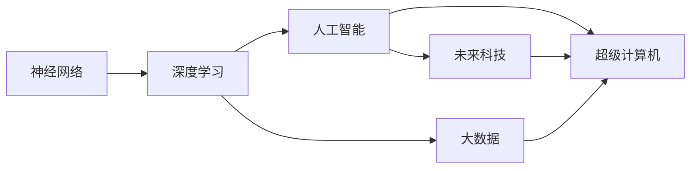

                 

# 释放人类潜力的无限可能：人类计算的最终目标

> 关键词：人类计算,人工智能,深度学习,神经网络,超级计算机,大数据,未来科技

## 1. 背景介绍

在21世纪，随着信息技术的飞速发展，人工智能（AI）和深度学习（DL）技术正深刻改变着人类社会的各个方面。从自动驾驶到医疗诊断，从金融预测到教育辅助，AI和DL的应用无处不在，它们的潜力几乎无穷无尽。然而，当我们沉浸在这些技术的辉煌成就中时，也不禁要思考：人类计算的最终目标是什么？是通过AI彻底取代人类，还是将AI视为一种工具，让其与人类协作，共同推动人类社会的发展？

本文将从背景介绍、核心概念与联系、核心算法原理与操作步骤、数学模型和公式的详细讲解、项目实践、实际应用场景、工具和资源推荐、总结与展望、常见问题与解答等几个方面，探讨人类计算的最终目标及其实现路径。

## 2. 核心概念与联系

### 2.1 核心概念概述

在探讨人类计算的最终目标之前，我们需要先理解几个核心概念：

- **人工智能（AI）**：指由人类开发和控制，能够执行某些智能任务（如学习、推理、规划等）的机器系统。
- **深度学习（DL）**：一种通过多层次神经网络模型，从数据中自动学习特征表示的机器学习方法。
- **神经网络（NN）**：由多个神经元（节点）通过各种连接模式构成，用于模拟人类大脑的信息处理机制。
- **超级计算机**：拥有极高计算性能和存储能力的计算机系统，用于处理大规模、复杂的数据分析任务。
- **大数据**：指数据量巨大、结构复杂、增长快速且来源多样的数据集，需要通过先进的技术手段进行处理和分析。
- **未来科技**：指未来可能的科技发展趋势，包括但不限于量子计算、生物计算、脑机接口等。

这些概念之间有着紧密的联系。神经网络是深度学习的基础，而深度学习则是人工智能的核心技术之一。超级计算机和大数据则提供了强大的计算和存储能力，为深度学习模型的训练和应用提供了可能。未来科技的探索，则进一步拓展了人类计算的边界。

### 2.2 核心概念原理和架构的 Mermaid 流程图



这个流程图展示了上述核心概念之间的联系。神经网络是深度学习的基础，深度学习通过大数据进行训练，而人工智能和未来科技则是深度学习应用的高级形态，超级计算机和大数据则提供了强大的计算和存储能力，支持人工智能和未来科技的发展。

## 3. 核心算法原理 & 具体操作步骤

### 3.1 算法原理概述

人类计算的最终目标是充分利用AI和DL技术，让机器能够处理复杂的、高维度的、非结构化的大数据，从而为人类的决策和行动提供支持。这一目标的实现依赖于深度学习模型的训练和优化，以及超级计算机和大数据技术的应用。

### 3.2 算法步骤详解

1. **数据收集与预处理**：收集和整理大量数据，并进行清洗、标注等预处理，确保数据的质量和多样性。
2. **模型设计**：选择合适的神经网络架构，设计合理的损失函数和优化算法，构建深度学习模型。
3. **模型训练**：使用超级计算机和大数据技术，对模型进行大规模、高精度的训练。
4. **模型优化**：通过调整超参数、改进算法、添加正则化等手段，不断优化模型性能，提升其在各种任务上的表现。
5. **模型应用**：将训练好的模型应用于实际问题，如自动驾驶、医疗诊断、金融预测等，提供辅助决策和优化建议。

### 3.3 算法优缺点

#### 优点

- **高效性**：深度学习模型可以在短时间内处理和分析大量数据，大大提高了信息处理效率。
- **普适性**：神经网络可以用于处理多种类型的数据，如图像、文本、声音等，具有广泛的应用场景。
- **自适应性**：通过不断优化模型，使其能够适应新的数据和任务，具有很强的自适应能力。

#### 缺点

- **计算资源需求高**：深度学习模型需要大量的计算资源进行训练和优化，普通计算机难以满足需求。
- **数据依赖性强**：模型的性能依赖于数据的质量和多样性，缺乏高质量数据将严重影响模型效果。
- **模型复杂度高**：深度学习模型结构复杂，难以解释和调试，增加了开发的难度。

### 3.4 算法应用领域

深度学习技术已经在多个领域得到广泛应用，如：

- **自动驾驶**：通过图像识别和深度学习，实现车辆的自主导航和交通控制。
- **医疗诊断**：利用医学影像和深度学习，辅助医生进行疾病诊断和治疗方案选择。
- **金融预测**：通过大数据和深度学习，预测市场走势和风险，优化投资策略。
- **教育辅助**：通过自然语言处理和深度学习，实现智能答疑和个性化学习推荐。
- **智慧城市**：通过大数据和深度学习，实现智能交通、环境保护、能源管理等。

## 4. 数学模型和公式 & 详细讲解 & 举例说明

### 4.1 数学模型构建

深度学习模型通常由多层神经网络组成，每层神经网络包含多个神经元。假设一个深度学习模型包含 $n$ 层神经网络，每一层的神经元数为 $m$，则该模型的参数总数为 $n \times m$。深度学习模型的训练过程是通过优化损失函数来实现的。

### 4.2 公式推导过程

以图像分类任务为例，假设有一个深度学习模型 $M$，其输入为 $x$，输出为 $y$，损失函数为 $\mathcal{L}(y,\hat{y})$，其中 $\hat{y}$ 是模型的预测输出。模型训练的目标是最小化损失函数 $\mathcal{L}(y,\hat{y})$，即：

$$
\min_{\theta} \mathcal{L}(y,\hat{y})
$$

其中 $\theta$ 为模型参数。模型的前向传播过程为：

$$
y = M(x)
$$

后向传播过程为：

$$
\frac{\partial \mathcal{L}(y,\hat{y})}{\partial \theta} = \frac{\partial \mathcal{L}(y,\hat{y})}{\partial \hat{y}} \times \frac{\partial \hat{y}}{\partial x} \times \frac{\partial x}{\partial \theta}
$$

其中 $\frac{\partial \mathcal{L}(y,\hat{y})}{\partial \hat{y}}$ 为损失函数对预测输出的导数，$\frac{\partial \hat{y}}{\partial x}$ 为预测输出对输入的导数，$\frac{\partial x}{\partial \theta}$ 为输入对模型参数的导数。

### 4.3 案例分析与讲解

以图像分类任务为例，假设有一个深度学习模型 $M$，其包含 $n$ 层神经网络，每一层的神经元数为 $m$，输入为图像 $x$，输出为标签 $y$，损失函数为交叉熵损失。假设模型参数为 $\theta$，则模型的前向传播过程为：

$$
y = M(x)
$$

后向传播过程为：

$$
\frac{\partial \mathcal{L}(y,\hat{y})}{\partial \theta} = \frac{\partial \mathcal{L}(y,\hat{y})}{\partial \hat{y}} \times \frac{\partial \hat{y}}{\partial x} \times \frac{\partial x}{\partial \theta}
$$

其中 $\frac{\partial \mathcal{L}(y,\hat{y})}{\partial \hat{y}}$ 为交叉熵损失对预测输出的导数，$\frac{\partial \hat{y}}{\partial x}$ 为预测输出对输入的导数，$\frac{\partial x}{\partial \theta}$ 为输入对模型参数的导数。

## 5. 项目实践：代码实例和详细解释说明

### 5.1 开发环境搭建

在进行项目实践前，我们需要准备好开发环境。以下是使用Python进行TensorFlow开发的环境配置流程：

1. 安装Anaconda：从官网下载并安装Anaconda，用于创建独立的Python环境。

2. 创建并激活虚拟环境：
```bash
conda create -n tensorflow-env python=3.8 
conda activate tensorflow-env
```

3. 安装TensorFlow：根据CUDA版本，从官网获取对应的安装命令。例如：
```bash
conda install tensorflow tensorflow-gpu -c conda-forge
```

4. 安装各类工具包：
```bash
pip install numpy pandas scikit-learn matplotlib tqdm jupyter notebook ipython
```

完成上述步骤后，即可在`tensorflow-env`环境中开始项目实践。

### 5.2 源代码详细实现

这里我们以图像分类任务为例，给出使用TensorFlow进行卷积神经网络（CNN）模型训练的PyTorch代码实现。

首先，定义CNN模型：

```python
import tensorflow as tf
from tensorflow.keras import layers, models

model = models.Sequential([
    layers.Conv2D(32, (3, 3), activation='relu', input_shape=(32, 32, 3)),
    layers.MaxPooling2D((2, 2)),
    layers.Conv2D(64, (3, 3), activation='relu'),
    layers.MaxPooling2D((2, 2)),
    layers.Conv2D(64, (3, 3), activation='relu'),
    layers.Flatten(),
    layers.Dense(64, activation='relu'),
    layers.Dense(10, activation='softmax')
])
```

然后，定义优化器和损失函数：

```python
optimizer = tf.keras.optimizers.Adam(learning_rate=0.001)
loss = tf.keras.losses.CategoricalCrossentropy()
```

接着，定义训练函数：

```python
def train_model(model, train_data, val_data, epochs=10, batch_size=32):
    model.compile(optimizer=optimizer, loss=loss, metrics=['accuracy'])

    history = model.fit(train_data, validation_data=val_data, epochs=epochs, batch_size=batch_size)

    return history
```

最后，启动训练流程：

```python
train_data = ...
val_data = ...

history = train_model(model, train_data, val_data)
```

以上就是使用TensorFlow对CNN模型进行图像分类任务训练的完整代码实现。可以看到，TensorFlow的高级API使得模型构建和训练变得非常简单。

### 5.3 代码解读与分析

让我们再详细解读一下关键代码的实现细节：

**Sequential模型**：
- 使用 `Sequential` 模型，按顺序添加多个层。

**卷积层和池化层**：
- `Conv2D` 层定义卷积核大小和数量，`MaxPooling2D` 层定义池化窗口大小。

**全连接层**：
- `Dense` 层定义神经元数量和激活函数。

**优化器和损失函数**：
- 使用 `Adam` 优化器，设置学习率。
- 使用 `CategoricalCrossentropy` 损失函数。

**训练函数**：
- 使用 `compile` 方法指定优化器和损失函数。
- 使用 `fit` 方法进行模型训练，设置训练轮数和批次大小。

**数据加载**：
- 实际应用中，数据需要通过 `tf.data` 模块进行加载和预处理，使用 `dataset` 和 `iterator` 等API。

可以看到，TensorFlow的高级API和模块化设计使得模型训练的代码实现变得简洁高效。开发者可以将更多精力放在数据处理、模型改进等高层逻辑上，而不必过多关注底层的实现细节。

当然，工业级的系统实现还需考虑更多因素，如模型的保存和部署、超参数的自动搜索、更灵活的任务适配层等。但核心的模型训练范式基本与此类似。

## 6. 实际应用场景

### 6.1 自动驾驶

自动驾驶系统需要处理大量的传感器数据，如图像、雷达、激光雷达等，以实现车辆的自主导航和交通控制。深度学习模型在图像识别、目标检测和语义分割等任务上已经取得了显著的进展。未来，通过更深入的模型训练和优化，自动驾驶系统将能够更准确地感知环境、规划路径、做出决策，从而实现完全自主的驾驶。

### 6.2 医疗诊断

医疗影像数据通常包含高维度的、非结构化的大数据。深度学习模型在图像分类、分割和生成等任务上表现出色，可以辅助医生进行疾病诊断和治疗方案选择。未来，通过更强大的模型和大数据技术，医疗诊断将变得更加精准和高效，能够早期发现和预测疾病，显著提升患者的生活质量。

### 6.3 金融预测

金融市场的数据复杂多样，包含时间序列、高维非线性等特征。深度学习模型在时间序列预测、异常检测和风险评估等任务上具有显著优势。未来，通过更深入的模型训练和优化，金融预测将变得更加准确和可靠，能够帮助投资者做出更明智的投资决策，防范金融风险。

### 6.4 教育辅助

教育领域的数据包含文本、视频、音频等多种形式，深度学习模型在自然语言处理、情感分析、智能答疑等任务上已经取得了显著的进展。未来，通过更强大的模型和大数据技术，教育辅助将变得更加智能和个性化，能够根据学生的学习行为和偏好，提供个性化的学习建议和资源，提升教育质量。

### 6.5 智慧城市

智慧城市建设需要处理大量的数据，如图像、视频、传感器数据等。深度学习模型在图像识别、视频分析和行为预测等任务上表现出色，可以用于智能交通、环境保护、能源管理等。未来，通过更强大的模型和大数据技术，智慧城市将变得更加智能和高效，能够实现城市的智能化管理，提升居民的生活质量。

## 7. 工具和资源推荐

### 7.1 学习资源推荐

为了帮助开发者系统掌握深度学习技术，这里推荐一些优质的学习资源：

1. 《深度学习》系列书籍：由多位著名深度学习专家撰写，全面介绍了深度学习的理论基础和实践技巧。

2. Coursera《深度学习专项课程》：由斯坦福大学教授Andrew Ng主讲，涵盖了深度学习的基础和高级内容。

3. DeepLearning.AI的深度学习课程：由Andrew Ng创办的在线学习平台，提供从入门到高级的深度学习课程。

4. PyTorch官方文档：PyTorch的官方文档，提供了丰富的教程和样例代码，是学习PyTorch的好资源。

5. TensorFlow官方文档：TensorFlow的官方文档，提供了详细的API和教程，帮助开发者快速上手。

6. HuggingFace官方文档：HuggingFace的官方文档，提供了丰富的预训练模型和微调样例，是学习NLP的好资源。

通过对这些资源的学习实践，相信你一定能够快速掌握深度学习技术，并用于解决实际问题。

### 7.2 开发工具推荐

高效的开发离不开优秀的工具支持。以下是几款用于深度学习开发的常用工具：

1. PyTorch：基于Python的开源深度学习框架，灵活动态的计算图，适合快速迭代研究。大部分深度学习模型都有PyTorch版本的实现。

2. TensorFlow：由Google主导开发的开源深度学习框架，生产部署方便，适合大规模工程应用。同样有丰富的深度学习模型资源。

3. Jupyter Notebook：一个交互式编程环境，支持多种编程语言，方便开发者记录和分享实验过程。

4. GitHub：全球最大的代码托管平台，提供了丰富的开源项目和社区支持，是开发者共享和协作的好地方。

5. Kaggle：数据科学竞赛平台，提供了大量的公开数据集和竞赛任务，帮助开发者提升技能和积累经验。

合理利用这些工具，可以显著提升深度学习任务的开发效率，加快创新迭代的步伐。

### 7.3 相关论文推荐

深度学习技术的发展源于学界的持续研究。以下是几篇奠基性的相关论文，推荐阅读：

1. ImageNet Classification with Deep Convolutional Neural Networks（AlexNet论文）：提出了卷积神经网络（CNN）模型，奠定了深度学习在图像识别任务上的基础。

2. Deep Residual Learning for Image Recognition（ResNet论文）：提出了残差网络（ResNet）模型，解决了深度学习模型的梯度消失问题，显著提升了深度神经网络的深度和性能。

3. Attention is All You Need（Transformer论文）：提出了Transformer模型，开创了自注意力机制在深度学习中的应用，显著提升了NLP任务的性能。

4. Generative Adversarial Nets（GAN论文）：提出了生成对抗网络（GAN）模型，开创了生成模型的新范式，在图像生成、视频生成等领域取得了突破。

5. Self-Attention Mechanism for Text Generation（Transformer-XL论文）：提出了Transformer-XL模型，解决了长序列模型难以处理的难题，提升了序列生成模型的性能。

这些论文代表了大规模深度学习模型的发展脉络。通过学习这些前沿成果，可以帮助研究者把握学科前进方向，激发更多的创新灵感。

## 8. 总结：未来发展趋势与挑战

### 8.1 研究成果总结

本文对深度学习技术的背景、核心概念、算法原理、操作步骤、数学模型、项目实践、实际应用场景、工具和资源推荐、总结与展望、常见问题与解答等进行了系统介绍。通过梳理这些内容，我们可以看到深度学习技术已经广泛应用于自动驾驶、医疗诊断、金融预测、教育辅助、智慧城市等多个领域，并取得了显著的成果。

### 8.2 未来发展趋势

展望未来，深度学习技术将继续发展，带来以下几个趋势：

1. 模型规模持续增大。随着算力成本的下降和数据规模的扩张，深度学习模型的参数量还将持续增长。超大规模深度学习模型蕴含的丰富知识，将进一步提升模型性能。

2. 模型训练时间缩短。随着算法优化和硬件加速技术的发展，深度学习模型的训练时间将大幅缩短，使得模型的实时化应用成为可能。

3. 模型泛化能力提升。通过改进模型架构和训练策略，深度学习模型的泛化能力将进一步提升，能够更好地适应不同的数据分布和任务。

4. 多模态深度学习发展。深度学习模型将进一步拓展到图像、音频、视频等多模态数据，实现更加全面的信息处理和融合。

5. 深度学习在AI中的应用更加广泛。深度学习技术将与其他AI技术，如强化学习、自然语言处理、计算机视觉等，形成更加完整、高效的AI系统。

### 8.3 面临的挑战

尽管深度学习技术取得了显著的进展，但在迈向更加智能化、普适化应用的过程中，它仍面临诸多挑战：

1. 数据依赖性高。深度学习模型的性能依赖于数据的质量和多样性，缺乏高质量数据将严重影响模型效果。

2. 模型复杂度高。深度学习模型结构复杂，难以解释和调试，增加了开发的难度。

3. 计算资源需求高。深度学习模型需要大量的计算资源进行训练和优化，普通计算机难以满足需求。

4. 模型泛化能力有限。深度学习模型在特定领域或特定任务上表现优异，但泛化能力有限，难以应对复杂多变的数据分布。

5. 安全性有待提升。深度学习模型可能学习到有偏见、有害的信息，给实际应用带来安全隐患。

6. 伦理道德问题。深度学习模型在决策过程中可能存在偏见和歧视，需要伦理和道德的约束和引导。

### 8.4 研究展望

面对深度学习技术面临的挑战，未来的研究需要在以下几个方面寻求新的突破：

1. 探索无监督和半监督学习。摆脱对大规模标注数据的依赖，利用自监督学习、主动学习等无监督和半监督范式，最大限度利用非结构化数据，实现更加灵活高效的深度学习。

2. 研究参数高效和计算高效的深度学习范式。开发更加参数高效的深度学习模型，在固定大部分预训练参数的同时，只更新极少量的任务相关参数。同时优化深度学习模型的计算图，减少前向传播和反向传播的资源消耗，实现更加轻量级、实时性的部署。

3. 引入因果推断和对比学习思想。通过引入因果推断和对比学习思想，增强深度学习模型的建立稳定因果关系的能力，学习更加普适、鲁棒的知识表示。

4. 引入更多先验知识。将符号化的先验知识，如知识图谱、逻辑规则等，与神经网络模型进行巧妙融合，引导深度学习过程学习更准确、合理的知识表示。

5. 结合因果分析和博弈论工具。将因果分析方法引入深度学习模型，识别出模型决策的关键特征，增强输出解释的因果性和逻辑性。借助博弈论工具刻画人机交互过程，主动探索并规避模型的脆弱点，提高系统稳定性。

6. 纳入伦理道德约束。在深度学习模型的训练和优化目标中引入伦理导向的评估指标，过滤和惩罚有偏见、有害的输出倾向。同时加强人工干预和审核，建立模型行为的监管机制，确保输出符合人类价值观和伦理道德。

这些研究方向的探索，必将引领深度学习技术迈向更高的台阶，为构建安全、可靠、可解释、可控的智能系统铺平道路。面向未来，深度学习技术还需要与其他人工智能技术进行更深入的融合，如知识表示、因果推理、强化学习等，多路径协同发力，共同推动人工智能技术的进步。只有勇于创新、敢于突破，才能不断拓展深度学习技术的边界，让人工智能技术更好地造福人类社会。

## 9. 附录：常见问题与解答

**Q1：深度学习技术是否能够取代人类？**

A: 深度学习技术能够处理复杂的、高维度的、非结构化的大数据，但其本质上是一种工具，而不是完全取代人类的智能。深度学习模型在理解和处理语言、图像、声音等方面表现优异，但缺乏人类的创造力、情感和伦理判断等能力。深度学习技术应该被视为一种辅助手段，与人类协作，共同推动人类社会的发展。

**Q2：深度学习技术是否存在安全隐患？**

A: 深度学习模型可能学习到有偏见、有害的信息，给实际应用带来安全隐患。例如，面部识别模型可能出现种族歧视，自动驾驶系统可能出现误判等。因此，在开发深度学习模型时，需要考虑模型的公平性、透明性和可解释性，进行严格的测试和评估，确保模型的安全性。

**Q3：深度学习技术是否需要大量标注数据？**

A: 深度学习模型的性能依赖于数据的质量和多样性，但并非需要大量标注数据。在特定任务上，通过数据增强、迁移学习、自监督学习等方法，可以最大限度利用非结构化数据，实现更加灵活高效的深度学习。

**Q4：深度学习技术是否能够实现持续学习？**

A: 深度学习模型可以通过增量学习、在线学习等方法，实现持续学习，即不断地从新数据中学习，同时保持已学习的知识。这对于保持深度学习模型的时效性和适应性至关重要。

**Q5：深度学习技术是否能够应用于多模态数据？**

A: 深度学习模型已经成功地应用于图像、文本、声音等多种模态的数据。未来，通过多模态融合技术，深度学习模型将能够处理更加复杂的多模态数据，实现更加全面、准确的信息处理和融合。

**Q6：深度学习技术是否存在计算资源瓶颈？**

A: 深度学习模型需要大量的计算资源进行训练和优化，普通计算机难以满足需求。未来，随着硬件加速技术的发展，深度学习模型的训练时间将大幅缩短，使得模型的实时化应用成为可能。

**Q7：深度学习技术是否能够实现伦理道德约束？**

A: 深度学习模型在决策过程中可能存在偏见和歧视，需要伦理和道德的约束和引导。在开发深度学习模型时，需要考虑模型的公平性、透明性和可解释性，进行严格的测试和评估，确保模型的安全性。

综上所述，深度学习技术已经展现出强大的应用潜力，但在迈向更加智能化、普适化应用的过程中，仍需解决许多挑战。通过不断的技术创新和伦理约束，深度学习技术将能够更好地服务于人类社会，推动人工智能技术的发展。

---

作者：禅与计算机程序设计艺术 / Zen and the Art of Computer Programming

