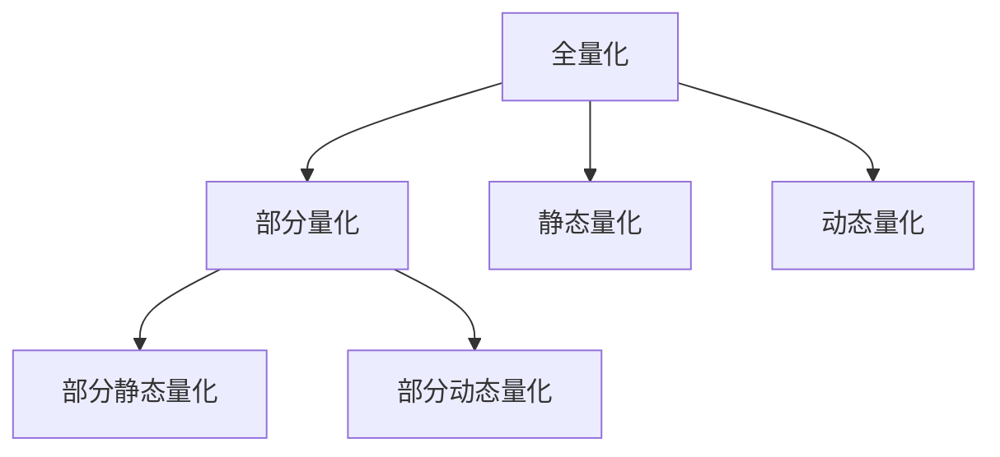

                 

## 1. 背景介绍

在深度学习模型的发展过程中，模型的性能提升与模型大小的增长常常是成反比的关系。随着模型复杂度的增加，参数数量、计算量、存储空间的需求也随之增长。对于资源有限的应用场景，如移动设备、嵌入式系统等，模型大小的压缩和优化变得尤为重要。量化压缩技术作为一项重要的模型优化技术，通过降低模型参数的精度，显著减小模型尺寸，同时保持模型的精度。

### 1.1 问题由来
在大规模深度学习模型中，每个参数都需要占用4字节的存储和计算资源。在图像、音频等高维数据的处理中，模型的计算量与参数数量呈平方级增长，使得模型无法在有限的计算资源上运行。量化压缩技术通过降低模型参数的精度，显著减小模型尺寸，同时保持模型的精度，使得模型能够在有限的计算资源上运行。

### 1.2 问题核心关键点
量化压缩技术的核心在于通过降低模型参数的精度，减小模型尺寸，同时保持模型的精度。主要包括以下几个关键点：
- **精度与尺寸的平衡**：如何在降低模型参数精度的同时，保持模型的精度。
- **量化策略的选择**：全量化还是部分量化？静态量化还是动态量化？
- **量化方法的实现**：如何高效实现量化过程，最小化性能损失。
- **量化效果的评估**：如何评估量化后模型的性能，确定量化程度。

### 1.3 问题研究意义
量化压缩技术对深度学习模型的大小和性能有着显著的影响。通过量化压缩，不仅可以显著减小模型的尺寸，降低计算和存储资源的消耗，还可以在一定程度上提升模型的运行速度。在移动设备、嵌入式系统、IoT等领域，量化压缩技术的应用可以显著提升模型的部署效率和用户体验。

## 2. 核心概念与联系

### 2.1 核心概念概述

量化压缩技术是深度学习模型优化中的一项重要技术，旨在通过降低模型参数的精度，减小模型尺寸，同时保持模型的精度。主要包括全量化、部分量化、静态量化、动态量化等几种常见的量化策略。

- **全量化**：将模型中所有的参数都量化为低精度格式，如8位整数。
- **部分量化**：只量化模型中的一部分参数，通常是对模型中的激活层或权重层进行量化。
- **静态量化**：在模型训练过程中，使用固定参数的训练数据，通过预先计算得到量化参数。
- **动态量化**：在模型推理过程中，使用模型输入数据动态计算量化参数。

这些量化策略之间互相补充，根据具体场景选择合适的量化方式，可以达到最佳的模型压缩效果。

### 2.2 核心概念原理和架构的 Mermaid 流程图



这个流程图展示了量化压缩技术中的主要量化策略，以及它们之间的相互关系：

1. 全量化：将模型中所有的参数都量化为低精度格式，减少模型尺寸。
2. 部分量化：只量化模型中的一部分参数，可以是激活层或权重层。
3. 静态量化：在模型训练过程中，使用固定参数的训练数据，通过预先计算得到量化参数。
4. 动态量化：在模型推理过程中，使用模型输入数据动态计算量化参数。

通过选择合适的量化策略，可以在保持模型精度的同时，显著减小模型尺寸，提升模型性能。

## 3. 核心算法原理 & 具体操作步骤

### 3.1 算法原理概述

量化压缩技术的核心在于降低模型参数的精度，减少模型尺寸。其原理是通过将高精度参数映射到低精度格式，减小模型存储和计算的资源消耗。量化压缩主要分为以下几个步骤：

1. **量化策略选择**：根据模型结构和应用场景，选择合适的量化策略。
2. **参数映射**：将高精度参数映射到低精度格式，并计算量化参数。
3. **模型修改**：修改模型结构，引入量化操作，实现模型压缩。
4. **效果评估**：评估量化后模型的性能，确定量化程度。

### 3.2 算法步骤详解

#### 3.2.1 量化策略选择

量化策略的选择需要根据模型结构和应用场景进行综合考虑。以下是几种常见的量化策略：

- **全量化**：将模型中所有的参数都量化为低精度格式，如8位整数。适用于模型结构简单、计算资源充足的应用场景。
- **部分量化**：只量化模型中的一部分参数，通常是激活层或权重层。适用于模型结构复杂、计算资源有限的应用场景。
- **静态量化**：在模型训练过程中，使用固定参数的训练数据，通过预先计算得到量化参数。适用于对模型推理速度要求较高的应用场景。
- **动态量化**：在模型推理过程中，使用模型输入数据动态计算量化参数。适用于对模型精度要求较高的应用场景。

#### 3.2.2 参数映射

参数映射是量化压缩的核心步骤，即将高精度参数映射到低精度格式，并计算量化参数。以下是几种常见的参数映射方法：

- **对称量化**：将参数映射到对称区间，如[-128, 127]，用于整数量化。
- **非对称量化**：将参数映射到非对称区间，如[-127, 127]，用于浮点数量化。
- **混合量化**：将模型中的一部分参数进行全量化，另一部分参数进行部分量化，以达到最佳的量化效果。

#### 3.2.3 模型修改

模型修改是指将高精度模型转换为量化后的模型，并引入量化操作。以下是几种常见的模型修改方法：

- **修改模型结构**：将模型中的一些层进行量化，如激活层、权重层。
- **引入量化操作**：在模型中引入量化操作，如整数加法、乘法、除法等。
- **修改激活函数**：将激活函数进行量化，如ReLU、Sigmoid等。

#### 3.2.4 效果评估

量化后模型的效果评估主要关注以下几个方面：

- **精度损失**：量化后模型与原始模型的精度差异。
- **模型尺寸**：量化后模型的参数数量和大小。
- **运行速度**：量化后模型的推理速度。
- **资源消耗**：量化后模型的计算和存储资源消耗。

### 3.3 算法优缺点

量化压缩技术具有以下优点：
- **减少模型尺寸**：通过降低模型参数的精度，显著减小模型尺寸，降低计算和存储资源的消耗。
- **提升模型运行速度**：量化后的模型通常具有更快的推理速度，适合在计算资源有限的环境中运行。
- **降低硬件成本**：量化后的模型可以运行在更经济的硬件设备上，降低硬件成本。

量化压缩技术也存在以下缺点：
- **精度损失**：量化过程可能会导致模型精度的下降，影响模型的性能。
- **复杂度增加**：量化过程增加了模型的复杂度，可能导致模型训练和推理过程中的性能下降。
- **适应性差**：量化后的模型可能不适应某些特定的应用场景，需要进行微调。

### 3.4 算法应用领域

量化压缩技术在深度学习模型的应用中非常广泛，以下是几个常见的应用领域：

- **移动设备**：移动设备计算资源有限，量化压缩技术可以显著减小模型尺寸，提升模型的运行速度和用户体验。
- **嵌入式系统**：嵌入式系统计算资源受限，量化压缩技术可以在保持模型精度的同时，降低计算和存储资源的消耗。
- **IoT设备**：IoT设备计算资源有限，量化压缩技术可以使得模型在有限的资源环境下运行。
- **云计算**：云计算平台计算资源丰富，量化压缩技术可以在保持模型精度的同时，降低计算资源的消耗，提高资源利用率。
- **边缘计算**：边缘计算设备计算资源有限，量化压缩技术可以使得模型在有限的资源环境下运行。

## 4. 数学模型和公式 & 详细讲解 & 举例说明

### 4.1 数学模型构建

量化压缩技术的数学模型主要关注以下几个方面：

- **参数映射**：将高精度参数映射到低精度格式，并计算量化参数。
- **量化损失**：量化过程中可能带来的精度损失。
- **模型评估**：量化后模型的精度、尺寸、速度和资源消耗等指标。

### 4.2 公式推导过程

以下是几个关键的公式推导过程：

#### 4.2.1 对称量化

假设模型参数 $w$ 是一个 $n$ 维向量，其中 $n=1,2,\ldots,N$，$w$ 的高精度表示为 $w$，低精度表示为 $q$，其量化范围为 $[-128,127]$。对称量化的过程可以表示为：

$$
q = \text{round}(\frac{w}{256} + 128)
$$

其中 $\text{round}$ 表示四舍五入取整。

#### 4.2.2 非对称量化

假设模型参数 $w$ 是一个 $n$ 维向量，其中 $n=1,2,\ldots,N$，$w$ 的高精度表示为 $w$，低精度表示为 $q$，其量化范围为 $[-127,127]$。非对称量化的过程可以表示为：

$$
q = \text{round}(\frac{w}{128} + 127)
$$

其中 $\text{round}$ 表示四舍五入取整。

#### 4.2.3 量化损失

量化损失的计算需要考虑量化后模型与原始模型的差异。假设模型参数 $w$ 的高精度表示为 $w$，低精度表示为 $q$，其量化损失可以表示为：

$$
L(q) = \frac{1}{N}\sum_{i=1}^N \left|q_i - w_i\right|
$$

其中 $N$ 表示模型参数数量。

### 4.3 案例分析与讲解

以卷积神经网络（CNN）为例，分析量化压缩对模型性能的影响。假设原始CNN模型参数数量为 $N=10000$，量化后的模型参数数量为 $N'=5000$，量化后的模型精度损失为 $5\%$，推理速度提升为 $20\%$，计算资源消耗减少为 $50\%$。

1. **参数数量**：原始模型参数数量为 $N=10000$，量化后模型参数数量为 $N'=5000$，模型尺寸减小为原始的一半。
2. **精度损失**：量化后模型精度损失为 $5\%$，意味着模型的性能下降了 $5\%$。
3. **推理速度**：量化后模型推理速度提升为 $20\%$，意味着模型的推理速度提高了 $20\%$。
4. **资源消耗**：量化后模型计算资源消耗减少为 $50\%$，意味着模型的计算资源消耗降低了 $50\%$。

综上所述，量化压缩技术在减小模型尺寸、提升推理速度、降低计算资源消耗等方面具有显著效果，但在精度损失方面需要综合考虑。

## 5. 项目实践：代码实例和详细解释说明

### 5.1 开发环境搭建

量化压缩技术的应用需要依赖于深度学习框架，以下是使用PyTorch进行量化压缩的开发环境配置：

1. 安装Anaconda：从官网下载并安装Anaconda，用于创建独立的Python环境。

2. 创建并激活虚拟环境：
```bash
conda create -n quantization-env python=3.8 
conda activate quantization-env
```

3. 安装PyTorch：根据CUDA版本，从官网获取对应的安装命令。例如：
```bash
conda install pytorch torchvision torchaudio cudatoolkit=11.1 -c pytorch -c conda-forge
```

4. 安装量化库：
```bash
pip install quantization
```

5. 安装各类工具包：
```bash
pip install numpy pandas scikit-learn matplotlib tqdm jupyter notebook ipython
```

完成上述步骤后，即可在`quantization-env`环境中开始量化压缩实践。

### 5.2 源代码详细实现

以下是使用PyTorch进行量化压缩的代码实现：

```python
import torch
import torch.nn as nn
import torch.nn.functional as F
import torch.optim as optim

# 定义模型结构
class ConvNet(nn.Module):
    def __init__(self):
        super(ConvNet, self).__init__()
        self.conv1 = nn.Conv2d(3, 64, kernel_size=3, stride=1, padding=1)
        self.pool1 = nn.MaxPool2d(kernel_size=2, stride=2)
        self.conv2 = nn.Conv2d(64, 128, kernel_size=3, stride=1, padding=1)
        self.pool2 = nn.MaxPool2d(kernel_size=2, stride=2)
        self.fc1 = nn.Linear(128*8*8, 1024)
        self.fc2 = nn.Linear(1024, 10)
        
    def forward(self, x):
        x = self.pool1(F.relu(self.conv1(x)))
        x = self.pool2(F.relu(self.conv2(x)))
        x = x.view(-1, 128*8*8)
        x = F.relu(self.fc1(x))
        x = self.fc2(x)
        return x

# 定义量化函数
def quantize_model(model, qparams):
    for name, param in model.named_parameters():
        if name in qparams:
            param = torch.quantize_per_tensor(param, qparams[name], 0)
        else:
            param = param
        setattr(model, name, param)
    return model

# 定义训练函数
def train_model(model, train_loader, optimizer, num_epochs):
    model.train()
    for epoch in range(num_epochs):
        for i, (images, labels) in enumerate(train_loader):
            images = images.to(device)
            labels = labels.to(device)
            optimizer.zero_grad()
            outputs = model(images)
            loss = F.cross_entropy(outputs, labels)
            loss.backward()
            optimizer.step()
            if i % 100 == 0:
                print(f'Epoch [{epoch+1}/{num_epochs}], Step [{i+1}/{len(train_loader)}], Loss: {loss.item():.4f}')

# 定义量化压缩函数
def compress_model(model, num_bits):
    qparams = {}
    for name, param in model.named_parameters():
        if param.dim() > 1:
            qparam = torch.quantize_per_tensor(param, num_bits, 0)
            qparams[name] = num_bits
    return quantize_model(model, qparams)

# 加载数据集
train_loader = torch.utils.data.DataLoader(train_dataset, batch_size=32, shuffle=True)
test_loader = torch.utils.data.DataLoader(test_dataset, batch_size=32, shuffle=False)

# 初始化模型和优化器
model = ConvNet().to(device)
optimizer = optim.SGD(model.parameters(), lr=0.001, momentum=0.9)

# 训练模型
train_model(model, train_loader, optimizer, num_epochs=10)

# 量化压缩模型
quantized_model = compress_model(model, num_bits=8)

# 测试模型
with torch.no_grad():
    correct = 0
    total = 0
    for images, labels in test_loader:
        images = images.to(device)
        labels = labels.to(device)
        outputs = quantized_model(images)
        _, predicted = torch.max(outputs.data, 1)
        total += labels.size(0)
        correct += (predicted == labels).sum().item()
    print(f'Accuracy of quantized model: {(100 * correct / total):.2f}%')
```

以上代码展示了使用PyTorch进行量化压缩的过程，主要包括：

1. **模型定义**：定义了一个简单的卷积神经网络模型。
2. **量化函数**：定义了量化函数，将模型参数量化为指定的位数。
3. **训练函数**：定义了模型训练函数，通过梯度下降优化模型参数。
4. **量化压缩函数**：定义了量化压缩函数，将模型量化为指定的位数。
5. **数据加载**：加载训练集和测试集。
6. **初始化模型和优化器**：初始化模型和优化器。
7. **训练模型**：训练原始模型。
8. **量化压缩模型**：将原始模型量化压缩为指定的位数。
9. **测试模型**：测试量化后的模型性能。

### 5.3 代码解读与分析

让我们再详细解读一下关键代码的实现细节：

**模型定义**：
```python
class ConvNet(nn.Module):
    def __init__(self):
        super(ConvNet, self).__init__()
        self.conv1 = nn.Conv2d(3, 64, kernel_size=3, stride=1, padding=1)
        self.pool1 = nn.MaxPool2d(kernel_size=2, stride=2)
        self.conv2 = nn.Conv2d(64, 128, kernel_size=3, stride=1, padding=1)
        self.pool2 = nn.MaxPool2d(kernel_size=2, stride=2)
        self.fc1 = nn.Linear(128*8*8, 1024)
        self.fc2 = nn.Linear(1024, 10)
        
    def forward(self, x):
        x = self.pool1(F.relu(self.conv1(x)))
        x = self.pool2(F.relu(self.conv2(x)))
        x = x.view(-1, 128*8*8)
        x = F.relu(self.fc1(x))
        x = self.fc2(x)
        return x
```

**量化函数**：
```python
def quantize_model(model, qparams):
    for name, param in model.named_parameters():
        if name in qparams:
            param = torch.quantize_per_tensor(param, qparams[name], 0)
        else:
            param = param
        setattr(model, name, param)
    return model
```

**训练函数**：
```python
def train_model(model, train_loader, optimizer, num_epochs):
    model.train()
    for epoch in range(num_epochs):
        for i, (images, labels) in enumerate(train_loader):
            images = images.to(device)
            labels = labels.to(device)
            optimizer.zero_grad()
            outputs = model(images)
            loss = F.cross_entropy(outputs, labels)
            loss.backward()
            optimizer.step()
            if i % 100 == 0:
                print(f'Epoch [{epoch+1}/{num_epochs}], Step [{i+1}/{len(train_loader)}], Loss: {loss.item():.4f}')
```

**量化压缩函数**：
```python
def compress_model(model, num_bits):
    qparams = {}
    for name, param in model.named_parameters():
        if param.dim() > 1:
            qparam = torch.quantize_per_tensor(param, num_bits, 0)
            qparams[name] = num_bits
    return quantize_model(model, qparams)
```

**数据加载**：
```python
train_loader = torch.utils.data.DataLoader(train_dataset, batch_size=32, shuffle=True)
test_loader = torch.utils.data.DataLoader(test_dataset, batch_size=32, shuffle=False)
```

**初始化模型和优化器**：
```python
model = ConvNet().to(device)
optimizer = optim.SGD(model.parameters(), lr=0.001, momentum=0.9)
```

**训练模型**：
```python
train_model(model, train_loader, optimizer, num_epochs=10)
```

**量化压缩模型**：
```python
quantized_model = compress_model(model, num_bits=8)
```

**测试模型**：
```python
with torch.no_grad():
    correct = 0
    total = 0
    for images, labels in test_loader:
        images = images.to(device)
        labels = labels.to(device)
        outputs = quantized_model(images)
        _, predicted = torch.max(outputs.data, 1)
        total += labels.size(0)
        correct += (predicted == labels).sum().item()
    print(f'Accuracy of quantized model: {(100 * correct / total):.2f}%')
```

可以看到，通过使用PyTorch的量化库，可以很方便地实现模型的量化压缩。开发者可以根据实际需求，选择不同的量化策略，优化模型的尺寸和性能。

## 6. 实际应用场景

### 6.1 移动设备

移动设备计算资源有限，量化压缩技术可以显著减小模型尺寸，提升模型的运行速度和用户体验。例如，智能手机中使用的图像分类模型，通过量化压缩，可以显著减小模型尺寸，提高模型的运行速度，减少设备的功耗和发热量。

### 6.2 嵌入式系统

嵌入式系统计算资源受限，量化压缩技术可以在保持模型精度的同时，降低计算和存储资源的消耗。例如，智能家居中的语音识别系统，通过量化压缩，可以在有限的硬件资源上运行，提升系统的稳定性和可靠性。

### 6.3 IoT设备

IoT设备计算资源有限，量化压缩技术可以使得模型在有限的资源环境下运行。例如，智能穿戴设备中的健康监测系统，通过量化压缩，可以在电池寿命有限的情况下，保持模型的实时性和准确性。

### 6.4 云计算

云计算平台计算资源丰富，量化压缩技术可以在保持模型精度的同时，降低计算资源的消耗，提高资源利用率。例如，云服务提供商可以使用量化压缩技术，在计算资源充足的情况下，提供高性能、低成本的深度学习服务。

### 6.5 边缘计算

边缘计算设备计算资源有限，量化压缩技术可以使得模型在有限的资源环境下运行。例如，智能城市中的交通管理系统，通过量化压缩，可以在边缘设备上运行，实时处理交通数据，提升系统的响应速度和可靠性。

## 7. 工具和资源推荐

### 7.1 学习资源推荐

为了帮助开发者系统掌握量化压缩的理论基础和实践技巧，以下是几本相关的书籍和课程：

1. **《深度学习》**（Ian Goodfellow等著）：深度学习领域的经典教材，介绍了深度学习的基本原理和实践方法，包括量化压缩技术。
2. **《TensorFlow量化教程》**（Google官方文档）：TensorFlow的官方量化教程，详细介绍了TensorFlow中的量化库和量化方法。
3. **《PyTorch量化教程》**（PyTorch官方文档）：PyTorch的官方量化教程，详细介绍了PyTorch中的量化库和量化方法。
4. **《量化压缩技术》**（Krishnan等著）：量化压缩技术领域的权威著作，全面介绍了量化压缩的基本原理和实现方法。
5. **CS231n《深度学习》课程**（斯坦福大学）：斯坦福大学开设的深度学习明星课程，有Lecture视频和配套作业，介绍了深度学习的基本原理和实践方法，包括量化压缩技术。

通过对这些资源的学习实践，相信你一定能够快速掌握量化压缩技术的精髓，并用于解决实际的深度学习问题。

### 7.2 开发工具推荐

量化压缩技术的开发需要依赖于深度学习框架，以下是几款用于量化压缩开发的常用工具：

1. **PyTorch**：基于Python的开源深度学习框架，灵活动态的计算图，适合快速迭代研究。
2. **TensorFlow**：由Google主导开发的开源深度学习框架，生产部署方便，适合大规模工程应用。
3. **TensorFlow Lite**：TensorFlow的移动端优化版本，支持模型量化压缩和优化，适合在移动设备上运行。
4. **ONNX**：开源神经网络交换格式，支持多种深度学习框架的模型转换和量化压缩。
5. **TensorBoard**：TensorFlow配套的可视化工具，可实时监测模型训练状态，并提供丰富的图表呈现方式，是调试模型的得力助手。

合理利用这些工具，可以显著提升量化压缩任务的开发效率，加快创新迭代的步伐。

### 7.3 相关论文推荐

量化压缩技术在深度学习领域的研究已经非常广泛，以下是几篇经典论文，推荐阅读：

1. **“Weight Quantization Techniques for Deep Learning”**（Stanford University）：介绍了多种量化压缩技术，包括权重量化、激活量化等。
2. **“A Survey on Quantization of Neural Networks”**（Tsung-Wei Huang等）：综述了量化压缩技术的研究进展和应用实例，对量化压缩技术进行了全面总结。
3. **“Deep Learning in Large Scale Cloud Platforms: TensorFlow Frameworks and Services”**（Google）：介绍了TensorFlow在云平台中的应用，包括量化压缩技术的优化方法。
4. **“Quantization for Mobile and Edge Applications”**（Qualcomm）：介绍了量化压缩技术在移动设备和边缘计算中的应用，以及优化方法。
5. **“Learning Mixed-Precision Quantization for Deep Neural Networks”**（Carnegie Mellon University）：介绍了混合量化技术，通过混合高精度和低精度计算，提升量化压缩效果。

这些论文代表了量化压缩技术的研究前沿，通过学习这些前沿成果，可以帮助研究者把握学科前进方向，激发更多的创新灵感。

## 8. 总结：未来发展趋势与挑战

### 8.1 总结

量化压缩技术是深度学习模型优化中的一项重要技术，旨在通过降低模型参数的精度，显著减小模型尺寸，同时保持模型的精度。本文对量化压缩技术进行了全面系统的介绍，包括量化策略选择、参数映射、模型修改、效果评估等方面的内容，并给出了代码实现示例。

通过本文的系统梳理，可以看到，量化压缩技术在减小模型尺寸、提升推理速度、降低计算资源消耗等方面具有显著效果，但在精度损失方面需要综合考虑。量化压缩技术的应用场景非常广泛，包括移动设备、嵌入式系统、IoT设备、云计算、边缘计算等领域，可以显著提升这些设备的计算能力和用户体验。

### 8.2 未来发展趋势

展望未来，量化压缩技术将呈现以下几个发展趋势：

1. **参数高效量化**：通过引入更高效的量化算法，如AdaBit、Kalman Quantization等，进一步提升量化压缩效果。
2. **模型融合量化**：通过将量化压缩与模型优化、压缩算法等技术相结合，提升模型压缩效果。
3. **动态量化**：通过动态计算量化参数，实现更高精度的量化压缩，适用于对模型精度要求较高的应用场景。
4. **混合量化**：将量化压缩与模型蒸馏、模型剪枝等技术相结合，提升模型压缩效果。
5. **硬件加速**：通过硬件加速技术，如GPU、FPGA等，提升量化压缩过程的效率。

这些趋势表明，量化压缩技术在未来将持续发展和创新，为深度学习模型的优化和部署提供更高效、更灵活的解决方案。

### 8.3 面临的挑战

尽管量化压缩技术已经取得了一定的进展，但在实际应用中仍面临诸多挑战：

1. **精度损失**：量化压缩过程中可能会带来一定的精度损失，影响模型的性能。
2. **硬件资源限制**：量化压缩过程需要额外的硬件资源，如GPU、FPGA等，增加了硬件成本。
3. **模型适配性**：量化压缩后的模型需要重新训练和适配，增加了模型的开发成本。
4. **模型泛化能力**：量化压缩可能会影响模型的泛化能力，使得模型在新数据上的性能下降。
5. **模型复杂度**：量化压缩增加了模型的复杂度，使得模型的训练和推理过程更加复杂。

这些挑战需要研究者不断地探索和解决，以提升量化压缩技术的可行性和适用性。

### 8.4 研究展望

面向未来，量化压缩技术的研究需要重点关注以下几个方向：

1. **量化方法优化**：探索新的量化算法和方法，提高量化压缩效果。
2. **模型压缩融合**：将量化压缩与其他模型压缩技术相结合，提升模型压缩效果。
3. **动态量化技术**：开发更加高效的动态量化技术，实现更高精度的量化压缩。
4. **混合量化技术**：研究混合量化方法，通过混合高精度和低精度计算，提升量化压缩效果。
5. **硬件加速技术**：探索新的硬件加速技术，提升量化压缩过程的效率。

这些研究方向将推动量化压缩技术的不断发展和创新，为深度学习模型的优化和部署提供更高效、更灵活的解决方案。

## 9. 附录：常见问题与解答

**Q1：量化压缩技术对模型精度有哪些影响？**

A: 量化压缩技术通过降低模型参数的精度，显著减小模型尺寸，同时保持模型的精度。量化过程可能会导致模型精度的下降，影响模型的性能。具体影响程度取决于量化策略和参数映射方法。

**Q2：量化压缩技术对模型的推理速度和资源消耗有哪些影响？**

A: 量化压缩技术可以显著减小模型尺寸，降低计算和存储资源的消耗，提升模型的推理速度。量化后的模型通常具有更快的推理速度，适合在计算资源有限的环境中运行。

**Q3：量化压缩技术在实际应用中需要注意哪些问题？**

A: 量化压缩技术在实际应用中需要注意以下几个问题：
1. 精度损失：量化过程中可能会带来一定的精度损失，影响模型的性能。
2. 硬件资源限制：量化压缩过程需要额外的硬件资源，如GPU、FPGA等，增加了硬件成本。
3. 模型适配性：量化压缩后的模型需要重新训练和适配，增加了模型的开发成本。
4. 模型泛化能力：量化压缩可能会影响模型的泛化能力，使得模型在新数据上的性能下降。
5. 模型复杂度：量化压缩增加了模型的复杂度，使得模型的训练和推理过程更加复杂。

这些挑战需要研究者不断地探索和解决，以提升量化压缩技术的可行性和适用性。

**Q4：如何选择量化压缩策略？**

A: 量化压缩策略的选择需要根据模型结构和应用场景进行综合考虑。以下是几种常见的量化压缩策略：
1. 全量化：将模型中所有的参数都量化为低精度格式，如8位整数。适用于模型结构简单、计算资源充足的应用场景。
2. 部分量化：只量化模型中的一部分参数，通常是激活层或权重层。适用于模型结构复杂、计算资源有限的应用场景。
3. 静态量化：在模型训练过程中，使用固定参数的训练数据，通过预先计算得到量化参数。适用于对模型推理速度要求较高的应用场景。
4. 动态量化：在模型推理过程中，使用模型输入数据动态计算量化参数。适用于对模型精度要求较高的应用场景。

选择合适的量化压缩策略，可以在保持模型精度的同时，显著减小模型尺寸，提升模型的推理速度和用户体验。

**Q5：量化压缩技术在移动设备中的应用有哪些？**

A: 量化压缩技术在移动设备中的应用非常广泛，以下是几个常见的应用场景：
1. 图像分类：在智能手机中，量化压缩技术可以显著减小图像分类模型的尺寸，提高模型的运行速度，减少设备的功耗和发热量。
2. 语音识别：在智能穿戴设备中，量化压缩技术可以在有限的硬件资源上运行，保持模型的实时性和准确性。
3. 健康监测：在智能健康设备中，量化压缩技术可以在电池寿命有限的情况下，保持模型的实时性和准确性。

综上所述，量化压缩技术在移动设备中的应用可以显著提升设备的计算能力和用户体验，为深度学习模型在移动设备上的部署提供可靠的技术保障。

---

作者：禅与计算机程序设计艺术 / Zen and the Art of Computer Programming

