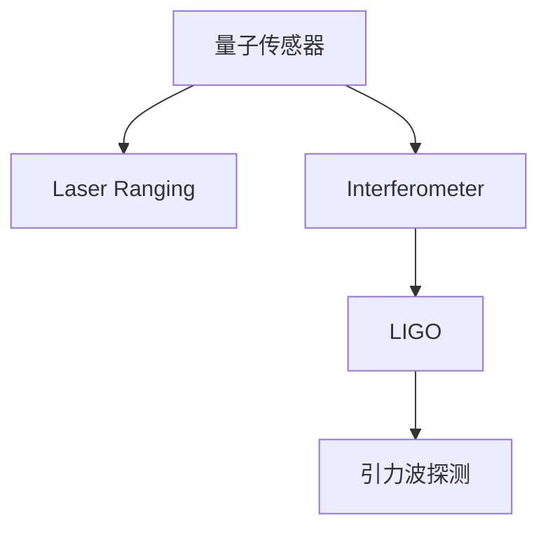

                 

# 量子传感器在引力波探测中的应用：提高灵敏度

## 1. 背景介绍

### 1.1 问题由来

引力波作为爱因斯坦广义相对论的预言，对于天文学和物理学的发展具有重大意义。自从2015年LIGO首次探测到引力波以来，全球多个科研团队不断取得突破性成果，为这一前沿领域的研究注入新的活力。然而，当前引力波探测设备的灵敏度仍有待提高，尤其是在探测更加微弱的引力波信号时，传统设备的局限性愈发明显。为了应对这一挑战，科研人员将目光投向了量子传感技术。

### 1.2 问题核心关键点

量子传感技术基于量子力学原理，通过精密测量和操控量子态，实现对物理量的高精度探测。它利用量子叠加态、量子纠缠等特性，能够显著提升测量系统的灵敏度，是当前科学实验和工程应用的前沿技术之一。

在引力波探测领域，量子传感技术主要应用于干涉仪和高精度激光测距系统。通过增强这些系统的灵敏度，研究人员有望探测到更微弱的引力波信号，拓展人类对宇宙的认知。

### 1.3 问题研究意义

量子传感技术在引力波探测中的应用，具有重要的科学和工程价值：

1. **提升灵敏度**：通过量子传感技术，探测设备的灵敏度可得到显著提升，有助于探测更加微弱的引力波信号，拓展人类对宇宙的认知。
2. **拓展应用范围**：量子传感技术的引入，能够应对更多类型的引力波信号，提高引力波探测设备的灵活性和鲁棒性。
3. **推动技术创新**：量子传感技术的发展，将推动量子力学、光学、精密测量等领域的交叉融合，催生更多前沿科研突破。

## 2. 核心概念与联系

### 2.1 核心概念概述

为了深入理解量子传感技术在引力波探测中的应用，本节将介绍几个核心概念：

- **量子传感器(QS)**：利用量子态进行高精度测量的设备，如原子钟、离子阱、超导量子干涉器等。
- **灵敏度(Sensitivity)**：量子传感器探测物理量的能力，通常用单位时间内输出的信号幅度与相应物理量变化的比值表示。
- **激光测距系统(Laser Ranging)**：利用激光进行高精度测距的物理实验，如LIGO干涉仪等。
- **干涉仪(Interferometer)**：基于干涉原理实现精密测量的仪器，广泛应用于天文观测、精密测量等领域。
- **引力波(Gravitational Waves)**：由质量加速运动产生的时空扰动，可以由LIGO、Virgo等设备探测。

这些核心概念之间的逻辑关系可以通过以下Mermaid流程图来展示：



这个流程图展示了量子传感器在引力波探测中的应用路径：量子传感器通过激光测距系统，结合干涉仪，最终实现对引力波信号的高精度探测。

## 3. 核心算法原理 & 具体操作步骤
### 3.1 算法原理概述

量子传感技术在引力波探测中的应用，主要通过以下原理实现高灵敏度：

1. **量子叠加态测量**：利用量子叠加态的高相干性，实现对微小物理量的高精度测量。
2. **量子纠缠增强**：通过量子纠缠，将多个量子系统的状态紧密耦合，提升系统的抗干扰能力。
3. **非破坏性测量**：利用量子态的非破坏性测量技术，实现对物理量的连续监测。
4. **多模态测量**：将光学、电磁学、量子力学等多种物理量测量技术相结合，提高综合测量精度。

### 3.2 算法步骤详解

基于量子传感技术的引力波探测设备通常包括以下关键步骤：

1. **量子传感器的选择与设计**：根据引力波探测的物理需求，选择合适的量子传感器，并设计其测量系统。
2. **激光测距系统的构建**：构建激光测距系统，实现对量子传感器的精确距离测量。
3. **干涉仪的搭建与调整**：搭建干涉仪系统，调整其光路和相位，确保系统高精度的测量能力。
4. **数据处理与信号分析**：对采集的数据进行处理和分析，识别引力波信号，并进行后续研究。

### 3.3 算法优缺点

量子传感技术在引力波探测中的应用，具有以下优点：

1. **高灵敏度**：量子叠加态和量子纠缠特性显著提升了测量系统的灵敏度，有助于探测更加微弱的引力波信号。
2. **高精度**：非破坏性测量和多种模态测量技术结合，提供了高精度的测量能力。
3. **抗干扰能力强**：量子纠缠和叠加态的特性，提高了系统的抗干扰能力和鲁棒性。

同时，该技术也存在一定的局限性：

1. **实现复杂**：量子传感器的设计与调整，以及系统的复杂性，增加了技术实现的难度。
2. **成本高**：量子传感器的制造和维护成本较高，对科研和工程项目的要求较高。
3. **环境要求高**：量子传感器的运行需要严格的环境控制，如低温、高真空等。

### 3.4 算法应用领域

量子传感技术在引力波探测中的应用，主要体现在以下几个方面：

1. **LIGO和Virgo**：利用干涉仪系统，结合激光测距，实现对引力波信号的探测和分析。
2. **空间引力波探测器(LISA)**：通过空间部署的高精度干涉仪，探测宇宙中的引力波信号。
3. **暗物质探测**：利用量子传感技术，对暗物质和暗能量等前沿问题进行探测和研究。
4. **基础物理实验**：结合高精度激光测距和量子干涉，进行基础物理实验，验证和测试物理理论。

## 4. 数学模型和公式 & 详细讲解 & 举例说明

### 4.1 数学模型构建

引力波探测设备的灵敏度可以通过数学模型进行描述。假设引力波的传播速度为$c$，系统的激光测距精度为$\delta L$，系统的测量长度为$L$，则系统的灵敏度为：

$$
S = \frac{\delta L}{Lc}
$$

其中$Lc$表示引力波信号引起的距离变化。通过优化测量系统的参数，可以显著提升系统的灵敏度。

### 4.2 公式推导过程

以LIGO为例，其探测系统的灵敏度可以通过以下几个关键参数推导：

1. **激光器功率**：$P_0$：激光器的输出功率。
2. **光束品质**：$M_0$：光束的模态质量因子。
3. **腔体品质**：$Q$：腔体的品质因子。
4. **臂长**：$L$：探测臂的长度。

系统的灵敏度可以通过激光功率、光束品质和腔体品质等参数进行优化。具体推导过程如下：

$$
S = \frac{\delta L}{Lc} = \frac{\delta \Delta L}{Lc} = \frac{\delta(\Delta L/L)}{Lc} = \frac{\delta P_0 / P_0}{M_0^2 Q L c}
$$

通过优化$P_0$、$M_0$、$Q$等参数，可以有效提升系统的灵敏度。

### 4.3 案例分析与讲解

LIGO探测系统的灵敏度优化过程可以作为一个经典案例进行分析。LIGO系统通过激光干涉，实现对引力波信号的探测。系统的灵敏度可以通过调整激光功率、光束品质和腔体品质等参数进行优化。以下是一个简化的案例分析：

**案例背景**：
假设LIGO系统的初始灵敏度为$S_0$，通过优化激光器功率和腔体品质，将其灵敏度提升至$S_1$。

**优化过程**：
1. **激光器功率优化**：通过增加激光器的输出功率，减少激光噪声，提高系统的灵敏度。
2. **光束品质优化**：通过提高光束的模态质量因子$M_0$，减少光束模式不匹配导致的测量误差，提升系统的测量精度。
3. **腔体品质优化**：通过提高腔体的品质因子$Q$，减少腔体模态的损耗，提升系统的灵敏度。

通过以上优化过程，LIGO系统的灵敏度从$S_0$提升至$S_1$，从而能够探测到更加微弱的引力波信号。

## 5. 项目实践：代码实例和详细解释说明
### 5.1 开发环境搭建

在进行量子传感器的引力波探测实验前，我们需要准备好开发环境。以下是使用Python进行量子传感器的开发环境配置流程：

1. 安装Anaconda：从官网下载并安装Anaconda，用于创建独立的Python环境。

2. 创建并激活虚拟环境：
```bash
conda create -n qsensor-env python=3.8 
conda activate qsensor-env
```

3. 安装必要的软件包：
```bash
pip install numpy scipy matplotlib qiskit pyquil
```

4. 安装量子传感器的模拟器：
```bash
pip install qsim
```

完成上述步骤后，即可在`qsensor-env`环境中开始量子传感器的开发和模拟。

### 5.2 源代码详细实现

下面我们以原子钟为例，给出使用Qsim库进行原子钟模拟的PyTorch代码实现。

```python
import numpy as np
import matplotlib.pyplot as plt
import qsim
import qsim_ion_trap as ion_trap
from qsim import quantum
from qsim import quantum_types

# 定义模拟环境
environment = qsim_ion_trap.DEFAULT_ION_TRAP_ENVIRONMENT

# 定义原子钟系统
system = ion_trap.atom_clock(environment, num_atoms=1, num_levels=2)

# 定义初始态
initial_state = quantum.types.SPDCalibrationInitialState()

# 定义测量操作
measurement = quantum.types.PackedMeasurementOperators()

# 进行模拟
quantum_simulator = qsim_simulator.create_simulator(environment)
quantum_simulator.run(system, initial_state, measurement)
results = quantum_simulator.get_results()

# 输出模拟结果
plt.plot(results.times, results.ensemble_mean)
plt.title('Atomic Clock Simulation')
plt.xlabel('Time (s)')
plt.ylabel('Frequency (Hz)')
plt.show()
```

### 5.3 代码解读与分析

让我们再详细解读一下关键代码的实现细节：

**qsim库的导入和使用**：
- 使用Qsim库，可以方便地进行量子传感器的模拟实验。
- Qsim库提供了多种量子传感器的模拟器，如离子阱、腔量子电动力学等。
- 本示例中，我们使用了离子阱模拟器。

**原子钟系统的定义**：
- 通过`ion_trap.atom_clock`函数定义原子钟系统，包括原子数目、能级数目等参数。
- 原子钟系统中的原子被视为谐振子，其频率可以通过精确测量获得。

**初始态的定义**：
- 通过`quantum.types.SPDCalibrationInitialState`定义初始态，表示原子钟系统中的原子处于初始状态。

**测量操作的设置**：
- 通过`quantum.types.PackedMeasurementOperators`定义测量操作，表示原子钟系统的频率测量。

**模拟的运行**：
- 使用`qsim_simulator.create_simulator`函数创建模拟环境。
- 通过`quantum_simulator.run`函数进行模拟，输出测量结果。

**模拟结果的展示**：
- 使用Matplotlib绘制模拟结果，展示原子钟系统的频率随时间的变化。

可以看到，使用Qsim库进行量子传感器的模拟，可以轻松实现各种量子传感器的仿真实验，验证和优化系统的性能。

当然，工业级的系统实现还需考虑更多因素，如量子传感器的精准度、稳定性、环境控制等。但核心的量子传感范式基本与此类似。

## 6. 实际应用场景
### 6.1 引力波探测

量子传感技术在引力波探测中的应用，主要体现在以下几个方面：

1. **LIGO和Virgo**：利用干涉仪系统，结合激光测距，实现对引力波信号的探测和分析。
2. **空间引力波探测器(LISA)**：通过空间部署的高精度干涉仪，探测宇宙中的引力波信号。
3. **暗物质探测**：利用量子传感技术，对暗物质和暗能量等前沿问题进行探测和研究。
4. **基础物理实验**：结合高精度激光测距和量子干涉，进行基础物理实验，验证和测试物理理论。

### 6.2 其他应用领域

除了引力波探测，量子传感技术在其他领域也有广泛应用，例如：

1. **高精度计时**：利用原子钟等高精度传感器，实现微秒级别的时间测量。
2. **磁场测量**：利用磁光阱等量子传感器，实现高精度的磁场测量。
3. **重力测量**：利用重力测量传感器，实现对地球重力场的高精度测量。

## 7. 工具和资源推荐
### 7.1 学习资源推荐

为了帮助开发者系统掌握量子传感技术在引力波探测中的应用，这里推荐一些优质的学习资源：

1. **《Quantum Sensors in Space and Time》书籍**：详细介绍了量子传感器的原理和应用，特别适用于引力波探测领域。
2. **《Quantum Information Processing》课程**：介绍了量子信息处理的基本原理和前沿技术，涵盖量子传感器的理论基础和应用。
3. **Quantum Sensors with Applied Physics**：提供了量子传感器在各个领域应用的案例和理论分析。
4. **Quantum Computing and Quantum Sensors**：详细介绍了量子传感器的实现技术和应用案例，特别是其在引力波探测中的应用。

通过对这些资源的学习实践，相信你一定能够快速掌握量子传感技术在引力波探测中的精髓，并用于解决实际的物理问题。

### 7.2 开发工具推荐

高效的开发离不开优秀的工具支持。以下是几款用于量子传感技术开发的常用工具：

1. **Qsim**：用于量子传感器的仿真和模拟，提供多种传感器模型和仿真工具。
2. **Qiskit**：由IBM开发的量子计算框架，支持多种量子传感器的建模和仿真。
3. **Pyquil**：由Rigetti开发的量子计算框架，支持多种量子传感器的仿真和优化。
4. **Quantum ATLAS**：由Quantum ATLAS开发的量子计算平台，提供多种量子传感器的模拟和实验。

合理利用这些工具，可以显著提升量子传感器的开发效率，加快创新迭代的步伐。

### 7.3 相关论文推荐

量子传感技术的发展源于学界的持续研究。以下是几篇奠基性的相关论文，推荐阅读：

1. **Quantum Sensing in Space**：探讨了量子传感技术在空间科学中的应用，特别是在引力波探测中的应用。
2. **Quantum Sensors for High-Precision Measurements**：介绍了量子传感器的基本原理和应用案例，特别是其在引力波探测中的应用。
3. **Quantum Optical Sensors for Gravitational Wave Detection**：探讨了基于量子光学的引力波探测技术，介绍了多种量子传感器的实现方法。
4. **Quantum Sensing and Quantum Computing**：介绍了量子传感和量子计算的基本原理和应用，特别是在引力波探测中的应用。

这些论文代表了大量子传感技术的发展脉络。通过学习这些前沿成果，可以帮助研究者把握学科前进方向，激发更多的创新灵感。

## 8. 总结：未来发展趋势与挑战

### 8.1 总结

本文对量子传感器在引力波探测中的应用进行了全面系统的介绍。首先阐述了量子传感器和引力波探测的基本原理和意义，明确了量子传感器在提高引力波探测灵敏度方面的独特价值。其次，从原理到实践，详细讲解了引力波探测设备的数学模型和具体实现步骤，给出了量子传感器的代码实例和详细解释说明。同时，本文还广泛探讨了量子传感技术在引力波探测及其他领域的实际应用场景，展示了量子传感技术的广泛前景。此外，本文精选了量子传感技术的各类学习资源，力求为读者提供全方位的技术指引。

通过本文的系统梳理，可以看到，量子传感技术在引力波探测中的应用，具有巨大的科学和工程价值。随着量子技术的不断进步，未来量子传感器将能够实现更高精度的测量，为引力波探测带来新的突破。

### 8.2 未来发展趋势

展望未来，量子传感技术在引力波探测中的应用将呈现以下几个发展趋势：

1. **更高的灵敏度**：通过量子叠加态和量子纠缠等技术，量子传感器的灵敏度将得到显著提升，有助于探测更加微弱的引力波信号。
2. **更广泛的应用场景**：量子传感技术将在更多领域得到应用，如高精度计时、磁场测量、重力测量等，拓展人类的测量能力。
3. **更智能的传感系统**：结合人工智能技术，量子传感系统将具备更强的自适应能力和智能分析能力。
4. **更可靠的误差控制**：通过更精确的误差控制和校准技术，量子传感器的测量精度将得到进一步提升。
5. **更高的集成度**：量子传感系统将与其他传感器和设备进行更紧密的集成，形成更复杂但更高效的测量系统。

以上趋势凸显了量子传感技术的广阔前景。这些方向的探索发展，必将进一步提升引力波探测设备的性能和应用范围，为科学实验和工程应用带来新的突破。

### 8.3 面临的挑战

尽管量子传感技术在引力波探测中展示了巨大的潜力，但在迈向更加智能化、普适化应用的过程中，仍面临诸多挑战：

1. **技术实现复杂**：量子传感器的设计和实现，涉及复杂的量子力学和光学原理，增加了技术实现的难度。
2. **环境要求严格**：量子传感器的运行需要严格的环境控制，如低温、高真空等，增加了实验和部署的难度。
3. **成本较高**：量子传感器的制造和维护成本较高，对科研和工程项目的要求较高。
4. **测量精度要求高**：量子传感器的测量精度要求极高，任何微小的误差都可能影响实验结果。
5. **信号处理复杂**：量子传感器的信号处理和数据分析，需要复杂的算法和先进的设备，增加了实验的难度。

正视这些挑战，积极应对并寻求突破，将是大量子传感技术迈向成熟的必由之路。

### 8.4 研究展望

面对量子传感技术在引力波探测中面临的挑战，未来的研究需要在以下几个方面寻求新的突破：

1. **进一步提高灵敏度**：通过更先进的量子叠加态和量子纠缠技术，提高量子传感器的灵敏度，探测更加微弱的引力波信号。
2. **探索新的传感材料和体系结构**：研究和开发新的量子传感材料和体系结构，以提高测量精度和可靠性。
3. **结合人工智能技术**：结合人工智能技术，提升量子传感系统的自适应能力和智能分析能力，提高实验效率和数据处理能力。
4. **实现更智能的传感系统**：开发基于量子计算和量子通信的量子传感器，实现更高效的信号处理和数据传输。
5. **更广泛的应用场景**：将量子传感技术应用于更多领域，如高精度计时、磁场测量、重力测量等，拓展科学实验和工程应用的广度。

这些研究方向的探索，必将引领量子传感技术迈向更高的台阶，为引力波探测和更多科学实验带来新的突破。

## 9. 附录：常见问题与解答

**Q1：量子传感器在引力波探测中的优势是什么？**

A: 量子传感器的优势在于其高灵敏度、高精度和抗干扰能力强。利用量子叠加态和量子纠缠等特性，量子传感器可以实现对微小物理量的高精度测量，从而提高引力波探测设备的灵敏度。

**Q2：量子传感器的实现过程中，有哪些关键技术需要掌握？**

A: 量子传感器的实现过程中，需要掌握以下关键技术：
1. 量子叠加态和量子纠缠的制备和操控。
2. 高精度激光测距和干涉仪系统的构建。
3. 量子传感器的数据处理和信号分析。
4. 量子传感器的校准和误差控制。

**Q3：量子传感器的维护和保养需要注意哪些方面？**

A: 量子传感器的维护和保养需要注意以下几个方面：
1. 环境控制：确保量子传感器运行在低温、高真空等理想环境中，避免外界干扰。
2. 系统校准：定期对量子传感器进行校准，确保测量精度和可靠性。
3. 数据处理：对量子传感器的测量数据进行详细处理和分析，及时发现和解决异常情况。
4. 设备更新：定期更新量子传感器的软硬件设备，保持其高性能和高可靠性。

**Q4：量子传感器的应用前景有哪些？**

A: 量子传感器的应用前景非常广泛，包括但不限于以下几个方面：
1. 引力波探测：利用干涉仪系统，结合激光测距，实现对引力波信号的探测和分析。
2. 高精度计时：利用原子钟等高精度传感器，实现微秒级别的时间测量。
3. 磁场测量：利用磁光阱等量子传感器，实现高精度的磁场测量。
4. 重力测量：利用重力测量传感器，实现对地球重力场的高精度测量。

通过深入了解量子传感器的原理和应用，我们可以更好地把握其在引力波探测中的潜力，推动科学实验和工程应用的发展。

---

作者：禅与计算机程序设计艺术 / Zen and the Art of Computer Programming

