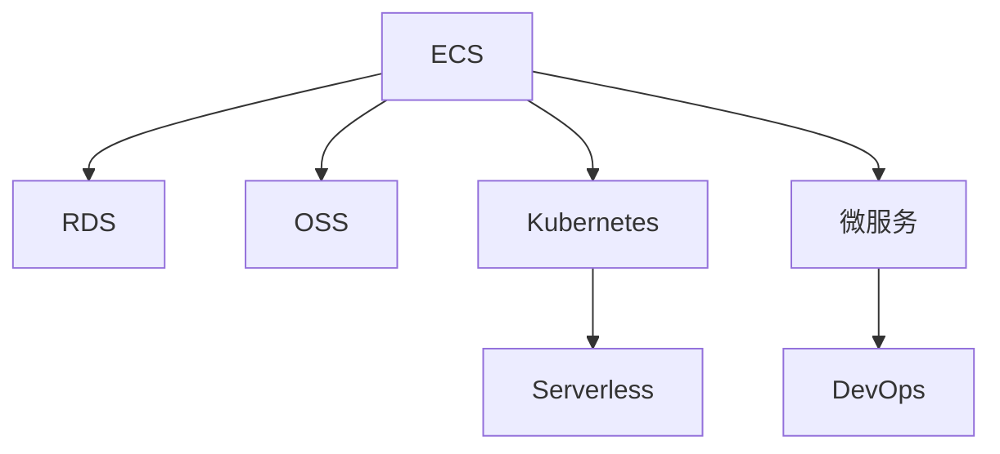

                 

# 阿里云云计算服务应用开发

## 1. 背景介绍

### 1.1 问题由来
在过去的几十年里，云计算技术已经从概念走向实践，从初期的探索阶段逐渐发展为各行各业不可或缺的基础设施。阿里云作为中国领先的云计算服务提供商，通过提供弹性计算、存储、数据库、安全等云服务，赋能各行各业数字化转型，助力其业务快速发展。

云计算的实质是将计算资源通过互联网形式进行虚拟化，用户可以根据自身需求弹性扩展或缩减资源，避免了传统IT基础设施投资大、扩展难、维护成本高等问题。阿里云利用其在硬件、网络、软件等方面的深厚积累，形成了从底层基础设施到上层应用的完整生态，为客户提供了丰富而强大的服务，极大地降低了企业的IT运营成本，提升了其业务效率和竞争力。

### 1.2 问题核心关键点
阿里云云计算服务应用开发的关键点在于如何利用云平台提供的基础设施和工具，高效构建、运维和管理应用程序，实现业务的高可用性、可扩展性和安全性。主要包括：

1. **云服务的选择与配置**：根据业务需求选择合适的云服务，如ECS、RDS、OSS等，并进行配置优化，以获取最佳性能和成本效益。
2. **分布式架构设计**：利用云平台提供的负载均衡、弹性伸缩、自动容灾等特性，设计高可靠、高性能的应用架构。
3. **云原生技术的应用**：采用容器化、微服务、DevOps等云原生技术，提升应用的可移植性、可扩展性和运维效率。
4. **数据分析与机器学习**：利用云平台提供的PolarDB、ET等大数据分析服务，以及PAI等机器学习平台，进行数据处理和智能分析，驱动业务创新。
5. **安全性与合规性**：利用云平台的安全机制和合规性保障，确保数据和应用程序的安全，符合各种行业标准和法规要求。

### 1.3 问题研究意义
阿里云云计算服务应用开发的深入研究，对于提升企业的IT基础设施效率、降低成本、推动数字化转型具有重要意义。通过合理利用云服务，可以加速业务迭代，提升用户体验，增强市场竞争力。同时，通过采用云原生技术，可以提升应用的弹性和稳定性，满足不断变化的市场需求。

## 2. 核心概念与联系

### 2.1 核心概念概述

为更好地理解阿里云云计算服务应用开发，本节将介绍几个密切相关的核心概念：

- **Elastic Compute Service (ECS)**：阿里云的弹性计算服务，提供高性能、高可用的计算资源，满足各类应用的需求。
- **Relational Database Service (RDS)**：阿里云的关系型数据库服务，提供高性能、高可用、高安全的数据库解决方案，支持MySQL、PostgreSQL等多种数据库引擎。
- **Object Storage Service (OSS)**：阿里云的对象存储服务，提供高可靠、低成本的数据存储方案，支持海量的静态和非结构化数据存储。
- **Kubernetes**：开源容器编排引擎，利用容器化技术，实现应用的自动化部署、扩展和管理。
- **Serverless架构**：通过无服务器架构，自动管理计算资源，减少运维成本，提升开发效率。
- **微服务架构**：将应用拆分成多个小服务，每个服务负责特定业务逻辑，提升系统的可扩展性和维护性。

这些核心概念之间的逻辑关系可以通过以下Mermaid流程图来展示：



这个流程图展示出阿里云云计算服务应用开发的核心概念及其之间的关系：

1. ECS提供计算资源，RDS提供数据库服务，OSS提供存储服务，共同构成云基础设施。
2. Kubernetes和Serverless利用容器化和无服务器技术，提升应用的部署和运维效率。
3. 微服务架构将应用拆分成多个服务，DevOps实现自动化部署和持续集成，提升开发和运维效率。

## 3. 核心算法原理 & 具体操作步骤
### 3.1 算法原理概述

阿里云云计算服务应用开发的核心在于利用云平台提供的各种服务，构建高性能、高可靠的应用系统。其核心算法原理主要包括：

- **资源优化配置**：根据应用需求，动态调整计算、存储和网络资源，以达到最佳性能和成本效益。
- **负载均衡与分布式架构**：通过负载均衡和分布式计算技术，提升应用的可扩展性和容灾能力。
- **容灾与高可用性**：利用云平台提供的自动容灾和故障切换机制，确保应用的高可用性。
- **自动扩展与弹性伸缩**：通过自动扩展机制，根据流量变化动态调整计算资源，提升应用性能和弹性。
- **数据同步与备份**：利用云平台提供的数据同步和备份机制，确保数据的一致性和安全性。

### 3.2 算法步骤详解

阿里云云计算服务应用开发的详细步骤主要包括以下几个方面：

1. **需求分析与规划**：根据业务需求，选择合适的云服务，并设计应用架构，确定系统功能和技术栈。
2. **环境搭建与配置**：利用云平台提供的快速搭建工具，创建计算、存储和网络资源，并进行配置优化。
3. **应用开发与部署**：使用云平台提供的开发工具和框架，进行应用开发，并通过容器化技术实现自动化部署。
4. **运维与监控**：利用云平台提供的运维和监控工具，实时监控应用性能和资源使用情况，及时发现和解决问题。
5. **数据分析与优化**：利用云平台提供的大数据分析和优化工具，进行性能调优，提升应用效率。

### 3.3 算法优缺点

阿里云云计算服务应用开发的优点包括：

- **高效弹性**：云平台提供的弹性计算和自动扩展机制，可以根据业务需求动态调整资源，满足高并发和高负载场景的需求。
- **灵活可扩展**：利用微服务架构和无服务器技术，实现应用功能的模块化和小型化，提升应用的灵活性和可扩展性。
- **高性能可靠**：通过负载均衡、分布式计算和高可用性机制，确保应用的稳定性和高性能。
- **低成本低门槛**：云平台按需付费，减少IT基础设施的投资和运维成本，降低企业进入云计算的门槛。

其缺点包括：

- **依赖云平台**：云平台的依赖性强，一旦云平台出现问题，可能会影响应用的正常运行。
- **数据安全性**：云平台的数据存储和传输可能面临安全威胁，需要严格的数据安全措施。
- **服务质量不稳定**：云平台的某些服务质量可能受网络状况、地域差异等因素影响，需要监控和优化。

### 3.4 算法应用领域

阿里云云计算服务应用开发广泛应用于各种业务场景，包括但不限于：

- **电商平台**：利用ECS和RDS构建高性能、高可用的电商应用，支持海量交易和高并发请求。
- **物联网应用**：利用OSS存储物联网设备生成的数据，利用云函数进行实时处理和分析，提升数据处理效率。
- **金融服务**：利用云平台提供的高可用性和安全性保障，构建金融交易、风险控制、客户服务等应用。
- **社交媒体**：利用云平台提供的高性能和低延迟服务，构建社交媒体平台，支持实时通讯和内容分发。
- **游戏服务**：利用云平台提供的高性能计算和分布式架构，构建高并发和高可用的游戏服务，提升用户体验。

这些应用场景展示了阿里云云计算服务应用开发在不同行业中的应用潜力，展示了其在提升业务效率和用户满意度方面的巨大价值。

## 4. 数学模型和公式 & 详细讲解 & 举例说明

### 4.1 数学模型构建

阿里云云计算服务应用开发的数学模型主要集中在资源优化配置、负载均衡和分布式架构的设计和优化上。

以资源优化配置为例，假设某应用需要$m$个计算实例，每个实例的计算能力为$C$，存储容量为$S$，网络带宽为$B$。设云平台提供的价格为$p_C$、$p_S$、$p_B$，且每小时价格不变。目标是最小化总成本，即：

$$
\min_{m} \frac{p_C \cdot m \cdot C + p_S \cdot m \cdot S + p_B \cdot m \cdot B}{m}
$$

求解该最优化问题，可以采用枚举、动态规划或线性规划等方法。

### 4.2 公式推导过程

对于负载均衡和分布式架构的优化，可以利用以下数学模型进行推导：

设应用请求量为$N$，负载均衡器具有$k$个后端服务器，每个服务器的处理能力为$P$，请求到达率为$\lambda$。为了最小化响应时间和系统成本，需要确定最优的负载均衡策略。根据Little's Law，响应时间$T$可以表示为：

$$
T = \frac{N}{P \cdot k}
$$

因此，为了最小化响应时间，需要最大化服务器的利用率，即：

$$
\max_{k} \frac{N}{P \cdot k}
$$

求解该最优化问题，可以采用解析方法或模拟方法。

### 4.3 案例分析与讲解

假设某电商平台需要处理每秒20000个订单，每个订单处理时间为1秒，每个订单的数据存储需求为100MB，数据传输带宽需求为1GB/s。假设云平台提供的价格为：计算实例每小时价格为0.2元/实例，存储每GB价格为0.01元/年，网络带宽每GB价格为0.05元/年。

通过上述数学模型，计算最优的资源配置：

1. 计算实例数量$m = \frac{N}{C \cdot \lambda} = \frac{20000}{1 \cdot 20000} = 1$。
2. 存储需求$S = \frac{N}{\lambda} = \frac{20000}{1} = 20000$ GB。
3. 网络带宽需求$B = \frac{N}{\lambda} = \frac{20000}{1} = 20000$ GB/s。

计算总成本：

$$
\min_{m} \frac{0.2 \cdot m + 0.01 \cdot \frac{S}{365} \cdot 24 + 0.05 \cdot \frac{B}{365} \cdot 24}{m}
$$

将$m=1$代入公式，计算得：

$$
\frac{0.2 \cdot 1 + 0.01 \cdot \frac{20000}{365} \cdot 24 + 0.05 \cdot \frac{20000}{365} \cdot 24}{1} = 0.2 + 1.76 + 2.56 = 4.52
$$

因此，该电商平台的总成本为每天4.52元，计算实例数量为1，存储需求为20000GB，网络带宽需求为20000GB/s。

## 5. 项目实践：代码实例和详细解释说明
### 5.1 开发环境搭建

在进行阿里云云计算服务应用开发实践前，需要先准备好开发环境。以下是使用Python进行开发的环境配置流程：

1. 安装Anaconda：从官网下载并安装Anaconda，用于创建独立的Python环境。

2. 创建并激活虚拟环境：
```bash
conda create -n cloud-env python=3.8 
conda activate cloud-env
```

3. 安装必要的Python库：
```bash
pip install boto3
pip install requests
pip install cloudshell
```

4. 安装阿里云SDK：
```bash
pip install aliyun-python-sdk
```

5. 安装必要的云平台监控工具：
```bash
pip install prometheus
pip install node_exporter
```

完成上述步骤后，即可在`cloud-env`环境中开始阿里云云计算服务应用开发的实践。

### 5.2 源代码详细实现

下面以阿里云ECS实例的创建和配置为例，给出完整的Python代码实现。

```python
import aliyun_pytalk as aliyun
import boto3

# 阿里云访问配置
aliyun.access_key_id = 'your_access_key_id'
aliyun.access_key_secret = 'your_access_key_secret'
aliyun.region_id = 'your_region_id'

# 创建ECS实例
client = aliyun.ECSClient()
instance_type = 'ecs.n5.large'
instance_name = 'my_ecs_instance'
security_group_id = 'your_security_group_id'
subnet_id = 'your_subnet_id'
auto_ip = 'your_auto_ip'

response = client.create_instance(
    InstanceType=instance_type,
    InstanceName=instance_name,
    SecurityGroupIds=[security_group_id],
    SubnetId=subnet_id,
    AutoIp=auto_ip
)
print('ECS实例创建成功：', response)
```

以上代码实现了通过Python调用阿里云ECS API创建和管理ECS实例。具体步骤如下：

1. 引入阿里云SDK，配置访问密钥。
2. 调用`create_instance`方法，创建ECS实例。
3. 指定实例类型、名称、安全组和子网，以及自动分配IP。

### 5.3 代码解读与分析

在代码实现中，我们使用了阿里云Python SDK `aliyun_pytalk`，简化了与阿里云API的交互过程。

- `access_key_id`和`access_key_secret`是阿里云访问密钥，用于验证身份和授权操作。
- `region_id`是阿里云地域ID，用于指定实例创建的区域。
- `instance_type`是实例类型，定义了计算资源、存储容量和网络带宽。
- `instance_name`是实例名称，用于标识和管理实例。
- `security_group_id`是安全组ID，用于控制实例的网络访问。
- `subnet_id`是子网ID，用于指定实例所在的网络环境。
- `auto_ip`是自动分配IP，用于实例获取固定公网IP地址。

通过调用`create_instance`方法，可以创建并管理ECS实例，满足不同业务需求。

### 5.4 运行结果展示

在创建ECS实例后，可以通过阿里云管理控制台或API查看实例状态和配置信息，确保实例正常运行。

阿里云管理控制台提供了详细的实例信息和监控数据，支持动态调整实例资源，确保应用的稳定性和可扩展性。

## 6. 实际应用场景
### 6.1 智慧医疗

阿里云云计算服务在智慧医疗领域具有广泛应用。通过云平台提供的云计算、大数据、AI等技术服务，可以实现医疗数据的存储、管理和分析，提升医疗服务的效率和质量。

具体应用场景包括：

- **电子病历系统**：利用ECS、RDS、OSS等云服务，存储和处理医疗数据，支持医生和患者的信息访问和管理。
- **远程医疗**：利用云平台提供的音视频通话、文件传输等服务，支持远程会诊和在线诊疗。
- **医疗影像分析**：利用云平台提供的PAI等机器学习服务，进行医疗影像的分析和诊断，提升诊断精度和效率。
- **健康管理**：利用云平台提供的大数据和AI技术，进行健康数据分析和个性化健康管理，提升用户健康水平。

阿里云云计算服务为智慧医疗提供了一体化的解决方案，助力医疗行业数字化转型，提升医疗服务质量。

### 6.2 智慧城市

阿里云云计算服务在智慧城市建设中也有着广泛应用。通过云平台提供的大数据、AI和IoT技术，可以实现城市管理的智能化和高效化，提升城市的运行效率和居民生活质量。

具体应用场景包括：

- **城市监控**：利用云平台提供的音视频监控、AI分析等技术，实现城市安全的智能监控和预警。
- **交通管理**：利用云平台提供的大数据和AI技术，进行交通流量分析和预测，优化交通管理和调度。
- **智能路灯**：利用云平台提供的IoT技术，实现路灯的智能控制和管理，提升能源利用效率。
- **环境监测**：利用云平台提供的大数据和AI技术，进行环境监测和预警，提升城市环境的可持续性。

阿里云云计算服务为智慧城市建设提供了强有力的技术支撑，助力城市管理的智能化和高效化，提升城市居民的生活质量。

## 7. 工具和资源推荐
### 7.1 学习资源推荐

为了帮助开发者系统掌握阿里云云计算服务的应用开发技术，这里推荐一些优质的学习资源：

1. **阿里云官网文档**：官方文档是学习阿里云云计算服务应用开发的最佳资源，提供了详细的API文档和代码示例。
2. **阿里云开源社区**：社区提供丰富的开源项目和示例代码，供开发者学习和参考。
3. **阿里云云栖大会**：云栖大会是阿里云最大的技术交流平台，每年举办多次，涵盖了云计算、大数据、AI等多个领域的前沿技术。
4. **阿里云云教材**：云教材是阿里云提供的免费在线课程，涵盖阿里云云计算服务的基础和高级应用开发。
5. **阿里云云管家**：云管家是阿里云提供的自动化管理工具，支持一键创建和管理云资源，提升运维效率。

通过对这些资源的学习实践，相信你一定能够快速掌握阿里云云计算服务应用开发的精髓，并用于解决实际的业务问题。

### 7.2 开发工具推荐

高效的开发离不开优秀的工具支持。以下是几款用于阿里云云计算服务应用开发的常用工具：

1. **阿里云管理控制台**：阿里云提供的Web管理界面，支持资源的创建、管理和监控，提升运维效率。
2. **CloudShell**：阿里云提供的云函数开发工具，支持无服务器开发和部署，提升开发效率。
3. **Kubernetes**：开源容器编排引擎，利用容器化技术，实现应用的自动化部署、扩展和管理。
4. **Prometheus**：开源监控系统，提供实时监控和告警功能，保障应用的高可用性和性能。
5. **Node Exporter**：Prometheus的导出器，支持将系统指标导出到Prometheus进行监控和分析。

合理利用这些工具，可以显著提升阿里云云计算服务应用开发的开发效率，加快创新迭代的步伐。

### 7.3 相关论文推荐

阿里云云计算服务应用开发的研究源于学界的持续研究。以下是几篇奠基性的相关论文，推荐阅读：

1. **云计算基础架构**：研究云计算基础设施的设计和实现，包括虚拟化、分布式计算等核心技术。
2. **云计算服务质量**：研究云计算服务质量的影响因素，包括网络延迟、服务可用性等。
3. **云计算安全与隐私**：研究云计算环境下的安全与隐私保护，包括数据加密、身份认证等。
4. **云计算应用架构**：研究云计算环境下应用架构的设计和优化，包括微服务、Serverless等技术。
5. **云计算大数据处理**：研究云计算环境下大数据处理的技术，包括数据存储、分布式计算等。

这些论文代表了大数据和云计算领域的最新研究成果，有助于理解和掌握阿里云云计算服务应用开发的关键技术。

## 8. 总结：未来发展趋势与挑战

### 8.1 总结

本文对阿里云云计算服务应用开发进行了全面系统的介绍。首先阐述了阿里云云计算服务的基础设施和应用开发的核心概念，明确了云计算服务在提升业务效率和用户体验方面的独特价值。其次，从原理到实践，详细讲解了阿里云云计算服务应用开发的技术细节，包括资源优化配置、负载均衡、高可用性等核心算法原理和具体操作步骤。同时，本文还广泛探讨了阿里云云计算服务在智慧医疗、智慧城市等多个行业领域的应用前景，展示了云计算服务在推动数字化转型方面的巨大潜力。

通过本文的系统梳理，可以看到，阿里云云计算服务应用开发已经成为云计算技术应用的重要范式，极大地提升了企业的IT基础设施效率，降低了IT运营成本，推动了数字化转型。未来，伴随云计算技术的不断发展，阿里云云计算服务应用开发必将在更多领域得到应用，为各行各业带来新的变革性影响。

### 8.2 未来发展趋势

展望未来，阿里云云计算服务应用开发将呈现以下几个发展趋势：

1. **云原生技术的普及**：云原生技术将进一步普及，利用容器化、微服务、DevOps等技术，提升应用的弹性和稳定性，满足不断变化的市场需求。
2. **边缘计算的应用**：边缘计算将与云计算紧密结合，利用靠近数据源的计算能力，提升数据处理和实时计算的效率。
3. **混合云架构的扩展**：混合云架构将进一步扩展，实现多云间的资源互通和应用迁移，提升企业的灵活性和安全保障。
4. **人工智能与云计算的融合**：人工智能技术将进一步与云计算融合，提供更加智能化、自动化的服务，提升应用效率和用户体验。
5. **云计算安全与合规性保障**：随着数据隐私和安全问题的日益突出，云计算平台将加强安全与合规性保障，提升数据和应用的安全性。

以上趋势凸显了阿里云云计算服务应用开发在云计算技术发展中的重要地位，展示了其在提升业务效率和用户满意度方面的巨大价值。

### 8.3 面临的挑战

尽管阿里云云计算服务应用开发已经取得了瞩目成就，但在迈向更加智能化、普适化应用的过程中，它仍面临着诸多挑战：

1. **云平台依赖性**：云平台的依赖性强，一旦云平台出现问题，可能会影响应用的正常运行。
2. **数据安全性**：云平台的数据存储和传输可能面临安全威胁，需要严格的数据安全措施。
3. **服务质量不稳定**：云平台的某些服务质量可能受网络状况、地域差异等因素影响，需要监控和优化。
4. **成本控制**：云服务的按需付费机制可能导致成本失控，需要精细化的成本管理和优化。
5. **性能瓶颈**：云平台的高性能服务可能面临资源瓶颈，需要优化资源配置和应用架构。

正视阿里云云计算服务应用开发所面临的这些挑战，积极应对并寻求突破，将是大数据和云计算技术发展的重要方向。相信随着学界和产业界的共同努力，这些挑战终将一一被克服，阿里云云计算服务应用开发必将在构建人机协同的智能时代中扮演越来越重要的角色。

### 8.4 研究展望

面对阿里云云计算服务应用开发所面临的挑战，未来的研究需要在以下几个方面寻求新的突破：

1. **云原生架构优化**：进一步优化云原生架构，提升应用的弹性和稳定性，满足更广泛的市场需求。
2. **边缘计算与云计算结合**：探索边缘计算与云计算的深度结合，提升数据处理和实时计算的效率，降低网络延迟。
3. **混合云架构的优化**：优化混合云架构，实现多云间的资源互通和应用迁移，提升企业的灵活性和安全保障。
4. **人工智能与云计算融合**：进一步探索人工智能与云计算的深度融合，提供更加智能化、自动化的服务，提升应用效率和用户体验。
5. **数据安全与隐私保护**：加强数据安全与隐私保护，确保数据和应用的安全，符合各种行业标准和法规要求。

这些研究方向将推动阿里云云计算服务应用开发技术的不断进步，为云计算在更多领域的应用提供强有力的技术支持。

## 9. 附录：常见问题与解答

**Q1：阿里云云计算服务是否适合所有业务场景？**

A: 阿里云云计算服务广泛应用于各种业务场景，包括但不限于电商、物联网、金融、医疗、智慧城市等。通过云平台提供的弹性计算、高可用性、安全性等优势，可以满足不同业务的需求，提升业务效率和用户体验。

**Q2：阿里云云计算服务如何保证高可用性和弹性伸缩？**

A: 阿里云云计算服务通过负载均衡、分布式计算、自动扩展等技术，实现应用的高可用性和弹性伸缩。ECS实例可以根据业务需求自动扩展或缩减，RDS数据库可以通过读写分离和自动备份确保数据的高可用性。

**Q3：阿里云云计算服务的成本如何计算和管理？**

A: 阿里云云计算服务按需付费，支持动态调整资源，满足不同业务需求。云平台提供了实时监控和告警功能，帮助用户优化资源配置，降低成本。同时，阿里云云管家等自动化管理工具，可以一键创建和管理云资源，提升运维效率。

**Q4：阿里云云计算服务如何保障数据安全和隐私？**

A: 阿里云云计算服务提供了多种安全机制，包括数据加密、身份认证、访问控制等，确保数据和应用的安全。用户可以自定义安全策略，确保数据符合行业标准和法规要求。

**Q5：阿里云云计算服务在智慧医疗中的应用场景有哪些？**

A: 阿里云云计算服务在智慧医疗中的应用场景包括电子病历系统、远程医疗、医疗影像分析、健康管理等。通过云平台提供的高可用性、安全性、数据分析等技术，提升医疗服务的效率和质量，推动医疗行业数字化转型。

---

作者：禅与计算机程序设计艺术 / Zen and the Art of Computer Programming

