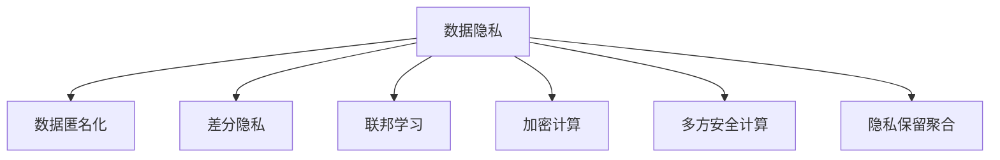

                 

# 隐私保护：保障人类计算中的数据安全

## 1. 背景介绍

### 1.1 问题由来

随着人工智能（AI）技术的蓬勃发展，我们进入了一个前所未有的数据驱动时代。从智能推荐系统到精准医疗，从自动驾驶到金融风控，数据在提升各类应用系统性能的同时，也带来了日益严峻的隐私保护问题。如何高效利用海量数据，同时确保个人隐私不被侵犯，成为各大企业和研究机构必须直面的重大挑战。

数据隐私泄露的风险不仅包括直接的财产损失，还可能引发深层次的社会信任危机，甚至导致国家安全问题。近年来，欧洲的GDPR（通用数据保护条例）、加州CCPA（消费者隐私保护法案）等隐私保护法规的出台，使得数据隐私问题受到全社会的高度关注。同时，AI模型的训练过程往往依赖大量的敏感数据，如人脸识别、生物特征、健康记录等，这些数据的保护和利用必须兼顾伦理道德和法律规范。

为了解决这些问题，隐私保护技术应运而生。隐私保护旨在保护个人隐私，同时最大化数据利用的价值。本文将从核心概念、算法原理、操作步骤、应用领域等方面，全面阐述隐私保护技术，并探讨其未来发展趋势与挑战。

### 1.2 问题核心关键点

当前隐私保护技术主要聚焦于以下几个核心关键点：

1. **数据匿名化**：将个人数据转换为无法直接识别个体身份的形式。
2. **差分隐私**：在数据查询过程中，限制对隐私数据的泄露。
3. **联邦学习**：在不共享原始数据的前提下，利用分布式计算进行模型训练。
4. **加密计算**：在数据传输和计算过程中，对数据进行加密，确保数据在传输和存储过程中不被泄露。
5. **多方安全计算**：在多数据源参与计算时，确保各方仅能访问自身数据，无法获取其他数据。
6. **隐私保留聚合**：在统计分析或数据融合过程中，确保聚合结果不会泄露个体隐私。

这些关键点共同构成了隐私保护技术的核心框架，通过在数据生命周期的各个环节实施隐私保护措施，确保数据的合法、合规、安全使用。

## 2. 核心概念与联系

### 2.1 核心概念概述

为更好地理解隐私保护技术的核心思想和应用场景，本节将介绍几个密切相关的核心概念：

- **数据隐私**：指个人数据的保密性和个人对于数据使用的控制权。数据隐私保护旨在确保个人数据在收集、存储、传输和使用过程中不被滥用。
- **数据匿名化**：指对原始数据进行转换，使得数据无法直接关联到具体个体，从而达到保护隐私的目的。
- **差分隐私**：通过在数据查询过程中引入随机性，确保单个数据点的加入或去除对查询结果的影响微不足道，从而在保护隐私的同时提供准确的结果。
- **联邦学习**：指分布式计算环境下，多数据源在不共享原始数据的前提下，协同训练全局模型。
- **加密计算**：指对数据进行加密处理，在计算过程中保护数据的机密性，防止数据泄露。
- **多方安全计算**：指在多数据源参与的计算过程中，确保各方只能访问自身数据，无法获取其他数据。
- **隐私保留聚合**：指在数据聚合或统计分析过程中，确保聚合结果不会泄露个体隐私。

这些概念之间的逻辑关系可以通过以下Mermaid流程图来展示：



这个流程图展示了几项核心隐私保护技术之间的关系：

1. 数据隐私是整个隐私保护技术体系的核心目标。
2. 数据匿名化和差分隐私是保护数据隐私的主要手段。
3. 联邦学习和多方安全计算是保证数据隐私的重要技术途径。
4. 加密计算是保护数据隐私的基础手段。
5. 隐私保留聚合是确保数据隐私的一种方法。

这些核心概念共同构成了隐私保护技术的理论基础，指导着各项隐私保护措施的实施。

## 3. 核心算法原理 & 具体操作步骤

### 3.1 算法原理概述

隐私保护技术的核心在于如何在数据生命周期的各个环节，实施隐私保护措施，同时确保数据的合法、合规、安全使用。其核心算法包括数据匿名化、差分隐私、联邦学习、加密计算、多方安全计算和隐私保留聚合等。

隐私保护技术的核心算法原理主要涉及以下几个方面：

1. 对原始数据进行预处理，去除或替换可能泄露个体身份的信息。
2. 在数据查询或计算过程中，引入随机性或噪声，确保单个数据点的加入或去除对结果的影响可忽略不计。
3. 在分布式计算环境中，通过算法设计，使得各数据源只能访问自身数据，无法获取其他数据。
4. 对数据进行加密处理，确保数据在传输和存储过程中不被泄露。
5. 在数据聚合或统计分析过程中，通过合理算法设计，确保聚合结果不会泄露个体隐私。

### 3.2 算法步骤详解

隐私保护技术的实施一般包括以下几个关键步骤：

**Step 1: 数据收集与预处理**
- 确定数据收集的目的，选择与目的相关的数据字段。
- 对数据进行去标识化处理，如数据脱敏、伪匿名化等，确保数据无法直接关联到具体个体。
- 确定数据隐私风险等级，根据隐私等级进行数据处理。

**Step 2: 选择合适的隐私保护算法**
- 根据数据类型和隐私保护需求，选择合适的隐私保护算法，如差分隐私、加密计算等。
- 确定隐私保护的参数，如差分隐私的ε参数、加密算法的密钥等。
- 评估隐私保护算法的效果，确保满足隐私保护要求。

**Step 3: 实施隐私保护措施**
- 在数据查询或计算过程中，引入随机性或噪声，确保单个数据点的加入或去除对结果的影响可忽略不计。
- 使用加密算法对数据进行加密处理，确保数据在传输和存储过程中不被泄露。
- 在多数据源参与的计算过程中，使用多方安全计算算法，确保各方只能访问自身数据，无法获取其他数据。

**Step 4: 评估隐私保护效果**
- 对隐私保护措施的实施效果进行评估，确保满足隐私保护要求。
- 对隐私保护措施带来的性能损失进行评估，确保隐私保护措施不会影响数据利用价值。
- 对隐私保护措施的合规性进行评估，确保符合相关法律法规和行业标准。

**Step 5: 持续监测与改进**
- 对隐私保护措施的实施效果进行持续监测，确保符合隐私保护要求。
- 根据数据使用场景和隐私保护需求的变化，持续改进隐私保护措施，确保数据的安全和合法使用。

### 3.3 算法优缺点

隐私保护技术在数据利用与隐私保护之间寻求平衡，具有以下优点和缺点：

**优点：**
1. 保护个人隐私：通过各项隐私保护措施，确保个人数据在收集、存储、传输和使用过程中不被滥用。
2. 确保数据合规：符合各国隐私保护法律法规，避免法律风险。
3. 提升数据利用价值：通过隐私保护措施，确保数据在保护隐私的前提下，仍能被合法利用。

**缺点：**
1. 实施成本高：隐私保护措施的实施需要大量资源投入，包括算法研发、系统建设、安全管理等。
2. 性能损失：隐私保护措施的引入可能会带来一定的性能损失，影响数据利用效率。
3. 复杂度高：隐私保护技术需要综合考虑数据安全、隐私保护、数据利用等多方面因素，设计和实施过程复杂。

尽管存在这些缺点，隐私保护技术仍是保障数据安全的重要手段。随着技术进步和资源投入，隐私保护技术的实际应用将更加广泛和高效。

### 3.4 算法应用领域

隐私保护技术在多个领域得到了广泛应用，主要包括：

- **医疗领域**：在医疗数据共享和分析过程中，通过隐私保护技术，确保患者隐私不被泄露。
- **金融领域**：在金融数据共享和分析过程中，通过隐私保护技术，确保客户隐私不被泄露。
- **政府服务**：在政府数据公开和共享过程中，通过隐私保护技术，确保公民隐私不被泄露。
- **智能推荐**：在智能推荐系统中，通过隐私保护技术，确保用户隐私不被泄露。
- **广告营销**：在广告营销过程中，通过隐私保护技术，确保用户隐私不被泄露。

## 4. 数学模型和公式 & 详细讲解 & 举例说明

### 4.1 数学模型构建

隐私保护技术的核心算法模型包括差分隐私、加密计算、多方安全计算等，这些模型通常基于数学原理进行设计和优化。以下是几个核心算法的数学模型构建：

**差分隐私（Differential Privacy）**
差分隐私的核心思想是在数据查询过程中，通过引入随机性，确保单个数据点的加入或去除对查询结果的影响微不足道。差分隐私模型定义为：
$$
\begin{aligned}
P(\mathcal{D}) &= \left\{\begin{array}{ll}
0 & \text { if } M_{\theta}(D)=M_{\theta}(D') \\
1 & \text { otherwise }
\end{array}\right.
\end{aligned}
$$
其中 $M_{\theta}(D)$ 表示在数据集 $D$ 上的查询结果，$M_{\theta}(D')$ 表示在数据集 $D'$ 上的查询结果，$\theta$ 为模型参数，$P(\mathcal{D})$ 为差分隐私概率。

**加密计算（Encryption）**
加密计算的核心思想是对数据进行加密处理，确保数据在传输和存储过程中不被泄露。常用的加密算法包括对称加密和非对称加密。对称加密模型定义为：
$$
E(m)=c
$$
其中 $m$ 为明文数据，$c$ 为密文数据，$E$ 为加密算法。

**多方安全计算（Secure Multi-party Computation, SMPC）**
多方安全计算的核心思想是在多数据源参与的计算过程中，确保各方只能访问自身数据，无法获取其他数据。多方安全计算模型定义为：
$$
f(\mathcal{D}^{(1)}, \mathcal{D}^{(2)}, \cdots, \mathcal{D}^{(k)})=f_{\theta}(\mathcal{D}^{(1)}), f_{\theta}(\mathcal{D}^{(2)}), \cdots, f_{\theta}(\mathcal{D}^{(k)})
$$
其中 $\mathcal{D}^{(i)}$ 为第 $i$ 个数据源的数据集，$f$ 为计算函数，$f_{\theta}$ 为加密后的计算函数。

### 4.2 公式推导过程

以下我们将以差分隐私为例，推导差分隐私的ε参数计算公式。

差分隐私的ε参数定义为：
$$
\epsilon=\max_{D, D^{\prime}} \log \frac{P(M_{\theta}(D)=M_{\theta}(D^{\prime}))}{P(M_{\theta}(D)=M_{\theta}(D^{\prime}))}
$$
其中 $\epsilon$ 为差分隐私参数，$D$ 和 $D'$ 为两个相邻的数据集。

假设查询结果为 $M_{\theta}(D)=y$，则差分隐私概率为：
$$
P(M_{\theta}(D)=y)=\frac{1}{Z} \sum_{c} e^{-\frac{\left(y-c\right)^{2}}{2 \sigma^{2}}}
$$
其中 $Z$ 为归一化因子，$\sigma$ 为噪声标准差。

差分隐私概率的累积分布函数为：
$$
F_{\theta}(y)=\int_{-\infty}^{y} \frac{1}{Z} \sum_{c} e^{-\frac{\left(y-c\right)^{2}}{2 \sigma^{2}}} d y
$$

差分隐私的ε参数可以表示为：
$$
\epsilon=-\log \frac{F_{\theta}(y)}{1-F_{\theta}(y)}
$$

### 4.3 案例分析与讲解

**案例1: 差分隐私在医疗数据分析中的应用**
在医疗数据分析中，通常需要收集大量的患者数据，用于疾病预测、药物研究等。然而，这些数据中包含大量敏感信息，如姓名、地址、病历等，直接存储和使用存在隐私泄露风险。

为了保护患者隐私，可以采用差分隐私技术对数据进行扰动处理。具体而言，可以对医疗数据进行伪匿名化处理，引入随机噪声，确保单个患者数据点的加入或去除对结果的影响微不足道。例如，在疾病预测模型中，可以引入随机噪声 $\sigma$，对患者的病历数据进行扰动处理，确保模型输出不会泄露患者隐私。

**案例2: 多方安全计算在金融数据共享中的应用**
金融机构的业务数据通常包含大量敏感信息，如账户余额、交易记录等。各金融机构之间需要进行数据共享和分析，以提升业务水平，但直接共享原始数据存在隐私泄露风险。

为了保护各方数据隐私，可以采用多方安全计算技术进行数据计算。具体而言，可以在不共享原始数据的情况下，通过加密计算和协议设计，使各方只访问自身数据，无法获取其他数据。例如，在信用评分模型中，各方金融机构可以通过多方安全计算协议，共同计算出各方的信用评分，确保各方数据隐私不受侵害。

## 5. 项目实践：代码实例和详细解释说明

### 5.1 开发环境搭建

在进行隐私保护技术实践前，我们需要准备好开发环境。以下是使用Python进行TensorFlow开发的环境配置流程：

1. 安装Anaconda：从官网下载并安装Anaconda，用于创建独立的Python环境。

2. 创建并激活虚拟环境：
```bash
conda create -n privacy-env python=3.8 
conda activate privacy-env
```

3. 安装TensorFlow：根据CUDA版本，从官网获取对应的安装命令。例如：
```bash
conda install tensorflow -c pytorch -c conda-forge
```

4. 安装各类工具包：
```bash
pip install numpy pandas scikit-learn matplotlib tqdm jupyter notebook ipython
```

完成上述步骤后，即可在`privacy-env`环境中开始隐私保护技术的实践。

### 5.2 源代码详细实现

这里我们以差分隐私在医疗数据分析中的应用为例，给出使用TensorFlow实现差分隐私的代码实现。

首先，定义差分隐私的数学模型：

```python
import tensorflow as tf
import numpy as np

class DifferentialPrivacy(tf.keras.layers.Layer):
    def __init__(self, epsilon=1.0, delta=1e-5, **kwargs):
        super(DifferentialPrivacy, self).__init__(**kwargs)
        self.epsilon = epsilon
        self.delta = delta
        self.standard_dev = 1 / (2 * epsilon)
        
    def call(self, inputs):
        mean = tf.reduce_mean(inputs, axis=0)
        variance = tf.reduce_mean(tf.square(inputs - mean), axis=0)
        stddev = tf.sqrt(variance + self.standard_dev**2)
        noise = tf.random.normal(mean.shape, mean=0., stddev=stddev)
        outputs = inputs + noise
        return outputs
```

然后，定义数据生成函数：

```python
def generate_data(n_samples=1000):
    X = np.random.randn(n_samples, 5)
    y = np.random.randint(0, 2, size=(n_samples,))
    return X, y
```

接着，定义差分隐私模型：

```python
def differential_privacy_model(X, y):
    model = tf.keras.Sequential([
        DifferentialPrivacy(epsilon=1.0, delta=1e-5),
        tf.keras.layers.Dense(units=1, activation='sigmoid')
    ])
    model.compile(optimizer=tf.keras.optimizers.Adam(), loss='binary_crossentropy', metrics=['accuracy'])
    model.fit(X, y, epochs=10, batch_size=32)
    return model
```

最后，启动差分隐私模型训练流程：

```python
X, y = generate_data()
model = differential_privacy_model(X, y)
model.evaluate(X, y)
```

以上就是使用TensorFlow实现差分隐私的代码实现。可以看到，差分隐私的实现相对简单，只需在模型层级引入差分隐私层，并调整相关参数即可。

### 5.3 代码解读与分析

让我们再详细解读一下关键代码的实现细节：

**DifferentialPrivacy类**：
- `__init__`方法：初始化差分隐私参数，包括ε、δ和标准差σ。
- `call`方法：对输入数据进行差分隐私处理，引入随机噪声。

**generate_data函数**：
- 生成随机数据，用于模型训练。

**differential_privacy_model函数**：
- 构建差分隐私模型，包括差分隐私层和输出层。
- 编译模型，并使用Adam优化器进行训练。

**训练流程**：
- 生成随机数据，训练差分隐私模型。
- 使用模型对测试数据进行评估，输出模型精度。

可以看到，TensorFlow的高级API使得差分隐私的实现变得简洁高效。开发者可以将更多精力放在模型设计、参数调优等高层逻辑上，而不必过多关注底层实现细节。

当然，工业级的系统实现还需考虑更多因素，如差分隐私参数的选择、隐私泄露风险评估等。但核心的隐私保护思想基本与此类似。

## 6. 实际应用场景

### 6.1 智能医疗系统

在智能医疗系统中，隐私保护技术能够有效保护患者隐私，确保医疗数据的合法、合规、安全使用。智能医疗系统通过收集大量的患者数据，用于疾病预测、药物研究等，但这些数据中包含大量敏感信息，如姓名、地址、病历等，直接存储和使用存在隐私泄露风险。

采用隐私保护技术，如差分隐私和加密计算，可以确保患者数据在收集、存储、传输和使用过程中不被滥用。例如，在疾病预测模型中，可以通过差分隐私技术对患者的病历数据进行扰动处理，确保模型输出不会泄露患者隐私。在数据共享过程中，可以通过加密计算技术，确保数据在传输和存储过程中不被泄露。

### 6.2 金融数据分析

在金融数据分析中，各金融机构之间需要进行数据共享和分析，以提升业务水平，但直接共享原始数据存在隐私泄露风险。为了保护各方数据隐私，可以采用多方安全计算技术进行数据计算。具体而言，可以在不共享原始数据的情况下，通过加密计算和协议设计，使各方只访问自身数据，无法获取其他数据。例如，在信用评分模型中，各方金融机构可以通过多方安全计算协议，共同计算出各方的信用评分，确保各方数据隐私不受侵害。

### 6.3 政府数据共享

政府数据共享是提升政府服务效率和透明度的重要手段，但直接共享原始数据存在隐私泄露风险。为了保护公民隐私，可以采用隐私保护技术，如差分隐私和加密计算，确保数据在收集、存储、传输和使用过程中不被滥用。例如，在公共服务数据分析中，可以通过差分隐私技术对公民数据进行扰动处理，确保数据分析结果不会泄露公民隐私。

### 6.4 未来应用展望

随着隐私保护技术的不断发展，未来将在更多领域得到应用，为数据利用与隐私保护提供新的解决方案。

在智慧城市治理中，隐私保护技术将保障城市数据的安全和合法使用。在智能制造中，隐私保护技术将确保工业数据的安全和合规使用。在智能交通中，隐私保护技术将确保交通数据的安全和合法使用。

## 7. 工具和资源推荐
### 7.1 学习资源推荐

为了帮助开发者系统掌握隐私保护技术的理论基础和实践技巧，这里推荐一些优质的学习资源：

1. 《差分隐私基础》系列博文：由差分隐私领域专家撰写，深入浅出地介绍了差分隐私的基本概念和应用场景。
2. 《多方安全计算原理与实践》系列书籍：介绍了多方安全计算的原理和实现方法，适合深入学习和实践。
3. 《加密计算基础与实践》系列文章：介绍了加密计算的基础知识和常见应用场景，适合初学者入门。
4. 《隐私保护技术综述》论文：综述了当前隐私保护技术的最新进展，适合研究者深入了解前沿技术。
5. 《隐私保护技术实战指南》书籍：介绍了隐私保护技术的实际应用案例，适合开发者实践学习。

通过对这些资源的学习实践，相信你一定能够快速掌握隐私保护技术的精髓，并用于解决实际的隐私保护问题。

### 7.2 开发工具推荐

高效的开发离不开优秀的工具支持。以下是几款用于隐私保护技术开发的常用工具：

1. TensorFlow：基于Python的开源深度学习框架，支持差分隐私、加密计算等隐私保护技术。
2. PySyft：专注于隐私保护和联邦学习的开源平台，提供了丰富的API和工具，方便开发者实现隐私保护功能。
3. OPA（Open Policy Agent）：用于模型解释、隐私保护等功能的开源框架，支持多种隐私保护技术。
4. AWS Privacy Protection：亚马逊提供的隐私保护服务，支持差分隐私、加密计算等隐私保护技术。
5. Google Privacy API：谷歌提供的隐私保护服务，支持差分隐私、加密计算等隐私保护技术。

合理利用这些工具，可以显著提升隐私保护技术的开发效率，加快创新迭代的步伐。

### 7.3 相关论文推荐

隐私保护技术的研究源于学界的持续研究。以下是几篇奠基性的相关论文，推荐阅读：

1. "Differential Privacy" 论文：差分隐私的奠基之作，介绍了差分隐私的基本概念和数学模型。
2. "Secure Computation: Theory and Experiment" 论文：多方安全计算的奠基之作，介绍了多方安全计算的基本原理和实现方法。
3. "Homomorphic Encryption: Concepts and Applications" 论文：加密计算的奠基之作，介绍了加密计算的基本概念和应用场景。
4. "Adversarial Machine Learning" 论文：介绍了对抗学习的基本概念和应用场景，适合理解隐私保护技术的对抗性。
5. "Practical Privacy-Preserving Data Sharing" 论文：综述了当前隐私保护技术的最新进展，适合研究者深入了解前沿技术。

这些论文代表了大隐私保护技术的发展脉络。通过学习这些前沿成果，可以帮助研究者把握学科前进方向，激发更多的创新灵感。

## 8. 总结：未来发展趋势与挑战

### 8.1 研究成果总结

本文对隐私保护技术进行了全面系统的介绍。首先阐述了隐私保护技术的背景和重要性，明确了隐私保护技术在数据生命周期的各个环节中的核心作用。其次，从核心概念到算法原理，详细讲解了隐私保护技术的基本思想和具体实现方法，给出了隐私保护技术的代码实例。同时，本文还探讨了隐私保护技术在多个实际应用场景中的应用，展示了隐私保护技术的广阔前景。最后，本文总结了隐私保护技术的未来发展趋势和面临的挑战，指出了隐私保护技术未来的研究方向。

通过本文的系统梳理，可以看到，隐私保护技术在数据利用与隐私保护之间寻求平衡，逐步成为保障数据安全的重要手段。随着技术进步和资源投入，隐私保护技术的实际应用将更加广泛和高效。

### 8.2 未来发展趋势

展望未来，隐私保护技术将呈现以下几个发展趋势：

1. 隐私保护与AI技术的深度融合。随着AI技术的发展，隐私保护技术将更加注重与AI技术的深度融合，提升数据利用的安全性和合规性。
2. 隐私保护技术的自动化和智能化。通过自动化和智能化技术，隐私保护技术将更加高效和可靠，能够自适应数据使用场景，确保数据安全。
3. 隐私保护技术的标准化和规范化。隐私保护技术将成为标准化和规范化的重要手段，确保数据在收集、存储、传输和使用过程中符合法律法规和行业标准。
4. 隐私保护技术的多样化和复杂化。随着数据应用场景的多样化，隐私保护技术将更加复杂和多样化，需要综合考虑多种隐私保护措施。
5. 隐私保护技术的跨学科融合。隐私保护技术将与其他学科，如法律、伦理、社会学等，进行跨学科融合，形成更加全面、完善的隐私保护体系。

### 8.3 面临的挑战

尽管隐私保护技术在保障数据安全方面发挥了重要作用，但仍面临诸多挑战：

1. 隐私保护技术的实施成本高。隐私保护技术的实施需要大量资源投入，包括算法研发、系统建设、安全管理等，增加了企业成本。
2. 隐私保护技术的性能损失大。隐私保护技术的引入可能会带来一定的性能损失，影响数据利用效率。
3. 隐私保护技术的复杂度高。隐私保护技术需要综合考虑数据安全、隐私保护、数据利用等多方面因素，设计和实施过程复杂。
4. 隐私保护技术的标准化和规范化问题。隐私保护技术目前仍缺乏统一的标准和规范，难以在各个领域进行推广应用。
5. 隐私保护技术的法律和伦理问题。隐私保护技术需要在保障隐私的同时，确保数据利用的合法性和合规性，避免法律和伦理问题。

尽管存在这些挑战，隐私保护技术仍是保障数据安全的重要手段。随着技术进步和资源投入，隐私保护技术的实际应用将更加广泛和高效。

### 8.4 研究展望

面对隐私保护技术所面临的种种挑战，未来的研究需要在以下几个方面寻求新的突破：

1. 探索新的隐私保护算法和模型。开发更加高效的隐私保护算法，提升数据利用效率，减少隐私保护带来的性能损失。
2. 研究隐私保护技术的自动化和智能化。通过自动化和智能化技术，提升隐私保护技术的效率和可靠性，降低实施成本。
3. 引入更多先验知识。将符号化的先验知识，如知识图谱、逻辑规则等，与隐私保护技术进行巧妙融合，提升隐私保护技术的效果。
4. 加强隐私保护技术的标准化和规范化。制定隐私保护技术的标准和规范，推动隐私保护技术的广泛应用。
5. 研究隐私保护技术的法律和伦理问题。探索隐私保护技术在法律和伦理方面的应用场景，确保数据利用的合法性和合规性。

这些研究方向的探索，必将引领隐私保护技术迈向更高的台阶，为数据安全提供更加全面、可靠的保护措施。面向未来，隐私保护技术需要与其他技术进行更深入的融合，共同推动数据利用的安全和合规。只有勇于创新、敢于突破，才能不断拓展隐私保护技术的边界，让数据安全成为现实。

## 9. 附录：常见问题与解答

**Q1：数据隐私保护与数据利用之间的矛盾如何平衡？**

A: 数据隐私保护与数据利用之间的矛盾需要通过合理的设计和实现方式来平衡。具体而言，可以采用差分隐私、加密计算、多方安全计算等隐私保护技术，确保数据在利用过程中不会泄露隐私。同时，通过优化算法设计和参数选择，尽量减少隐私保护技术对数据利用效率的影响，实现隐私保护与数据利用的双赢。

**Q2：如何在数据共享过程中保护各方数据隐私？**

A: 在数据共享过程中，可以采用多方安全计算技术进行数据计算。具体而言，可以在不共享原始数据的情况下，通过加密计算和协议设计，使各方只访问自身数据，无法获取其他数据。例如，在信用评分模型中，各方金融机构可以通过多方安全计算协议，共同计算出各方的信用评分，确保各方数据隐私不受侵害。

**Q3：差分隐私的ε参数如何选择？**

A: 差分隐私的ε参数通常需要在隐私保护和数据利用之间进行权衡。一般来说，ε值越小，隐私保护越强，但数据利用效率会降低。具体而言，可以根据数据的使用场景和隐私保护需求，选择合适的ε值。例如，在金融领域，ε值通常较小，以确保客户数据隐私不被泄露；而在医疗领域，ε值可以稍大，以确保医疗数据的合法使用。

**Q4：隐私保护技术在实际应用中面临的主要挑战是什么？**

A: 隐私保护技术在实际应用中面临的主要挑战包括：
1. 隐私保护技术的实施成本高。隐私保护技术的实施需要大量资源投入，包括算法研发、系统建设、安全管理等，增加了企业成本。
2. 隐私保护技术的性能损失大。隐私保护技术的引入可能会带来一定的性能损失，影响数据利用效率。
3. 隐私保护技术的复杂度高。隐私保护技术需要综合考虑数据安全、隐私保护、数据利用等多方面因素，设计和实施过程复杂。
4. 隐私保护技术的标准化和规范化问题。隐私保护技术目前仍缺乏统一的标准和规范，难以在各个领域进行推广应用。
5. 隐私保护技术的法律和伦理问题。隐私保护技术需要在保障隐私的同时，确保数据利用的合法性和合规性，避免法律和伦理问题。

尽管存在这些挑战，隐私保护技术仍是保障数据安全的重要手段。随着技术进步和资源投入，隐私保护技术的实际应用将更加广泛和高效。

---

作者：禅与计算机程序设计艺术 / Zen and the Art of Computer Programming

