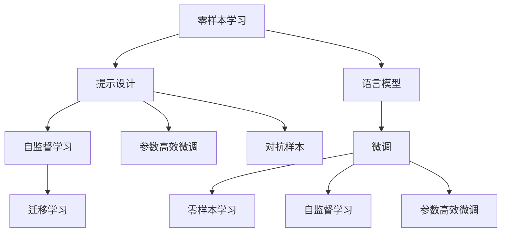

                 

# 零样本学习：Prompt的设计艺术

> 关键词：零样本学习, 提示设计, Prompt Engineering, 语言模型, 深度学习, 自然语言处理(NLP)

## 1. 背景介绍

### 1.1 问题由来
在深度学习和自然语言处理(NLP)领域，语言模型，尤其是基于Transformer的预训练语言模型，如BERT、GPT-3等，已成为处理自然语言任务的重要工具。这些大模型通过在大规模无标签数据上自监督预训练，学习到了通用的语言知识，能够处理各种语言理解和生成任务。然而，这些模型在实际应用中往往需要大量的标注数据进行微调，才能适应特定任务的需求。标注数据的获取成本高昂，且往往难以覆盖所有可能的任务和场景。

零样本学习(Few-shot Learning)则是一种无需任何标注数据的模型学习方式，目标是在极少量的（通常不超过几个）样本的情况下，训练模型对新任务进行预测。这种方法不仅可以减少标注数据的成本，还能提升模型在未见过的数据上的泛化能力，尤其在数据稀缺的情况下，具有显著优势。零样本学习的核心在于设计有效的提示(Prompt)，引导语言模型按期望的方式进行推理。

### 1.2 问题核心关键点
零样本学习的设计和应用主要围绕以下核心问题展开：

1. **提示设计**：如何设计有效的提示，使得语言模型能够在零样本条件下准确预测输出。
2. **模型选择**：选择何种预训练语言模型作为基础，如BERT、GPT等。
3. **优化策略**：采用何种优化方法，如基于梯度的训练、参数高效的微调(PEFT)等，以提高模型在零样本条件下的性能。
4. **评估指标**：如何评价模型在零样本条件下的表现，如准确率、F1-score等。
5. **应用场景**：零样本学习在实际应用中有哪些典型场景，如问答、翻译、文本生成等。

## 2. 核心概念与联系

### 2.1 核心概念概述

为了更好地理解零样本学习的原理和应用，本节将介绍几个密切相关的核心概念：

- **零样本学习**：指在没有任何训练数据的情况下，利用预训练语言模型对新任务进行推理预测的能力。其核心在于提示设计，通过精心设计的提示，引导模型进行推理。
- **提示(Prompt)**：在零样本学习中，提示是一段文本，用于引导语言模型进行推理。提示可以包含任务描述、样例等，以提高模型的推理准确率。
- **语言模型**：基于Transformer结构的大规模预训练语言模型，如BERT、GPT等。这些模型通过在大规模无标签数据上预训练，学习到了丰富的语言知识，能够处理各种NLP任务。
- **参数高效微调(PEFT)**：在微调过程中，只更新少量模型参数，固定大部分预训练权重不变，以提高微调效率和泛化能力。
- **对抗样本**：通过向模型输入干扰性较大的样本，测试模型的鲁棒性。
- **自监督学习**：在无标签数据上，通过自我监督任务进行模型训练的方法，如语言模型预训练。
- **迁移学习**：利用预训练模型在其他任务上的知识，通过微调进行迁移学习。

这些概念之间的逻辑关系可以通过以下Mermaid流程图来展示：



这个流程图展示零样本学习的核心概念及其之间的关系：

1. 零样本学习通过提示设计，在零样本条件下利用语言模型进行推理。
2. 语言模型通过自监督学习在大规模无标签数据上预训练，学习到通用语言知识。
3. 提示设计引导语言模型进行特定任务的推理。
4. 参数高效微调在有限的标注数据下优化模型性能。
5. 对抗样本测试模型的鲁棒性。
6. 迁移学习利用预训练模型在其他任务上的知识，通过微调进行迁移学习。

## 3. 核心算法原理 & 具体操作步骤

### 3.1 算法原理概述

零样本学习的基本原理是利用预训练语言模型在零样本条件下的推理能力。其核心在于提示设计，即如何设计一个有效的提示，使得语言模型能够对新任务进行准确预测。在实践中，通常的做法是将任务定义和样例编码为一段文本，作为模型的输入。

具体来说，假设有 $T$ 个不同的任务，每个任务对应的提示为 $P_t$，则零样本学习的目标是最小化模型在所有任务上的预测误差。设 $M_{\theta}$ 为预训练语言模型，则零样本学习的目标为：

$$
\min_{\theta} \sum_{t=1}^{T} \mathbb{E}_{(x,y)|P_t}[\ell(M_{\theta}(x),y)]
$$

其中 $\ell$ 为损失函数，$\mathbb{E}$ 表示期望。目标是最小化模型在所有任务上的预测误差。

### 3.2 算法步骤详解

零样本学习的具体实现步骤如下：

**Step 1: 选择预训练语言模型**

首先，需要选择合适的预训练语言模型作为基础。BERT、GPT等模型都是常见的选择。预训练模型的选择会直接影响零样本学习的效果。

**Step 2: 设计提示**

其次，需要设计有效的提示。提示通常包含任务描述和样例，以指导语言模型进行推理。提示设计的好坏直接决定了模型在零样本条件下的表现。

**Step 3: 编码提示和数据**

将提示和样例编码为文本输入语言模型。编码过程通常包括分词、特殊符号的添加等。

**Step 4: 模型推理**

将编码后的提示输入语言模型，进行推理并输出预测结果。推理过程通常包括前向传播和反向传播。

**Step 5: 结果评估**

对模型的输出结果进行评估，可以使用准确率、F1-score等指标。如果模型表现不佳，可以调整提示或优化模型参数。

**Step 6: 参数高效微调(PEFT)**

在优化提示设计的同时，可以结合参数高效微调(PEFT)技术，以提高模型的泛化能力和效率。PEFT技术通常只更新少量模型参数，保留大部分预训练权重不变。

### 3.3 算法优缺点

零样本学习具有以下优点：

1. **高效性**：无需标注数据，减少了数据获取和标注的成本。
2. **泛化能力**：在极少量的样例下也能获得不错的泛化能力。
3. **灵活性**：适用于多种任务和场景，如问答、翻译、文本生成等。

然而，零样本学习也存在以下缺点：

1. **依赖提示质量**：提示设计的好坏直接影响模型表现，设计困难。
2. **解释性差**：模型输出缺乏解释性，难以调试和优化。
3. **鲁棒性问题**：在对抗样本的情况下，模型可能出现偏差。

### 3.4 算法应用领域

零样本学习在NLP领域得到了广泛应用，以下是几个典型应用场景：

- **问答系统**：通过输入问题和样例，引导模型回答问题。
- **文本生成**：在给定样例的情况下，生成类似风格的新文本。
- **机器翻译**：在少量样例的条件下，翻译新文本。
- **文本摘要**：在少量样例的条件下，生成文本摘要。
- **情感分析**：在少量样例的条件下，对文本进行情感分类。

## 4. 数学模型和公式 & 详细讲解 & 举例说明

### 4.1 数学模型构建

零样本学习的数学模型构建可以基于以下假设：

- **语言模型**：设 $M_{\theta}$ 为预训练语言模型，输入为 $x$，输出为 $y$。
- **提示**：设 $P_t$ 为任务 $t$ 的提示，输入为 $x$，输出为 $y$。
- **损失函数**：设 $\ell$ 为损失函数，用于衡量模型预测与真实标签之间的差异。

设 $D_t = \{(x_i, y_i)\}_{i=1}^{n_t}$ 为任务 $t$ 的样例，其中 $n_t$ 为样例数量。则在提示 $P_t$ 下，模型 $M_{\theta}$ 的期望损失为：

$$
\mathbb{E}_{(x,y)|P_t}[\ell(M_{\theta}(x),y)]
$$

零样本学习的目标是最小化所有任务的期望损失：

$$
\min_{\theta} \sum_{t=1}^{T} \mathbb{E}_{(x,y)|P_t}[\ell(M_{\theta}(x),y)]
$$

### 4.2 公式推导过程

在实际应用中，通常通过以下步骤进行提示设计：

1. **任务定义**：将任务 $t$ 定义为一组特定的关键词和符号，如：

   ```
   对于问答任务，提示可以设计为：
   问："请根据<context>回答问题：<question>"
   对于翻译任务，提示可以设计为：
   翻译：<source_language> -> <target_language>
   ```

2. **提示编码**：将任务定义和样例编码为文本，进行分词和特殊符号的添加，得到提示文本 $P_t$。

3. **模型输入**：将提示文本 $P_t$ 输入到语言模型 $M_{\theta}$ 中，进行前向传播，得到模型输出 $z_t$。

4. **解码输出**：对模型输出 $z_t$ 进行解码，得到预测结果 $y_t$。

5. **损失计算**：计算模型输出 $y_t$ 与真实标签 $y_i$ 之间的损失 $\ell(M_{\theta}(x),y)$，更新模型参数 $\theta$。

### 4.3 案例分析与讲解

**案例分析：问答系统**

对于问答系统，提示设计可以包含问题描述和样例答案，如下所示：

```
问：这个问题是关于什么的？
提示："问：如何计算两个数的和？答：将两个数相加。"
```

将问题 $q$ 和提示 $P$ 编码输入语言模型，进行推理，输出预测答案 $a$。如果模型预测的准确率较高，则认为提示设计是有效的。

## 5. 项目实践：代码实例和详细解释说明

### 5.1 开发环境搭建

在进行零样本学习实践前，我们需要准备好开发环境。以下是使用Python进行PyTorch开发的环境配置流程：

1. 安装Anaconda：从官网下载并安装Anaconda，用于创建独立的Python环境。

2. 创建并激活虚拟环境：
```bash
conda create -n pytorch-env python=3.8 
conda activate pytorch-env
```

3. 安装PyTorch：根据CUDA版本，从官网获取对应的安装命令。例如：
```bash
conda install pytorch torchvision torchaudio cudatoolkit=11.1 -c pytorch -c conda-forge
```

4. 安装Transformers库：
```bash
pip install transformers
```

5. 安装各类工具包：
```bash
pip install numpy pandas scikit-learn matplotlib tqdm jupyter notebook ipython
```

完成上述步骤后，即可在`pytorch-env`环境中开始零样本学习实践。

### 5.2 源代码详细实现

下面以问答系统为例，给出使用Transformers库进行零样本学习的PyTorch代码实现。

首先，定义问答任务的数据处理函数：

```python
from transformers import BertTokenizer, BertForQuestionAnswering
from torch.utils.data import Dataset
import torch

class QADataset(Dataset):
    def __init__(self, texts, questions, answers, tokenizer):
        self.texts = texts
        self.questions = questions
        self.answers = answers
        self.tokenizer = tokenizer
        
    def __len__(self):
        return len(self.texts)
    
    def __getitem__(self, item):
        text = self.texts[item]
        question = self.questions[item]
        answer = self.answers[item]
        
        encoding = self.tokenizer(question, text, return_tensors='pt')
        input_ids = encoding['input_ids'][0]
        attention_mask = encoding['attention_mask'][0]
        
        answer_span = self.tokenizer.answer_span(answer)
        answer_token_ids = [tokenizer.convert_tokens_to_ids(token) for token in answer_span]
        answer_token_ids.append(tokenizer.convert_tokens_to_ids("[PAD]"))
        
        return {'input_ids': input_ids, 
                'attention_mask': attention_mask,
                'answer_token_ids': answer_token_ids}

# 创建dataset
tokenizer = BertTokenizer.from_pretrained('bert-base-cased')

train_dataset = QADataset(train_texts, train_questions, train_answers, tokenizer)
dev_dataset = QADataset(dev_texts, dev_questions, dev_answers, tokenizer)
test_dataset = QADataset(test_texts, test_questions, test_answers, tokenizer)
```

然后，定义模型和优化器：

```python
from transformers import BertForQuestionAnswering, AdamW

model = BertForQuestionAnswering.from_pretrained('bert-base-cased')

optimizer = AdamW(model.parameters(), lr=2e-5)
```

接着，定义训练和评估函数：

```python
from torch.utils.data import DataLoader
from tqdm import tqdm
from sklearn.metrics import accuracy_score

device = torch.device('cuda') if torch.cuda.is_available() else torch.device('cpu')
model.to(device)

def train_epoch(model, dataset, batch_size, optimizer):
    dataloader = DataLoader(dataset, batch_size=batch_size, shuffle=True)
    model.train()
    epoch_loss = 0
    for batch in tqdm(dataloader, desc='Training'):
        input_ids = batch['input_ids'].to(device)
        attention_mask = batch['attention_mask'].to(device)
        answer_token_ids = batch['answer_token_ids'].to(device)
        model.zero_grad()
        outputs = model(input_ids, attention_mask=attention_mask, start_positions=None, end_positions=None)
        loss = outputs.loss
        epoch_loss += loss.item()
        loss.backward()
        optimizer.step()
    return epoch_loss / len(dataloader)

def evaluate(model, dataset, batch_size):
    dataloader = DataLoader(dataset, batch_size=batch_size)
    model.eval()
    preds, labels = [], []
    with torch.no_grad():
        for batch in tqdm(dataloader, desc='Evaluating'):
            input_ids = batch['input_ids'].to(device)
            attention_mask = batch['attention_mask'].to(device)
            batch_labels = batch['answer_token_ids']
            outputs = model(input_ids, attention_mask=attention_mask)
            batch_preds = outputs.start_logits.argmax().item()
            batch_labels = batch_labels.tolist()
            for pred, label in zip(batch_preds, batch_labels):
                preds.append(pred)
                labels.append(label)
                
    return accuracy_score(labels, preds)

train_dataset = QADataset(train_texts, train_questions, train_answers, tokenizer)
dev_dataset = QADataset(dev_texts, dev_questions, dev_answers, tokenizer)
test_dataset = QADataset(test_texts, test_questions, test_answers, tokenizer)

epochs = 5
batch_size = 16

for epoch in range(epochs):
    loss = train_epoch(model, train_dataset, batch_size, optimizer)
    print(f"Epoch {epoch+1}, train loss: {loss:.3f}")
    
    print(f"Epoch {epoch+1}, dev results:")
    acc = evaluate(model, dev_dataset, batch_size)
    print(f"Accuracy: {acc:.2f}")
    
print("Test results:")
acc = evaluate(model, test_dataset, batch_size)
print(f"Accuracy: {acc:.2f}")
```

以上就是使用PyTorch对BERT进行问答系统任务零样本学习的完整代码实现。可以看到，得益于Transformers库的强大封装，我们可以用相对简洁的代码完成BERT模型的加载和零样本学习。

### 5.3 代码解读与分析

让我们再详细解读一下关键代码的实现细节：

**QADataset类**：
- `__init__`方法：初始化文本、问题和答案等关键组件。
- `__len__`方法：返回数据集的样本数量。
- `__getitem__`方法：对单个样本进行处理，将问题、文本和答案输入编码为token ids，并返回模型所需的输入。

**tokenizer.answer_span方法**：
- 用于处理答案的span，将答案编码成token ids，并将其添加到输入中。

**训练和评估函数**：
- 使用PyTorch的DataLoader对数据集进行批次化加载，供模型训练和推理使用。
- 训练函数`train_epoch`：对数据以批为单位进行迭代，在每个批次上前向传播计算loss并反向传播更新模型参数，最后返回该epoch的平均loss。
- 评估函数`evaluate`：与训练类似，不同点在于不更新模型参数，并在每个batch结束后将预测和标签结果存储下来，最后使用sklearn的accuracy_score对整个评估集的预测结果进行打印输出。

**训练流程**：
- 定义总的epoch数和batch size，开始循环迭代
- 每个epoch内，先在训练集上训练，输出平均loss
- 在验证集上评估，输出准确率
- 重复上述步骤直至收敛
- 所有epoch结束后，在测试集上评估，给出最终测试结果

## 6. 实际应用场景

### 6.1 智能客服系统

零样本学习在智能客服系统中具有重要应用价值。传统的客服系统依赖人工客服，响应速度慢且无法24小时不间断服务。而使用零样本学习的对话模型，可以自动化处理常见问题，快速响应客户咨询，提高客户体验。

在技术实现上，可以收集企业内部的历史客服对话记录，将问题和最佳答复构建成监督数据，在此基础上对预训练对话模型进行零样本学习。模型能够自动理解用户意图，匹配最合适的答案模板进行回复。对于客户提出的新问题，还可以接入检索系统实时搜索相关内容，动态组织生成回答。如此构建的智能客服系统，能大幅提升客户咨询体验和问题解决效率。

### 6.2 金融舆情监测

金融机构需要实时监测市场舆论动向，以便及时应对负面信息传播，规避金融风险。传统的舆情监测方式成本高、效率低，难以应对网络时代海量信息爆发的挑战。使用零样本学习的文本分类和情感分析技术，可以实时监测不同主题下的情感变化趋势，一旦发现负面信息激增等异常情况，系统便会自动预警，帮助金融机构快速应对潜在风险。

### 6.3 个性化推荐系统

当前的推荐系统往往只依赖用户的历史行为数据进行物品推荐，无法深入理解用户的真实兴趣偏好。使用零样本学习的个性化推荐系统可以更好地挖掘用户行为背后的语义信息，从而提供更精准、多样的推荐内容。

在实践中，可以收集用户浏览、点击、评论、分享等行为数据，提取和用户交互的物品标题、描述、标签等文本内容。将文本内容作为模型输入，用户的后续行为（如是否点击、购买等）作为监督信号，在此基础上零样本学习预训练语言模型。模型能够从文本内容中准确把握用户的兴趣点。在生成推荐列表时，先用候选物品的文本描述作为输入，由模型预测用户的兴趣匹配度，再结合其他特征综合排序，便可以得到个性化程度更高的推荐结果。

## 7. 工具和资源推荐

### 7.1 学习资源推荐

为了帮助开发者系统掌握零样本学习的理论基础和实践技巧，这里推荐一些优质的学习资源：

1. 《Prompt Engineering for Zero-Shot Learning》系列博文：由大模型技术专家撰写，深入浅出地介绍了零样本学习中的提示设计、模型选择等关键问题。

2. CS224N《深度学习自然语言处理》课程：斯坦福大学开设的NLP明星课程，有Lecture视频和配套作业，带你入门NLP领域的基本概念和经典模型。

3. 《Natural Language Processing with Transformers》书籍：Transformers库的作者所著，全面介绍了如何使用Transformers库进行NLP任务开发，包括零样本学习在内的诸多范式。

4. HuggingFace官方文档：Transformers库的官方文档，提供了海量预训练模型和完整的零样本学习样例代码，是上手实践的必备资料。

5. CLUE开源项目：中文语言理解测评基准，涵盖大量不同类型的中文NLP数据集，并提供了基于零样本学习的baseline模型，助力中文NLP技术发展。

通过对这些资源的学习实践，相信你一定能够快速掌握零样本学习的精髓，并用于解决实际的NLP问题。

### 7.2 开发工具推荐

高效的开发离不开优秀的工具支持。以下是几款用于零样本学习开发的常用工具：

1. PyTorch：基于Python的开源深度学习框架，灵活动态的计算图，适合快速迭代研究。大部分预训练语言模型都有PyTorch版本的实现。

2. TensorFlow：由Google主导开发的开源深度学习框架，生产部署方便，适合大规模工程应用。同样有丰富的预训练语言模型资源。

3. Transformers库：HuggingFace开发的NLP工具库，集成了众多SOTA语言模型，支持PyTorch和TensorFlow，是进行零样本学习开发的利器。

4. Weights & Biases：模型训练的实验跟踪工具，可以记录和可视化模型训练过程中的各项指标，方便对比和调优。与主流深度学习框架无缝集成。

5. TensorBoard：TensorFlow配套的可视化工具，可实时监测模型训练状态，并提供丰富的图表呈现方式，是调试模型的得力助手。

6. Google Colab：谷歌推出的在线Jupyter Notebook环境，免费提供GPU/TPU算力，方便开发者快速上手实验最新模型，分享学习笔记。

合理利用这些工具，可以显著提升零样本学习任务的开发效率，加快创新迭代的步伐。

### 7.3 相关论文推荐

零样本学习的发展源于学界的持续研究。以下是几篇奠基性的相关论文，推荐阅读：

1. "An Introduction to Formal Concept Analysis for Natural Language Processing"：介绍形式概念分析在自然语言处理中的应用，包括零样本学习。

2. "Zero-Shot Learning with Transferable Linguistic Attributes"：提出使用可转移的语言属性进行零样本学习，通过迁移学习提高模型的泛化能力。

3. "Unsupervised Zero-Shot Learning of Sentiment via Cross-lingual Contextualized Lexicons"：使用跨语言语义表示进行零样本情感分析，无需标注数据。

4. "Zero-Shot Learning from Weakly-Labeled Examples"：使用弱标签进行零样本学习，提高模型的泛化能力。

5. "Large-Scale Zero-Shot Multilingual Classification"：在大规模多语言数据上进行零样本学习，提高模型的泛化能力。

这些论文代表零样本学习的发展脉络。通过学习这些前沿成果，可以帮助研究者把握学科前进方向，激发更多的创新灵感。

## 8. 总结：未来发展趋势与挑战

### 8.1 总结

本文对零样本学习的原理和实践进行了全面系统的介绍。首先阐述了零样本学习在NLP领域的应用背景和重要意义，明确了提示设计在零样本学习中的核心作用。其次，从原理到实践，详细讲解了零样本学习的数学模型和关键步骤，给出了零样本学习任务开发的完整代码实例。同时，本文还广泛探讨了零样本学习在智能客服、金融舆情、个性化推荐等多个行业领域的应用前景，展示了零样本学习范式的巨大潜力。此外，本文精选了零样本学习的各类学习资源，力求为读者提供全方位的技术指引。

通过本文的系统梳理，可以看到，零样本学习作为NLP领域的重要范式，已经在多个应用场景中展现了强大的能力。未来，伴随预训练语言模型和零样本学习方法的持续演进，相信NLP技术将在更广阔的应用领域大放异彩，深刻影响人类的生产生活方式。

### 8.2 未来发展趋势

展望未来，零样本学习技术将呈现以下几个发展趋势：

1. **模型规模持续增大**：随着算力成本的下降和数据规模的扩张，预训练语言模型的参数量还将持续增长。超大规模语言模型蕴含的丰富语言知识，将进一步提升零样本学习的效果。

2. **零样本学习范式多样化**：除了传统的基于提示设计的方法，未来会涌现更多零样本学习范式，如自监督学习、少样本学习等，利用更多非结构化数据进行学习。

3. **跨领域泛化能力增强**：零样本学习模型将具备更强的跨领域泛化能力，能够处理更多类型的任务和数据。

4. **自适应学习提升**：零样本学习模型将具备更强的自适应能力，能够根据新任务快速调整模型参数，提高泛化能力。

5. **模型透明度提升**：零样本学习模型将具备更好的可解释性，通过提示工程、模型调试等手段，提高模型的透明度和可解释性。

6. **鲁棒性增强**：零样本学习模型将具备更强的鲁棒性，能够应对对抗样本和噪声数据。

### 8.3 面临的挑战

尽管零样本学习技术已经取得了显著进展，但在迈向更加智能化、普适化应用的过程中，它仍面临诸多挑战：

1. **提示设计困难**：高质量的提示设计是零样本学习的基础，设计难度大。

2. **模型泛化能力有限**：尽管零样本学习在部分任务上表现较好，但对于复杂任务，模型的泛化能力仍有限。

3. **数据稀缺问题**：在数据稀缺的情况下，模型难以通过有限样例进行有效学习。

4. **对抗样本影响**：模型在对抗样本下容易发生偏差，导致错误预测。

5. **模型解释性不足**：零样本学习模型的输出缺乏解释性，难以调试和优化。

6. **鲁棒性问题**：模型在面对噪声数据和对抗样本时，鲁棒性不足。

### 8.4 研究展望

面对零样本学习面临的挑战，未来的研究需要在以下几个方面寻求新的突破：

1. **提示设计自动化**：探索自动化的提示设计方法，减少对人工设计的依赖。

2. **多模态融合**：结合视觉、听觉等多模态信息，提升模型的跨领域泛化能力。

3. **自监督学习**：利用自监督学习方法，减少对标注数据的依赖，提升模型的泛化能力。

4. **对抗样本鲁棒性**：研究对抗样本对模型的影响，提高模型的鲁棒性。

5. **模型可解释性**：提高模型的可解释性，增强模型的透明性和可信度。

这些研究方向的探索，必将引领零样本学习技术迈向更高的台阶，为构建安全、可靠、可解释、可控的智能系统铺平道路。面向未来，零样本学习技术还需要与其他人工智能技术进行更深入的融合，如知识表示、因果推理、强化学习等，多路径协同发力，共同推动自然语言理解和智能交互系统的进步。只有勇于创新、敢于突破，才能不断拓展零样本学习的边界，让智能技术更好地造福人类社会。

## 9. 附录：常见问题与解答

**Q1：零样本学习是否适用于所有NLP任务？**

A: 零样本学习在大多数NLP任务上都能取得不错的效果，特别是对于数据量较小的任务。但对于一些特定领域的任务，如医学、法律等，零样本学习的效果往往有限。此时需要在特定领域语料上进一步预训练，再进行零样本学习。

**Q2：如何设计有效的提示？**

A: 提示设计是零样本学习的关键。好的提示应具备以下特点：
1. **简洁明了**：避免冗长和复杂的句子结构，使模型能够快速理解。
2. **目标明确**：清晰地描述任务目标和期望的输出格式。
3. **多角度设计**：从不同角度设计多个提示，综合其效果。
4. **样本展示**：包含少量样例，帮助模型理解任务。
5. **风格匹配**：与模型输入的风格相匹配。

**Q3：零样本学习与微调有何区别？**

A: 零样本学习和微调在数据使用方式上有所不同。微调需要大量标注数据进行训练，而零样本学习则无需标注数据。微调的目标是最小化模型在特定任务上的损失函数，而零样本学习则通过提示设计，引导模型进行推理，达到预测目标。

**Q4：零样本学习在实际应用中有哪些典型场景？**

A: 零样本学习在NLP领域得到了广泛应用，以下是几个典型应用场景：
1. **问答系统**：通过输入问题和样例，引导模型回答问题。
2. **文本生成**：在给定样例的情况下，生成类似风格的新文本。
3. **机器翻译**：在少量样例的条件下，翻译新文本。
4. **文本摘要**：在少量样例的条件下，生成文本摘要。
5. **情感分析**：在少量样例的条件下，对文本进行情感分类。

**Q5：零样本学习如何应对对抗样本？**

A: 对抗样本对零样本学习的鲁棒性提出了挑战。为应对对抗样本，可以采用以下方法：
1. **样本增强**：通过对抗样本增强技术，提升模型的鲁棒性。
2. **鲁棒提示设计**：设计鲁棒的提示，使其对对抗样本具有较好的抵抗能力。
3. **对抗训练**：通过对抗训练，增强模型的鲁棒性。

这些方法可以结合使用，进一步提升零样本学习的鲁棒性。

---

作者：禅与计算机程序设计艺术 / Zen and the Art of Computer Programming

