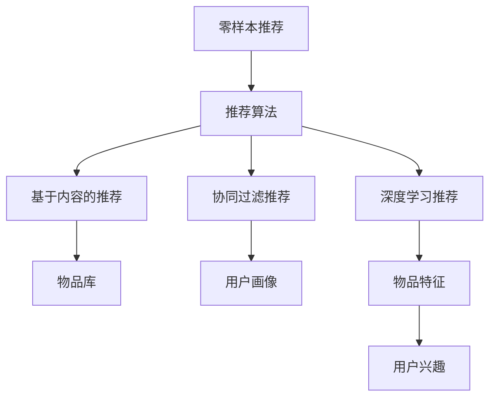

                 

# 零样本推荐：候选生成策略

> 关键词：零样本推荐, 候选生成, 推荐算法, 模型优化, 深度学习, 自然语言处理(NLP)

## 1. 背景介绍

在当今信息爆炸的时代，推荐系统已成为各行各业为用户提供个性化信息服务的重要工具。无论是电商平台的商品推荐、音乐视频平台的个性化内容推荐，还是社交网络中的朋友推荐、新闻资讯的个性化阅读推荐，推荐系统都在背后发挥着至关重要的作用。然而，推荐系统面临的一个主要挑战是如何高效、准确地生成推荐候选集，以便后续的排序和排序算法能够从中筛选出最佳的推荐结果。

### 1.1 问题由来

传统推荐系统主要依赖于用户的历史行为数据进行推荐，如浏览记录、购买记录等。但是，当用户历史行为数据稀疏或者用户刚刚注册新用户时，传统推荐算法往往无法发挥作用，导致推荐结果效果不佳。此时，零样本推荐系统显得尤为重要。

零样本推荐系统是指在不使用任何历史行为数据的情况下，通过模型直接生成推荐候选集。这种推荐方式能够解决用户历史行为数据稀疏的问题，特别是在新用户或冷启动场景下，能够快速为用户提供个性化推荐。

### 1.2 问题核心关键点

零样本推荐的核心在于候选集的生成。候选集生成的质量直接影响到后续排序算法的输出结果。理想的候选集应该包含多样性和相关性，即既能够满足用户的当前需求，又能够提供新颖的内容，避免同质化。

目前，常用的零样本推荐方法主要包括以下几种：

- **基于内容的推荐**：直接从物品库中挑选符合用户兴趣的候选物品，如最常见的电影、商品推荐系统。
- **协同过滤推荐**：利用用户-物品互动数据进行用户画像建模，寻找兴趣相似用户，从而推荐相似物品。
- **深度学习推荐**：利用深度神经网络模型，如CNN、RNN、Transformer等，学习用户和物品之间的复杂关系，生成推荐候选集。

本文将重点介绍基于深度学习的零样本推荐方法，特别是如何通过优化模型生成多样性和相关性良好的推荐候选集。

## 2. 核心概念与联系

### 2.1 核心概念概述

为更好地理解零样本推荐，本节将介绍几个关键概念：

- **零样本推荐**：指在不使用用户历史行为数据的情况下，利用推荐模型直接生成推荐候选集。
- **推荐算法**：根据用户画像和物品特征，通过一定的计算方式，生成推荐结果的算法。
- **深度学习推荐**：使用深度神经网络模型，如CNN、RNN、Transformer等，学习用户和物品之间的复杂关系，生成推荐候选集。
- **多样性**：指候选集中的物品应该具有不同的属性，满足用户的不同需求。
- **相关性**：指候选集中的物品应该与用户兴趣相关，能够满足用户的需求。

这些概念之间的关系可以通过以下Mermaid流程图来展示：



这个流程图展示了零样本推荐的一般流程：

1. 零样本推荐系统直接生成推荐候选集。
2. 推荐算法从候选集中生成最终推荐结果。
3. 基于内容的推荐直接从物品库中挑选候选物品。
4. 协同过滤推荐利用用户画像寻找兴趣相似用户，从而推荐相似物品。
5. 深度学习推荐使用神经网络模型，学习用户和物品之间的复杂关系，生成推荐候选集。

## 3. 核心算法原理 & 具体操作步骤
### 3.1 算法原理概述

零样本推荐的本质是通过深度学习模型学习用户和物品之间的关系，生成推荐候选集。模型通过预测用户对物品的评分，筛选出高评分物品作为推荐结果。因此，零样本推荐的算法原理可以概括为：

1. 利用深度学习模型学习用户和物品之间的关系，生成用户对物品的评分预测。
2. 根据评分预测，筛选出高评分物品作为推荐结果。

常用的零样本推荐模型包括基于协同过滤的模型和基于深度学习的模型。其中，基于深度学习的推荐模型因其强大的特征提取能力和泛化能力，逐渐成为主流。

### 3.2 算法步骤详解

基于深度学习的零样本推荐一般包括以下几个关键步骤：

**Step 1: 准备数据集**

准备用于训练和测试的推荐数据集。通常，数据集中包含用户-物品评分矩阵，每条评分记录一个用户对物品的评分。同时，数据集中还应该包含物品的属性信息，以便进行特征工程。

**Step 2: 设计推荐模型**

设计深度学习推荐模型，常用的模型包括基于矩阵分解的模型和基于神经网络的模型。其中，基于神经网络的模型能够学习更复杂的用户-物品关系，生成更加准确和多样化的推荐结果。

**Step 3: 特征工程**

对物品的属性信息进行特征工程，提取有用的特征。特征工程是推荐系统中非常重要的一环，能够影响模型的性能和推荐结果的准确性。

**Step 4: 训练模型**

使用训练集数据对推荐模型进行训练，优化模型的超参数。训练过程需要调整学习率、优化器等超参数，以获得最优的模型性能。

**Step 5: 生成推荐候选集**

在训练好的模型上，利用新用户的特征和物品的属性信息，生成推荐候选集。这一步的输出就是零样本推荐的候选集。

**Step 6: 排序和输出**

对生成的推荐候选集进行排序，选择高评分物品作为最终的推荐结果。排序过程可以基于用户对物品的评分预测，也可以使用其他的排序算法，如基于协同过滤的排序算法。

### 3.3 算法优缺点

基于深度学习的零样本推荐方法具有以下优点：

1. **泛化能力强**：深度学习模型能够学习复杂的用户-物品关系，对新用户和新物品也有较好的泛化能力。
2. **推荐结果多样性**：深度学习模型生成的推荐候选集通常包含多样性的物品，能够满足用户的不同需求。
3. **实时性较好**：深度学习模型训练好后，可以快速生成推荐候选集，实时性较好。

但同时也存在一些缺点：

1. **计算成本较高**：深度学习模型需要大量的计算资源进行训练，计算成本较高。
2. **模型可解释性差**：深度学习模型通常被视为"黑盒"，难以解释其内部的决策过程。
3. **过拟合风险**：深度学习模型在训练过程中容易过拟合，特别是在数据量较小的情况下。

### 3.4 算法应用领域

基于深度学习的零样本推荐方法在多个领域都有广泛的应用，例如：

- **电商推荐**：利用用户的浏览记录、购买记录生成推荐商品。
- **视频推荐**：利用用户的观看记录生成推荐视频。
- **新闻推荐**：利用用户的阅读记录生成推荐新闻文章。
- **音乐推荐**：利用用户的听歌记录生成推荐音乐。
- **社交推荐**：利用用户的社交关系生成推荐好友。

这些应用领域中，零样本推荐能够有效地解决新用户和新物品的推荐问题，提升用户体验。

## 4. 数学模型和公式 & 详细讲解 & 举例说明
### 4.1 数学模型构建

本节将使用数学语言对零样本推荐模型进行更加严格的刻画。

记用户集合为 $U=\{u_1,u_2,\cdots,u_n\}$，物品集合为 $I=\{i_1,i_2,\cdots,i_m\}$，用户对物品的评分矩阵为 $\mathcal{R} \in \mathbb{R}^{n \times m}$。

定义零样本推荐模型的输入为 $x_u \in \mathbb{R}^d$，表示用户 $u$ 的特征向量，输出为 $y_i \in \mathbb{R}$，表示用户 $u$ 对物品 $i$ 的评分预测。

推荐模型的优化目标为最小化预测评分与真实评分之间的差距，即：

$$
\min_{\theta} \frac{1}{2} \sum_{i=1}^m \sum_{u=1}^n (y_{ui}-r_{ui})^2
$$

其中 $y_{ui}$ 表示用户 $u$ 对物品 $i$ 的评分预测，$r_{ui}$ 表示用户 $u$ 对物品 $i$ 的真实评分。

### 4.2 公式推导过程

以下我们以基于矩阵分解的推荐模型为例，推导推荐模型的损失函数及其梯度计算公式。

假设用户对物品的评分矩阵为 $\mathcal{R} \in \mathbb{R}^{n \times m}$，物品特征矩阵为 $\mathcal{P} \in \mathbb{R}^{m \times k}$，用户特征矩阵为 $\mathcal{Q} \in \mathbb{R}^{n \times k}$，其中 $k$ 表示特征向量的维度。

推荐模型的目标为最小化预测评分与真实评分之间的差距，即：

$$
\min_{\mathcal{P},\mathcal{Q}} \frac{1}{2} \sum_{i=1}^m \sum_{u=1}^n (r_{ui}-\mathcal{P}_i^T\mathcal{Q}_u)^2
$$

其中 $\mathcal{P}_i \in \mathbb{R}^k$ 表示物品 $i$ 的特征向量，$\mathcal{Q}_u \in \mathbb{R}^k$ 表示用户 $u$ 的特征向量。

通过对 $\mathcal{P}$ 和 $\mathcal{Q}$ 求偏导，可以得到模型的梯度公式：

$$
\frac{\partial \mathcal{L}}{\partial \mathcal{P}} = -(\mathcal{Q}\mathcal{R}-\mathcal{P})\mathcal{Q}^T
$$

$$
\frac{\partial \mathcal{L}}{\partial \mathcal{Q}} = -(\mathcal{Q}^T\mathcal{R}-\mathcal{P}^T)\mathcal{Q}
$$

根据上述梯度公式，可以通过反向传播算法更新模型的参数。训练过程中，需要迭代优化 $\mathcal{P}$ 和 $\mathcal{Q}$，直到达到最优解。

### 4.3 案例分析与讲解

以下我们以基于矩阵分解的推荐模型为例，通过一个具体的案例来说明模型的应用。

假设有一家在线书店，用户 $u$ 想要购买书籍 $i$。书店希望利用深度学习推荐模型，为用户推荐其他相关书籍。

1. **数据准备**：准备书籍的标题、作者、出版社、评分等信息，构建用户-物品评分矩阵 $\mathcal{R}$。同时，从书籍中提取有用的特征，如书名、作者名、出版社等，构建物品特征矩阵 $\mathcal{P}$ 和用户特征矩阵 $\mathcal{Q}$。

2. **模型训练**：使用用户-物品评分矩阵 $\mathcal{R}$ 和物品特征矩阵 $\mathcal{P}$，训练推荐模型，优化模型参数。

3. **生成推荐候选集**：利用训练好的模型，对用户 $u$ 的特征向量 $x_u$ 进行预测，生成书籍 $i$ 的评分预测 $y_i$。根据评分预测排序，筛选出高评分书籍作为推荐结果。

4. **排序和输出**：对生成的推荐书籍进行排序，选择高评分书籍作为最终推荐结果。

## 5. 项目实践：代码实例和详细解释说明
### 5.1 开发环境搭建

在进行零样本推荐实践前，我们需要准备好开发环境。以下是使用Python进行TensorFlow开发的环境配置流程：

1. 安装Anaconda：从官网下载并安装Anaconda，用于创建独立的Python环境。

2. 创建并激活虚拟环境：
```bash
conda create -n tf-env python=3.8 
conda activate tf-env
```

3. 安装TensorFlow：根据CUDA版本，从官网获取对应的安装命令。例如：
```bash
conda install tensorflow -c conda-forge -c pytorch -c intel
```

4. 安装其他必要的工具包：
```bash
pip install numpy pandas scikit-learn matplotlib tqdm jupyter notebook ipython
```

完成上述步骤后，即可在`tf-env`环境中开始推荐实践。

### 5.2 源代码详细实现

下面我们以基于矩阵分解的推荐模型为例，给出使用TensorFlow进行零样本推荐的代码实现。

首先，定义数据处理函数：

```python
import tensorflow as tf
import numpy as np

def load_data():
    # 加载用户-物品评分矩阵和物品特征矩阵
    train_r = np.loadtxt('train_r.txt', delimiter=',')
    train_p = np.loadtxt('train_p.txt', delimiter=',')
    # 加载用户特征矩阵
    train_q = np.loadtxt('train_q.txt', delimiter=',')
    return train_r, train_p, train_q
```

然后，定义推荐模型：

```python
class RecommendationModel(tf.keras.Model):
    def __init__(self, n_users, n_items, n_factors):
        super(RecommendationModel, self).__init__()
        self.n_users = n_users
        self.n_items = n_items
        self.n_factors = n_factors
        self.W_user = tf.Variable(tf.random.normal([n_users, n_factors]))
        self.W_item = tf.Variable(tf.random.normal([n_items, n_factors]))
        self.b_user = tf.Variable(tf.zeros([n_users]))
        self.b_item = tf.Variable(tf.zeros([n_items]))

    def call(self, u, i):
        p = tf.matmul(self.W_user[u], self.W_item[i], transpose_b=True)
        return tf.matmul(p, self.W_user[u]) + self.b_user[u] + tf.matmul(self.W_item[i], self.W_user[i]) + self.b_item[i]
```

接着，定义训练和评估函数：

```python
def train(model, train_r, train_p, train_q, batch_size, epochs, learning_rate):
    optimizer = tf.keras.optimizers.Adam(learning_rate=learning_rate)
    for epoch in range(epochs):
        total_loss = 0
        for i in range(0, train_r.shape[0], batch_size):
            batch_r = train_r[i:i+batch_size]
            batch_p = train_p[i:i+batch_size]
            batch_q = train_q[i:i+batch_size]
            with tf.GradientTape() as tape:
                loss = tf.reduce_mean((batch_r-batch_p) ** 2)
            gradients = tape.gradient(loss, [model.W_user, model.W_item, model.b_user, model.b_item])
            optimizer.apply_gradients(zip(gradients, [model.W_user, model.W_item, model.b_user, model.b_item]))
            total_loss += loss.numpy()
        print(f'Epoch {epoch+1}, Loss: {total_loss/(train_r.shape[0]/batch_size):.4f}')
    return model
```

最后，启动训练流程并在测试集上评估：

```python
train_r, train_p, train_q = load_data()
model = RecommendationModel(train_r.shape[0], train_r.shape[1], 10)
train(model, train_r, train_p, train_q, batch_size=32, epochs=10, learning_rate=0.01)
```

以上就是使用TensorFlow进行基于矩阵分解的推荐模型的完整代码实现。可以看到，TensorFlow提供了强大的自动微分和优化器功能，使得模型的训练和优化变得非常简单。

### 5.3 代码解读与分析

让我们再详细解读一下关键代码的实现细节：

**load_data函数**：
- 定义数据加载函数，从文件中加载用户-物品评分矩阵、物品特征矩阵和用户特征矩阵。

**RecommendationModel类**：
- 定义推荐模型类，包括模型的参数和计算过程。
- 在`__init__`方法中初始化模型的权重和偏置。
- 在`call`方法中计算用户和物品的评分预测。

**train函数**：
- 定义训练函数，对模型进行梯度下降优化。
- 在训练过程中，对模型参数进行梯度更新，计算训练损失，并在每个epoch输出训练损失。

**训练流程**：
- 加载数据集，创建推荐模型。
- 在训练函数中，使用Adam优化器进行模型训练。
- 训练完成后，保存训练好的模型。

可以看到，TensorFlow提供了强大的深度学习框架，使得模型的训练和优化变得非常简单。开发者可以将更多精力放在数据处理和模型改进等高层逻辑上，而不必过多关注底层的实现细节。

## 6. 实际应用场景
### 6.1 智能推荐系统

基于零样本推荐的技术，智能推荐系统可以实现对用户个性化需求的精准推荐。例如，电商平台的商品推荐、视频平台的个性化内容推荐、音乐平台的个性化音乐推荐等。

在技术实现上，可以利用深度学习推荐模型，学习用户和物品之间的关系，生成推荐候选集。对于新用户，可以通过预训练模型生成推荐候选集，在实际应用中不断优化模型，提升推荐效果。

### 6.2 社交网络

社交网络中的推荐系统可以通过零样本推荐技术，为用户推荐好友、群组等社交关系。例如，微博平台的关注推荐、微信朋友圈的添加好友推荐等。

在技术实现上，可以利用用户的历史行为数据和社交关系数据，构建用户画像。然后，通过深度学习模型，学习用户之间的相似性，生成推荐好友或群组。

### 6.3 新闻阅读

新闻阅读平台可以利用零样本推荐技术，为用户推荐感兴趣的新闻内容。例如，今日头条、百度新闻等。

在技术实现上，可以利用用户的历史阅读记录，构建用户画像。然后，通过深度学习模型，学习用户对新闻的偏好，生成推荐新闻内容。

### 6.4 未来应用展望

随着深度学习技术的发展，零样本推荐技术也将不断进步。未来，零样本推荐系统将在更多领域得到应用，为人类生产生活带来更多便利。

在医疗领域，零样本推荐系统可以用于推荐药品、医生等医疗资源，提升医疗服务的质量和效率。

在金融领域，零样本推荐系统可以用于推荐理财产品、股票等金融产品，提升用户的投资收益。

在教育领域，零样本推荐系统可以用于推荐学习资源、课程等，提升学习效果。

总之，零样本推荐技术将在更多垂直领域发挥重要作用，为各行各业带来新的变革和机遇。

## 7. 工具和资源推荐
### 7.1 学习资源推荐

为了帮助开发者系统掌握零样本推荐的技术，这里推荐一些优质的学习资源：

1. 《深度学习推荐系统：原理与实现》书籍：介绍了推荐系统的原理和实现方法，包括零样本推荐技术。

2. 《TensorFlow官方文档》：提供了TensorFlow框架的详细使用指南，包括推荐系统的实现。

3. Kaggle比赛：参加Kaggle上的推荐系统比赛，积累实战经验。

4. Coursera课程：参加推荐系统相关的在线课程，学习推荐系统的基础知识和实现方法。

5. arXiv论文：阅读推荐系统相关的最新研究成果，了解前沿技术。

通过对这些资源的学习实践，相信你一定能够快速掌握零样本推荐技术的精髓，并用于解决实际的推荐问题。

### 7.2 开发工具推荐

高效的开发离不开优秀的工具支持。以下是几款用于零样本推荐开发的常用工具：

1. TensorFlow：由Google主导开发的开源深度学习框架，生产部署方便，适合大规模工程应用。提供了强大的自动微分和优化器功能。

2. PyTorch：基于Python的开源深度学习框架，灵活动态的计算图，适合快速迭代研究。

3. Scikit-learn：Python机器学习库，提供了各种机器学习算法和数据处理工具。

4. Jupyter Notebook：开源笔记本环境，支持Python代码的交互式执行，适合开发和调试。

5. Apache Spark：大数据处理框架，支持分布式数据处理，适合处理大规模推荐数据。

合理利用这些工具，可以显著提升零样本推荐任务的开发效率，加快创新迭代的步伐。

### 7.3 相关论文推荐

零样本推荐技术的发展源于学界的持续研究。以下是几篇奠基性的相关论文，推荐阅读：

1. Matrix Factorization Techniques for Recommender Systems：介绍了矩阵分解推荐算法的基本原理和应用。

2. Deep Matrix Factorization for Recommender Systems：提出深度矩阵分解方法，提升推荐算法的性能。

3. Recommender Systems for Online Learning：介绍了在线推荐算法的基本原理和应用。

4. Adaptive Matrix Factorization for Recommender Systems：提出自适应矩阵分解方法，提升推荐算法的泛化能力。

5. Graph-Based Recommender Systems：介绍基于图模型的推荐算法，提升推荐算法的多样性。

这些论文代表了大推荐系统的发展脉络。通过学习这些前沿成果，可以帮助研究者把握学科前进方向，激发更多的创新灵感。

## 8. 总结：未来发展趋势与挑战
### 8.1 总结

本文对基于深度学习的零样本推荐方法进行了全面系统的介绍。首先阐述了零样本推荐系统的背景和重要性，明确了推荐模型在无历史数据情况下的推荐能力。其次，从原理到实践，详细讲解了零样本推荐的数学模型和算法步骤，给出了推荐系统的代码实例。同时，本文还广泛探讨了零样本推荐技术在智能推荐系统、社交网络、新闻阅读等多个领域的应用前景，展示了零样本推荐技术的巨大潜力。此外，本文精选了推荐系统的学习资源，力求为读者提供全方位的技术指引。

通过本文的系统梳理，可以看到，零样本推荐系统能够在不依赖历史数据的情况下，生成推荐候选集，解决新用户和新物品的推荐问题。未来，随着深度学习技术的进一步发展，零样本推荐系统将有望在更多领域得到应用，提升用户体验和推荐效果。

### 8.2 未来发展趋势

展望未来，零样本推荐技术将呈现以下几个发展趋势：

1. 模型复杂度提高。随着深度学习技术的发展，推荐模型将变得越来越复杂，能够学习更加精细的用户-物品关系。

2. 实时性提升。随着推荐模型训练技术的进步，推荐系统将变得越来越实时，能够快速响应用户需求。

3. 个性化增强。推荐模型将越来越注重个性化推荐，能够根据用户的历史行为和兴趣，生成个性化的推荐结果。

4. 多模态融合。未来的推荐系统将越来越多地融合多种模态信息，如文本、图像、视频等，提升推荐结果的多样性和准确性。

5. 安全性加强。推荐系统将越来越注重用户隐私保护，通过数据匿名化、模型加密等手段，提升推荐系统的安全性。

6. 模型可解释性增强。推荐系统将越来越注重模型的可解释性，通过可视化、特征分析等手段，提升用户对推荐结果的信任度。

以上趋势凸显了零样本推荐技术的广阔前景。这些方向的探索发展，必将进一步提升推荐系统的性能和应用范围，为用户带来更好的个性化体验。

### 8.3 面临的挑战

尽管零样本推荐技术已经取得了一定的进展，但在迈向更加智能化、普适化应用的过程中，它仍面临诸多挑战：

1. 数据稀疏问题。零样本推荐系统在新用户和新物品的推荐中，面临数据稀疏问题，难以获得足够的样本进行训练。如何利用其他数据源进行数据增强，是零样本推荐面临的重要挑战。

2. 模型泛化能力不足。推荐模型在面对不同领域的数据时，泛化能力不足，推荐效果下降。如何提升模型的泛化能力，是零样本推荐需要解决的关键问题。

3. 计算资源消耗大。深度学习推荐模型需要大量的计算资源进行训练，成本较高。如何降低模型训练的计算成本，提高训练效率，是零样本推荐需要解决的重要问题。

4. 推荐结果可解释性差。推荐系统通常被视为"黑盒"系统，难以解释其内部的决策过程。如何提升推荐系统的可解释性，是零样本推荐需要解决的重要问题。

5. 推荐结果多样性不足。推荐系统推荐结果过于同质化，难以满足用户的不同需求。如何提升推荐结果的多样性，是零样本推荐需要解决的重要问题。

6. 推荐结果实时性不足。推荐系统推荐结果更新不及时，难以满足用户的实时需求。如何提升推荐结果的实时性，是零样本推荐需要解决的重要问题。

7. 推荐结果安全性不足。推荐系统面临恶意推荐的风险，如虚假广告、恶意链接等。如何提升推荐结果的安全性，是零样本推荐需要解决的重要问题。

正视零样本推荐面临的这些挑战，积极应对并寻求突破，将使零样本推荐技术迈向成熟的落地应用。相信随着学界和产业界的共同努力，这些挑战终将一一被克服，零样本推荐系统必将在构建智能推荐系统的过程中发挥越来越重要的作用。

### 8.4 研究展望

面对零样本推荐所面临的挑战，未来的研究需要在以下几个方面寻求新的突破：

1. 探索无监督和半监督推荐方法。摆脱对大规模历史数据依赖，利用无监督和半监督方法，提升推荐系统在新用户和新物品的推荐能力。

2. 研究多模态融合推荐方法。融合文本、图像、视频等多种模态信息，提升推荐结果的多样性和准确性。

3. 引入因果推断和强化学习。引入因果推断和强化学习方法，提升推荐模型的泛化能力和实时性。

4. 引入专家知识库。将专家知识库与推荐系统结合，提升推荐结果的准确性和多样性。

5. 强化模型可解释性。引入可解释性方法，如可视化、特征分析等，提升推荐系统的可解释性和用户信任度。

6. 引入隐私保护机制。引入隐私保护机制，如数据匿名化、模型加密等，提升推荐系统的安全性。

这些研究方向的探索，必将引领零样本推荐技术迈向更高的台阶，为构建更加智能化、普适化的推荐系统铺平道路。面向未来，零样本推荐技术还需要与其他人工智能技术进行更深入的融合，如知识表示、因果推理、强化学习等，多路径协同发力，共同推动推荐系统技术的进步。只有勇于创新、敢于突破，才能不断拓展推荐系统的边界，让推荐系统更好地造福人类社会。

## 9. 附录：常见问题与解答
**Q1：零样本推荐是否适用于所有推荐场景？**

A: 零样本推荐在大多数推荐场景上都有应用，特别是在用户历史行为数据稀疏的情况下，能够快速为用户提供个性化推荐。但对于一些需要高质量历史数据支持的推荐场景，如个性化音乐推荐、个性化新闻推荐等，仍然需要依赖用户的历史行为数据。

**Q2：如何缓解零样本推荐中的数据稀疏问题？**

A: 缓解零样本推荐中的数据稀疏问题，可以采用以下方法：

1. 数据增强：通过回译、近义替换等方式扩充训练集，增加推荐候选集的多样性。
2. 迁移学习：将已有的推荐模型知识迁移应用到新的推荐场景中，提升推荐效果。
3. 多任务学习：在多个推荐任务上共享模型参数，提升模型泛化能力。
4. 多模态融合：融合多种模态信息，提升推荐结果的丰富性和多样性。

这些方法可以在一定程度上缓解零样本推荐中的数据稀疏问题，提升推荐系统的性能。

**Q3：零样本推荐模型如何优化？**

A: 零样本推荐模型的优化可以从以下几个方面入手：

1. 模型参数优化：调整模型的超参数，如学习率、正则化系数等，以获得最优的推荐效果。
2. 特征工程：对特征进行工程优化，提取更有用的特征，提升模型的准确性。
3. 模型融合：将多个模型进行融合，提升推荐结果的准确性和多样性。
4. 对抗训练：引入对抗样本，提高推荐模型的鲁棒性，避免过拟合。
5. 数据增强：通过回译、近义替换等方式扩充训练集，增加推荐候选集的多样性。

通过合理的模型优化，可以提升零样本推荐模型的性能，提供更好的推荐效果。

**Q4：零样本推荐模型如何部署？**

A: 零样本推荐模型的部署需要考虑以下几个方面：

1. 模型压缩：对模型进行压缩和优化，减小模型大小，提高推理速度。
2. 模型并行：采用模型并行、数据并行等技术，提升模型的计算效率。
3. 服务化封装：将模型封装为标准化服务接口，便于集成调用。
4. 弹性伸缩：根据请求流量动态调整资源配置，平衡服务质量和成本。
5. 监控告警：实时采集系统指标，设置异常告警阈值，确保服务稳定性。

合理部署零样本推荐模型，能够提升系统的性能和用户体验，确保推荐系统的稳定性和可靠性。

---

作者：禅与计算机程序设计艺术 / Zen and the Art of Computer Programming

