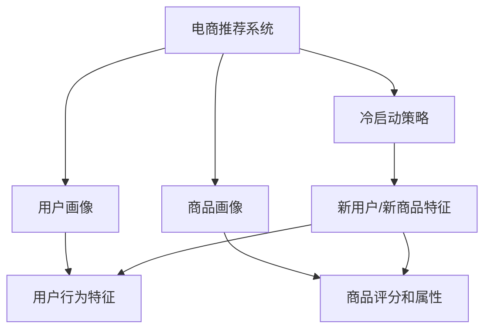

                 

## 1. 背景介绍

### 1.1 电商推荐问题由来
随着电商平台的蓬勃发展，个性化推荐系统成为了提升用户体验和销售转化的重要工具。然而，由于电商数据具有稀疏性和动态性，用户行为数据难以快速积累，导致新用户的推荐问题（即冷启动问题）尤为突出。在新用户刚注册时，没有足够的交互历史数据，推荐系统难以为其提供精准的产品推荐，导致用户体验下降，流失率上升。

### 1.2 问题核心关键点
冷启动问题源于数据不足，具体表现在两个方面：
1. **用户数据不足**：新用户未与平台发生足够的交互，缺乏行为特征。
2. **商品数据不足**：新商品在平台未被充分展示，缺乏历史评分和反馈。

针对这些问题，电商推荐系统需要设计高效的冷启动策略，使得新用户和新商品能够迅速融入推荐模型，获得合理的推荐效果。

## 2. 核心概念与联系

### 2.1 核心概念概述

为更好地理解电商推荐中的冷启动问题及其解决方法，本节将介绍几个密切相关的核心概念：

- **电商推荐系统**：通过分析用户历史行为数据和商品属性信息，为用户推荐符合其兴趣的商品的智能化系统。
- **用户画像**：对用户行为和属性进行抽象和概括，形成全面的用户标签体系，用于推荐模型建模。
- **商品画像**：对商品的属性和历史评分进行汇总和分析，形成商品标签体系，用于推荐模型建模。
- **冷启动策略**：在新用户或新商品未充分交互时，通过多种技术手段，获取其基本信息，快速融入推荐模型，得到合理的推荐结果。

这些概念之间的逻辑关系可以通过以下Mermaid流程图来展示：



这个流程图展示了一个完整的电商推荐系统的工作流程：

1. 电商推荐系统利用用户画像和商品画像，进行商品推荐。
2. 冷启动策略在用户画像和商品画像中未充分形成时，迅速获取新用户/新商品的基本特征。
3. 通过用户画像和商品画像的补充，快速融入推荐模型，形成推荐结果。

## 3. 核心算法原理 & 具体操作步骤
### 3.1 算法原理概述

电商推荐中的冷启动问题可以通过多种技术手段解决，其中基于大模型的冷启动策略尤为有效。核心思想是通过预训练的通用语言模型，获取用户和商品的语义信息，弥补历史数据的缺失，快速融入推荐模型。

具体而言，假设存在一个预训练的通用语言模型 $M_{\theta}$，用于处理自然语言文本。电商推荐系统中，用户画像和商品画像中未充分描述的特征，可以由语言模型通过自然语言描述进行补充。假设用户画像 $P_u$ 和商品画像 $P_p$ 中未充分描述的特征分别为 $S_u$ 和 $S_p$。则推荐系统通过自然语言描述 $d_u$ 和 $d_p$，分别更新用户画像和商品画像：

$$
P_u^{'} = P_u + \alpha \cdot M_{\theta}(d_u)
$$

$$
P_p^{'} = P_p + \beta \cdot M_{\theta}(d_p)
$$

其中 $\alpha$ 和 $\beta$ 为加权系数，表示语言模型对用户画像和商品画像的修正程度。修正后的用户画像和商品画像，可以更好地融入推荐模型，形成精准推荐。

### 3.2 算法步骤详解

基于大模型的电商推荐冷启动策略，一般包括以下几个关键步骤：

**Step 1: 准备预训练模型和数据集**
- 选择合适的预训练语言模型 $M_{\theta}$ 作为初始化参数，如GPT、BERT等。
- 收集电商领域内的用户行为数据和商品描述，作为预训练和微调的数据集。

**Step 2: 收集和处理自然语言描述**
- 对于未充分描述的用户画像和商品画像，收集自然语言描述 $d_u$ 和 $d_p$。例如，可以通过客服记录、商品描述、用户评论等。
- 对自然语言描述进行预处理，包括分词、去噪、实体识别等。

**Step 3: 构建推荐模型**
- 使用用户画像和商品画像，构建推荐模型的输入特征。
- 对于未充分描述的特征，通过预训练语言模型 $M_{\theta}$ 进行补充。
- 选择推荐算法（如协同过滤、基于矩阵分解的推荐等），进行模型训练和评估。

**Step 4: 集成模型和业务逻辑**
- 将推荐模型集成到电商推荐系统中。
- 结合电商业务逻辑，如搜索、浏览、购买行为等，进行联合建模。

**Step 5: 实时推荐和反馈优化**
- 在电商平台上实时获取用户行为数据和商品评分信息，进行在线学习。
- 通过A/B测试等手段，不断优化推荐模型和业务逻辑。

### 3.3 算法优缺点

基于大模型的电商推荐冷启动策略具有以下优点：
1. **快速融入推荐模型**：通过自然语言描述，快速补充用户画像和商品画像的缺失特征，使得新用户和新商品能够迅速融入推荐模型。
2. **泛化能力强**：预训练语言模型具备泛化能力，能够适应多种自然语言描述，提高推荐模型的泛化性能。
3. **参数高效**：仅使用语言模型进行特征补充，无需额外训练，参数量较小，计算效率高。

同时，该方法也存在一定的局限性：
1. **依赖自然语言描述**：需要充分且高质量的自然语言描述，才能准确补充用户画像和商品画像的缺失特征。
2. **理解能力有限**：预训练语言模型难以深入理解领域特定的语义信息，可能无法准确补充某些关键特征。
3. **数据收集难度大**：收集高质量的自然语言描述需要大量人力物力，成本较高。
4. **模型解释性不足**：语言模型作为黑盒，难以解释其内部工作机制和决策逻辑。

尽管存在这些局限性，但就目前而言，基于大模型的电商推荐冷启动方法仍然是一种有效且实用的策略。未来相关研究的重点在于如何进一步降低数据收集的难度，提高模型的泛化能力和解释性，同时兼顾参数效率和实时性等因素。

### 3.4 算法应用领域

基于大模型的电商推荐冷启动策略，已经在多个电商平台得到了应用，包括但不限于：

- **亚马逊**：通过GPT模型，为新品提供初始评分和推荐，加速新品上线。
- **京东**：利用BERT模型，快速补充用户和商品画像的缺失信息，提升推荐效果。
- **淘宝**：通过自然语言描述，更新商品标签，提供精准的推荐结果。
- **美团**：使用预训练语言模型，对新餐厅和菜品进行评分和推荐，吸引新用户。

除了上述这些典型应用外，电商推荐中的大模型冷启动方法也被创新性地应用到更多场景中，如商品搜索、跨店推荐、多模态推荐等，为电商平台的个性化推荐提供了新的技术路径。

## 4. 数学模型和公式 & 详细讲解 & 举例说明

### 4.1 数学模型构建

电商推荐中的冷启动问题，可以通过以下数学模型进行形式化描述：

记用户画像 $P_u$ 为 $\mathbf{u}=[u_1, u_2, ..., u_n]$，商品画像 $P_p$ 为 $\mathbf{p}=[p_1, p_2, ..., p_n]$。假设用户画像和商品画像中未充分描述的特征分别为 $S_u$ 和 $S_p$，则补充后的用户画像和商品画像分别为：

$$
P_u^{'} = P_u + \alpha \cdot M_{\theta}(d_u)
$$

$$
P_p^{'} = P_p + \beta \cdot M_{\theta}(d_p)
$$

其中 $M_{\theta}$ 为预训练语言模型，$d_u$ 和 $d_p$ 为用户和商品的自然语言描述。

### 4.2 公式推导过程

以下我们以商品推荐为例，推导基于大模型的冷启动推荐公式。

假设用户画像和商品画像中的缺失特征分别为 $S_u$ 和 $S_p$，分别用自然语言描述 $d_u$ 和 $d_p$ 来补充。通过预训练语言模型 $M_{\theta}$ 计算 $S_u$ 和 $S_p$ 的向量表示 $\mathbf{s_u}$ 和 $\mathbf{s_p}$。则补充后的用户画像和商品画像可以表示为：

$$
P_u^{'} = P_u + \alpha \cdot \mathbf{s_u}
$$

$$
P_p^{'} = P_p + \beta \cdot \mathbf{s_p}
$$

在电商推荐系统中，用户和商品的评分和行为数据可以通过 $\mathbf{R}$ 和 $\mathbf{I}$ 表示。推荐模型可以使用协同过滤算法，计算推荐矩阵 $\mathbf{R}'$，其中 $\mathbf{R}'_{ij} = R_{ij} + \gamma \cdot P_u^{'}_i \cdot P_p^{'}_j$。其中 $\gamma$ 为加权系数，表示用户画像和商品画像对推荐的影响程度。

### 4.3 案例分析与讲解

**案例分析：淘宝商品推荐**

在淘宝平台上，新商品上架后往往需要较长时间才能获得足够的用户评分和反馈。为了迅速提升新商品的推荐效果，淘宝使用了基于BERT的冷启动策略。具体而言，每上架的新商品，系统会采集其商品描述作为自然语言描述 $d_p$，通过BERT模型计算 $\mathbf{s_p}$，更新商品画像 $P_p$：

$$
P_p^{'} = P_p + \beta \cdot \mathbf{s_p}
$$

同时，系统还会对商品进行多个标签的预标注，包括价格、风格、颜色等，形成初步的商品画像 $P_p^{'}$。通过联合用户画像和更新后的商品画像 $P_p^{'}$，系统可以快速计算推荐矩阵 $\mathbf{R}'$，生成推荐结果。

淘宝的实践表明，基于BERT的冷启动策略能够显著提升新商品的推荐效果，加速商品上线速度，提高用户满意度。

## 5. 项目实践：代码实例和详细解释说明
### 5.1 开发环境搭建

在进行冷启动策略的开发前，我们需要准备好开发环境。以下是使用Python进行PyTorch开发的环境配置流程：

1. 安装Anaconda：从官网下载并安装Anaconda，用于创建独立的Python环境。

2. 创建并激活虚拟环境：
```bash
conda create -n pytorch-env python=3.8 
conda activate pytorch-env
```

3. 安装PyTorch：根据CUDA版本，从官网获取对应的安装命令。例如：
```bash
conda install pytorch torchvision torchaudio cudatoolkit=11.1 -c pytorch -c conda-forge
```

4. 安装Transformers库：
```bash
pip install transformers
```

5. 安装各类工具包：
```bash
pip install numpy pandas scikit-learn matplotlib tqdm jupyter notebook ipython
```

完成上述步骤后，即可在`pytorch-env`环境中开始冷启动策略的开发。

### 5.2 源代码详细实现

这里我们以淘宝商品推荐为例，给出使用Transformers库对商品画像进行基于BERT的冷启动的PyTorch代码实现。

首先，定义商品画像的更新函数：

```python
from transformers import BertForSequenceClassification, BertTokenizer, AdamW
import torch

def update_product_profile(product_id, description, tokenizer, max_len=128):
    model = BertForSequenceClassification.from_pretrained('bert-base-uncased', num_labels=1)
    product_profile = []
    
    # 将商品描述进行分词和编码
    tokenized_description = tokenizer.encode(description, max_length=max_len, return_tensors='pt')
    inputs = {
        'input_ids': tokenized_description['input_ids'],
        'attention_mask': tokenized_description['attention_mask']
    }
    
    # 通过预训练模型计算商品特征
    with torch.no_grad():
        outputs = model(**inputs)
        feature_vector = outputs.pooler_output.numpy()
        
    # 更新商品画像
    product_profile.append(feature_vector)
    
    return product_profile
```

然后，定义推荐模型的训练和推理函数：

```python
from sklearn.metrics import accuracy_score
from torch.utils.data import Dataset, DataLoader

class ProductDataset(Dataset):
    def __init__(self, data, product_profiles):
        self.data = data
        self.product_profiles = product_profiles
        
    def __len__(self):
        return len(self.data)
    
    def __getitem__(self, item):
        product_id, purchase_prob = self.data[item]
        return {'product_id': product_id, 'purchase_prob': purchase_prob, 'product_profile': self.product_profiles[item]}

# 定义推荐模型
model = BertForSequenceClassification.from_pretrained('bert-base-uncased', num_labels=1)
optimizer = AdamW(model.parameters(), lr=2e-5)

# 训练和推理函数
def train(model, dataset, batch_size, num_epochs, product_profiles):
    dataloader = DataLoader(dataset, batch_size=batch_size, shuffle=True)
    for epoch in range(num_epochs):
        model.train()
        total_loss = 0
        for batch in dataloader:
            product_id = batch['product_id']
            purchase_prob = batch['purchase_prob']
            product_profile = batch['product_profile']
            
            optimizer.zero_grad()
            outputs = model(product_profile)
            loss = outputs.loss
            total_loss += loss.item()
            loss.backward()
            optimizer.step()
            
        train_accuracy = (torch.argmax(outputs.logits, dim=1) == purchase_prob).float().mean().item()
        print(f'Epoch {epoch+1}, Training Loss: {total_loss/len(dataloader):.4f}, Train Accuracy: {train_accuracy:.4f}')
    
    return model

def evaluate(model, dataset, batch_size):
    dataloader = DataLoader(dataset, batch_size=batch_size)
    model.eval()
    total_loss = 0
    total_correct = 0
    for batch in dataloader:
        product_id = batch['product_id']
        purchase_prob = batch['purchase_prob']
        product_profile = batch['product_profile']
        
        with torch.no_grad():
            outputs = model(product_profile)
            loss = outputs.loss
            total_loss += loss.item()
            predictions = torch.argmax(outputs.logits, dim=1)
            total_correct += (predictions == purchase_prob).float().sum().item()
    
    test_accuracy = total_correct / len(dataset)
    print(f'Test Accuracy: {test_accuracy:.4f}')
    
    return model

# 训练和评估推荐模型
train_dataset = ProductDataset(train_data, train_product_profiles)
eval_dataset = ProductDataset(test_data, test_product_profiles)
train_model = train(model, train_dataset, batch_size=16, num_epochs=5, product_profiles=train_product_profiles)
evaluate(train_model, eval_dataset, batch_size=16)
```

以上就是使用PyTorch对商品画像进行基于BERT的冷启动的完整代码实现。可以看到，利用Transformers库，我们能够很方便地加载和使用预训练语言模型，进行商品画像的更新和推荐模型的训练。

### 5.3 代码解读与分析

让我们再详细解读一下关键代码的实现细节：

**update_product_profile函数**：
- 通过BERT模型计算商品描述的自然语言特征。
- 将特征向量附加到商品画像中，更新商品画像。

**ProductDataset类**：
- 定义了电商推荐数据集，每个样本包含商品ID、购买概率和商品画像。

**train和evaluate函数**：
- 使用PyTorch的数据加载器和优化器，进行模型的训练和评估。
- 在训练过程中，使用交叉熵损失函数和准确率作为评估指标。
- 在测试过程中，使用准确率作为评估指标。

**训练流程**：
- 定义总的epoch数和batch size，开始循环迭代。
- 每个epoch内，对训练集进行前向传播和反向传播，更新模型参数。
- 在每个epoch结束时，打印训练损失和训练准确率。
- 训练结束后，返回训练好的模型。

**评估流程**：
- 定义测试集数据集。
- 在测试集上，对模型进行前向传播和计算损失，评估测试准确率。
- 输出测试准确率。

可以看到，PyTorch配合Transformers库使得基于BERT的电商推荐冷启动策略的代码实现变得简洁高效。开发者可以将更多精力放在数据处理、模型改进等高层逻辑上，而不必过多关注底层的实现细节。

当然，工业级的系统实现还需考虑更多因素，如模型的保存和部署、超参数的自动搜索、更灵活的任务适配层等。但核心的冷启动范式基本与此类似。

## 6. 实际应用场景
### 6.1 智能客服系统

基于大模型的冷启动策略，可以应用于智能客服系统的构建。传统客服往往需要配备大量人力，高峰期响应缓慢，且一致性和专业性难以保证。使用冷启动策略对新用户进行快速画像，客服系统可以更快地响应新用户的咨询，提升客户满意度。

在技术实现上，系统可以收集用户的历史客服对话记录，并将对话内容作为自然语言描述，输入到预训练语言模型中，获取用户的初步画像。根据用户画像，客服系统可以自动匹配合适的人工客服或智能回答，进行快速响应。对于新用户的咨询，系统还可以结合上下文信息，动态调整回答策略，提供更加个性化的服务。

### 6.2 在线广告投放

在线广告投放需要精准定位目标用户，以最大化广告效果。基于大模型的冷启动策略，可以用于快速获取新用户的兴趣和行为特征，实现精准的用户画像。

具体而言，广告平台可以通过收集用户的搜索记录、浏览记录等行为数据，提取其中的自然语言描述，输入到预训练语言模型中，生成用户画像。根据用户画像，广告平台可以精准推荐用户感兴趣的商品和广告，提升点击率和转化率。对于新用户，系统可以动态更新用户画像，以保持其最新兴趣特征。

### 6.3 内容推荐系统

内容推荐系统需要不断引入新内容，以保持用户的持续兴趣。使用冷启动策略对新内容进行快速画像，可以加速新内容的上架和推荐。

在内容推荐系统中，新内容上架后，系统会收集其描述、标签等信息作为自然语言描述，输入到预训练语言模型中，生成内容的初步画像。根据内容画像，推荐系统可以快速计算推荐矩阵，生成推荐结果。对于新内容，系统可以动态更新内容画像，以保持其最新特征。

### 6.4 未来应用展望

随着大语言模型和冷启动方法的不断发展，基于微调范式将在更多领域得到应用，为各个行业带来变革性影响。

在智慧医疗领域，基于冷启动的推荐系统可以用于智能诊疗辅助，为医生推荐符合患者症状和病史的诊疗方案。在智能教育领域，冷启动策略可应用于个性化学习推荐，根据学生的学习行为和兴趣，推荐适合的教材和学习资源。在智慧城市治理中，推荐系统可以用于智能交通管理，为市民推荐最佳出行路线，提升交通效率。

此外，在企业生产、社会治理、文娱传媒等众多领域，基于大模型的冷启动技术也将不断涌现，为各行各业带来新的技术红利。相信随着技术的日益成熟，冷启动方法将成为人工智能落地应用的重要范式，推动人工智能技术在各个领域的深入应用。

## 7. 工具和资源推荐
### 7.1 学习资源推荐

为了帮助开发者系统掌握大语言模型冷启动的理论基础和实践技巧，这里推荐一些优质的学习资源：

1. 《深度学习入门：基于PyTorch的理论与实现》：由大模型技术专家撰写，深入浅出地介绍了深度学习的基本原理和实现方法，适合初学者入门。

2. 《自然语言处理综述》课程：斯坦福大学开设的NLP明星课程，系统讲解了自然语言处理的各个方向，包括推荐系统在内。

3. 《推荐系统实战》书籍：详细介绍了推荐系统的工作原理和工程实现，涵盖了冷启动策略等热门话题。

4. PyTorch官方文档：详细介绍了PyTorch的API和使用方法，是开发深度学习应用的重要参考资料。

5. HuggingFace官方文档：详细介绍了Transformers库的API和使用方法，是进行自然语言处理任务开发的重要工具。

通过对这些资源的学习实践，相信你一定能够快速掌握大语言模型冷启动的精髓，并用于解决实际的NLP问题。
###  7.2 开发工具推荐

高效的开发离不开优秀的工具支持。以下是几款用于冷启动策略开发的常用工具：

1. PyTorch：基于Python的开源深度学习框架，灵活动态的计算图，适合快速迭代研究。大部分预训练语言模型都有PyTorch版本的实现。

2. TensorFlow：由Google主导开发的开源深度学习框架，生产部署方便，适合大规模工程应用。同样有丰富的预训练语言模型资源。

3. Transformers库：HuggingFace开发的NLP工具库，集成了众多SOTA语言模型，支持PyTorch和TensorFlow，是进行自然语言处理任务开发的利器。

4. Weights & Biases：模型训练的实验跟踪工具，可以记录和可视化模型训练过程中的各项指标，方便对比和调优。与主流深度学习框架无缝集成。

5. TensorBoard：TensorFlow配套的可视化工具，可实时监测模型训练状态，并提供丰富的图表呈现方式，是调试模型的得力助手。

6. Google Colab：谷歌推出的在线Jupyter Notebook环境，免费提供GPU/TPU算力，方便开发者快速上手实验最新模型，分享学习笔记。

合理利用这些工具，可以显著提升冷启动策略的开发效率，加快创新迭代的步伐。

### 7.3 相关论文推荐

大语言模型和冷启动技术的发展源于学界的持续研究。以下是几篇奠基性的相关论文，推荐阅读：

1. Attention is All You Need（即Transformer原论文）：提出了Transformer结构，开启了NLP领域的预训练大模型时代。

2. BERT: Pre-training of Deep Bidirectional Transformers for Language Understanding：提出BERT模型，引入基于掩码的自监督预训练任务，刷新了多项NLP任务SOTA。

3. Recommendation Systems in Big Data（KDD'14）：总结了推荐系统的发展历程和主要技术，包括基于协同过滤的推荐算法和冷启动策略。

4. Learning Deep Structured Models for Recommender Systems（NIPS'17）：提出深度结构化推荐模型，适用于多维度的用户画像和商品画像，提升了推荐效果。

5. Mining Knowledge from Big Data for Recommendation Systems（KDD'18）：总结了基于大数据的推荐系统研究进展，包括知识图谱和多模态推荐等前沿技术。

这些论文代表了大语言模型冷启动技术的发展脉络。通过学习这些前沿成果，可以帮助研究者把握学科前进方向，激发更多的创新灵感。

## 8. 总结：未来发展趋势与挑战

### 8.1 总结

本文对基于大模型的电商推荐冷启动方法进行了全面系统的介绍。首先阐述了电商推荐中的冷启动问题及其原因，明确了冷启动策略在用户画像和商品画像构建中的关键作用。其次，从原理到实践，详细讲解了基于大模型的冷启动算法，给出了推荐模型构建的完整代码实例。同时，本文还广泛探讨了冷启动方法在智能客服、在线广告、内容推荐等多个领域的应用前景，展示了冷启动策略的巨大潜力。此外，本文精选了冷启动技术的各类学习资源，力求为读者提供全方位的技术指引。

通过本文的系统梳理，可以看到，基于大模型的冷启动策略在大数据时代具有重要意义。通过自然语言描述，可以快速补充用户画像和商品画像的缺失特征，使得新用户和新商品能够迅速融入推荐模型，形成精准推荐。未来，伴随预训练语言模型和冷启动方法的持续演进，基于微调范式必将在更多领域得到应用，为各个行业带来变革性影响。

### 8.2 未来发展趋势

展望未来，大语言模型冷启动技术将呈现以下几个发展趋势：

1. **多模态特征融合**：冷启动策略将更加注重多模态数据的融合，将文本、图像、音频等多模态信息整合，形成更加全面、准确的特征表示。

2. **主动学习与知识注入**：通过主动学习技术，自动标注数据，快速补充用户画像和商品画像。同时，引入领域知识图谱，提升推荐模型的准确性和泛化能力。

3. **强化学习与动态调整**：结合强化学习技术，实时优化推荐模型，动态调整推荐策略，提升推荐效果和用户体验。

4. **元学习与自适应**：通过元学习技术，使推荐模型具备自适应能力，快速适应不同领域和场景，提升冷启动效果。

5. **跨平台协同推荐**：实现不同平台和设备之间的协同推荐，提升用户在不同场景下的连贯性体验。

6. **隐私保护与安全**：在冷启动过程中，更加注重隐私保护和数据安全，确保用户数据的安全性和合规性。

以上趋势凸显了大语言模型冷启动技术的广阔前景。这些方向的探索发展，必将进一步提升电商推荐系统的性能和应用范围，为各个行业带来新的技术红利。

### 8.3 面临的挑战

尽管大语言模型冷启动技术已经取得了瞩目成就，但在迈向更加智能化、普适化应用的过程中，它仍面临着诸多挑战：

1. **数据收集成本高**：冷启动策略依赖高质量的自然语言描述，但这些数据的收集成本较高，难以覆盖所有用户和商品。

2. **理解能力有限**：预训练语言模型难以深入理解领域特定的语义信息，可能无法准确补充某些关键特征。

3. **模型解释性不足**：语言模型作为黑盒，难以解释其内部工作机制和决策逻辑，难以满足高风险应用的需求。

4. **鲁棒性和泛化性**：冷启动模型在新领域或复杂场景下的鲁棒性和泛化性能仍需进一步提升。

5. **隐私和伦理问题**：冷启动过程中可能涉及用户隐私和数据安全问题，需要严格遵守法律法规和伦理标准。

尽管存在这些挑战，但通过不断探索和优化，相信大语言模型冷启动技术能够逐步克服这些问题，成为人工智能技术落地的重要手段。未来，伴随技术的发展和应用的拓展，冷启动策略必将在更多领域得到应用，为各行各业带来新的创新和突破。

### 8.4 研究展望

面对大语言模型冷启动技术所面临的种种挑战，未来的研究需要在以下几个方面寻求新的突破：

1. **多模态数据融合**：通过引入图像、音频等多模态信息，增强冷启动策略的理解能力和特征表示能力。

2. **主动学习和知识注入**：开发主动学习技术，自动标注数据，快速补充用户画像和商品画像。引入领域知识图谱，提升推荐模型的准确性和泛化能力。

3. **强化学习与动态调整**：结合强化学习技术，实时优化推荐模型，动态调整推荐策略，提升推荐效果和用户体验。

4. **元学习与自适应**：通过元学习技术，使推荐模型具备自适应能力，快速适应不同领域和场景，提升冷启动效果。

5. **隐私保护与安全**：在冷启动过程中，更加注重隐私保护和数据安全，确保用户数据的安全性和合规性。

6. **知识图谱与逻辑推理**：引入知识图谱和逻辑推理技术，提升推荐模型的知识整合能力和推理能力，提高推荐效果。

这些研究方向的探索，必将引领大语言模型冷启动技术迈向更高的台阶，为构建安全、可靠、可解释、可控的智能系统铺平道路。面向未来，冷启动技术还需要与其他人工智能技术进行更深入的融合，如知识表示、因果推理、强化学习等，多路径协同发力，共同推动人工智能技术在垂直行业的深入应用。

## 9. 附录：常见问题与解答

**Q1：大语言模型冷启动是否适用于所有NLP任务？**

A: 大语言模型冷启动在大多数NLP任务上都能取得不错的效果，特别是对于数据量较小的任务。但对于一些特定领域的任务，如医学、法律等，仅仅依靠通用语料预训练的模型可能难以很好地适应。此时需要在特定领域语料上进一步预训练，再进行冷启动，才能获得理想效果。此外，对于一些需要时效性、个性化很强的任务，如对话、推荐等，冷启动方法也需要针对性的改进优化。

**Q2：冷启动过程中如何选择合适的学习率？**

A: 冷启动的学习率一般要比预训练时小1-2个数量级，如果使用过大的学习率，容易破坏预训练权重，导致过拟合。一般建议从1e-5开始调参，逐步减小学习率，直至收敛。也可以使用warmup策略，在开始阶段使用较小的学习率，再逐渐过渡到预设值。需要注意的是，不同的优化器(如AdamW、Adafactor等)以及不同的学习率调度策略，可能需要设置不同的学习率阈值。

**Q3：采用大模型冷启动时会面临哪些资源瓶颈？**

A: 目前主流的预训练大模型动辄以亿计的参数规模，对算力、内存、存储都提出了很高的要求。GPU/TPU等高性能设备是必不可少的，但即便如此，超大批次的训练和推理也可能遇到显存不足的问题。因此需要采用一些资源优化技术，如梯度积累、混合精度训练、模型并行等，来突破硬件瓶颈。同时，模型的存储和读取也可能占用大量时间和空间，需要采用模型压缩、稀疏化存储等方法进行优化。

**Q4：如何缓解冷启动过程中的过拟合问题？**

A: 过拟合是冷启动面临的主要挑战，尤其是在标注数据不足的情况下。常见的缓解策略包括：
1. 数据增强：通过回译、近义替换等方式扩充训练集
2. 正则化：使用L2正则、Dropout、Early Stopping等避免过拟合
3. 对抗训练：引入对抗样本，提高模型鲁棒性
4. 参数高效微调：只调整少量参数(如Adapter、Prefix等)，减小过拟合风险
5. 多模型集成：训练多个冷启动模型，取平均输出，抑制过拟合

这些策略往往需要根据具体任务和数据特点进行灵活组合。只有在数据、模型、训练、推理等各环节进行全面优化，才能最大限度地发挥大模型冷启动的威力。

**Q5：冷启动模型在落地部署时需要注意哪些问题？**

A: 将冷启动模型转化为实际应用，还需要考虑以下因素：
1. 模型裁剪：去除不必要的层和参数，减小模型尺寸，加快推理速度
2. 量化加速：将浮点模型转为定点模型，压缩存储空间，提高计算效率
3. 服务化封装：将模型封装为标准化服务接口，便于集成调用
4. 弹性伸缩：根据请求流量动态调整资源配置，平衡服务质量和成本
5. 监控告警：实时采集系统指标，设置异常告警阈值，确保服务稳定性
6. 安全防护：采用访问鉴权、数据脱敏等措施，保障数据和模型安全

冷启动模型需要开发者根据具体任务，不断迭代和优化模型、数据和算法，方能得到理想的效果。

---

作者：禅与计算机程序设计艺术 / Zen and the Art of Computer Programming

