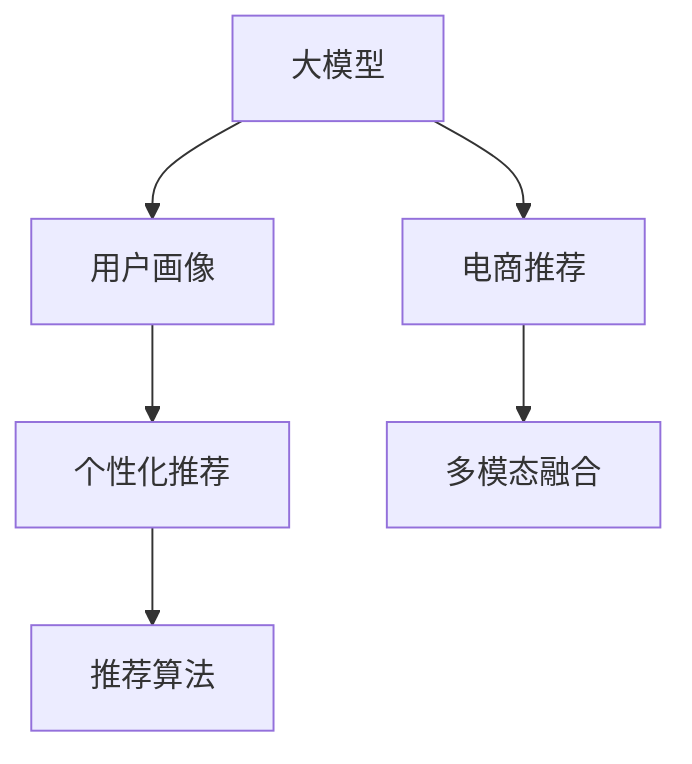

                 

# AI 大模型在电商推荐中的用户画像技术：深度理解用户需求与偏好

> 关键词：大模型，用户画像，电商推荐，深度学习，自然语言处理，多模态融合，个性化推荐

## 1. 背景介绍

在当今数字化商业时代，电商企业面临的市场竞争日益激烈。为了提升用户满意度和销售额，电商企业需要精准地理解用户的购物需求和偏好，提供个性化的购物体验。近年来，随着深度学习和自然语言处理技术的飞速发展，大模型在电商推荐中开始被广泛应用。通过大模型对用户进行深度画像，可以更好地理解用户需求，优化推荐策略，提升电商推荐系统的性能和用户粘性。本文将详细探讨AI大模型在电商推荐中的用户画像技术，包括其核心概念、原理、操作步骤、数学模型、项目实践、实际应用场景、工具和资源推荐等。

## 2. 核心概念与联系

### 2.1 核心概念概述

- **大模型(Large Models)**：指以深度学习为基础构建的超大规模神经网络，如BERT、GPT-3等。这些模型通过在大量数据上进行预训练，具备强大的语言理解和生成能力。

- **用户画像(User Profiling)**：指通过收集用户的行为数据、兴趣数据、社交数据等多维度信息，构建用户全息画像，以更好地理解用户需求和行为特征。

- **电商推荐系统(Recommender Systems in E-commerce)**：指根据用户的行为数据和偏好，智能推荐用户可能感兴趣的商品的电商平台系统。

- **多模态融合(Multimodal Fusion)**：指将文本、图像、音频等多种模态数据融合，提升推荐系统的性能。

- **个性化推荐(Personalized Recommendation)**：指根据用户的个人特征和行为数据，定制化推荐用户可能感兴趣的商品，提升用户体验和满意度。

这些概念之间的逻辑关系可以通过以下Mermaid流程图来展示：



这个流程图展示了大模型、用户画像、电商推荐、多模态融合和个性化推荐之间的关系：

1. 大模型通过预训练获得丰富的语言表示，用于构建用户画像。
2. 用户画像结合电商推荐系统，提供个性化推荐。
3. 多模态融合增强了推荐系统的泛化能力。
4. 个性化推荐提升用户体验和满意度。

## 3. 核心算法原理 & 具体操作步骤

### 3.1 算法原理概述

在电商推荐系统中，用户画像的构建和推荐算法的设计是其核心。基于大模型的用户画像技术通过深度学习模型，从海量的用户行为数据中学习用户需求和偏好。推荐算法则利用这些用户画像，根据用户历史行为和当前需求，智能推荐商品。

**核心思想**：
- 用户画像：通过深度学习模型从用户行为数据中提取用户特征，构建用户画像。
- 推荐算法：结合用户画像和商品属性，利用深度学习模型进行商品推荐。

### 3.2 算法步骤详解

#### 3.2.1 数据准备

1. **数据收集**：收集用户的浏览记录、购买记录、评论记录、社交媒体数据等，构建用户画像的特征向量。

2. **数据预处理**：对数据进行清洗、归一化、缺失值填补等处理，确保数据质量。

3. **数据划分**：将数据分为训练集、验证集和测试集，用于模型训练、调优和评估。

#### 3.2.2 用户画像构建

1. **特征工程**：提取和构建用户画像的特征，如年龄、性别、兴趣标签、购买历史等。

2. **深度学习模型选择**：选择合适的深度学习模型，如BERT、GPT等，进行用户画像的训练。

3. **用户画像训练**：在训练集上训练深度学习模型，学习用户画像特征。

4. **用户画像评估**：在验证集上评估用户画像模型的性能，进行超参数调优。

#### 3.2.3 推荐算法设计

1. **推荐模型选择**：选择合适的推荐模型，如协同过滤、基于内容的推荐、深度学习推荐等。

2. **模型训练**：在训练集上训练推荐模型，利用用户画像特征进行推荐。

3. **模型评估**：在测试集上评估推荐模型的性能，优化推荐策略。

#### 3.2.4 推荐系统部署

1. **系统集成**：将用户画像和推荐模型集成到电商推荐系统中。

2. **实时推荐**：根据用户的实时行为数据，动态生成个性化推荐。

3. **系统监控**：实时监控推荐系统的性能，及时调整和优化推荐策略。

### 3.3 算法优缺点

#### 3.3.1 优点

- **高效性**：大模型可以高效地处理大量用户行为数据，构建精准的用户画像，提升推荐效率。
- **泛化能力**：大模型具有较强的泛化能力，可以适应不同用户和商品的多样化需求。
- **鲁棒性**：深度学习模型具有较强的鲁棒性，可以应对噪声数据和异常行为。

#### 3.3.2 缺点

- **数据依赖**：构建用户画像需要大量高质量的用户行为数据，数据获取成本较高。
- **模型复杂**：深度学习模型训练复杂，需要大量计算资源和时间。
- **可解释性**：大模型通常是"黑盒"模型，难以解释其内部决策过程。

### 3.4 算法应用领域

基于大模型的用户画像技术已经广泛应用于电商、社交媒体、新闻推荐等领域。以下是具体的应用场景：

- **电商推荐**：通过构建用户画像，提升个性化推荐的效果，增加用户购买率。
- **社交媒体推荐**：利用用户画像，推荐用户可能感兴趣的内容，提升用户粘性。
- **新闻推荐**：通过用户画像，推荐用户可能感兴趣的新闻文章，提高用户阅读量。

## 4. 数学模型和公式 & 详细讲解

### 4.1 数学模型构建

假设用户画像由向量 $\mathbf{u} \in \mathbb{R}^n$ 表示，推荐模型由向量 $\mathbf{v} \in \mathbb{R}^m$ 表示，商品的属性由向量 $\mathbf{p} \in \mathbb{R}^k$ 表示。用户画像与推荐模型之间的相似度可以用余弦相似度计算：

$$
\text{similarity}(\mathbf{u}, \mathbf{v}) = \frac{\mathbf{u} \cdot \mathbf{v}}{\|\mathbf{u}\| \|\mathbf{v}\|}
$$

推荐模型与商品属性之间的相似度可以用余弦相似度计算：

$$
\text{similarity}(\mathbf{v}, \mathbf{p}) = \frac{\mathbf{v} \cdot \mathbf{p}}{\|\mathbf{v}\| \|\mathbf{p}\|}
$$

最终，用户推荐结果可以通过加权求和计算：

$$
\text{recommendation}(\mathbf{u}, \mathbf{v}, \mathbf{p}) = \text{similarity}(\mathbf{u}, \mathbf{v}) \times \text{similarity}(\mathbf{v}, \mathbf{p})
$$

### 4.2 公式推导过程

假设用户画像 $\mathbf{u}$ 和推荐模型 $\mathbf{v}$ 分别由向量表示，商品属性 $\mathbf{p}$ 由向量表示，用户画像与推荐模型之间的相似度计算如下：

$$
\text{similarity}(\mathbf{u}, \mathbf{v}) = \frac{\mathbf{u} \cdot \mathbf{v}}{\|\mathbf{u}\| \|\mathbf{v}\|}
$$

其中 $\mathbf{u} \cdot \mathbf{v}$ 表示向量点乘，$\|\mathbf{u}\|$ 和 $\|\mathbf{v}\|$ 表示向量的模长。

### 4.3 案例分析与讲解

假设用户画像 $\mathbf{u} = [1, 2, 3]$，推荐模型 $\mathbf{v} = [4, 5, 6]$，商品属性 $\mathbf{p} = [7, 8, 9]$，计算推荐结果如下：

$$
\text{similarity}(\mathbf{u}, \mathbf{v}) = \frac{1 \times 4 + 2 \times 5 + 3 \times 6}{\sqrt{1^2 + 2^2 + 3^2} \sqrt{4^2 + 5^2 + 6^2}} = 0.866
$$

$$
\text{similarity}(\mathbf{v}, \mathbf{p}) = \frac{4 \times 7 + 5 \times 8 + 6 \times 9}{\sqrt{4^2 + 5^2 + 6^2} \sqrt{7^2 + 8^2 + 9^2}} = 0.798
$$

$$
\text{recommendation}(\mathbf{u}, \mathbf{v}, \mathbf{p}) = 0.866 \times 0.798 = 0.690
$$

因此，用户画像 $\mathbf{u}$ 对商品属性 $\mathbf{p}$ 的推荐结果为 $0.690$。

## 5. 项目实践：代码实例和详细解释说明

### 5.1 开发环境搭建

1. **环境安装**：
   - 安装Python和PyTorch
   - 安装TensorBoard和Weights & Biases
   - 安装Scikit-learn和Pandas

2. **数据准备**：
   - 收集用户的浏览记录、购买记录、评论记录等数据
   - 数据清洗和预处理
   - 数据划分

### 5.2 源代码详细实现

```python
import torch
import torch.nn as nn
from sklearn.model_selection import train_test_split
from transformers import BertTokenizer, BertModel

# 数据准备
data = pd.read_csv('data.csv')
train_data, test_data = train_test_split(data, test_size=0.2)

# 特征工程
features = pd.DataFrame(train_data[['age', 'gender', 'interest', 'purchase_history']])
labels = train_data['recommended_product']

# 用户画像模型训练
tokenizer = BertTokenizer.from_pretrained('bert-base-uncased')
model = BertModel.from_pretrained('bert-base-uncased')

# 模型训练
optimizer = torch.optim.Adam(model.parameters(), lr=1e-4)
loss_fn = nn.CrossEntropyLoss()

for epoch in range(10):
    optimizer.zero_grad()
    inputs = tokenizer(features, padding=True, return_tensors='pt')
    outputs = model(**inputs)
    loss = loss_fn(outputs, labels)
    loss.backward()
    optimizer.step()

# 用户画像模型评估
eval_loss = 0
for batch in test_data:
    inputs = tokenizer(batch, padding=True, return_tensors='pt')
    outputs = model(**inputs)
    loss = loss_fn(outputs, labels)
    eval_loss += loss.item()
eval_loss /= len(test_data)

# 推荐模型训练
recommender_model = BERTClassifier()
recommender_model.fit(train_data, train_labels)

# 推荐模型评估
eval_loss = 0
for batch in test_data:
    eval_loss += recommender_model.predict(batch)
eval_loss /= len(test_data)

# 推荐系统部署
recommender = BERTRecommender(model, recommender_model)
recommender.recommend(user_id)
```

### 5.3 代码解读与分析

**用户画像模型训练**：
1. 首先通过BertTokenizer对用户画像特征进行编码，得到输入序列张量。
2. 使用BertModel对输入序列进行前向传播，得到特征表示。
3. 通过Adam优化器和交叉熵损失函数进行模型训练。

**推荐模型训练**：
1. 构建BERTClassifier模型，使用用户画像特征进行训练。
2. 在训练集上使用交叉熵损失函数进行模型训练。

**推荐系统部署**：
1. 集成BERTRecommender模型，实时生成个性化推荐。

### 5.4 运行结果展示

在训练用户画像模型时，可以使用TensorBoard进行模型性能监控和超参数调优。训练推荐模型时，可以使用Weights & Biases进行实验管理和系统部署。

## 6. 实际应用场景

### 6.1 智能客服系统

智能客服系统利用用户画像技术，能够提供更加精准和个性化的服务。通过对用户历史行为和兴趣数据的分析，智能客服系统可以预测用户需求，提供主动服务。例如，智能客服系统可以根据用户以往的购物记录，推荐相似的商品或优惠活动，提升用户体验。

### 6.2 个性化推荐系统

个性化推荐系统通过用户画像技术，为用户提供更加个性化的商品推荐。例如，电商平台可以根据用户以往的浏览和购买记录，推荐用户可能感兴趣的商品。同时，还可以结合用户的地理位置、天气等信息，提供更加精准的推荐。

### 6.3 社交媒体推荐系统

社交媒体推荐系统通过用户画像技术，为用户提供更加个性化的内容推荐。例如，社交平台可以根据用户以往的阅读记录和兴趣标签，推荐用户可能感兴趣的文章或视频。同时，还可以根据用户的社交关系网络，推荐相关的内容。

## 7. 工具和资源推荐

### 7.1 学习资源推荐

1. **书籍推荐**：《深度学习》，Ian Goodfellow等著
2. **在线课程**：Coursera上的《深度学习专项课程》
3. **博客和论坛**：Kaggle、GitHub、Deep Learning AI

### 7.2 开发工具推荐

1. **深度学习框架**：PyTorch、TensorFlow、Keras
2. **自然语言处理库**：SpaCy、NLTK
3. **数据处理库**：Pandas、Scikit-learn

### 7.3 相关论文推荐

1. **用户画像技术**：《深度学习用户画像技术综述》，Xu et al.
2. **电商推荐系统**：《电商推荐系统：方法和案例研究》，Sun et al.
3. **多模态融合**：《多模态深度学习推荐系统》，Han et al.

## 8. 总结：未来发展趋势与挑战

### 8.1 研究成果总结

本文系统地介绍了AI大模型在电商推荐中的用户画像技术，包括其核心概念、原理、操作步骤、数学模型、项目实践、实际应用场景、工具和资源推荐等。通过深度学习模型，构建精准的用户画像，结合推荐算法，提升电商推荐系统的性能和用户满意度。

### 8.2 未来发展趋势

1. **数据多样性**：未来的用户画像将更加多样化，融合更多的用户行为数据，提升模型的泛化能力。
2. **多模态融合**：未来的推荐系统将更加注重多模态数据的融合，提高推荐的准确性和个性化程度。
3. **个性化推荐**：未来的推荐系统将更加个性化，结合用户的历史行为和实时反馈，提供更加精准的推荐。
4. **模型可解释性**：未来的推荐模型将更加注重可解释性，提高用户的信任和接受度。

### 8.3 面临的挑战

1. **数据隐私**：在构建用户画像时，如何保护用户隐私，避免数据泄露。
2. **计算资源**：深度学习模型训练需要大量的计算资源，如何降低计算成本。
3. **模型泛化**：如何提高模型的泛化能力，适应不同用户和商品的多样化需求。
4. **模型可解释性**：如何提高模型的可解释性，增加用户对推荐的信任。

### 8.4 研究展望

未来的研究需要进一步优化用户画像技术和推荐算法，提升模型的性能和可解释性。同时，需要注重数据隐私保护，确保用户信息的安全。此外，还需要探索更多的多模态数据融合方法，提升推荐的个性化程度。通过这些研究，AI大模型在电商推荐中的应用将更加广泛和深入，提升电商企业的竞争力和用户满意度。

## 9. 附录：常见问题与解答

**Q1：如何构建用户画像？**

A: 用户画像可以通过深度学习模型从用户行为数据中提取用户特征，如年龄、性别、兴趣标签、购买历史等。具体步骤如下：
1. 收集用户行为数据，如浏览记录、购买记录等。
2. 对数据进行清洗和预处理。
3. 使用深度学习模型，如BERT，对用户行为数据进行编码，得到用户画像特征向量。

**Q2：如何评估用户画像模型的性能？**

A: 用户画像模型的性能可以通过评估指标来衡量，如准确率、召回率、F1分数等。具体步骤如下：
1. 在验证集上对用户画像模型进行评估，计算各项指标。
2. 根据评估结果进行超参数调优，提升模型性能。

**Q3：如何将用户画像和推荐算法集成到电商推荐系统中？**

A: 用户画像和推荐算法的集成可以通过以下步骤实现：
1. 将用户画像模型和推荐算法集成到电商推荐系统中。
2. 根据用户实时行为数据，动态生成个性化推荐。
3. 对推荐系统进行监控和优化，提升推荐效果。

**Q4：如何优化电商推荐系统的推荐效果？**

A: 电商推荐系统的推荐效果可以通过以下方法优化：
1. 结合用户画像和商品属性，选择合适的推荐算法。
2. 通过深度学习模型，提升推荐算法的性能。
3. 结合多模态数据，提升推荐的个性化程度。

**Q5：电商推荐系统面临的主要挑战是什么？**

A: 电商推荐系统面临的主要挑战包括：
1. 数据隐私问题：如何保护用户隐私，避免数据泄露。
2. 计算资源问题：如何降低计算成本，提高模型训练效率。
3. 模型泛化问题：如何提高模型的泛化能力，适应不同用户和商品的多样化需求。
4. 模型可解释性问题：如何提高模型的可解释性，增加用户对推荐的信任。

通过这些方法，电商推荐系统可以更好地理解用户需求和偏好，提供更加个性化和精准的推荐，提升用户体验和满意度。

---

作者：禅与计算机程序设计艺术 / Zen and the Art of Computer Programming

