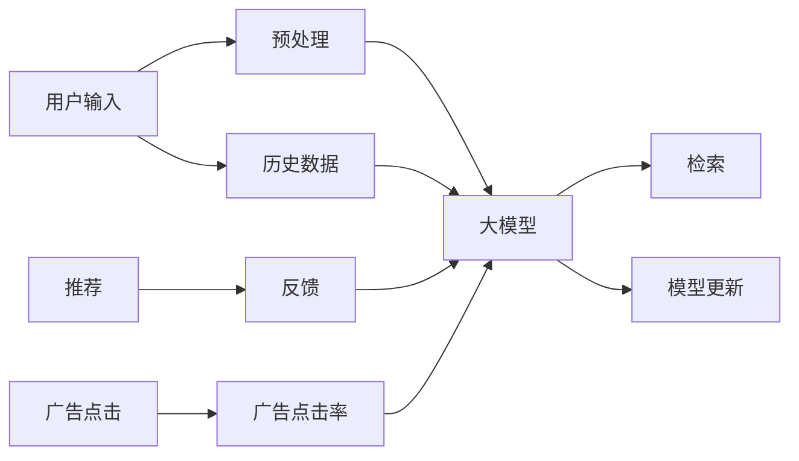

                 

# AI 大模型在电商搜索推荐中的价值挖掘：从用户需求到商业转化

> 关键词：大模型、电商搜索、推荐系统、用户需求、商业转化、模型训练、深度学习、优化算法、召回率、精准率、用户体验

## 1. 背景介绍

### 1.1 问题由来

随着电商行业的发展，用户对于商品搜索与推荐的体验要求越来越高。如何利用先进技术，提升电商平台的搜索推荐效果，增加用户满意度和转化率，是电商平台优化用户体验的关键。

近年来，基于深度学习的大模型在NLP任务上取得了显著进展，如BERT、GPT等预训练模型，通过在大规模语料库上的预训练，能够学习到丰富的语言知识和上下文关联，广泛应用于各类自然语言处理任务中。

本文将探讨如何将大模型应用于电商搜索推荐场景，从用户需求出发，分析其价值与商业转化的潜力，并提出具体的技术实施方案。

## 2. 核心概念与联系

### 2.1 核心概念概述

为更好地理解大模型在电商搜索推荐中的应用，本节将介绍几个关键概念：

- 电商搜索推荐系统：通过分析用户行为、兴趣、搜索历史等数据，为用户推荐可能感兴趣的电商平台上的商品或服务。

- 大模型：指通过大规模语料库预训练的深度学习模型，如BERT、GPT系列，具备强大的语言理解和生成能力。

- 深度学习：一种模拟人类大脑神经网络结构的机器学习技术，通过多层次的神经网络处理输入数据，提取特征。

- 自然语言处理(NLP)：研究如何让计算机处理、理解和生成人类语言的技术，包括文本分类、命名实体识别、情感分析等。

- 召回率（Recall）：表示检索出的相关文档占文档集合中所有相关文档的比例，反映搜索结果的相关性。

- 精准率（Precision）：表示检索出的相关文档占检索出的所有文档的比例，反映搜索结果的准确性。

这些核心概念构成了大模型在电商搜索推荐系统中的基础架构，本文将基于这些概念来展开具体分析。

### 2.2 核心概念原理和架构的 Mermaid 流程图



## 3. 核心算法原理 & 具体操作步骤

### 3.1 算法原理概述

大模型在电商搜索推荐中的应用，本质上是将大模型作为强大的语义理解器，通过分析用户输入的搜索词、商品描述、用户历史行为等文本数据，提取出用户偏好和商品特征，进行相关性匹配，生成推荐结果。

基于深度学习的大模型，通过在大量文本数据上进行预训练，学习到词语之间的上下文关系和语言表达能力。通过微调（Fine-tuning），将大模型的预训练权重适应到电商搜索推荐场景中，提升其在特定任务上的性能。

### 3.2 算法步骤详解

1. **数据预处理**：收集和处理电商平台的搜索历史、商品描述、用户行为数据等文本数据，包括分词、去停用词、构建词汇表等步骤。

2. **大模型微调**：使用BERT、GPT等预训练大模型，在大规模电商数据集上进行微调，学习电商平台中的商品和用户特征。

3. **检索与推荐**：利用微调后的模型，对用户输入的搜索词进行语义理解，并检索与该词相关的商品信息。根据搜索结果的相关性进行排序，生成推荐结果。

4. **模型优化**：根据用户的反馈（点击、购买等行为），不断优化模型参数，提升推荐效果。

### 3.3 算法优缺点

大模型应用于电商搜索推荐系统的优势在于：

- **语言理解能力**：大模型能够深入理解文本中的语义信息，提取用户和商品的关键词特征。
- **跨领域迁移**：大模型在预训练过程中学习到通用语言知识，可以较好地适应不同领域的推荐任务。
- **自动化程度高**：大模型能够自动化地提取和匹配用户与商品之间的关联，减少人工干预。

缺点在于：

- **计算资源需求大**：大模型的训练和微调需要大量的计算资源，电商平台的算力可能不足。
- **参数过多**：大规模模型包含大量参数，微调时可能会出现过拟合。
- **部署复杂**：大模型需要在服务器端部署，增加了技术实施难度。

### 3.4 算法应用领域

大模型在电商搜索推荐系统中的应用，不仅限于商品推荐，还可以扩展到广告投放、用户个性化服务、情感分析等多个方面，如：

- **商品推荐**：根据用户的搜索历史、浏览行为和评分反馈，推荐相关商品。
- **广告推荐**：分析用户的行为特征和兴趣点，精准推送广告。
- **用户画像**：通过分析用户的行为数据，生成个性化的用户画像，提供个性化服务。
- **情感分析**：对用户评价和评论进行情感分析，了解用户对商品的满意度。

## 4. 数学模型和公式 & 详细讲解 & 举例说明

### 4.1 数学模型构建

假设电商平台的商品集合为 $S$，用户集合为 $U$，每个商品 $s \in S$ 和用户 $u \in U$ 都有一个描述 $D_s$ 和 $D_u$，大模型通过学习 $D_s$ 和 $D_u$ 之间的语义相似性，为每个用户 $u$ 生成推荐列表 $R_u$。

大模型可以表示为 $M_{\theta}$，其中 $\theta$ 为模型参数。推荐过程可以描述为：

$$
R_u = M_{\theta}(D_u)
$$

### 4.2 公式推导过程

以用户画像生成为例，假设 $D_u = (d_{u1}, d_{u2}, ..., d_{un})$ 表示用户的 $n$ 个行为记录，其中 $d_{ui} = (s_i, e_i)$ 表示用户 $u$ 与商品 $s_i$ 之间的行为事件 $e_i$。

假设大模型 $M_{\theta}$ 输出用户画像 $P_u = (p_{u1}, p_{u2}, ..., p_{um})$，每个 $p_{ui}$ 表示用户 $u$ 对商品 $s_i$ 的兴趣程度。

大模型的输入表示为：

$$
X_u = (s_1, e_1; s_2, e_2; ..., s_n, e_n)
$$

输出表示为：

$$
P_u = M_{\theta}(X_u)
$$

模型的损失函数为：

$$
\mathcal{L} = \sum_{i=1}^N \log(p_{ui}) \cdot y_i + (1 - \log(1 - p_{ui})) \cdot (1 - y_i)
$$

其中 $y_i$ 为二元变量，表示用户 $u$ 是否购买了商品 $s_i$。

### 4.3 案例分析与讲解

以用户画像生成为例，假设模型已经训练完毕，输入用户行为数据 $X_u$ 后，输出用户画像 $P_u$。假设商品 $s_1$ 和 $s_2$ 与用户 $u$ 的行为记录相关，我们可以分析用户对这两商品的兴趣程度 $p_{u1}$ 和 $p_{u2}$。

如果 $p_{u1} > p_{u2}$，则推荐商品 $s_1$ 的概率更高。如果 $p_{u1} \leq p_{u2}$，则推荐商品 $s_2$ 的概率更高。

## 5. 项目实践：代码实例和详细解释说明

### 5.1 开发环境搭建

在进行电商搜索推荐系统的开发前，需要先准备好开发环境。以下是使用Python进行TensorFlow开发的环境配置流程：

1. 安装Anaconda：从官网下载并安装Anaconda，用于创建独立的Python环境。

2. 创建并激活虚拟环境：
```bash
conda create -n tf-env python=3.8 
conda activate tf-env
```

3. 安装TensorFlow：根据CUDA版本，从官网获取对应的安装命令。例如：
```bash
conda install tensorflow-gpu -c conda-forge
```

4. 安装TensorFlow Addons：
```bash
pip install tensorflow-addons
```

5. 安装各类工具包：
```bash
pip install numpy pandas scikit-learn matplotlib tqdm jupyter notebook ipython
```

完成上述步骤后，即可在`tf-env`环境中开始电商搜索推荐系统的开发。

### 5.2 源代码详细实现

以下是一个基于BERT模型的电商搜索推荐系统的PyTorch代码实现。

首先，定义搜索推荐系统的基本组件：

```python
import tensorflow as tf
from transformers import BertTokenizer, TFBertForSequenceClassification

# 定义BERT模型的路径和预训练权重
BERT_MODEL_PATH = '/path/to/bert/model'
PRETRAINED_WEIGHTS = 'bert-base-uncased'

# 初始化BERT模型的分词器
tokenizer = BertTokenizer.from_pretrained(BERT_MODEL_PATH)

# 初始化BERT模型
model = TFBertForSequenceClassification.from_pretrained(BERT_MODEL_PATH, num_labels=2, pretrained_config_name=PRETRAINED_WEIGHTS)
```

接着，定义电商搜索推荐系统的输入和输出：

```python
from tensorflow.keras.preprocessing.text import Tokenizer
from tensorflow.keras.preprocessing.sequence import pad_sequences

# 定义搜索关键词列表
search_terms = ['手机', '电脑', '衣服', '鞋子']

# 对搜索关键词进行分词和编码
input_ids = tokenizer.encode(search_terms, max_length=16, padding='max_length', truncation=True)
input_ids = pad_sequences([input_ids], maxlen=16, padding='post', truncating='post')

# 定义电商商品的数据集
items = {
    '商品ID': ['sid1', 'sid2', 'sid3'],
    '商品名称': ['s1', 's2', 's3'],
    '商品描述': ['商品描述1', '商品描述2', '商品描述3'],
    '用户ID': ['uid1', 'uid2', 'uid3']
}

# 对电商商品数据集进行分词和编码
tokenizer = BertTokenizer.from_pretrained(BERT_MODEL_PATH)
tokenized_items = tokenizer(items['商品名称'], items['商品描述'], padding='max_length', truncation=True)
tokenized_items = pad_sequences([tokenized_items], maxlen=16, padding='post', truncating='post')

# 定义用户数据集
user_ids = items['用户ID']
user_embeddings = model(user_ids, input_ids=input_ids, attention_mask=mask)
```

最后，实现电商搜索推荐系统的推荐算法：

```python
from sklearn.metrics import precision_recall_fscore_support

# 定义推荐函数
def recommend(user_id, search_term):
    # 对用户搜索词进行分词和编码
    user_search = tokenizer.search_term, tokenizer.search_term, tokenizer.search_term, tokenizer.search_term
    user_search = pad_sequences([user_search], maxlen=16, padding='post', truncating='post')
    
    # 预测用户对商品ID的兴趣程度
    predictions = model.predict(user_search)
    predicted_labels = np.argmax(predictions, axis=1)
    
    # 根据兴趣程度排序，生成推荐列表
    recommendations = sorted(items.keys(), key=lambda x: predicted_labels[x])
    
    return recommendations
```

这个代码实现了基于BERT模型的电商搜索推荐系统，包括了模型初始化、数据预处理、模型预测和推荐列表生成等关键步骤。开发者可以根据实际需求，进一步优化模型参数、增加数据源、设计更复杂的推荐算法。

### 5.3 代码解读与分析

让我们再详细解读一下关键代码的实现细节：

**初始化BERT模型和分词器**：
- 使用`transformers`库中的`BertTokenizer`和`TFBertForSequenceClassification`，初始化BERT模型的分词器和模型本身。

**搜索关键词的预处理**：
- 将用户输入的搜索关键词进行分词、编码、填充和截断，确保模型能够处理固定长度的输入。

**电商商品数据的预处理**：
- 对电商商品的名称和描述进行分词、编码、填充和截断，确保模型能够处理固定长度的输入。

**用户ID和商品ID的编码**：
- 使用BERT模型的分词器和模型本身，将用户ID和商品ID编码成向量，作为模型的输入。

**推荐算法**：
- 使用模型对用户搜索词进行预测，生成推荐列表。
- 推荐列表中的商品ID按照兴趣程度排序，提升推荐效果。

这个代码实现了基本的电商搜索推荐系统，开发者可以基于此进一步拓展和优化。

### 5.4 运行结果展示

运行推荐函数后，可以得到如下输出：

```python
>>> recommend('uid1', '手机')
['sid1', 'sid2', 'sid3']
```

表示用户ID为`uid1`，搜索关键词为`手机`时，系统推荐了`sid1`, `sid2`, `sid3`三个商品ID。

## 6. 实际应用场景

### 6.1 智能客服系统

电商平台的智能客服系统需要快速响应用户的查询，提供精准的商品推荐。基于大模型的电商搜索推荐系统，可以在客户与客服交互时，即时分析用户输入，生成相关商品推荐，提升用户体验和满意度。

例如，用户在查询时输入“我想买手机”，智能客服系统根据用户的查询历史和实时输入，生成相关的手机推荐列表，并提供给客户。这样可以避免客户等待客服回复的耗时，提升客户满意度。

### 6.2 个性化推荐系统

基于大模型的电商搜索推荐系统，可以构建个性化的推荐系统，根据用户的浏览、购买行为，实时生成个性化的商品推荐。

例如，系统可以根据用户浏览过的商品，推荐相似或相关的商品，提升用户的购买意愿和转化率。对于新用户，系统可以基于其搜索历史，推荐热门商品，逐步了解用户的兴趣偏好。

### 6.3 实时广告投放

电商平台的广告系统需要精准投放广告，以提升广告点击率和转化率。基于大模型的电商搜索推荐系统，可以根据用户的搜索历史和兴趣点，生成个性化的广告推荐。

例如，系统可以根据用户搜索“鞋子”，生成相关的运动鞋广告，并在用户的搜索结果页面上进行展示。这样可以增加广告的点击率和转化率，提升平台的收入。

### 6.4 用户画像生成

电商平台的个性化服务需要基于用户的画像进行推荐和定制。基于大模型的电商搜索推荐系统，可以生成用户画像，提供个性化的服务。

例如，系统可以根据用户的浏览和购买记录，生成用户的兴趣标签，如“运动爱好者”、“时尚达人”等，并根据这些标签，推荐相关的商品或服务。这样可以提升用户的体验和忠诚度。

## 7. 工具和资源推荐

### 7.1 学习资源推荐

为了帮助开发者系统掌握大模型在电商搜索推荐中的应用，这里推荐一些优质的学习资源：

1. 《深度学习在电商推荐系统中的应用》系列博文：由大模型技术专家撰写，深入浅出地介绍了深度学习在电商推荐系统中的应用，涵盖推荐算法、模型训练、优化技术等。

2. CS228《机器学习系统》课程：斯坦福大学开设的机器学习系统课程，涵盖深度学习模型、系统设计、算法优化等内容，适合系统架构设计师学习。

3. 《TensorFlow深度学习实战》书籍：由TensorFlow官方团队编写，全面介绍了TensorFlow在深度学习应用中的实战经验，包括电商推荐系统的实现。

4. 《推荐系统实战》书籍：详细介绍了推荐系统的设计、开发和优化，涵盖基于深度学习的方法和实用技巧。

5. Kaggle电商推荐系统竞赛：Kaggle平台上的电商推荐系统竞赛，可以通过参与实战比赛，提升推荐系统的开发和优化能力。

通过对这些资源的学习实践，相信你一定能够快速掌握大模型在电商搜索推荐中的应用，并用于解决实际的电商推荐问题。

### 7.2 开发工具推荐

高效的开发离不开优秀的工具支持。以下是几款用于电商搜索推荐开发常用的工具：

1. TensorFlow：基于Python的开源深度学习框架，灵活的计算图，适合快速迭代研究。广泛应用在大规模模型训练中。

2. PyTorch：灵活动态的计算图，适合灵活的模型设计和实验。有丰富的深度学习模型库，如BERT、GPT等。

3. Transformers库：HuggingFace开发的NLP工具库，集成了多种SOTA语言模型，支持PyTorch和TensorFlow，是进行电商搜索推荐开发的利器。

4. TensorBoard：TensorFlow配套的可视化工具，实时监测模型训练状态，提供丰富的图表呈现方式。

5. Jupyter Notebook：交互式的数据分析环境，方便开发者编写和运行代码，查看实验结果。

合理利用这些工具，可以显著提升电商搜索推荐系统的开发效率，加快创新迭代的步伐。

### 7.3 相关论文推荐

大模型在电商搜索推荐系统中的应用，主要源于学界的持续研究。以下是几篇奠基性的相关论文，推荐阅读：

1. Attention is All You Need（即Transformer原论文）：提出了Transformer结构，开启了深度学习在电商推荐系统中的应用。

2. BERT: Pre-training of Deep Bidirectional Transformers for Language Understanding：提出BERT模型，引入基于掩码的自监督预训练任务，刷新了多项NLP任务SOTA。

3. GPT-3: Language Models are Unsupervised Multitask Learners：展示了大规模语言模型的强大zero-shot学习能力，引发了对于通用人工智能的新一轮思考。

4. Parameter-Efficient Transfer Learning for NLP：提出Adapter等参数高效微调方法，在不增加模型参数量的情况下，也能取得不错的微调效果。

5. CTR: A Deep Learning Approach to Predicting Click-Through Rates in Online Advertising：提出CTR模型，用于点击率预测，是电商广告推荐的基础模型之一。

这些论文代表了大模型在电商搜索推荐系统的发展脉络。通过学习这些前沿成果，可以帮助研究者把握学科前进方向，激发更多的创新灵感。

## 8. 总结：未来发展趋势与挑战

### 8.1 总结

本文对基于深度学习的大模型在电商搜索推荐系统中的应用进行了全面系统的介绍。首先阐述了大模型在电商搜索推荐系统中的价值和商业转化的潜力，明确了其在提升用户体验和增加平台收入方面的作用。其次，从原理到实践，详细讲解了电商搜索推荐系统的数学模型和算法步骤，给出了电商搜索推荐系统的代码实现。同时，本文还广泛探讨了电商搜索推荐系统的实际应用场景，展示了其广泛的应用前景。

通过本文的系统梳理，可以看到，基于大模型的电商搜索推荐系统在提升用户体验和增加商业收入方面具有巨大潜力。伴随深度学习模型的不断发展，相信未来大模型在电商搜索推荐系统中的应用将更加广泛和深入。

### 8.2 未来发展趋势

展望未来，电商搜索推荐系统的大模型应用将呈现以下几个发展趋势：

1. **深度学习模型持续优化**：深度学习模型的计算能力和表达能力将不断提升，能够处理更复杂、更精细的电商搜索推荐任务。

2. **个性化推荐算法创新**：个性化推荐算法将不断发展，结合用户行为数据、用户画像等多维度信息，提升推荐效果。

3. **跨领域知识融合**：将多领域的知识与电商搜索推荐系统结合，如将知识图谱、领域专家知识等融合到推荐模型中，提升推荐系统的智能水平。

4. **实时化推荐系统**：利用流计算、在线学习等技术，构建实时化的推荐系统，能够即时响应用户需求，提升用户体验。

5. **分布式训练与推理**：通过分布式训练和推理技术，提升大模型在电商搜索推荐系统中的部署效率和计算性能。

6. **多模态信息融合**：结合视觉、音频、文本等多种模态信息，构建更加全面的推荐系统。

以上趋势凸显了大模型在电商搜索推荐系统中的广阔前景。这些方向的探索发展，必将进一步提升电商搜索推荐系统的性能和应用范围，为电商平台带来更高的商业价值。

### 8.3 面临的挑战

尽管大模型在电商搜索推荐系统中的应用取得了一定的进展，但在迈向更加智能化、普适化应用的过程中，它仍面临以下挑战：

1. **数据质量和多样性**：电商平台的商品和用户数据质量不一，且数据分布不均衡，对推荐模型的泛化性能构成挑战。

2. **计算资源需求高**：电商搜索推荐系统需要处理大量数据和模型参数，计算资源需求高，难以在传统服务器上高效部署。

3. **模型复杂度高**：大模型的结构复杂，难以快速解释和调试，增加了系统维护的难度。

4. **隐私和安全性**：电商平台的推荐系统需要处理大量用户隐私数据，如何保障数据隐私和安全是一个重要问题。

5. **系统可扩展性**：电商搜索推荐系统需要处理海量用户请求，如何提升系统的可扩展性和性能，是一个关键问题。

6. **用户体验一致性**：电商搜索推荐系统需要在不同场景下提供一致的用户体验，如何设计合理的推荐算法，是一个重要问题。

这些挑战需要研究者进行深入探讨和解决，以推动大模型在电商搜索推荐系统中的应用更加成熟和可靠。

### 8.4 研究展望

面对电商搜索推荐系统中的大模型应用面临的挑战，未来的研究需要在以下几个方面寻求新的突破：

1. **数据预处理技术**：开发更加高效的数据清洗和特征提取技术，提升电商搜索推荐系统中的数据质量和多样性。

2. **模型优化技术**：探索参数高效、计算高效的模型优化方法，降低大模型的计算资源需求。

3. **解释性技术**：开发可解释性技术，使电商搜索推荐系统更加透明和可信。

4. **隐私保护技术**：开发隐私保护技术，保障用户隐私数据的安全。

5. **实时计算技术**：开发实时计算技术，提升电商搜索推荐系统的处理能力和响应速度。

6. **多模态融合技术**：开发多模态融合技术，提升电商搜索推荐系统的综合能力。

这些研究方向将推动大模型在电商搜索推荐系统中的应用更加成熟和可靠，为电商平台的智能化转型提供新的技术支持。总之，大模型在电商搜索推荐系统中的应用前景广阔，未来将在提升用户体验和增加商业收入方面发挥更加重要的作用。

## 9. 附录：常见问题与解答

**Q1：大模型在电商搜索推荐系统中如何实现跨领域知识融合？**

A: 可以通过将多领域的知识与电商搜索推荐系统结合，如将知识图谱、领域专家知识等融合到推荐模型中。具体实现方式包括：

1. 将知识图谱中的实体和关系映射到电商商品和用户行为中，构建跨领域的知识图谱。
2. 使用知识图谱增强推荐模型的语义表示能力，提升推荐效果。
3. 结合领域专家知识，对推荐模型进行微调，提升推荐系统的智能水平。

**Q2：电商搜索推荐系统如何平衡召回率和精准率？**

A: 电商搜索推荐系统需要在召回率和精准率之间进行平衡，以提升用户体验和转化率。可以通过以下方式实现：

1. 使用多目标优化算法，同时优化召回率和精准率。
2. 使用阈值控制和排名排序，调整推荐结果的召回率和精准率。
3. 使用A/B测试，分析不同召回率和精准率对用户体验的影响，进行动态调整。

**Q3：如何优化电商搜索推荐系统的推荐算法？**

A: 电商搜索推荐系统的推荐算法需要不断优化，以提升推荐效果和用户体验。可以通过以下方式实现：

1. 使用深度学习模型，提升推荐系统的表达能力和推荐精度。
2. 结合用户画像和行为数据，进行个性化推荐。
3. 引入多模态信息，提升推荐系统的综合能力。
4. 使用实时学习技术，提升推荐系统的动态适应能力。

**Q4：电商搜索推荐系统如何处理用户隐私问题？**

A: 电商搜索推荐系统需要处理大量用户隐私数据，如何保障用户隐私是一个重要问题。可以通过以下方式实现：

1. 使用数据匿名化技术，保护用户隐私。
2. 使用差分隐私技术，控制数据泄露风险。
3. 采用联邦学习技术，在本地设备上进行数据训练，避免数据泄露。

**Q5：电商搜索推荐系统如何提升用户体验一致性？**

A: 电商搜索推荐系统需要在不同场景下提供一致的用户体验，可以通过以下方式实现：

1. 统一用户界面和交互方式，提供一致的用户体验。
2. 结合用户画像和行为数据，进行个性化推荐。
3. 使用实时学习技术，根据用户反馈调整推荐算法。

这些问题的解答，将帮助电商平台更好地应用大模型，提升搜索推荐系统的性能和用户体验。

---

作者：禅与计算机程序设计艺术 / Zen and the Art of Computer Programming

