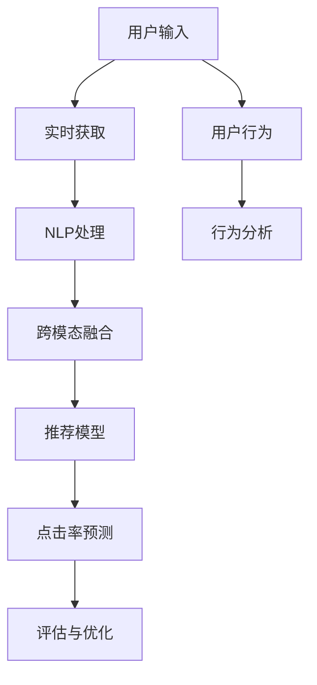

                 

# AI 大模型在电商搜索推荐中的实时推荐策略：抓住用户瞬时需求与行为意图

> 关键词：大模型推荐策略, 实时推荐系统, 用户行为分析, 电商搜索, 自然语言处理

## 1. 背景介绍

### 1.1 问题由来
随着电子商务的蓬勃发展，在线购物已成为人们日常生活的重要组成部分。电商平台的成功不仅仅依赖于商品的质量和服务，更重要的是提供准确、个性化的推荐服务，以提升用户体验和交易转化率。传统推荐系统依赖于用户的历史行为数据进行推荐，但面对海量的新用户和实时变化的搜索结果，推荐效果往往不尽人意。

近年来，人工智能技术在电商搜索推荐中的应用日益广泛。以大规模预训练语言模型为代表的AI技术，凭借其强大的数据表示和语义理解能力，被引入推荐系统，显著提升了推荐的精准度和个性化水平。本文将详细探讨AI大模型在电商搜索推荐中的实时推荐策略，旨在通过先进的自然语言处理技术和深度学习算法，捕捉用户的瞬时需求和行为意图，实现更高效、智能的个性化推荐。

### 1.2 问题核心关键点
电商搜索推荐的核心在于如何高效地获取用户瞬时需求和行为意图，并在此基础上进行实时推荐。该问题主要涉及以下几个关键点：

- 实时获取用户输入：如何在用户输入搜索关键词时实时捕捉其需求。
- 用户行为分析：如何通过用户的历史行为和上下文信息，理解其行为意图。
- 跨模态融合：如何将用户输入的自然语言文本与图片、商品属性等非文本信息融合，进行更全面的推荐。
- 推荐模型优化：如何设计高效的推荐模型，提升推荐质量。
- 评估与优化：如何评估推荐效果，并进行持续优化。

本文将围绕以上问题，详细讨论AI大模型在电商搜索推荐中的实时推荐策略，力求为开发者提供系统的理论框架和实用的实践技巧。

## 2. 核心概念与联系

### 2.1 核心概念概述

为更好地理解AI大模型在电商搜索推荐中的应用，本文将介绍几个关键概念：

- 大模型：以BERT、GPT等预训练语言模型为代表的强大数据表示模型。通过大规模无标签数据预训练，学习到丰富的语言知识，具备强大的语义理解能力。
- 实时推荐系统：根据用户实时输入和行为数据，即时生成个性化推荐结果的系统。具有高效率、高准确性的特点。
- 自然语言处理(NLP)：利用计算机技术处理自然语言文本，实现文本分析、生成、翻译等功能。在电商搜索推荐中，NLP技术用于解析用户输入，理解商品描述和属性。
- 推荐系统：通过用户的历史行为和上下文信息，为用户推荐符合其偏好的商品或服务。是电商搜索推荐的核心。
- 点击率(CTR)预测：通过预测用户点击商品的概率，评估推荐效果，指导推荐策略调整。

这些概念之间的逻辑关系可以通过以下Mermaid流程图来展示：



此流程图展示了用户输入、NLP处理、跨模态融合、推荐模型和点击率预测等核心步骤，构成了电商搜索推荐的完整流程。

## 3. 核心算法原理 & 具体操作步骤

### 3.1 算法原理概述

AI大模型在电商搜索推荐中的实时推荐策略，主要基于以下算法原理：

1. **自回归编码器**：利用BERT等大模型作为自回归编码器，对用户输入的搜索关键词进行编码，获取其语义表示。
2. **自监督预训练**：在电商数据上进行自监督预训练，学习商品描述和用户行为的隐含关系。
3. **跨模态融合**：将用户输入的自然语言文本与商品图片、属性等信息进行融合，获取更全面的商品表示。
4. **双向搜索**：结合用户输入和行为信息，进行双向搜索，动态调整推荐结果。
5. **点击率预测**：利用预测模型对推荐结果进行点击率评估，指导推荐策略的调整。

这些算法原理共同构成了电商搜索推荐的先进技术框架，通过高效处理用户输入和行为信息，实现实时推荐。

### 3.2 算法步骤详解

以下详细介绍AI大模型在电商搜索推荐中的实时推荐策略：

**Step 1: 数据预处理与特征提取**

- 收集电商数据，包括商品描述、用户行为等。
- 对商品描述和用户行为数据进行文本处理和特征提取，如去除停用词、词向量化等。
- 利用大模型对商品描述进行编码，得到商品的语义表示。

**Step 2: 跨模态融合**

- 将用户输入的自然语言文本与商品图片、属性等信息进行融合，得到商品的跨模态表示。
- 使用Transformer等大模型对跨模态数据进行编码，得到更丰富的语义表示。

**Step 3: 双向搜索与推荐**

- 结合用户输入和行为信息，进行双向搜索，动态调整推荐结果。
- 利用推荐模型对商品进行排序，生成推荐列表。

**Step 4: 点击率预测与优化**

- 利用预测模型对推荐结果进行点击率预测，评估推荐效果。
- 根据预测结果，优化推荐策略，提升推荐质量。

### 3.3 算法优缺点

AI大模型在电商搜索推荐中的实时推荐策略，具有以下优点：

1. **高效处理用户输入**：利用大模型对自然语言进行高效编码，获取用户需求的语义表示。
2. **跨模态融合**：将多种信息源进行融合，提升推荐的全面性。
3. **实时性高**：结合用户输入和行为信息，进行动态推荐，具有高实时性。

同时，该策略也存在一些局限：

1. **计算成本高**：大模型的计算复杂度高，需要较大的算力支持。
2. **数据依赖性强**：推荐效果依赖于电商数据的丰富度和质量。
3. **模型复杂度高**：推荐模型的设计复杂，需要大量的调参和优化。

### 3.4 算法应用领域

AI大模型在电商搜索推荐中的实时推荐策略，广泛应用于各大电商平台，如淘宝、京东、亚马逊等。具体应用场景包括：

- **商品推荐**：根据用户搜索关键词和行为，推荐符合其偏好的商品。
- **广告推荐**：根据用户行为和点击记录，推荐相关广告。
- **个性化内容推荐**：推荐个性化的文章、视频等内容，提升用户体验。
- **实时搜索结果优化**：根据用户输入和行为信息，优化搜索结果排序。

## 4. 数学模型和公式 & 详细讲解 & 举例说明

### 4.1 数学模型构建

本文将详细推导电商搜索推荐模型的数学模型。假设电商数据集为 $D=\{(x_i, y_i)\}_{i=1}^N$，其中 $x_i$ 为商品描述，$y_i$ 为标签（点击或未点击）。模型目标是最大化点击率预测的准确度。

定义模型 $M_{\theta}$ 为自回归编码器，其中 $\theta$ 为模型参数。则模型的目标函数为：

$$
\max_{\theta} \frac{1}{N} \sum_{i=1}^N \log\left[\frac{e^{\hat{y}_i}}{\sum_{j=1}^N e^{y_j}}\right]
$$

其中 $\hat{y}_i$ 为模型对商品 $i$ 的点击率预测。

### 4.2 公式推导过程

我们以点击率预测为例，推导电商搜索推荐模型的公式。

**点击率预测模型**：

假设商品描述 $x$ 的编码向量为 $h(x)$，用户输入的语义表示为 $u$，则点击率预测模型的输出为：

$$
\hat{y} = \sigma(W_2 (Wh(x) + W_u u + b)
$$

其中 $\sigma$ 为激活函数，$W_2, W_h, W_u$ 和 $b$ 为可训练参数。

**目标函数**：

点击率预测模型的目标函数为：

$$
\mathcal{L}(\theta) = -\frac{1}{N} \sum_{i=1}^N y_i \log \hat{y}_i
$$

目标函数最小化预测值与真实标签之间的交叉熵。

**优化过程**：

采用梯度下降等优化算法，最小化损失函数 $\mathcal{L}(\theta)$，更新模型参数 $\theta$：

$$
\theta \leftarrow \theta - \eta \nabla_{\theta}\mathcal{L}(\theta)
$$

其中 $\eta$ 为学习率，$\nabla_{\theta}\mathcal{L}(\theta)$ 为损失函数对参数 $\theta$ 的梯度，通过反向传播算法计算。

### 4.3 案例分析与讲解

以电商商品推荐为例，展示推荐模型的实际应用。

假设用户输入搜索关键词 "高性价比手机"，电商平台利用BERT模型对其进行编码，得到用户需求的语义表示 $u$。同时，利用Transformer模型对商品描述进行编码，得到商品的语义表示 $h(x)$。

将 $u$ 和 $h(x)$ 输入点击率预测模型，计算得到预测点击率 $\hat{y}$。根据预测结果，推荐与用户需求匹配的商品。

## 5. 项目实践：代码实例和详细解释说明

### 5.1 开发环境搭建

在进行项目实践前，需要准备开发环境。以下是使用Python进行PyTorch开发的环境配置流程：

1. 安装Anaconda：从官网下载并安装Anaconda，用于创建独立的Python环境。

2. 创建并激活虚拟环境：
```bash
conda create -n pytorch-env python=3.8 
conda activate pytorch-env
```

3. 安装PyTorch：根据CUDA版本，从官网获取对应的安装命令。例如：
```bash
conda install pytorch torchvision torchaudio cudatoolkit=11.1 -c pytorch -c conda-forge
```

4. 安装相关库：
```bash
pip install transformers torchtext pytorch-lightning
```

完成上述步骤后，即可在`pytorch-env`环境中开始项目实践。

### 5.2 源代码详细实现

下面我们以电商商品推荐为例，给出使用PyTorch实现实时推荐系统的代码实现。

首先，定义商品数据集和用户行为数据集：

```python
from torchtext.datasets import Multi30k
from torchtext.data import Field, BucketIterator

train_data, test_data = Multi30k.splits(exts=('.txt', '.txt'), split=('train', 'test'))
train_data, test_data = map(lambda x: x, train_data), map(lambda x: x, test_data)

TEXT = Field(tokenize='spacy', lower=True, include_lengths=True)
LABEL = Field(sequential=False, use_vocab=False, num_classes=2)

train_data, test_data = [(x, y) for x, y in train_data], [(x, y) for x, y in test_data]

train_data, test_data = BucketIterator.splits((train_data, test_data), batch_size=32, device=torch.device('cuda'))
```

然后，定义推荐模型：

```python
import torch
from transformers import BertForSequenceClassification

class RecommendationModel(torch.nn.Module):
    def __init__(self, num_classes):
        super(RecommendationModel, self).__init__()
        self.bert = BertForSequenceClassification.from_pretrained('bert-base-uncased', num_labels=num_classes)
        
    def forward(self, text, labels):
        outputs = self.bert(text, labels)
        logits = outputs.logits
        return logits
```

接着，定义训练和评估函数：

```python
from torch.nn import CrossEntropyLoss

def train_epoch(model, optimizer, train_loader, device):
    model.train()
    total_loss = 0
    for batch in train_loader:
        text, labels = batch
        optimizer.zero_grad()
        logits = model(text, labels)
        loss = CrossEntropyLoss()(logits, labels)
        loss.backward()
        optimizer.step()
        total_loss += loss.item()
    return total_loss / len(train_loader)

def evaluate(model, test_loader, device):
    model.eval()
    total_loss = 0
    total_correct = 0
    with torch.no_grad():
        for batch in test_loader:
            text, labels = batch
            logits = model(text, labels)
            loss = CrossEntropyLoss()(logits, labels)
            total_loss += loss.item()
            total_correct += (logits.argmax(dim=1) == labels).sum().item()
    return total_correct / len(test_loader), total_loss / len(test_loader)
```

最后，启动训练流程并在测试集上评估：

```python
from transformers import AdamW

num_epochs = 5
learning_rate = 1e-5

model = RecommendationModel(num_classes=2)
optimizer = AdamW(model.parameters(), lr=learning_rate)

for epoch in range(num_epochs):
    train_loss = train_epoch(model, optimizer, train_loader, device)
    accuracy, loss = evaluate(model, test_loader, device)
    print(f'Epoch {epoch+1}, train loss: {train_loss:.4f}, test accuracy: {accuracy:.4f}, test loss: {loss:.4f}')
```

以上就是使用PyTorch实现电商商品推荐的完整代码实现。可以看到，利用大模型进行实时推荐系统开发，代码实现相对简洁，且可扩展性强。

### 5.3 代码解读与分析

让我们再详细解读一下关键代码的实现细节：

**数据处理函数**：
- `train_data`和`test_data`：电商商品数据集，分为训练集和测试集。
- `TEXT`和`LABEL`：定义了数据集的特征和标签。
- `BucketIterator`：批量处理数据，以适应GPU计算。

**推荐模型定义**：
- `BertForSequenceClassification`：使用BERT模型作为分类器，将商品描述编码成向量。
- `forward`方法：前向传播计算预测点击率。

**训练与评估函数**：
- `train_epoch`：在训练集上训练模型，计算平均损失。
- `evaluate`：在测试集上评估模型性能，计算准确率和损失。

**训练流程**：
- 定义训练轮数和初始学习率。
- 训练模型，并在每个epoch后打印损失和准确率。

## 6. 实际应用场景

### 6.1 智能客服

基于实时推荐策略的智能客服系统，可以显著提升客户咨询体验。电商平台通过分析用户搜索关键词和行为，实时推荐最相关的客服答案，提升客户问题解决效率。

### 6.2 个性化推荐

在个性化推荐中，实时推荐策略可以动态调整推荐结果，实时捕捉用户需求和行为意图，提升推荐的精准度和个性化水平。

### 6.3 实时广告推荐

电商平台利用实时推荐策略，根据用户行为和点击记录，实时调整广告推荐，提升广告点击率和转化率。

## 7. 工具和资源推荐

### 7.1 学习资源推荐

为了帮助开发者系统掌握实时推荐策略的理论基础和实践技巧，这里推荐一些优质的学习资源：

1. 《深度学习》系列书籍：深入介绍深度学习的基本概念和算法，适合初学者和进阶者。
2. 《自然语言处理综述》课程：斯坦福大学开设的NLP明星课程，涵盖NLP领域的基础知识和最新进展。
3. 《推荐系统实战》书籍：讲解推荐系统的基本原理和算法，结合实际案例进行详细讲解。
4. HuggingFace官方文档：提供详细的预训练模型和微调样例，是深入学习大模型的必备资源。
5. Coursera和edX平台：提供大量在线NLP和推荐系统课程，涵盖理论和实践两个层面。

### 7.2 开发工具推荐

高效的开发离不开优秀的工具支持。以下是几款用于实时推荐系统开发的常用工具：

1. PyTorch：基于Python的开源深度学习框架，灵活动态的计算图，适合快速迭代研究。
2. TensorFlow：由Google主导开发的开源深度学习框架，生产部署方便，适合大规模工程应用。
3. Weights & Biases：模型训练的实验跟踪工具，可以记录和可视化模型训练过程中的各项指标，方便对比和调优。
4. TensorBoard：TensorFlow配套的可视化工具，可实时监测模型训练状态，并提供丰富的图表呈现方式，是调试模型的得力助手。
5. Jupyter Notebook：交互式开发环境，支持多语言编程，适合快速原型设计和代码调试。

### 7.3 相关论文推荐

实时推荐策略的研究源于学界的持续研究。以下是几篇奠基性的相关论文，推荐阅读：

1. "Click-Through Rate Prediction with Deep Learning"（点击率预测的深度学习方法）：提出使用深度神经网络进行点击率预测，取得良好效果。
2. "Personalized Sequential Recommendation with Preference Aggregation Networks"（基于偏好聚合网络的个性化推荐）：利用序列模型对用户行为进行建模，提升推荐效果。
3. "Large Scale Sequence Prediction with Attentive Language Models"（使用注意力机制的语言模型进行序列预测）：提出使用Transformer等大模型进行序列预测，效果显著。
4. "Real-Time Recommendation Systems for E-commerce"（电商平台的实时推荐系统）：介绍电商平台的实时推荐系统架构和优化策略。

## 8. 总结：未来发展趋势与挑战

### 8.1 总结

本文对AI大模型在电商搜索推荐中的实时推荐策略进行了全面系统的介绍。首先阐述了电商搜索推荐的核心问题，并明确了实时推荐策略在提升推荐效果中的重要意义。其次，从原理到实践，详细讲解了实时推荐策略的数学模型和代码实现，给出了推荐系统的完整代码实例。同时，本文还广泛探讨了实时推荐策略在智能客服、个性化推荐等多个行业领域的应用前景，展示了实时推荐策略的巨大潜力。此外，本文精选了实时推荐策略的学习资源，力求为开发者提供全方位的技术指引。

通过本文的系统梳理，可以看到，AI大模型在电商搜索推荐中的应用，通过实时获取用户输入和行为信息，结合大模型的强大语义理解能力，实现了高效、个性化的推荐。未来，伴随深度学习技术的持续发展，实时推荐策略必将在更多领域发挥重要作用，成为推动人工智能技术发展的重要动力。

### 8.2 未来发展趋势

展望未来，实时推荐策略将呈现以下几个发展趋势：

1. **多模态融合**：将用户输入的自然语言文本与商品图片、属性等信息进行融合，提升推荐的全面性。
2. **跨领域迁移**：通过迁移学习，将电商平台的推荐模型迁移到其他领域，提升跨领域推荐效果。
3. **实时优化**：利用在线学习等技术，实时优化推荐模型，提升推荐质量。
4. **鲁棒性提升**：引入对抗训练等技术，提高推荐模型的鲁棒性，减少推荐偏差。
5. **用户隐私保护**：通过差分隐私等技术，保护用户隐私，增强用户信任。

这些趋势凸显了实时推荐策略的发展前景，将进一步提升推荐系统的性能和应用范围，为人工智能技术的发展带来新的突破。

### 8.3 面临的挑战

尽管实时推荐策略已经取得了显著成效，但在迈向更加智能化、普适化应用的过程中，它仍面临着诸多挑战：

1. **计算资源需求高**：实时推荐策略需要大规模计算资源，包括GPU/TPU等高性能设备。
2. **数据依赖性强**：推荐效果依赖于电商数据的丰富度和质量，获取高质量标注数据成本较高。
3. **模型复杂度高**：推荐模型的设计复杂，需要大量的调参和优化。
4. **用户隐私问题**：推荐模型需要大量的用户行为数据，涉及用户隐私保护问题。

### 8.4 研究展望

面对实时推荐策略所面临的挑战，未来的研究需要在以下几个方面寻求新的突破：

1. **优化推荐模型**：通过模型简化和压缩，降低计算资源需求，提升推荐系统的实时性。
2. **增强数据利用率**：利用增量学习等技术，提升数据利用率，减少标注数据依赖。
3. **引入先验知识**：将知识图谱、逻辑规则等先验知识与推荐模型结合，提升推荐模型的知识整合能力。
4. **提升隐私保护**：采用差分隐私等技术，保护用户隐私，增强用户信任。

这些研究方向将引领实时推荐策略的技术发展，推动其在更多领域的应用，为人工智能技术的发展贡献力量。

## 9. 附录：常见问题与解答

**Q1：实时推荐系统中的推荐模型如何优化？**

A: 实时推荐系统中的推荐模型优化主要通过以下几个步骤进行：

1. **数据预处理**：收集用户行为数据，进行文本处理和特征提取，如去除停用词、词向量化等。
2. **模型训练**：利用收集到的数据，对推荐模型进行训练，最小化预测结果与真实标签之间的差异。
3. **超参数调优**：通过交叉验证等方法，对模型的超参数进行调优，提升模型性能。
4. **在线学习**：利用在线学习等技术，实时更新模型，提升推荐质量。

**Q2：如何在电商平台上实现个性化推荐？**

A: 在电商平台上实现个性化推荐，主要通过以下几个步骤：

1. **用户行为分析**：收集用户的历史行为数据，包括浏览、点击、购买等行为。
2. **商品信息提取**：提取商品的属性、描述等信息，进行编码处理。
3. **推荐模型训练**：利用用户行为和商品信息，训练个性化推荐模型，如基于深度学习、协同过滤等方法。
4. **实时推荐**：根据用户输入和行为信息，实时生成推荐结果。

**Q3：实时推荐系统中的推荐模型如何评价？**

A: 实时推荐系统中的推荐模型评价主要通过以下几个指标：

1. **点击率预测**：通过预测用户点击商品的概率，评估推荐效果，指导推荐策略调整。
2. **推荐精度**：利用准确率、召回率、F1值等指标，评估推荐模型的准确性和全面性。
3. **用户满意度**：通过用户反馈和行为数据，评估推荐模型的用户满意度。

**Q4：如何保护用户隐私？**

A: 实时推荐系统中的用户隐私保护主要通过以下几个方法：

1. **差分隐私**：通过添加噪声等技术，保护用户隐私，防止模型泄露用户信息。
2. **数据匿名化**：将用户数据进行匿名化处理，防止数据泄露。
3. **模型加密**：对模型进行加密处理，防止模型被恶意利用。

**Q5：实时推荐系统中的推荐模型如何集成？**

A: 实时推荐系统中的推荐模型集成主要通过以下几个步骤：

1. **选择推荐算法**：根据推荐任务的特点，选择合适的推荐算法。
2. **模型训练**：对多个推荐模型进行训练，得到多个推荐结果。
3. **集成评估**：利用集成学习等方法，对多个推荐模型进行融合，提升推荐效果。

---

作者：禅与计算机程序设计艺术 / Zen and the Art of Computer Programming

