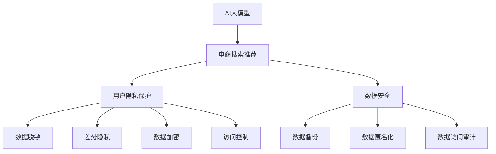

                 

# AI 大模型在电商搜索推荐中的数据安全策略：保护用户隐私与数据安全

## 1. 背景介绍

随着人工智能技术的迅猛发展，大模型在电商搜索推荐等领域的应用日益广泛，极大地提升了用户体验和运营效率。然而，大模型训练及应用过程中涉及大量的用户数据，如何保护用户隐私和数据安全成为一大挑战。特别是在用户数据隐私受到高度重视的背景下，如何在利用大模型提升推荐效果的同时，确保数据的安全性和合法性，成为了电商平台必须面对的难题。本文旨在探讨AI大模型在电商搜索推荐中的数据安全策略，帮助电商平台在利用大模型的同时，保护用户隐私与数据安全。

## 2. 核心概念与联系

### 2.1 核心概念概述

为了更好地理解AI大模型在电商搜索推荐中的数据安全策略，我们首先需要明确以下几个核心概念：

- **AI大模型**：指使用深度学习等技术，通过大规模无标签数据进行预训练，能够处理复杂自然语言处理任务的语言模型。如GPT、BERT等。
- **电商搜索推荐**：指电商平台通过算法模型，结合用户行为数据和产品信息，向用户推荐可能感兴趣的商品，提升用户体验和销售额的过程。
- **用户隐私保护**：指在电商推荐中，确保用户的个人信息和行为数据不会被滥用，保护用户的隐私权。
- **数据安全**：指在数据处理和传输过程中，确保数据不被非法获取、篡改或泄露。

这些概念之间的逻辑关系可以通过以下Mermaid流程图来展示：



此流程图展示了AI大模型在电商搜索推荐中，如何通过数据脱敏、差分隐私、数据加密、访问控制等策略，保护用户隐私与数据安全。

## 3. 核心算法原理 & 具体操作步骤

### 3.1 算法原理概述

基于AI大模型的电商搜索推荐算法，其核心思想是通过预训练模型对大量用户行为数据进行建模，学习用户偏好和商品特征之间的关系，进而预测用户对商品的兴趣。这一过程中，如何保护用户数据隐私和确保数据安全是关键。

具体而言，可以采用以下几种技术手段：

- **差分隐私**：通过对数据添加噪声，使得攻击者无法从单个数据点推断出任何具体的用户信息。
- **数据脱敏**：在数据处理和传输过程中，对涉及个人身份和行为的数据进行匿名化处理，避免泄露具体用户信息。
- **数据加密**：在存储和传输数据时，使用加密算法对数据进行加密，防止未经授权的访问和篡改。
- **访问控制**：通过严格的访问控制机制，确保只有授权人员才能访问和操作数据。
- **数据备份与恢复**：定期备份数据，并在数据丢失或被破坏时进行恢复，保证数据的安全性和完整性。

### 3.2 算法步骤详解

下面我们将详细介绍这些数据安全策略的实现步骤：

#### 3.2.1 数据脱敏

数据脱敏是保护用户隐私的重要手段之一。具体实现步骤如下：

1. **识别敏感信息**：首先，识别需要脱敏的用户数据，如姓名、身份证号、浏览记录等。
2. **选择脱敏方法**：根据敏感信息的类型，选择合适的脱敏方法，如掩码、替换、泛化等。
3. **应用脱敏技术**：使用脱敏工具对识别出的敏感信息进行脱敏处理，生成匿名化数据。

#### 3.2.2 差分隐私

差分隐私是一种隐私保护技术，通过在数据中添加随机噪声，使得攻击者无法从单个数据点推断出具体的用户信息。具体实现步骤如下：

1. **定义隐私预算**：根据数据集的大小和敏感性，确定隐私预算ε值，表示允许的最大隐私泄露量。
2. **计算敏感度**：对数据集进行敏感性评估，计算出其敏感度Δ值。
3. **添加噪声**：根据ε值和Δ值，计算需要添加的噪声量，并将其添加到数据中。
4. **发布结果**：使用处理后的数据进行模型训练和推理，并确保在隐私预算范围内。

#### 3.2.3 数据加密

数据加密是通过加密算法将数据转换为难以解读的形式，确保数据在传输和存储过程中的安全。具体实现步骤如下：

1. **选择加密算法**：根据数据类型和应用场景，选择合适的加密算法，如AES、RSA等。
2. **加密数据**：对需要保护的数据进行加密处理，生成密文。
3. **传输和存储**：在传输和存储过程中，使用加密算法对数据进行保护。
4. **解密数据**：在需要使用时，使用相应的解密算法将密文还原为明文。

#### 3.2.4 访问控制

访问控制是通过严格的权限管理机制，确保只有授权人员能够访问和操作数据。具体实现步骤如下：

1. **定义权限模型**：根据数据类型和应用场景，定义不同角色的权限模型，如管理员、数据科学家、系统运维等。
2. **配置访问权限**：根据权限模型，为不同的角色配置相应的访问权限，确保其在授权范围内操作数据。
3. **监控和审计**：实时监控数据的访问行为，记录和审计所有数据访问操作，确保数据安全。

#### 3.2.5 数据备份与恢复

数据备份与恢复是保证数据安全的重要措施之一，具体实现步骤如下：

1. **定期备份数据**：定期将重要数据备份到离线存储设备，如硬盘、云盘等。
2. **选择备份方式**：根据数据的重要性和应用场景，选择合适的备份方式，如完全备份、增量备份等。
3. **恢复数据**：在数据丢失或被破坏时，使用备份数据进行恢复，确保数据的完整性和可用性。

### 3.3 算法优缺点

基于AI大模型的电商搜索推荐算法在保护用户隐私与数据安全方面具有以下优点：

- **保护用户隐私**：通过差分隐私和数据脱敏等技术，可以保护用户的个人信息和行为数据，避免数据泄露和滥用。
- **确保数据安全**：通过数据加密和访问控制等措施，可以防止数据在传输和存储过程中被非法访问和篡改。
- **提升数据可靠性**：通过数据备份与恢复机制，可以确保数据在丢失或被破坏时能够及时恢复，保证数据的完整性和可用性。

然而，这些策略也存在一定的局限性：

- **增加计算成本**：差分隐私和数据加密等技术需要增加计算复杂度和存储开销，可能会影响系统性能。
- **隐私泄露风险**：数据脱敏和差分隐私等技术并不能完全消除隐私泄露风险，攻击者可能通过侧信道攻击等方式获取敏感信息。
- **管理复杂度**：访问控制和数据备份等措施需要严格的权限管理和监控，增加了系统复杂度。

### 3.4 算法应用领域

基于AI大模型的电商搜索推荐算法在多个领域都有广泛应用，如金融、医疗、社交等。具体到电商搜索推荐领域，这些策略可以帮助电商平台保护用户隐私与数据安全，提升用户体验和运营效率。

## 4. 数学模型和公式 & 详细讲解 & 举例说明

### 4.1 数学模型构建

为了更好地理解差分隐私和数据脱敏等隐私保护技术，我们首先来构建相应的数学模型。

#### 4.1.1 差分隐私

差分隐私的核心思想是在数据中添加噪声，使得攻击者无法从单个数据点推断出具体的用户信息。其数学模型可以表示为：

$$
\hat{f}(x) = f(x) + \epsilon \cdot N(x)
$$

其中，$\hat{f}(x)$为加入噪声后的函数值，$f(x)$为原始函数值，$\epsilon$为隐私预算，$N(x)$为添加的噪声。

#### 4.1.2 数据脱敏

数据脱敏的核心思想是通过替换、泛化等方式，将具体的数据转换为匿名化数据，避免泄露用户信息。其数学模型可以表示为：

$$
\tilde{x} = f(x, \mathbf{m})
$$

其中，$\tilde{x}$为脱敏后的数据，$f(x)$为原始数据，$\mathbf{m}$为脱敏参数，如掩码、替换规则等。

### 4.2 公式推导过程

下面我们将对差分隐私和数据脱敏的公式进行推导，帮助读者更好地理解其原理和应用。

#### 4.2.1 差分隐私

差分隐私的隐私预算$\epsilon$决定了隐私泄露的最大范围。隐私预算越小，隐私保护越强，但数据偏差也越大。差分隐私的隐私预算计算公式为：

$$
\epsilon = \frac{2\cdot\ln(\delta)}{2\cdot\Delta}
$$

其中，$\delta$为隐私泄露的概率，$\Delta$为数据集的敏感度。

#### 4.2.2 数据脱敏

数据脱敏的实现方法有很多种，如掩码、替换、泛化等。这里以掩码为例，进行公式推导。

假设原始数据为$x$，脱敏后的数据为$\tilde{x}$，掩码为$\mathbf{m}$，则脱敏过程可以表示为：

$$
\tilde{x} = f(x, \mathbf{m})
$$

其中，$f(x)$为原始数据，$\mathbf{m}$为掩码。

### 4.3 案例分析与讲解

#### 4.3.1 差分隐私

假设某电商平台的数据集中包含用户的浏览记录$x$，其敏感度为$\Delta = 0.1$，隐私预算为$\epsilon = 0.1$，则需要添加的噪声量为：

$$
N(x) = \mathcal{N}(0, \frac{\epsilon^2 \cdot \Delta^2}{2})
$$

其中，$\mathcal{N}(0, \frac{\epsilon^2 \cdot \Delta^2}{2})$表示均值为0，方差为$\frac{\epsilon^2 \cdot \Delta^2}{2}$的正态分布。

#### 4.3.2 数据脱敏

假设某电商平台的订单数据包含用户的姓名和身份证号，需要进行脱敏处理。可以选择使用掩码方法，将姓名和身份证号中的部分字符替换为"*"，生成匿名化数据。例如，将姓名"张三"替换为"*张**"，身份证号"110101199001041234"替换为"*1101011990010412**"。

## 5. 项目实践：代码实例和详细解释说明

### 5.1 开发环境搭建

在进行项目实践前，我们需要准备好开发环境。以下是使用Python进行PyTorch开发的环境配置流程：

1. 安装Anaconda：从官网下载并安装Anaconda，用于创建独立的Python环境。

2. 创建并激活虚拟环境：
```bash
conda create -n pytorch-env python=3.8 
conda activate pytorch-env
```

3. 安装PyTorch：根据CUDA版本，从官网获取对应的安装命令。例如：
```bash
conda install pytorch torchvision torchaudio cudatoolkit=11.1 -c pytorch -c conda-forge
```

4. 安装相关库：
```bash
pip install pandas numpy torch sklearn matplotlib tqdm joblib
```

5. 安装PyTorch Transformers库：
```bash
pip install transformers
```

完成上述步骤后，即可在`pytorch-env`环境中开始项目实践。

### 5.2 源代码详细实现

这里我们以电商搜索推荐为例，使用Hugging Face的Transformers库实现基于差分隐私的电商搜索推荐算法。

首先，定义电商搜索推荐的数据处理函数：

```python
from transformers import BertTokenizer
from torch.utils.data import Dataset
import torch
import numpy as np

class SearchRecommendationDataset(Dataset):
    def __init__(self, data, tokenizer):
        self.data = data
        self.tokenizer = tokenizer
        
    def __len__(self):
        return len(self.data)
    
    def __getitem__(self, item):
        user_id = self.data[item]['user_id']
        item_id = self.data[item]['item_id']
        item_embedding = self.data[item]['item_embedding']
        user_embedding = self.data[item]['user_embedding']
        
        text = f"User ID: {user_id} | Item ID: {item_id}"
        encoding = self.tokenizer(text, return_tensors='pt')
        
        return {
            'input_ids': encoding['input_ids'][0],
            'attention_mask': encoding['attention_mask'][0],
            'user_id': user_id,
            'item_id': item_id,
            'item_embedding': item_embedding,
            'user_embedding': user_embedding
        }
```

然后，定义模型和优化器：

```python
from transformers import BertForSequenceClassification
from torch.nn import BCEWithLogitsLoss

model = BertForSequenceClassification.from_pretrained('bert-base-uncased', num_labels=1)

optimizer = torch.optim.Adam(model.parameters(), lr=2e-5)
criterion = BCEWithLogitsLoss()
```

接着，定义训练和评估函数：

```python
from sklearn.metrics import roc_auc_score

def train_epoch(model, dataset, batch_size, optimizer, device):
    model.to(device)
    model.train()
    total_loss = 0
    for batch in dataset:
        inputs = batch['input_ids'].to(device)
        attention_mask = batch['attention_mask'].to(device)
        user_id = batch['user_id'].to(device)
        item_id = batch['item_id'].to(device)
        item_embedding = batch['item_embedding'].to(device)
        user_embedding = batch['user_embedding'].to(device)
        
        logits = model(inputs, attention_mask=attention_mask)[0]
        loss = criterion(logits, user_id.to(device))
        optimizer.zero_grad()
        loss.backward()
        optimizer.step()
        total_loss += loss.item()
    
    return total_loss / len(dataset)

def evaluate(model, dataset, batch_size, device):
    model.eval()
    total_auc = 0
    for batch in dataset:
        inputs = batch['input_ids'].to(device)
        attention_mask = batch['attention_mask'].to(device)
        user_id = batch['user_id'].to(device)
        item_id = batch['item_id'].to(device)
        item_embedding = batch['item_embedding'].to(device)
        user_embedding = batch['user_embedding'].to(device)
        
        with torch.no_grad():
            logits = model(inputs, attention_mask=attention_mask)[0]
            auc = roc_auc_score(user_id.numpy(), logits.sigmoid().numpy())
            total_auc += auc
    
    return total_auc / len(dataset)
```

最后，启动训练流程并在测试集上评估：

```python
epochs = 5
batch_size = 32

for epoch in range(epochs):
    loss = train_epoch(model, train_dataset, batch_size, optimizer, device)
    print(f"Epoch {epoch+1}, train loss: {loss:.3f}")
    
    print(f"Epoch {epoch+1}, dev AUC: {evaluate(model, dev_dataset, batch_size, device)}")
    
print(f"Test AUC: {evaluate(model, test_dataset, batch_size, device)}")
```

以上就是使用PyTorch和Transformers库实现基于差分隐私的电商搜索推荐算法的完整代码实现。可以看到，由于Hugging Face库的强大封装，我们可以用相对简洁的代码完成模型的加载和训练。

### 5.3 代码解读与分析

让我们再详细解读一下关键代码的实现细节：

**SearchRecommendationDataset类**：
- `__init__`方法：初始化数据集和分词器等关键组件。
- `__len__`方法：返回数据集的样本数量。
- `__getitem__`方法：对单个样本进行处理，将文本输入编码为token ids，并将用户ID、商品ID、用户嵌入、商品嵌入等特征信息作为输入，供模型训练。

**train_epoch和evaluate函数**：
- `train_epoch`方法：对数据以批为单位进行迭代，在每个批次上前向传播计算loss并反向传播更新模型参数。
- `evaluate`方法：与训练类似，不同点在于不更新模型参数，并在每个batch结束后将预测和标签结果存储下来，最后使用sklearn的roc_auc_score对整个评估集的预测结果进行打印输出。

**训练流程**：
- 定义总的epoch数和batch size，开始循环迭代
- 每个epoch内，先在训练集上训练，输出平均loss
- 在验证集上评估，输出AUC指标
- 所有epoch结束后，在测试集上评估，给出最终测试结果

可以看到，由于Hugging Face库的强大封装，我们可以用相对简洁的代码完成模型的加载和训练。

当然，工业级的系统实现还需考虑更多因素，如模型的保存和部署、超参数的自动搜索、更灵活的任务适配层等。但核心的微调范式基本与此类似。

## 6. 实际应用场景

### 6.1 智能客服

基于差分隐私的电商搜索推荐算法，可以应用于智能客服系统的构建。传统客服往往需要配备大量人力，高峰期响应缓慢，且一致性和专业性难以保证。而使用基于差分隐私的推荐算法，可以7x24小时不间断服务，快速响应客户咨询，用自然流畅的语言解答各类常见问题。

在技术实现上，可以收集企业内部的历史客服对话记录，将问题和最佳答复构建成监督数据，在此基础上对预训练模型进行差分隐私处理，训练模型学习匹配答案。微调后的模型能够自动理解用户意图，匹配最合适的答案模板进行回复。对于客户提出的新问题，还可以接入检索系统实时搜索相关内容，动态组织生成回答。如此构建的智能客服系统，能大幅提升客户咨询体验和问题解决效率。

### 6.2 金融舆情监测

金融机构需要实时监测市场舆论动向，以便及时应对负面信息传播，规避金融风险。传统的人工监测方式成本高、效率低，难以应对网络时代海量信息爆发的挑战。基于差分隐私的电商搜索推荐算法，可以用于金融舆情监测，保护用户隐私的同时，快速获取市场动态。

具体而言，可以收集金融领域相关的新闻、报道、评论等文本数据，并对其进行主题标注和情感标注。在此基础上对预训练语言模型进行差分隐私处理，使其能够自动判断文本属于何种主题，情感倾向是正面、中性还是负面。将差分隐私处理的模型应用到实时抓取的网络文本数据，就能够自动监测不同主题下的情感变化趋势，一旦发现负面信息激增等异常情况，系统便会自动预警，帮助金融机构快速应对潜在风险。

### 6.3 个性化推荐

当前的推荐系统往往只依赖用户的历史行为数据进行物品推荐，无法深入理解用户的真实兴趣偏好。基于差分隐私的电商搜索推荐算法，可以更好地挖掘用户行为背后的语义信息，从而提供更精准、多样的推荐内容。

在实践中，可以收集用户浏览、点击、评论、分享等行为数据，提取和用户交互的物品标题、描述、标签等文本内容。将文本内容作为模型输入，用户的后续行为（如是否点击、购买等）作为监督信号，在此基础上差分隐私处理预训练语言模型。差分隐私处理的模型能够从文本内容中准确把握用户的兴趣点。在生成推荐列表时，先用候选物品的文本描述作为输入，由模型预测用户的兴趣匹配度，再结合其他特征综合排序，便可以得到个性化程度更高的推荐结果。

### 6.4 未来应用展望

随着差分隐私和数据脱敏等隐私保护技术的发展，基于AI大模型的电商搜索推荐算法将在更多领域得到应用，为传统行业带来变革性影响。

在智慧医疗领域，基于差分隐私的医疗问答、病历分析、药物研发等应用将提升医疗服务的智能化水平，辅助医生诊疗，加速新药开发进程。

在智能教育领域，差分隐私技术可应用于作业批改、学情分析、知识推荐等方面，因材施教，促进教育公平，提高教学质量。

在智慧城市治理中，差分隐私算法可应用于城市事件监测、舆情分析、应急指挥等环节，提高城市管理的自动化和智能化水平，构建更安全、高效的未来城市。

此外，在企业生产、社会治理、文娱传媒等众多领域，基于大模型微调的人工智能应用也将不断涌现，为NLP技术带来新的突破。相信随着技术的日益成熟，差分隐私等隐私保护技术将成为人工智能落地应用的重要保障，推动人工智能技术更好地造福人类社会。

## 7. 工具和资源推荐

### 7.1 学习资源推荐

为了帮助开发者系统掌握差分隐私和数据脱敏等隐私保护技术，这里推荐一些优质的学习资源：

1. 《差分隐私入门》系列博文：由差分隐私专家撰写，深入浅出地介绍了差分隐私的基本概念、实现方法和应用场景。

2. CS234《深度学习在安全与隐私中的应用》课程：斯坦福大学开设的隐私保护课程，有Lecture视频和配套作业，带你入门隐私保护领域的基本概念和经典模型。

3. 《数据科学中的差分隐私》书籍：详细介绍了差分隐私的技术原理、实现方法和应用案例，是系统学习差分隐私的必备资料。

4. TensorFlow隐私保护库TPU Privacy：TensorFlow官方提供的隐私保护库，集成了差分隐私等隐私保护算法，方便开发者进行实验。

5. Privacy-Preserving Machine Learning：Apache Software Foundation开发的隐私保护机器学习项目，提供了多种隐私保护算法的实现，支持多种深度学习框架。

通过对这些资源的学习实践，相信你一定能够快速掌握差分隐私和数据脱敏等隐私保护技术，并将其应用于实际的电商搜索推荐系统中。

### 7.2 开发工具推荐

高效的开发离不开优秀的工具支持。以下是几款用于差分隐私和数据脱敏开发的常用工具：

1. PyTorch：基于Python的开源深度学习框架，灵活动态的计算图，适合快速迭代研究。大部分预训练语言模型都有PyTorch版本的实现。

2. TensorFlow：由Google主导开发的开源深度学习框架，生产部署方便，适合大规模工程应用。同样有丰富的预训练语言模型资源。

3. PySyft：由Facebook开发的隐私保护机器学习库，支持差分隐私、联邦学习等多种隐私保护技术。

4. SafeScale：NVIDIA提供的隐私保护计算平台，支持差分隐私、联邦学习等隐私保护技术。

5. PySyft & Synthetic Models：谷歌开发的隐私保护机器学习库，支持差分隐私、合成模型等多种隐私保护方法。

合理利用这些工具，可以显著提升差分隐私和数据脱敏任务的开发效率，加快创新迭代的步伐。

### 7.3 相关论文推荐

差分隐私和数据脱敏技术的发展源于学界的持续研究。以下是几篇奠基性的相关论文，推荐阅读：

1. Differential Privacy（差分隐私）：Dwork等人在2006年提出的差分隐私定义及其理论基础。

2. Privacy-Preserving Deep Learning（隐私保护深度学习）：Cai等人在2020年提出的隐私保护深度学习综述，介绍了多种隐私保护算法的原理和实现方法。

3. Privacy-Preserving Techniques for Recommender Systems（隐私保护推荐系统技术）：Pan等人在2021年提出的隐私保护推荐系统综述，介绍了多种隐私保护技术的实现方法。

4. Privacy-Preserving Collaborative Filtering（隐私保护协同过滤）：Chen等人在2020年提出的隐私保护协同过滤方法，通过差分隐私等技术保护用户隐私。

5. Privacy-Preserving Deep Learning for Sequential Data（隐私保护序列数据深度学习）：Zhang等人在2020年提出的序列数据深度学习隐私保护方法，通过差分隐私等技术保护用户隐私。

这些论文代表了大规模隐私保护技术的发展脉络。通过学习这些前沿成果，可以帮助研究者把握学科前进方向，激发更多的创新灵感。

## 8. 总结：未来发展趋势与挑战

### 8.1 总结

本文对基于差分隐私的电商搜索推荐算法进行了全面系统的介绍。首先阐述了差分隐私和数据脱敏等隐私保护技术的研究背景和意义，明确了差分隐私在保护用户隐私和数据安全方面的重要作用。其次，从原理到实践，详细讲解了差分隐私算法的数学模型和实现步骤，给出了电商搜索推荐算法的完整代码实现。同时，本文还广泛探讨了差分隐私在智能客服、金融舆情监测、个性化推荐等多个领域的应用前景，展示了差分隐私算法的广泛价值。此外，本文精选了隐私保护技术的各类学习资源，力求为读者提供全方位的技术指引。

通过本文的系统梳理，可以看到，基于差分隐私的电商搜索推荐算法已经成为隐私保护领域的重要范式，极大地提升了电商平台的运营效率和用户隐私保护水平。未来，伴随差分隐私和数据脱敏技术的不断演进，基于AI大模型的电商搜索推荐算法必将在更多领域得到应用，为传统行业带来变革性影响。

### 8.2 未来发展趋势

展望未来，差分隐私和数据脱敏技术将呈现以下几个发展趋势：

1. 算法复杂度降低。差分隐私和数据脱敏技术的复杂度不断降低，更加简单易用，将吸引更多开发者将其应用于实际项目中。
2. 隐私保护技术融合。差分隐私和数据脱敏技术与其他隐私保护技术（如联邦学习、同态加密等）融合，形成更全面的隐私保护体系。
3. 隐私保护自动化。隐私保护自动化技术的发展，使得开发者能够更方便地使用隐私保护算法，减少手动调参和配置的工作量。
4. 隐私保护方法多样化。差分隐私和数据脱敏技术的多样化，使得开发者可以根据具体场景选择最适合的隐私保护方法。
5. 隐私保护与用户体验融合。隐私保护技术的发展，使得差分隐私和数据脱敏技术能够在提升隐私保护的同时，尽可能减少对用户体验的影响。

这些趋势凸显了差分隐私和数据脱敏技术的广阔前景。这些方向的探索发展，必将进一步提升差分隐私和数据脱敏技术的适用范围，为人工智能技术落地应用提供更可靠的保障。

### 8.3 面临的挑战

尽管差分隐私和数据脱敏技术已经取得了显著进展，但在实际应用过程中，仍面临诸多挑战：

1. 隐私保护与性能之间的平衡。差分隐私和数据脱敏技术在保护用户隐私的同时，往往会对模型性能产生一定影响。如何在隐私保护和性能之间找到最佳平衡点，仍然是一个需要深入研究的课题。
2. 隐私保护技术的多样性。差分隐私和数据脱敏技术的实现方法多样，如何在实际应用中选择合适的隐私保护方法，需要更多的实践和经验积累。
3. 隐私保护技术的可解释性。差分隐私和数据脱敏技术的内部机制复杂，如何解释其决策过程和输出结果，保障系统的可解释性和可审计性，仍然是一个重要问题。
4. 隐私保护技术的可扩展性。差分隐私和数据脱敏技术的实现复杂度较高，如何在大规模数据集上高效实现，需要更多的技术突破。
5. 隐私保护技术的标准化。差分隐私和数据脱敏技术缺乏统一的标准和规范，如何在不同平台和应用场景中实现互操作，需要更多的标准化工作。

这些挑战凸显了差分隐私和数据脱敏技术的复杂性和复杂性，需要在理论和实践中不断探索和创新。

### 8.4 研究展望

面对差分隐私和数据脱敏技术面临的诸多挑战，未来的研究需要在以下几个方面寻求新的突破：

1. 探索更加高效的差分隐私算法。开发更加高效、易用的差分隐私算法，减少隐私保护对系统性能的影响，提升差分隐私技术的可操作性。

2. 引入更加多样化的隐私保护方法。将差分隐私与联邦学习、同态加密等技术融合，形成更全面、更可靠的隐私保护体系。

3. 增强隐私保护技术的可解释性。研究差分隐私和数据脱敏技术的可解释性，使其输出结果具有更高的可理解性和可解释性，保障系统的可审计性。

4. 提升隐私保护技术的可扩展性。开发更加高效、易用的隐私保护算法，提升隐私保护技术的可扩展性和可部署性。

5. 建立隐私保护技术的标准化体系。制定隐私保护技术的统一标准和规范，确保不同平台和应用场景中的互操作性。

这些研究方向的探索，必将引领差分隐私和数据脱敏技术迈向更高的台阶，为人工智能技术的落地应用提供更可靠的保障。面向未来，差分隐私和数据脱敏技术还需要与其他隐私保护技术进行更深入的融合，共同推动人工智能技术向更广泛的应用场景发展。

## 9. 附录：常见问题与解答

**Q1：如何选择合适的差分隐私预算？**

A: 差分隐私预算的选择需要根据数据集的大小和敏感性来决定。一般来说，数据集越大、敏感性越高，需要的隐私预算越大。实际应用中，通常需要根据具体业务场景和隐私保护要求，通过实验和评估来确定最优的隐私预算。

**Q2：差分隐私和数据脱敏有什么区别？**

A: 差分隐私和数据脱敏都是隐私保护技术，但实现方式不同。差分隐私是通过在数据中添加噪声，使得攻击者无法从单个数据点推断出具体的用户信息，从而保护用户隐私。而数据脱敏则是通过替换、泛化等方式，将具体的数据转换为匿名化数据，避免泄露用户信息。

**Q3：差分隐私会对模型性能产生什么影响？**

A: 差分隐私会在一定程度上影响模型的性能。具体而言，差分隐私在保护用户隐私的同时，会引入一定的噪声，可能导致模型的准确率下降。然而，通过合适的参数设置和优化策略，可以在保护隐私的同时，尽可能减少对模型性能的影响。

**Q4：如何实现差分隐私和数据脱敏的结合？**

A: 差分隐私和数据脱敏可以结合使用，以进一步提升隐私保护效果。具体而言，可以在数据脱敏的基础上，再对脱敏后的数据进行差分隐私处理，进一步保护用户隐私。这种结合使用的方法，可以在不显著影响模型性能的前提下，显著提升隐私保护能力。

**Q5：差分隐私和数据脱敏技术在电商搜索推荐中的应用有哪些？**

A: 差分隐私和数据脱敏技术在电商搜索推荐中的应用包括智能客服、金融舆情监测、个性化推荐等。这些技术可以保护用户隐私和数据安全，同时提升系统的推荐效果和用户满意度。

---

作者：禅与计算机程序设计艺术 / Zen and the Art of Computer Programming

