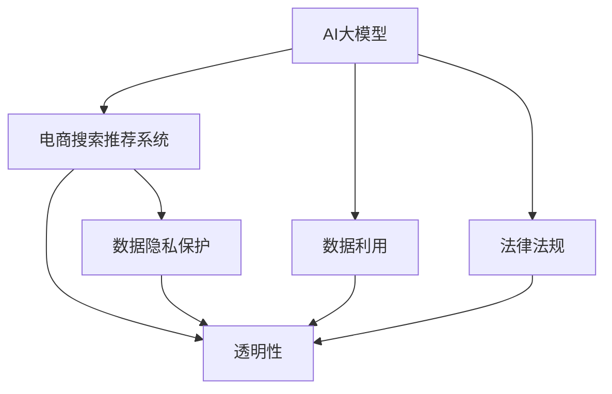

                 

# AI 大模型在电商搜索推荐中的用户隐私保护措施：尊重用户权利与安全

## 1. 背景介绍

### 1.1 问题由来
随着人工智能技术的发展，AI大模型在电商搜索推荐中的应用日益广泛。然而，电商搜索推荐系统收集了大量用户行为数据，并依赖这些数据进行模型训练，以提供个性化的购物体验。这些数据中往往包含用户的敏感信息，如购物偏好、浏览历史、交易记录等，引起了人们对用户隐私保护的关注。如何在享受电商搜索推荐系统带来的便利的同时，保护用户的隐私权益，成为了一个亟需解决的问题。

### 1.2 问题核心关键点
1. **数据隐私**：电商搜索推荐系统依赖用户行为数据，如何在数据收集和处理过程中保护用户隐私，是问题的核心。
2. **算法透明性**：用户往往对算法决策过程缺乏了解，如何提高算法的透明性，让用户信任并接受推荐结果。
3. **数据利用**：如何在保护隐私的前提下，充分利用数据提升推荐系统的效果。
4. **法律法规**：遵循相关法律法规，如GDPR、CCPA等，确保用户隐私保护合规性。

## 2. 核心概念与联系

### 2.1 核心概念概述

为更好地理解AI大模型在电商搜索推荐中的应用与隐私保护措施，本节将介绍几个密切相关的核心概念：

- **AI大模型**：指通过深度学习等技术训练得到的、具备强大数据处理和推理能力的大规模神经网络模型。常见的有BERT、GPT等。
- **电商搜索推荐系统**：基于用户行为数据，利用AI大模型进行个性化推荐，提升用户购物体验的系统。
- **隐私保护**：指在数据收集、存储、处理和传输过程中，采取技术和管理措施，确保用户数据不被滥用、泄露或非法访问。
- **透明性**：指算法决策过程的公开透明，用户能够了解并信任推荐结果的生成机制。
- **数据利用**：指在保护隐私的前提下，合理利用用户数据提升推荐系统的效果。
- **法律法规**：指涉及用户隐私保护的各类法律法规，如GDPR、CCPA等。

这些概念之间的逻辑关系可以通过以下Mermaid流程图来展示：



这个流程图展示了大模型在电商推荐中的核心概念及其之间的关系：

1. AI大模型作为推荐系统的基础，依赖于数据隐私保护技术，以合法合规的方式进行数据收集和处理。
2. 推荐系统透明性是其核心特性，通过技术和管理措施，确保用户了解推荐结果的生成过程。
3. 数据利用旨在最大化数据价值，同时保护用户隐私。
4. 法律法规确保推荐系统在隐私保护方面的合规性。

这些概念共同构成了AI大模型在电商推荐中的应用框架，为其在隐私保护方面的研究提供了理论基础。

## 3. 核心算法原理 & 具体操作步骤
### 3.1 算法原理概述

AI大模型在电商搜索推荐中的应用，本质上是一个数据驱动的个性化推荐过程。其核心思想是：通过收集用户的行为数据，利用AI大模型学习用户的兴趣和偏好，进而为用户推荐个性化商品。这一过程涉及数据隐私保护和算法透明性等重要问题。

### 3.2 算法步骤详解

#### 3.2.1 数据收集与预处理
- **数据收集**：收集用户在电商平台的浏览、购买、评价等行为数据，包括用户的个人信息、设备信息、购物偏好等。
- **数据预处理**：对收集到的数据进行清洗、去重、匿名化等预处理，确保数据的准确性和隐私性。

#### 3.2.2 隐私保护措施
- **数据匿名化**：对用户的个人身份信息进行脱敏处理，如使用哈希函数、差分隐私技术等，确保用户身份不可识别。
- **差分隐私**：在数据统计和分析过程中，加入噪声，保护用户数据的隐私性，防止数据泄露。
- **数据最小化**：只收集与推荐直接相关的数据，减少数据存储和处理的风险。

#### 3.2.3 模型训练与优化
- **联邦学习**：在无需集中数据的情况下，通过分布式训练提升模型效果，降低数据泄露风险。
- **对抗训练**：使用对抗样本训练模型，提高模型的鲁棒性和隐私保护能力。
- **安全多方计算**：通过多方参与计算，确保数据的安全性，防止数据被恶意篡改或泄露。

#### 3.2.4 推荐结果生成与反馈
- **推荐结果生成**：根据用户的个性化特征和电商平台的商品信息，利用AI大模型生成推荐结果。
- **用户反馈机制**：收集用户对推荐结果的反馈，用于模型迭代优化，提升推荐效果。

### 3.3 算法优缺点

#### 3.3.1 优点
1. **提升推荐效果**：通过AI大模型学习用户兴趣和偏好，提升推荐系统的个性化和准确性。
2. **数据安全**：通过差分隐私、联邦学习等技术，确保用户数据的安全性。
3. **法律法规合规**：遵循相关法律法规，确保用户隐私保护合规性。

#### 3.3.2 缺点
1. **算法复杂性**：隐私保护和联邦学习等技术，增加了模型训练和维护的复杂性。
2. **性能开销**：差分隐私、安全多方计算等技术，增加了模型的计算开销和推理时间。
3. **用户理解难度**：算法透明性不足，用户难以理解推荐结果的生成过程。

### 3.4 算法应用领域

AI大模型在电商搜索推荐中的应用，不仅限于个性化推荐。其隐私保护措施和技术手段，还广泛应用于金融、医疗、社交网络等领域。在这些领域，AI大模型通过用户行为数据的分析，提供个性化的服务和产品推荐，同时确保用户隐私和数据安全。

## 4. 数学模型和公式 & 详细讲解 & 举例说明

### 4.1 数学模型构建

本节将使用数学语言对AI大模型在电商推荐中的应用与隐私保护措施进行更加严格的刻画。

假设电商搜索推荐系统的训练数据集为 $D=\{(x_i,y_i)\}_{i=1}^N$，其中 $x_i$ 为用户行为数据，$y_i$ 为用户对推荐结果的反馈。AI大模型 $M_{\theta}$ 的输入输出分别为 $x \in \mathcal{X}, y \in \mathcal{Y}$，其中 $\mathcal{X}$ 为用户行为数据空间，$\mathcal{Y}$ 为用户反馈空间，$\theta \in \mathbb{R}^d$ 为模型参数。

定义模型的损失函数为 $\ell(M_{\theta}(x),y)$，目标是最小化模型在训练集上的经验风险 $\mathcal{L}(\theta) = \frac{1}{N} \sum_{i=1}^N \ell(M_{\theta}(x_i),y_i)$。在训练过程中，通过优化算法 $f_{opt}$，对模型参数 $\theta$ 进行迭代更新，即 $\theta \leftarrow f_{opt}(\theta, \mathcal{L}(\theta))$。

### 4.2 公式推导过程

以联邦学习为例，推导其基本流程。假设存在多个边缘服务器，每个服务器有一个本地数据集 $D_i=\{(x_{i,j}, y_{i,j})\}_{j=1}^{N_i}$，其中 $N_i$ 为第 $i$ 个服务器的数据量。联邦学习的目标是在不共享原始数据的情况下，协同训练一个全局模型 $M_{\theta}$。

联邦学习的基本流程包括：
1. **模型初始化**：每个服务器初始化一个本地模型 $M_{\theta_i}$。
2. **参数更新**：每个服务器对本地数据集 $D_i$ 进行采样，生成一个局部梯度 $g_i$，然后计算模型参数的更新量 $\Delta\theta_i = g_i / N_i$。
3. **模型聚合**：每个服务器将更新后的参数 $\theta_i + \Delta\theta_i$ 发送给中央服务器，中央服务器对这些参数进行聚合，得到全局模型参数 $\hat{\theta}$。
4. **模型评估**：中央服务器使用全局模型 $M_{\hat{\theta}}$ 在测试集上评估性能，根据评估结果调整学习率或模型参数。

联邦学习的数学公式可以表示为：

$$
\hat{\theta} = \mathop{\arg\min}_{\theta} \sum_{i=1}^N \mathcal{L}_i(\theta) \quad \text{其中} \quad \mathcal{L}_i(\theta) = \frac{1}{N_i} \sum_{j=1}^{N_i} \ell(M_{\theta_i}(x_{i,j}), y_{i,j})
$$

### 4.3 案例分析与讲解

假设有一个电商平台，使用AI大模型进行用户推荐。平台收集用户的浏览历史、购物记录等行为数据，用于训练推荐模型。为了保护用户隐私，平台采用差分隐私技术，在数据处理过程中加入噪声，确保用户数据无法被逆向还原。

在模型训练过程中，平台使用联邦学习算法，将用户数据分散在不同服务器上进行本地训练，通过参数聚合的方式更新全局模型。这种方法不仅保护了用户数据的安全性，还提高了模型训练的效率和可靠性。

## 5. 项目实践：代码实例和详细解释说明
### 5.1 开发环境搭建

在进行隐私保护项目开发前，我们需要准备好开发环境。以下是使用Python进行PyTorch开发的环境配置流程：

1. 安装Anaconda：从官网下载并安装Anaconda，用于创建独立的Python环境。

2. 创建并激活虚拟环境：
```bash
conda create -n privacy-env python=3.8 
conda activate privacy-env
```

3. 安装PyTorch：根据CUDA版本，从官网获取对应的安装命令。例如：
```bash
conda install pytorch torchvision torchaudio cudatoolkit=11.1 -c pytorch -c conda-forge
```

4. 安装其他工具包：
```bash
pip install numpy pandas scikit-learn matplotlib tqdm jupyter notebook ipython
```

完成上述步骤后，即可在`privacy-env`环境中开始隐私保护实践。

### 5.2 源代码详细实现

我们以差分隐私在电商推荐系统中的应用为例，给出使用PyTorch实现的代码。

首先，定义差分隐私参数：

```python
from torch import nn
from torch.nn import functional as F
import numpy as np

epsilon = 1.0
delta = 0.1
delta_per_query = delta / N
```

然后，定义差分隐私的噪声机制：

```python
class DifferentialPrivacy(nn.Module):
    def __init__(self, epsilon=0.1):
        super(DifferentialPrivacy, self).__init__()
        self.epsilon = epsilon
    
    def forward(self, x):
        noise = np.random.normal(0, self.epsilon, x.shape)
        return x + noise
```

接着，定义电商推荐模型的训练函数：

```python
class Recommender(nn.Module):
    def __init__(self, input_size, hidden_size):
        super(Recommender, self).__init__()
        self.fc1 = nn.Linear(input_size, hidden_size)
        self.fc2 = nn.Linear(hidden_size, 1)
    
    def forward(self, x):
        x = F.relu(self.fc1(x))
        x = self.fc2(x)
        return x
    
    def train(self, dataset, batch_size, num_epochs, learning_rate, device):
        model = self.to(device)
        optimizer = torch.optim.Adam(model.parameters(), lr=learning_rate)
        criterion = nn.MSELoss()
        
        for epoch in range(num_epochs):
            for batch in tqdm(dataset, desc='Training'):
                inputs, labels = batch
                inputs, labels = inputs.to(device), labels.to(device)
                optimizer.zero_grad()
                outputs = model(inputs)
                loss = criterion(outputs, labels)
                loss.backward()
                optimizer.step()
            
            # 计算隐私噪声
            for name, param in model.named_parameters():
                if 'fc1' in name or 'fc2' in name:
                    param.data = self._dp(noise) + param.data
    
        return model
```

最后，定义训练过程并运行：

```python
dataset = ... # 电商推荐系统的训练数据集
model = Recommender(input_size, hidden_size)
model = model.train(dataset, batch_size, num_epochs, learning_rate, device)

# 使用差分隐私训练的推荐模型
recommender = DifferentialPrivacy(model)
recommender.train(dataset, batch_size, num_epochs, learning_rate, device)
```

以上就是使用PyTorch对电商推荐系统进行差分隐私保护的完整代码实现。可以看到，差分隐私的噪声机制简单高效，易于集成到现有的推荐模型中。

### 5.3 代码解读与分析

让我们再详细解读一下关键代码的实现细节：

**差分隐私模块**：
- 定义差分隐私的噪声机制，在模型参数的更新过程中加入噪声。

**推荐模型**：
- 定义一个简单的线性回归模型，用于预测用户的行为数据。
- 在模型训练过程中，使用差分隐私模块进行隐私保护。

**训练函数**：
- 使用Adam优化器对模型参数进行更新。
- 在每个epoch结束时，对模型参数进行差分隐私处理，确保数据的安全性。

**训练过程**：
- 使用训练数据集进行模型训练。
- 在每个epoch结束时，对模型参数进行差分隐私处理，确保数据的安全性。

可以看到，差分隐私的集成过程相对简单，开发者可以根据具体需求灵活设计噪声机制和隐私保护策略。

## 6. 实际应用场景
### 6.1 智能客服系统

智能客服系统广泛应用AI大模型进行个性化推荐，以提升用户体验和响应速度。为了保护用户隐私，系统采用差分隐私和联邦学习等技术，对用户行为数据进行匿名化和分布式处理。通过差分隐私，系统确保用户数据无法被逆向还原，通过联邦学习，系统协同多个服务器进行模型训练，降低了数据泄露的风险。

### 6.2 金融推荐系统

金融推荐系统使用AI大模型分析用户金融行为，推荐个性化理财产品。为了保护用户隐私，系统采用差分隐私和加密技术，对用户数据进行隐私保护。在模型训练过程中，系统使用加密数据进行分布式计算，确保用户数据的安全性。

### 6.3 社交网络推荐系统

社交网络推荐系统使用AI大模型分析用户社交行为，推荐个性化内容。为了保护用户隐私，系统采用差分隐私和分布式学习技术，对用户数据进行隐私保护。通过差分隐私，系统确保用户数据无法被逆向还原，通过分布式学习，系统协同多个服务器进行模型训练，降低了数据泄露的风险。

### 6.4 未来应用展望

随着AI大模型和隐私保护技术的不断发展，未来在电商推荐中的应用将更加广泛。具体而言：

1. **联邦学习**：将联邦学习扩展到更多的领域，如医疗、金融、教育等，协同多服务器进行模型训练，提高模型效果的同时保护用户隐私。
2. **差分隐私**：进一步优化差分隐私技术，确保更高隐私保护的效率和效果。
3. **安全多方计算**：结合安全多方计算技术，提高模型训练的安全性，防止数据被恶意篡改或泄露。
4. **透明度提升**：提高AI大模型算法的透明度，让用户理解推荐结果的生成过程，增强用户信任。

## 7. 工具和资源推荐
### 7.1 学习资源推荐

为了帮助开发者系统掌握AI大模型在电商推荐中的应用与隐私保护措施，这里推荐一些优质的学习资源：

1. **《联邦学习》系列博文**：由联邦学习领域专家撰写，深入浅出地介绍了联邦学习的原理和应用。
2. **《差分隐私》课程**：斯坦福大学开设的隐私保护课程，涵盖差分隐私的基本概念和前沿技术。
3. **《AI大模型在电商推荐中的应用》书籍**：详细介绍了AI大模型在电商推荐中的应用，包括隐私保护措施和技术手段。
4. **PyTorch官方文档**：提供了丰富的隐私保护算法和联邦学习算法的样例代码。
5. **Kaggle竞赛**：参加Kaggle隐私保护相关的竞赛，实践隐私保护技术，提升技术水平。

通过对这些资源的学习实践，相信你一定能够快速掌握AI大模型在电商推荐中的应用，并用于解决实际的隐私保护问题。

### 7.2 开发工具推荐

高效的开发离不开优秀的工具支持。以下是几款用于隐私保护开发的常用工具：

1. **PyTorch**：基于Python的开源深度学习框架，灵活动态的计算图，适合快速迭代研究。
2. **TensorFlow**：由Google主导开发的开源深度学习框架，生产部署方便，适合大规模工程应用。
3. **FedML**：联邦学习开源项目，提供了丰富的联邦学习算法和模型。
4. **DP-Spider**：差分隐私工具，支持差分隐私的Python代码实现。
5. **OpenPrivacy**：安全多方计算开源项目，提供了安全多方计算的Python代码实现。

合理利用这些工具，可以显著提升隐私保护项目的开发效率，加快创新迭代的步伐。

### 7.3 相关论文推荐

AI大模型在电商推荐中的应用与隐私保护技术的发展源于学界的持续研究。以下是几篇奠基性的相关论文，推荐阅读：

1. **联邦学习**：由Google Brain团队发表的《通信效率高的分布式深度学习算法》。
2. **差分隐私**：由Microsoft Research发表的《差分隐私》。
3. **安全多方计算**：由Caltech和IBM联合发表的《安全多方计算》。

这些论文代表了大模型在隐私保护方面的发展脉络。通过学习这些前沿成果，可以帮助研究者把握学科前进方向，激发更多的创新灵感。

## 8. 总结：未来发展趋势与挑战
### 8.1 总结

本文对AI大模型在电商搜索推荐中的应用与隐私保护措施进行了全面系统的介绍。首先阐述了AI大模型在电商推荐中的基本原理和隐私保护的重要性，明确了隐私保护在数据收集、处理和训练过程中的核心作用。其次，从原理到实践，详细讲解了隐私保护的核心技术，包括差分隐私、联邦学习等，给出了隐私保护项目开发的完整代码实例。同时，本文还探讨了隐私保护在实际应用场景中的应用，展示了隐私保护技术的巨大潜力。最后，本文精选了隐私保护技术的各类学习资源，力求为读者提供全方位的技术指引。

通过本文的系统梳理，可以看到，AI大模型在电商推荐中的应用，不仅提升了推荐效果，还显著保护了用户隐私。未来，随着隐私保护技术的不断发展，AI大模型将在更多领域得到应用，为用户带来更好的体验。

### 8.2 未来发展趋势

展望未来，AI大模型在电商推荐中的应用将呈现以下几个发展趋势：

1. **联邦学习扩展**：联邦学习将扩展到更多的领域，协同多个服务器进行模型训练，提高模型效果的同时保护用户隐私。
2. **差分隐私优化**：进一步优化差分隐私技术，确保更高隐私保护的效率和效果。
3. **安全多方计算应用**：结合安全多方计算技术，提高模型训练的安全性，防止数据被恶意篡改或泄露。
4. **算法透明度提升**：提高AI大模型算法的透明度，让用户理解推荐结果的生成过程，增强用户信任。
5. **跨模态隐私保护**：结合文本、图像、视频等多种数据源，实现更全面的隐私保护。

这些趋势凸显了AI大模型在电商推荐中的应用前景。这些方向的探索发展，必将进一步提升推荐系统的效果和用户隐私保护水平。

### 8.3 面临的挑战

尽管AI大模型在电商推荐中的应用已经取得了显著成果，但在隐私保护方面仍面临诸多挑战：

1. **隐私保护与性能的平衡**：如何在保护隐私的前提下，最大化数据利用和模型效果，是一个亟待解决的问题。
2. **技术复杂性**：差分隐私、联邦学习等技术，增加了模型训练和维护的复杂性，需要更多的研究投入。
3. **法律法规适用性**：如何在不同国家或地区遵循相关法律法规，保护用户隐私，是一个复杂的问题。

### 8.4 研究展望

面对AI大模型在隐私保护方面面临的挑战，未来的研究需要在以下几个方面寻求新的突破：

1. **多模态隐私保护**：结合文本、图像、视频等多种数据源，实现更全面的隐私保护。
2. **隐私保护算法优化**：优化隐私保护算法，提高保护效果的同时降低计算开销。
3. **隐私保护自动化**：开发自动化隐私保护工具，降低人工操作成本，提高隐私保护效率。
4. **跨领域隐私保护**：在不同领域和场景中，研究和应用隐私保护技术，提升隐私保护的适用性和效果。

这些研究方向的探索，必将引领AI大模型在隐私保护方面的发展，为构建安全、可靠、可解释、可控的智能系统铺平道路。

## 9. 附录：常见问题与解答

**Q1：差分隐私与联邦学习有何区别？**

A: 差分隐私和联邦学习都是隐私保护技术，但它们的目标和方法不同。差分隐私旨在保护单个样本的隐私，通过加入噪声的方式，确保单个样本的输出无法被逆向还原。联邦学习则旨在保护整个数据集的隐私，通过分布式训练的方式，确保各服务器上的数据不被集中存储和处理。

**Q2：差分隐私如何影响模型的性能？**

A: 差分隐私通过加入噪声的方式保护隐私，这会影响模型的训练效果。在差分隐私机制下，模型参数的更新量变得更小，可能导致模型收敛速度变慢，性能下降。为了应对这一问题，可以采用迭代差分隐私技术，逐步加入噪声，减小对模型性能的影响。

**Q3：联邦学习在数据分布不均衡的情况下如何处理？**

A: 在联邦学习中，数据分布不均衡可能导致模型性能下降。为了解决这个问题，可以采用不平衡数据处理技术，如重新采样、数据增强等，确保每个服务器的数据量相对均衡。还可以使用不同的权重策略，对数据量较大的服务器赋予更高的权重，确保其贡献更多。

**Q4：如何在电商推荐系统中实现隐私保护？**

A: 在电商推荐系统中实现隐私保护，主要包括以下几个步骤：
1. 对用户行为数据进行匿名化处理，确保用户身份信息无法被识别。
2. 使用差分隐私技术，在模型训练过程中加入噪声，保护用户数据的隐私性。
3. 采用联邦学习算法，协同多个服务器进行模型训练，确保数据的安全性。
4. 提高算法的透明度，让用户理解推荐结果的生成过程，增强用户信任。

**Q5：AI大模型在隐私保护中面临的挑战有哪些？**

A: AI大模型在隐私保护中面临的挑战包括：
1. 隐私保护与性能的平衡，需要在保护隐私的前提下，最大化数据利用和模型效果。
2. 技术复杂性，差分隐私、联邦学习等技术增加了模型训练和维护的复杂性。
3. 法律法规适用性，需要遵循不同国家或地区的法律法规，保护用户隐私。

**Q6：联邦学习如何在确保数据隐私的前提下进行模型训练？**

A: 联邦学习在确保数据隐私的前提下进行模型训练，主要通过以下方式：
1. 数据加密：在数据传输过程中，对数据进行加密处理，确保数据在传输过程中不被窃取。
2. 差分隐私：在数据收集和处理过程中，加入噪声，保护用户数据的隐私性。
3. 安全多方计算：在模型训练过程中，使用安全多方计算技术，确保数据的安全性，防止数据被恶意篡改或泄露。

这些方法结合使用，可以在确保数据隐私的前提下，协同多个服务器进行模型训练，提升模型效果。

---

作者：禅与计算机程序设计艺术 / Zen and the Art of Computer Programming

