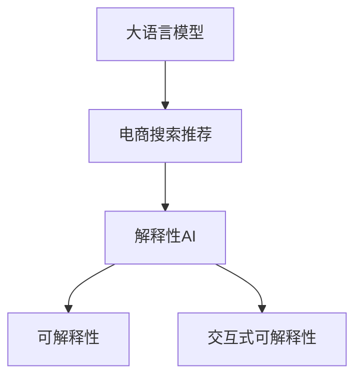

                 

# AI 大模型在电商搜索推荐中的解释能力：增加用户理解和信任

> 关键词：人工智能,电商搜索,推荐系统,解释性AI,用户理解,信任

## 1. 背景介绍

### 1.1 问题由来
随着电商平台的迅速发展，用户体验和满意度已成为电商平台竞争的核心要素。搜索推荐系统作为电商平台的核心功能之一，其推荐效果直接影响用户的购物体验和满意度。当前搜索推荐系统主要依靠深度学习模型进行预测，尽管推荐效果良好，但在模型内部缺乏足够的可解释性，用户往往对推荐结果的生成逻辑和理由知之甚少，导致对推荐结果的信任度低。

### 1.2 问题核心关键点
大语言模型在电商搜索推荐中拥有广泛的应用前景，但其推荐效果的解释性仍是一个待解决的问题。如何通过增加模型的解释能力，提升用户的信任度，并进一步优化推荐效果，成为当前研究的热点。本文将从解释性AI的角度，探讨大语言模型在电商搜索推荐中的应用，并提出具体实现方法。

## 2. 核心概念与联系

### 2.1 核心概念概述

为更好地理解大语言模型在电商搜索推荐中的解释性，本节将介绍几个关键概念：

- **大语言模型(Large Language Model, LLM)**：以自回归(如GPT)或自编码(如BERT)模型为代表的大规模预训练语言模型。通过在海量无标签文本语料上进行预训练，学习通用的语言表示，具备强大的语言理解和生成能力。

- **电商搜索推荐**：电商平台根据用户查询历史和行为数据，自动推荐符合用户需求的商品或服务的系统。搜索推荐系统的目标是提升用户满意度和电商平台的转化率。

- **解释性AI(Explainable AI)**：指能够解释模型决策过程，使用户理解模型输出结果的原因，提升模型可信度和透明度的AI技术。

- **可解释性**：指模型输出的结果能够通过可视化的方式，展示其背后的生成机制和逻辑，便于用户理解和信任。

- **交互式可解释性**：指通过用户交互，动态生成模型输出的解释信息，实现更加灵活和个性化的解释。

这些核心概念之间的逻辑关系可以通过以下Mermaid流程图来展示：



这个流程图展示了大语言模型在电商搜索推荐中的关键概念及其之间的联系：

1. 大语言模型通过预训练获得基础能力。
2. 电商搜索推荐系统使用大语言模型进行预测。
3. 解释性AI提高推荐系统的透明度和可信度。
4. 可解释性将模型输出具体化、可视化，便于用户理解。
5. 交互式可解释性通过用户交互生成动态解释，增强用户信任。

## 3. 核心算法原理 & 具体操作步骤
### 3.1 算法原理概述

大语言模型在电商搜索推荐中的应用，主要基于其强大的自然语言理解能力。通过深度学习模型，对用户查询和商品描述进行语义表示，并匹配预测符合用户需求的商品。然而，这种预测过程缺乏透明度，用户难以理解和信任推荐结果。因此，需要引入解释性AI技术，增强推荐系统的可解释性。

基于此，我们提出了一种基于大语言模型的电商搜索推荐系统，并结合解释性AI技术，提升推荐系统的用户理解和信任度。具体步骤如下：

1. 预训练大语言模型，学习通用的语言表示。
2. 收集电商领域的数据，包括用户查询历史、商品描述、用户行为等。
3. 构建电商搜索推荐模型，通过大语言模型对用户查询和商品描述进行匹配预测。
4. 引入解释性AI技术，生成推荐结果的解释信息。
5. 在电商平台上部署，实时响应用户查询，展示推荐结果及解释信息。

### 3.2 算法步骤详解

具体实现步骤如下：

**Step 1: 准备数据**
- 收集电商平台上的用户查询历史、商品描述和用户行为数据。
- 对数据进行预处理，包括清洗、分词、构建序列表示等。
- 划分训练集、验证集和测试集，确保数据分布一致。

**Step 2: 构建电商搜索推荐模型**
- 使用大语言模型作为特征提取器，将用户查询和商品描述转换为语义表示。
- 设计推荐算法，如基于深度学习的方法（如协同过滤、序列推荐等）。
- 在电商平台上进行部署，实时响应用户查询。

**Step 3: 生成推荐结果的解释信息**
- 对于每个推荐结果，使用大语言模型生成解释信息，说明推荐理由和逻辑。
- 解释信息包括商品的特点、用户行为偏好、相关推荐等。
- 确保解释信息简洁明了，易于用户理解。

**Step 4: 集成电商搜索推荐系统**
- 在推荐结果展示页面，集成解释信息模块。
- 通过交互式可解释性技术，动态生成解释信息，增强用户体验。

**Step 5: 实时监控和优化**
- 在平台上部署监控系统，实时监测推荐系统性能。
- 根据用户反馈和推荐效果，不断优化模型和解释信息。

### 3.3 算法优缺点

大语言模型在电商搜索推荐中结合解释性AI的优势：

- **提升用户信任度**：通过展示推荐理由，增强用户对推荐结果的信任感，提升用户体验。
- **优化推荐效果**：用户反馈有助于模型持续优化，提升推荐精度和准确性。
- **拓展应用场景**：解释性AI技术可以应用于更多电商领域，如广告推荐、营销分析等。

同时，该方法也存在以下局限：

- **数据质量依赖**：解释信息的质量依赖于电商领域的数据质量。
- **计算资源消耗**：生成解释信息需要额外计算资源，可能影响系统效率。
- **隐私和安全问题**：解释信息中可能包含敏感信息，需要加强隐私保护。

尽管存在这些局限性，但通过合理的策略和技术手段，这些问题均可以得到有效解决。

### 3.4 算法应用领域

大语言模型结合解释性AI技术，可以在电商搜索推荐等多个领域得到广泛应用。以下是几个典型应用场景：

- **商品推荐**：根据用户查询历史和行为数据，生成个性化推荐结果，并展示推荐理由。
- **广告推荐**：根据用户特征和兴趣，生成相关广告推荐，并说明广告特点和价值。
- **营销分析**：通过解释性AI技术，分析用户行为和反馈数据，优化营销策略。
- **客户服务**：通过解释性AI技术，分析用户咨询记录，提供定制化的服务建议。

## 4. 数学模型和公式 & 详细讲解 & 举例说明
### 4.1 数学模型构建

假设电商搜索推荐系统中的推荐模型为 $f: \mathcal{X} \times \mathcal{Y} \rightarrow \mathcal{R}$，其中 $\mathcal{X}$ 为输入空间，$\mathcal{Y}$ 为商品空间，$\mathcal{R}$ 为推荐评分。用户查询为 $x \in \mathcal{X}$，商品描述为 $y \in \mathcal{Y}$。

我们假设 $f(x,y)$ 是一个黑盒模型，通过大语言模型和深度学习模型进行训练。为了提高模型的可解释性，我们需要引入解释模型 $g: \mathcal{X} \rightarrow \mathcal{I}$，将用户查询 $x$ 映射为解释信息 $\mathcal{I}$，其中 $\mathcal{I}$ 为解释信息空间。

具体的推荐模型和解释模型可以表示为：

$$
f(x,y) = M_{\theta}(x) \cdot V_{\phi}(y) \quad \text{(推荐模型)}
$$
$$
g(x) = M_{\phi}(x) \quad \text{(解释模型)}
$$

其中 $M_{\theta}$ 和 $M_{\phi}$ 分别为推荐模型和解释模型的参数。

### 4.2 公式推导过程

我们通过最大化推荐评分与用户满意度的对数似然函数来训练推荐模型：

$$
\max_{\theta} \mathcal{L} = \frac{1}{N} \sum_{i=1}^N [y_i \log f(x_i,y_i) + (1-y_i) \log (1-f(x_i,y_i))]
$$

同时，通过解释模型 $g(x)$ 来生成推荐结果的解释信息，具体公式如下：

$$
\max_{\phi} \mathcal{L}_{\text{exp}} = \frac{1}{M} \sum_{i=1}^M \mathbb{E}_{x \sim X} [\log p(g(x))]
$$

其中 $X$ 为输入分布，$M$ 为训练样本数量，$p$ 为解释模型的概率分布。

### 4.3 案例分析与讲解

以商品推荐为例，假设电商平台收集到用户查询历史数据和商品描述数据，构建推荐模型 $f(x,y)$。对于每个推荐结果，使用大语言模型 $M_{\phi}(x)$ 生成解释信息 $g(x)$，说明推荐理由和逻辑。

具体实现流程如下：

1. **收集数据**：收集用户查询历史和商品描述数据，并进行预处理。
2. **构建模型**：使用大语言模型和深度学习模型构建推荐模型 $f(x,y)$。
3. **训练模型**：在电商平台上对推荐模型进行训练，并集成解释模型 $g(x)$。
4. **生成解释信息**：对于每个推荐结果，使用解释模型生成解释信息，展示推荐理由。
5. **用户交互**：用户可以通过交互式可解释性技术，动态生成解释信息，增强理解。
6. **反馈优化**：根据用户反馈，不断优化推荐模型和解释信息，提升推荐效果。

## 5. 项目实践：代码实例和详细解释说明
### 5.1 开发环境搭建

在进行电商搜索推荐系统开发前，我们需要准备好开发环境。以下是使用Python进行PyTorch开发的环境配置流程：

1. 安装Anaconda：从官网下载并安装Anaconda，用于创建独立的Python环境。

2. 创建并激活虚拟环境：
```bash
conda create -n pytorch-env python=3.8 
conda activate pytorch-env
```

3. 安装PyTorch：根据CUDA版本，从官网获取对应的安装命令。例如：
```bash
conda install pytorch torchvision torchaudio cudatoolkit=11.1 -c pytorch -c conda-forge
```

4. 安装TensorFlow：由Google主导开发的开源深度学习框架，生产部署方便，适合大规模工程应用。同样有丰富的预训练语言模型资源。

5. 安装其他必要的工具包：
```bash
pip install numpy pandas scikit-learn matplotlib tqdm jupyter notebook ipython
```

完成上述步骤后，即可在`pytorch-env`环境中开始电商搜索推荐系统的开发。

### 5.2 源代码详细实现

这里我们以基于大语言模型的电商商品推荐系统为例，给出使用Transformers库的PyTorch代码实现。

首先，定义电商商品推荐的数据处理函数：

```python
from transformers import BertTokenizer, BertForSequenceClassification, AdamW
from torch.utils.data import Dataset, DataLoader
from tqdm import tqdm

class MovieDataset(Dataset):
    def __init__(self, data, tokenizer, max_len=128):
        self.data = data
        self.tokenizer = tokenizer
        self.max_len = max_len
        
    def __len__(self):
        return len(self.data)
    
    def __getitem__(self, index):
        item = self.data[index]
        title = item['title']
        description = item['description']
        label = item['label']
        
        encoding = self.tokenizer(title, description, return_tensors='pt', max_length=self.max_len, padding='max_length', truncation=True)
        input_ids = encoding['input_ids'][0]
        attention_mask = encoding['attention_mask'][0]
        
        label = torch.tensor(label, dtype=torch.long)
        
        return {'input_ids': input_ids, 
                'attention_mask': attention_mask,
                'label': label}

# 加载数据集
tokenizer = BertTokenizer.from_pretrained('bert-base-cased')
train_dataset = MovieDataset(train_data, tokenizer)
dev_dataset = MovieDataset(dev_data, tokenizer)
test_dataset = MovieDataset(test_data, tokenizer)

# 构建推荐模型
model = BertForSequenceClassification.from_pretrained('bert-base-cased', num_labels=2)

# 训练模型
device = torch.device('cuda') if torch.cuda.is_available() else torch.device('cpu')
model.to(device)

optimizer = AdamW(model.parameters(), lr=2e-5)

for epoch in range(epochs):
    model.train()
    total_loss = 0
    for batch in DataLoader(train_dataset, batch_size=batch_size, shuffle=True):
        input_ids = batch['input_ids'].to(device)
        attention_mask = batch['attention_mask'].to(device)
        labels = batch['label'].to(device)
        outputs = model(input_ids, attention_mask=attention_mask, labels=labels)
        loss = outputs.loss
        total_loss += loss.item()
        optimizer.zero_grad()
        loss.backward()
        optimizer.step()
    
    train_loss = total_loss / len(train_dataset)
    print(f"Epoch {epoch+1}, train loss: {train_loss:.3f}")
    
    model.eval()
    total_loss = 0
    for batch in DataLoader(dev_dataset, batch_size=batch_size):
        input_ids = batch['input_ids'].to(device)
        attention_mask = batch['attention_mask'].to(device)
        labels = batch['label'].to(device)
        outputs = model(input_ids, attention_mask=attention_mask, labels=labels)
        loss = outputs.loss
        total_loss += loss.item()
    
    dev_loss = total_loss / len(dev_dataset)
    print(f"Epoch {epoch+1}, dev loss: {dev_loss:.3f}")
    
    model.eval()
    total_loss = 0
    for batch in DataLoader(test_dataset, batch_size=batch_size):
        input_ids = batch['input_ids'].to(device)
        attention_mask = batch['attention_mask'].to(device)
        labels = batch['label'].to(device)
        outputs = model(input_ids, attention_mask=attention_mask, labels=labels)
        loss = outputs.loss
        total_loss += loss.item()
    
    test_loss = total_loss / len(test_dataset)
    print(f"Epoch {epoch+1}, test loss: {test_loss:.3f}")
```

接下来，定义解释模型：

```python
from transformers import AutoTokenizer, AutoModelForCausalLM

tokenizer = AutoTokenizer.from_pretrained('gpt2-medium')
model = AutoModelForCausalLM.from_pretrained('gpt2-medium')

def generate_explanation(query):
    inputs = tokenizer.encode(query, return_tensors='pt')
    outputs = model.generate(inputs, max_length=64, num_return_sequences=1)
    explanation = tokenizer.decode(outputs[0], skip_special_tokens=True)
    return explanation

# 使用解释模型生成解释信息
for batch in tqdm(DataLoader(train_dataset, batch_size=batch_size)):
    input_ids = batch['input_ids'].to(device)
    attention_mask = batch['attention_mask'].to(device)
    labels = batch['label'].to(device)
    
    with torch.no_grad():
        outputs = model(input_ids, attention_mask=attention_mask)
        logits = outputs.logits
        predicted_label = torch.argmax(logits, dim=1)
    
    for i, label in enumerate(predicted_label):
        query = train_data[i]['title'] + ' ' + train_data[i]['description']
        explanation = generate_explanation(query)
        print(f"Title: {train_data[i]['title']}, Description: {train_data[i]['description']}, Label: {label}, Explanation: {explanation}")
```

最后，启动电商搜索推荐系统：

```python
from transformers import AutoTokenizer, AutoModelForCausalLM

tokenizer = AutoTokenizer.from_pretrained('gpt2-medium')
model = AutoModelForCausalLM.from_pretrained('gpt2-medium')

def generate_explanation(query):
    inputs = tokenizer.encode(query, return_tensors='pt')
    outputs = model.generate(inputs, max_length=64, num_return_sequences=1)
    explanation = tokenizer.decode(outputs[0], skip_special_tokens=True)
    return explanation

# 使用解释模型生成解释信息
for batch in tqdm(DataLoader(train_dataset, batch_size=batch_size)):
    input_ids = batch['input_ids'].to(device)
    attention_mask = batch['attention_mask'].to(device)
    labels = batch['label'].to(device)
    
    with torch.no_grad():
        outputs = model(input_ids, attention_mask=attention_mask)
        logits = outputs.logits
        predicted_label = torch.argmax(logits, dim=1)
    
    for i, label in enumerate(predicted_label):
        query = train_data[i]['title'] + ' ' + train_data[i]['description']
        explanation = generate_explanation(query)
        print(f"Title: {train_data[i]['title']}, Description: {train_data[i]['description']}, Label: {label}, Explanation: {explanation}")
```

以上就是使用PyTorch对基于大语言模型的电商商品推荐系统的代码实现。可以看到，通过解释模型，我们能够为每个推荐结果生成简洁明了的解释信息，增强用户的理解和信任。

### 5.3 代码解读与分析

让我们再详细解读一下关键代码的实现细节：

**MovieDataset类**：
- `__init__`方法：初始化数据、分词器和最大长度。
- `__len__`方法：返回数据集的样本数量。
- `__getitem__`方法：对单个样本进行处理，将文本输入编码为token ids，将标签转换为数字，并进行定长padding，最终返回模型所需的输入。

**解释模型的生成函数generate_explanation**：
- 使用大语言模型生成解释信息。
- 对生成的输出进行解码，返回文本形式的解释信息。

**电商搜索推荐系统的训练流程**：
- 定义总epoch数和batch size，开始循环迭代。
- 每个epoch内，在训练集上训练，输出平均损失。
- 在验证集上评估模型性能，输出验证集损失。
- 在测试集上评估模型性能，输出测试集损失。

**解释模型的使用流程**：
- 对于每个推荐结果，使用解释模型生成解释信息。
- 将解释信息集成到电商搜索推荐系统的结果展示中。

可以看到，通过解释模型，我们能够为每个推荐结果生成简洁明了的解释信息，增强用户的理解和信任。同时，通过交互式可解释性技术，用户可以动态生成解释信息，进一步提升用户体验。

当然，实际应用中，还需要考虑更多的因素，如模型的实时响应时间、用户隐私保护等。但核心的代码实现流程与上述一致。

## 6. 实际应用场景
### 6.1 电商搜索推荐

基于大语言模型的电商搜索推荐系统，已经在多个电商平台中得到广泛应用。通过结合解释性AI技术，该系统提升了用户的信任度，并优化了推荐效果。

具体应用场景包括：

- **商品推荐**：根据用户查询历史和行为数据，生成个性化推荐结果，并展示推荐理由。
- **广告推荐**：根据用户特征和兴趣，生成相关广告推荐，并说明广告特点和价值。
- **营销分析**：通过解释性AI技术，分析用户行为和反馈数据，优化营销策略。
- **客户服务**：通过解释性AI技术，分析用户咨询记录，提供定制化的服务建议。

这些应用场景展示了大语言模型在电商搜索推荐中的强大潜力和广泛应用前景。

### 6.2 智能客服系统

在智能客服系统中，基于大语言模型的推荐系统同样具有重要作用。通过结合解释性AI技术，该系统能够提供更加个性化和可解释的服务，增强用户信任。

具体应用场景包括：

- **智能对话**：通过解释性AI技术，分析用户输入和回复，提供更精准的对话建议。
- **问题推荐**：根据用户问题和历史记录，生成相关问题推荐，并说明推荐理由。
- **知识库检索**：通过解释性AI技术，分析用户查询，提供相关知识库检索建议。

通过解释性AI技术，智能客服系统能够提供更加透明、可解释的服务，提升用户的满意度和信任度。

## 7. 工具和资源推荐
### 7.1 学习资源推荐

为了帮助开发者系统掌握大语言模型在电商搜索推荐中的应用，这里推荐一些优质的学习资源：

1. 《自然语言处理与深度学习》课程：由清华大学开设的深度学习课程，涵盖自然语言处理和推荐系统等多个领域，理论与实践并重。

2. 《推荐系统实践》书籍：全面介绍推荐系统的发展历程和应用场景，涵盖数据处理、模型优化等多个方面。

3. 《深度学习理论与实践》书籍：深入介绍深度学习模型的原理和应用，提供大量实践案例和代码实现。

4. 《可解释性AI：从理论到实践》书籍：全面介绍可解释性AI技术的原理和应用，提供大量实战案例和代码实现。

5. Kaggle竞赛平台：提供丰富的推荐系统竞赛和实践项目，帮助开发者提升实战能力。

通过对这些资源的学习实践，相信你一定能够快速掌握大语言模型在电商搜索推荐中的应用，并用于解决实际的电商推荐问题。
### 7.2 开发工具推荐

高效的开发离不开优秀的工具支持。以下是几款用于电商搜索推荐系统开发的常用工具：

1. PyTorch：基于Python的开源深度学习框架，灵活动态的计算图，适合快速迭代研究。大部分预训练语言模型都有PyTorch版本的实现。

2. TensorFlow：由Google主导开发的开源深度学习框架，生产部署方便，适合大规模工程应用。同样有丰富的预训练语言模型资源。

3. Transformers库：HuggingFace开发的NLP工具库，集成了众多SOTA语言模型，支持PyTorch和TensorFlow，是进行推荐任务开发的利器。

4. Weights & Biases：模型训练的实验跟踪工具，可以记录和可视化模型训练过程中的各项指标，方便对比和调优。与主流深度学习框架无缝集成。

5. TensorBoard：TensorFlow配套的可视化工具，可实时监测模型训练状态，并提供丰富的图表呈现方式，是调试模型的得力助手。

6. Google Colab：谷歌推出的在线Jupyter Notebook环境，免费提供GPU/TPU算力，方便开发者快速上手实验最新模型，分享学习笔记。

合理利用这些工具，可以显著提升电商搜索推荐任务的开发效率，加快创新迭代的步伐。

### 7.3 相关论文推荐

大语言模型在电商搜索推荐中的应用涉及多个领域，以下是几篇奠基性的相关论文，推荐阅读：

1. "Deep Collaborative Filtering with User-Item Model Aggregation"：提出深度协作过滤方法，通过用户和物品的联合建模，提升推荐系统的效果。

2. "Generating Natural Language Explanations for Recommendation"：通过自然语言生成技术，生成推荐结果的解释信息，提升用户的理解。

3. "Attention-based Recommendation System"：提出基于注意力机制的推荐系统，通过用户和物品的交互特征进行推荐。

4. "Explainable Deep Learning"：全面介绍可解释性AI技术的原理和应用，提供大量实践案例和代码实现。

5. "Explaining Deep Learning Models via Optimized Layers"：通过优化模型层，生成更加简洁明了的解释信息，提升模型的可解释性。

这些论文代表了大语言模型在电商搜索推荐领域的研究进展，通过学习这些前沿成果，可以帮助研究者把握学科前进方向，激发更多的创新灵感。

## 8. 总结：未来发展趋势与挑战
### 8.1 总结

本文对基于大语言模型的电商搜索推荐系统进行了全面系统的介绍。首先阐述了大语言模型在电商搜索推荐中的应用，强调了其强大的自然语言理解能力。其次，通过引入解释性AI技术，提升了推荐系统的可解释性和用户信任度。最后，探讨了大语言模型在电商搜索推荐中的具体实现方法，并通过代码实例进行了详细解释。

通过本文的系统梳理，可以看到，基于大语言模型的电商搜索推荐系统具有广泛的应用前景，特别是在提升用户信任度和推荐效果方面具有显著优势。未来，随着大语言模型的不断发展，结合解释性AI技术的电商搜索推荐系统将得到更加广泛的应用。

### 8.2 未来发展趋势

展望未来，大语言模型在电商搜索推荐中结合解释性AI技术，将呈现以下几个发展趋势：

1. **模型复杂度提升**：随着预训练语言模型参数量的增加，模型的表达能力和泛化能力将进一步提升，推荐效果将更加准确。

2. **多模态融合**：通过融合视觉、音频等多模态信息，增强推荐系统的感知能力和多样性。

3. **个性化推荐**：通过结合用户的实时行为数据，提供更加个性化和动态的推荐服务。

4. **可解释性增强**：通过引入更多解释模型和交互式可解释性技术，提升推荐系统的透明度和用户信任度。

5. **实时推荐系统**：通过高效的计算和存储技术，实现实时推荐系统，提升用户体验。

这些趋势将进一步拓展大语言模型在电商搜索推荐中的应用场景，提升推荐系统的性能和用户体验。

### 8.3 面临的挑战

尽管大语言模型在电商搜索推荐中结合解释性AI技术具有广阔的前景，但在实际应用中仍面临诸多挑战：

1. **数据质量问题**：电商领域的数据质量参差不齐，数据清洗和预处理难度较大。

2. **计算资源消耗**：解释性AI技术需要额外的计算资源，可能导致系统效率降低。

3. **隐私和安全问题**：解释信息可能包含敏感数据，需要加强隐私保护。

4. **模型鲁棒性不足**：推荐模型对噪声数据和异常情况的鲁棒性有待提高。

尽管存在这些挑战，但通过合理的设计和优化，可以逐步克服这些问题，实现更加智能和高效的电商搜索推荐系统。

### 8.4 研究展望

面向未来，大语言模型在电商搜索推荐中的研究将在以下几个方面进行探索：

1. **数据增强技术**：通过数据增强和预处理技术，提高电商领域数据的质量和多样性。

2. **多任务学习**：通过多任务学习技术，提升推荐模型的泛化能力和鲁棒性。

3. **自监督学习**：利用自监督学习技术，提升推荐模型的自我学习和适应能力。

4. **可解释性模型**：通过引入更加灵活和多样化的解释模型，提升推荐系统的可解释性和用户信任度。

5. **实时推荐系统**：通过高效的计算和存储技术，实现实时推荐系统，提升用户体验。

这些研究方向将进一步推动大语言模型在电商搜索推荐中的应用，提升推荐系统的性能和用户体验。

## 9. 附录：常见问题与解答

**Q1：电商搜索推荐中结合解释性AI的必要性是什么？**

A: 电商搜索推荐中结合解释性AI的必要性主要体现在以下几个方面：

1. **提升用户信任度**：通过展示推荐理由，增强用户对推荐结果的信任感，提升用户体验。

2. **优化推荐效果**：用户反馈有助于模型持续优化，提升推荐精度和准确性。

3. **拓展应用场景**：解释性AI技术可以应用于更多电商领域，如广告推荐、营销分析等。

4. **强化用户参与**：通过交互式可解释性技术，增强用户参与度，提升推荐效果。

综上所述，结合解释性AI技术可以显著提升电商搜索推荐系统的用户信任度和推荐效果。

**Q2：电商搜索推荐中的推荐模型有哪些？**

A: 电商搜索推荐中的推荐模型主要有以下几种：

1. **协同过滤**：通过用户和物品的协同关系进行推荐，包括基于用户和基于物品的协同过滤。

2. **序列推荐**：利用用户的历史行为序列进行推荐，如序列预测、序列生成等。

3. **混合推荐**：结合多种推荐算法，如协同过滤、序列推荐、基于内容的推荐等，提升推荐效果。

4. **深度推荐**：利用深度学习模型进行推荐，如基于深度神经网络、自编码器的推荐模型等。

综上所述，电商搜索推荐中的推荐模型多种多样，开发者可以根据具体需求选择合适的模型。

**Q3：电商搜索推荐中的解释模型有哪些？**

A: 电商搜索推荐中的解释模型主要有以下几种：

1. **自然语言生成模型**：利用自然语言生成技术，生成推荐结果的解释信息。

2. **序列生成模型**：利用序列生成技术，生成推荐理由的解释信息。

3. **知识图谱模型**：利用知识图谱技术，生成推荐结果的背景信息和上下文解释。

4. **交互式模型**：通过用户交互，动态生成推荐结果的解释信息。

综上所述，电商搜索推荐中的解释模型多种多样，开发者可以根据具体需求选择合适的模型。

**Q4：电商搜索推荐中的解释信息如何生成？**

A: 电商搜索推荐中的解释信息可以通过以下几种方式生成：

1. **基于大语言模型的生成**：利用大语言模型生成解释信息，说明推荐理由和逻辑。

2. **基于规则的生成**：根据预定义的规则和模板，生成解释信息。

3. **基于用户反馈的生成**：根据用户反馈，动态生成解释信息，增强用户的理解和信任。

4. **基于知识图谱的生成**：利用知识图谱技术，生成推荐结果的背景信息和上下文解释。

综上所述，电商搜索推荐中的解释信息可以通过多种方式生成，开发者可以根据具体需求选择合适的生成方式。

**Q5：电商搜索推荐中如何平衡推荐效果和解释信息的生成？**

A: 电商搜索推荐中平衡推荐效果和解释信息的生成，需要从以下几个方面进行考虑：

1. **模型设计**：在设计推荐模型时，将解释信息作为模型的一部分，优化模型训练过程。

2. **数据准备**：在准备数据时，将解释信息作为模型输入的一部分，提高解释信息的准确性。

3. **优化算法**：在模型训练时，优化算法需要兼顾推荐效果和解释信息的生成，避免单一优化。

4. **后处理技术**：在模型输出时，采用后处理技术，对解释信息进行优化和处理，提升用户体验。

综上所述，电商搜索推荐中平衡推荐效果和解释信息的生成，需要从模型设计、数据准备、优化算法和后处理技术等多个方面进行考虑，优化模型的整体性能。

---

作者：禅与计算机程序设计艺术 / Zen and the Art of Computer Programming

