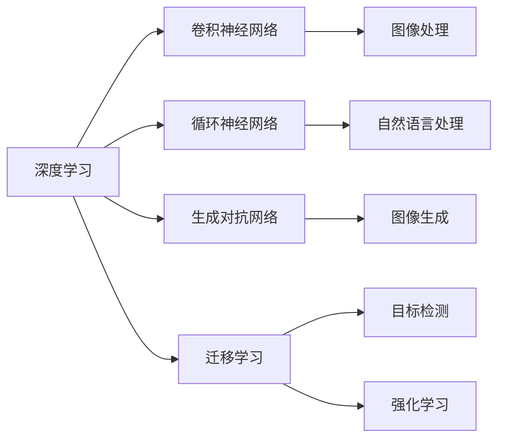

                 

# AI 时代的竞争：保持领先地位

在迅猛发展的AI时代，保持技术的领先地位对于任何企业、组织甚至个人都至关重要。本文将深入探讨如何在AI竞争激烈的环境中脱颖而出，通过全面理解核心概念、算法原理、实践操作、应用场景以及未来的发展趋势，为读者提供全方位的技术指导。

## 1. 背景介绍

### 1.1 问题由来

随着人工智能技术的快速发展和广泛应用，越来越多的行业开始采用AI技术进行转型升级。在AI领域，无论是企业、研究机构还是个人开发者，都面临着激烈的市场竞争。如何在这场竞争中保持领先地位，成为各行各业共同关注的话题。

### 1.2 问题核心关键点

在AI时代，技术领先的关键点主要包括：

1. **数据质量与规模**：AI模型性能很大程度上取决于训练数据的质量和规模。高质量的数据集能够使模型学习到更丰富的特征，从而提高性能。
2. **算法与架构**：高效的算法和架构设计是提升模型性能的关键。优秀的算法和架构能够充分利用计算资源，加速模型训练和推理。
3. **计算资源**：高性能的计算资源是训练和部署复杂模型不可或缺的条件。随着模型规模的增大，计算资源的需求也在不断增加。
4. **跨领域应用**：将AI技术应用到不同领域，提升业务效率和创新能力，是保持竞争力的重要途径。
5. **人才与团队**：具备先进理念和技术的人才队伍，是实现技术领先的关键因素。优秀的团队能够不断进行技术创新和改进。

### 1.3 问题研究意义

保持技术领先不仅能帮助企业在市场中占据优势，还能推动行业的整体发展。AI技术的领先将带来新一轮的技术创新和商业变革，加速各行各业的数字化转型。

## 2. 核心概念与联系

### 2.1 核心概念概述

为了更好地理解如何在AI时代保持领先地位，本节将介绍几个关键概念及其相互联系：

- **深度学习(Deep Learning)**：利用神经网络对大量数据进行学习，以自动提取特征的一种机器学习方法。
- **卷积神经网络(CNN)**：用于处理具有网格结构数据的深度学习模型，广泛应用于图像和视频处理。
- **循环神经网络(RNN)**：用于处理序列数据的深度学习模型，具有记忆功能，适用于自然语言处理等任务。
- **迁移学习(Transfer Learning)**：利用在某一任务上已学习的模型参数，在新任务上进行微调，以提升模型性能。
- **目标检测(Objet Detection)**：识别图像或视频中的物体，并定位其位置的任务。
- **生成对抗网络(GANs)**：由生成器和判别器组成的深度学习模型，用于生成逼真的图像、音频等。
- **强化学习(Reinforcement Learning)**：通过与环境的交互，使模型学习最优决策的机器学习方法。

这些概念之间的联系主要体现在深度学习框架和模型的通用性上。深度学习框架，如TensorFlow、PyTorch等，可以支持多种神经网络模型的构建和训练，包括CNN、RNN、GANs等。迁移学习、目标检测、强化学习等则是深度学习在特定任务上的应用，通过不同模型的微调和融合，能够实现更高效、更泛化的AI应用。

### 2.2 核心概念原理和架构的 Mermaid 流程图



这个流程图展示了深度学习及其主要分支模型在图像、自然语言处理和生成等任务中的具体应用，以及迁移学习、目标检测和强化学习等深度学习技术在这些领域中的广泛应用。

## 3. 核心算法原理 & 具体操作步骤

### 3.1 算法原理概述

在AI时代保持领先地位的核心算法原理包括但不限于以下几种：

- **卷积神经网络(CNN)**：利用卷积操作提取图像特征，适用于图像分类、目标检测等任务。
- **循环神经网络(RNN)**：通过时间步进的方式处理序列数据，适用于语言模型、机器翻译等任务。
- **生成对抗网络(GANs)**：通过生成器和判别器的对抗训练，生成高质量的图像、音频等。
- **迁移学习**：利用预训练模型在不同任务上的知识迁移，提升模型性能。
- **强化学习**：通过与环境的交互，优化模型决策策略，适用于游戏AI、机器人控制等任务。

### 3.2 算法步骤详解

在实际应用中，保持技术领先地位需要经过以下几个关键步骤：

**Step 1: 数据收集与预处理**

- 收集高质量的数据集，包括图像、文本、音频等。
- 对数据进行清洗、标注，确保数据质量。
- 使用数据增强技术，扩充数据集规模，提升模型泛化能力。

**Step 2: 模型选择与训练**

- 根据任务需求，选择合适的深度学习模型（如CNN、RNN、GANs等）。
- 使用高效的深度学习框架，如TensorFlow、PyTorch等，搭建模型。
- 设置合适的超参数，包括学习率、批大小、迭代轮数等。
- 使用GPU/TPU等高性能计算资源，进行模型训练。

**Step 3: 模型微调与优化**

- 在预训练模型的基础上，进行微调，提升模型性能。
- 使用正则化技术，如L2正则、Dropout等，防止过拟合。
- 引入对抗训练，提高模型鲁棒性。
- 使用优化算法，如Adam、SGD等，加速模型收敛。

**Step 4: 模型部署与评估**

- 将训练好的模型部署到生产环境中，进行实时推理。
- 使用A/B测试等方法，评估模型性能。
- 收集用户反馈，不断优化模型。

**Step 5: 持续改进与创新**

- 定期更新数据集，保持模型的最新性能。
- 引入新技术，如注意力机制、自监督学习等，提升模型能力。
- 跨领域应用，将模型应用于不同场景，提升业务效率。

### 3.3 算法优缺点

保持技术领先地位的算法具有以下优点：

- **高效性**：深度学习算法能够高效地处理大规模数据，提升模型性能。
- **泛化能力**：通过迁移学习、目标检测等技术，模型能够适应不同任务和数据分布。
- **创新性**：强化学习等技术能够实现自主学习和创新，不断提升模型能力。

同时，这些算法也存在一定的局限性：

- **数据依赖**：深度学习算法对数据质量有较高要求，数据采集和标注成本较高。
- **计算资源需求**：训练大规模模型需要高性能计算资源，成本较高。
- **模型复杂性**：深度学习模型结构复杂，调试和优化难度较大。

### 3.4 算法应用领域

在实际应用中，保持技术领先地位的算法已经在多个领域得到了广泛应用：

- **计算机视觉**：通过CNN等模型，实现图像分类、目标检测、人脸识别等任务。
- **自然语言处理**：通过RNN、Transformer等模型，实现语言模型、机器翻译、情感分析等任务。
- **游戏AI**：通过强化学习等技术，实现游戏中的智能决策。
- **机器人控制**：通过强化学习等技术，实现机器人的自主导航和操作。
- **自动驾驶**：通过目标检测等技术，实现车辆感知和决策。

## 4. 数学模型和公式 & 详细讲解 & 举例说明

### 4.1 数学模型构建

在AI模型训练过程中，数学模型构建是非常重要的一环。以卷积神经网络为例，其数学模型可以表示为：

$$
y = \sigma(W \ast x + b)
$$

其中，$x$ 为输入数据，$y$ 为输出结果，$W$ 为卷积核，$\ast$ 表示卷积操作，$\sigma$ 为激活函数，$b$ 为偏置项。

### 4.2 公式推导过程

卷积神经网络的公式推导涉及卷积运算、激活函数、池化操作等。以卷积层为例，其公式推导如下：

$$
y_{i,j} = \sum_{k=-r}^{r} \sum_{l=-r}^{r} w_{k,l} \cdot x_{i+k,j+l}
$$

其中，$y_{i,j}$ 为输出特征图上的每个元素，$x_{i+k,j+l}$ 为输入数据对应的元素，$w_{k,l}$ 为卷积核对应的元素。

### 4.3 案例分析与讲解

以图像分类任务为例，使用CNN进行图像分类。首先，将图像数据输入卷积层，通过卷积操作提取特征，然后将其输入池化层进行降维，最后输入全连接层进行分类。整个过程可以使用TensorFlow等深度学习框架实现。

```python
import tensorflow as tf

# 定义卷积神经网络模型
def conv_net(x, n_classes, dropout_rate):
    x = tf.reshape(x, [-1, 28, 28, 1])
    conv1 = tf.layers.conv2d(x, 32, 5, activation=tf.nn.relu)
    pool1 = tf.layers.max_pooling2d(conv1, 2, 2)
    conv2 = tf.layers.conv2d(pool1, 64, 3, activation=tf.nn.relu)
    pool2 = tf.layers.max_pooling2d(conv2, 2, 2)
    fc1 = tf.contrib.layers.flatten(pool2)
    fc1 = tf.layers.dense(fc1, 1024, activation=tf.nn.relu)
    dropout = tf.layers.dropout(fc1, rate=dropout_rate, training=True)
    out = tf.layers.dense(dropout, n_classes, activation=None)
    return out

# 构建模型并训练
model = tf.keras.Sequential([
    tf.keras.layers.Conv2D(32, (3, 3), activation='relu', input_shape=(28, 28, 1)),
    tf.keras.layers.MaxPooling2D((2, 2)),
    tf.keras.layers.Conv2D(64, (3, 3), activation='relu'),
    tf.keras.layers.MaxPooling2D((2, 2)),
    tf.keras.layers.Flatten(),
    tf.keras.layers.Dense(512, activation='relu'),
    tf.keras.layers.Dropout(0.5),
    tf.keras.layers.Dense(10, activation='softmax')
])

model.compile(optimizer='adam',
              loss='categorical_crossentropy',
              metrics=['accuracy'])

model.fit(train_images, train_labels, epochs=10, validation_data=(test_images, test_labels))
```

## 5. 项目实践：代码实例和详细解释说明

### 5.1 开发环境搭建

在进行AI项目实践前，需要准备以下开发环境：

1. **Python**：选择Python 3.x版本，推荐使用Anaconda进行环境管理。
2. **深度学习框架**：选择TensorFlow或PyTorch等深度学习框架，使用pip或conda安装。
3. **GPU/TPU**：使用NVIDIA GPU或Google Cloud TPU等高性能计算资源。
4. **数据集**：收集和处理高质量的数据集，存储在本地或云存储中。

### 5.2 源代码详细实现

以图像分类任务为例，使用TensorFlow进行模型训练和推理。首先，加载并预处理数据集，然后构建卷积神经网络模型，并进行训练和评估。

```python
import tensorflow as tf
from tensorflow.keras.datasets import mnist
from tensorflow.keras.utils import to_categorical

# 加载数据集
(train_images, train_labels), (test_images, test_labels) = mnist.load_data()

# 数据预处理
train_images = train_images.reshape((60000, 28, 28, 1))
train_images = train_images / 255.0
test_images = test_images.reshape((10000, 28, 28, 1))
test_images = test_images / 255.0
train_labels = to_categorical(train_labels, 10)
test_labels = to_categorical(test_labels, 10)

# 构建模型
model = tf.keras.Sequential([
    tf.keras.layers.Conv2D(32, (3, 3), activation='relu', input_shape=(28, 28, 1)),
    tf.keras.layers.MaxPooling2D((2, 2)),
    tf.keras.layers.Conv2D(64, (3, 3), activation='relu'),
    tf.keras.layers.MaxPooling2D((2, 2)),
    tf.keras.layers.Flatten(),
    tf.keras.layers.Dense(512, activation='relu'),
    tf.keras.layers.Dropout(0.5),
    tf.keras.layers.Dense(10, activation='softmax')
])

# 编译模型
model.compile(optimizer='adam',
              loss='categorical_crossentropy',
              metrics=['accuracy'])

# 训练模型
model.fit(train_images, train_labels, epochs=10, validation_data=(test_images, test_labels))
```

### 5.3 代码解读与分析

上述代码展示了卷积神经网络的基本构建和训练过程。首先，加载并预处理MNIST数据集，然后进行模型构建，包括卷积层、池化层、全连接层等。最后，使用Adam优化器进行模型训练，并在测试集上进行评估。

## 6. 实际应用场景

### 6.1 智能监控系统

在智能监控系统中，使用AI技术进行目标检测和行为分析，可以实时监测环境中的异常情况，提高安全性和效率。例如，在视频监控中，可以使用目标检测算法识别行人、车辆等目标，并通过行为分析技术判断是否存在异常行为。

### 6.2 智能推荐系统

智能推荐系统利用AI技术，通过分析用户行为和偏好，推荐符合用户兴趣的内容。例如，在电商平台上，根据用户浏览和购买记录，推荐相似商品；在视频平台上，根据用户观看历史，推荐相关视频。

### 6.3 自动驾驶

自动驾驶技术利用AI技术进行环境感知和决策，实现车辆自主导航和操作。例如，使用目标检测算法进行障碍物检测，使用强化学习进行驾驶策略优化，实现自动驾驶功能。

### 6.4 未来应用展望

未来，AI技术将在更多领域得到应用，提升各行业的智能化水平。例如，在医疗领域，利用AI进行疾病诊断和治疗方案推荐；在金融领域，利用AI进行风险评估和投资策略优化；在教育领域，利用AI进行个性化学习和教学资源推荐。

## 7. 工具和资源推荐

### 7.1 学习资源推荐

为了帮助读者掌握AI技术的核心概念和实践技巧，以下是一些优质的学习资源：

1. **深度学习与神经网络**：由斯坦福大学Andrew Ng教授主讲，涵盖深度学习基础和神经网络理论。
2. **TensorFlow官方文档**：详细介绍了TensorFlow框架的使用方法，包括模型构建、训练和部署等。
3. **PyTorch官方文档**：详细介绍了PyTorch框架的使用方法，包括模型构建、训练和部署等。
4. **Kaggle竞赛**：参与Kaggle竞赛，可以学习到实际项目的实践经验和数据分析技能。
5. **arXiv论文库**：阅读最新的AI研究论文，了解AI领域的前沿技术。

### 7.2 开发工具推荐

以下是几款用于AI项目开发的常用工具：

1. **Jupyter Notebook**：支持Python和其他语言的交互式开发和调试。
2. **TensorBoard**：可视化模型训练和推理过程，帮助理解和调试模型。
3. **Weights & Biases**：记录和可视化模型训练过程，进行实验管理和比较。
4. **Google Colab**：免费提供GPU和TPU算力，支持Python开发和协作。
5. **OpenCV**：开源计算机视觉库，支持图像处理和目标检测等任务。

### 7.3 相关论文推荐

以下是几篇具有代表性的AI领域论文，推荐阅读：

1. **ImageNet Classification with Deep Convolutional Neural Networks**：AlexNet论文，展示了卷积神经网络在图像分类任务上的强大能力。
2. **Long Short-Term Memory**：LSTM论文，介绍了循环神经网络在序列数据处理中的有效应用。
3. **Generative Adversarial Nets**：GANs论文，展示了生成对抗网络在图像生成任务上的创新性。
4. **Attention is All You Need**：Transformer论文，展示了注意力机制在机器翻译任务中的有效应用。
5. **AlphaGo Zero**：AlphaGo Zero论文，展示了强化学习在棋类游戏中的突破性应用。

## 8. 总结：未来发展趋势与挑战

### 8.1 研究成果总结

本文从背景介绍、核心概念、算法原理、项目实践等多个方面，全面介绍了如何在AI时代保持技术领先地位。通过理解深度学习、卷积神经网络、循环神经网络、迁移学习等核心概念，掌握模型构建、训练、微调等具体操作步骤，能够在实际应用中灵活应用AI技术。

### 8.2 未来发展趋势

未来，AI技术将在更多领域得到应用，推动各行各业的智能化升级。以下是对未来发展趋势的几点展望：

1. **自动化和智能化**：自动化和智能化将进一步提升各行业的生产效率和决策能力。例如，自动驾驶、智能制造等技术将改变传统工业的生产模式。
2. **跨领域融合**：AI技术与物联网、大数据等技术相结合，实现跨领域的智能化应用。例如，智慧城市、智慧医疗等领域的全面应用。
3. **伦理与隐私**：AI技术的发展需要考虑伦理和隐私问题，确保技术的可解释性和安全性。例如，在医疗、金融等高风险领域，确保模型的透明度和可解释性。

### 8.3 面临的挑战

尽管AI技术的发展前景广阔，但在实际应用中仍面临以下挑战：

1. **数据获取与标注**：高质量数据的获取和标注成本较高，数据分布不均衡的问题需要进一步解决。
2. **计算资源需求**：大规模模型的训练和推理需要高性能计算资源，硬件成本较高。
3. **模型复杂性**：深度学习模型的结构和参数复杂，调试和优化难度较大。
4. **可解释性**：深度学习模型的黑盒特性需要解决，确保模型的透明度和可解释性。

### 8.4 研究展望

未来的研究需要在以下几个方向进行突破：

1. **高效模型**：开发更高效的深度学习模型，降低计算资源需求，提高模型训练和推理效率。
2. **可解释性**：开发可解释性更好的AI模型，确保模型决策的透明性和可理解性。
3. **跨领域应用**：将AI技术应用于更多领域，推动各行业的智能化升级。
4. **伦理与隐私**：在AI技术的研发和应用中，考虑伦理和隐私问题，确保技术的安全性和公平性。

## 9. 附录：常见问题与解答

**Q1：AI技术在各个行业的应用前景如何？**

A: AI技术在各行业的应用前景非常广阔，涵盖医疗、金融、制造、零售等多个领域。例如，在医疗领域，AI技术可以用于疾病诊断、治疗方案推荐等；在金融领域，AI技术可以用于风险评估、投资策略优化等；在制造领域，AI技术可以用于智能制造、供应链管理等。

**Q2：如何选择合适的AI算法和模型？**

A: 选择合适的AI算法和模型需要根据具体任务和数据特点进行。例如，对于图像分类任务，可以选择卷积神经网络；对于序列数据处理，可以选择循环神经网络；对于生成任务，可以选择生成对抗网络等。同时，需要考虑数据质量、计算资源、模型复杂性等因素，综合选择最适合的算法和模型。

**Q3：AI技术的伦理与隐私问题如何解决？**

A: AI技术的伦理与隐私问题需要从技术和管理两个方面进行解决。在技术层面，需要确保模型的透明性和可解释性，避免黑盒决策；在管理层面，需要建立伦理和隐私保护机制，确保技术的安全性和公平性。例如，在医疗、金融等高风险领域，需要严格控制数据的隐私和安全性。

**Q4：AI技术在实际应用中需要注意哪些问题？**

A: 在实际应用中，AI技术需要注意以下问题：
1. 数据质量与标注：确保数据的高质量与标注的准确性。
2. 计算资源需求：合理使用计算资源，避免过拟合和资源浪费。
3. 模型复杂性：控制模型的复杂性，确保模型的可解释性和可维护性。
4. 伦理与隐私：考虑伦理和隐私问题，确保技术的安全性和公平性。

**Q5：AI技术未来发展的趋势是什么？**

A: AI技术未来的发展趋势包括：
1. 自动化和智能化：进一步提升各行业的生产效率和决策能力。
2. 跨领域融合：AI技术与物联网、大数据等技术相结合，实现跨领域的智能化应用。
3. 伦理与隐私：在AI技术的研发和应用中，考虑伦理和隐私问题，确保技术的安全性和公平性。
4. 高效模型：开发更高效的深度学习模型，降低计算资源需求，提高模型训练和推理效率。
5. 可解释性：开发可解释性更好的AI模型，确保模型决策的透明性和可理解性。

---

作者：禅与计算机程序设计艺术 / Zen and the Art of Computer Programming

