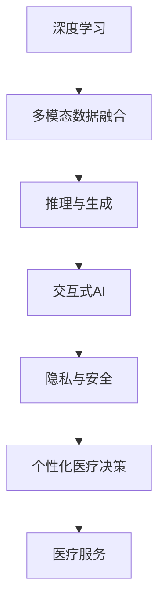

                 

# AIGC助力个性化医疗发展

## 1. 背景介绍

### 1.1 问题由来

近年来，随着人工智能和大数据技术的飞速发展，人工智能在医疗领域的应用日益增多。人工智能技术被广泛应用于医学影像分析、病理学诊断、药物研发、医疗辅助决策等诸多方面。

特别是近年来兴起的人工智能生成内容(AIGC)技术，正逐步渗透到医疗领域。AIGC技术通过对大数据的深度学习，能够自动生成高质量的医疗文本、医学图像等，极大地提升了医疗服务的质量和效率。

但传统的基于静态数据分析的医疗决策方法，难以应对复杂多变的患者情况和临床环境。尤其是面对个性化医疗需求日益增长的今天，如何利用AIGC技术进行个性化医疗发展，成为了亟待解决的问题。

### 1.2 问题核心关键点

AIGC在个性化医疗发展中的核心关键点包括：

1. **数据融合与知识整合**：个性化医疗需要充分利用多种数据源，如电子健康记录、基因数据、医学文献等，并整合这些数据，形成对患者全面、准确的表征。

2. **推理与生成能力**：AIGC能够根据患者的具体情况，自动生成个性化的医疗方案，并对其适用性进行推理和验证。

3. **可解释性**：个性化医疗方案的生成过程需要具备可解释性，确保医疗决策过程透明、可理解。

4. **交互式体验**：AIGC技术能够与医疗人员和患者进行交互，获取反馈信息，动态调整医疗方案。

5. **隐私与安全**：个性化医疗数据涉及敏感信息，需要确保数据的安全存储与访问控制。

6. **伦理合规**：个性化医疗方案的生成需要遵循伦理准则，确保决策过程符合医疗法规和道德规范。

## 2. 核心概念与联系

### 2.1 核心概念概述

AIGC技术在个性化医疗发展中的应用涉及多个关键概念：

- **人工智能生成内容(AIGC)**：指通过人工智能技术生成高质量的文本、图像、音频等内容的范式。
- **深度学习**：通过深度神经网络，对数据进行学习，自动提取特征和模式。
- **多模态数据融合**：结合不同类型的数据源，如文本、图像、基因数据等，进行数据整合与分析。
- **推理与生成**：利用自然语言推理、图像生成等技术，自动生成个性化的医疗方案。
- **交互式AI**：构建与用户交互的AI系统，获取用户反馈，动态调整医疗方案。
- **隐私与安全**：保护患者隐私，确保医疗数据的安全与合法使用。

这些核心概念之间有着紧密的联系，共同构建了AIGC在个性化医疗发展的应用框架：

1. **深度学习**：深度学习为AIGC提供了强大的数据处理和特征提取能力，是构建高质量生成模型的基础。
2. **多模态数据融合**：多种类型数据的整合分析，使得AIGC能够更加全面地理解患者状况，生成个性化的医疗方案。
3. **推理与生成**：推理与生成能力为AIGC提供了自动决策和方案生成的手段，确保医疗方案的科学性和适用性。
4. **交互式AI**：通过与用户的交互，AIGC可以获取患者的个性化需求，进行动态调整和优化。
5. **隐私与安全**：隐私与安全技术保障了数据使用的合法性，确保了医疗决策的透明度和可解释性。

这些概念通过AIGC技术，构建了一个完整的个性化医疗发展框架，帮助医生和患者共同参与医疗决策，提升了医疗服务的质量和效率。

### 2.2 核心概念原理和架构的 Mermaid 流程图



此图表展示了AIGC在个性化医疗发展的应用流程：深度学习技术处理多模态数据，推理与生成能力生成个性化医疗方案，交互式AI获取用户反馈，隐私与安全技术保障数据使用安全，最终生成个性化医疗决策，提供高质量的医疗服务。

## 3. 核心算法原理 & 具体操作步骤

### 3.1 算法原理概述

基于AIGC的个性化医疗决策，主要是通过深度学习模型对多种数据源进行整合，并通过推理与生成技术生成个性化医疗方案。其主要流程如下：

1. **数据预处理**：收集和处理多种类型的数据，如电子健康记录、基因数据、医学文献等，形成结构化数据集。
2. **特征提取**：通过深度学习模型，从结构化数据中提取特征，用于生成个性化医疗方案。
3. **模型训练**：利用大规模数据集训练深度学习模型，提高其对医疗数据的理解能力。
4. **推理与生成**：根据患者的具体情况，使用推理与生成技术生成个性化医疗方案，并对其适用性进行验证。
5. **交互式反馈**：通过与患者和医生的交互，获取反馈信息，动态调整医疗方案。

### 3.2 算法步骤详解

#### 3.2.1 数据预处理

数据预处理是AIGC在个性化医疗中的第一步。其核心在于对各种类型的数据进行清洗和整合，形成可用于模型训练的数据集。具体步骤包括：

1. **数据收集**：从医院、实验室、基因库等收集患者的电子健康记录、基因数据、医学文献等。
2. **数据清洗**：对数据进行去重、补全、异常值处理等操作，确保数据质量。
3. **数据标注**：对数据进行标注，如病历描述、基因型、临床结果等。
4. **数据转换**：将不同类型的数据转换为可用于深度学习模型处理的形式，如文本数据向向量表示转换。

#### 3.2.2 特征提取

特征提取是AIGC在个性化医疗中最为关键的一步。通过深度学习模型，从结构化数据中提取有意义的特征，为后续的推理与生成提供基础。具体步骤包括：

1. **选择模型**：选择适用于医疗数据的深度学习模型，如BERT、GPT、Transformer等。
2. **模型训练**：利用标注数据对模型进行训练，提取医疗数据中的特征。
3. **特征映射**：将模型输出的特征向量映射到医疗决策空间中，用于生成个性化医疗方案。

#### 3.2.3 模型训练

模型训练是AIGC在个性化医疗中的核心步骤。通过训练深度学习模型，使其能够从结构化数据中提取特征，生成个性化医疗方案。具体步骤包括：

1. **选择模型**：选择适用于医疗数据的深度学习模型，如BERT、GPT、Transformer等。
2. **数据划分**：将数据集划分为训练集、验证集和测试集。
3. **模型训练**：利用训练集对模型进行训练，调整模型参数，使其能够生成高质量的医疗方案。
4. **模型验证**：在验证集上评估模型的性能，调整超参数和模型结构，确保模型泛化能力。
5. **模型测试**：在测试集上测试模型的性能，评估其生成个性化医疗方案的质量。

#### 3.2.4 推理与生成

推理与生成是AIGC在个性化医疗中的关键步骤。通过推理与生成技术，根据患者的具体情况，自动生成个性化的医疗方案，并对其适用性进行验证。具体步骤包括：

1. **输入数据**：输入患者的具体情况，如症状描述、基因型、实验室检查结果等。
2. **特征提取**：通过深度学习模型，提取患者输入数据中的特征。
3. **方案生成**：利用推理与生成技术，生成个性化医疗方案。
4. **方案验证**：对生成的医疗方案进行验证，确保其适用性和准确性。

#### 3.2.5 交互式反馈

交互式反馈是AIGC在个性化医疗中的重要环节。通过与患者和医生的交互，获取反馈信息，动态调整医疗方案，确保其科学性和适用性。具体步骤包括：

1. **用户交互**：通过用户界面获取患者和医生的反馈信息。
2. **方案调整**：根据反馈信息，动态调整医疗方案。
3. **方案验证**：对调整后的医疗方案进行验证，确保其适用性和准确性。

### 3.3 算法优缺点

AIGC在个性化医疗中的应用具有以下优点：

1. **数据整合能力**：能够整合多种类型的数据源，形成对患者全面、准确的表征，提升医疗决策的科学性。
2. **推理与生成能力**：通过推理与生成技术，自动生成个性化的医疗方案，提高医疗决策的效率和准确性。
3. **交互式反馈**：通过与用户交互，获取反馈信息，动态调整医疗方案，确保其科学性和适用性。
4. **隐私与安全保障**：通过隐私与安全技术，保障数据使用的合法性，确保医疗决策的透明度和可解释性。

同时，AIGC在个性化医疗中的应用也存在一些缺点：

1. **数据隐私问题**：在数据收集和处理过程中，需要确保患者隐私的保护，避免数据泄露和滥用。
2. **模型复杂性**：深度学习模型需要大量的计算资源和时间进行训练，模型的复杂性可能会增加系统部署难度。
3. **推理与生成的可靠性**：推理与生成技术生成的医疗方案需要经过严格验证，确保其可靠性和适用性。
4. **交互式反馈的局限性**：交互式反馈需要高效、便捷的用户界面，其局限性可能会影响用户体验。
5. **伦理合规问题**：在医疗决策过程中，需要遵循伦理准则，确保决策过程符合医疗法规和道德规范。

### 3.4 算法应用领域

AIGC在个性化医疗中的应用主要集中在以下几个领域：

1. **医疗影像分析**：通过深度学习模型对医学影像进行自动分析，生成个性化的诊断报告。
2. **病理学诊断**：利用自然语言处理技术，自动分析和诊断病理学切片，生成个性化的病理报告。
3. **药物研发**：通过生成模型自动生成化合物结构，预测其药效和副作用，加速药物研发进程。
4. **医疗辅助决策**：利用推理与生成技术，生成个性化的医疗方案，辅助医生进行决策。
5. **个性化治疗方案**：根据患者的基因数据和病情，自动生成个性化的治疗方案，提高治疗效果。
6. **医疗文档生成**：自动生成高质量的医疗文档，如病历、报告、护理计划等，提升医疗服务效率。
7. **智能问答系统**：通过自然语言理解技术，自动回答患者和医生的常见问题，提升医疗服务质量。

## 4. 数学模型和公式 & 详细讲解  
### 4.1 数学模型构建

AIGC在个性化医疗中的应用涉及多个数学模型，主要包括深度学习模型、自然语言推理模型、图像生成模型等。这里以BERT模型为例，介绍其数学模型的构建过程。

假设BERT模型对医疗文本进行建模，输入为文本序列 $x=\{x_1,x_2,...,x_n\}$，输出为向量表示 $y=\{y_1,y_2,...,y_n\}$。其数学模型构建过程如下：

1. **输入表示**：将文本序列 $x$ 转换为BERT模型可以处理的向量表示。
2. **编码器**：通过Transformer编码器，将输入向量表示 $x$ 映射为高维向量表示 $h$。
3. **输出层**：通过线性层和softmax层，将高维向量表示 $h$ 转换为向量表示 $y$。

### 4.2 公式推导过程

以BERT模型为例，其数学模型的公式推导过程如下：

1. **输入表示**：设输入文本序列为 $x=\{x_1,x_2,...,x_n\}$，令 $X \in \mathbb{R}^{n \times d}$ 为输入序列的词向量表示矩阵。
2. **编码器**：设BERT编码器输出的向量表示为 $H \in \mathbb{R}^{n \times d}$。
3. **输出层**：设输出层输出的向量表示为 $Y \in \mathbb{R}^{n \times c}$，其中 $c$ 为类别数。
4. **损失函数**：设损失函数为交叉熵损失函数，即 $L=\frac{1}{N}\sum_{i=1}^N \ell(y_i,\hat{y}_i)$，其中 $y_i$ 为真实标签，$\hat{y}_i$ 为模型预测结果。

### 4.3 案例分析与讲解

以BERT模型在病理学诊断中的应用为例，分析其数学模型的构建和推导过程。

假设输入为病理学切片图像 $x$，输出为病理学诊断结果 $y$。其数学模型构建过程如下：

1. **输入表示**：将病理学切片图像 $x$ 转换为BERT模型可以处理的向量表示。
2. **编码器**：通过BERT编码器，将输入向量表示 $x$ 映射为高维向量表示 $h$。
3. **输出层**：通过线性层和softmax层，将高维向量表示 $h$ 转换为向量表示 $y$。
4. **损失函数**：设损失函数为交叉熵损失函数，即 $L=\frac{1}{N}\sum_{i=1}^N \ell(y_i,\hat{y}_i)$，其中 $y_i$ 为真实标签，$\hat{y}_i$ 为模型预测结果。

## 5. 项目实践：代码实例和详细解释说明

### 5.1 开发环境搭建

在进行AIGC在个性化医疗的实践时，需要准备好开发环境。以下是使用Python进行PyTorch开发的环境配置流程：

1. 安装Anaconda：从官网下载并安装Anaconda，用于创建独立的Python环境。

2. 创建并激活虚拟环境：
```bash
conda create -n pytorch-env python=3.8 
conda activate pytorch-env
```

3. 安装PyTorch：根据CUDA版本，从官网获取对应的安装命令。例如：
```bash
conda install pytorch torchvision torchaudio cudatoolkit=11.1 -c pytorch -c conda-forge
```

4. 安装Transformer库：
```bash
pip install transformers
```

5. 安装各类工具包：
```bash
pip install numpy pandas scikit-learn matplotlib tqdm jupyter notebook ipython
```

完成上述步骤后，即可在`pytorch-env`环境中开始AIGC在个性化医疗的实践。

### 5.2 源代码详细实现

我们以BERT模型在病理学诊断中的应用为例，给出使用Transformers库对BERT模型进行微调的PyTorch代码实现。

首先，定义BERT模型和优化器：

```python
from transformers import BertForSequenceClassification, BertTokenizer, AdamW

model = BertForSequenceClassification.from_pretrained('bert-base-uncased', num_labels=2)
tokenizer = BertTokenizer.from_pretrained('bert-base-uncased')
optimizer = AdamW(model.parameters(), lr=1e-5)
```

然后，定义训练和评估函数：

```python
from torch.utils.data import Dataset, DataLoader
import torch
from sklearn.metrics import accuracy_score

class PathologyDataset(Dataset):
    def __init__(self, texts, labels):
        self.texts = texts
        self.labels = labels
        self.tokenizer = tokenizer
        
    def __len__(self):
        return len(self.texts)
    
    def __getitem__(self, item):
        text = self.texts[item]
        label = self.labels[item]
        
        encoding = self.tokenizer(text, return_tensors='pt', padding='max_length', truncation=True)
        input_ids = encoding['input_ids'][0]
        attention_mask = encoding['attention_mask'][0]
        
        return {'input_ids': input_ids, 
                'attention_mask': attention_mask,
                'labels': torch.tensor(label, dtype=torch.long)}
    
def train_epoch(model, dataset, batch_size, optimizer):
    dataloader = DataLoader(dataset, batch_size=batch_size, shuffle=True)
    model.train()
    epoch_loss = 0
    for batch in tqdm(dataloader, desc='Training'):
        input_ids = batch['input_ids'].to(device)
        attention_mask = batch['attention_mask'].to(device)
        labels = batch['labels'].to(device)
        model.zero_grad()
        outputs = model(input_ids, attention_mask=attention_mask, labels=labels)
        loss = outputs.loss
        epoch_loss += loss.item()
        loss.backward()
        optimizer.step()
    return epoch_loss / len(dataloader)

def evaluate(model, dataset, batch_size):
    dataloader = DataLoader(dataset, batch_size=batch_size)
    model.eval()
    preds, labels = [], []
    with torch.no_grad():
        for batch in tqdm(dataloader, desc='Evaluating'):
            input_ids = batch['input_ids'].to(device)
            attention_mask = batch['attention_mask'].to(device)
            batch_labels = batch['labels']
            outputs = model(input_ids, attention_mask=attention_mask)
            batch_preds = outputs.logits.argmax(dim=1).to('cpu').tolist()
            batch_labels = batch_labels.to('cpu').tolist()
            for pred, label in zip(batch_preds, batch_labels):
                preds.append(pred)
                labels.append(label)
                
    print(accuracy_score(labels, preds))
```

最后，启动训练流程并在测试集上评估：

```python
epochs = 5
batch_size = 16

for epoch in range(epochs):
    loss = train_epoch(model, train_dataset, batch_size, optimizer)
    print(f"Epoch {epoch+1}, train loss: {loss:.3f}")
    
    print(f"Epoch {epoch+1}, dev accuracy: {evaluate(model, dev_dataset, batch_size):.3f}")
    
print("Test accuracy:", evaluate(model, test_dataset, batch_size))
```

以上就是使用PyTorch对BERT模型进行病理学诊断任务微调的完整代码实现。可以看到，得益于Transformers库的强大封装，我们可以用相对简洁的代码完成BERT模型的加载和微调。

### 5.3 代码解读与分析

让我们再详细解读一下关键代码的实现细节：

**PathologyDataset类**：
- `__init__`方法：初始化文本、标签、分词器等关键组件。
- `__len__`方法：返回数据集的样本数量。
- `__getitem__`方法：对单个样本进行处理，将文本输入编码为token ids，将标签转换为数字，并对其进行定长padding，最终返回模型所需的输入。

**BERTForSequenceClassification类**：
- `from_pretrained`方法：指定预训练的BERT模型，加载模型参数和配置。
- `num_labels`参数：指定类别数，这里为病理学诊断的2个类别（正常和异常）。

**train_epoch函数**：
- 使用PyTorch的DataLoader对数据集进行批次化加载，供模型训练和推理使用。
- 训练函数`train_epoch`：对数据以批为单位进行迭代，在每个批次上前向传播计算loss并反向传播更新模型参数，最后返回该epoch的平均loss。
- 训练过程中，使用AdamW优化器更新模型参数。

**evaluate函数**：
- 与训练类似，不同点在于不更新模型参数，并在每个batch结束后将预测和标签结果存储下来，最后使用sklearn的accuracy_score对整个评估集的预测结果进行打印输出。

**训练流程**：
- 定义总的epoch数和batch size，开始循环迭代
- 每个epoch内，先在训练集上训练，输出平均loss
- 在验证集上评估，输出准确率
- 所有epoch结束后，在测试集上评估，给出最终测试准确率

可以看到，PyTorch配合Transformers库使得BERT微调的代码实现变得简洁高效。开发者可以将更多精力放在数据处理、模型改进等高层逻辑上，而不必过多关注底层的实现细节。

当然，工业级的系统实现还需考虑更多因素，如模型的保存和部署、超参数的自动搜索、更灵活的任务适配层等。但核心的微调范式基本与此类似。

## 6. 实际应用场景

### 6.1 医疗影像分析

基于AIGC的医疗影像分析技术，可以大大提升影像诊断的效率和准确性。通过深度学习模型对医学影像进行自动分析，生成个性化的诊断报告。

在技术实现上，可以收集大量的医学影像数据，标注影像中的异常部位和病变类型。在此基础上对预训练模型进行微调，使其能够自动分析影像中的异常部位，给出诊断建议。对于新的医学影像，输入到微调后的模型中，即可自动生成个性化的诊断报告。

### 6.2 病理学诊断

AIGC在病理学诊断中的应用，能够通过自然语言推理技术，自动分析和诊断病理学切片，生成个性化的病理报告。

在技术实现上，可以收集病理学切片数据，标注切片中的病变部位和类型。在此基础上对预训练模型进行微调，使其能够自动分析切片中的病变部位，给出病理诊断报告。对于新的病理学切片，输入到微调后的模型中，即可自动生成个性化的病理报告。

### 6.3 药物研发

AIGC在药物研发中的应用，能够通过生成模型自动生成化合物结构，预测其药效和副作用，加速药物研发进程。

在技术实现上，可以收集已知的药物化合物数据，标注其药效和副作用。在此基础上对预训练模型进行微调，使其能够自动生成新的化合物结构，预测其药效和副作用。对于新的药物化合物，输入到微调后的模型中，即可自动生成预测结果。

### 6.4 医疗辅助决策

AIGC在医疗辅助决策中的应用，能够通过推理与生成技术，生成个性化的医疗方案，辅助医生进行决策。

在技术实现上，可以收集患者的电子健康记录、基因数据、实验室检查结果等数据，输入到微调后的模型中，即可自动生成个性化的医疗方案，辅助医生进行决策。对于医生的决策结果，模型还可以提供建议和推荐，帮助医生进行更科学、合理的决策。

### 6.5 个性化治疗方案

AIGC在个性化治疗方案中的应用，能够根据患者的基因数据和病情，自动生成个性化的治疗方案，提高治疗效果。

在技术实现上，可以收集患者的基因数据和病情数据，输入到微调后的模型中，即可自动生成个性化的治疗方案。对于患者的治疗效果，模型还可以实时监测和调整，提供动态的优化建议。

### 6.6 医疗文档生成

AIGC在医疗文档生成中的应用，能够自动生成高质量的医疗文档，如病历、报告、护理计划等，提升医疗服务效率。

在技术实现上，可以收集医疗文档数据，标注其结构和内容。在此基础上对预训练模型进行微调，使其能够自动生成高质量的医疗文档。对于新的医疗文档，输入到微调后的模型中，即可自动生成文档内容。

### 6.7 智能问答系统

AIGC在智能问答系统中的应用，能够通过自然语言理解技术，自动回答患者和医生的常见问题，提升医疗服务质量。

在技术实现上，可以收集常见问答数据，标注问题和答案。在此基础上对预训练模型进行微调，使其能够自动回答患者和医生的常见问题。对于新的问答，输入到微调后的模型中，即可自动回答。

## 7. 工具和资源推荐

### 7.1 学习资源推荐

为了帮助开发者系统掌握AIGC在个性化医疗的理论基础和实践技巧，这里推荐一些优质的学习资源：

1. 《深度学习在医疗领域的应用》系列博文：由大模型技术专家撰写，深入浅出地介绍了深度学习在医疗领域的应用，包括病理学诊断、药物研发等。

2. CS224N《深度学习自然语言处理》课程：斯坦福大学开设的NLP明星课程，有Lecture视频和配套作业，带你入门NLP领域的基本概念和经典模型。

3. 《NLP的深度学习框架》书籍：讲解了多种深度学习框架在NLP领域的应用，包括PyTorch、TensorFlow等。

4. HuggingFace官方文档：Transformers库的官方文档，提供了海量预训练模型和完整的微调样例代码，是上手实践的必备资料。

5. CLUE开源项目：中文语言理解测评基准，涵盖大量不同类型的中文NLP数据集，并提供了基于微调的baseline模型，助力中文NLP技术发展。

通过对这些资源的学习实践，相信你一定能够快速掌握AIGC在个性化医疗的精髓，并用于解决实际的医疗问题。

### 7.2 开发工具推荐

高效的开发离不开优秀的工具支持。以下是几款用于AIGC在个性化医疗开发的常用工具：

1. PyTorch：基于Python的开源深度学习框架，灵活动态的计算图，适合快速迭代研究。大部分预训练语言模型都有PyTorch版本的实现。

2. TensorFlow：由Google主导开发的开源深度学习框架，生产部署方便，适合大规模工程应用。同样有丰富的预训练语言模型资源。

3. Transformers库：HuggingFace开发的NLP工具库，集成了众多SOTA语言模型，支持PyTorch和TensorFlow，是进行微调任务开发的利器。

4. Weights & Biases：模型训练的实验跟踪工具，可以记录和可视化模型训练过程中的各项指标，方便对比和调优。与主流深度学习框架无缝集成。

5. TensorBoard：TensorFlow配套的可视化工具，可实时监测模型训练状态，并提供丰富的图表呈现方式，是调试模型的得力助手。

6. Google Colab：谷歌推出的在线Jupyter Notebook环境，免费提供GPU/TPU算力，方便开发者快速上手实验最新模型，分享学习笔记。

合理利用这些工具，可以显著提升AIGC在个性化医疗的开发效率，加快创新迭代的步伐。

### 7.3 相关论文推荐

AIGC在个性化医疗的发展源于学界的持续研究。以下是几篇奠基性的相关论文，推荐阅读：

1. Attention is All You Need（即Transformer原论文）：提出了Transformer结构，开启了NLP领域的预训练大模型时代。

2. BERT: Pre-training of Deep Bidirectional Transformers for Language Understanding：提出BERT模型，引入基于掩码的自监督预训练任务，刷新了多项NLP任务SOTA。

3. Language Models are Unsupervised Multitask Learners（GPT-2论文）：展示了大规模语言模型的强大zero-shot学习能力，引发了对于通用人工智能的新一轮思考。

4. Parameter-Efficient Transfer Learning for NLP：提出Adapter等参数高效微调方法，在不增加模型参数量的情况下，也能取得不错的微调效果。

5. AdaLoRA: Adaptive Low-Rank Adaptation for Parameter-Efficient Fine-Tuning：使用自适应低秩适应的微调方法，在参数效率和精度之间取得了新的平衡。

这些论文代表了大语言模型微调技术的发展脉络。通过学习这些前沿成果，可以帮助研究者把握学科前进方向，激发更多的创新灵感。

## 8. 总结：未来发展趋势与挑战

### 8.1 总结

本文对AIGC在个性化医疗发展的应用进行了全面系统的介绍。首先阐述了AIGC在个性化医疗中的研究背景和意义，明确了AIGC在医疗领域的应用潜力。其次，从原理到实践，详细讲解了AIGC在个性化医疗中的数学模型和操作步骤，给出了完整的代码实例。同时，本文还广泛探讨了AIGC在医疗影像分析、病理学诊断、药物研发等多个领域的应用前景，展示了AIGC技术的强大生命力。此外，本文精选了AIGC在医疗领域的各类学习资源，力求为读者提供全方位的技术指引。

通过本文的系统梳理，可以看到，AIGC技术在个性化医疗中的应用前景广阔，能够显著提升医疗服务的质量和效率，带来深远的社会和经济价值。

### 8.2 未来发展趋势

展望未来，AIGC在个性化医疗中的应用将呈现以下几个发展趋势：

1. **数据融合与知识整合能力的提升**：随着数据采集技术的进步，医疗数据将更加全面和多样化。未来的AIGC技术将更加注重多模态数据融合与知识整合，提升对患者全面、准确的表征能力。

2. **推理与生成能力的增强**：通过引入因果推断和生成对抗网络等技术，AIGC将具备更强的推理与生成能力，生成更加科学、合理的个性化医疗方案。

3. **交互式AI的普及**：随着自然语言处理技术的进步，交互式AI将更加普及，能够与患者和医生进行更加自然、流畅的交流，动态调整医疗方案。

4. **隐私与安全技术的创新**：未来的AIGC技术将更加注重数据隐私和安全，通过加密、脱敏等技术，保障医疗数据的安全使用。

5. **伦理合规与道德规范的纳入**：在医疗决策过程中，AIGC将更加注重伦理合规与道德规范，确保医疗决策的科学性与合理性。

以上趋势凸显了AIGC在个性化医疗发展的广阔前景。这些方向的探索发展，必将进一步提升医疗服务的质量和效率，带来更加全面、准确的医疗决策。

### 8.3 面临的挑战

尽管AIGC在个性化医疗中的应用取得了显著进展，但在迈向更加智能化、普适化应用的过程中，它仍面临着诸多挑战：

1. **数据隐私问题**：在数据收集和处理过程中，需要确保患者隐私的保护，避免数据泄露和滥用。
2. **模型复杂性与训练成本**：深度学习模型需要大量的计算资源和时间进行训练，模型的复杂性可能会增加系统部署难度。
3. **推理与生成的可靠性**：推理与生成技术生成的医疗方案需要经过严格验证，确保其可靠性和适用性。
4. **交互式反馈的局限性**：交互式反馈需要高效、便捷的用户界面，其局限性可能会影响用户体验。
5. **伦理合规问题**：在医疗决策过程中，需要遵循伦理准则，确保决策过程符合医疗法规和道德规范。

### 8.4 研究展望

面对AIGC在个性化医疗所面临的挑战，未来的研究需要在以下几个方面寻求新的突破：

1. **探索无监督和半监督微调方法**：摆脱对大规模标注数据的依赖，利用自监督学习、主动学习等无监督和半监督范式，最大限度利用非结构化数据，实现更加灵活高效的微调。
2. **研究参数高效和计算高效的微调范式**：开发更加参数高效的微调方法，在固定大部分预训练参数的同时，只更新极少量的任务相关参数。同时优化微调模型的计算图，减少前向传播和反向传播的资源消耗，实现更加轻量级、实时性的部署。
3. **融合因果和对比学习范式**：通过引入因果推断和对比学习思想，增强AIGC建立稳定因果关系的能力，学习更加普适、鲁棒的语言表征，从而提升模型泛化性和抗干扰能力。
4. **引入更多先验知识**：将符号化的先验知识，如知识图谱、逻辑规则等，与神经网络模型进行巧妙融合，引导AIGC学习更准确、合理的语言模型。同时加强不同模态数据的整合，实现视觉、语音等多模态信息与文本信息的协同建模。
5. **结合因果分析和博弈论工具**：将因果分析方法引入AIGC，识别出AIGC决策的关键特征，增强输出解释的因果性和逻辑性。借助博弈论工具刻画人机交互过程，主动探索并规避AIGC的脆弱点，提高系统稳定性。
6. **纳入伦理道德约束**：在AIGC训练目标中引入伦理导向的评估指标，过滤和惩罚有偏见、有害的输出倾向。同时加强人工干预和审核，建立AIGC行为的监管机制，确保输出符合人类价值观和伦理道德。

这些研究方向的探索，必将引领AIGC在个性化医疗走向更高的台阶，为构建安全、可靠、可解释、可控的智能系统铺平道路。面向未来，AIGC在个性化医疗的应用还需要与其他人工智能技术进行更深入的融合，如知识表示、因果推理、强化学习等，多路径协同发力，共同推动自然语言理解和智能交互系统的进步。只有勇于创新、敢于突破，才能不断拓展AIGC在医疗领域的边界，让智能技术更好地造福人类社会。

## 9. 附录：常见问题与解答

**Q1：AIGC在个性化医疗中的应用有哪些？**

A: AIGC在个性化医疗中的应用主要集中在以下几个方面：
1. **医疗影像分析**：通过深度学习模型对医学影像进行自动分析，生成个性化的诊断报告。
2. **病理学诊断**：利用自然语言推理技术，自动分析和诊断病理学切片，生成个性化的病理报告。
3. **药物研发**：通过生成模型自动生成化合物结构，预测其药效和副作用，加速药物研发进程。
4. **医疗辅助决策**：利用推理与生成技术，生成个性化的医疗方案，辅助医生进行决策。
5. **个性化治疗方案**：根据患者的基因数据和病情，自动生成个性化的治疗方案，提高治疗效果。
6. **医疗文档生成**：自动生成高质量的医疗文档，如病历、报告、护理计划等，提升医疗服务效率。
7. **智能问答系统**：通过自然语言理解技术，自动回答患者和医生的常见问题，提升医疗服务质量。

**Q2：AIGC在个性化医疗的训练过程中需要注意哪些问题？**

A: AIGC在个性化医疗的训练过程中需要注意以下几个问题：
1. **数据隐私问题**：在数据收集和处理过程中，需要确保患者隐私的保护，避免数据泄露和滥用。
2. **模型复杂性**：深度学习模型需要大量的计算资源和时间进行训练，模型的复杂性可能会增加系统部署难度。
3. **推理与生成的可靠性**：推理与生成技术生成的医疗方案需要经过严格验证，确保其可靠性和适用性。
4. **交互式反馈的局限性**：交互式反馈需要高效、便捷的用户界面，其局限性可能会影响用户体验。
5. **伦理合规问题**：在医疗决策过程中，需要遵循伦理准则，确保决策过程符合医疗法规和道德规范。

**Q3：AIGC在个性化医疗的推理与生成能力如何提升？**

A: 提升AIGC在个性化医疗的推理与生成能力，可以从以下几个方面入手：
1. **引入因果推断**：通过因果推断技术，增强AIGC的因果推理能力，提高其推理与生成的科学性。
2. **生成对抗网络**：利用生成对抗网络（GAN）等技术，提升AIGC的生成能力，使其生成的医疗方案更加准确、合理。
3. **多模态数据融合**：结合视觉、语音等多模态数据，提升AIGC的综合推理与生成能力。
4. **知识图谱与规则库**：将知识图谱、逻辑规则等先验知识与AIGC模型结合，引导其学习更准确、合理的语言表征。
5. **对抗训练**：通过引入对抗样本，提高AIGC的鲁棒性，减少推理与生成过程中的错误。

**Q4：AIGC在个性化医疗的训练过程中如何确保数据隐私保护？**

A: 在AIGC的训练过程中，确保数据隐私保护是至关重要的。以下是一些常见的方法：
1. **数据匿名化**：在数据收集过程中，对患者的个人信息进行匿名化处理，确保数据不可追溯。
2. **差分隐私**：在数据处理过程中，应用差分隐私技术，保证数据隐私不被泄露。
3. **联邦学习**：采用联邦学习技术，将数据分散在多个本地节点上进行训练，避免数据集中存储和传输。
4. **加密技术**：在数据传输和存储过程中，应用加密技术，确保数据安全性。
5. **访问控制**：建立严格的访问控制机制，确保只有授权人员能够访问敏感数据。

**Q5：AIGC在个性化医疗的部署过程中需要注意哪些问题？**

A: AIGC在个性化医疗的部署过程中需要注意以下几个问题：
1. **模型裁剪与量化**：在部署过程中，需要对模型进行裁剪和量化，减小模型尺寸和计算资源消耗。
2. **服务化封装**：将AIGC模型封装为标准化的服务接口，便于集成调用。
3. **弹性伸缩**：根据请求流量动态调整资源配置，平衡服务质量和成本。
4. **监控告警**：实时采集系统指标，设置异常告警阈值，确保服务稳定性。
5. **安全防护**：采用访问鉴权、数据脱敏等措施，保障数据和模型安全。

这些部署问题需要在系统设计阶段充分考虑，以确保AIGC在个性化医疗中的稳定、高效、安全部署。

