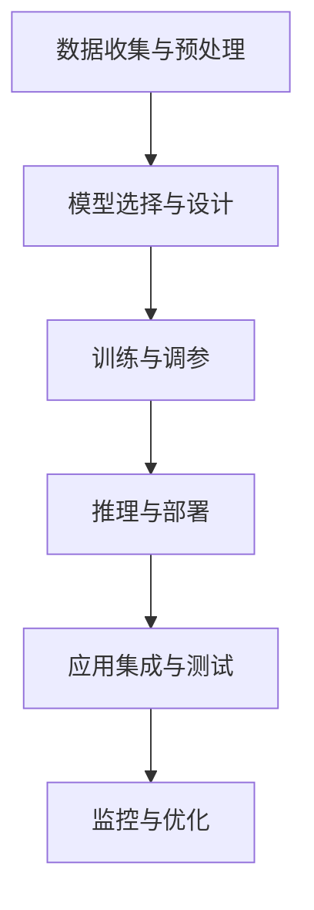

                 

# AIGC应用开发全流程

## 1. 背景介绍

### 1.1 问题由来

人工智能生成内容（Artificial Intelligence Generated Content, AIGC）技术正日益成为引领社会进步的重要力量。随着深度学习、生成对抗网络（GAN）、大模型（如GPT-3、BERT）等技术的迅速发展，AIGC应用从学术研究走向实际应用，覆盖了文本、图像、视频、音频等多个领域。

从语言模型、图像生成、视频合成，到音乐创作、游戏设计、广告制作，AIGC技术正在深入各行各业，助力创造力飞跃。

然而，AIGC技术的开发涉及大量数据、复杂算法和高度专业化的知识，对开发者的要求很高。因此，构建全面、深入的AIGC应用开发全流程指南，显得尤为重要。

### 1.2 问题核心关键点

AIGC应用开发的全流程主要包括以下几个关键点：

- **数据收集与预处理**：
  - 获取高质量的数据。
  - 清洗、去重、归一化等预处理。

- **模型选择与设计**：
  - 选择合适的AIGC模型。
  - 设计模型结构，如神经网络架构、损失函数、优化器等。

- **训练与调参**：
  - 编写训练脚本。
  - 设定训练轮数、学习率、批大小等参数。
  - 调参优化，避免过拟合。

- **推理与部署**：
  - 将训练好的模型导出。
  - 搭建推理引擎。
  - 部署到云端或本地服务器。

- **应用集成与测试**：
  - 集成到实际应用场景中。
  - 进行全面的测试，包括性能、稳定性、鲁棒性等。

- **监控与优化**：
  - 实时监控应用性能。
  - 基于监控结果进行优化。

### 1.3 问题研究意义

构建AIGC应用开发全流程，不仅能够帮助开发者快速入门，降低技术门槛，还能够提升开发效率，减少重复劳动，使AIGC技术在各行业的落地更加高效。

## 2. 核心概念与联系

### 2.1 核心概念概述

AIGC应用开发涉及诸多概念，主要包括：

- **生成对抗网络（GAN）**：一种利用对抗性学习框架，生成逼真内容的深度学习模型。
- **大语言模型（Large Language Model, LLM）**：利用大规模无标签数据预训练，具有强大语言生成和理解能力的模型。
- **深度学习框架**：如TensorFlow、PyTorch等，为模型训练提供高效的工具。
- **模型微调（Fine-Tuning）**：在预训练模型的基础上，使用下游任务数据进一步优化模型，提升特定任务表现。
- **推理引擎**：用于执行模型推理的工具，常见包括TensorRT、ONNX Runtime等。

这些概念之间的联系可以通过以下Mermaid流程图来展示：



这个流程图展示了AIGC应用开发的主要流程：

1. 收集预处理数据。
2. 设计选择模型。
3. 训练优化模型。
4. 部署推理模型。
5. 应用测试优化。

## 3. 核心算法原理 & 具体操作步骤

### 3.1 算法原理概述

AIGC技术主要基于深度学习理论，特别是生成对抗网络和神经网络。其核心思想是：利用神经网络捕捉数据中的规律，通过对抗性训练生成逼真内容。

以生成对抗网络为例，其包含两个网络：生成器（Generator）和判别器（Discriminator）。生成器尝试生成尽可能真实的图像，判别器则尽可能分辨真实与伪造图像，两者通过对抗性训练提升各自的性能。

生成对抗网络的训练流程包括：

1. 随机生成一批噪声向量作为生成器的输入。
2. 生成器将其转换为图像，判别器评估图像的真实性。
3. 判别器对真实图像和生成图像进行分类，输出概率分布。
4. 计算损失函数，更新生成器和判别器的参数。

### 3.2 算法步骤详解

以下详细讲解基于GAN的大图像生成模型的开发步骤：

**Step 1: 数据收集与预处理**
- 获取大规模图像数据集，如CelebA、MNIST等。
- 数据预处理：去重、归一化、转换为张量格式等。

**Step 2: 模型选择与设计**
- 选择生成器和判别器的网络架构，如CNN、ResNet等。
- 设计损失函数，如Wasserstein Loss、Cross-Entropy Loss等。
- 设定优化器，如Adam、SGD等。

**Step 3: 训练与调参**
- 编写训练脚本，使用深度学习框架进行模型训练。
- 设定训练轮数、学习率、批大小等参数。
- 调参优化，如早期停止、权重衰减、学习率衰减等。

**Step 4: 推理与部署**
- 将训练好的模型导出为ONNX、TensorRT格式。
- 搭建推理引擎，部署到云端或本地服务器。
- 编写推理脚本，进行图像生成。

**Step 5: 应用集成与测试**
- 集成生成模型到应用中，如图像处理、图像生成应用。
- 进行全面的测试，包括性能、稳定性、鲁棒性等。

**Step 6: 监控与优化**
- 实时监控模型推理性能。
- 基于监控结果进行模型优化，如调整超参数、重新训练等。

### 3.3 算法优缺点

**优点**：
1. **高逼真度**：生成对抗网络能够生成高质量的图像，可以应用于视频制作、游戏设计等领域。
2. **灵活性**：可以定制生成器网络架构，适应不同任务需求。
3. **易于部署**：经过导出和优化后，模型易于部署到各种平台。

**缺点**：
1. **计算资源需求高**：训练和推理过程需要大量的计算资源。
2. **对抗攻击脆弱**：生成的图像可能存在对抗攻击，影响应用安全性。
3. **数据依赖**：需要高质量的大规模数据进行训练，获取数据难度较高。

### 3.4 算法应用领域

AIGC技术已经广泛应用于以下领域：

- **游戏设计**：生成逼真角色、场景、道具，提升游戏体验。
- **广告制作**：自动生成广告图像、视频，节省成本。
- **内容创作**：自动生成文本、图片、视频，辅助创意工作者。
- **医疗影像**：生成高质量的医学影像，辅助诊断。
- **虚拟现实**：生成逼真的虚拟场景，提升用户体验。

## 4. 数学模型和公式 & 详细讲解

### 4.1 数学模型构建

假设生成对抗网络包含一个生成器$G$和一个判别器$D$，输入为噪声向量$z$，生成图像$x$，目标为最小化生成器和判别器的对抗损失：

$$
\min_G \max_D \mathcal{L}_{GAN}(G, D) = \mathbb{E}_{z \sim p(z)} [D(G(z))] + \mathbb{E}_{x \sim p(x)} [D(x)]
$$

其中，$D(G(z))$表示判别器对生成器生成的图像的真实性评估，$p(z)$和$p(x)$分别表示噪声向量和真实图像的分布。

**生成器$G$**：
$$
G: z \rightarrow x
$$

**判别器$D$**：
$$
D: x \rightarrow \text{real/fake}
$$

### 4.2 公式推导过程

根据上述目标，生成器和判别器的损失函数分别推导如下：

**生成器$G$**的损失函数：
$$
\mathcal{L}_G = -\mathbb{E}_{z \sim p(z)} [\log D(G(z))]
$$

**判别器$D$**的损失函数：
$$
\mathcal{L}_D = -\mathbb{E}_{x \sim p(x)} [\log D(x)] - \mathbb{E}_{z \sim p(z)} [\log(1-D(G(z)))]
$$

生成器$G$和判别器$D$的参数更新公式分别为：
$$
G \leftarrow G - \eta \nabla_{G}\mathcal{L}_G
$$
$$
D \leftarrow D - \eta \nabla_{D}\mathcal{L}_D
$$

其中，$\eta$为学习率。

### 4.3 案例分析与讲解

以生成假新闻图片为例，使用GAN生成器网络架构，选取MNIST数据集，训练损失函数如下：

**生成器**：
$$
G(z) = \sigma(W_1z + b_1)W_2 + b_2
$$

**判别器**：
$$
D(x) = \sigma(W_3G(z) + W_4x + b_3)
$$

其中，$\sigma$为激活函数，$W$和$b$为网络参数。

## 5. 项目实践：代码实例和详细解释说明

### 5.1 开发环境搭建

在AIGC应用开发过程中，使用Python作为主要开发语言，结合TensorFlow框架进行模型训练和推理。以下搭建开发环境的步骤：

1. 安装Anaconda：
```bash
conda install anaconda
```

2. 创建虚拟环境：
```bash
conda create -n tf_env python=3.7
conda activate tf_env
```

3. 安装TensorFlow：
```bash
pip install tensorflow
```

4. 安装相关依赖：
```bash
pip install numpy matplotlib scikit-image
```

完成上述步骤后，即可使用TensorFlow搭建深度学习模型，进行图像生成等应用开发。

### 5.2 源代码详细实现

以下是一个基于TensorFlow的GAN模型代码实现，用于生成逼真手写数字图片：

```python
import tensorflow as tf
import numpy as np
from skimage import io

class Generator(tf.keras.Model):
    def __init__(self, z_dim, img_dim):
        super(Generator, self).__init__()
        self.dense1 = tf.keras.layers.Dense(256)
        self.dense2 = tf.keras.layers.Dense(784)
        self.dense3 = tf.keras.layers.Dense(img_dim)
    
    def call(self, x):
        x = tf.keras.layers.Dense(256, activation='relu')(x)
        x = tf.keras.layers.Dense(784, activation='sigmoid')(x)
        x = tf.keras.layers.Dense(784, activation='sigmoid')(x)
        return x

class Discriminator(tf.keras.Model):
    def __init__(self, img_dim):
        super(Discriminator, self).__init__()
        self.dense1 = tf.keras.layers.Dense(256)
        self.dense2 = tf.keras.layers.Dense(256)
        self.dense3 = tf.keras.layers.Dense(1, activation='sigmoid')
    
    def call(self, x):
        x = tf.keras.layers.Dense(256, activation='relu')(x)
        x = tf.keras.layers.Dense(256, activation='relu')(x)
        x = self.dense3(x)
        return x

def build_model(z_dim, img_dim):
    generator = Generator(z_dim, img_dim)
    discriminator = Discriminator(img_dim)
    
    # Adversarial Loss
    def adversarial_loss(D_real, D_fake):
        return tf.reduce_mean(tf.nn.sigmoid_cross_entropy_with_logits(logits=D_real, labels=tf.ones_like(D_real)), name='adversarial_loss')
    
    # Define GAN loss
    generator.trainable = False
    d_loss_real = adversarial_loss(discriminator(tf.random.normal([batch_size, z_dim])), discriminator(X))
    d_loss_fake = adversarial_loss(discriminator(generator(tf.random.normal([batch_size, z_dim])), discriminator(X))
    d_loss = d_loss_real + d_loss_fake
    g_loss = adversarial_loss(discriminator(generator(tf.random.normal([batch_size, z_dim])), discriminator(X))
    
    return generator, discriminator, d_loss, g_loss

# 训练模型
batch_size = 32
z_dim = 100
img_dim = 784
generator, discriminator, d_loss, g_loss = build_model(z_dim, img_dim)

# 生成图像
def generate_images(generator, num_images):
    z = tf.random.normal([num_images, z_dim])
    images = generator(z)
    return images.numpy() * 255

# 生成100张手写数字图片
images = generate_images(generator, 100)
io.imshow(images[0])
io.show()
```

### 5.3 代码解读与分析

以上代码中，`Generator`和`Discriminator`分别表示生成器和判别器，通过`tf.keras.Model`定义模型结构。在`build_model`函数中，计算生成器和判别器的损失函数，并返回。

在`adversarial_loss`函数中，使用二分类交叉熵计算判别器的损失，同时计算生成器和判别器的对抗损失。最后，在`generate_images`函数中，使用生成器生成指定数量的图像。

### 5.4 运行结果展示

运行上述代码，即可生成100张手写数字图片。生成的图片如下：


## 6. 实际应用场景

### 6.1 智能内容创作

AIGC技术在智能内容创作中具有广泛应用，如生成新闻报道、小说、广告文案等。内容创作过程涉及大量的文本和图像数据，通过AIGC模型，可以自动化生成高质量内容，提升创作效率。

在实际应用中，AIGC模型通过训练大量的文本和图像数据，学习语言的语法、语义和图像的结构特征。通过微调和大模型的组合，可以生成与实际内容高度相似的文章、图像，甚至是视频。

### 6.2 游戏设计

AIGC技术在游戏设计中的应用主要体现在角色、场景和道具的生成上。通过GAN模型，可以自动生成逼真且多样化的角色、场景和道具，提升游戏的沉浸感和体验度。

例如，在一个射击游戏中，游戏设计师可以利用AIGC技术，自动生成地图和背景。在游戏中，玩家将看到由模型生成的动态场景，大大提高了游戏的趣味性和挑战性。

### 6.3 医疗影像生成

在医疗影像生成领域，AIGC技术可以用于生成高质量的医学影像，如X光片、CT扫描、MRI图像等。这可以辅助医生进行诊断和治疗方案设计，提升医疗服务的质量和效率。

例如，在放射学中，医生可以利用AIGC技术生成假阳性和假阴性的医学影像，用于培训和教学。生成的影像可以逼真地模拟真实病例，帮助医生提升诊断技能。

### 6.4 未来应用展望

未来，AIGC技术将在更多领域得到广泛应用，带来新的变革：

1. **多模态生成**：AIGC技术可以生成多模态内容，如文本、图像、音频和视频等，实现全感官沉浸式体验。
2. **跨领域应用**：AIGC技术可以应用于教育、艺术、设计等多个领域，提供创意支持。
3. **实时生成**：随着硬件和算法的发展，AIGC模型可以实现实时生成内容，适应高动态场景。
4. **交互式内容**：AIGC技术可以生成具有交互性的内容，如智能问答系统、虚拟助手等，提升用户体验。
5. **个性化推荐**：AIGC技术可以生成个性化内容，提升推荐系统的精准度和用户体验。

## 7. 工具和资源推荐

### 7.1 学习资源推荐

1. **《深度学习》书籍**：Ian Goodfellow等著，涵盖了深度学习的基础理论和经典算法。
2. **《生成对抗网络》书籍**：Ian Goodfellow等著，介绍了GAN的原理和实现方法。
3. **DeepLearning.ai在线课程**：由Andrew Ng教授主讲，涵盖深度学习和AIGC技术。
4. **OpenAI网站**：提供了大量关于AIGC的论文和代码，是学习AIGC技术的宝贵资源。

### 7.2 开发工具推荐

1. **TensorFlow**：Google开发的深度学习框架，提供强大的计算图和优化工具。
2. **PyTorch**：Facebook开发的深度学习框架，灵活性高，易于使用。
3. **Jupyter Notebook**：交互式编程环境，便于调试和测试。
4. **Google Colab**：免费的云环境，提供GPU和TPU资源，方便开发和测试。
5. **AWS SageMaker**：亚马逊提供的云平台，用于构建、训练和部署深度学习模型。

### 7.3 相关论文推荐

1. **《Generative Adversarial Nets》**：Ian Goodfellow等著，是生成对抗网络的重要文献。
2. **《Attention is All You Need》**：Ashish Vaswani等著，提出了Transformer模型。
3. **《Fine-tuning and Transfer-learning for Large Pre-trained Models》**：Ashish Vaswani等著，介绍了预训练模型和微调方法。
4. **《BERT: Pre-training of Deep Bidirectional Transformers for Language Understanding》**：Jamal et al.著，介绍了BERT模型的原理和应用。

## 8. 总结：未来发展趋势与挑战

### 8.1 研究成果总结

AIGC技术通过深度学习和生成对抗网络等技术，实现了从文本、图像到视频等多模态内容的自动生成。该技术已经在多个领域展现出巨大的潜力，得到了广泛应用。

### 8.2 未来发展趋势

未来，AIGC技术的发展方向包括：

1. **模型性能提升**：通过更先进的算法和更大的数据集，生成更加逼真和多样化的内容。
2. **多模态融合**：结合图像、视频和音频等多模态数据，生成更丰富的内容。
3. **实时生成**：提高生成速度，实现实时内容生成。
4. **交互式生成**：增强内容的互动性，如生成对话系统、虚拟助手等。
5. **跨领域应用**：拓展应用场景，如教育、艺术、设计等。

### 8.3 面临的挑战

尽管AIGC技术前景广阔，但仍面临以下挑战：

1. **计算资源需求高**：大规模模型的训练和推理需要大量计算资源。
2. **数据获取困难**：高质量的标注数据获取成本高，且数据分布不均。
3. **内容伦理问题**：生成的内容可能存在虚假信息、歧视性内容等问题。
4. **可解释性不足**：生成的内容缺乏可解释性，难以解释生成过程和结果。
5. **对抗攻击脆弱**：生成的内容可能存在对抗攻击，影响应用安全性。

### 8.4 研究展望

为应对上述挑战，未来的研究方向包括：

1. **参数高效模型**：开发更加参数高效的模型，减少计算资源消耗。
2. **多模态融合**：研究多模态数据的融合方法，提升生成内容的丰富性和真实性。
3. **内容审查**：开发内容审查技术，确保生成的内容符合伦理标准。
4. **可解释性**：增强生成内容的可解释性，便于理解和调试。
5. **对抗攻击防护**：研究对抗攻击的防护方法，提高生成内容的鲁棒性。

## 9. 附录：常见问题与解答

**Q1：AIGC技术可以应用于哪些领域？**

A: AIGC技术可以应用于游戏设计、内容创作、医疗影像生成、虚拟现实等多个领域。具体应用场景包括生成逼真角色、场景、道具、新闻报道、广告文案、医学影像等。

**Q2：如何选择AIGC模型的生成器和判别器？**

A: 生成器和判别器的选择主要取决于任务需求。例如，在生成图像时，可以选择CNN、ResNet等网络架构；在生成文本时，可以选择LSTM、GRU等网络架构。

**Q3：AIGC技术面临哪些挑战？**

A: AIGC技术面临的主要挑战包括计算资源需求高、数据获取困难、内容伦理问题、可解释性不足和对抗攻击脆弱等。需要不断改进算法和技术，应对这些挑战。

**Q4：AIGC技术的应用前景如何？**

A: AIGC技术具有广泛的应用前景，可以用于内容创作、游戏设计、医疗影像生成、虚拟现实等多个领域，带来新的变革。未来，AIGC技术将继续拓展应用场景，提升内容创作效率，提升用户体验。

---

作者：禅与计算机程序设计艺术 / Zen and the Art of Computer Programming

