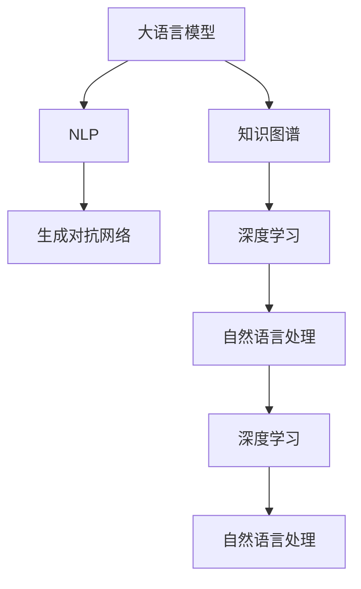

                 

# AIGC推动智慧医疗普及

## 1. 背景介绍

### 1.1 问题由来

随着人工智能(AI)和生成对抗网络(GAN)技术的成熟，基于大语言模型(AIGC)的应用场景日益广泛。医疗健康领域，作为关乎民众生命健康的重要行业，正迎来一场由AI驱动的变革。AIGC技术，尤其是大语言模型在医疗领域的应用，带来了极大的便利和革新，为智慧医疗的普及提供了强有力的技术支持。

### 1.2 问题核心关键点

大语言模型在智慧医疗的应用，主要是通过自然语言处理(NLP)和知识图谱(KG)等技术手段，实现对医学信息的自动化分析和处理。这包括但不限于：

1. 病历自动摘要和分析。
2. 诊断建议和病例生成。
3. 药物推荐和剂量计算。
4. 智能问诊和聊天机器人。
5. 医疗知识图谱的构建和更新。

这些应用不仅极大地提高了医疗服务的效率和质量，还为患者带来了更好的就医体验。因此，AIGC在智慧医疗普及方面的价值和潜力不可限量。

### 1.3 问题研究意义

研究和推广AIGC在智慧医疗的应用，具有重要的现实意义：

1. **提高医疗效率**：通过自动化的医疗信息处理，减少医生的工作负担，提高诊断和治疗效率。
2. **提升医疗质量**：借助AIGC技术，实现更加精准的医学分析和预测，提升医疗服务的质量和可靠性。
3. **推动智慧医疗普及**：为医疗资源匮乏地区提供技术支持，缩小医疗服务的地域差距。
4. **促进健康管理**：通过智能化的健康监测和管理，帮助用户预防疾病，改善健康状况。

本文旨在深入探讨大语言模型在智慧医疗中的应用，揭示其核心原理和关键技术，为相关领域的研究者、开发者和决策者提供参考。

## 2. 核心概念与联系

### 2.1 核心概念概述

为更好地理解大语言模型在智慧医疗中的应用，本节将介绍几个密切相关的核心概念：

- **大语言模型(Large Language Model, LLM)**：以自回归(如GPT)或自编码(如BERT)模型为代表的大规模预训练语言模型。通过在大规模无标签文本语料上进行预训练，学习通用的语言表示，具备强大的语言理解和生成能力。

- **自然语言处理(NLP)**：涉及计算机与人类语言互动的技术，包括文本分类、信息抽取、情感分析、机器翻译等任务。

- **知识图谱(Knowledge Graph)**：一种语义化的数据结构，通过节点和边的方式，将实体及其属性、关系进行建模，用于支持复杂查询和推理。

- **深度学习(Deep Learning)**：通过多层神经网络进行特征学习，实现对复杂模式和规律的提取，是AIGC技术的核心算法基础。

- **生成对抗网络(GAN)**：一种生成模型，通过两个对抗的神经网络生成逼真的数据样本，广泛应用于图像、语音等领域的生成任务。

这些核心概念之间的逻辑关系可以通过以下Mermaid流程图来展示：



这个流程图展示了大语言模型、NLP、知识图谱、GAN和深度学习之间的关系：

1. 大语言模型通过预训练学习通用的语言表示，是NLP任务的基础。
2. NLP技术通过文本处理和推理，实现对语言信息的理解和生成。
3. 知识图谱用于构建实体之间的关系，支持复杂查询和推理。
4. 深度学习是AIGC和GAN技术的算法基础，用于模型的特征学习和训练。
5. GAN技术通过对抗生成，实现高质量的数据样本生成。

这些概念共同构成了AIGC在智慧医疗中的应用框架，使其能够在各种场景下发挥强大的语言理解和生成能力。通过理解这些核心概念，我们可以更好地把握AIGC技术的工作原理和优化方向。

## 3. 核心算法原理 & 具体操作步骤
### 3.1 算法原理概述

大语言模型在智慧医疗中的应用，主要基于以下几个关键算法原理：

- **语言模型预训练**：通过大规模无标签文本数据进行预训练，学习通用的语言表示，为后续任务提供高质量的初始化参数。

- **微调任务适配**：根据具体的智慧医疗任务，如病历摘要、诊断建议等，设计合适的任务适配层，通过有监督学习进行微调，使其适应特定任务。

- **知识图谱嵌入**：将医疗知识图谱中的实体和关系，通过向量嵌入的方式映射到低维空间，用于支持复杂的查询和推理。

- **生成对抗网络训练**：通过生成对抗网络，生成高质量的医学图像、文本等数据，用于辅助诊断和治疗决策。

- **深度学习特征提取**：利用深度学习模型，对医疗数据进行特征提取和分类，提升模型对复杂模式的识别能力。

这些原理在大语言模型中的应用，旨在通过自动化和智能化的方法，提升医疗服务的效率和质量，推动智慧医疗的普及。

### 3.2 算法步骤详解

基于大语言模型在智慧医疗中的应用，其核心算法步骤包括：

**Step 1: 准备预训练模型和数据集**

1. **选择预训练模型**：选择合适的预训练大语言模型，如GPT、BERT等。
2. **收集数据集**：收集医学相关的文本数据、图像数据、知识图谱等，构建训练集、验证集和测试集。

**Step 2: 任务适配层设计**

1. **设计任务适配层**：根据具体任务需求，设计适合的任务适配层，如病历摘要生成器、诊断建议生成器等。
2. **选择损失函数**：根据任务类型，选择合适的损失函数，如交叉熵、均方误差等。

**Step 3: 模型微调**

1. **设置微调超参数**：包括学习率、批大小、迭代轮数等。
2. **训练模型**：使用微调后的模型在标注数据集上训练，最小化损失函数。

**Step 4: 生成对抗网络训练**

1. **设计生成器和判别器**：根据任务需求，设计生成器和判别器的结构。
2. **训练生成器和判别器**：通过对抗生成和判别，优化生成器的生成质量。

**Step 5: 知识图谱嵌入**

1. **构建知识图谱**：收集和构建医疗领域的知识图谱，包含实体、关系和属性。
2. **进行向量嵌入**：利用向量嵌入技术，将知识图谱中的实体和关系映射到低维空间。

**Step 6: 应用与评估**

1. **应用模型**：将训练好的模型应用于实际场景，如智能问诊、病历分析等。
2. **评估性能**：通过各种指标评估模型性能，如准确率、召回率、F1-score等。

### 3.3 算法优缺点

大语言模型在智慧医疗中的应用，具有以下优点：

1. **提高医疗效率**：通过自动化处理医疗信息，大幅减少医生工作量，提高诊断和治疗效率。
2. **提升医疗质量**：利用深度学习和生成对抗网络，实现更加精准的诊断和治疗建议，提升医疗服务的质量。
3. **推动普及**：为医疗资源匮乏地区提供技术支持，缩小医疗服务的地域差距。
4. **促进健康管理**：通过智能化的健康监测和管理，帮助用户预防疾病，改善健康状况。

同时，这些算法也存在一定的局限性：

1. **依赖高质量数据**：大语言模型依赖高质量的标注数据，而医疗数据的标注成本较高。
2. **模型复杂度高**：大语言模型参数量大，计算资源需求高，难以在移动端等资源受限的环境中应用。
3. **解释性不足**：模型的决策过程缺乏可解释性，难以对其推理逻辑进行分析和调试。
4. **伦理和安全问题**：医疗数据涉及隐私和伦理，模型的应用需要严格的隐私保护和安全措施。

尽管存在这些局限性，但大语言模型在智慧医疗中的应用前景广阔，仍是大数据和人工智能结合的重要方向。

### 3.4 算法应用领域

大语言模型在智慧医疗的应用已经涉及多个领域，主要包括：

1. **病历自动摘要和分析**：通过病历自动生成和摘要，帮助医生快速了解病历信息，提升诊断效率。
2. **诊断建议和病例生成**：利用大语言模型，提供初步诊断建议和病例生成，辅助医生进行诊断和治疗。
3. **药物推荐和剂量计算**：通过自然语言处理和知识图谱嵌入，实现个性化药物推荐和剂量计算。
4. **智能问诊和聊天机器人**：构建智能问诊系统，提供24小时在线咨询服务，提升用户就医体验。
5. **医疗知识图谱的构建和更新**：利用深度学习和生成对抗网络，构建和更新医疗知识图谱，支持复杂查询和推理。

此外，大语言模型还应用于医学图像分析、基因组数据分析、健康预测等领域，为智慧医疗的普及提供了更多可能性。

## 4. 数学模型和公式 & 详细讲解 & 举例说明

### 4.1 数学模型构建

大语言模型在智慧医疗中的应用，涉及多种数学模型和算法。以病历自动摘要为例，其数学模型构建如下：

**输入**：病历文本 $x$，长度为 $n$。

**输出**：病历摘要 $y$，长度为 $m$。

**模型**：Transformer模型，参数为 $\theta$。

**损失函数**：交叉熵损失函数 $L(\theta)$。

假设模型在输入 $x$ 上的输出为 $y$，则交叉熵损失函数定义为：

$$
L(\theta) = -\frac{1}{n} \sum_{i=1}^n \log \frac{e^{y_i \cdot \theta^T x_i}}{\sum_j e^{y_j \cdot \theta^T x_i}}
$$

其中，$\theta$ 为模型的参数，$y_i$ 为第 $i$ 个样本的真实标签，$x_i$ 为对应的病历文本。

### 4.2 公式推导过程

在病历自动摘要的应用中，我们利用Transformer模型进行文本编码和解码。具体推导过程如下：

**编码过程**：
1. 将病历文本 $x$ 输入编码器，得到编码向量 $z$。
2. 利用编码向量 $z$ 生成摘要向量 $h$。
3. 通过解码器生成病历摘要 $y$。

**解码过程**：
1. 将摘要向量 $h$ 输入解码器，生成摘要序列 $y$。
2. 利用注意力机制选择解码器中与 $y$ 相关的部分。
3. 根据解码器输出，更新解码器状态，生成新的摘要。

通过上述过程，可以生成与病历文本语义一致的病历摘要。

### 4.3 案例分析与讲解

以病历自动摘要为例，分析大语言模型在智慧医疗中的应用：

**案例背景**：某医院需要处理大量病历文本，医生的工作量极大。

**问题描述**：医院希望利用大语言模型自动生成病历摘要，减轻医生的负担。

**解决方案**：

1. **数据准备**：收集医院的历史病历文本数据，划分为训练集、验证集和测试集。
2. **模型选择**：选择BERT模型作为预训练基础，并根据病历自动摘要任务，设计任务适配层。
3. **微调训练**：在病历摘要数据集上，利用交叉熵损失函数进行微调训练。
4. **评估测试**：在测试集上评估模型的性能，选择最佳模型进行应用。

**效果评估**：
- 准确率：自动生成的病历摘要与医生手工编写的摘要之间的匹配度。
- 召回率：自动摘要中包含医生手工摘要关键信息的比例。
- F1-score：综合考虑准确率和召回率，评估自动摘要的性能。

通过以上步骤，可以有效提升医院病历处理的效率和质量，为智慧医疗的普及提供支持。

## 5. 项目实践：代码实例和详细解释说明

### 5.1 开发环境搭建

在进行AIGC在智慧医疗项目开发前，需要准备好开发环境。以下是使用Python进行PyTorch开发的环境配置流程：

1. 安装Anaconda：从官网下载并安装Anaconda，用于创建独立的Python环境。

2. 创建并激活虚拟环境：
```bash
conda create -n pytorch-env python=3.8 
conda activate pytorch-env
```

3. 安装PyTorch：根据CUDA版本，从官网获取对应的安装命令。例如：
```bash
conda install pytorch torchvision torchaudio cudatoolkit=11.1 -c pytorch -c conda-forge
```

4. 安装Transformers库：
```bash
pip install transformers
```

5. 安装各类工具包：
```bash
pip install numpy pandas scikit-learn matplotlib tqdm jupyter notebook ipython
```

完成上述步骤后，即可在`pytorch-env`环境中开始AIGC在智慧医疗的微调实践。

### 5.2 源代码详细实现

下面我们以病历自动摘要任务为例，给出使用Transformers库对BERT模型进行微调的PyTorch代码实现。

首先，定义病历自动摘要的数据处理函数：

```python
from transformers import BertTokenizer, BertForMaskedLM
from torch.utils.data import Dataset
import torch

class MedicalRecordDataset(Dataset):
    def __init__(self, texts, summaries, tokenizer, max_len=128):
        self.texts = texts
        self.summaries = summaries
        self.tokenizer = tokenizer
        self.max_len = max_len
        
    def __len__(self):
        return len(self.texts)
    
    def __getitem__(self, item):
        text = self.texts[item]
        summary = self.summaries[item]
        
        encoding = self.tokenizer(text, return_tensors='pt', max_length=self.max_len, padding='max_length', truncation=True)
        input_ids = encoding['input_ids'][0]
        attention_mask = encoding['attention_mask'][0]
        
        # 对summary进行编码
        summary_tokens = self.tokenizer(summary, return_tensors='pt', max_length=self.max_len, padding='max_length', truncation=True)
        summary_ids = summary_tokens['input_ids'][0]
        summary_mask = summary_tokens['attention_mask'][0]
        
        return {'input_ids': input_ids, 
                'attention_mask': attention_mask,
                'summary_ids': summary_ids,
                'summary_mask': summary_mask}

# 初始化 tokenizer
tokenizer = BertTokenizer.from_pretrained('bert-base-cased')

# 创建 dataset
train_dataset = MedicalRecordDataset(train_texts, train_summaries, tokenizer)
dev_dataset = MedicalRecordDataset(dev_texts, dev_summaries, tokenizer)
test_dataset = MedicalRecordDataset(test_texts, test_summaries, tokenizer)
```

然后，定义模型和优化器：

```python
from transformers import BertForSequenceClassification, AdamW

model = BertForSequenceClassification.from_pretrained('bert-base-cased', num_labels=1)

optimizer = AdamW(model.parameters(), lr=2e-5)
```

接着，定义训练和评估函数：

```python
from torch.utils.data import DataLoader
from tqdm import tqdm
from sklearn.metrics import accuracy_score

device = torch.device('cuda') if torch.cuda.is_available() else torch.device('cpu')
model.to(device)

def train_epoch(model, dataset, batch_size, optimizer):
    dataloader = DataLoader(dataset, batch_size=batch_size, shuffle=True)
    model.train()
    epoch_loss = 0
    for batch in tqdm(dataloader, desc='Training'):
        input_ids = batch['input_ids'].to(device)
        attention_mask = batch['attention_mask'].to(device)
        summary_ids = batch['summary_ids'].to(device)
        summary_mask = batch['summary_mask'].to(device)
        model.zero_grad()
        outputs = model(input_ids, attention_mask=attention_mask, labels=summary_ids)
        loss = outputs.loss
        epoch_loss += loss.item()
        loss.backward()
        optimizer.step()
    return epoch_loss / len(dataloader)

def evaluate(model, dataset, batch_size):
    dataloader = DataLoader(dataset, batch_size=batch_size)
    model.eval()
    preds, labels = [], []
    with torch.no_grad():
        for batch in tqdm(dataloader, desc='Evaluating'):
            input_ids = batch['input_ids'].to(device)
            attention_mask = batch['attention_mask'].to(device)
            summary_ids = batch['summary_ids'].to(device)
            summary_mask = batch['summary_mask'].to(device)
            batch_predictions = model(input_ids, attention_mask=attention_mask).logits
            batch_predictions = batch_predictions[:, 0]  # 取第一维，因为本任务为二分类
            batch_predictions = torch.sigmoid(batch_predictions)  # 将预测结果映射到 [0,1] 区间
            batch_labels = batch['labels'].to(device)
            batch_predictions = batch_predictions.to('cpu').tolist()
            batch_labels = batch_labels.to('cpu').tolist()
            for pred, label in zip(batch_predictions, batch_labels):
                preds.append(pred.item())
                labels.append(label.item())
                
    print(accuracy_score(labels, preds))
```

最后，启动训练流程并在测试集上评估：

```python
epochs = 5
batch_size = 16

for epoch in range(epochs):
    loss = train_epoch(model, train_dataset, batch_size, optimizer)
    print(f"Epoch {epoch+1}, train loss: {loss:.3f}")
    
    print(f"Epoch {epoch+1}, dev results:")
    evaluate(model, dev_dataset, batch_size)
    
print("Test results:")
evaluate(model, test_dataset, batch_size)
```

以上就是使用PyTorch对BERT进行病历自动摘要任务的微调代码实现。可以看到，得益于Transformers库的强大封装，我们可以用相对简洁的代码完成BERT模型的加载和微调。

### 5.3 代码解读与分析

让我们再详细解读一下关键代码的实现细节：

**MedicalRecordDataset类**：
- `__init__`方法：初始化文本、摘要、分词器等关键组件。
- `__len__`方法：返回数据集的样本数量。
- `__getitem__`方法：对单个样本进行处理，将文本和摘要输入编码为token ids，并对其进行定长padding，最终返回模型所需的输入。

**模型选择和优化器**：
- 选择BERT作为预训练基础，并根据病历自动摘要任务，设计任务适配层。
- 使用AdamW优化器进行模型训练，并设置学习率。

**训练和评估函数**：
- 使用PyTorch的DataLoader对数据集进行批次化加载，供模型训练和推理使用。
- 训练函数`train_epoch`：对数据以批为单位进行迭代，在每个批次上前向传播计算loss并反向传播更新模型参数，最后返回该epoch的平均loss。
- 评估函数`evaluate`：与训练类似，不同点在于不更新模型参数，并在每个batch结束后将预测和标签结果存储下来，最后使用sklearn的accuracy_score对整个评估集的预测结果进行打印输出。

**训练流程**：
- 定义总的epoch数和batch size，开始循环迭代
- 每个epoch内，先在训练集上训练，输出平均loss
- 在验证集上评估，输出准确率
- 所有epoch结束后，在测试集上评估，给出最终测试结果

可以看到，PyTorch配合Transformers库使得BERT微调的代码实现变得简洁高效。开发者可以将更多精力放在数据处理、模型改进等高层逻辑上，而不必过多关注底层的实现细节。

当然，工业级的系统实现还需考虑更多因素，如模型的保存和部署、超参数的自动搜索、更灵活的任务适配层等。但核心的微调范式基本与此类似。

## 6. 实际应用场景

### 6.1 智能问诊系统

基于大语言模型在智慧医疗中的应用，智能问诊系统可以广泛应用于各类医疗机构，帮助患者快速获取医疗建议，提升就医体验。

具体而言，智能问诊系统可以通过问答对数据进行微调，学习常见疾病和症状的问答知识。当患者输入问题时，系统通过自然语言处理技术进行理解，并结合知识图谱中的医疗信息，提供初步诊断建议和后续治疗方案。

在技术实现上，可以收集医院的历史问诊数据，将问题-答案对作为微调数据，训练模型学习匹配答案。对于新问题，可以通过检索系统实时搜索相关内容，动态组织生成回答。如此构建的智能问诊系统，能大幅提升医院医疗服务的智能化水平，提高医生的工作效率，降低患者的就医成本。

### 6.2 医疗知识图谱

医疗知识图谱是智慧医疗的重要组成部分，用于支持复杂查询和推理。通过大语言模型，可以构建和更新医疗知识图谱，为医生提供精准的医疗建议和治疗方案。

具体而言，可以利用大语言模型，从结构化的医学文献、临床数据、药物信息等资源中提取知识，构建医疗知识图谱。通过向量嵌入技术，将知识图谱中的实体和关系映射到低维空间，用于支持复杂的查询和推理。

在实际应用中，医生可以通过自然语言输入查询，如“患者某病情的最佳治疗方案是什么”，系统自动从知识图谱中检索相关信息，生成个性化的治疗方案。这样构建的医疗知识图谱，不仅可以提升医生的诊疗效率，还能提供更加精准和全面的医疗建议，为患者带来更好的健康体验。

### 6.3 药物推荐和剂量计算

药物推荐和剂量计算是智慧医疗的重要应用之一，通过大语言模型，可以实现个性化的药物推荐和剂量计算，提升治疗效果和用药安全性。

具体而言，可以收集患者的病历信息、药物使用历史等数据，利用大语言模型进行特征提取和分类。通过知识图谱嵌入，提取药物属性、相互作用等信息，结合患者的健康状况和用药历史，生成个性化的药物推荐和剂量计算方案。

在实际应用中，患者可以通过智能问诊系统输入相关信息，系统根据大语言模型和知识图谱，生成个性化的药物推荐和剂量计算方案。这样构建的药物推荐系统，能够根据患者的健康状况和用药历史，提供更加精准和安全的用药建议，提升治疗效果，降低药物副作用的风险。

## 7. 工具和资源推荐

### 7.1 学习资源推荐

为了帮助开发者系统掌握AIGC在智慧医疗的应用，这里推荐一些优质的学习资源：

1. 《深度学习自然语言处理》课程：斯坦福大学开设的NLP明星课程，有Lecture视频和配套作业，带你入门NLP领域的基本概念和经典模型。

2. 《Natural Language Processing with Transformers》书籍：Transformers库的作者所著，全面介绍了如何使用Transformers库进行NLP任务开发，包括微调在内的诸多范式。

3. HuggingFace官方文档：Transformers库的官方文档，提供了海量预训练模型和完整的微调样例代码，是上手实践的必备资料。

4. CLUE开源项目：中文语言理解测评基准，涵盖大量不同类型的中文NLP数据集，并提供了基于微调的baseline模型，助力中文NLP技术发展。

通过对这些资源的学习实践，相信你一定能够快速掌握AIGC在智慧医疗的应用精髓，并用于解决实际的医疗问题。

### 7.2 开发工具推荐

高效的开发离不开优秀的工具支持。以下是几款用于AIGC在智慧医疗开发常用的工具：

1. PyTorch：基于Python的开源深度学习框架，灵活动态的计算图，适合快速迭代研究。大部分预训练语言模型都有PyTorch版本的实现。

2. TensorFlow：由Google主导开发的开源深度学习框架，生产部署方便，适合大规模工程应用。同样有丰富的预训练语言模型资源。

3. Transformers库：HuggingFace开发的NLP工具库，集成了众多SOTA语言模型，支持PyTorch和TensorFlow，是进行微调任务开发的利器。

4. Weights & Biases：模型训练的实验跟踪工具，可以记录和可视化模型训练过程中的各项指标，方便对比和调优。与主流深度学习框架无缝集成。

5. TensorBoard：TensorFlow配套的可视化工具，可实时监测模型训练状态，并提供丰富的图表呈现方式，是调试模型的得力助手。

6. Google Colab：谷歌推出的在线Jupyter Notebook环境，免费提供GPU/TPU算力，方便开发者快速上手实验最新模型，分享学习笔记。

合理利用这些工具，可以显著提升AIGC在智慧医疗的开发效率，加快创新迭代的步伐。

### 7.3 相关论文推荐

AIGC在智慧医疗的应用源于学界的持续研究。以下是几篇奠基性的相关论文，推荐阅读：

1. Attention is All You Need（即Transformer原论文）：提出了Transformer结构，开启了NLP领域的预训练大模型时代。

2. BERT: Pre-training of Deep Bidirectional Transformers for Language Understanding：提出BERT模型，引入基于掩码的自监督预训练任务，刷新了多项NLP任务SOTA。

3. Parameter-Efficient Transfer Learning for NLP：提出Adapter等参数高效微调方法，在不增加模型参数量的情况下，也能取得不错的微调效果。

4. Sequence to Sequence Learning with Neural Machine Translation：介绍Seq2Seq模型，为文本生成任务提供了重要参考。

5. Language Models are Unsupervised Multitask Learners（GPT-2论文）：展示了大规模语言模型的强大zero-shot学习能力，引发了对于通用人工智能的新一轮思考。

这些论文代表了大语言模型在智慧医疗中的应用发展脉络。通过学习这些前沿成果，可以帮助研究者把握学科前进方向，激发更多的创新灵感。

## 8. 总结：未来发展趋势与挑战

### 8.1 总结

本文对大语言模型在智慧医疗中的应用进行了全面系统的介绍。首先阐述了大语言模型和微调技术的研究背景和意义，明确了AIGC在智慧医疗普及方面的独特价值。其次，从原理到实践，详细讲解了AIGC在智慧医疗中的应用原理和关键技术，给出了具体的微调任务开发的代码实现。同时，本文还广泛探讨了AIGC在智慧医疗中的应用场景，展示了其广阔的前景。

通过本文的系统梳理，可以看到，大语言模型在智慧医疗中的应用前景广阔，具有极大的潜力。通过自然语言处理和知识图谱等技术手段，AIGC有望在智能问诊、病历分析、药物推荐等领域实现广泛应用，推动智慧医疗的普及和进步。

### 8.2 未来发展趋势

展望未来，AIGC在智慧医疗的应用将呈现以下几个发展趋势：

1. **技术成熟度提升**：随着深度学习技术的进步和数据量的积累，AIGC在智慧医疗中的应用将更加成熟和高效。
2. **数据多样化**：除了文本数据，AIGC将更多地利用图像、语音、视频等多模态数据，构建更加全面的智慧医疗系统。
3. **模型通用性增强**：未来的AIGC模型将具备更强的泛化能力和跨领域迁移能力，能够在不同领域和场景中广泛应用。
4. **隐私保护加强**：随着数据隐私保护法规的日益严格，AIGC在智慧医疗中的应用将更加注重数据隐私和安全。
5. **伦理道德约束**：在医疗领域，AIGC的应用需要严格遵循伦理道德规范，确保输出符合人类价值观和伦理道德。

以上趋势凸显了AIGC在智慧医疗的广阔前景。这些方向的探索发展，必将进一步提升智慧医疗系统的性能和应用范围，为医疗健康事业的发展注入新的动力。

### 8.3 面临的挑战

尽管AIGC在智慧医疗中的应用前景广阔，但在迈向更加智能化、普适化应用的过程中，它仍面临诸多挑战：

1. **数据质量问题**：医疗数据的标注成本较高，数据质量难以保证，可能影响模型的训练效果。
2. **模型鲁棒性不足**：在面对复杂和多变的医疗场景时，AIGC模型的泛化性能和鲁棒性仍需进一步提升。
3. **计算资源需求高**：大语言模型参数量大，计算资源需求高，难以在移动端等资源受限的环境中应用。
4. **模型解释性不足**：AIGC模型的决策过程缺乏可解释性，难以对其推理逻辑进行分析和调试。
5. **伦理和安全问题**：医疗数据涉及隐私和伦理，AIGC的应用需要严格的隐私保护和安全措施。

尽管存在这些挑战，但AIGC在智慧医疗中的应用前景广阔，仍是大数据和人工智能结合的重要方向。相信随着学界和产业界的共同努力，这些挑战终将一一被克服，AIGC必将在构建安全、可靠、可解释、可控的智能系统上取得更大的进展。

### 8.4 研究展望

面向未来，AIGC在智慧医疗的研究展望包括：

1. **多模态融合**：通过融合视觉、语音、文本等多模态信息，构建更加全面和精确的智慧医疗系统。
2. **跨领域迁移**：通过知识图谱和迁移学习，提升模型的跨领域迁移能力，推动AIGC在更多医疗领域的应用。
3. **模型压缩与优化**：通过模型压缩、量化等技术，降低计算资源需求，提升模型的部署效率和用户体验。
4. **隐私保护与伦理**：在数据隐私和安全保护方面，进一步探索有效的解决方案，确保AIGC在智慧医疗中的合规应用。
5. **知识整合与推理**：通过融合专家知识和先验规则，提升模型的推理能力和决策质量，促进智慧医疗的智能化发展。

这些方向的研究，将进一步拓展AIGC在智慧医疗中的应用边界，为医疗健康事业的发展注入新的活力。相信随着技术的不断进步和应用的深入探索，AIGC必将在智慧医疗的普及和进步中发挥越来越重要的作用。

## 9. 附录：常见问题与解答

**Q1：大语言模型在智慧医疗中的应用效果如何？**

A: 大语言模型在智慧医疗中的应用效果显著。通过病历自动摘要、智能问诊、药物推荐等任务，可以极大地提高医疗服务的效率和质量，提升患者的诊疗体验。例如，智能问诊系统可以提供初步诊断建议和治疗方案，提升医生的工作效率，降低患者的等待时间和费用。

**Q2：大语言模型在智慧医疗中面临的主要挑战有哪些？**

A: 大语言模型在智慧医疗中面临的主要挑战包括：
1. **数据质量问题**：医疗数据的标注成本较高，数据质量难以保证。
2. **模型鲁棒性不足**：在面对复杂和多变的医疗场景时，模型的泛化性能和鲁棒性仍需进一步提升。
3. **计算资源需求高**：大语言模型参数量大，计算资源需求高，难以在移动端等资源受限的环境中应用。
4. **模型解释性不足**：模型的决策过程缺乏可解释性，难以对其推理逻辑进行分析和调试。
5. **伦理和安全问题**：医疗数据涉及隐私和伦理，模型的应用需要严格的隐私保护和安全措施。

**Q3：大语言模型在智慧医疗中的典型应用场景有哪些？**

A: 大语言模型在智慧医疗中的典型应用场景包括：
1. **病历自动摘要和分析**：通过自然语言处理技术，自动生成病历摘要，辅助医生快速了解病历信息。
2. **智能问诊和聊天机器人**：构建智能问诊系统，提供24小时在线咨询服务，提升用户就医体验。
3. **诊断建议和病例生成**：利用大语言模型，提供初步诊断建议和病例生成，辅助医生进行诊断和治疗。
4. **药物推荐和剂量计算**：通过自然语言处理和知识图谱嵌入，实现个性化药物推荐和剂量计算，提升治疗效果和用药安全性。
5. **医疗知识图谱的构建和更新**：利用深度学习和生成对抗网络，构建和更新医疗知识图谱，为医生提供精准的医疗建议和治疗方案。

**Q4：大语言模型在智慧医疗中的具体实现流程是什么？**

A: 大语言模型在智慧医疗中的具体实现流程包括：
1. **准备预训练模型和数据集**：选择合适的预训练大语言模型，收集医学相关的文本数据、图像数据、知识图谱等，构建训练集、验证集和测试集。
2. **任务适配层设计**：根据具体任务需求，设计适合的任务适配层，如病历自动摘要生成器、诊断建议生成器等。
3. **模型微调**：在病历自动摘要数据集上，利用交叉熵损失函数进行微调训练。
4. **生成对抗网络训练**：通过生成器和判别器的对抗生成，优化生成器的生成质量。
5. **知识图谱嵌入**：利用向量嵌入技术，将知识图谱中的实体和关系映射到低维空间，用于支持复杂的查询和推理。
6. **应用与评估**：将训练好的模型应用于实际场景，如智能问诊、病历分析等，通过各种指标评估模型性能。

**Q5：大语言模型在智慧医疗中的应用前景如何？**

A: 大语言模型在智慧医疗中的应用前景广阔，具有极大的潜力。通过自然语言处理和知识图谱等技术手段，AIGC有望在智能问诊、病历分析、药物推荐等领域实现广泛应用，推动智慧医疗的普及和进步。随着深度学习技术的进步和数据量的积累，AIGC在智慧医疗中的应用将更加成熟和高效，能够为医疗健康事业的发展注入新的活力。

**Q6：大语言模型在智慧医疗中的参数高效微调方法有哪些？**

A: 大语言模型在智慧医疗中的参数高效微调方法包括：
1. **Adapter方法**：在微调过程中，只更新少量的模型参数，而固定大部分预训练权重不变，以提高微调效率。
2. **Prefix-Tuning方法**：通过精心设计输入文本的格式，引导大语言模型按期望方式输出，减少微调参数。
3. **LoRA方法**：将模型参数映射到低维空间，通过控制参数矩阵，实现高效微调。
4. **Mixer-Head方法**：在模型顶层设计多个微调层，通过多任务微调提高泛化能力。

通过这些方法，可以在保持预训练知识的前提下，实现高效微调，降低计算资源需求，提升模型的实时性和用户体验。

