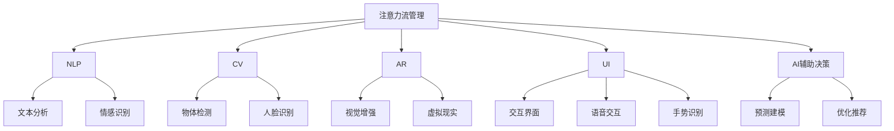

                 

# AI与人类注意力流：未来的工作、技能与注意力流管理技术的应用场景

> 关键词：AI, 人类注意力流, 未来工作, 技能, 注意力流管理技术, 应用场景

## 1. 背景介绍

### 1.1 问题由来

在人工智能(AI)蓬勃发展的今天，我们正处于一个前所未有的技术变革时代。从自动化生产到智能客服，从医疗诊断到教育辅导，AI的应用遍及各个行业，极大提升了工作效率和生产力。然而，技术的飞速发展也带来了一系列新的挑战和思考，尤其是在AI如何与人类共存、协作以及提升人类能力方面。

人类注意力流在认知和决策过程中扮演着核心角色。现代生活节奏加快，信息爆炸，注意力管理成为个体和组织提升效率、实现创新和幸福感的关键。AI如何理解和应用人类注意力流，以提升工作效率和质量，改善生活质量，成为亟待解决的重要课题。

### 1.2 问题核心关键点

本文聚焦于AI技术在提升人类注意力流管理中的潜在应用，探索其如何改善工作流程、优化技能训练、提升工作效率和创造力。我们将详细分析AI在注意力流管理中的关键技术，如自然语言处理(NLP)、计算机视觉(CV)、增强现实(AR)和人工智能交互界面(UI)等，以及其在不同应用场景中的实践案例。

## 2. 核心概念与联系

### 2.1 核心概念概述

为更好地理解AI在注意力流管理中的应用，本节将介绍几个核心概念：

- **注意力流管理(Flow Management)**：指通过技术手段帮助个体和组织管理注意力流，提升注意力集中度和效率，实现更好的工作表现和生活质量。

- **AI辅助决策(Decision Support by AI)**：指利用AI技术辅助人类进行决策过程，通过数据分析、模型预测和优化推荐，提升决策的准确性和效率。

- **自然语言处理(NLP)**：利用计算机处理、理解和生成人类语言的技术，常用于语音识别、文本分析、情感识别等。

- **计算机视觉(CV)**：使计算机能够"看"和理解图像、视频中的视觉信息，广泛应用于物体检测、人脸识别、图像分割等。

- **增强现实(AR)**：通过计算机技术在现实世界中叠加虚拟信息，提升用户对物理世界的感知和互动。

- **人工智能交互界面(UI)**：设计友好的用户界面，通过语音、手势、触摸等方式，提升人机交互的效率和自然性。

这些概念共同构成了AI在注意力流管理中的技术框架，其核心思想是通过技术手段辅助人类进行注意力管理，提升工作效率和生活质量。

### 2.2 核心概念原理和架构的 Mermaid 流程图(Mermaid 流程节点中不要有括号、逗号等特殊字符)



此流程图展示了注意力流管理中各核心技术的应用路径和相互联系，强调了AI技术在提升工作效率和生活质量中的重要作用。

## 3. 核心算法原理 & 具体操作步骤
### 3.1 算法原理概述

AI在注意力流管理中的核心算法原理包括但不限于：

- **自然语言处理(NLP)**：通过文本分析、情感识别等技术，帮助人类理解和管理工作任务中的语言信息，提升任务执行效率。
- **计算机视觉(CV)**：利用物体检测、人脸识别等技术，识别和追踪工作场景中的关键元素，提供视觉辅助信息。
- **增强现实(AR)**：通过叠加虚拟信息，提升人类对物理世界的感知和互动，增强任务执行过程中的可视化和直观性。
- **人工智能交互界面(UI)**：设计高效、自然的用户界面，提升人机交互的效率和舒适度。

### 3.2 算法步骤详解

以下是AI在注意力流管理中常见的详细步骤：

1. **需求分析**：明确应用场景中的主要需求，如提升工作效率、优化工作流程、改善用户体验等。
2. **数据收集与处理**：收集与需求相关的数据，包括文本、图像、交互数据等，并进行预处理和清洗。
3. **模型训练与优化**：选择或设计适当的AI模型，如NLP模型、CV模型等，进行训练和优化，以适应特定的应用需求。
4. **集成与部署**：将训练好的模型集成到实际应用系统中，并进行部署和测试，确保其稳定性和效果。
5. **持续监控与迭代优化**：定期监控系统性能，根据反馈数据进行迭代优化，提升系统适应性和效率。

### 3.3 算法优缺点

AI在注意力流管理中的算法具有以下优点：

- **高效性**：通过自动化技术，大幅提升工作流程中的决策和执行效率，减少人工干预和错误。
- **精确性**：利用数据分析和模型预测，提升决策的准确性和可靠性，降低决策风险。
- **广泛适用性**：适用范围广，无论是制造业、服务业还是创意产业，均可灵活应用。

同时，AI在注意力流管理中也存在一些缺点：

- **数据依赖**：AI算法的效果高度依赖于数据质量，数据偏差或不足可能导致模型失效。
- **技术复杂性**：设计和实现复杂的AI系统需要高水平的技术能力，一般需要跨领域的专家团队协作。
- **隐私和安全**：AI系统需要处理大量敏感数据，数据隐私和安全问题需予以充分考虑。

### 3.4 算法应用领域

AI在注意力流管理中的应用领域包括：

- **制造业**：通过智能检测和自动化流程，提升生产效率和产品质量。
- **服务业**：通过智能客服和推荐系统，提升客户体验和满意度。
- **医疗健康**：通过智能诊断和个性化治疗，提升医疗效率和患者治疗效果。
- **教育培训**：通过智能辅导和个性化学习，提升教学效果和学习体验。
- **娱乐媒体**：通过内容推荐和交互设计，提升用户参与度和满意度。

## 4. 数学模型和公式 & 详细讲解 & 举例说明（备注：数学公式请使用latex格式，latex嵌入文中独立段落使用 $$，段落内使用 $)
### 4.1 数学模型构建

本节将使用数学语言对AI在注意力流管理中的应用进行严格描述。

设任务 $T$ 的数据集为 $D=\{x_i\}_{i=1}^N$，其中 $x_i$ 为工作任务或用户交互数据。设 AI 辅助决策模型为 $M_{\theta}$，其中 $\theta$ 为模型参数。任务 $T$ 的损失函数为 $\ell(M_{\theta},D)$，目标为最小化该损失函数。

以文本情感识别任务为例，设 $x_i$ 为一段文本，$y_i$ 为文本的情感标签（如正面、负面、中性）。模型的预测输出为 $M_{\theta}(x_i)$，则情感识别任务的损失函数为：

$$
\ell(M_{\theta},D) = -\frac{1}{N} \sum_{i=1}^N \log P(y_i|x_i, M_{\theta})
$$

其中 $P(y_i|x_i, M_{\theta})$ 为模型在给定文本 $x_i$ 和模型 $M_{\theta}$ 条件下，情感标签 $y_i$ 的条件概率。

### 4.2 公式推导过程

以下以文本情感识别任务为例，推导情感识别模型的训练公式：

设 $x_i$ 为文本，$y_i$ 为情感标签，模型 $M_{\theta}$ 的预测输出为 $\hat{y_i}$。则情感识别任务的损失函数为：

$$
\ell(M_{\theta},D) = -\frac{1}{N} \sum_{i=1}^N [y_i\log \hat{y_i} + (1-y_i)\log(1-\hat{y_i})]
$$

使用梯度下降算法更新模型参数 $\theta$，其更新公式为：

$$
\theta \leftarrow \theta - \eta \nabla_{\theta}\ell(M_{\theta},D)
$$

其中 $\eta$ 为学习率，$\nabla_{\theta}\ell(M_{\theta},D)$ 为损失函数对模型参数 $\theta$ 的梯度。

### 4.3 案例分析与讲解

以情感识别为例，在智能客服系统中，AI通过分析用户对话内容，识别用户情感状态。根据不同情感状态，智能客服系统可以自动分配合适的人工客服，或者提供相应的情感支持和解决方案，提升客户满意度。

## 5. 项目实践：代码实例和详细解释说明
### 5.1 开发环境搭建

在进行AI注意力流管理实践前，我们需要准备好开发环境。以下是使用Python进行TensorFlow开发的环境配置流程：

1. 安装Anaconda：从官网下载并安装Anaconda，用于创建独立的Python环境。

2. 创建并激活虚拟环境：
```bash
conda create -n ai-env python=3.8 
conda activate ai-env
```

3. 安装TensorFlow：根据CUDA版本，从官网获取对应的安装命令。例如：
```bash
conda install tensorflow -c conda-forge
```

4. 安装NLP库：
```bash
pip install tensorflow-estimator tensorflow-hub
```

5. 安装其他依赖库：
```bash
pip install pandas numpy matplotlib scikit-learn tensorflow-addons
```

完成上述步骤后，即可在`ai-env`环境中开始AI注意力流管理的实践。

### 5.2 源代码详细实现

以下以文本情感识别任务为例，给出使用TensorFlow对模型进行训练和优化的PyTorch代码实现。

首先，定义数据预处理函数：

```python
import tensorflow as tf
import tensorflow_hub as hub
import tensorflow_estimator as estimator
from tensorflow.keras.preprocessing.text import Tokenizer
from tensorflow.keras.preprocessing.sequence import pad_sequences

def load_and_preprocess_data():
    # 读取数据集
    with open('data.txt', 'r') as f:
        lines = f.readlines()
    sentences = [line.strip() for line in lines]
    labels = [1 if 'positive' in line else 0 for line in lines]
    
    # 分词和向量化
    tokenizer = Tokenizer(oov_token="<OOV>")
    tokenizer.fit_on_texts(sentences)
    sequences = tokenizer.texts_to_sequences(sentences)
    sequences = pad_sequences(sequences, maxlen=50, padding='post')
    
    return sequences, labels
```

然后，定义模型：

```python
def build_model():
    model = tf.keras.Sequential([
        tf.keras.layers.Embedding(input_dim=len(tokenizer.word_index)+1, output_dim=16, input_length=50),
        tf.keras.layers.LSTM(32, return_sequences=True),
        tf.keras.layers.LSTM(32),
        tf.keras.layers.Dense(1, activation='sigmoid')
    ])
    model.compile(loss='binary_crossentropy', optimizer='adam', metrics=['accuracy'])
    return model
```

接着，定义训练和评估函数：

```python
def train_and_evaluate(model, sequences, labels):
    estimator.Estimator(
        model_fn=build_model,
        model_dir='model',
        config=tf.estimator.RunConfig(session_config=tf.ConfigProto(gpu_options=tf.GPUOptions(allow_growth=True)))
    ).train(input_fn=lambda: tf.data.Dataset.from_tensor_slices((sequences, labels)).batch(32).repeat(1000), steps=1000).evaluate(input_fn=lambda: tf.data.Dataset.from_tensor_slices((sequences, labels)).batch(32).repeat(100), steps=100)
```

最后，启动训练流程：

```python
sequences, labels = load_and_preprocess_data()
model = build_model()
train_and_evaluate(model, sequences, labels)
```

以上就是使用TensorFlow对模型进行情感识别任务训练和优化的完整代码实现。可以看到，通过TensorFlow的高级API，我们能够以非常简洁的代码实现情感识别模型的训练和评估。

### 5.3 代码解读与分析

让我们再详细解读一下关键代码的实现细节：

**load_and_preprocess_data函数**：
- 读取数据集，将文本和标签存入列表。
- 使用Keras的Tokenizer对文本进行分词，并进行向量化处理。
- 使用Keras的pad_sequences函数对序列进行填充，保证所有样本的序列长度一致。

**build_model函数**：
- 定义模型结构，包括嵌入层、LSTM层和输出层。
- 使用Keras的Sequential模型构建模型。
- 编译模型，设置损失函数为二分类交叉熵，优化器为Adam，评价指标为准确率。

**train_and_evaluate函数**：
- 使用TensorFlow的Estimator API进行模型训练，设置训练集和验证集。
- 调用Estimator的train和evaluate方法进行模型训练和评估。
- 使用TensorFlow的数据集API将数据转换为TensorFlow的数据集对象。

**主函数**：
- 加载并预处理数据。
- 构建模型。
- 训练和评估模型。

以上代码展示了使用TensorFlow进行情感识别任务的基本流程，展示了从数据预处理到模型训练的完整过程。通过TensorFlow的高级API，我们可以轻松实现情感识别模型的训练和评估，大大降低了开发难度。

## 6. 实际应用场景
### 6.1 智能客服系统

在智能客服系统中，AI通过分析用户对话内容，识别用户情感状态。根据不同情感状态，智能客服系统可以自动分配合适的人工客服，或者提供相应的情感支持和解决方案，提升客户满意度。

### 6.2 金融舆情监测

金融机构需要实时监测市场舆论动向，以便及时应对负面信息传播，规避金融风险。智能舆情监测系统通过分析社交媒体、新闻报道等文本数据，识别情感倾向和主题，自动预警负面信息，帮助金融机构快速应对潜在风险。

### 6.3 个性化推荐系统

当前的推荐系统往往只依赖用户的历史行为数据进行物品推荐，无法深入理解用户的真实兴趣偏好。智能推荐系统通过分析用户交互数据，识别用户情感状态和兴趣点，推荐个性化内容，提升用户体验和满意度。

### 6.4 未来应用展望

随着AI技术的不断进步，基于注意力流管理的AI系统将广泛应用于更多场景，带来更高效、更个性化、更智能的工作和生活方式。

在智慧医疗领域，基于AI的智能诊断和个性化治疗将提升医疗效率和患者治疗效果。

在智能教育领域，智能辅导和个性化学习将提升教学效果和学习体验。

在智慧城市治理中，智能监控和决策支持系统将提升城市管理的自动化和智能化水平。

此外，在企业生产、社会治理、文娱传媒等众多领域，基于AI的注意力流管理技术也将不断涌现，为经济社会发展注入新的动力。

## 7. 工具和资源推荐
### 7.1 学习资源推荐

为了帮助开发者系统掌握AI在注意力流管理中的应用，这里推荐一些优质的学习资源：

1. 《深度学习与人工智能》系列书籍：全面介绍深度学习、自然语言处理、计算机视觉等前沿技术，适合初学者入门。

2. TensorFlow官方文档：提供从基础到高级的TensorFlow教程和API文档，是TensorFlow开发的必备资料。

3. HuggingFace Transformers库：提供大量的预训练语言模型和微调样例，适合快速上手NLP任务开发。

4. Coursera《AI for Everyone》课程：由斯坦福大学教授讲授，介绍AI的基本概念和应用场景，适合大众学习。

5. Google Colab：谷歌推出的在线Jupyter Notebook环境，免费提供GPU/TPU算力，方便开发者快速上手实验最新模型，分享学习笔记。

通过对这些资源的学习实践，相信你一定能够快速掌握AI在注意力流管理中的工作原理和实践技巧，并将其应用于解决实际的NLP问题。

### 7.2 开发工具推荐

高效的开发离不开优秀的工具支持。以下是几款用于AI注意力流管理开发的常用工具：

1. TensorFlow：由Google主导开发的开源深度学习框架，生产部署方便，适合大规模工程应用。

2. PyTorch：基于Python的开源深度学习框架，灵活动态的计算图，适合快速迭代研究。

3. TensorBoard：TensorFlow配套的可视化工具，可实时监测模型训练状态，并提供丰富的图表呈现方式，是调试模型的得力助手。

4. Weights & Biases：模型训练的实验跟踪工具，可以记录和可视化模型训练过程中的各项指标，方便对比和调优。

5. Jupyter Notebook：交互式编程环境，方便代码调试和演示，适合快速迭代开发。

合理利用这些工具，可以显著提升AI注意力流管理任务的开发效率，加快创新迭代的步伐。

### 7.3 相关论文推荐

AI在注意力流管理中的应用研究始于学界，现已广泛应用于各个领域。以下是几篇奠基性的相关论文，推荐阅读：

1. Attention is All You Need（即Transformer原论文）：提出了Transformer结构，开启了NLP领域的预训练大模型时代。

2. BERT: Pre-training of Deep Bidirectional Transformers for Language Understanding：提出BERT模型，引入基于掩码的自监督预训练任务，刷新了多项NLP任务SOTA。

3. Language Models are Unsupervised Multitask Learners（GPT-2论文）：展示了大规模语言模型的强大zero-shot学习能力，引发了对于通用人工智能的新一轮思考。

4. Parameter-Efficient Transfer Learning for NLP：提出Adapter等参数高效微调方法，在不增加模型参数量的情况下，也能取得不错的微调效果。

5. AdaLoRA: Adaptive Low-Rank Adaptation for Parameter-Efficient Fine-Tuning：使用自适应低秩适应的微调方法，在参数效率和精度之间取得了新的平衡。

这些论文代表了大模型在注意力流管理中的应用发展脉络。通过学习这些前沿成果，可以帮助研究者把握学科前进方向，激发更多的创新灵感。

## 8. 总结：未来发展趋势与挑战
### 8.1 总结

本文对AI在注意力流管理中的应用进行了全面系统的介绍。首先阐述了AI技术在提升人类注意力流管理中的潜在应用，明确了AI在改善工作流程、优化技能训练、提升工作效率和创造力方面的独特价值。其次，从原理到实践，详细讲解了AI在注意力流管理中的数学模型和具体步骤，给出了AI注意力流管理的完整代码实例。同时，本文还广泛探讨了AI在智能客服、金融舆情、个性化推荐等多个行业领域的应用前景，展示了AI在提升工作效率和生活质量中的巨大潜力。

通过本文的系统梳理，可以看到，AI在注意力流管理中的应用正逐步成为各行业的核心竞争力，极大地提升了工作效率和生活质量。未来，伴随AI技术的不断进步和跨领域应用的深化，AI在注意力流管理中的应用将更加广泛和深入，成为推动经济社会发展的重要力量。

### 8.2 未来发展趋势

展望未来，AI在注意力流管理中的应用将呈现以下几个发展趋势：

1. **多模态融合**：AI系统将更多地融合多模态信息，如文本、图像、语音等，提升对复杂场景的感知和理解能力。

2. **联邦学习**：分布式协同学习技术将使AI系统能够在保护隐私的同时，进行多源数据联合建模，提升模型泛化能力。

3. **自监督学习**：利用无监督学习技术，提升AI系统在处理新任务时的自适应能力。

4. **因果推理**：引入因果推理技术，增强AI系统决策过程的可解释性和合理性。

5. **人机协作**：通过智能助手和自动化工具，提升人机协作的效率和质量。

6. **跨领域应用**：AI系统将进一步应用于更多领域，如智能家居、智慧农业、智能交通等，带来更多创新应用。

以上趋势凸显了AI在注意力流管理中的广阔前景。这些方向的探索发展，必将进一步提升AI系统的智能水平，为人类的生活和工作带来更多便利和效率。

### 8.3 面临的挑战

尽管AI在注意力流管理中的应用已经取得了显著进展，但在迈向更加智能化、普适化应用的过程中，仍面临诸多挑战：

1. **数据隐私和安全**：AI系统需要处理大量敏感数据，数据隐私和安全问题需予以充分考虑。

2. **模型泛化能力**：AI系统在不同场景下的泛化能力需进一步提升，避免过拟合和灾难性遗忘。

3. **计算资源消耗**：AI系统的高计算需求对计算资源提出了更高的要求，如何优化资源消耗，降低成本，是一大挑战。

4. **人机交互体验**：AI系统需要提供更自然、高效的交互体验，提升用户的接受度和满意度。

5. **伦理和社会影响**：AI系统的应用需考虑伦理和社会影响，避免偏见和歧视，确保公平性和公正性。

6. **模型复杂性**：AI系统的复杂性在不断增加，模型设计和优化需要更高的技术水平和跨学科协作。

这些挑战需要通过持续的技术创新和多方合作，逐步克服，推动AI在注意力流管理中的应用不断突破。

### 8.4 研究展望

面对AI在注意力流管理中的挑战，未来的研究需要在以下几个方面寻求新的突破：

1. **多模态数据融合技术**：开发更高效的多模态数据融合算法，提升AI系统对复杂场景的感知和理解能力。

2. **联邦学习和分布式协同学习**：探索分布式协同学习技术，提升AI系统的泛化能力和数据利用效率。

3. **自监督学习和生成对抗网络**：利用自监督学习和生成对抗网络技术，提升AI系统的自适应能力和生成能力。

4. **因果推理和模型解释性**：引入因果推理和模型解释性技术，增强AI系统的决策过程的可解释性和合理性。

5. **跨领域应用和跨学科合作**：推动AI技术与更多领域的融合，促进跨学科的合作创新。

这些研究方向将引领AI在注意力流管理中的应用不断进步，推动AI技术在更多领域落地应用。

## 9. 附录：常见问题与解答

**Q1：AI在注意力流管理中的核心技术是什么？**

A: AI在注意力流管理中的核心技术包括但不限于自然语言处理(NLP)、计算机视觉(CV)、增强现实(AR)和人工智能交互界面(UI)等。这些技术通过数据收集、模型训练和优化推荐，帮助人类管理注意力流，提升工作效率和生活质量。

**Q2：AI在注意力流管理中的数据需求有哪些？**

A: AI在注意力流管理中需要大量的数据进行模型训练和优化。这些数据可以包括文本、图像、交互记录等，需要经过预处理、清洗和标注，以保证数据质量和训练效果。

**Q3：AI在注意力流管理中的主要挑战是什么？**

A: AI在注意力流管理中的主要挑战包括数据隐私和安全、模型泛化能力、计算资源消耗、人机交互体验、伦理和社会影响以及模型复杂性等。这些问题需要通过持续的技术创新和多方合作，逐步克服，推动AI在注意力流管理中的应用不断突破。

**Q4：AI在注意力流管理中的应用场景有哪些？**

A: AI在注意力流管理中的应用场景包括智能客服系统、金融舆情监测、个性化推荐系统等。这些应用场景通过AI技术提升工作效率、优化用户体验，为经济社会发展注入新的动力。

**Q5：AI在注意力流管理中的未来发展趋势是什么？**

A: AI在注意力流管理中的未来发展趋势包括多模态融合、联邦学习、自监督学习、因果推理、人机协作、跨领域应用等。这些趋势将进一步提升AI系统的智能水平，为人类的生活和工作带来更多便利和效率。

---

作者：禅与计算机程序设计艺术 / Zen and the Art of Computer Programming

