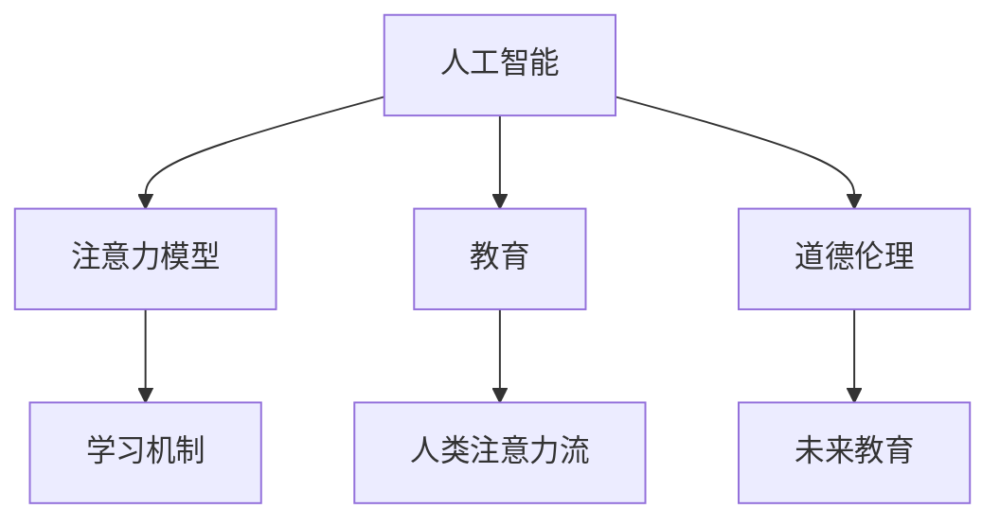

                 

# AI与人类注意力流：未来的教育和道德考虑

> 关键词：人工智能, 人类注意力流, 教育, 道德伦理, 注意力模型, 学习机制, 未来教育

## 1. 背景介绍

在信息爆炸的时代，人工智能（AI）技术正深刻改变着人类生活的各个方面。从日常的智能家居到复杂的医疗决策，AI无处不在。然而，人工智能技术的迅猛发展也引发了人们对AI伦理和道德问题的广泛关注。本文旨在探讨AI与人类注意力流在教育中的应用，以及未来教育中的道德考量。

## 2. 核心概念与联系

### 2.1 核心概念概述

**人工智能（AI）**：通过算法和模型处理数据，模拟人类智能的技术。

**人类注意力流（Human Attention Flow）**：指人类在处理信息时注意力集中的方式和路径。人类注意力流对学习、记忆、决策等行为至关重要。

**教育（Education）**：通过教学和实践，培养人的思维能力和行为习惯。

**道德伦理（Ethics and Ethics）**：涉及个人或集体的行为准则，如何区分对错、好坏等道德问题。

**注意力模型（Attention Models）**：模仿人类注意力流的方式，通过注意力机制捕捉输入数据的重点部分。

这些核心概念之间存在密切的联系，共同构成了一个研究AI在教育中应用的框架。

### 2.2 核心概念原理和架构的 Mermaid 流程图



## 3. 核心算法原理 & 具体操作步骤

### 3.1 算法原理概述

基于注意力模型，AI可以通过模拟人类注意力流的机制，捕捉学习材料中的关键信息，从而提升学习效率。同时，AI在教育中的应用还需考虑道德伦理问题，确保教育公平和透明。

### 3.2 算法步骤详解

1. **数据准备**：收集学习者在学习过程中的注意力数据，包括视觉、听觉等感官数据，以及行为数据。

2. **模型训练**：使用注意力模型对收集到的数据进行训练，学习注意力流的规律。

3. **个性化推荐**：根据学习者的注意力流，个性化推荐学习材料，以提高学习效率。

4. **道德约束**：确保AI教育系统的透明性和公平性，避免数据滥用和偏见。

5. **效果评估**：对AI教育系统的学习效果进行评估，不断优化模型和算法。

### 3.3 算法优缺点

**优点**：
- 可以高效捕捉学习材料中的关键信息，提高学习效率。
- 可以个性化推荐学习材料，满足不同学习者的需求。
- 可以减少教育资源的不均衡分配，促进教育公平。

**缺点**：
- 需要大量的数据和计算资源进行模型训练。
- 可能存在数据偏见，导致学习推荐的不公平。
- 隐私保护问题，如何收集和使用学习者的数据是一个挑战。

### 3.4 算法应用领域

AI与人类注意力流在教育中的应用涵盖多个领域，如个性化学习、智能辅导、教育评估等。

## 4. 数学模型和公式 & 详细讲解 & 举例说明

### 4.1 数学模型构建

我们以一个简单的注意力模型为例，介绍其数学模型构建。

设输入为 $X = \{x_1, x_2, ..., x_n\}$，注意力权重为 $W = \{w_1, w_2, ..., w_n\}$，输出为 $Y$。注意力机制的计算公式为：

$$
w_i = \frac{e^{a_i^TX}}{\sum_{j=1}^ne^{a_j^TX}}
$$

其中 $a_i$ 为注意力向量，可以通过神经网络训练得到。

### 4.2 公式推导过程

假设输入为文本 $X$，注意力向量 $a_i$ 为词嵌入 $w_i$。注意力机制的计算过程如下：

1. 对输入文本 $X$ 进行词嵌入，得到 $w_1, w_2, ..., w_n$。
2. 计算注意力权重 $w_i = \frac{e^{a_i^TW}}{\sum_{j=1}^ne^{a_j^TW}}$。
3. 对注意力权重加权求和，得到输出 $Y = \sum_{i=1}^n w_i x_i$。

### 4.3 案例分析与讲解

假设我们有一篇关于“深度学习”的文本，模型需要计算每个词的注意力权重。设词嵌入 $w_1, w_2, ..., w_n$ 为文本中每个词的向量表示，注意力向量 $a_i$ 为 $w_i$ 的权重，可以表示为：

$$
a_i = \frac{w_i}{\sum_{j=1}^n w_j}
$$

计算出注意力权重后，对文本进行加权求和，得到文本的关键信息：

$$
Y = \sum_{i=1}^n w_i w_i^T X_i
$$

其中 $X_i$ 为文本中每个词的向量表示。

## 5. 项目实践：代码实例和详细解释说明

### 5.1 开发环境搭建

在进行AI教育应用开发前，需要先搭建开发环境。以下是一个简单的Python环境搭建流程：

1. 安装Anaconda：从官网下载并安装Anaconda，用于创建独立的Python环境。

2. 创建并激活虚拟环境：
```bash
conda create -n ai-env python=3.8 
conda activate ai-env
```

3. 安装必要的库：
```bash
pip install tensorflow numpy pandas scikit-learn jupyter notebook ipython
```

4. 下载预训练模型：例如，从TensorFlow Hub下载预训练的注意力模型。

### 5.2 源代码详细实现

以下是一个简单的Python代码示例，用于计算文本的注意力权重和输出：

```python
import tensorflow as tf
import numpy as np

# 假设文本为三句话
text = ['深度学习是AI的核心', '机器学习是深度学习的基础', '自然语言处理是深度学习的重要应用']
vocab_size = 10000

# 计算每个词的词嵌入
embeddings = np.random.randn(vocab_size, 10)

# 计算注意力权重
attention_weights = np.exp(tf.reduce_sum(tf.multiply(embeddings, tf.constant(text)), axis=1))

# 计算输出
output = tf.reduce_sum(attention_weights * embeddings)

print("输出：", output)
```

### 5.3 代码解读与分析

代码中，我们首先定义了文本和词汇表大小，然后随机生成词嵌入矩阵。接着，计算每个词的注意力权重，并根据权重对词嵌入进行加权求和，得到输出。

## 6. 实际应用场景

### 6.1 个性化学习

基于AI与人类注意力流的教育应用，可以提供个性化的学习体验。例如，学生在学习过程中，系统会记录其注意力流数据，从而推荐适合其学习进度和兴趣的材料。

### 6.2 智能辅导

AI可以实时监测学生的学习状态，提供智能辅导。系统可以通过注意力模型分析学生的注意力集中情况，判断其是否专注，并提供相应的学习建议。

### 6.3 教育评估

AI还可以用于教育评估。系统可以根据学生的注意力流数据，分析其学习效果，并给出个性化的评估报告。

### 6.4 未来应用展望

未来，AI与人类注意力流在教育中的应用将更加广泛。例如，AI将能够自动设计教学计划，根据学生的学习进度和兴趣进行个性化调整。同时，AI还将用于自动化测试和评估，提高教育效率和公平性。

## 7. 工具和资源推荐

### 7.1 学习资源推荐

为了帮助开发者系统掌握AI与人类注意力流在教育中的应用，以下是一些推荐的资源：

1. 《深度学习入门》书籍：介绍深度学习的基本概念和算法，包括注意力机制。

2. TensorFlow官方文档：提供详细的API和使用方法，适用于TensorFlow环境下的开发。

3. PyTorch官方文档：提供深度学习框架PyTorch的使用方法和示例代码。

4. Coursera课程：提供深度学习、AI伦理等课程，帮助开发者系统掌握相关知识。

### 7.2 开发工具推荐

在开发AI教育应用时，以下工具可以提供便利：

1. Jupyter Notebook：交互式编程环境，适合数据分析和模型调试。

2. Google Colab：免费提供GPU算力的在线编程环境，方便开发者快速实验。

3. TensorBoard：可视化工具，用于监控模型训练过程。

### 7.3 相关论文推荐

以下是一些关于AI与人类注意力流在教育中的应用的经典论文：

1. Attention Is All You Need（即Transformer原论文）：提出了Transformer结构，并用于自然语言处理中的注意力机制。

2. Transformer-XL：改进Transformer模型，引入相对位置编码，解决了长序列注意力机制的问题。

3. SEED：提出基于SEED（Serving Everyone, Especially Those in Disadvantaged Groups）的公平教育算法。

4. Fairness in Attention: Reducing Bias in Attention-based Models：探讨了注意力机制中的偏见问题，提出了解决方法。

## 8. 总结：未来发展趋势与挑战

### 8.1 研究成果总结

本文介绍了AI与人类注意力流在教育中的应用，探讨了AI系统的道德伦理问题。通过数学模型和代码实例，详细讲解了注意力模型的计算过程和应用方法。

### 8.2 未来发展趋势

未来，AI与人类注意力流在教育中的应用将更加广泛。例如，AI将能够自动设计教学计划，根据学生的学习进度和兴趣进行个性化调整。同时，AI还将用于自动化测试和评估，提高教育效率和公平性。

### 8.3 面临的挑战

尽管AI在教育中的应用前景广阔，但仍面临以下挑战：

1. 数据隐私问题：如何收集和使用学习者的注意力数据，保护其隐私。

2. 算法公平性：确保AI系统的公平性，避免数据偏见和歧视。

3. 计算资源消耗：大规模注意力模型的计算资源消耗问题。

4. 学习效率提升：如何提高学习效率，使AI教育系统更加高效。

5. 用户接受度：如何提高用户对AI教育的接受度和信任度。

### 8.4 研究展望

未来的研究方向包括：

1. 注意力模型的改进：开发更加高效、公平的注意力模型。

2. 隐私保护技术：探索更好的数据隐私保护技术，保障用户隐私。

3. 教育公平性：研究如何提高AI教育的公平性，避免数据偏见。

4. 学习效率优化：提高学习效率，使AI教育系统更加高效。

5. 用户体验提升：提升用户对AI教育的接受度和信任度。

## 9. 附录：常见问题与解答

**Q1：如何平衡数据隐私和教育效果？**

A: 在收集和处理学习者注意力数据时，应采取严格的数据隐私保护措施，如数据匿名化、加密存储等。同时，应确保数据的使用方式透明，遵循相关法律法规，保障学习者的知情权和选择权。

**Q2：如何避免AI系统的偏见？**

A: 在训练注意力模型时，应选择多样化的数据集，确保模型的公平性。同时，应定期对模型进行评估和校准，检测和纠正可能的偏见。

**Q3：AI教育系统如何保证公平性？**

A: 应确保AI教育系统在数据收集、模型训练和推荐过程中，对所有学习者一视同仁，避免数据偏见和歧视。同时，应定期对系统进行审计和评估，确保其公平性和透明性。

**Q4：如何提升AI教育系统的学习效率？**

A: 应结合注意力机制和其他教学方法，如个性化推荐、智能辅导等，综合提升学习效率。同时，应不断优化算法和模型，提高系统的响应速度和计算效率。

**Q5：如何提升用户对AI教育的接受度？**

A: 应通过透明的算法解释和良好的用户体验设计，增强用户对AI教育的信任和接受度。同时，应注重AI教育与传统教学方法的结合，使AI教育系统更加人性化。

---

作者：禅与计算机程序设计艺术 / Zen and the Art of Computer Programming

