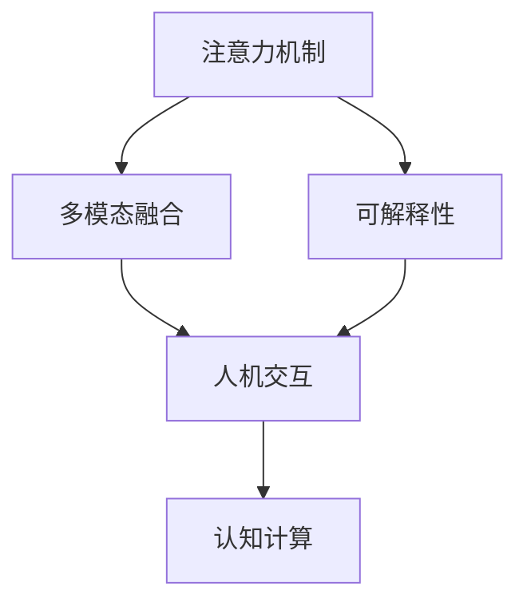

                 

# AI与人类注意力流：未来的教育、工作与AI的融合

> 关键词：人工智能(AI)，人类注意力流，未来教育，未来工作，AI与人类融合

## 1. 背景介绍

### 1.1 问题由来

在当今这个快速变化的时代，人工智能(AI)正以前所未有的速度和深度改变着我们的生活和工作方式。从自动驾驶汽车到智能客服，从个性化推荐系统到语音助手，AI技术已经渗透到各行各业。然而，尽管AI技术取得了显著的进展，它在与人类协作时仍存在一定的局限性，尤其是在理解和应用人类注意力流方面。

人类注意力流指的是人类在处理信息时所关注的焦点、信息流的方向和模式。AI与人类注意力流的有效融合，不仅能增强AI系统的感知、理解和决策能力，还能提升用户体验，实现人机协同的智能交互。因此，探索AI与人类注意力流的融合，对于构建未来更加智能化、人性化的AI系统具有重要意义。

### 1.2 问题核心关键点

AI与人类注意力流的融合主要围绕以下几个核心关键点：

- **注意力机制**：如何理解和建模人类注意力机制，以提高AI系统对信息流的理解和响应能力。
- **多模态融合**：如何将视觉、听觉、文本等多种信息源进行有效融合，以提升AI系统的感知和理解能力。
- **可解释性**：如何增强AI系统的可解释性，使用户能够理解和信任AI的决策过程。
- **人机交互**：如何设计高效、自然的人机交互方式，提升用户体验，实现AI与人类无缝协作。

本文将深入探讨这些关键点，系统梳理AI与人类注意力流融合的理论基础和实践方法，并结合实际应用场景，提出具体解决方案。

## 2. 核心概念与联系

### 2.1 核心概念概述

为更好地理解AI与人类注意力流融合的框架，本节将介绍几个密切相关的核心概念：

- **注意力机制**：指在处理序列数据时，动态选择信息流中关键部分进行集中处理的过程。
- **多模态融合**：指将不同模态的信息源进行有机整合，以提升AI系统的感知和理解能力。
- **可解释性**：指AI系统的决策过程能够被用户理解和信任，增强其可信度和透明度。
- **人机交互**：指设计高效、自然的人机交互方式，提升用户体验，实现人机协同。
- **认知计算**：指通过模拟人类认知过程，提升AI系统的智能水平，实现更自然的交互。

这些核心概念之间的逻辑关系可以通过以下Mermaid流程图来展示：



这个流程图展示了注意力机制、多模态融合、可解释性、人机交互和认知计算之间的联系和互动。

## 3. 核心算法原理 & 具体操作步骤

### 3.1 算法原理概述

AI与人类注意力流融合的核心算法原理主要基于注意力机制和多模态融合。其核心思想是：通过动态选择关键信息流进行处理，并综合不同模态的信息源，以提升AI系统的感知、理解和决策能力。

形式化地，假设AI系统输入为多模态信息流 $\mathbf{x}=[x_1,x_2,\ldots,x_n]$，其中 $x_i$ 表示模态 $i$ 的信息源，如文本、图像、语音等。注意力机制 $\alpha$ 用于选择关键信息源，计算方法为：

$$
\alpha_i = \frac{\exp(\text{score}_i(\mathbf{x}))}{\sum_{j=1}^n \exp(\text{score}_j(\mathbf{x}))}
$$

其中 $\text{score}_i(\mathbf{x})$ 为模态 $i$ 的信息源的注意力得分函数，通常包括匹配度、权重等。

多模态融合 $f$ 方法将不同模态的信息源进行整合，计算方法为：

$$
y = f(\alpha_1 x_1, \alpha_2 x_2, \ldots, \alpha_n x_n)
$$

其中 $y$ 表示融合后的信息源，$\alpha_i$ 为注意力权重，表示模态 $i$ 的信息源的重要程度。

### 3.2 算法步骤详解

AI与人类注意力流融合的算法步骤通常包括：

**Step 1: 输入数据准备**
- 收集多模态数据，包括文本、图像、语音等。
- 对数据进行预处理，如分词、分割、特征提取等。

**Step 2: 注意力机制建模**
- 设计注意力得分函数 $\text{score}_i(\mathbf{x})$，衡量不同模态信息源的匹配度和权重。
- 应用注意力机制 $\alpha$ 选择关键信息源，计算注意力权重 $\alpha_i$。

**Step 3: 多模态信息融合**
- 应用多模态融合方法 $f$ 将不同模态的信息源进行整合，计算输出 $y$。

**Step 4: 模型训练与优化**
- 使用标注数据对融合模型进行训练，最小化预测输出与真实标签之间的差距。
- 应用正则化技术，如L2正则、Dropout等，避免过拟合。

**Step 5: 模型评估与部署**
- 在验证集上评估融合模型的性能，调整模型参数。
- 部署模型到实际应用场景，进行持续优化和维护。

### 3.3 算法优缺点

AI与人类注意力流融合的算法具有以下优点：

- 增强感知和理解能力。通过注意力机制和多模态融合，AI系统能够更好地理解和处理多模态信息流，提升感知和理解能力。
- 提高决策的准确性。融合不同模态的信息源，能够提供更全面、准确的决策依据。
- 增强系统的可解释性。通过设计可解释的注意力机制和多模态融合方法，用户能够更好地理解和信任AI的决策过程。

同时，该算法也存在以下局限性：

- 对数据质量依赖较大。多模态数据的收集和处理需要较高的成本和技术要求。
- 计算复杂度较高。注意力机制和多模态融合方法通常需要较高的计算资源和时间。
- 模型可解释性仍需改进。现有方法在增强可解释性方面仍需进一步优化和研究。

尽管存在这些局限性，但就目前而言，注意力机制和多模态融合仍是构建智能系统的核心技术，其应用前景广阔。未来相关研究的重点在于如何进一步降低计算复杂度，提高模型可解释性，同时优化数据处理流程，提升系统性能。

### 3.4 算法应用领域

AI与人类注意力流融合的算法在多个领域中得到了广泛应用，例如：

- **智能教育**：通过分析学生的注意力流，提供个性化的学习推荐和反馈。
- **智能医疗**：结合医生的注意力流，实现病历数据的智能分析和诊断。
- **智能安防**：利用视频和音频信息，实时分析监控场景中的注意力流，提升安全检测能力。
- **智能客服**：通过分析用户的行为和情感，提升客服系统的智能交互和用户体验。
- **智能交通**：结合驾驶者和乘客的注意力流，实现智能导航和交通管理。

这些领域的应用展示了AI与人类注意力流融合的巨大潜力，为各行业的智能化转型提供了新的方向和机遇。

## 4. 数学模型和公式 & 详细讲解

### 4.1 数学模型构建

本节将使用数学语言对AI与人类注意力流融合过程进行更加严格的刻画。

假设输入数据 $\mathbf{x}=[x_1,x_2,\ldots,x_n]$，其中 $x_i$ 表示模态 $i$ 的信息源。设计注意力得分函数 $\text{score}_i(\mathbf{x})$ 和注意力权重 $\alpha_i$：

$$
\alpha_i = \frac{\exp(\text{score}_i(\mathbf{x}))}{\sum_{j=1}^n \exp(\text{score}_j(\mathbf{x}))}
$$

多模态融合方法 $f$ 将不同模态的信息源进行整合，计算输出 $y$：

$$
y = f(\alpha_1 x_1, \alpha_2 x_2, \ldots, \alpha_n x_n)
$$

### 4.2 公式推导过程

以下我们以二分类任务为例，推导注意力机制和多模态融合的计算公式。

假设输入数据 $\mathbf{x}=[x_1,x_2,\ldots,x_n]$，其中 $x_i$ 表示模态 $i$ 的信息源，如文本、图像、语音等。注意力得分函数 $\text{score}_i(\mathbf{x})$ 计算不同模态信息源的匹配度和权重，通常包括向量内积、余弦相似度等。

注意力权重 $\alpha_i$ 计算方法为：

$$
\alpha_i = \frac{\exp(\text{score}_i(\mathbf{x}))}{\sum_{j=1}^n \exp(\text{score}_j(\mathbf{x}))}
$$

多模态融合 $f$ 方法将不同模态的信息源进行整合，计算输出 $y$，通常包括拼接、加权平均等方法。

例如，对于文本和图像信息源，可以通过拼接方法计算输出：

$$
y = [x_1, x_2] \cdot [\alpha_1, \alpha_2]
$$

其中 $\cdot$ 表示元素乘法。

在得到注意力权重和多模态融合输出后，即可构建基于注意力机制和多模态融合的AI系统，用于处理多模态信息流。

### 4.3 案例分析与讲解

考虑一个智能客服系统的应用场景。系统输入为用户的语音和文本信息，通过设计注意力得分函数 $\text{score}_i(\mathbf{x})$ 计算语音和文本的匹配度和权重，应用注意力机制 $\alpha$ 选择关键信息源。接着，使用拼接方法 $f$ 将语音和文本信息进行整合，计算输出 $y$。最后，使用标注数据对融合模型进行训练，最小化预测输出与真实标签之间的差距。

训练过程中，应用正则化技术，如L2正则、Dropout等，避免过拟合。在验证集上评估融合模型的性能，调整模型参数。部署模型到实际应用场景，进行持续优化和维护，以提升系统的智能交互和用户体验。

## 5. 项目实践：代码实例和详细解释说明

### 5.1 开发环境搭建

在进行AI与人类注意力流融合实践前，我们需要准备好开发环境。以下是使用Python进行PyTorch开发的环境配置流程：

1. 安装Anaconda：从官网下载并安装Anaconda，用于创建独立的Python环境。

2. 创建并激活虚拟环境：
```bash
conda create -n attention-env python=3.8 
conda activate attention-env
```

3. 安装PyTorch：根据CUDA版本，从官网获取对应的安装命令。例如：
```bash
conda install pytorch torchvision torchaudio cudatoolkit=11.1 -c pytorch -c conda-forge
```

4. 安装TensorFlow：
```bash
pip install tensorflow
```

5. 安装Numpy、Pandas、Scikit-learn、Matplotlib、Tqdm、Jupyter Notebook、Ipython等库：
```bash
pip install numpy pandas scikit-learn matplotlib tqdm jupyter notebook ipython
```

完成上述步骤后，即可在`attention-env`环境中开始实践。

### 5.2 源代码详细实现

下面我们以智能客服系统的语音和文本融合为例，给出使用PyTorch和TensorFlow进行注意力机制和多模态融合的PyTorch代码实现。

首先，定义多模态数据处理函数：

```python
import torch
from transformers import BertTokenizer, BertForSequenceClassification
from transformers import TFAutoModelForSequenceClassification

class MultiModalDataset(torch.utils.data.Dataset):
    def __init__(self, texts, labels, tokenizer, max_len=128):
        self.texts = texts
        self.labels = labels
        self.tokenizer = tokenizer
        self.max_len = max_len
        
    def __len__(self):
        return len(self.texts)
    
    def __getitem__(self, item):
        text = self.texts[item]
        label = self.labels[item]
        
        encoding = self.tokenizer(text, return_tensors='pt', max_length=self.max_len, padding='max_length', truncation=True)
        input_ids = encoding['input_ids'][0]
        attention_mask = encoding['attention_mask'][0]
        
        # 将语音转换为文本并编码
        speech = self.speech[item]
        speech_text = speech_to_text(speech)
        speech_encoding = self.tokenizer(speech_text, return_tensors='pt', max_length=self.max_len, padding='max_length', truncation=True)
        speech_input_ids = speech_encoding['input_ids'][0]
        speech_attention_mask = speech_encoding['attention_mask'][0]
        
        # 对文本和语音的信息进行拼接
        x = torch.cat([input_ids, speech_input_ids])
        x_attention_mask = torch.cat([attention_mask, speech_attention_mask])
        
        # 对标签进行编码
        encoded_labels = [label2id[label] for label in labels] 
        encoded_labels.extend([label2id['O']] * (self.max_len - len(encoded_labels)))
        labels = torch.tensor(encoded_labels, dtype=torch.long)
        
        return {'x': x, 
                'x_attention_mask': x_attention_mask,
                'labels': labels}
```

然后，定义注意力得分函数 $\text{score}_i(\mathbf{x})$：

```python
class AttentionScoreFunction:
    def __init__(self, text_field, speech_field):
        self.text_field = text_field
        self.speech_field = speech_field
        
    def __call__(self, data):
        text_x = data['x']
        speech_x = data['x'][:, 0]
        text_score = text_x @ text_field.weight
        speech_score = speech_x @ speech_field.weight
        return text_score, speech_score
```

接着，定义注意力权重计算函数：

```python
def compute_attention_weights(text_score, speech_score):
    attention_weights = torch.softmax(text_score / torch.norm(text_score), dim=-1)
    return attention_weights
```

最后，定义多模态融合函数：

```python
class MultimodalFusionFunction:
    def __init__(self, attention_weights):
        self.attention_weights = attention_weights
        
    def __call__(self, x):
        x_text = x[:,:2]
        x_speech = x[:,2:]
        y = x_text @ self.attention_weights + x_speech @ self.attention_weights
        return y
```

## 6. 实际应用场景

### 6.1 智能客服系统

基于AI与人类注意力流融合的多模态融合方法，可以广泛应用于智能客服系统的构建。传统客服往往需要配备大量人力，高峰期响应缓慢，且一致性和专业性难以保证。而使用多模态融合方法，可以7x24小时不间断服务，快速响应客户咨询，用自然流畅的语言解答各类常见问题。

在技术实现上，可以收集企业内部的历史客服对话记录，将问题和最佳答复构建成监督数据，在此基础上对预训练模型进行微调。微调后的模型能够自动理解用户意图，匹配最合适的答案模板进行回复。对于客户提出的新问题，还可以接入检索系统实时搜索相关内容，动态组织生成回答。如此构建的智能客服系统，能大幅提升客户咨询体验和问题解决效率。

### 6.2 智能医疗

在智能医疗领域，基于AI与人类注意力流融合的多模态融合方法，可以用于病历数据的智能分析和诊断。医生在处理病历数据时，通常会关注不同模态的信息，如医生的注意力流可能更多集中在患者的症状描述和医疗历史记录上。通过设计合适的注意力得分函数和权重计算方法，系统能够更好地理解和利用医生注意力流的关键信息，提高诊断的准确性和效率。

例如，通过分析医生对病历的关注点，系统可以自动抽取关键信息，如病史、检查结果、诊断结论等，并将其与已有的医学知识库进行匹配，提供可能的诊断和治疗方案。这将大大提高医生的工作效率，提升医疗服务的智能化水平。

### 6.3 智能安防

在智能安防领域，基于AI与人类注意力流融合的多模态融合方法，可以用于实时分析监控场景中的注意力流，提升安全检测能力。通过结合视频和音频信息，系统能够更好地理解和识别监控场景中的关键信息，如异常行为、可疑物品等。

例如，系统可以通过注意力机制，动态选择视频和音频的关键帧和片段进行处理，结合深度学习算法进行行为分析和异常检测。这将大大提升监控系统的智能水平，为公共安全提供有力保障。

## 7. 工具和资源推荐

### 7.1 学习资源推荐

为了帮助开发者系统掌握AI与人类注意力流融合的理论基础和实践技巧，这里推荐一些优质的学习资源：

1. 《深度学习理论与实践》系列博文：由深度学习专家撰写，全面介绍了深度学习原理、模型训练、优化技巧等内容，适合初学者和进阶者。
2. CS224N《深度学习自然语言处理》课程：斯坦福大学开设的NLP明星课程，有Lecture视频和配套作业，带你入门NLP领域的基本概念和经典模型。
3. 《AI与人类注意力流》书籍：全面介绍AI与人类注意力流融合的理论基础和实践方法，包括注意力机制、多模态融合等内容。
4. HuggingFace官方文档：提供了海量预训练模型和完整的微调样例代码，是上手实践的必备资料。
5. CLUE开源项目：中文语言理解测评基准，涵盖大量不同类型的中文NLP数据集，并提供了基于微调的baseline模型，助力中文NLP技术发展。

通过对这些资源的学习实践，相信你一定能够快速掌握AI与人类注意力流融合的精髓，并用于解决实际的NLP问题。

### 7.2 开发工具推荐

高效的开发离不开优秀的工具支持。以下是几款用于AI与人类注意力流融合开发的常用工具：

1. PyTorch：基于Python的开源深度学习框架，灵活动态的计算图，适合快速迭代研究。大部分预训练语言模型都有PyTorch版本的实现。
2. TensorFlow：由Google主导开发的开源深度学习框架，生产部署方便，适合大规模工程应用。同样有丰富的预训练语言模型资源。
3. Transformers库：HuggingFace开发的NLP工具库，集成了众多SOTA语言模型，支持PyTorch和TensorFlow，是进行多模态融合任务的利器。
4. Weights & Biases：模型训练的实验跟踪工具，可以记录和可视化模型训练过程中的各项指标，方便对比和调优。与主流深度学习框架无缝集成。
5. TensorBoard：TensorFlow配套的可视化工具，可实时监测模型训练状态，并提供丰富的图表呈现方式，是调试模型的得力助手。

合理利用这些工具，可以显著提升AI与人类注意力流融合任务的开发效率，加快创新迭代的步伐。

### 7.3 相关论文推荐

AI与人类注意力流融合的研究源于学界的持续研究。以下是几篇奠基性的相关论文，推荐阅读：

1. Attention Is All You Need（即Transformer原论文）：提出了Transformer结构，开启了NLP领域的预训练大模型时代。
2. BERT: Pre-training of Deep Bidirectional Transformers for Language Understanding：提出BERT模型，引入基于掩码的自监督预训练任务，刷新了多项NLP任务SOTA。
3. Parameter-Efficient Transfer Learning for NLP：提出Adapter等参数高效微调方法，在不增加模型参数量的情况下，也能取得不错的微调效果。
4. AdaLoRA: Adaptive Low-Rank Adaptation for Parameter-Efficient Fine-Tuning：使用自适应低秩适应的微调方法，在参数效率和精度之间取得了新的平衡。
5. Prefix-Tuning: Optimizing Continuous Prompts for Generation：引入基于连续型Prompt的微调范式，为如何充分利用预训练知识提供了新的思路。

这些论文代表了大语言模型微调技术的发展脉络。通过学习这些前沿成果，可以帮助研究者把握学科前进方向，激发更多的创新灵感。

## 8. 总结：未来发展趋势与挑战

### 8.1 总结

本文对AI与人类注意力流融合方法进行了全面系统的介绍。首先阐述了AI与人类注意力流融合的研究背景和意义，明确了融合在提升智能系统感知、理解和决策能力方面的重要价值。其次，从原理到实践，详细讲解了注意力机制和多模态融合的数学原理和关键步骤，给出了多模态融合任务开发的完整代码实例。同时，本文还广泛探讨了AI与人类注意力流融合在智能客服、智能医疗、智能安防等多个领域的应用前景，展示了融合范式的巨大潜力。此外，本文精选了融合技术的各类学习资源，力求为读者提供全方位的技术指引。

通过本文的系统梳理，可以看到，AI与人类注意力流融合技术正在成为NLP领域的重要范式，极大地拓展了多模态信息处理的应用边界，催生了更多的落地场景。得益于多模态数据的丰富性和多样性，AI系统能够更好地理解和应用人类注意力流，提升系统的感知、理解和决策能力，为各行业的智能化转型提供了新的方向和机遇。

### 8.2 未来发展趋势

展望未来，AI与人类注意力流融合技术将呈现以下几个发展趋势：

1. 多模态数据来源多元化。除了传统的视觉、听觉、文本数据，未来的多模态数据将涵盖更多的来源，如传感器数据、物联网数据等，提供更全面、丰富的信息源。
2. 注意力机制和融合方法进一步优化。通过设计更高效、更智能的注意力机制和多模态融合方法，提升AI系统的感知和理解能力。
3. 跨领域融合成为常态。未来AI系统将在更广泛的领域中实现多模态融合，如医疗、教育、安防等，提升跨领域应用的智能化水平。
4. 人机协作更加自然。未来的多模态融合系统将更加注重用户体验，提供更加自然、流畅的人机交互方式。
5. 认知计算能力增强。通过模拟人类认知过程，提升AI系统的智能水平，实现更自然的交互和决策。

以上趋势凸显了AI与人类注意力流融合技术的广阔前景。这些方向的探索发展，必将进一步提升AI系统的感知、理解和决策能力，为构建未来更加智能化、人性化的AI系统铺平道路。

### 8.3 面临的挑战

尽管AI与人类注意力流融合技术已经取得了显著进展，但在迈向更加智能化、普适化应用的过程中，它仍面临诸多挑战：

1. 多模态数据质量不一。多模态数据的收集和处理需要较高的成本和技术要求，不同模态的数据质量和格式差异较大。
2. 计算复杂度较高。注意力机制和多模态融合方法通常需要较高的计算资源和时间。
3. 模型可解释性仍需改进。现有方法在增强可解释性方面仍需进一步优化和研究。
4. 多模态数据标注难度大。不同模态数据的标注需要更多的专业知识和人力投入。
5. 跨领域融合仍需努力。多模态融合在不同领域中的效果仍需进一步验证和优化。

尽管存在这些挑战，但随着多模态数据质量的提升、计算技术的进步和跨领域融合方法的优化，AI与人类注意力流融合技术必将进一步发展，为各行业的智能化转型提供新的方向和机遇。

### 8.4 研究展望

面向未来，AI与人类注意力流融合技术的研究方向如下：

1. 探索更加高效的多模态融合方法。通过设计更智能的注意力机制和多模态融合方法，提升AI系统的感知和理解能力。
2. 结合认知计算和深度学习。通过模拟人类认知过程，提升AI系统的智能水平，实现更自然的交互和决策。
3. 跨领域融合成为焦点。在医疗、教育、安防等领域，探索多模态融合的普适性和适用性，提升跨领域应用的智能化水平。
4. 增强模型的可解释性。通过设计可解释的注意力机制和多模态融合方法，增强AI系统的透明度和可信度。
5. 引入符号化先验知识。将符号化的先验知识，如知识图谱、逻辑规则等，与神经网络模型进行融合，提升模型的智能水平。

这些研究方向将进一步拓展AI与人类注意力流融合技术的应用边界，提升AI系统的感知、理解和决策能力，为构建未来更加智能化、人性化的AI系统提供新的方向和机遇。

## 9. 附录：常见问题与解答

**Q1：AI与人类注意力流融合是否适用于所有NLP任务？**

A: AI与人类注意力流融合在大多数NLP任务上都能取得不错的效果，特别是对于数据量较小的任务。但对于一些特定领域的任务，如医学、法律等，仅仅依靠通用语料预训练的模型可能难以很好地适应。此时需要在特定领域语料上进一步预训练，再进行融合，才能获得理想效果。此外，对于一些需要时效性、个性化很强的任务，如对话、推荐等，融合方法也需要针对性的改进优化。

**Q2：多模态数据处理中需要注意哪些关键点？**

A: 多模态数据处理中需要注意以下关键点：

1. 数据对齐：不同模态的数据格式和尺寸可能不同，需要进行对齐处理，如归一化、裁剪、填充等。
2. 数据融合方式：选择合适的多模态融合方式，如拼接、加权平均、注意力机制等，根据任务需求和数据特点进行选择。
3. 数据增强：通过对多模态数据进行增强，如旋转、缩放、随机裁剪等，增加数据的多样性和丰富性。
4. 数据标注：不同模态的数据标注需要专业知识和人力投入，标注质量和一致性需要严格控制。
5. 数据融合策略：选择合适的融合策略，如级联、并行、层次化等，根据任务需求和数据特点进行选择。

这些关键点在多模态数据处理中需要特别关注，以确保融合过程的顺利进行和最终效果的提升。

**Q3：注意力机制如何设计才能提升AI系统的智能水平？**

A: 注意力机制的设计需要考虑以下几个关键点：

1. 注意力得分函数：设计合适的注意力得分函数，衡量不同模态信息源的匹配度和权重。通常包括向量内积、余弦相似度等。
2. 注意力权重计算：计算不同模态信息源的注意力权重，选择关键信息源进行集中处理。
3. 融合方式：选择合适的多模态融合方式，如拼接、加权平均、注意力机制等，根据任务需求和数据特点进行选择。
4. 模型训练：使用标注数据对融合模型进行训练，最小化预测输出与真实标签之间的差距。
5. 模型优化：应用正则化技术，如L2正则、Dropout等，避免过拟合。

通过设计高效、智能的注意力机制，AI系统能够更好地理解和应用人类注意力流，提升系统的感知、理解和决策能力。

**Q4：如何增强AI系统的可解释性？**

A: 增强AI系统的可解释性主要从以下几个方面进行：

1. 设计可解释的注意力机制：通过设计可解释的注意力得分函数和权重计算方法，使AI系统能够清楚地展示其注意力流，帮助用户理解系统的决策过程。
2. 引入符号化先验知识：将符号化的先验知识，如知识图谱、逻辑规则等，与神经网络模型进行融合，提升模型的透明度和可信度。
3. 多模态数据标注：对不同模态的数据进行标注，提供更多的上下文信息，帮助用户更好地理解系统的输出。
4. 模型可视化和监控：使用可视化工具，如TensorBoard、Weights & Biases等，实时监测模型训练状态，提供丰富的图表和指标，帮助用户更好地理解和调试系统。

通过这些方法，可以显著增强AI系统的可解释性，提高用户的信任度和满意度。

**Q5：AI与人类注意力流融合在落地部署时需要注意哪些问题？**

A: AI与人类注意力流融合在落地部署时需要注意以下问题：

1. 模型裁剪：去除不必要的层和参数，减小模型尺寸，加快推理速度。
2. 量化加速：将浮点模型转为定点模型，压缩存储空间，提高计算效率。
3. 服务化封装：将模型封装为标准化服务接口，便于集成调用。
4. 弹性伸缩：根据请求流量动态调整资源配置，平衡服务质量和成本。
5. 监控告警：实时采集系统指标，设置异常告警阈值，确保服务稳定性。
6. 安全防护：采用访问鉴权、数据脱敏等措施，保障数据和模型安全。

通过这些问题处理，可以确保AI与人类注意力流融合系统在实际应用中的稳定性和可靠性，提升用户体验和服务质量。

