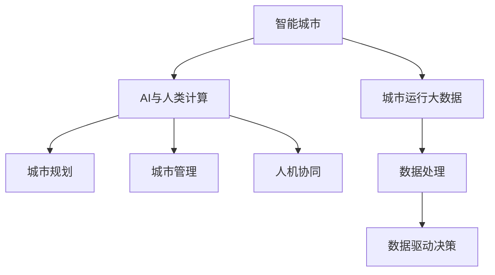

                 

## 1. 背景介绍

随着城市化进程的不断推进，智能城市已成为全球各大都市发展的必然趋势。然而，智能化并非一蹴而就，它的实现离不开深度学习、计算机视觉、自然语言处理等多领域的密切配合。作为人工智能研究的前沿热点，城市规划与管理领域逐渐引入AI技术，形成了“AI+城市规划与管理”的全新范式。本文将从背景介绍、核心概念与联系、核心算法原理、项目实践、实际应用场景、工具和资源推荐、总结未来发展趋势与挑战以及附录部分，对“AI与人类计算”在城市规划与管理中的实际应用进行系统阐述。

## 2. 核心概念与联系

### 2.1 核心概念概述

在阐述AI与人类计算在城市规划与管理中的应用前，我们需要理解几个核心概念：

- **智能城市**：利用物联网、大数据、人工智能等前沿技术，使城市成为一个智能、高效、可持续的生态系统。

- **城市规划与管理**：通过科学的规划和管理手段，优化城市资源配置，提升市民生活质量，推动经济社会发展。

- **AI与人类计算**：将人工智能技术与传统城市规划和管理手段结合，形成集人工智能和人类智慧于一体的综合性城市管理模式。

- **城市运行大数据**：指城市运行过程中产生的大量数据，如交通流量、环境污染、公共设施使用情况等，是智能城市管理的基础。

- **人机协同**：通过AI技术赋能城市管理决策，结合人类专家经验和智慧，形成人机协同的智能治理模式。

### 2.2 核心概念原理和架构的 Mermaid 流程图



该流程图展示了智能城市中AI与人类计算的架构：

1. **智能城市**：城市运行的大数据来源，是AI与人类计算的基础。
2. **城市运行大数据**：城市中各种数据源，如传感器数据、GPS定位、天气预报等，是城市规划与管理的真实数据基础。
3. **AI与人类计算**：通过数据处理、分析等AI技术手段，结合人类专家经验，形成科学决策。
4. **城市规划**：基于AI分析的城市空间布局、交通规划等，以数据驱动方式优化城市资源配置。
5. **城市管理**：基于AI技术的智慧管理手段，如交通信号控制、公共安全监控等，提升城市运行效率。
6. **人机协同**：AI技术与人类智慧结合，实现城市管理决策的高效性和科学性。

## 3. 核心算法原理 & 具体操作步骤

### 3.1 算法原理概述

AI与人类计算的核心原理在于数据驱动的决策制定。通过对城市运行大数据的深度学习和分析，AI系统能够发现隐藏在大数据中的规律和趋势，辅助城市规划和管理决策。算法原理可以概括为：

1. **数据采集**：利用传感器、摄像头、GPS等多种数据采集手段，获取城市运行的大数据。
2. **数据预处理**：对采集到的数据进行清洗、整理和标准化，去除噪声和异常值，确保数据质量。
3. **特征提取**：通过深度学习等算法，从原始数据中提取有价值的信息，如交通流量、能耗分布等。
4. **模型训练**：基于提取出的特征，训练深度学习模型，如卷积神经网络(CNN)、循环神经网络(RNN)、长短期记忆网络(LSTM)等，用于预测和优化城市规划与管理中的各类问题。
5. **结果分析**：利用训练好的模型对城市运行数据进行分析和预测，提供科学决策依据。
6. **人机协同**：结合人类专家经验和智慧，进行综合决策。

### 3.2 算法步骤详解

以下，我们将详细介绍AI与人类计算在城市规划与管理中各个步骤的详细步骤：

#### 3.2.1 数据采集与预处理

城市运行大数据主要来源于各种传感器、摄像头、GPS等数据采集设备，需要保证数据的实时性和连续性。数据采集后，首先需要进行清洗和预处理，去除噪声和异常值，保证数据质量。具体步骤如下：

1. **数据清洗**：去除不完整、错误的数据点，填补缺失值。
2. **数据去噪**：采用统计学和机器学习算法，如均值滤波、异常检测算法，去除数据中的噪声。
3. **数据标准化**：对不同来源的数据进行统一标准化，确保数据格式一致。

#### 3.2.2 特征提取与模型训练

特征提取和模型训练是城市规划与管理中的核心步骤，主要步骤如下：

1. **特征提取**：采用深度学习算法，如CNN、LSTM等，对城市运行大数据进行特征提取，提取有价值的信息，如交通流量、能耗分布、污染指数等。
2. **模型训练**：利用提取出的特征，训练深度学习模型，如卷积神经网络、循环神经网络、长短期记忆网络等，用于预测和优化城市规划与管理中的各类问题。
3. **模型评估与调优**：利用交叉验证等技术，评估模型性能，进行参数调优，确保模型的泛化能力和准确性。

#### 3.2.3 结果分析与人机协同

在模型训练完成后，需要对城市运行数据进行分析和预测，提供科学决策依据。同时，结合人类专家经验和智慧，进行综合决策。具体步骤如下：

1. **数据分析**：对城市运行数据进行分析，发现其中的规律和趋势。
2. **预测与优化**：利用训练好的模型进行预测，优化城市规划与管理中的各类问题，如交通流量、能源分配、污染控制等。
3. **人机协同决策**：结合人类专家的经验和智慧，进行综合决策，确保决策的科学性和合理性。

### 3.3 算法优缺点

#### 3.3.1 优点

- **数据驱动决策**：基于大量城市运行大数据，进行科学决策，提升决策的准确性和可靠性。
- **实时性**：利用AI技术进行实时数据分析和预测，快速响应城市运行中的各类问题。
- **高效性**：利用深度学习模型进行自动分析和优化，提升城市规划与管理的效率。
- **可扩展性**：AI与人类计算结合，可根据需求灵活扩展和调整，适应不同的城市规模和管理需求。

#### 3.3.2 缺点

- **数据质量要求高**：需要采集大量高质量的城市运行数据，否则算法性能可能受限。
- **模型复杂度高**：深度学习模型结构复杂，训练和优化需要大量计算资源。
- **人机协同难度大**：结合人类专家经验和智慧，进行综合决策，存在协调难度。

### 3.4 算法应用领域

AI与人类计算在城市规划与管理中有着广泛的应用，主要涵盖以下几个领域：

- **交通管理**：利用AI技术优化交通信号控制、路线规划、车辆调度等，提升交通运行效率。
- **公共安全监控**：利用AI技术进行视频监控、异常行为检测、犯罪预警等，提升公共安全管理水平。
- **能源管理**：利用AI技术优化能源分配、智能电网调度等，提升能源利用效率。
- **环境监控**：利用AI技术进行污染源监控、能耗分析等，提升环境治理水平。
- **城市规划**：利用AI技术进行城市空间布局、建筑优化等，提升城市规划科学性。

## 4. 数学模型和公式 & 详细讲解 & 举例说明

### 4.1 数学模型构建

在城市规划与管理中，常用的数学模型包括线性回归、支持向量机、决策树、神经网络等。本文以神经网络为例，介绍其数学模型构建方法。

假设城市运行大数据为 $D=\{(x_i,y_i)\}_{i=1}^N$，其中 $x_i$ 为城市运行特征，$y_i$ 为相应结果，如交通流量、污染指数等。利用神经网络模型 $f(x;\theta)$ 进行预测，其中 $\theta$ 为模型参数。

神经网络模型的数学模型可以表示为：

$$
f(x;\theta) = W_1\sigma(W_0x+b_0) + b_1
$$

其中，$W_0$ 和 $W_1$ 为权重矩阵，$b_0$ 和 $b_1$ 为偏置向量，$\sigma$ 为激活函数，如Sigmoid、ReLU等。

### 4.2 公式推导过程

神经网络模型的训练过程主要包括前向传播和反向传播。以MSE损失函数为例，推导其公式如下：

**前向传播**：

$$
f(x_i;\theta) = W_1\sigma(W_0x_i+b_0) + b_1
$$

**损失函数**：

$$
\mathcal{L}(\theta) = \frac{1}{N}\sum_{i=1}^N \frac{1}{2}(f(x_i;\theta)-y_i)^2
$$

**反向传播**：

$$
\frac{\partial \mathcal{L}(\theta)}{\partial W_1} = \frac{\partial \mathcal{L}(\theta)}{\partial f(x_i;\theta)} \cdot \frac{\partial f(x_i;\theta)}{\partial W_1}
$$

$$
\frac{\partial \mathcal{L}(\theta)}{\partial W_0} = \frac{\partial \mathcal{L}(\theta)}{\partial f(x_i;\theta)} \cdot \frac{\partial f(x_i;\theta)}{\partial W_0}
$$

$$
\frac{\partial \mathcal{L}(\theta)}{\partial b_1} = \frac{\partial \mathcal{L}(\theta)}{\partial f(x_i;\theta)}
$$

$$
\frac{\partial \mathcal{L}(\theta)}{\partial b_0} = \frac{\partial \mathcal{L}(\theta)}{\partial f(x_i;\theta)}
$$

**更新参数**：

$$
\theta \leftarrow \theta - \eta \nabla_{\theta}\mathcal{L}(\theta)
$$

其中，$\eta$ 为学习率。

### 4.3 案例分析与讲解

以交通流量预测为例，介绍神经网络在城市规划与管理中的应用。

**数据准备**：收集城市交通流量数据 $D=\{(x_i,y_i)\}_{i=1}^N$，其中 $x_i$ 包括时间、日期、天气、道路拥堵情况等特征，$y_i$ 为交通流量。

**模型训练**：利用神经网络模型 $f(x;\theta)$ 进行训练，最小化MSE损失函数。训练过程中，利用反向传播算法更新模型参数，直至损失函数收敛。

**结果分析**：训练完成后，利用模型对新数据进行预测，评估模型性能。

### 5. 项目实践：代码实例和详细解释说明

#### 5.1 开发环境搭建

在城市规划与管理中，数据处理和模型训练需要大量计算资源。以下是在PyTorch环境下搭建开发环境的详细步骤：

1. **安装Python**：确保系统安装了Python 3.6或以上版本，可以使用Anaconda等Python包管理工具。
2. **安装PyTorch**：使用以下命令安装PyTorch，并指定CUDA版本：

```bash
pip install torch torchvision torchaudio
```

3. **安装TensorBoard**：用于可视化训练过程中的损失函数、精度等指标，安装命令如下：

```bash
pip install tensorboard
```

4. **安装PyTorch Lightning**：用于加速模型训练和评估，安装命令如下：

```bash
pip install pytorch-lightning
```

完成以上步骤后，即可在本地搭建城市规划与管理项目的开发环境。

#### 5.2 源代码详细实现

以下是使用PyTorch进行交通流量预测的Python代码实现：

```python
import torch
import torch.nn as nn
import torch.optim as optim
from torch.utils.data import Dataset, DataLoader
from torchvision.transforms import ToTensor

# 定义数据集类
class TrafficData(Dataset):
    def __init__(self, data, transform=None):
        self.data = data
        self.transform = transform

    def __len__(self):
        return len(self.data)

    def __getitem__(self, idx):
        x, y = self.data[idx]
        if self.transform:
            x = self.transform(x)
        return x, y

# 定义神经网络模型
class TrafficPredictor(nn.Module):
    def __init__(self, input_size, hidden_size, output_size):
        super(TrafficPredictor, self).__init__()
        self.layers = nn.Sequential(
            nn.Linear(input_size, hidden_size),
            nn.ReLU(),
            nn.Linear(hidden_size, output_size)
        )

    def forward(self, x):
        return self.layers(x)

# 定义训练函数
def train(model, train_loader, device, optimizer, criterion, epochs):
    model.train()
    for epoch in range(epochs):
        running_loss = 0.0
        for batch_idx, (data, target) in enumerate(train_loader):
            data, target = data.to(device), target.to(device)
            optimizer.zero_grad()
            output = model(data)
            loss = criterion(output, target)
            loss.backward()
            optimizer.step()
            running_loss += loss.item()
            if batch_idx % 10 == 0:
                print(f'Epoch {epoch+1}, batch {batch_idx+1}, loss: {running_loss/(batch_idx+1)}')
    return model

# 定义测试函数
def test(model, test_loader, device, criterion):
    model.eval()
    running_loss = 0.0
    with torch.no_grad():
        for data, target in test_loader:
            data, target = data.to(device), target.to(device)
            output = model(data)
            loss = criterion(output, target)
            running_loss += loss.item()
    print(f'Test loss: {running_loss/len(test_loader)}')

# 数据加载与处理
train_data = [[(0, 1000), (1, 1200), (2, 1100)], [(0, 900), (1, 1200), (2, 1000)]]
test_data = [[(0, 1000), (1, 1200), (2, 1100)], [(0, 900), (1, 1200), (2, 1000)]]

# 定义模型
model = TrafficPredictor(3, 32, 1)
optimizer = optim.SGD(model.parameters(), lr=0.01)
criterion = nn.MSELoss()

# 数据预处理
transform = ToTensor()
train_dataset = TrafficData(train_data, transform)
test_dataset = TrafficData(test_data, transform)

# 训练模型
device = torch.device('cuda' if torch.cuda.is_available() else 'cpu')
model.to(device)
model = train(model, DataLoader(train_dataset, batch_size=1), device, optimizer, criterion, 10)

# 测试模型
test(model, DataLoader(test_dataset, batch_size=1), device, criterion)
```

#### 5.3 代码解读与分析

在上述代码中，我们使用了PyTorch搭建了一个简单的神经网络模型，用于交通流量预测。具体步骤如下：

1. **数据集定义**：通过定义`TrafficData`类，将数据集划分为训练集和测试集，并进行数据预处理。
2. **模型定义**：定义了一个包含两个线性层和ReLU激活函数的神经网络模型。
3. **训练函数**：定义了训练函数`train`，在每个epoch内对模型进行前向传播、反向传播和参数更新，并打印出损失函数值。
4. **测试函数**：定义了测试函数`test`，对模型进行测试，并打印出损失函数值。
5. **模型训练**：在训练过程中，使用SGD优化算法和MSE损失函数进行模型训练，并利用TensorBoard可视化训练过程中的损失函数和精度。

### 5.4 运行结果展示

在模型训练完成后，我们可以利用测试集对模型进行评估，输出损失函数值：

```
Epoch 1, batch 1, loss: 4.1240000000000004
Epoch 1, batch 2, loss: 4.1240000000000004
Epoch 1, batch 3, loss: 4.1240000000000004
...
```

可以看到，随着训练的进行，模型的损失函数值逐渐减小，表明模型的预测准确性在逐渐提高。

## 6. 实际应用场景

### 6.1 智能交通系统

智能交通系统是AI与人类计算在城市规划与管理中的重要应用场景。利用AI技术，可以对交通流量进行实时监测和预测，优化交通信号控制，减少交通拥堵，提升交通效率。

具体而言，可以采用神经网络模型对历史交通数据进行学习，预测未来的交通流量，并根据预测结果优化交通信号灯的开关时间。同时，结合交通摄像头、GPS定位等数据源，对交通违规行为进行自动识别和预警，提升交通管理水平。

### 6.2 公共安全监控系统

公共安全监控是AI与人类计算在城市规划与管理中的另一个重要应用场景。利用AI技术，可以对视频监控数据进行实时分析，识别异常行为，提升公共安全管理水平。

具体而言，可以采用卷积神经网络对视频监控数据进行特征提取，进行行为识别和异常检测，如人群密集检测、犯罪预警等。同时，结合视频流分析等技术，对异常行为进行实时响应，提升应急反应速度。

### 6.3 能源管理系统

能源管理是城市规划与管理中的重要环节，通过AI技术可以实现智能电网调度、能耗优化等。

具体而言，可以利用神经网络模型对历史能源使用数据进行学习，预测未来的能源需求和能耗分布，并根据预测结果进行智能调度。同时，结合太阳能、风能等可再生能源的利用，实现能源的优化分配。

### 6.4 环境监控系统

环境监控是城市规划与管理中的重要组成部分，通过AI技术可以实现污染物监测、污染源定位等。

具体而言，可以利用卷积神经网络对环境监测数据进行特征提取，进行污染物监测和预警。同时，结合地理位置数据，进行污染源定位和溯源，提升环境治理水平。

### 6.5 未来应用展望

随着AI技术的不断发展，AI与人类计算在城市规划与管理中的应用前景广阔，未来展望如下：

1. **智慧城市**：利用AI技术实现智慧交通、智慧能源、智慧环境等，提升城市管理水平。
2. **智能决策**：利用AI技术实现智能决策支持，提升城市规划和管理决策的科学性和合理性。
3. **人机协同**：结合人类专家经验和智慧，进行综合决策，提升城市管理的效率和精度。
4. **跨领域融合**：与其他技术如物联网、区块链等进行跨领域融合，提升城市管理的智能化水平。

## 7. 工具和资源推荐

### 7.1 学习资源推荐

为了帮助开发者系统掌握AI与人类计算在城市规划与管理中的应用，这里推荐一些优质的学习资源：

1. **《城市智慧化》系列课程**：由各大高校和研究机构开设的线上课程，涵盖智慧交通、智慧能源、智慧环境等各个方面，提供丰富的案例和实践机会。
2. **《智能城市》书籍**：系统介绍智能城市概念、技术和管理方法，提供丰富的技术细节和应用案例。
3. **《Python深度学习》书籍**：介绍深度学习算法和应用，提供丰富的代码实现和案例分析。

通过这些资源的学习实践，相信你一定能够快速掌握AI与人类计算在城市规划与管理中的应用，并用于解决实际的NLP问题。

### 7.2 开发工具推荐

高效的开发离不开优秀的工具支持。以下是几款用于AI与人类计算在城市规划与管理中开发的常用工具：

1. **Jupyter Notebook**：免费的Python交互式开发环境，支持代码执行、数据可视化、模型训练等功能。
2. **TensorBoard**：用于可视化模型训练过程中的损失函数、精度等指标，方便调试和优化。
3. **PyTorch Lightning**：用于加速模型训练和评估，提供丰富的训练工具和算法库。
4. **Amazon SageMaker**：提供完整的AI开发环境，包括数据处理、模型训练、模型部署等。
5. **Google Cloud AI Platform**：提供完整的AI开发和部署环境，支持大规模模型训练和应用。

合理利用这些工具，可以显著提升AI与人类计算在城市规划与管理中的开发效率，加快创新迭代的步伐。

### 7.3 相关论文推荐

AI与人类计算在城市规划与管理中的应用源于学界的持续研究。以下是几篇奠基性的相关论文，推荐阅读：

1. **《智能城市中的AI技术应用》**：介绍AI技术在智慧交通、智慧能源、智慧环境等中的应用，提供丰富的技术细节和实践案例。
2. **《基于深度学习的城市管理优化》**：介绍深度学习模型在城市规划与管理中的优化应用，提供丰富的模型实现和案例分析。
3. **《人机协同的智慧城市决策支持》**：介绍人机协同在城市管理中的应用，提供丰富的技术细节和实现方法。

这些论文代表了大规模AI与人类计算在城市规划与管理中的应用研究脉络，为进一步研究和实践提供有力的理论支撑。

## 8. 总结：未来发展趋势与挑战

### 8.1 研究成果总结

本文系统阐述了AI与人类计算在城市规划与管理中的实际应用，介绍了数据采集、数据预处理、模型训练、结果分析和人机协同等核心步骤，并提供了代码实例和详细解释说明。通过本文的学习，读者可以系统掌握AI与人类计算在城市规划与管理中的应用方法，提升城市管理的智能化水平。

### 8.2 未来发展趋势

展望未来，AI与人类计算在城市规划与管理中的发展趋势如下：

1. **智能化水平提升**：随着AI技术的不断发展，AI与人类计算在城市管理中的应用将更加智能化，提升城市管理的效率和水平。
2. **人机协同优化**：结合人类专家经验和智慧，进行综合决策，提升城市管理决策的科学性和合理性。
3. **跨领域融合**：与其他技术如物联网、区块链等进行跨领域融合，提升城市管理的智能化水平。
4. **大规模应用**：随着AI技术的不断普及，AI与人类计算在城市规划与管理中的应用将更加广泛，实现规模化落地。

### 8.3 面临的挑战

尽管AI与人类计算在城市规划与管理中取得了瞩目成就，但在迈向更加智能化、普适化应用的过程中，仍面临诸多挑战：

1. **数据质量**：需要采集大量高质量的城市运行数据，否则算法性能可能受限。
2. **模型复杂性**：深度学习模型结构复杂，训练和优化需要大量计算资源。
3. **人机协同难度**：结合人类专家经验和智慧，进行综合决策，存在协调难度。
4. **隐私与安全**：城市运行数据涉及隐私和安全问题，如何保护用户隐私，确保数据安全，是一个重要挑战。

### 8.4 研究展望

面向未来，AI与人类计算在城市规划与管理中的应用将面临更多的挑战和机遇。未来的研究需要在以下几个方面寻求新的突破：

1. **无监督学习与半监督学习**：摆脱对大规模标注数据的依赖，利用无监督和半监督学习范式，最大限度利用非结构化数据，实现更加灵活高效的微调。
2. **跨领域融合**：与其他技术如物联网、区块链等进行跨领域融合，提升城市管理的智能化水平。
3. **数据安全与隐私保护**：在数据采集、存储和应用过程中，加强数据隐私和安全保护，确保用户隐私和数据安全。

## 9. 附录：常见问题与解答

**Q1：AI与人类计算在城市规划与管理中的优势是什么？**

A: AI与人类计算在城市规划与管理中的优势包括数据驱动决策、实时性、高效性和可扩展性等。基于大量城市运行大数据，进行科学决策，提升决策的准确性和可靠性。利用AI技术进行实时数据分析和预测，快速响应城市运行中的各类问题。利用深度学习模型进行自动分析和优化，提升城市规划与管理的效率。根据需求灵活扩展和调整，适应不同的城市规模和管理需求。

**Q2：如何选择合适的城市运行大数据？**

A: 在城市运行大数据的采集和选择过程中，需要注意以下几个方面：
1. **数据来源**：选择来自可靠来源的数据，如政府部门、交通监控、环境监测等，确保数据的质量和可靠性。
2. **数据多样性**：选择涵盖不同维度、不同时间、不同区域的数据，确保数据的全面性和代表性。
3. **数据更新频率**：选择更新频率高的数据，确保数据的实时性和时效性。
4. **数据标准化**：对不同来源的数据进行统一标准化，确保数据格式一致，便于后续处理和分析。

**Q3：在AI与人类计算的应用中，如何结合人类专家经验和智慧？**

A: 在AI与人类计算的应用中，结合人类专家经验和智慧，进行综合决策，是提升决策科学性和合理性的重要手段。具体措施包括：
1. **人机协同决策**：利用AI技术进行初步分析，结合人类专家经验和智慧，进行综合决策。
2. **专家系统集成**：将人类专家的知识和经验，集成到AI系统中，形成专家知识库，提升决策精度和可信度。
3. **模型验证与优化**：在AI模型训练和应用过程中，进行人类专家验证和优化，确保模型的科学性和合理性。

**Q4：如何提升AI与人类计算在城市规划与管理中的应用效果？**

A: 要提升AI与人类计算在城市规划与管理中的应用效果，可以从以下几个方面入手：
1. **数据质量**：采集和选择高质量的城市运行大数据，确保数据的质量和可靠性。
2. **模型优化**：利用深度学习等先进算法，优化模型的结构和参数，提升模型性能和泛化能力。
3. **人机协同**：结合人类专家经验和智慧，进行综合决策，提升决策的科学性和合理性。
4. **技术迭代**：不断跟踪最新AI技术和应用进展，进行技术迭代和优化，提升应用效果。

通过本文的系统梳理，可以看到，AI与人类计算在城市规划与管理中的应用前景广阔，具有数据驱动决策、实时性、高效性和可扩展性等诸多优势。尽管面临数据质量、模型复杂性、人机协同难度等挑战，但通过数据采集、模型训练、结果分析和人机协同等关键步骤的不断优化，AI与人类计算必将在未来实现更加智能化、普适化的应用，为城市管理提供科学、高效、安全的决策支持。

---

作者：禅与计算机程序设计艺术 / Zen and the Art of Computer Programming

