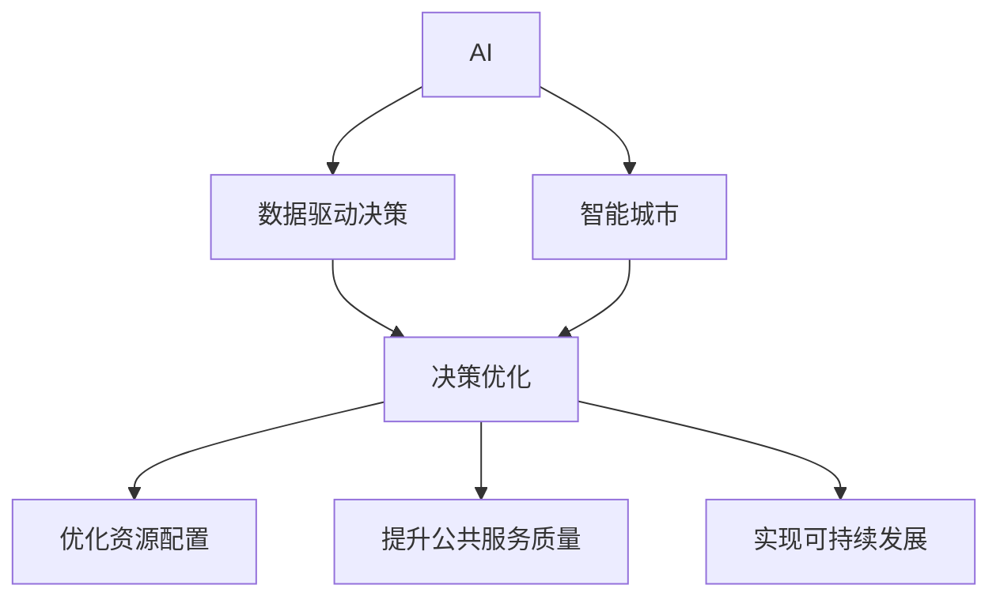

                 

# AI与人类计算：打造可持续发展的城市解决方案

> 关键词：人工智能(AI),人类计算,城市治理,智能城市,可持续发展,数据驱动,政策决策,公共服务优化

## 1. 背景介绍

### 1.1 问题由来

随着全球城市化进程的加快，城市规模不断扩大，人口密集，资源消耗巨大，环境污染严重，城市管理面临严峻挑战。传统城市管理方式主要依赖人力、经验，存在效率低、决策慢、响应迟等不足。如何在数据洪流中高效分析、整合信息，辅助政府决策，提升城市治理效能，成为了亟待解决的问题。

在当前技术背景下，AI和人类计算的结合为城市治理带来了新思路。通过大规模数据收集与分析，AI可以模拟人类思考过程，辅助政府决策，优化城市资源配置，提升公共服务质量。同时，人类计算结合AI的强大计算能力，可以帮助我们更好地理解数据，优化城市治理方案，实现可持续发展。

### 1.2 问题核心关键点

1. **数据驱动决策**：数据是AI和人类计算的基础。城市治理需要收集和整合各类数据，如交通流量、能源消耗、环境污染、经济活动等，通过AI分析模型发现城市运行规律和潜在问题，提供数据驱动的决策支持。
2. **优化资源配置**：AI可以辅助优化城市资源配置，如交通信号灯控制、能源调度、环境监测等，以提高城市运行效率。
3. **提升公共服务质量**：通过AI和人类计算，可以优化教育、医疗、交通、环保等公共服务，提升居民生活质量。
4. **实现可持续发展**：AI和人类计算可以辅助城市规划，优化资源利用，减少环境污染，实现绿色低碳的可持续发展目标。

### 1.3 问题研究意义

1. **提升城市治理效率**：AI和人类计算可以大幅提升城市治理的效率，减少决策成本，加快响应速度，改善城市运行效率。
2. **优化资源利用**：通过AI和人类计算，可以优化城市资源配置，减少浪费，提高资源利用效率。
3. **增强决策科学性**：AI和人类计算结合数据分析，提供基于数据的决策支持，提升政府决策的科学性和合理性。
4. **促进公共服务优化**：通过AI和人类计算，可以优化公共服务，提升居民生活质量，增强市民满意度。
5. **推动绿色低碳发展**：AI和人类计算辅助城市规划，实现绿色低碳的可持续发展目标，减少环境污染，保护生态环境。

## 2. 核心概念与联系

### 2.1 核心概念概述

为了更好地理解AI和人类计算在城市治理中的应用，本节将介绍几个密切相关的核心概念：

- **人工智能(AI)**：通过算法和数据训练得到的模型，能够模拟人类智能，进行自主学习和决策。
- **人类计算(Human Computation)**：指人类通过自己的计算能力，结合AI辅助，进行复杂问题的分析和求解。
- **智能城市(Smart City)**：结合信息通信技术(ICT)、大数据、AI等手段，提升城市治理效率，实现智能化管理的城市。
- **数据驱动决策(Data-Driven Decision Making)**：基于数据分析和AI模型的辅助，进行科学决策的过程。
- **可持续性(Sustainability)**：指在满足当前发展需求的同时，不损害后代满足需求能力的发展模式。

这些概念之间的逻辑关系可以通过以下Mermaid流程图来展示：



这个流程图展示了AI和人类计算的核心概念及其之间的关系：

1. AI通过大数据分析，辅助科学决策。
2. 智能城市结合AI技术，优化城市资源配置和公共服务。
3. 数据驱动决策提升城市治理的科学性和效率。
4. 优化资源配置和提升公共服务质量，实现可持续发展。

这些概念共同构成了AI和人类计算在城市治理中的应用框架，使其能够在多个层面提升城市运行效率，改善市民生活。

## 3. 核心算法原理 & 具体操作步骤
### 3.1 算法原理概述

基于AI和人类计算的城市治理方法，其核心思想是通过大规模数据收集与分析，辅助政府决策，优化资源配置，提升公共服务质量，实现可持续发展。

具体来说，该方法包括以下几个关键步骤：

1. **数据采集与整合**：从各类传感器、城市数据库、社交媒体等渠道收集城市运行数据，进行数据清洗和整合，构建城市数据平台。
2. **数据分析与建模**：利用AI技术，如机器学习、深度学习等，对城市数据进行建模分析，发现城市运行规律和潜在问题。
3. **辅助决策与优化**：结合数据分析结果，辅助政府进行决策，优化资源配置，提升公共服务质量。
4. **持续学习与迭代**：通过不断收集新数据和反馈，持续学习并优化AI模型，提升城市治理效能。

### 3.2 算法步骤详解

基于AI和人类计算的城市治理方法，其详细步骤包括：

**Step 1: 数据采集与整合**

1. **数据来源**：城市运行数据可来源于各类传感器、监控摄像头、城市数据库、社交媒体等。
2. **数据清洗与预处理**：对数据进行清洗、去重、标准化等预处理，去除噪音数据，提高数据质量。
3. **数据整合**：将来自不同来源的数据进行整合，构建统一的城市数据平台。

**Step 2: 数据分析与建模**

1. **模型选择**：根据城市治理需求，选择合适的AI模型，如回归模型、分类模型、聚类模型等。
2. **模型训练**：使用城市数据平台上的数据，对AI模型进行训练，优化模型参数。
3. **模型评估**：使用验证集对模型进行评估，选择性能最佳的模型。

**Step 3: 辅助决策与优化**

1. **决策支持**：结合数据分析结果，辅助政府进行决策，优化城市资源配置，如交通信号灯控制、能源调度、环境监测等。
2. **公共服务优化**：通过AI模型，优化教育、医疗、交通、环保等公共服务，提升居民生活质量。
3. **效果评估**：定期评估AI辅助决策的效果，根据效果调整模型参数，优化模型性能。

**Step 4: 持续学习与迭代**

1. **数据收集**：定期收集城市运行新数据，更新城市数据平台。
2. **模型更新**：使用最新数据对AI模型进行再训练，优化模型参数。
3. **反馈机制**：建立反馈机制，收集政府、市民等各方反馈，持续改进AI模型。

### 3.3 算法优缺点

基于AI和人类计算的城市治理方法具有以下优点：

1. **效率提升**：通过AI和人类计算，大幅提升城市治理的效率，减少决策成本，加快响应速度。
2. **决策科学化**：基于数据分析和AI模型，提供科学决策支持，提升政府决策的合理性和准确性。
3. **资源优化**：优化城市资源配置，提高资源利用效率，减少浪费。
4. **服务质量提升**：优化公共服务，提升居民生活质量，增强市民满意度。
5. **可持续发展**：结合绿色低碳发展目标，辅助城市规划，实现绿色低碳的城市治理。

同时，该方法也存在以下局限性：

1. **数据质量要求高**：城市数据采集和整合需要高质量的数据源和处理技术，数据质量直接影响模型性能。
2. **技术复杂度高**：AI和人类计算结合需要多种技术手段，技术实现复杂。
3. **数据隐私保护**：城市数据涉及大量市民隐私，数据收集和处理需要严格遵守隐私保护法规。
4. **模型可解释性**：AI模型的决策过程缺乏可解释性，难以进行透明的监督和调试。

尽管存在这些局限性，但就目前而言，基于AI和人类计算的城市治理方法仍是大规模城市管理的重要工具。未来相关研究的重点在于如何进一步降低数据获取成本，提高数据质量，增强模型可解释性，以及保障数据隐私安全。

### 3.4 算法应用领域

基于AI和人类计算的城市治理方法，已经在多个领域得到了广泛应用，例如：

1. **交通管理**：通过交通数据分析，优化交通信号灯控制，减少交通拥堵，提高通行效率。
2. **能源管理**：通过能源消耗数据建模，优化能源调度，减少能源浪费，提高能源利用效率。
3. **环境监测**：通过环境数据监测，分析环境污染情况，制定治理方案，保护生态环境。
4. **公共安全**：通过公共安全数据建模，预测和预防犯罪行为，提高城市安全水平。
5. **健康管理**：通过健康数据分析，优化医疗资源配置，提升公共健康水平。
6. **教育优化**：通过教育数据分析，优化教育资源配置，提升教育质量。

除了上述这些经典应用外，AI和人类计算技术还被创新性地应用到更多场景中，如智能垃圾分类、智慧农业、城市灾害预测等，为城市治理带来了全新的突破。随着技术的不断发展，基于AI和人类计算的城市治理将更加智能化、精细化，为城市管理带来深刻变革。

## 4. 数学模型和公式 & 详细讲解
### 4.1 数学模型构建

在城市治理中，通常会使用多种AI模型进行数据分析和决策支持。以下以交通管理为例，介绍基于回归模型的数学模型构建过程。

**目标函数**：
$$
\min \sum_{i=1}^n (y_i - f(x_i))^2
$$

其中，$y_i$ 为实际交通流量，$f(x_i)$ 为回归模型预测的交通流量，$n$ 为样本数量。

**模型形式**：
$$
f(x) = \beta_0 + \sum_{j=1}^p \beta_j x_j
$$

其中，$\beta_0$ 为截距，$\beta_j$ 为自变量 $x_j$ 的系数，$p$ 为自变量数量。

### 4.2 公式推导过程

1. **假设与线性回归模型**：
   - 假设 $y$ 与 $x$ 之间存在线性关系：$y = \beta_0 + \beta_1 x_1 + \ldots + \beta_p x_p + \epsilon$，其中 $\epsilon$ 为误差项。
   - 假设误差项服从正态分布：$\epsilon \sim N(0, \sigma^2)$。

2. **最小二乘法求解**：
   - 最小二乘法估计参数 $\beta_0, \beta_1, \ldots, \beta_p$。
   - 目标函数为：$\sum_{i=1}^n (y_i - f(x_i))^2$。
   - 求解 $\frac{\partial}{\partial \beta_j} \sum_{i=1}^n (y_i - f(x_i))^2 = 0$，得到：$\beta_j = \frac{\sum_{i=1}^n (x_j x_i)}{\sum_{i=1}^n x_i^2}$。

3. **模型评估与选择**：
   - 使用交叉验证或均方误差等指标，评估模型性能。
   - 选择合适的模型，并对其进行优化和调整。

### 4.3 案例分析与讲解

以交通管理为例，通过回归模型对交通流量进行预测和优化：

**数据准备**：
- 收集交通流量历史数据，如时间、路段、车流量等。
- 清洗数据，去除噪音和异常值，构建数据集。

**模型训练**：
- 选择线性回归模型，使用数据集对模型进行训练。
- 使用最小二乘法求解参数 $\beta_0, \beta_1, \ldots, \beta_p$。
- 使用交叉验证评估模型性能。

**模型应用**：
- 使用训练好的模型对未来交通流量进行预测。
- 结合预测结果，优化交通信号灯控制，减少交通拥堵。

通过以上步骤，可以有效利用AI和人类计算技术，提升城市交通管理的效率和准确性。

## 5. 项目实践：代码实例和详细解释说明
### 5.1 开发环境搭建

在进行城市治理的AI和人类计算实践前，我们需要准备好开发环境。以下是使用Python进行Pandas、NumPy、Scikit-learn等库的开发环境配置流程：

1. 安装Anaconda：从官网下载并安装Anaconda，用于创建独立的Python环境。

2. 创建并激活虚拟环境：
```bash
conda create -n smart-city-env python=3.8 
conda activate smart-city-env
```

3. 安装相关库：
```bash
conda install pandas numpy scikit-learn matplotlib jupyter notebook ipython
```

完成上述步骤后，即可在`smart-city-env`环境中开始城市治理的AI和人类计算实践。

### 5.2 源代码详细实现

下面我们以交通流量预测为例，给出使用Pandas、NumPy、Scikit-learn库对线性回归模型进行城市治理的PyTorch代码实现。

```python
import pandas as pd
import numpy as np
from sklearn.linear_model import LinearRegression
from sklearn.model_selection import train_test_split
from sklearn.metrics import mean_squared_error

# 读取数据
data = pd.read_csv('traffic_data.csv')

# 数据预处理
X = data[['time', 'distance']]  # 自变量
y = data['flow']  # 因变量

# 拆分数据集
X_train, X_test, y_train, y_test = train_test_split(X, y, test_size=0.2, random_state=42)

# 训练模型
model = LinearRegression()
model.fit(X_train, y_train)

# 预测并评估
y_pred = model.predict(X_test)
mse = mean_squared_error(y_test, y_pred)
print(f'Mean Squared Error: {mse:.2f}')
```

以上是使用Pandas、NumPy、Scikit-learn库对线性回归模型进行城市治理的完整代码实现。可以看到，通过简单的几行代码，就可以快速搭建一个交通流量预测模型。

### 5.3 代码解读与分析

让我们再详细解读一下关键代码的实现细节：

**数据读取与预处理**：
- 使用Pandas库读取数据，并进行数据清洗和预处理，构建自变量和因变量的数据集。
- 使用NumPy库进行数据操作，如数据拆分、矩阵计算等。

**模型训练**：
- 使用Scikit-learn库的LinearRegression模型，对数据进行训练。
- 使用train_test_split函数进行数据拆分，构建训练集和测试集。

**模型评估**：
- 使用均方误差(MSE)评估模型性能，输出评估结果。

**结果展示**：
- 输出均方误差(MSE)，评估模型预测的准确性。

通过以上步骤，可以快速搭建一个基于线性回归模型的城市治理AI和人类计算模型。代码简洁高效，适合初学者快速上手。

当然，在实际应用中，还需要进一步优化模型，如使用交叉验证、模型调参等技术，以提升模型性能。同时，还需要将模型集成到实际的城市治理系统中，进行系统测试和优化。

## 6. 实际应用场景
### 6.1 智能交通系统

基于AI和人类计算的智能交通系统，通过分析交通流量数据，优化交通信号灯控制，减少交通拥堵，提高通行效率。

在技术实现上，可以收集城市各路段的历史交通流量数据，构建交通流量预测模型，根据预测结果优化交通信号灯的控制策略。同时，通过智能算法，实时监测交通流量，动态调整信号灯时长和灯序，提升交通流畅性。

### 6.2 能源智能调度

基于AI和人类计算的能源智能调度系统，通过分析能源消耗数据，优化能源调度策略，减少能源浪费，提高能源利用效率。

在技术实现上，可以收集城市各区域的能源消耗数据，构建能源消耗预测模型，根据预测结果优化能源调度和分配。同时，通过智能算法，实时监测能源使用情况，动态调整能源供应和需求，提升能源利用率。

### 6.3 环境监测与治理

基于AI和人类计算的环境监测与治理系统，通过分析环境污染数据，制定环境治理方案，保护生态环境。

在技术实现上，可以收集城市各区域的空气、水质、噪声等环境数据，构建环境污染预测模型，根据预测结果制定治理方案。同时，通过智能算法，实时监测环境污染情况，动态调整治理措施，提升环境质量。

### 6.4 未来应用展望

随着AI和人类计算技术的不断发展，基于该方法的城市治理将呈现以下几个发展趋势：

1. **智能化程度提升**：通过更先进的数据收集和处理技术，以及更高效的AI模型，提升城市治理的智能化程度。
2. **多模态融合**：结合图像、视频、声音等多模态数据，实现更全面、更精确的城市治理。
3. **数据共享与协作**：通过数据共享和协作，提升城市治理的效率和效果，实现数据驱动的城市治理。
4. **绿色低碳发展**：结合绿色低碳发展目标，优化城市资源配置，减少环境污染，实现可持续发展。

这些趋势凸显了AI和人类计算在城市治理中的巨大潜力，未来将在更多领域得到广泛应用，为城市治理带来深刻变革。

## 7. 工具和资源推荐
### 7.1 学习资源推荐

为了帮助开发者系统掌握AI和人类计算在城市治理中的应用，这里推荐一些优质的学习资源：

1. **《智慧城市设计与实现》课程**：由知名大学开设的智慧城市课程，涵盖了城市数据平台、智能交通、能源管理等多个领域的知识。
2. **《AI城市治理》书籍**：深入浅出地介绍了AI和人类计算在城市治理中的应用案例，适合技术人员快速上手。
3. **Google AI City Explorer**：Google推出的城市治理AI工具，可实时监测城市运行数据，提供数据可视化功能。
4. **HuggingFace官方文档**：提供了丰富的预训练模型和代码样例，适合初学者学习使用。
5. **Kaggle城市治理竞赛**：通过参与Kaggle的城市治理竞赛，实战学习AI和人类计算技术。

通过对这些资源的学习实践，相信你一定能够快速掌握AI和人类计算在城市治理中的应用，并用于解决实际的治理问题。

### 7.2 开发工具推荐

高效的开发离不开优秀的工具支持。以下是几款用于AI和人类计算的城市治理开发的常用工具：

1. **Jupyter Notebook**：开源的交互式编程环境，支持多种编程语言，适合数据处理和模型开发。
2. **Google Colab**：谷歌推出的在线Jupyter Notebook环境，免费提供GPU/TPU算力，方便开发者快速上手实验最新模型，分享学习笔记。
3. **TensorFlow**：谷歌主导的开源深度学习框架，生产部署方便，适合大规模工程应用。
4. **PyTorch**：基于Python的开源深度学习框架，灵活动态的计算图，适合快速迭代研究。
5. **Pandas**：基于NumPy的数据处理库，提供了强大的数据清洗、转换和分析功能。
6. **Scikit-learn**：基于NumPy的机器学习库，提供了多种经典模型和算法。

合理利用这些工具，可以显著提升AI和人类计算在城市治理开发的效率，加快创新迭代的步伐。

### 7.3 相关论文推荐

AI和人类计算在城市治理中的应用源于学界的持续研究。以下是几篇奠基性的相关论文，推荐阅读：

1. **《基于AI的城市交通管理研究》**：介绍了使用AI技术优化交通信号灯控制的案例。
2. **《智慧城市中的数据驱动决策》**：分析了数据驱动决策在智慧城市中的应用，探讨了AI和人类计算的结合。
3. **《环境污染数据预测与治理》**：介绍了使用AI技术预测和治理环境污染的方法。
4. **《智能能源调度的AI算法研究》**：研究了使用AI技术优化能源调度的算法和策略。

这些论文代表了大规模城市治理技术的发展脉络。通过学习这些前沿成果，可以帮助研究者把握学科前进方向，激发更多的创新灵感。

## 8. 总结：未来发展趋势与挑战
### 8.1 总结

本文对基于AI和人类计算的城市治理方法进行了全面系统的介绍。首先阐述了AI和人类计算在城市治理中的研究背景和意义，明确了其在优化资源配置、提升公共服务质量、实现可持续发展等方面的独特价值。其次，从原理到实践，详细讲解了AI和人类计算的数学模型构建、公式推导过程、案例分析与讲解，给出了城市治理AI和人类计算的完整代码实例。同时，本文还广泛探讨了AI和人类计算在智能交通、能源调度、环境监测等诸多领域的应用前景，展示了其巨大的潜力。

通过本文的系统梳理，可以看到，基于AI和人类计算的城市治理技术正在成为智慧城市管理的重要工具，极大地提升了城市运行效率，改善了市民生活质量，为城市可持续发展提供了有力支持。未来，伴随AI和人类计算技术的持续演进，基于该方法的城市治理必将在更多领域得到应用，为人类社会带来深远的影响。

### 8.2 未来发展趋势

展望未来，AI和人类计算在城市治理中的发展趋势包括：

1. **技术不断进步**：AI和人类计算技术将不断进步，支持更复杂的城市治理任务，如智能电网、智能建筑等。
2. **数据质量提升**：数据质量的提升将使AI和人类计算模型更准确、可靠，提升城市治理的效果。
3. **跨领域融合**：AI和人类计算将与更多领域的技术融合，如物联网、区块链等，提升城市治理的智能化水平。
4. **公共参与增强**：结合AI和人类计算，增强市民对城市治理的参与度和影响力，提升治理的透明度和公信力。
5. **可持续发展**：结合绿色低碳发展目标，优化城市资源配置，实现绿色低碳的城市治理。

这些趋势凸显了AI和人类计算在城市治理中的巨大潜力，未来将在更多领域得到广泛应用，为城市管理带来深刻变革。

### 8.3 面临的挑战

尽管AI和人类计算在城市治理中已经取得了瞩目成就，但在迈向更加智能化、普适化应用的过程中，仍面临诸多挑战：

1. **数据隐私保护**：城市数据涉及大量市民隐私，数据收集和处理需要严格遵守隐私保护法规。
2. **技术复杂性**：AI和人类计算结合多种技术手段，技术实现复杂。
3. **模型可解释性**：AI模型的决策过程缺乏可解释性，难以进行透明的监督和调试。
4. **资源消耗高**：AI和人类计算技术需要大量计算资源，如GPU/TPU等，成本较高。
5. **跨部门协作**：不同部门的数据格式、标准不同，数据共享和协作难度大。

这些挑战需要多方面的努力才能克服，包括技术创新、政策支持、跨部门协作等。唯有在多个层面上协同发力，才能真正实现AI和人类计算在城市治理中的应用。

### 8.4 研究展望

面对AI和人类计算在城市治理中面临的诸多挑战，未来的研究需要在以下几个方面寻求新的突破：

1. **隐私保护技术**：开发更高效、更安全的数据隐私保护技术，确保市民隐私不受侵犯。
2. **模型可解释性**：结合符号化先验知识和因果推理，增强AI模型的可解释性，提升模型透明性。
3. **跨部门协作**：建立标准化的数据共享和协作机制，提升跨部门合作效率。
4. **资源优化**：通过分布式计算、混合精度训练等技术，优化计算资源使用，降低成本。
5. **多模态融合**：结合图像、视频、声音等多模态数据，实现更全面、更精确的城市治理。

这些研究方向的探索，必将引领AI和人类计算在城市治理中的技术进步，为构建智能、高效、可持续的城市治理系统提供新的突破点。

## 9. 附录：常见问题与解答

**Q1：AI和人类计算在城市治理中是否可行？**

A: 通过AI和人类计算，可以高效分析城市运行数据，辅助政府决策，优化资源配置，提升公共服务质量，实现绿色低碳的可持续发展。在实践中，已有多个成功案例证明了其在城市治理中的可行性和有效性。

**Q2：AI和人类计算在城市治理中需要哪些资源？**

A: AI和人类计算在城市治理中需要高质量的数据源、高性能计算资源（如GPU/TPU）、标准化的数据共享机制以及跨部门协作。合理利用这些资源，可以提升AI和人类计算的效率和效果。

**Q3：AI和人类计算在城市治理中需要注意哪些问题？**

A: AI和人类计算在城市治理中需要注意数据隐私保护、技术复杂性、模型可解释性、资源消耗高、跨部门协作等问题。合理规避这些问题，可以提升AI和人类计算的应用效果。

**Q4：AI和人类计算在城市治理中的应用前景如何？**

A: AI和人类计算在城市治理中的应用前景广阔，涵盖了智能交通、能源调度、环境监测、公共安全等多个领域。随着技术的不断发展，其应用范围将进一步扩大，为城市治理带来深刻变革。

**Q5：AI和人类计算在城市治理中的实现流程是什么？**

A: AI和人类计算在城市治理中的实现流程包括数据采集与整合、数据分析与建模、辅助决策与优化、持续学习与迭代。通过这一流程，可以有效利用AI和人类计算技术，提升城市治理的效率和效果。

总之，AI和人类计算在城市治理中的应用前景广阔，通过合理利用技术和资源，可以有效提升城市治理的智能化和可持续性，为市民带来更优质的公共服务。

