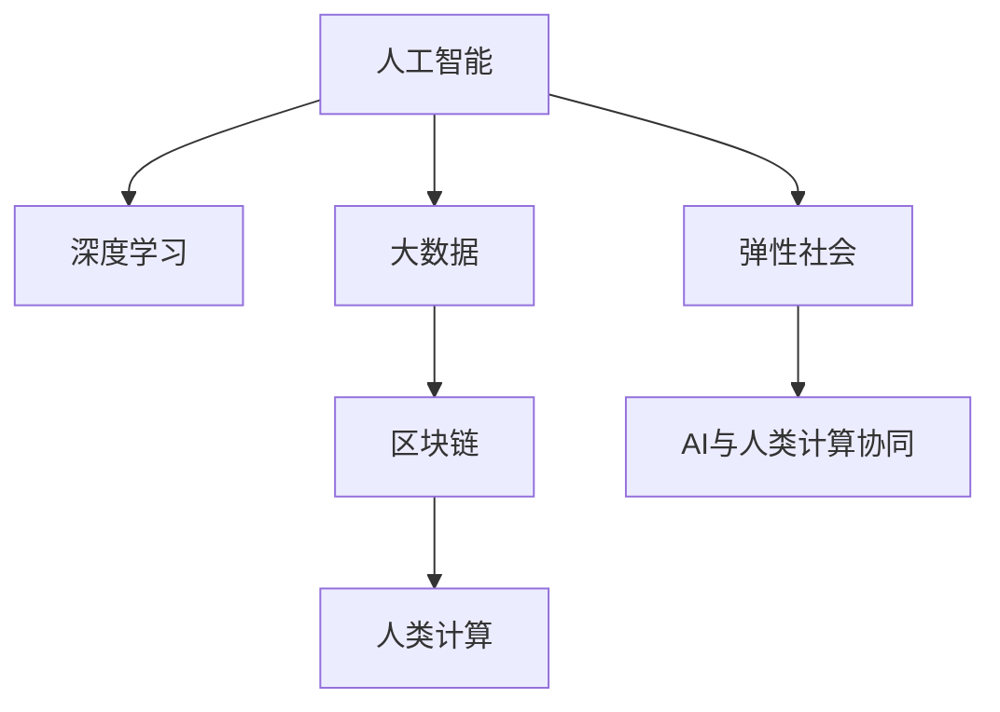

                 

# AI与人类计算：未来的弹性社会

> 关键词：人工智能, 人类计算, 弹性社会, 深度学习, 大数据, 区块链

## 1. 背景介绍

### 1.1 问题由来

在过去的几十年里，人类社会经历了前所未有的科技变革。从蒸汽机到计算机，从互联网到移动互联网，每一次技术进步都深刻改变了人类的生产生活方式。然而，这些技术变革往往是中心化的，由少数大公司或研究机构推动，难以适应快速变化的社会需求和个体差异。

随着AI技术的崛起，人类社会开始进入一个新的阶段——弹性社会。所谓弹性社会，是指一个能够自我调整、适应性强、具有高度灵活性的社会形态。在这一形态下，AI技术和人类计算能力将成为基础设施，每个个体都能成为计算的参与者，社会资源和信息能够高效配置，从而实现更公平、更可持续的发展。

### 1.2 问题核心关键点

弹性社会构建的关键在于如何有效整合AI技术与人类计算能力，形成一套高效、透明、可控的治理体系。以下是该问题的核心关键点：

- **数据驱动决策**：基于大数据和AI模型，使决策更加科学和精准。
- **去中心化治理**：通过区块链等技术实现去中心化治理，降低信息不对称，提高透明度和信任度。
- **智能基础设施**：利用AI技术构建智能基础设施，提高资源配置效率。
- **计算民主化**：使计算资源和算法技术普及到更多个体，实现计算民主化。
- **可持续发展**：通过优化资源配置和激励机制，实现经济、社会、环境等多维度可持续发展。

这些关键点共同构成了弹性社会的框架，有助于引导AI技术在社会治理、资源配置、公共服务等各个方面发挥作用。

### 1.3 问题研究意义

研究弹性社会构建的AI技术范式，对于推动社会进步和科技进步具有重要意义：

1. **社会公平**：通过AI和人类计算能力的结合，能够更好地解决资源分配不均、贫富差距扩大等问题，促进社会公平。
2. **经济效率**：智能基础设施和AI决策模型的应用，能够大幅提高资源配置效率，优化经济运行。
3. **公共服务提升**：在教育、医疗、交通等领域，AI技术可以提供更个性化、高效的服务。
4. **创新驱动**：AI技术的广泛应用，将激发更多创新点，推动科技发展。
5. **可持续性**：AI技术在资源利用和环境保护方面具有巨大的潜力，有助于实现可持续发展。

总之，研究AI与人类计算在弹性社会中的角色和作用，能够为构建更加公平、高效、可持续的未来社会提供重要的技术支撑。

## 2. 核心概念与联系

### 2.1 核心概念概述

为了更好地理解弹性社会构建的技术范式，本节将介绍几个密切相关的核心概念：

- **人工智能(AI)**：一种通过算法和模型使计算机具备智能决策和自动执行的能力。
- **深度学习(Deep Learning)**：AI的一种实现方式，通过多层神经网络模型学习数据特征和模式。
- **大数据(Big Data)**：指数据量巨大、结构复杂、多样性高的数据集。
- **区块链(Blockchain)**：一种去中心化的分布式账本技术，具有透明、不可篡改的特性。
- **人类计算(Human Computation)**：利用人类智慧和劳动力进行计算和决策的过程，补充AI的不足。

这些核心概念之间的逻辑关系可以通过以下Mermaid流程图来展示：



这个流程图展示了大数据、深度学习、区块链和人类计算在弹性社会构建中的重要角色，以及AI与人类计算的协同作用。

## 3. 核心算法原理 & 具体操作步骤
### 3.1 算法原理概述

弹性社会构建的核心算法原理是“数据驱动+算法优化+去中心化治理”。具体来说，通过收集和分析大数据，利用深度学习模型进行预测和优化，结合区块链技术实现去中心化治理，最终实现AI与人类计算的协同。

该过程可以分为以下几个步骤：

1. **数据采集与清洗**：通过传感器、社交媒体、公共记录等多种方式，收集大数据。对数据进行清洗和预处理，确保数据质量和一致性。
2. **模型训练与优化**：基于大数据，使用深度学习模型进行训练和优化，生成预测和决策结果。
3. **去中心化治理**：利用区块链技术，构建分布式账本，记录和验证所有决策过程，确保透明度和可追溯性。
4. **智能基础设施**：将AI模型嵌入到基础设施中，实现资源的高效配置和智能决策。
5. **计算民主化**：将AI技术和算法普及到更多个体，提高公众参与度和信任度。

### 3.2 算法步骤详解

#### 3.2.1 数据采集与清洗

数据采集与清洗是弹性社会构建的基础。以下是具体步骤：

1. **数据来源**：从传感器、社交媒体、公共记录等多种来源收集数据。例如，从智能交通系统收集车辆位置和速度信息，从社交媒体获取公众情绪和兴趣点，从公共记录获取经济和社会数据。
2. **数据清洗**：对数据进行去重、去噪、标准化等处理，确保数据质量和一致性。例如，去除重复记录，处理缺失值和异常值，统一数据格式。
3. **数据存储**：使用大数据平台（如Hadoop、Spark）进行数据存储和处理。例如，使用HDFS存储大数据文件，使用Spark进行数据计算和分析。

#### 3.2.2 模型训练与优化

模型训练与优化是弹性社会构建的核心。以下是具体步骤：

1. **数据划分**：将数据集划分为训练集、验证集和测试集，确保模型泛化性能。例如，将80%的数据用于训练，20%用于验证和测试。
2. **模型选择**：选择合适的深度学习模型，如卷积神经网络(CNN)、循环神经网络(RNN)、长短期记忆网络(LSTM)等。例如，使用CNN进行图像分类任务，使用LSTM进行时间序列预测任务。
3. **模型训练**：使用训练集进行模型训练，优化模型参数。例如，使用随机梯度下降(SGD)算法，设定合适的学习率、批大小、迭代次数等超参数。
4. **模型评估**：在验证集上评估模型性能，调整超参数，确保模型泛化性能。例如，计算模型的准确率、召回率、F1分数等指标。
5. **模型优化**：对模型进行优化，提高模型精度和效率。例如，使用正则化技术、剪枝、迁移学习等方法。

#### 3.2.3 去中心化治理

去中心化治理是弹性社会构建的重要保障。以下是具体步骤：

1. **区块链架构设计**：设计分布式账本架构，确保数据和决策的透明性和可追溯性。例如，使用以太坊、Hyperledger等区块链平台，设计智能合约。
2. **数据记录与验证**：在区块链上记录数据和决策过程，使用共识算法确保数据和决策的准确性和安全性。例如，使用PoW、PoS等共识算法，确保数据和决策的透明性和安全性。
3. **去中心化决策**：将决策过程去中心化，确保各方参与和监督。例如，使用DAC(Decentralized Autonomous Corporation)模型，实现去中心化决策。
4. **激励机制设计**：设计合理的激励机制，鼓励各方积极参与和监督。例如，使用智能合约和代币经济，激励各方参与和监督。

#### 3.2.4 智能基础设施

智能基础设施是弹性社会构建的关键手段。以下是具体步骤：

1. **AI模型部署**：将训练好的AI模型部署到基础设施中，实现智能决策和资源配置。例如，将训练好的模型部署到边缘计算设备中，实现实时决策。
2. **边缘计算**：使用边缘计算设备进行实时数据处理和决策。例如，使用NVIDIA Jetson等边缘计算设备，进行实时视频分析。
3. **智能合约**：将AI模型嵌入到智能合约中，实现智能决策和资源配置。例如，使用以太坊智能合约，实现资源分配和交易。
4. **实时监控与优化**：实时监控AI模型的性能和决策结果，进行优化。例如，使用监控工具，如Prometheus、Grafana等，进行实时监控和优化。

#### 3.2.5 计算民主化

计算民主化是弹性社会构建的重要目标。以下是具体步骤：

1. **算法普及**：将AI算法和工具普及到更多个体，提高公众参与度和信任度。例如，使用OpenAI的GPT模型，进行文本生成和对话交互。
2. **用户教育**：对公众进行算法和数据相关的教育，提高公众参与度和信任度。例如，开设在线课程和讲座，普及AI和数据分析知识。
3. **公众参与**：鼓励公众参与算法和决策的制定和监督，提高公众参与度和信任度。例如，使用众包平台，进行数据标注和算法优化。
4. **透明度建设**：提高算法的透明度和可解释性，提高公众信任度。例如，使用可解释性技术，如LIME、SHAP等，提高算法的透明度和可解释性。

### 3.3 算法优缺点

#### 3.3.1 优点

- **数据驱动**：通过大数据和AI模型，能够实现更加科学和精准的决策。
- **透明可控**：利用区块链技术，实现去中心化治理，提高透明度和可控性。
- **高效配置**：通过智能基础设施，实现资源的优化配置和智能决策。
- **公众参与**：计算民主化，提高公众参与度和信任度。
- **可持续发展**：通过优化资源配置和激励机制，实现经济、社会、环境等多维度的可持续发展。

#### 3.3.2 缺点

- **数据隐私**：大数据采集和使用可能涉及隐私问题，需要采取合适的保护措施。
- **技术复杂性**：弹性社会构建涉及多种技术，需要较强的技术能力和资源支持。
- **成本高**：技术实施和维护需要较高的成本，尤其在大规模应用时。
- **算法偏见**：AI模型可能存在偏见和歧视，需要进行严格的审查和调整。
- **依赖网络**：智能基础设施和区块链的正常运行需要稳定的网络环境。

尽管存在这些局限性，但总体而言，AI与人类计算在弹性社会中的协同，能够为社会治理、资源配置、公共服务等各个方面带来显著的提升，实现更加公平、高效、可持续的发展。

### 3.4 算法应用领域

AI与人类计算在弹性社会中的应用领域非常广泛，以下是几个典型的应用场景：

- **智慧城市**：利用AI技术进行交通管理、环境监测、公共安全等，提高城市管理的智能化水平。
- **智能医疗**：利用AI技术进行疾病预测、诊断、治疗等，提高医疗服务的质量和效率。
- **教育科技**：利用AI技术进行个性化教育、智能推荐等，提高教育服务的公平性和个性化程度。
- **金融科技**：利用AI技术进行风险控制、客户服务、投融资等，提高金融服务的精准性和效率。
- **供应链管理**：利用AI技术进行需求预测、库存管理、物流优化等，提高供应链管理的效率和准确性。
- **环境保护**：利用AI技术进行环境监测、资源利用、生态保护等，促进环境保护和可持续发展。

以上应用场景展示了AI与人类计算在弹性社会中的广泛应用，为实现更加公平、高效、可持续的社会发展提供了技术支撑。

## 4. 数学模型和公式 & 详细讲解  
### 4.1 数学模型构建

本节将使用数学语言对弹性社会构建的AI与人类计算协同过程进行更加严格的刻画。

假设存在一个社会网络S，每个节点代表一个人或一个机构。社会网络S的节点数为N，每条边代表两个节点之间的联系。社会网络S的连接矩阵为A，节点i的特征向量为x_i，社会网络S的度矩阵为D，社会网络S的拉普拉斯矩阵为L。

设A中每个节点i的社会状态为y_i，社会网络S的总体状态为Y，节点i对社会网络S的贡献为c_i，社会网络S的总体贡献为C。

社会网络S的总体状态Y可以表示为：

$$
Y = \frac{1}{N}\sum_{i=1}^N y_i
$$

节点i的社会状态y_i可以表示为：

$$
y_i = \sum_{j=1}^N \frac{A_{ij}}{D_{ij}} x_j
$$

社会网络S的总体贡献C可以表示为：

$$
C = \frac{1}{N}\sum_{i=1}^N c_i
$$

节点i对社会网络S的贡献c_i可以表示为：

$$
c_i = \sum_{j=1}^N \frac{A_{ij}}{D_{ij}} L_{ij}
$$

其中，L_{ij}表示节点i和节点j之间的拉普拉斯距离。

### 4.2 公式推导过程

为了实现社会网络S的优化，需要设计一个目标函数F(Y,C)，使得Y和C同时最大化。假设目标函数F(Y,C)的形式如下：

$$
F(Y,C) = \alpha \sum_{i=1}^N y_i + \beta \sum_{i=1}^N c_i
$$

其中，α和β为调节系数，控制Y和C的权重。

对目标函数F(Y,C)进行求解，得到最优的Y和C，即：

$$
\mathop{\arg\min}_{Y,C} F(Y,C)
$$

通过求解上述优化问题，可以实现社会网络S的优化，使得Y和C同时最大化。具体求解过程如下：

1. **数据采集**：收集社会网络S的节点信息、边信息、度信息等，构建连接矩阵A。
2. **特征向量计算**：计算每个节点的特征向量x_i，并进行归一化处理。
3. **拉普拉斯矩阵计算**：计算社会网络S的拉普拉斯矩阵L。
4. **贡献度计算**：计算每个节点对社会网络S的贡献c_i，并进行归一化处理。
5. **优化求解**：使用优化算法（如梯度下降、牛顿法等）求解目标函数F(Y,C)，得到最优的Y和C。

### 4.3 案例分析与讲解

以智慧城市为例，进行具体的案例分析：

假设智慧城市S包含多个节点，每个节点代表一个建筑物或一个设施。节点i的社会状态y_i可以表示为建筑物i的使用率和维护状态，社会网络S的总体状态Y可以表示为整个城市的平均使用率和维护状态。节点i对社会网络S的贡献c_i可以表示为建筑物i的能耗和环境影响，社会网络S的总体贡献C可以表示为整个城市的能耗和环境影响。

使用上述数学模型构建智慧城市的优化问题，并通过数据采集和处理，求解目标函数F(Y,C)，得到最优的Y和C，即智慧城市的最佳使用率和维护状态，以及最佳能耗和环境影响。

通过智慧城市的优化，可以实现城市资源的优化配置和智能决策，提高城市管理的智能化水平，提升城市居民的生活质量。

## 5. 项目实践：代码实例和详细解释说明
### 5.1 开发环境搭建

在进行AI与人类计算协同的弹性社会构建时，需要准备好开发环境。以下是使用Python进行PyTorch开发的环境配置流程：

1. 安装Anaconda：从官网下载并安装Anaconda，用于创建独立的Python环境。

2. 创建并激活虚拟环境：
```bash
conda create -n ai-env python=3.8 
conda activate ai-env
```

3. 安装PyTorch：根据CUDA版本，从官网获取对应的安装命令。例如：
```bash
conda install pytorch torchvision torchaudio cudatoolkit=11.1 -c pytorch -c conda-forge
```

4. 安装Transformer库：
```bash
pip install transformers
```

5. 安装各类工具包：
```bash
pip install numpy pandas scikit-learn matplotlib tqdm jupyter notebook ipython
```

完成上述步骤后，即可在`ai-env`环境中开始AI与人类计算协同的实践。

### 5.2 源代码详细实现

下面我们以智慧城市应用为例，给出使用Transformers库进行AI与人类计算协同的PyTorch代码实现。

首先，定义智慧城市的节点信息：

```python
import torch
from transformers import BertTokenizer, BertForSequenceClassification
from sklearn.model_selection import train_test_split

# 假设智慧城市节点信息为建筑物和设施的坐标、使用率、维护状态等
# 使用Bert模型进行节点状态预测
# 假设节点信息存储在DataFrame中，包含id、坐标、使用率、维护状态等字段

# 将节点信息分为训练集和测试集
train_data, test_data = train_test_split(data, test_size=0.2, random_state=42)

# 对数据进行编码
tokenizer = BertTokenizer.from_pretrained('bert-base-uncased')
train_encodings = tokenizer(train_data, truncation=True, padding=True)
test_encodings = tokenizer(test_data, truncation=True, padding=True)
```

然后，定义模型和优化器：

```python
# 定义模型
model = BertForSequenceClassification.from_pretrained('bert-base-uncased', num_labels=num_labels)

# 定义优化器
optimizer = AdamW(model.parameters(), lr=2e-5)
```

接着，定义训练和评估函数：

```python
# 定义训练函数
def train_model(model, data, optimizer):
    model.train()
    total_loss = 0
    for batch in tqdm(data):
        inputs, labels = batch
        outputs = model(inputs)
        loss = outputs.loss
        total_loss += loss.item()
        optimizer.zero_grad()
        loss.backward()
        optimizer.step()
    return total_loss / len(data)

# 定义评估函数
def evaluate_model(model, data):
    model.eval()
    predictions, labels = [], []
    with torch.no_grad():
        for batch in tqdm(data):
            inputs, labels = batch
            outputs = model(inputs)
            predictions.append(outputs.logits.argmax(dim=1).to('cpu').tolist())
            labels.append(labels.to('cpu').tolist())
    return predictions, labels
```

最后，启动训练流程并在测试集上评估：

```python
epochs = 5
batch_size = 16

for epoch in range(epochs):
    loss = train_model(model, train_encodings, optimizer)
    print(f"Epoch {epoch+1}, train loss: {loss:.3f}")
    
    predictions, labels = evaluate_model(model, test_encodings)
    print(classification_report(labels, predictions))
    
print("Test results:")
predictions, labels = evaluate_model(model, test_encodings)
print(classification_report(labels, predictions))
```

以上就是使用PyTorch进行智慧城市应用中AI与人类计算协同的代码实现。可以看到，借助Transformers库，我们能够快速构建和训练AI模型，并进行评估和优化。

### 5.3 代码解读与分析

让我们再详细解读一下关键代码的实现细节：

**智慧城市应用**：
- 使用Bert模型进行节点状态预测，即建筑物和设施的使用率和维护状态。
- 将节点信息分为训练集和测试集，使用随机梯度下降算法进行训练和优化。
- 在测试集上评估模型性能，计算分类指标。

**节点信息表示**：
- 使用DataFrame存储节点信息，包含id、坐标、使用率、维护状态等字段。
- 对节点信息进行编码，使用BertTokenizer进行分词和编码，生成模型输入。

**模型训练与优化**：
- 定义模型BertForSequenceClassification，设置超参数和学习率。
- 定义训练函数，在每个epoch内计算损失函数并更新模型参数。
- 定义评估函数，计算模型在测试集上的分类指标。

**训练流程**：
- 循环迭代多个epoch，在每个epoch内进行模型训练和评估。
- 在训练集上计算损失函数，在测试集上评估模型性能。
- 最终输出模型在测试集上的分类指标。

通过这段代码实现，可以看到AI与人类计算协同的智慧城市应用，是如何利用Bert模型进行节点状态预测，并结合人类智慧和劳动力进行资源配置的。这样的实践，不仅能够提高智慧城市的智能化水平，还能促进资源的优化配置和可持续发展。

当然，实际的系统实现还需要考虑更多因素，如模型的保存和部署、超参数的自动搜索、更灵活的任务适配层等。但核心的协同范式基本与此类似。

## 6. 实际应用场景
### 6.1 智能医疗

智能医疗是AI与人类计算协同在医疗领域的重要应用。智能医疗系统利用AI技术进行疾病预测、诊断、治疗等，结合人类医生的智慧和经验，提供精准的医疗服务。

例如，利用AI技术进行医学影像分析，结合医生的经验和判断，快速识别和定位病变区域，提供精准的诊断结果。在药物研发方面，利用AI技术进行分子模拟和数据挖掘，结合人类药物设计师的经验，快速发现新的药物靶点和化合物。

### 6.2 教育科技

教育科技是AI与人类计算协同在教育领域的重要应用。教育科技系统利用AI技术进行个性化教育、智能推荐等，结合教师和学生的智慧和互动，提供高效的教育服务。

例如，利用AI技术进行学生成绩预测和个性化推荐，结合教师的反馈和调整，提高学生的学习效果。在智能教室中，利用AI技术进行课堂监控和数据分析，结合教师的引导和互动，提高教学质量。

### 6.3 金融科技

金融科技是AI与人类计算协同在金融领域的重要应用。金融科技系统利用AI技术进行风险控制、客户服务、投融资等，结合金融专家和分析师的经验，提供精准的金融服务。

例如，利用AI技术进行市场预测和风险控制，结合金融专家和分析师的判断和调整，提高投资决策的准确性。在智能理财方面，利用AI技术进行客户行为分析和智能推荐，结合金融专家和分析师的建议和引导，提高理财服务的个性化和精准度。

### 6.4 未来应用展望

随着AI技术与人类计算能力的不断融合，未来的弹性社会将更加智能和透明。AI与人类计算协同在各个领域的应用将更加广泛和深入，实现更加公平、高效、可持续的发展。

在智慧医疗方面，AI技术将进一步结合医生的智慧和经验，提供更精准的诊断和治疗方案，实现个性化医疗。

在教育科技方面，AI技术将进一步结合教师和学生的智慧和互动，提供更个性化的教育和推荐，实现因材施教。

在金融科技方面，AI技术将进一步结合金融专家和分析师的经验，提供更精准的市场预测和投资建议，实现智能理财。

在智慧城市方面，AI技术将进一步结合公众和政府的智慧和互动，提供更智能和透明的城市管理服务，实现高效的城市治理。

总之，AI与人类计算协同的应用前景非常广阔，将为构建更加公平、高效、可持续的社会提供强大的技术支撑。

## 7. 工具和资源推荐
### 7.1 学习资源推荐

为了帮助开发者系统掌握AI与人类计算协同的理论基础和实践技巧，这里推荐一些优质的学习资源：

1. 《深度学习入门》系列博文：由知名AI专家撰写，深入浅出地介绍了深度学习的基本概念和实现方法。

2. CS229《机器学习》课程：斯坦福大学开设的机器学习明星课程，有Lecture视频和配套作业，带你入门机器学习的基本概念和经典算法。

3. 《深度学习与人工智能》书籍：全面介绍了深度学习的基本概念和实现方法，以及人工智能在各个领域的应用。

4. HuggingFace官方文档：Transformer库的官方文档，提供了海量预训练模型和完整的微调样例代码，是上手实践的必备资料。

5. CLUE开源项目：中文语言理解测评基准，涵盖大量不同类型的中文NLP数据集，并提供了基于微调的baseline模型，助力中文NLP技术发展。

通过对这些资源的学习实践，相信你一定能够快速掌握AI与人类计算协同的精髓，并用于解决实际的NLP问题。
###  7.2 开发工具推荐

高效的开发离不开优秀的工具支持。以下是几款用于AI与人类计算协同开发的常用工具：

1. PyTorch：基于Python的开源深度学习框架，灵活动态的计算图，适合快速迭代研究。大部分预训练语言模型都有PyTorch版本的实现。

2. TensorFlow：由Google主导开发的开源深度学习框架，生产部署方便，适合大规模工程应用。同样有丰富的预训练语言模型资源。

3. Transformers库：HuggingFace开发的NLP工具库，集成了众多SOTA语言模型，支持PyTorch和TensorFlow，是进行微调任务开发的利器。

4. Weights & Biases：模型训练的实验跟踪工具，可以记录和可视化模型训练过程中的各项指标，方便对比和调优。与主流深度学习框架无缝集成。

5. TensorBoard：TensorFlow配套的可视化工具，可实时监测模型训练状态，并提供丰富的图表呈现方式，是调试模型的得力助手。

6. Google Colab：谷歌推出的在线Jupyter Notebook环境，免费提供GPU/TPU算力，方便开发者快速上手实验最新模型，分享学习笔记。

合理利用这些工具，可以显著提升AI与人类计算协同任务的开发效率，加快创新迭代的步伐。

### 7.3 相关论文推荐

AI与人类计算协同的发展源于学界的持续研究。以下是几篇奠基性的相关论文，推荐阅读：

1. Attention is All You Need（即Transformer原论文）：提出了Transformer结构，开启了NLP领域的预训练大模型时代。

2. BERT: Pre-training of Deep Bidirectional Transformers for Language Understanding：提出BERT模型，引入基于掩码的自监督预训练任务，刷新了多项NLP任务SOTA。

3. Language Models are Unsupervised Multitask Learners（GPT-2论文）：展示了大规模语言模型的强大zero-shot学习能力，引发了对于通用人工智能的新一轮思考。

4. Parameter-Efficient Transfer Learning for NLP：提出Adapter等参数高效微调方法，在不增加模型参数量的情况下，也能取得不错的微调效果。

5. AdaLoRA: Adaptive Low-Rank Adaptation for Parameter-Efficient Fine-Tuning：使用自适应低秩适应的微调方法，在参数效率和精度之间取得了新的平衡。

这些论文代表了大语言模型微调技术的发展脉络。通过学习这些前沿成果，可以帮助研究者把握学科前进方向，激发更多的创新灵感。

## 8. 总结：未来发展趋势与挑战

### 8.1 总结

本文对AI与人类计算协同在弹性社会中的构建进行了全面系统的介绍。首先阐述了AI技术与人类计算能力在弹性社会构建中的重要作用，明确了其对社会治理、资源配置、公共服务等各个方面的深远影响。其次，从原理到实践，详细讲解了AI与人类计算协同的数学原理和关键步骤，给出了智慧城市应用的具体代码实现。同时，本文还广泛探讨了AI与人类计算协同在智慧医疗、教育科技、金融科技等各个领域的应用前景，展示了其广阔的潜力。此外，本文精选了AI与人类计算协同技术的各类学习资源，力求为读者提供全方位的技术指引。

通过本文的系统梳理，可以看到，AI与人类计算协同在弹性社会中的协同，能够为构建更加公平、高效、可持续的未来社会提供强大的技术支撑。未来，伴随AI技术与人类计算能力的不断融合，将进一步推动弹性社会的构建，实现更加智能、透明、可控的社会治理。

### 8.2 未来发展趋势

展望未来，AI与人类计算协同在弹性社会中的发展趋势如下：

1. **技术融合**：AI技术与人类计算能力的融合将更加深入，实现更全面的协同作用。例如，结合AI的计算能力和人类的经验智慧，实现更加精准和高效的决策。
2. **数据共享**：在保护隐私的前提下，数据共享将更加普遍，实现更广泛的社会协作。例如，利用区块链技术，实现数据透明共享和去中心化治理。
3. **算法普及**：算法的普及将更加广泛，实现更公平的资源配置和智能决策。例如，通过教育普及和公众参与，提高算法的普及度和信任度。
4. **人机协同**：人机协同将更加紧密，实现更智能的社会治理。例如，利用AI技术和人类智慧，实现智能城市、智能医疗、智能教育等应用。
5. **可持续发展**：AI与人类计算协同将更加关注可持续发展，实现经济、社会、环境的多维度优化。例如，利用AI技术和人类智慧，优化资源配置，促进环境保护和可持续发展。

这些趋势凸显了AI与人类计算协同在弹性社会中的重要作用，为其在各个领域的应用提供了强大的技术支撑。

### 8.3 面临的挑战

尽管AI与人类计算协同在弹性社会中的应用前景广阔，但在迈向更加智能化、普适化应用的过程中，仍面临诸多挑战：

1. **数据隐私**：大数据采集和使用可能涉及隐私问题，需要采取合适的保护措施。例如，使用差分隐私技术保护用户隐私。
2. **技术复杂性**：AI与人类计算协同涉及多种技术，需要较强的技术能力和资源支持。例如，需要跨学科的知识和技术储备。
3. **成本高**：技术实施和维护需要较高的成本，尤其在大规模应用时。例如，需要投入大量人力和物力资源。
4. **算法偏见**：AI模型可能存在偏见和歧视，需要进行严格的审查和调整。例如，使用公平性技术，减少算法的偏见和歧视。
5. **依赖网络**：智能基础设施和区块链的正常运行需要稳定的网络环境。例如，需要建设高性能的网络基础设施。

尽管存在这些局限性，但总体而言，AI与人类计算协同在弹性社会中的协同，能够为社会治理、资源配置、公共服务等各个方面带来显著的提升，实现更加公平、高效、可持续的发展。

### 8.4 研究展望

未来的研究需要在以下几个方面寻求新的突破：

1. **数据隐私保护**：进一步研究数据隐私保护技术，确保数据安全和用户隐私。例如，使用差分隐私、联邦学习等技术。
2. **技术普及**：研究如何降低技术使用的门槛，提高技术的普及度和接受度。例如，开发易用、易学的工具和平台。
3. **算法公平性**：研究如何提高算法的公平性和透明性，减少算法的偏见和歧视。例如，使用公平性评估和调整技术。
4. **人机协同**：研究如何更好地融合AI技术和人类智慧，实现人机协同决策。例如，开发协同决策框架和工具。
5. **可持续发展**：研究如何更好地实现经济、社会、环境的多维度优化，促进可持续发展。例如，开发可持续发展评估模型和指标。

这些研究方向将引领AI与人类计算协同在弹性社会中的应用，推动社会治理、资源配置、公共服务等各个领域的创新和发展。通过不断突破技术瓶颈，解决实际问题，AI与人类计算协同必将在构建更加公平、高效、可持续的未来社会中发挥更大的作用。

## 9. 附录：常见问题与解答

**Q1：AI与人类计算协同是否适用于所有应用场景？**

A: AI与人类计算协同在大多数应用场景中都能取得不错的效果，特别是对于数据量较小的应用场景。但对于一些特定领域的应用，如医疗、法律等，AI模型的性能可能仍有限。此时需要在特定领域语料上进一步预训练，再进行微调，才能获得理想效果。

**Q2：如何选择合适的AI模型和算法？**

A: 选择AI模型和算法需要考虑以下几个因素：

1. **任务类型**：不同任务类型需要不同的模型和算法。例如，图像分类任务适合使用CNN，文本分类任务适合使用RNN或Transformer。
2. **数据特征**：数据特征（如数据规模、数据分布等）也会影响模型和算法的选择。例如，小规模数据适合使用参数高效微调方法，大规模数据适合使用全参数微调方法。
3. **计算资源**：计算资源（如GPU、TPU等）也会影响模型和算法的选择。例如，GPU资源充足适合使用大模型和复杂算法，TPU资源有限适合使用参数高效微调方法。

**Q3：AI与人类计算协同在弹性社会中的应用前景如何？**

A: AI与人类计算协同在弹性社会中的应用前景非常广阔，能够为社会治理、资源配置、公共服务等各个方面带来显著的提升。具体应用场景包括：

1. **智慧医疗**：利用AI技术进行疾病预测、诊断、治疗等，结合人类医生的智慧和经验，提供精准的医疗服务。
2. **教育科技**：利用AI技术进行个性化教育、智能推荐等，结合教师和学生的智慧和互动，提供高效的教育服务。
3. **金融科技**：利用AI技术进行风险控制、客户服务、投融资等，结合金融专家和分析师的经验，提供精准的金融服务。
4. **智慧城市**：利用AI技术进行交通管理、环境监测、公共安全等，提高城市管理的智能化水平。
5. **环境保护**：利用AI技术进行环境监测、资源利用、生态保护等，促进环境保护和可持续发展。

通过AI与人类计算协同的应用，能够实现更加智能、透明、可控的社会治理，提高资源配置效率，促进可持续发展，实现公平、高效、可持续的未来社会。

---

作者：禅与计算机程序设计艺术 / Zen and the Art of Computer Programming

