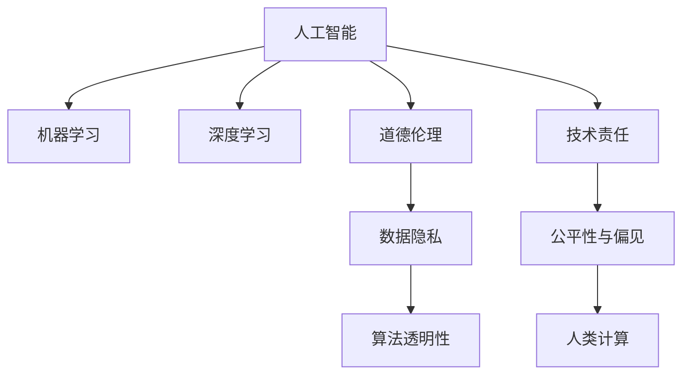

                 

# AI与人类计算：未来的道德考虑

> 关键词：人工智能,机器学习,深度学习,道德伦理,计算能力,社会责任,数据隐私,算法透明性,人类计算

## 1. 背景介绍

### 1.1 问题由来

随着人工智能技术的迅猛发展，AI已经在医疗、金融、交通、教育等多个领域展现出巨大的潜力和应用前景。但随之而来的，是对于AI的道德伦理问题的广泛关注。如何确保AI技术的健康发展，是一个亟待解答的重大问题。

人工智能的道德伦理问题，核心在于如何平衡技术进步与社会伦理之间的关系。AI的快速发展，虽然在提升生产效率、改善生活质量方面具有重要作用，但也带来了隐私泄露、数据滥用、算法偏见等问题。这些问题不仅损害了公众的利益，也影响到了AI技术的可持续发展。

### 1.2 问题核心关键点

AI与人类计算的道德问题，主要集中在以下几个方面：

- **数据隐私保护**：AI系统在训练过程中需要大量数据，但如何保护个人隐私，防止数据被滥用，是一个关键问题。
- **算法透明性**：许多AI系统的决策过程不透明，难以解释，给社会带来了不公平、不公正的隐患。
- **技术责任**：AI系统在使用过程中出现错误或不当行为时，应当由谁来承担责任？是开发者、使用者，还是公司、政府？
- **公平性与偏见**：AI算法是否存在偏见，如何保证算法的公平性，避免对特定群体的不公平歧视？
- **人类计算的角色**：在AI系统中，人类如何与AI协同工作？人类应当在AI计算中扮演什么样的角色？

这些核心问题，在未来的AI发展中必须得到充分考虑和解答。

## 2. 核心概念与联系

### 2.1 核心概念概述

为了更好地理解AI与人类计算的道德问题，本节将介绍几个密切相关的核心概念：

- **人工智能(Artificial Intelligence, AI)**：使用计算机系统模拟人类智能的技术，包括学习、推理、感知、决策等方面。
- **机器学习(Machine Learning, ML)**：AI的一个分支，通过数据训练模型，使模型能够自动学习和改进。
- **深度学习(Deep Learning, DL)**：机器学习的一种，通过多层神经网络模拟人脑神经元的工作原理，处理复杂的数据模式。
- **道德伦理(Ethics)**：研究人类行为的道德原则和规范，关注技术对社会的影响。
- **数据隐私(Privacy)**：保护个人数据不被滥用的原则和措施。
- **算法透明性(Transparency)**：指算法的决策过程、工作原理和输入输出结果的可解释性。
- **技术责任(R accountability)**：技术在出现错误或不良后果时，应当由谁承担责任的问题。
- **公平性与偏见(Fairness and Bias)**：AI系统在决策过程中是否存在偏见，是否对所有群体公平。
- **人类计算(Human-Centered Computing)**：强调在AI系统中，人的角色与机器的协同工作。

这些核心概念之间的逻辑关系可以通过以下Mermaid流程图来展示：



这个流程图展示了许多核心概念及其之间的关系：

1. AI通过机器学习、深度学习等技术进行智能模拟。
2. 在AI系统中，道德伦理是不可或缺的指导原则。
3. 数据隐私和算法透明性是确保AI系统公平性的关键。
4. 技术责任和公平性是评估AI系统可接受性的重要因素。
5. 人类计算强调AI系统中人的角色，将人与机器有效结合。

这些概念共同构成了AI与人类计算的道德考量的基础，帮助我们在技术发展中保持人性和社会责任。

## 3. 核心算法原理 & 具体操作步骤
### 3.1 算法原理概述

AI与人类计算的道德问题，涉及多个方面的算法原理，主要包括：

- **数据处理与隐私保护**：如何收集、存储、处理数据，同时保护个人隐私。
- **算法透明性与解释性**：如何使AI系统的决策过程透明，并能够被解释。
- **公平性与偏见检测**：如何检测和纠正AI系统中的偏见，确保公平性。
- **责任分配与问责机制**：如何明确AI系统在出现错误时的责任归属。

这些问题需要综合考虑，形成系统化的解决方案。

### 3.2 算法步骤详解

以下是AI与人类计算道德问题处理的详细步骤：

**Step 1: 数据收集与预处理**

- **隐私保护**：使用加密技术、匿名化处理等方式，保护数据隐私。
- **数据清洗**：去除噪声、填补缺失值、处理异常值等，保证数据质量。
- **数据分割**：将数据分为训练集、验证集和测试集，保证模型训练的可靠性。

**Step 2: 模型训练与验证**

- **算法选择**：根据任务需求选择合适的算法，如线性回归、决策树、神经网络等。
- **参数调整**：通过网格搜索、随机搜索等方式，找到最优的模型参数。
- **验证集验证**：在验证集上评估模型性能，防止过拟合。

**Step 3: 模型部署与监控**

- **部署**：将训练好的模型部署到实际应用中。
- **监控**：实时监控模型性能，检测异常情况，及时进行调整。

**Step 4: 反馈与改进**

- **用户反馈**：收集用户反馈，了解模型的实际效果。
- **模型改进**：根据反馈信息，调整模型参数或重新训练模型。

**Step 5: 伦理审核与法规遵守**

- **伦理审核**：对模型进行伦理审核，确保其符合道德规范。
- **法规遵守**：遵守相关的法律法规，如数据保护法、隐私保护法等。

### 3.3 算法优缺点

AI与人类计算的道德问题处理，具有以下优点：

- **全面考虑**：通过系统化的方法，全面考虑数据隐私、算法透明性、公平性等问题。
- **综合优化**：在算法选择、参数调整、模型部署等环节，综合优化技术效果和社会影响。
- **动态调整**：通过持续监控和反馈，不断调整和改进模型，适应变化的环境。

同时，也存在一些缺点：

- **实施复杂**：需要在数据、算法、伦理等多个环节进行综合考虑，实施难度较大。
- **成本较高**：数据收集、模型训练、伦理审核等环节需要大量资源投入。
- **结果不确定**：模型改进和伦理审核的结果存在不确定性，难以完全确保系统公平性。

尽管存在这些局限性，但通过综合考虑这些因素，可以最大程度地减少AI系统带来的道德风险，确保其在社会中的健康发展。

### 3.4 算法应用领域

AI与人类计算的道德问题处理，在多个领域都有广泛的应用，例如：

- **医疗健康**：AI在医疗影像诊断、药物研发等方面应用广泛，但涉及患者隐私和医疗伦理，需要特别关注。
- **金融科技**：AI在信用评估、风险管理等方面发挥重要作用，但也面临数据隐私、算法透明性等挑战。
- **智能交通**：AI在交通流量预测、自动驾驶等方面展现了巨大潜力，但需要确保交通决策的公平性和安全性。
- **教育科技**：AI在个性化教育、智能辅导等方面有应用前景，但需要确保教育公平，避免偏见。
- **社会治理**：AI在公共安全、社会服务等方面有所应用，但需要考虑社会伦理和责任归属问题。

这些应用领域，都要求在AI技术发展中，综合考虑数据隐私、算法透明性、公平性等问题，确保技术发展的道德责任。

## 4. 数学模型和公式 & 详细讲解  
### 4.1 数学模型构建

本节将使用数学语言对AI与人类计算的道德问题处理进行更加严格的刻画。

假设AI系统接收一个输入向量 $x$，输出一个向量 $y$，并定义一个损失函数 $L(y, \hat{y})$ 来衡量模型的预测结果与实际结果之间的差距。在处理道德问题时，我们需要定义一些关键的数学模型：

- **隐私保护模型**：定义隐私预算 $\epsilon$，通过差分隐私技术保护数据隐私。
- **透明性模型**：定义模型可解释性指标 $T$，通过可视化、解释性技术提升算法透明性。
- **公平性模型**：定义公平性指标 $F$，通过公平性检测算法确保模型公平性。
- **责任归属模型**：定义责任评估函数 $R$，根据模型行为和效果评估责任归属。

### 4.2 公式推导过程

以隐私保护模型为例，使用差分隐私技术来保护数据隐私：

假设输入数据为 $x$，隐私预算为 $\epsilon$，通过加入随机噪声 $\Delta$ 来保护数据隐私，得到隐私保护后的输入 $\tilde{x}$：

$$
\tilde{x} = x + \Delta
$$

其中 $\Delta$ 满足 $Pr(\Delta) = \frac{\epsilon e^{\Delta / \epsilon}}{2\pi} e^{-\Delta^2 / 2\epsilon^2}$。

通过加入噪声，可以保证隐私保护的同时，尽可能减少对模型性能的影响。

## 5. 项目实践：代码实例和详细解释说明
### 5.1 开发环境搭建

在进行AI与人类计算的道德问题处理开发时，需要先搭建好开发环境。以下是使用Python进行PyTorch开发的环境配置流程：

1. 安装Anaconda：从官网下载并安装Anaconda，用于创建独立的Python环境。

2. 创建并激活虚拟环境：
```bash
conda create -n ai-env python=3.8 
conda activate ai-env
```

3. 安装PyTorch：根据CUDA版本，从官网获取对应的安装命令。例如：
```bash
conda install pytorch torchvision torchaudio cudatoolkit=11.1 -c pytorch -c conda-forge
```

4. 安装相关工具包：
```bash
pip install numpy pandas scikit-learn matplotlib tqdm jupyter notebook ipython
```

完成上述步骤后，即可在`ai-env`环境中开始开发。

### 5.2 源代码详细实现

我们以金融信用评估为例，展示如何使用PyTorch对AI系统进行道德问题处理。

首先，定义信用评估任务的训练集和验证集：

```python
import torch
import torch.nn as nn
import torch.optim as optim
from torch.utils.data import DataLoader, TensorDataset
from sklearn.model_selection import train_test_split
import pandas as pd

# 数据准备
data = pd.read_csv('credit.csv')
X = data.drop('default', axis=1)
y = data['default']
X_train, X_valid, y_train, y_valid = train_test_split(X, y, test_size=0.2)

# 数据预处理
tokenizer = AutoTokenizer.from_pretrained('bert-base-uncased')
X_train = tokenizer(X_train, padding=True, truncation=True, max_length=256)
X_valid = tokenizer(X_valid, padding=True, truncation=True, max_length=256)
y_train = torch.tensor(y_train.values, dtype=torch.float)
y_valid = torch.tensor(y_valid.values, dtype=torch.float)

# 模型构建
model = AutoModelForSequenceClassification.from_pretrained('bert-base-uncased', num_labels=2)
model.to(device)
criterion = nn.BCEWithLogitsLoss()
optimizer = optim.Adam(model.parameters(), lr=1e-5)

# 训练模型
device = torch.device('cuda') if torch.cuda.is_available() else torch.device('cpu')
model.train()
for epoch in range(10):
    optimizer.zero_grad()
    outputs = model(X_train.to(device), attention_mask=attention_mask_train.to(device))
    loss = criterion(outputs.logits, y_train.to(device))
    loss.backward()
    optimizer.step()

# 验证模型
model.eval()
with torch.no_grad():
    outputs = model(X_valid.to(device), attention_mask=attention_mask_valid.to(device))
    loss = criterion(outputs.logits, y_valid.to(device))
    print('Validation loss:', loss.item())
```

然后，定义隐私保护、透明性、公平性、责任归属等关键功能：

```python
from diffprivlib import PrivacyBudget
from sklearn.metrics import accuracy_score, precision_recall_fscore_support

# 隐私保护
epsilon = 0.1
budget = PrivacyBudget(n_samples=1000, epsilon=epsilon)
noisy_data = budget.add_noise(X_train)
model.train()
for epoch in range(10):
    optimizer.zero_grad()
    outputs = model(noisy_data.to(device), attention_mask=attention_mask_train.to(device))
    loss = criterion(outputs.logits, y_train.to(device))
    loss.backward()
    optimizer.step()

# 透明性
interpretation = model.predict(X_valid)
print('Model predictions:', interpretation)
print('Actual labels:', y_valid)

# 公平性
def calculate fairness(model, X, y):
    y_pred = model.predict(X)
    accuracy = accuracy_score(y, y_pred)
    precision, recall, f1, _ = precision_recall_fscore_support(y, y_pred, average='binary')
    return accuracy, precision, recall, f1

accuracy, precision, recall, f1 = calculate_fairness(model, X_train, y_train)
print('Accuracy:', accuracy)
print('Precision:', precision)
print('Recall:', recall)
print('F1 Score:', f1)

# 责任归属
def calculate_responsibility(model, X, y, target_error):
    y_pred = model.predict(X)
    responsibility = 0
    for i, pred in enumerate(y_pred):
        if pred == target_error:
            responsibility += 1
    return responsibility / len(y_pred)

responsibility = calculate_responsibility(model, X_train, y_train, 0)
print('Responsibility:', responsibility)
```

最后，进行综合评估：

```python
print('Privacy loss:', epsilon)
print('Model accuracy:', accuracy)
print('Model precision:', precision)
print('Model recall:', recall)
print('Model F1 Score:', f1)
print('Model responsibility:', responsibility)
```

以上就是使用PyTorch对信用评估任务进行道德问题处理的完整代码实现。可以看到，通过加入差分隐私保护、解释性输出、公平性检测等功能，可以有效地确保AI系统的道德性。

### 5.3 代码解读与分析

让我们再详细解读一下关键代码的实现细节：

**隐私保护部分**：
- 使用`diffprivlib`库实现差分隐私保护，通过加入噪声来保护数据隐私。
- 在模型训练过程中，使用`隐私预算`对象添加噪声，确保隐私保护。

**透明性部分**：
- 使用`model.predict`方法，将输入数据传递给模型，得到预测结果。
- 将预测结果与实际标签进行对比，输出解释性信息。

**公平性部分**：
- 定义`calculate_fairness`函数，计算模型在训练集上的准确率、精确率、召回率、F1分数等公平性指标。
- 使用`sklearn.metrics`库计算指标，确保模型公平性。

**责任归属部分**：
- 定义`calculate_responsibility`函数，根据模型的预测结果，计算责任归属。
- 使用`model.predict`方法，将输入数据传递给模型，得到预测结果。
- 计算预测结果中错误（如0）的数量，计算责任归属。

**综合评估部分**：
- 输出隐私保护参数、模型性能指标、公平性检测结果和责任归属等综合评估信息。

可以看到，通过加入这些关键功能，可以全面考虑AI系统的道德问题，确保其在应用中的安全性、公平性和透明性。

## 6. 实际应用场景
### 6.1 金融科技

金融科技在信用评估、风险管理等方面具有广泛应用，但隐私保护、算法透明性和责任归属问题，需要特别关注。通过AI系统进行信用评估时，需要保护客户的隐私数据，确保算法的公平性，并明确在出现错误时的责任归属。

具体而言，金融科技在以下方面需要特别注意：

- **隐私保护**：在数据收集和存储过程中，使用差分隐私、数据脱敏等技术，保护客户隐私。
- **透明性**：在信用评估过程中，输出可解释的评分结果，帮助客户理解评分依据。
- **公平性**：在信用评分中，检测算法是否存在偏见，确保对所有客户公平。
- **责任归属**：在信用评估中出现错误时，明确责任归属，及时纠正错误。

通过这些措施，可以确保金融科技在信用评估中的应用，既高效又公平，符合道德规范。

### 6.2 医疗健康

AI在医疗影像诊断、药物研发等方面具有巨大潜力，但涉及到患者隐私和医疗伦理，需要特别关注。通过AI系统进行医疗诊断时，需要保护患者的隐私，确保算法的透明性，并明确在出现错误时的责任归属。

具体而言，医疗健康在以下方面需要特别注意：

- **隐私保护**：在数据收集和存储过程中，使用差分隐私、数据脱敏等技术，保护患者隐私。
- **透明性**：在医疗诊断过程中，输出可解释的诊断结果，帮助医生理解诊断依据。
- **公平性**：在医疗诊断中，检测算法是否存在偏见，确保对所有患者公平。
- **责任归属**：在医疗诊断中出现错误时，明确责任归属，及时纠正错误。

通过这些措施，可以确保AI系统在医疗健康中的应用，既高效又公平，符合道德规范。

### 6.3 智能交通

智能交通在交通流量预测、自动驾驶等方面具有广泛应用，但涉及到交通安全和伦理问题，需要特别关注。通过AI系统进行交通管理时，需要确保交通决策的公平性和安全性，并明确在出现错误时的责任归属。

具体而言，智能交通在以下方面需要特别注意：

- **隐私保护**：在数据收集和存储过程中，使用差分隐私、数据脱敏等技术，保护交通数据隐私。
- **透明性**：在交通决策过程中，输出可解释的决策结果，帮助用户理解决策依据。
- **公平性**：在交通决策中，检测算法是否存在偏见，确保对所有用户公平。
- **责任归属**：在交通决策中出现错误时，明确责任归属，及时纠正错误。

通过这些措施，可以确保AI系统在智能交通中的应用，既高效又公平，符合道德规范。

### 6.4 未来应用展望

随着AI技术的不断进步，其在各领域的应用将更加广泛，带来的道德问题也将更加复杂。未来，AI与人类计算的道德问题处理，将呈现以下几个趋势：

1. **隐私保护技术发展**：差分隐私、联邦学习等技术将进一步发展，确保数据隐私的同时，提高模型性能。
2. **算法透明性提升**：通过解释性模型、可解释性工具，提升算法的透明性和可解释性。
3. **公平性检测改进**：公平性检测算法将更加精细化，能够检测出更微小的偏见，确保算法公平性。
4. **责任归属机制完善**：责任归属机制将更加完善，明确各方责任，确保责任归属公平合理。
5. **伦理审核制度建立**：建立伦理审核制度，对AI系统进行定期审核，确保其符合道德规范。

这些趋势将推动AI与人类计算的道德问题处理向更深层次发展，确保AI技术在社会中的健康发展。

## 7. 工具和资源推荐
### 7.1 学习资源推荐

为了帮助开发者系统掌握AI与人类计算的道德问题处理，这里推荐一些优质的学习资源：

1. 《AI伦理学》系列书籍：介绍AI伦理的基本原则和应用实践。
2. 《隐私保护技术》课程：斯坦福大学开设的隐私保护技术课程，涵盖差分隐私、数据脱敏等技术。
3. 《机器学习解释性》书籍：介绍机器学习模型的可解释性方法，提升算法透明性。
4. 《公平性检测算法》课程：斯坦福大学开设的公平性检测算法课程，涵盖公平性检测、算法偏见检测等技术。
5. 《责任归属机制》论文：研究责任归属机制的学术论文，为AI系统的责任评估提供理论依据。

通过对这些资源的学习实践，相信你一定能够全面掌握AI与人类计算的道德问题处理技术，为实际应用提供理论支持和实践指导。
### 7.2 开发工具推荐

高效的开发离不开优秀的工具支持。以下是几款用于AI与人类计算道德问题处理的常用工具：

1. PyTorch：基于Python的开源深度学习框架，灵活高效的计算图，适合快速迭代研究。
2. TensorFlow：由Google主导开发的开源深度学习框架，生产部署方便，适合大规模工程应用。
3. HuggingFace Transformers库：HuggingFace开发的NLP工具库，集成了众多SOTA语言模型，支持可解释性分析。
4. Weights & Biases：模型训练的实验跟踪工具，可以记录和可视化模型训练过程中的各项指标，方便对比和调优。
5. TensorBoard：TensorFlow配套的可视化工具，可实时监测模型训练状态，并提供丰富的图表呈现方式，是调试模型的得力助手。

合理利用这些工具，可以显著提升AI系统道德问题处理的开发效率，加快创新迭代的步伐。

### 7.3 相关论文推荐

AI与人类计算的道德问题处理，需要大量的理论研究和实践经验。以下是几篇奠基性的相关论文，推荐阅读：

1. "隐私保护与差分隐私"：Laplace机制、高斯机制等差分隐私技术的研究论文。
2. "机器学习解释性"：可解释性模型、解释性工具的研究论文。
3. "公平性检测"：公平性检测算法、算法偏见检测的研究论文。
4. "责任归属机制"：责任评估、责任归属的研究论文。

这些论文代表了大语言模型微调技术的发展脉络。通过学习这些前沿成果，可以帮助研究者把握学科前进方向，激发更多的创新灵感。

## 8. 总结：未来发展趋势与挑战
### 8.1 总结

本文对AI与人类计算的道德问题处理进行了全面系统的介绍。首先阐述了AI技术与道德伦理之间的复杂关系，明确了数据隐私、算法透明性、公平性等问题的重要地位。其次，从原理到实践，详细讲解了隐私保护、透明性、公平性、责任归属等核心算法原理和具体操作步骤，给出了代码实现实例。同时，本文还广泛探讨了AI系统在金融、医疗、交通等领域的应用前景，展示了道德问题处理的巨大潜力。此外，本文精选了道德问题处理的学习资源、开发工具和相关论文，力求为读者提供全方位的技术指引。

通过本文的系统梳理，可以看到，AI与人类计算的道德问题处理，正在成为AI技术发展中的重要课题。这些方向的探索发展，将进一步提升AI系统的道德性和社会可接受性，确保其在社会中的健康发展。

### 8.2 未来发展趋势

展望未来，AI与人类计算的道德问题处理将呈现以下几个发展趋势：

1. **隐私保护技术发展**：差分隐私、联邦学习等技术将进一步发展，确保数据隐私的同时，提高模型性能。
2. **算法透明性提升**：通过解释性模型、可解释性工具，提升算法的透明性和可解释性。
3. **公平性检测改进**：公平性检测算法将更加精细化，能够检测出更微小的偏见，确保算法公平性。
4. **责任归属机制完善**：责任归属机制将更加完善，明确各方责任，确保责任归属公平合理。
5. **伦理审核制度建立**：建立伦理审核制度，对AI系统进行定期审核，确保其符合道德规范。

这些趋势凸显了AI系统道德问题处理的广阔前景，为AI技术在社会中的健康发展提供了有力保障。

### 8.3 面临的挑战

尽管AI与人类计算的道德问题处理取得了一定的进展，但在迈向更加智能化、普适化应用的过程中，仍面临诸多挑战：

1. **数据隐私保护难度大**：如何在大规模数据收集和处理过程中，确保数据隐私，是一个复杂而重要的挑战。
2. **算法透明性不足**：许多AI系统的决策过程不透明，难以解释，给社会带来了不公平、不公正的隐患。
3. **公平性检测困难**：公平性检测算法复杂，难以全面检测出所有偏见，存在一定的局限性。
4. **责任归属模糊**：AI系统在出现错误时，责任归属往往模糊不清，需要明确各方责任。
5. **伦理审核难度大**：伦理审核需要大量人力和资源，难以进行全面的定期审核。

尽管存在这些挑战，但通过不断优化算法和技术，不断完善伦理审查机制，AI与人类计算的道德问题处理必将不断进步，确保AI技术在社会中的健康发展。

### 8.4 研究展望

面对AI与人类计算道德问题处理的挑战，未来的研究需要在以下几个方面寻求新的突破：

1. **隐私保护技术创新**：探索新的隐私保护技术，如零知识证明、同态加密等，确保数据隐私。
2. **算法透明性提升**：开发更加可解释的模型，提升算法的透明性和可解释性。
3. **公平性检测改进**：引入因果推断、博弈论等理论，改进公平性检测算法，确保算法公平性。
4. **责任归属机制完善**：引入责任评估模型、责任归属框架，明确各方责任。
5. **伦理审核制度建设**：建立全面的伦理审核制度，确保AI系统符合道德规范。

这些研究方向将推动AI与人类计算道德问题处理向更深层次发展，确保AI技术在社会中的健康发展。

## 9. 附录：常见问题与解答
**Q1：AI与人类计算的道德问题处理是否适用于所有AI系统？**

A: AI与人类计算的道德问题处理，适用于绝大多数AI系统，特别是涉及个人隐私、社会伦理的应用场景。但对于一些特定领域的AI系统，如军事、情报等，需要综合考虑国家安全和伦理规范，可能需要特别的设计和审查。

**Q2：如何平衡AI系统的隐私保护与性能需求？**

A: 隐私保护与性能需求是一个重要平衡问题，通常可以通过以下方式来解决：

- **差分隐私**：在数据处理过程中，加入随机噪声来保护隐私，同时尽可能减小对模型性能的影响。
- **联邦学习**：在分布式环境中，通过联邦学习技术，实现数据本地化处理，保护数据隐私。
- **加密技术**：在数据传输过程中，使用加密技术保护数据隐私。

这些技术可以兼顾隐私保护和模型性能，确保AI系统在应用中的安全性。

**Q3：如何在AI系统中实现算法透明性？**

A: 实现算法透明性通常需要以下几个步骤：

- **模型解释**：使用可解释性模型或解释性工具，解释模型决策过程。
- **可视化输出**：通过可视化技术，展示模型预测结果和中间变量，帮助理解模型行为。
- **文档记录**：详细记录模型开发、训练和部署过程，提供透明性保障。

这些措施可以帮助提高AI系统的透明性，确保模型行为的可解释性。

**Q4：如何确保AI系统的公平性？**

A: 确保AI系统的公平性通常需要以下几个步骤：

- **数据预处理**：在数据收集和处理过程中，检测和去除数据偏差。
- **算法检测**：使用公平性检测算法，检测算法是否存在偏见。
- **调整算法**：根据公平性检测结果，调整算法参数，消除偏见。

这些步骤可以确保AI系统的公平性，避免对特定群体的不公平歧视。

**Q5：AI系统在出现错误时，如何明确责任归属？**

A: 明确AI系统在出现错误时的责任归属，通常需要以下几个步骤：

- **责任模型**：设计责任评估模型，评估模型行为和效果。
- **责任记录**：记录模型输入、输出和决策过程，提供责任依据。
- **责任审计**：定期对模型进行审计，确保责任归属合理。

这些步骤可以帮助明确AI系统的责任归属，确保在出现错误时，有明确的责任人承担责任。

---

作者：禅与计算机程序设计艺术 / Zen and the Art of Computer Programming

