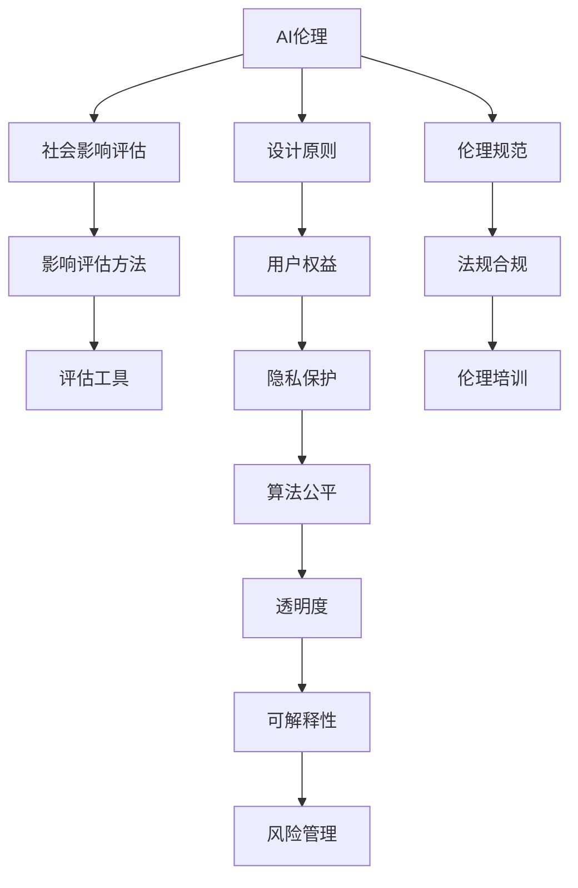

                 

# AI伦理的社会影响评估:伦理影响评估方法和工具

> 关键词：AI伦理,社会影响评估,影响评估方法,评估工具,数据驱动

## 1. 背景介绍

### 1.1 问题由来
随着人工智能(AI)技术的飞速发展，AI系统在医疗、金融、教育、交通等领域的应用日益广泛，为社会进步和经济发展带来了显著的推动力。然而，AI技术的广泛应用也伴随着一系列伦理和道德问题，如数据隐私、算法偏见、技术滥用、自动化失业等，对社会公平和公共利益构成了潜在威胁。

针对这一问题，学术界和产业界已逐渐认识到，AI系统的设计和部署必须充分考虑伦理影响，确保其符合社会价值和道德规范。伦理影响评估（Ethical Impact Assessment, EIA）成为保障AI技术健康发展的重要环节。本文将详细介绍AI伦理影响评估的核心概念、方法及工具，并提出未来研究展望，以期为业界和学界提供系统的指导。

## 2. 核心概念与联系

### 2.1 核心概念概述

在展开具体讨论之前，本节将简要介绍几个与AI伦理影响评估紧密相关的核心概念：

- **AI伦理（AI Ethics）**：涉及AI技术开发、应用和使用的伦理问题，旨在探讨AI与人类社会价值、道德规范之间的协调关系。

- **社会影响评估（Social Impact Assessment, SIA）**：通过系统性的分析和评估，了解AI系统对社会、经济、环境、健康等方面的综合影响。

- **影响评估方法（Impact Assessment Methods）**：用于识别、衡量和报告AI系统潜在影响的评估技术，包括定性分析、定量分析、混合方法等。

- **评估工具（Assessment Tools）**：辅助进行影响评估的技术工具，如问卷调查、模型仿真、数据分析平台等。

这些概念之间的联系可概括为：AI伦理影响评估是AI技术开发和应用过程中必不可少的一环，通过科学评估方法识别并衡量AI系统对社会的潜在影响，从而指导其设计和部署，确保AI技术应用与社会价值观的和谐共生。

### 2.2 核心概念原理和架构的 Mermaid 流程图



该流程图展示了AI伦理与社会影响评估、影响评估方法和评估工具之间的联系，并指出了设计原则、用户权益、隐私保护、算法公平、透明度、可解释性、风险管理、伦理规范和法规合规等关键要素。

## 3. 核心算法原理 & 具体操作步骤
### 3.1 算法原理概述

AI伦理影响评估主要涉及以下几个步骤：

1. **需求分析**：明确评估目标，确定评估范围和评估对象。
2. **影响识别**：通过多种方法和工具识别AI系统可能对社会、环境等产生的影响。
3. **影响评估**：量化和定性分析AI系统对各影响领域的具体影响程度。
4. **影响报告**：形成综合报告，包括评估结果、潜在风险和改进建议。

这一过程不仅需要跨学科的合作，还需科学、系统的评估方法与工具的支持。

### 3.2 算法步骤详解

**Step 1: 需求分析**
需求分析是伦理影响评估的起点。通过利益相关者访谈、文献回顾等方式，确定评估的具体目标、范围和对象。例如，评估对象可以是某个AI算法、系统或特定应用场景，如自动驾驶、AI辅助医疗诊断等。

**Step 2: 影响识别**
影响识别旨在全面识别AI系统可能对社会、环境、经济等各方面产生的潜在影响。可采用定性分析方法，如专家访谈、问卷调查、案例研究等，识别AI系统可能带来的正面或负面影响。例如，自动驾驶可能提高交通安全，但也可能导致失业和社会冲突。

**Step 3: 影响评估**
影响评估包括定量分析和定性分析。定量分析可采用数据分析方法，如回归分析、生存分析、成本效益分析等，量化评估结果。定性分析则采用案例研究、情境分析等，深入理解影响的具体表现。例如，在医疗诊断场景中，通过数据分析评估AI系统的准确性和可靠性。

**Step 4: 影响报告**
最终形成综合报告，总结评估结果，并提出改进建议。报告应包括评估方法、分析结果、风险评估、政策建议等。例如，针对自动驾驶的伦理影响评估报告可能包含对社会就业、交通事故、隐私保护等方面的分析，并提出相应的政策建议。

### 3.3 算法优缺点

**优点**：
1. **系统性评估**：通过科学方法全面识别和评估AI系统的潜在影响，确保全面性。
2. **多方参与**：利益相关者参与评估过程，确保评估结果的社会公平性和道德规范。
3. **风险规避**：通过评估识别潜在风险，提前采取措施，减少负面影响。

**缺点**：
1. **复杂性高**：评估涉及多学科知识和多领域影响，实施难度大。
2. **数据需求大**：需大量数据支持定量分析，数据收集和处理成本高。
3. **主观性强**：评估受评估者主观判断影响，可能导致结果偏差。

### 3.4 算法应用领域

AI伦理影响评估在多个领域都有广泛应用，包括但不限于：

- **医疗领域**：评估AI辅助诊断、个性化治疗、药物研发等系统的伦理影响，确保患者隐私和医疗公平。
- **金融领域**：评估AI在信用评估、风险管理、自动化交易等方面的伦理影响，确保金融公平和隐私保护。
- **教育领域**：评估AI辅助教学、个性化推荐等系统的伦理影响，确保教育公平和学生隐私。
- **交通领域**：评估自动驾驶、智能交通系统的伦理影响，确保交通安全和社会公平。

## 4. 数学模型和公式 & 详细讲解 & 举例说明

### 4.1 数学模型构建

AI伦理影响评估的数学模型构建通常需要结合统计学、经济学、社会学等多学科知识。以医疗AI系统的伦理影响评估为例，其数学模型可构建如下：

设 $Y$ 为评估对象对健康影响的输出变量，$X$ 为输入变量，包括医疗诊断准确率、患者隐私保护、医疗资源分配等。

评估模型可表示为：

$$Y = f(X) + \epsilon$$

其中 $f$ 为评估函数，$\epsilon$ 为随机误差项。

### 4.2 公式推导过程

以医疗AI诊断系统的影响评估为例，假设模型为线性回归模型，则其评估公式为：

$$Y = \beta_0 + \beta_1 X_1 + \beta_2 X_2 + \ldots + \beta_n X_n + \epsilon$$

其中 $\beta_0, \beta_1, \ldots, \beta_n$ 为回归系数，$X_1, X_2, \ldots, X_n$ 为影响因子。

### 4.3 案例分析与讲解

假设某医疗AI系统用于肺癌筛查，其诊断准确率 $X_1$ 为 95%，系统隐私保护措施 $X_2$ 评分为 80%。使用上述模型进行评估，可以计算出系统的健康影响 $Y$。

## 5. 项目实践：代码实例和详细解释说明

### 5.1 开发环境搭建

为实现AI伦理影响评估的代码实践，需要搭建包含多种数据处理、分析工具的开发环境。

1. **Python环境**：确保Python 3.6及以上版本，安装相关依赖库，如numpy、pandas、scikit-learn等。
2. **数据分析平台**：如Jupyter Notebook，用于交互式数据分析和代码编写。
3. **可视化工具**：如Matplotlib、Seaborn，用于数据可视化。
4. **代码版本控制**：如Git，确保代码版本管理。

### 5.2 源代码详细实现

以下是一个简单的医疗AI系统伦理影响评估代码示例：

```python
import pandas as pd
import numpy as np
import matplotlib.pyplot as plt
from sklearn.linear_model import LinearRegression

# 读取数据
data = pd.read_csv('health_data.csv')

# 数据预处理
X = data[['accuracy', 'privacy_score']]
Y = data['health_impact']

# 模型训练
model = LinearRegression()
model.fit(X, Y)

# 预测与分析
predictions = model.predict(X)

# 可视化结果
plt.scatter(X['accuracy'], predictions)
plt.xlabel('Accuracy')
plt.ylabel('Health Impact')
plt.show()
```

### 5.3 代码解读与分析

该代码示例通过线性回归模型对医疗AI系统的健康影响进行评估。

1. **数据读取**：使用Pandas读取医疗数据集。
2. **数据预处理**：选择诊断准确率和隐私保护措施作为输入变量，健康影响作为输出变量。
3. **模型训练**：使用线性回归模型进行训练。
4. **预测与分析**：对输入数据进行预测，并可视化结果。

### 5.4 运行结果展示

运行上述代码，将生成一个散点图，直观展示诊断准确率与健康影响之间的关系。

## 6. 实际应用场景

### 6.1 医疗领域

在医疗领域，AI伦理影响评估对保障患者权益、优化医疗资源分配具有重要意义。例如，AI辅助诊断系统的伦理影响评估，需重点关注算法公平性、患者隐私保护、医疗决策透明性等问题。

### 6.2 金融领域

金融领域的AI系统，如信用评估、风险管理等，需要评估算法偏见、隐私保护、金融公平等伦理问题。AI伦理影响评估有助于确保金融系统的公正性和透明性。

### 6.3 教育领域

AI在教育领域的应用，如个性化推荐系统，需评估其对学生隐私、公平性、教育质量的影响。通过伦理影响评估，可以确保AI技术在教育中的应用符合伦理规范。

### 6.4 未来应用展望

未来，AI伦理影响评估将向自动化、智能化、多学科融合的方向发展。例如，利用自然语言处理技术自动分析评估报告，结合机器学习优化评估模型，引入社会、经济、环境等多领域的影响因子。

## 7. 工具和资源推荐

### 7.1 学习资源推荐

1. **《AI伦理与社会影响评估》书籍**：全面介绍AI伦理影响评估的理论和方法，推荐阅读。
2. **Coursera《AI伦理与社会影响评估》课程**：通过在线课程学习AI伦理影响评估的基本知识和技能。
3. **IEEE AI与伦理委员会网站**：提供AI伦理影响评估的最新研究和实践案例。

### 7.2 开发工具推荐

1. **Jupyter Notebook**：用于交互式数据分析和代码编写，支持Python环境。
2. **Python数据分析库**：如Pandas、NumPy、SciPy，用于数据处理和分析。
3. **机器学习库**：如Scikit-learn、TensorFlow、PyTorch，用于构建和评估模型。

### 7.3 相关论文推荐

1. **《AI伦理影响评估框架》**：提出系统性的AI伦理影响评估框架和方法。
2. **《多学科视角下的AI伦理影响评估》**：探讨跨学科方法在AI伦理影响评估中的应用。
3. **《AI伦理影响评估工具综述》**：综述目前常用的AI伦理影响评估工具和平台。

## 8. 总结：未来发展趋势与挑战

### 8.1 研究成果总结

本文系统介绍了AI伦理影响评估的核心概念、方法及工具，并通过实际案例展示了其应用价值。AI伦理影响评估已成为保障AI技术应用社会公平和伦理规范的重要手段。

### 8.2 未来发展趋势

未来，AI伦理影响评估将向以下方向发展：

1. **自动化和智能化**：利用自动化工具和算法优化评估流程，减少人工干预。
2. **多学科融合**：结合社会学、经济学、心理学等多学科知识，提升评估全面性和准确性。
3. **数据驱动**：利用大数据和机器学习技术，提升评估的精度和泛化能力。

### 8.3 面临的挑战

尽管AI伦理影响评估在理论和方法上已取得进展，但仍面临以下挑战：

1. **数据获取难**：高质量、大规模的数据集难以获取，影响评估结果的准确性。
2. **方法局限**：现有方法难以全面评估AI系统的潜在影响，需要进一步创新。
3. **多方协作难**：涉及多学科、多利益相关者，协调难度大。

### 8.4 研究展望

未来的研究应重点关注以下方向：

1. **创新评估方法**：开发新型评估方法，如多智能体系统评估、因果推断方法等。
2. **跨学科合作**：加强不同学科的交叉合作，引入更多学科知识。
3. **政策制定**：与政策制定者合作，推动伦理影响评估在法律和政策中的运用。

## 9. 附录：常见问题与解答

**Q1: AI伦理影响评估的定义是什么？**

A: AI伦理影响评估是系统性识别和评估AI技术对社会、经济、环境等方面的潜在影响，以确保AI技术的应用符合伦理规范和社会价值。

**Q2: AI伦理影响评估的具体步骤有哪些？**

A: AI伦理影响评估通常包括以下步骤：需求分析、影响识别、影响评估、影响报告。具体流程可参考本文3.2节内容。

**Q3: 如何进行AI伦理影响评估的数据预处理？**

A: 数据预处理包括数据清洗、特征工程、数据标准化等。例如，在医疗数据中，需去除缺失值、异常值，标准化数据格式。

**Q4: 如何结合机器学习技术进行AI伦理影响评估？**

A: 可利用机器学习模型，如线性回归、决策树、神经网络等，对评估数据进行建模和分析。具体方法可参考本文4.2节内容。

**Q5: AI伦理影响评估的优点和缺点是什么？**

A: 优点包括系统性评估、多方参与、风险规避。缺点包括复杂性高、数据需求大、主观性强。具体内容可参考本文3.3节内容。

---

作者：禅与计算机程序设计艺术 / Zen and the Art of Computer Programming

