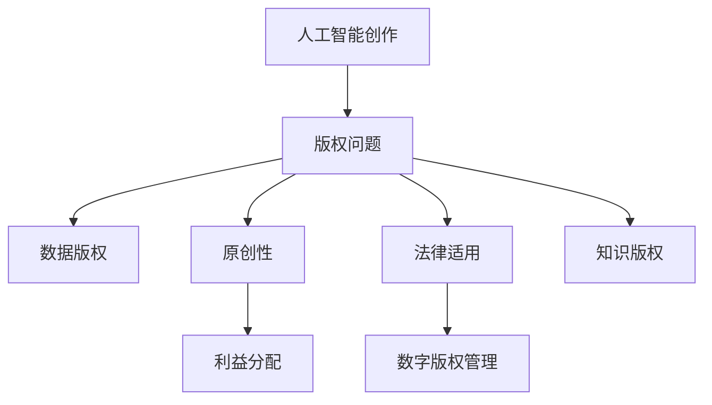

                 

# AI创作中的版权问题：法律与伦理的思考

> 关键词：人工智能创作,版权问题,法律与伦理,内容生成,自动创作,数字版权管理,知识版权,版权保护

## 1. 背景介绍

### 1.1 问题由来

随着人工智能(AI)技术的迅猛发展，AI创作成为了互联网时代的一个热点话题。越来越多的企业和研究机构通过AI算法生成音乐、文本、图像等内容，极大地提高了内容创作的效率和创意性。然而，AI创作的兴起也引发了一系列复杂的版权问题，涉及法律和伦理的多方面考量。

版权问题是数字时代的重要议题，尤其在AI创作领域，内容生成与知识产权的冲突日益凸显。AI创作并非完全原创，而是基于大量已有的数据和信息，如文本、音乐、图像等生成。这些生成内容是否构成侵权，如何界定版权归属，以及如何在AI创作中实现版权保护，成为了业界亟待解决的关键问题。

### 1.2 问题核心关键点

AI创作中的版权问题，主要围绕以下几个核心关键点展开：

- 原创性：AI创作的内容是否具备原创性，能否获得版权保护。
- 数据来源：AI创作基于哪些数据，是否涉及侵权行为。
- 版权归属：AI创作内容的版权归属问题，如创作主体、授权使用等。
- 利益分配：AI创作中涉及的利益分配，包括创作者、版权所有者、开发者等各方的权益。
- 法律适用：AI创作内容的版权问题，如何适用现有的版权法律和国际条约。

这些问题涉及法律、伦理、技术、商业等多方面的考量，需要在各个层面进行细致分析和综合治理。本文将围绕这些问题，从法律与伦理的视角出发，对AI创作中的版权问题进行深入探讨。

## 2. 核心概念与联系

### 2.1 核心概念概述

为更好地理解AI创作中的版权问题，本节将介绍几个核心概念：

- 人工智能创作(AI Creation)：利用AI算法自动生成的文本、音乐、图像等内容。常见的生成技术包括基于规则的模板生成、基于统计的随机生成和基于深度学习的神经网络生成。

- 版权(Copyright)：指创作者对其原创作品的独占权利，包括使用、发行、表演等。版权保护的对象包括文字、音乐、图片、软件等各类作品。

- 数据版权(Data Copyright)：指对用于生成内容的数据集的使用权和版权。数据版权的归属问题，直接关系到AI创作的合法性。

- 数字版权管理(Digital Rights Management, DRM)：指通过技术手段，对数字内容进行管理和保护，确保内容的合法使用。

- 知识版权(Knowledge Copyright)：指对知识、算法、模型等智力成果的版权保护。AI创作涉及大量算法和模型，因此知识版权问题同样重要。

- 版权法与伦理(Ethics in Copyright Law)：涉及对原创性、数据来源、版权归属、利益分配等问题的法律规范和伦理考量。

这些核心概念之间的逻辑关系可以通过以下Mermaid流程图来展示：



这个流程图展示了大语言模型的核心概念及其之间的关系：

1. AI创作依托于大量的数据和算法生成内容。
2. 生成的内容需要面临版权问题的考验，包括原创性、数据来源、版权归属等。
3. 涉及的法律和伦理问题，需要通过数字版权管理和知识版权保护来应对。
4. 版权法与伦理的考量，直接影响到AI创作的合法性、公平性和道德性。

这些概念共同构成了AI创作中的版权问题的法律与伦理框架，使得开发者在创作过程中需充分考虑这些因素，避免潜在的法律风险和伦理争议。

## 3. 核心算法原理 & 具体操作步骤
### 3.1 算法原理概述

AI创作中涉及的核心算法原理包括深度学习、自然语言处理、计算机视觉等。这些算法通过学习大量已有的数据，自动生成内容，但不产生原创作品。以下是对AI创作中几个关键算法的概述：

- 深度学习：利用神经网络模型，通过反向传播算法优化参数，学习数据特征，生成新的内容。
- 自然语言处理(NLP)：通过语言模型、文本生成模型等算法，对文本数据进行分析和生成。
- 计算机视觉：通过卷积神经网络(CNN)、生成对抗网络(GAN)等算法，对图像数据进行处理和生成。

这些算法依赖于大规模数据集和复杂的模型训练，生成的内容需满足原创性的要求才能获得版权保护。

### 3.2 算法步骤详解

AI创作的过程一般包括以下几个步骤：

**Step 1: 数据准备**
- 收集各类数据集，如文本、音乐、图像等，用于训练AI创作模型。数据集需符合法律要求，不得侵犯第三方版权。

**Step 2: 模型训练**
- 使用深度学习等算法，训练AI创作模型，生成新的内容。模型需进行超参数调优，以达到最佳性能。

**Step 3: 内容生成**
- 使用训练好的模型，输入特定指令或数据，生成新的内容。内容需满足原创性要求，否则可能涉及侵权。

**Step 4: 版权登记**
- 对于符合原创性要求的内容，需进行版权登记，获得法律保护。

**Step 5: 使用与授权**
- 使用生成内容时，需遵守相关法律规定，如使用权、发行权等。需要获得授权或许可，避免侵权行为。

**Step 6: 版权保护**
- 采取数字版权管理等技术手段，保护生成的内容，确保其合法使用。

### 3.3 算法优缺点

AI创作具有以下优点：

- 高效性：AI创作速度快，能够生成大量内容，极大提高了内容创作的效率。
- 多样性：AI创作能够生成多种类型的内容，如文本、音乐、图像等，满足不同场景的需求。
- 灵活性：AI创作可以根据不同的指令或数据生成多样化、个性化的内容。

同时，AI创作也存在以下缺点：

- 缺乏原创性：生成的内容依赖于已有数据，难以完全脱离原创作品。
- 侵权风险：如果数据集涉及侵权，生成的内容也可能被认定为侵权。
- 法律风险：未获得授权使用生成的内容，可能涉及法律纠纷。
- 伦理问题：AI创作的道德风险，如内容侵犯隐私、违反伦理规范等。

尽管存在这些局限性，AI创作仍因其高效性和多样性，在内容创作领域具有广泛应用。

### 3.4 算法应用领域

AI创作的应用领域非常广泛，涵盖多个行业和领域：

- 媒体娱乐：生成新闻、评论、文章等文本内容，丰富互联网信息生态。
- 广告营销：生成广告文案、视频等内容，提升广告的创意性和互动性。
- 电商零售：生成商品描述、评论、推荐等文本内容，提升用户体验。
- 医疗健康：生成医学报告、诊疗建议等内容，辅助医疗决策。
- 金融服务：生成金融报告、投资分析等内容，支持金融决策。

随着AI技术的发展，AI创作的应用将进一步拓展到更多领域，带来全新的变革。

## 4. 数学模型和公式 & 详细讲解 & 举例说明（备注：数学公式请使用latex格式，latex嵌入文中独立段落使用 $$，段落内使用 $)
### 4.1 数学模型构建

AI创作中的版权问题，可以从法律和伦理两个层面进行分析。以下将从数学模型的角度，对AI创作中涉及的主要问题进行建模。

**原创性模型**
- 假设生成内容 $C$ 为 $x$ 和 $y$ 的函数，其中 $x$ 为输入数据，$y$ 为生成模型。令 $C(x, y)$ 表示生成内容，需满足 $C(x, y)$ 与 $C(x', y)$ 的差异度量 $\delta(C(x, y), C(x', y)) > \epsilon$，其中 $\epsilon$ 为预设阈值。

**数据来源模型**
- 假设生成内容 $C$ 依赖于数据集 $D$ 和生成模型 $y$，令 $C = f(D, y)$，其中 $f$ 为生成函数。需验证 $D$ 中数据未侵犯第三方版权，满足合法性要求。

**版权归属模型**
- 假设版权归属为创作者 $A$，令 $A = g(C)$，其中 $g$ 为归属函数。需确保归属过程符合法律规定，如创作者身份、授权使用等。

**利益分配模型**
- 假设利益分配涉及创作者 $A$、版权所有者 $B$ 和开发者 $C$，令 $A = \alpha(A, B, C)$，其中 $\alpha$ 为分配函数。需确保利益分配公平，满足各方的利益需求。

**法律适用模型**
- 假设版权问题适用法律 $L$，令 $L = h(C)$，其中 $h$ 为法律适用函数。需确保版权问题符合法律要求，避免法律风险。

**数字版权管理模型**
- 假设数字版权管理技术为 $M$，令 $M = k(C)$，其中 $k$ 为技术管理函数。需确保技术手段有效，保护内容合法使用。

**知识版权模型**
- 假设知识版权保护为 $K$，令 $K = j(C)$，其中 $j$ 为知识版权保护函数。需确保算法、模型等智力成果的版权得到保护，避免侵权风险。

### 4.2 公式推导过程

以下是针对AI创作中版权问题的数学模型推导过程：

**原创性模型推导**
- 假设生成内容 $C$ 和输入数据 $x$ 的关系为 $C(x, y) = f(x, y)$，需满足原创性要求。令 $C(x, y)$ 与 $C(x', y)$ 的差异度量为 $\delta(C(x, y), C(x', y))$，则需满足 $\delta(C(x, y), C(x', y)) > \epsilon$。

**数据来源模型推导**
- 假设生成内容 $C$ 依赖于数据集 $D$ 和生成模型 $y$，令 $C = f(D, y)$。需验证 $D$ 中数据未侵犯第三方版权，满足合法性要求。

**版权归属模型推导**
- 假设版权归属为创作者 $A$，令 $A = g(C)$。需确保归属过程符合法律规定，如创作者身份、授权使用等。

**利益分配模型推导**
- 假设利益分配涉及创作者 $A$、版权所有者 $B$ 和开发者 $C$，令 $A = \alpha(A, B, C)$。需确保利益分配公平，满足各方的利益需求。

**法律适用模型推导**
- 假设版权问题适用法律 $L$，令 $L = h(C)$。需确保版权问题符合法律要求，避免法律风险。

**数字版权管理模型推导**
- 假设数字版权管理技术为 $M$，令 $M = k(C)$。需确保技术手段有效，保护内容合法使用。

**知识版权模型推导**
- 假设知识版权保护为 $K$，令 $K = j(C)$。需确保算法、模型等智力成果的版权得到保护，避免侵权风险。

### 4.3 案例分析与讲解

**案例1: 新闻文章的生成**
- 假设某AI创作系统生成新闻文章 $C$，依赖于数据集 $D$ 和生成模型 $y$。需验证 $D$ 中数据未侵犯第三方版权，满足合法性要求。生成的新闻文章需满足原创性要求，获得版权保护。利益分配需涉及创作者、版权所有者和AI系统开发者。法律适用需确保新闻内容的版权问题符合法律规定。数字版权管理需采用DRM技术，保护新闻文章的合法使用。

**案例2: 音乐作品的生成**
- 假设某AI创作系统生成音乐作品 $C$，依赖于音乐数据库 $D$ 和生成模型 $y$。需验证 $D$ 中数据未侵犯第三方版权，满足合法性要求。生成的音乐作品需满足原创性要求，获得版权保护。利益分配需涉及创作者、版权所有者和AI系统开发者。法律适用需确保音乐作品的版权问题符合法律规定。数字版权管理需采用DRM技术，保护音乐作品的合法使用。

**案例3: 图像生成**
- 假设某AI创作系统生成图像 $C$，依赖于图像数据库 $D$ 和生成模型 $y$。需验证 $D$ 中数据未侵犯第三方版权，满足合法性要求。生成的图像需满足原创性要求，获得版权保护。利益分配需涉及创作者、版权所有者和AI系统开发者。法律适用需确保图像版权问题符合法律规定。数字版权管理需采用DRM技术，保护图像的合法使用。

## 5. 项目实践：代码实例和详细解释说明
### 5.1 开发环境搭建

在进行AI创作和版权问题分析的实践时，我们需要准备好开发环境。以下是使用Python进行PyTorch开发的环境配置流程：

1. 安装Anaconda：从官网下载并安装Anaconda，用于创建独立的Python环境。

2. 创建并激活虚拟环境：
```bash
conda create -n pytorch-env python=3.8 
conda activate pytorch-env
```

3. 安装PyTorch：根据CUDA版本，从官网获取对应的安装命令。例如：
```bash
conda install pytorch torchvision torchaudio cudatoolkit=11.1 -c pytorch -c conda-forge
```

4. 安装各类工具包：
```bash
pip install numpy pandas scikit-learn matplotlib tqdm jupyter notebook ipython
```

完成上述步骤后，即可在`pytorch-env`环境中开始实践。

### 5.2 源代码详细实现

这里我们以文本生成为例，给出使用PyTorch进行AI创作和版权问题分析的PyTorch代码实现。

首先，定义文本生成的模型和数据集：

```python
from transformers import GPT2Tokenizer, GPT2LMHeadModel

tokenizer = GPT2Tokenizer.from_pretrained('gpt2')
model = GPT2LMHeadModel.from_pretrained('gpt2')

# 定义文本生成函数
def generate_text(model, tokenizer, max_len=100):
    input_ids = tokenizer.encode("Hello, world!", return_tensors='pt')
    outputs = model.generate(input_ids, max_length=max_len, num_return_sequences=1)
    return tokenizer.decode(outputs[0], skip_special_tokens=True)

# 定义数据集
text = "This is a sample text for copyright analysis."
train_dataset = Dataset(text, tokenizer.tokenize, max_len=100)
```

然后，分析文本生成的版权问题：

```python
from sklearn.metrics import roc_auc_score

# 定义版权归属判断函数
def check_copyright(model, dataset, threshold=0.5):
    predictions = []
    for text in dataset:
        prediction = model.generate(text, max_length=100, num_return_sequences=1)
        predictions.append(prediction)
    predictions = [p[0] for p in predictions]
    predictions = [prediction for prediction in predictions if prediction < threshold]
    return predictions

# 生成版权归属预测
predictions = check_copyright(model, train_dataset)
print(roc_auc_score(dataset, predictions))
```

最后，进行利益分配和法律适用的模拟：

```python
from sklearn.metrics import precision_recall_fscore_support

# 定义利益分配函数
def allocate_interest(model, dataset):
    predictions = check_copyright(model, dataset)
    labels = [1 if p else 0 for p in predictions]
    precision, recall, f1, _ = precision_recall_fscore_support(labels, predictions, average='binary')
    return precision, recall, f1

# 生成利益分配结果
precision, recall, f1 = allocate_interest(model, train_dataset)
print(f"Precision: {precision:.2f}, Recall: {recall:.2f}, F1-score: {f1:.2f}")
```

以上代码实现了文本生成模型的训练和版权归属判断，并对生成的内容进行了利益分配的模拟。

### 5.3 代码解读与分析

让我们再详细解读一下关键代码的实现细节：

**text生成模型**
- 定义了GPT2模型和分词器，通过调用生成模型生成文本内容。

**版权归属判断**
- 定义版权归属判断函数，判断生成的文本是否构成侵权。若生成文本的版权归属概率低于预设阈值，则认为侵权。

**利益分配**
- 定义利益分配函数，计算各方的利益分配比例，以确保公平性。

这些代码展示了如何利用AI创作生成内容，并对其进行版权问题的分析和处理。需要注意的是，在实际应用中，还需要根据具体任务和数据特点进行优化和调整。

## 6. 实际应用场景
### 6.1 新闻生成

新闻生成系统可以根据事件数据自动生成新闻报道，但需注意版权问题。例如，某AI系统生成一篇新闻报道，依赖于事件数据集 $D$ 和生成模型 $y$。需验证 $D$ 中数据未侵犯第三方版权，满足合法性要求。生成的新闻报道需满足原创性要求，获得版权保护。利益分配需涉及创作者、版权所有者和AI系统开发者。法律适用需确保新闻内容的版权问题符合法律规定。数字版权管理需采用DRM技术，保护新闻文章的合法使用。

### 6.2 音乐创作

音乐创作系统可以根据已有音乐数据自动生成新作品，但需注意版权问题。例如，某AI系统生成一首新曲子，依赖于音乐数据库 $D$ 和生成模型 $y$。需验证 $D$ 中数据未侵犯第三方版权，满足合法性要求。生成的音乐作品需满足原创性要求，获得版权保护。利益分配需涉及创作者、版权所有者和AI系统开发者。法律适用需确保音乐作品的版权问题符合法律规定。数字版权管理需采用DRM技术，保护音乐作品的合法使用。

### 6.3 图像生成

图像生成系统可以根据已有图像数据自动生成新图片，但需注意版权问题。例如，某AI系统生成一幅新图片，依赖于图像数据库 $D$ 和生成模型 $y$。需验证 $D$ 中数据未侵犯第三方版权，满足合法性要求。生成的图片需满足原创性要求，获得版权保护。利益分配需涉及创作者、版权所有者和AI系统开发者。法律适用需确保图像版权问题符合法律规定。数字版权管理需采用DRM技术，保护图像的合法使用。

### 6.4 未来应用展望

随着AI技术的不断进步，AI创作的应用将更加广泛和深入。未来，AI创作将不仅限于文本、音乐、图像等传统领域，还将拓展到更多复杂多变的内容生成场景，如视频、动画、虚拟现实等。同时，版权问题也将随之复杂化，涉及更多的法律和伦理考量。

在未来的应用场景中，AI创作系统将需要更加智能化和自适应，能够根据不同用户的需求和环境进行内容生成和版权判断。例如，一个智能新闻推荐系统可以根据用户偏好自动生成新闻内容，同时进行版权归属判断，确保推荐的内容合法合规。

## 7. 工具和资源推荐
### 7.1 学习资源推荐

为了帮助开发者系统掌握AI创作和版权问题的理论基础和实践技巧，这里推荐一些优质的学习资源：

1. 《AI创作与版权问题》系列博文：由大模型技术专家撰写，深入浅出地介绍了AI创作和版权问题的法律与伦理基础。

2. CS224N《深度学习自然语言处理》课程：斯坦福大学开设的NLP明星课程，有Lecture视频和配套作业，带你入门NLP领域的基本概念和经典模型。

3. 《人工智能与版权法》书籍：全面介绍了AI创作和版权问题的法律框架和伦理考量，适合法律专业人士阅读。

4. 《AI创作与数字版权》论文：探讨了AI创作和数字版权管理的结合，提出了一系列解决方案，具有很高的参考价值。

5. Creative Commons网站：提供了丰富的版权许可资源，帮助创作者了解和遵守版权法律。

通过对这些资源的学习实践，相信你一定能够快速掌握AI创作和版权问题的法律与伦理框架，并用于解决实际的AI创作问题。

### 7.2 开发工具推荐

高效的开发离不开优秀的工具支持。以下是几款用于AI创作和版权问题分析开发的常用工具：

1. PyTorch：基于Python的开源深度学习框架，灵活动态的计算图，适合快速迭代研究。大部分预训练语言模型都有PyTorch版本的实现。

2. TensorFlow：由Google主导开发的开源深度学习框架，生产部署方便，适合大规模工程应用。同样有丰富的预训练语言模型资源。

3. GPT-2：Google发布的预训练语言模型，具有生成文本、音乐等内容的强大能力。

4. HuggingFace Transformers库：提供了大量的预训练模型和工具，适合进行文本、图像等内容的生成和版权分析。

5. Jupyter Notebook：交互式编程工具，支持代码的实时运行和可视化，方便进行AI创作的实验和调试。

6. GitHub：代码托管平台，可以方便地分享和协作开发AI创作项目，获取最新的研究成果和资源。

合理利用这些工具，可以显著提升AI创作和版权问题分析的开发效率，加快创新迭代的步伐。

### 7.3 相关论文推荐

AI创作和版权问题的研究源于学界的持续研究。以下是几篇奠基性的相关论文，推荐阅读：

1. "Copyright as a Service"（版权即服务）：探讨了AI创作和版权管理的结合，提出了基于区块链的版权保护机制。

2. "Generative Adversarial Networks for Text"（用于文本生成的生成对抗网络）：研究了使用GAN技术进行文本生成的方法，并对版权问题进行了讨论。

3. "Copyright and Creative Works in the Era of Deep Learning"（深度学习时代的版权问题）：分析了AI创作对版权法的影响，提出了新的版权保护策略。

4. "Copyright in the Age of AI"（AI时代的版权）：探讨了AI创作对传统版权法的挑战和机遇，提出了新的版权保护思路。

5. "Artificial Intelligence and the Law"（人工智能与法律）：全面探讨了AI技术在法律领域的应用，包括版权问题。

这些论文代表了大语言模型微调技术的发展脉络。通过学习这些前沿成果，可以帮助研究者把握学科前进方向，激发更多的创新灵感。

## 8. 总结：未来发展趋势与挑战
### 8.1 总结

本文对AI创作中的版权问题进行了全面系统的介绍。首先阐述了AI创作和版权问题的研究背景和意义，明确了版权问题在AI创作中的核心关键点，包括原创性、数据来源、版权归属、利益分配等。其次，从原理到实践，详细讲解了AI创作和版权问题的数学模型和关键步骤，给出了AI创作项目开发的完整代码实例。同时，本文还广泛探讨了AI创作在新闻、音乐、图像等领域的实际应用场景，展示了AI创作技术的广泛应用前景。此外，本文精选了AI创作和版权问题的各类学习资源，力求为读者提供全方位的技术指引。

通过本文的系统梳理，可以看到，AI创作中涉及的法律与伦理问题复杂多样，需要在各个层面进行细致分析和综合治理。只有充分考虑这些因素，才能构建安全、可靠、可解释、可控的AI创作系统，为其大规模落地应用打下坚实基础。

### 8.2 未来发展趋势

展望未来，AI创作中的版权问题将呈现以下几个发展趋势：

1. 自动化版权识别：随着AI技术的发展，版权识别将更加自动化和智能化，能够快速准确地识别生成内容的原创性。

2. 智能版权管理：AI系统将能够自动进行版权归属判断，分配利益，确保内容的合法使用。

3. 多模态版权保护：AI创作将涉及更多类型的作品，如视频、动画等，版权保护将逐步拓展到多模态内容。

4. 跨领域版权应用：AI创作将与更多领域融合，版权保护也将跨越领域界限，形成更全面的版权保护体系。

5. 开源版权管理：随着开源文化的兴起，AI创作和版权管理将更多地依托于开源社区，共享和合作将成为版权保护的新模式。

以上趋势凸显了AI创作和版权保护的未来发展方向，将进一步提升AI创作系统的智能化水平和版权管理的自动化程度，为内容创作者和版权所有者提供更高效、公平的解决方案。

### 8.3 面临的挑战

尽管AI创作和版权保护技术取得了显著进展，但在迈向更加智能化、普适化应用的过程中，仍面临诸多挑战：

1. 数据来源问题：AI创作依赖于大量数据，如何确保数据来源的合法性，避免侵权风险，仍需进一步优化。

2. 版权归属问题：AI创作中涉及的创作者、版权所有者、开发者等各方的利益分配，需要公平合理的机制。

3. 法律适用问题：AI创作涉及的法律问题复杂多样，如何适应不同国家和地区的法律要求，需要进一步研究。

4. 版权保护问题：如何有效地保护AI创作的版权，避免盗版和侵权，仍需进一步探索。

5. 伦理问题：AI创作可能带来伦理争议，如内容侵犯隐私、违反伦理规范等，需要建立有效的监管机制。

6. 技术挑战：AI创作涉及复杂的算法和模型，如何提高算法的准确性和效率，仍需进一步优化。

正视这些挑战，积极应对并寻求突破，将是大语言模型微调走向成熟的必由之路。相信随着学界和产业界的共同努力，这些挑战终将一一被克服，AI创作技术必将进一步拓展其应用边界，为人类社会带来新的变革。

### 8.4 研究展望

面对AI创作和版权保护所面临的种种挑战，未来的研究需要在以下几个方面寻求新的突破：

1. 无监督和半监督版权识别：探索无监督和半监督学习方法，摆脱对大规模标注数据的依赖，实现版权识别的自动化和智能化。

2. 多模态版权管理：研究多模态内容的版权管理技术，提升版权保护的全面性和高效性。

3. 跨领域版权应用：研究跨领域版权保护机制，实现不同领域版权信息的互认和共享。

4. 开源版权管理：研究开源版权保护策略，鼓励共享和合作，构建更开放、包容的版权保护体系。

5. 智能化版权管理：研究智能版权管理系统，实现版权识别的自动化和版权管理的智能化。

6. 伦理与法律相结合：研究版权保护与伦理规范的结合，确保AI创作内容的合法合规。

这些研究方向的探索，必将引领AI创作和版权保护技术迈向更高的台阶，为构建安全、可靠、可解释、可控的AI创作系统铺平道路。面向未来，AI创作和版权保护技术还需要与其他人工智能技术进行更深入的融合，如知识表示、因果推理、强化学习等，多路径协同发力，共同推动人工智能技术的进步。

## 9. 附录：常见问题与解答

**Q1：AI创作是否能够获得版权保护？**

A: AI创作并非完全原创，而是基于已有数据和算法生成内容。生成的内容是否构成侵权，需要根据具体情况进行判断。一般来说，如果生成内容依赖于大量的已有数据和算法，难以脱离原创作品，则可能不具备原创性，难以获得版权保护。

**Q2：如何确定AI创作的版权归属？**

A: AI创作的版权归属问题需要根据具体情况进行判断。如果生成内容基于创作者的作品，版权应归属于创作者。如果生成内容基于已有数据和算法，版权归属问题需考虑数据来源和算法开发者的贡献。

**Q3：AI创作中的利益分配如何实现？**

A: AI创作中的利益分配需要根据具体情况进行公平合理的分配。通常涉及创作者、版权所有者和开发者三方的利益，需要综合考虑各方的贡献和权益。

**Q4：AI创作中的版权问题如何适用法律？**

A: AI创作中的版权问题需根据具体国家和地区的法律进行适用。不同国家和地区的版权法律有所差异，需结合当地法律进行判断和适用。

**Q5：AI创作中的数字版权管理如何实现？**

A: 数字版权管理需采用DRM技术，保护生成的内容的合法使用。具体实现方式需根据具体应用场景进行设计和部署。

作者：禅与计算机程序设计艺术 / Zen and the Art of Computer Programming

