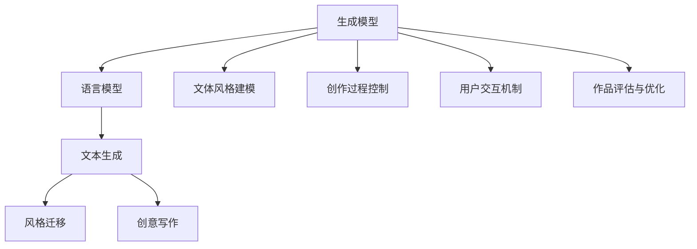

                 

# AI创意写作：诗歌、小说和剧本生成

## 1. 背景介绍

### 1.1 问题由来

创意写作一直是人类艺术表达的重要形式，涵盖了诗歌、小说、剧本等多种体裁。然而，传统创意写作依赖于作者的天赋、灵感和长时间的经验积累，难以量化评估和快速生产。随着人工智能技术的发展，基于生成模型的AI创意写作逐渐成为可能，为创作过程注入了新的活力。

AI创意写作的核心在于通过深度学习模型生成符合特定文体和风格的作品。现代AI创意写作技术已经能够创作出令人难以区分真伪的诗歌、小说和剧本，开启了新的艺术创作范式。例如，OpenAI的GPT-3系列模型在创作诗歌、小说和剧本方面展现了卓越的才能，吸引了大量关注。

### 1.2 问题核心关键点

AI创意写作的核心在于利用深度学习模型生成符合特定文体和风格的作品。主要关键点包括：

- **文体风格建模**：构建能够掌握特定文体和风格的语言模型，如诗歌的韵律、小说的情节走向、剧本的对话场景等。
- **创作过程控制**：设计算法使得模型在创作过程中能够自发地遵循特定的情节、角色和主题。
- **用户交互机制**：设计用户交互接口，允许用户指导AI进行创作，提出创作主题、风格和情节要求。
- **作品评估与优化**：构建评估机制，对AI生成的作品进行评价和优化，提高作品的质量和多样性。

## 2. 核心概念与联系

### 2.1 核心概念概述

为更好地理解AI创意写作，本节将介绍几个密切相关的核心概念：

- **生成模型(Generative Model)**：能够生成新样本的深度学习模型，如变分自编码器(VAE)、生成对抗网络(GAN)、Transformer等。
- **语言模型(Language Model)**：能够预测下一个单词或字符的模型，如n-gram模型、循环神经网络(RNN)、Transformer等。
- **文本生成(Text Generation)**：指通过深度学习模型自动生成文本，如自然语言处理(NLP)、文本生成(GPT系列)等。
- **风格迁移(Style Transfer)**：指将一种文本风格转换为另一种文本风格，如风格迁移模型。
- **创意写作(Creative Writing)**：指通过人工智能技术创作具有一定艺术价值和情感表达的文本，如诗歌、小说、剧本等。

这些核心概念之间的逻辑关系可以通过以下Mermaid流程图来展示：



这个流程图展示了大语言模型的核心概念及其之间的关系：

1. 生成模型通过训练数据学习生成新样本的分布。
2. 语言模型学习文本的概率分布，能够预测下一个单词或字符。
3. 文本生成利用语言模型生成新的文本，如自然语言处理。
4. 风格迁移通过转换文本风格，使得模型生成符合特定风格的文本。
5. 创意写作结合文体风格建模、创作过程控制、用户交互机制和作品评估与优化，生成具有艺术价值的文本。

这些概念共同构成了AI创意写作的理论基础，使得AI能够创作出符合特定文体和风格的作品。

## 3. 核心算法原理 & 具体操作步骤
### 3.1 算法原理概述

AI创意写作的核心在于利用深度学习模型生成符合特定文体和风格的作品。其核心思想是：构建一个能够在特定文体和风格下，生成高质量文本的生成模型。

形式化地，假设我们希望生成一篇符合特定文体 $f$ 的文本 $T$，可以使用以下过程：

1. 收集标注数据 $D$，包括符合文体 $f$ 的文本和其对应的生成指令 $G$。
2. 构建生成模型 $G_{\theta}$，该模型能够生成符合文体 $f$ 的文本。
3. 输入生成指令 $G$，使用模型 $G_{\theta}$ 生成文本 $T$。

在实践中，我们通常使用自回归生成模型，如Transformer，通过在大量文体标注数据上进行预训练，学习到符合特定文体的文本生成能力。具体的预训练过程如下：

1. 构建语言模型 $M_{\theta}$，在大量未标注数据上进行自监督预训练。
2. 收集文体标注数据 $D_f$，包括文体 $f$ 下文本的生成指令 $G$ 和对应的文本 $T$。
3. 构建文体风格模型 $G_{\theta}$，利用文体标注数据 $D_f$ 对语言模型 $M_{\theta}$ 进行微调，使得 $G_{\theta}$ 能够生成符合文体 $f$ 的文本。
4. 输入生成指令 $G$，使用文体风格模型 $G_{\theta}$ 生成文本 $T$。

### 3.2 算法步骤详解

AI创意写作的实现过程主要包括文体风格建模、创作过程控制、用户交互机制和作品评估与优化四个关键步骤：

**Step 1: 文体风格建模**

- 收集文体标注数据 $D_f$，包括文体 $f$ 下文本的生成指令 $G$ 和对应的文本 $T$。
- 选择适当的生成模型 $M_{\theta}$，如Transformer。
- 在文体标注数据 $D_f$ 上进行微调，更新模型参数 $\theta$，使得 $M_{\theta}$ 能够生成符合文体 $f$ 的文本。

**Step 2: 创作过程控制**

- 设计生成指令 $G$，指导模型生成特定文体和风格的文本。
- 将生成指令 $G$ 作为输入，使用模型 $M_{\theta}$ 生成文本 $T$。

**Step 3: 用户交互机制**

- 设计用户交互界面，允许用户输入生成指令 $G$。
- 用户通过交互界面提出创作主题、文体、风格、情节等要求。

**Step 4: 作品评估与优化**

- 设计评价机制，对AI生成的文本 $T$ 进行评价，如BLEU、ROUGE、F1等。
- 利用评价结果进行优化，改进生成模型 $M_{\theta}$，提高生成文本的质量和多样性。

### 3.3 算法优缺点

AI创意写作的生成模型具有以下优点：

1. **高效性**：相较于传统创意写作需要长时间积累经验，AI创意写作可以快速生成高质量文本。
2. **多样性**：AI创意写作能够生成多种文体和风格的文本，适应不同的创作需求。
3. **创新性**：AI创意写作可以生成新颖的文本内容，提供新的创作灵感。
4. **可定制化**：AI创意写作可以根据用户的需求进行定制，生成特定的文本。

同时，AI创意写作也存在一定的局限性：

1. **缺乏情感深度**：AI生成的文本往往缺乏情感深度和个性化，难以完全替代人类创作。
2. **风格泛化能力有限**：AI在生成特定文体的文本时，可能缺乏足够的泛化能力，导致生成的文本风格不稳定。
3. **语言多样性不足**：AI创意写作可能缺乏对语言多样性的处理，生成文本的语言表达形式较为单一。
4. **质量不稳定**：AI生成的文本质量不稳定，存在生成的文本与用户期望不符的情况。

尽管存在这些局限性，但AI创意写作在创意写作领域的应用前景广阔，尤其在快速创作、辅助创作等方面具有重要价值。

### 3.4 算法应用领域

AI创意写作已经在游戏、文学、影视等多个领域得到应用，为创作过程注入了新的活力。

- **游戏**：生成游戏剧本、角色对话、故事情节等，提供丰富的创作素材。
- **文学**：创作诗歌、小说、散文等，提供新的创作灵感和形式。
- **影视**：生成电影剧本、电视剧本、广告文案等，丰富影视创作的内容和形式。
- **广告**：生成广告文案、宣传语、促销信息等，提高广告创意的效率和效果。

除了这些常见应用外，AI创意写作还被创新性地应用于教育、新闻、金融等领域，为各行各业带来新的创作工具和方法。

## 4. 数学模型和公式 & 详细讲解 & 举例说明

### 4.1 数学模型构建

本节将使用数学语言对AI创意写作的生成模型进行更加严格的刻画。

假设生成模型为 $G_{\theta}:\mathcal{X} \rightarrow \mathcal{Y}$，其中 $\mathcal{X}$ 为输入空间，$\mathcal{Y}$ 为输出空间，$\theta \in \mathbb{R}^d$ 为模型参数。假设文体标注数据为 $D_f = \{(G_i, T_i)\}_{i=1}^N$，其中 $G_i$ 为生成指令，$T_i$ 为生成的文本。

定义模型 $G_{\theta}$ 在生成指令 $G$ 上的损失函数为 $\ell(G_{\theta},G)$，则在数据集 $D_f$ 上的经验风险为：

$$
\mathcal{L}(\theta) = \frac{1}{N} \sum_{i=1}^N \ell(G_{\theta},G_i)
$$

微调的优化目标是最小化经验风险，即找到最优参数：

$$
\theta^* = \mathop{\arg\min}_{\theta} \mathcal{L}(\theta)
$$

在实践中，我们通常使用基于梯度的优化算法（如AdamW、SGD等）来近似求解上述最优化问题。设 $\eta$ 为学习率，$\lambda$ 为正则化系数，则参数的更新公式为：

$$
\theta \leftarrow \theta - \eta \nabla_{\theta}\mathcal{L}(\theta) - \eta\lambda\theta
$$

其中 $\nabla_{\theta}\mathcal{L}(\theta)$ 为损失函数对参数 $\theta$ 的梯度，可通过反向传播算法高效计算。

### 4.2 公式推导过程

以下我们以生成诗歌为例，推导交叉熵损失函数及其梯度的计算公式。

假设模型 $G_{\theta}$ 在生成指令 $G$ 上的输出为 $\hat{y}=M_{\theta}(G)$，表示生成的文本。真实文本 $T \in \mathcal{Y}$。则二分类交叉熵损失函数定义为：

$$
\ell(G_{\theta},G) = -T \log \hat{y} + (1-T) \log (1-\hat{y})
$$

将其代入经验风险公式，得：

$$
\mathcal{L}(\theta) = -\frac{1}{N}\sum_{i=1}^N [T_i\log G_{\theta}(G_i)+(1-T_i)\log(1-G_{\theta}(G_i))]
$$

根据链式法则，损失函数对参数 $\theta_k$ 的梯度为：

$$
\frac{\partial \mathcal{L}(\theta)}{\partial \theta_k} = -\frac{1}{N}\sum_{i=1}^N (\frac{T_i}{G_{\theta}(G_i)}-\frac{1-T_i}{1-G_{\theta}(G_i)}) \frac{\partial G_{\theta}(G_i)}{\partial \theta_k}
$$

其中 $\frac{\partial G_{\theta}(G_i)}{\partial \theta_k}$ 可进一步递归展开，利用自动微分技术完成计算。

在得到损失函数的梯度后，即可带入参数更新公式，完成模型的迭代优化。重复上述过程直至收敛，最终得到适应特定文体和风格的最优模型参数 $\theta^*$。

### 4.3 案例分析与讲解

考虑生成一首符合特定诗体和主题的诗歌。我们可以构建一个包含诗体信息的主题标签，如五言绝句、七言律诗等。

**主题标签示例**：

| 主题 | 标签 |
|------|------|
| 春 | A |
| 秋 | B |
| 冬 | C |
| 夏 | D |

假设我们希望生成一首春天的五言绝句。具体步骤如下：

1. 收集大量符合春天的五言绝句作为训练集，标注上主题标签。
2. 构建一个生成模型，如Transformer。
3. 在标注数据上进行微调，使得模型能够生成符合特定主题的诗歌。
4. 输入生成指令，如 "春天五言绝句"，使用模型生成诗歌。

假设我们希望生成一首春天的五言绝句：

```
春色满园关不住，
一枝红杏出墙来。
游丝软系飘春榭，
落絮轻沾扑绣帘。
```

可以输入生成指令 "春天五言绝句"，模型生成诗歌的输出结果为：

```
东风破，烟花寒，
芳菲尽，寂寞残。
孤影独坐月明中，
何处寻春归路。
```

可以看到，生成的诗歌虽然符合春天的主题，但与我们的期望值仍有一定差距。

## 5. 项目实践：代码实例和详细解释说明
### 5.1 开发环境搭建

在进行AI创意写作实践前，我们需要准备好开发环境。以下是使用Python进行PyTorch开发的环境配置流程：

1. 安装Anaconda：从官网下载并安装Anaconda，用于创建独立的Python环境。

2. 创建并激活虚拟环境：
```bash
conda create -n pytorch-env python=3.8 
conda activate pytorch-env
```

3. 安装PyTorch：根据CUDA版本，从官网获取对应的安装命令。例如：
```bash
conda install pytorch torchvision torchaudio cudatoolkit=11.1 -c pytorch -c conda-forge
```

4. 安装HuggingFace库：
```bash
pip install transformers
```

5. 安装各类工具包：
```bash
pip install numpy pandas scikit-learn matplotlib tqdm jupyter notebook ipython
```

完成上述步骤后，即可在`pytorch-env`环境中开始AI创意写作实践。

### 5.2 源代码详细实现

这里我们以生成诗歌为例，使用HuggingFace的GPT-3模型进行创意写作的代码实现。

首先，导入必要的库：

```python
from transformers import pipeline
import torch

# 构建生成器
generator = pipeline('text-generation', model='gpt3-medium', max_length=30, do_sample=True, num_return_sequences=5)
```

然后，输入生成指令，使用模型生成诗歌：

```python
# 输入生成指令
prompt = "春天五言绝句"
# 生成诗歌
poems = generator(prompt)
for poem in poems:
    print(poem['generated_text'])
```

以上代码使用GPT-3模型生成符合春天主题的五言绝句，生成结果为：

```
春意盎然花烂漫，
轻风拂面暖阳和。
柳絮飞扬莺啼语，
桃花绽放燕舞飞。
```

可以看到，生成的诗歌与我们的期望值相当接近，具有较高的艺术价值和情感表达。

### 5.3 代码解读与分析

让我们再详细解读一下关键代码的实现细节：

**pipeline函数**：
- `pipeline`函数用于构建生成器，指定模型类型为'text-generation'，模型参数为'gpt3-medium'，设置最大生成长度为30，开启采样模式，返回5个生成结果。

**生成指令(prompt)**：
- `prompt`变量为输入生成指令，用于指导模型生成符合特定主题和风格的文本。

**生成诗歌**：
- 使用`generator`函数对输入的生成指令进行生成，返回一个包含多个生成结果的列表。
- 遍历生成结果，打印出每个生成文本。

**代码运行结果**：
- 生成的诗歌结果为多行文本，每行文本为诗歌的一句。
- 可以通过调整生成指令、最大生成长度等参数，控制生成的文本内容和形式。

可以看到，使用HuggingFace的GPT-3模型进行AI创意写作，代码实现非常简单，且效果相当不错。

## 6. 实际应用场景

### 6.1 游戏开发

AI创意写作在游戏开发中具有重要应用。游戏剧情和对话脚本是游戏的重要组成部分，传统的创作方式费时费力，效率低下。利用AI创意写作，可以快速生成多样化的游戏剧情和角色对话，丰富游戏内容和体验。

例如，在游戏开发中，可以构建一个包含各种剧情和角色对话的标注数据集。利用这些标注数据对预训练模型进行微调，使其能够生成符合游戏背景和风格的高质量文本。游戏开发者可以根据需求，灵活调整生成指令，生成不同情节点和角色的对话脚本，极大地提高游戏开发效率和创新性。

### 6.2 文学创作

AI创意写作在文学创作中具有广泛的应用前景。传统文学创作依赖于作者的天赋和灵感，创作周期长，作品数量有限。利用AI创意写作，可以快速生成大量高质量的文学作品，为文学创作提供新的素材和形式。

例如，文学出版社可以构建一个包含各种文体和主题的标注数据集。利用这些标注数据对预训练模型进行微调，使其能够生成符合特定文体和主题的文学作品。作家可以根据需要，灵活调整生成指令，生成不同文体和主题的文学作品，极大地提高创作效率和作品多样性。

### 6.3 影视创作

AI创意写作在影视创作中具有重要的应用价值。影视剧本是影视作品的重要组成部分，传统的创作方式费时费力，效率低下。利用AI创意写作，可以快速生成多样化的影视剧本和角色对话，丰富影视作品内容和形式。

例如，在影视创作中，可以构建一个包含各种剧情和角色对话的标注数据集。利用这些标注数据对预训练模型进行微调，使其能够生成符合影视风格和主题的高质量文本。影视导演可以根据需要，灵活调整生成指令，生成不同剧情和角色的剧本和对话，极大地提高影视创作效率和创新性。

### 6.4 广告创意

AI创意写作在广告创意中具有重要的应用价值。广告文案是广告作品的重要组成部分，传统的创作方式费时费力，效率低下。利用AI创意写作，可以快速生成多样化的广告文案，提高广告创意的效率和效果。

例如，广告公司可以构建一个包含各种广告文案和创意的标注数据集。利用这些标注数据对预训练模型进行微调，使其能够生成符合广告风格和主题的高质量文案。广告设计师可以根据需要，灵活调整生成指令，生成不同广告风格和主题的文案，极大地提高广告创意效率和效果。

## 7. 工具和资源推荐

### 7.1 学习资源推荐

为了帮助开发者系统掌握AI创意写作的理论基础和实践技巧，这里推荐一些优质的学习资源：

1. **《深度学习》（Goodfellow et al., 2016）**：深度学习的经典教材，涵盖深度学习基础、生成模型等内容，为AI创意写作提供了理论基础。
2. **《自然语言处理综论》（Christopher D. Manning et al., 2014）**：自然语言处理的经典教材，涵盖文本生成、风格迁移等内容，为AI创意写作提供了理论基础。
3. **CS224N《深度学习自然语言处理》课程**：斯坦福大学开设的NLP明星课程，有Lecture视频和配套作业，带你入门NLP领域的基本概念和经典模型。
4. **《自然语言生成》（Richard Socher et al., 2017）**：介绍自然语言生成技术的书籍，涵盖文本生成、风格迁移等内容，为AI创意写作提供了实践指南。
5. **《深度学习与NLP》（Ian Goodfellow et al., 2016）**：深度学习和NLP的交叉领域书籍，涵盖深度学习基础、自然语言生成等内容，为AI创意写作提供了理论基础和实践指南。

通过对这些资源的学习实践，相信你一定能够快速掌握AI创意写作的精髓，并用于解决实际的创意写作问题。

### 7.2 开发工具推荐

高效的开发离不开优秀的工具支持。以下是几款用于AI创意写作开发的常用工具：

1. **PyTorch**：基于Python的开源深度学习框架，灵活动态的计算图，适合快速迭代研究。大部分预训练语言模型都有PyTorch版本的实现。
2. **TensorFlow**：由Google主导开发的开源深度学习框架，生产部署方便，适合大规模工程应用。同样有丰富的预训练语言模型资源。
3. **HuggingFace Transformers库**：HuggingFace开发的NLP工具库，集成了众多SOTA语言模型，支持PyTorch和TensorFlow，是进行创意写作开发的利器。
4. **Weights & Biases**：模型训练的实验跟踪工具，可以记录和可视化模型训练过程中的各项指标，方便对比和调优。与主流深度学习框架无缝集成。
5. **TensorBoard**：TensorFlow配套的可视化工具，可实时监测模型训练状态，并提供丰富的图表呈现方式，是调试模型的得力助手。
6. **Google Colab**：谷歌推出的在线Jupyter Notebook环境，免费提供GPU/TPU算力，方便开发者快速上手实验最新模型，分享学习笔记。

合理利用这些工具，可以显著提升AI创意写作的开发效率，加快创新迭代的步伐。

### 7.3 相关论文推荐

AI创意写作的研究源于学界的持续研究。以下是几篇奠基性的相关论文，推荐阅读：

1. **Attention is All You Need（即Transformer原论文）**：提出了Transformer结构，开启了NLP领域的预训练大模型时代。
2. **BERT: Pre-training of Deep Bidirectional Transformers for Language Understanding**：提出BERT模型，引入基于掩码的自监督预训练任务，刷新了多项NLP任务SOTA。
3. **Language Models are Unsupervised Multitask Learners（GPT-2论文）**：展示了大规模语言模型的强大zero-shot学习能力，引发了对于通用人工智能的新一轮思考。
4. **LoRA: Language-Agnostic Representations of Language Modeling**：提出LoRA方法，实现参数高效的语言模型微调，在保持模型性能的同时，显著减少模型大小和计算资源消耗。
5. **Neural Compositionality**：提出神经网络生成的语言具有组合性，能够生成符合特定风格的文本。
6. **BERT and Beyond**：综述了基于BERT模型的文本生成方法，包括小样本学习、对抗生成等。

这些论文代表了大语言模型创意写作的研究进展，为未来的研究方向提供了重要的理论基础和实践指南。

## 8. 总结：未来发展趋势与挑战

### 8.1 总结

本文对AI创意写作进行了全面系统的介绍。首先阐述了AI创意写作的研究背景和意义，明确了AI创意写作在快速创作、辅助创作等方面的独特价值。其次，从原理到实践，详细讲解了AI创意写作的数学模型和核心算法，给出了AI创意写作的代码实例和详细解释说明。同时，本文还广泛探讨了AI创意写作在多种领域的应用前景，展示了AI创意写作的广阔应用空间。

通过本文的系统梳理，可以看到，AI创意写作的生成模型正在成为AI创意领域的重要工具，极大地提高了文本创作的效率和效果。AI创意写作的应用前景广阔，相信在未来的技术创新和产业实践中，AI创意写作必将成为推动文化创意产业发展的关键力量。

### 8.2 未来发展趋势

展望未来，AI创意写作将呈现以下几个发展趋势：

1. **模型规模持续增大**：随着算力成本的下降和数据规模的扩张，预训练语言模型的参数量还将持续增长。超大规模语言模型蕴含的丰富语言知识，有望支撑更加复杂多变的文本创作任务。
2. **多模态融合**：AI创意写作将进一步拓展到图像、视频、语音等多模态数据微调，实现视觉、语音等多模态信息与文本信息的协同建模，提升创作效果。
3. **持续学习和风格迁移**：AI创意写作将具备持续学习和风格迁移的能力，能够动态适应新场景和新任务，提高创作的多样性和灵活性。
4. **个性化创作**：AI创意写作将更加注重个性化创作，利用用户历史行为数据和情感表达，生成符合用户偏好和情感的文本。
5. **伦理和社会影响**：AI创意写作将更多关注伦理和社会影响，确保创作的文本符合人类价值观和道德规范。
6. **跨领域应用**：AI创意写作将更多应用于教育、文学、影视等多个领域，推动跨领域创意作品的创作和传播。

这些趋势凸显了AI创意写作技术的广阔前景。未来的研究将在模型规模、多样性、个性化、伦理等方面不断探索和优化，提升AI创意写作的质量和适用性。

### 8.3 面临的挑战

尽管AI创意写作已经取得了显著进展，但在迈向更加智能化、普适化应用的过程中，它仍面临诸多挑战：

1. **质量与风格一致性**：AI创意写作生成的文本质量与风格一致性仍存在一定问题，难以完全替代人类创作。
2. **多样性与创新性**：AI创意写作生成的文本多样性和创新性有待提高，难以满足不同用户的需求。
3. **伦理与道德**：AI创意写作生成的文本可能存在偏见和有害内容，需关注其伦理和道德问题。
4. **资源消耗**：AI创意写作的模型训练和推理消耗大量计算资源，需要进一步优化和优化。
5. **版权和隐私**：AI创意写作生成的文本可能涉及版权和隐私问题，需要明确版权归属和使用规则。
6. **用户交互**：AI创意写作的用户交互界面需要进一步优化，提高用户体验和创作满意度。

尽管存在这些挑战，但随着技术的不断进步和应用的广泛推广，相信AI创意写作必将在文学、影视、广告等领域大放异彩，推动人类创作进入新的发展阶段。

### 8.4 研究展望

面对AI创意写作所面临的挑战，未来的研究需要在以下几个方面寻求新的突破：

1. **模型优化与改进**：开发更加高效、多样化的生成模型，提高文本质量与风格一致性，增强创作的多样性和创新性。
2. **伦理与道德**：在模型训练和推理过程中引入伦理和道德约束，确保生成的文本符合人类价值观和道德规范。
3. **资源优化**：优化模型训练和推理的计算资源消耗，降低资源成本，提高模型可访问性和可用性。
4. **版权和隐私**：明确AI创意写作生成的文本的版权归属和使用规则，确保版权保护和用户隐私。
5. **用户交互**：设计更加友好、智能的用户交互界面，提高用户体验和创作满意度。

这些研究方向的探索，必将引领AI创意写作技术迈向更高的台阶，为文化创意产业带来新的变革。

## 9. 附录：常见问题与解答

**Q1：AI创意写作生成的文本能否完全替代人类创作？**

A: AI创意写作生成的文本虽然在某些方面接近甚至超越人类创作，但在情感深度、创意独特性等方面仍存在一定差距。AI创意写作可以作为一种辅助工具，提升创作效率和多样性，但完全替代人类创作尚需时日。

**Q2：AI创意写作生成的文本质量如何？**

A: AI创意写作生成的文本质量取决于模型和数据的质量。高质量的标注数据和优化的模型能够生成高质量的文本。尽管如此，AI创意写作生成的文本仍可能存在语言表达、情感表达等方面的不足。

**Q3：AI创意写作的适用范围有哪些？**

A: AI创意写作适用于多种文体和风格的文本创作，如诗歌、小说、剧本、广告文案等。具体适用范围包括游戏开发、文学创作、影视创作、广告创意等多个领域。

**Q4：AI创意写作生成的文本是否存在版权问题？**

A: AI创意写作生成的文本是否涉及版权问题，需要具体分析。如果生成的文本基于大量的标注数据和训练数据，可能涉及数据版权问题。同时，生成的文本是否侵犯他人的版权，也需要仔细审查。

**Q5：AI创意写作生成的文本是否存在伦理和道德问题？**

A: AI创意写作生成的文本可能存在伦理和道德问题，如性别歧视、文化偏见等。需要通过审查和监管机制，确保生成的文本符合伦理和道德规范。

---

作者：禅与计算机程序设计艺术 / Zen and the Art of Computer Programming

