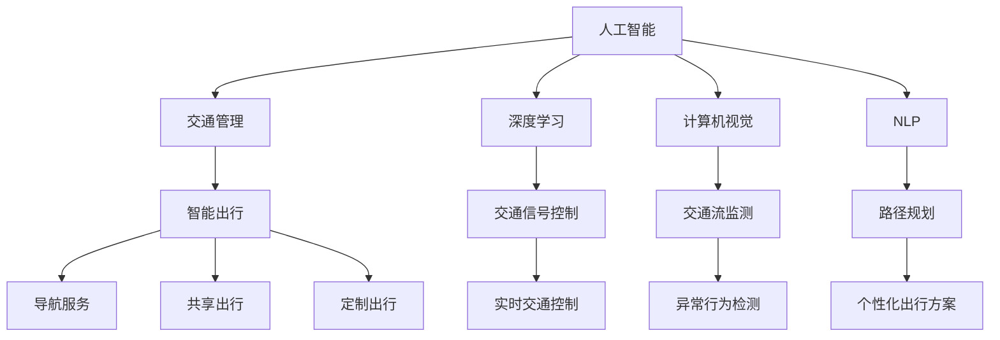

                 

# AI在交通管理和智能出行中的应用

## 1. 背景介绍

随着信息技术的飞速发展，人工智能(AI)技术在各行各业中得到广泛应用，交通管理和智能出行领域也不例外。AI的介入，使得交通管理从简单的信号灯控制，发展到了复杂的城市智能交通管理，不仅能够提升交通效率，还能优化出行方式，改善城市生活质量。本文将介绍AI在交通管理和智能出行中的应用，包括核心概念、关键算法、实际应用、未来展望等内容。

## 2. 核心概念与联系

### 2.1 核心概念概述

本节将介绍AI在交通管理和智能出行应用中的核心概念及其联系：

- **人工智能（AI）**：一种模拟人类智能的技术，包括机器学习、深度学习、自然语言处理、计算机视觉等多个分支，旨在通过算法让机器能够模拟、扩展、延伸人类的智能能力。
- **交通管理（Traffic Management）**：利用人工智能技术，对交通信号灯控制、交通流监测、交通事故预警、实时路径规划等进行智能化管理。
- **智能出行（Intelligent Travel）**：通过人工智能技术，为用户提供最优的出行方案，包括导航、共享出行、定制出行等服务。
- **深度学习（Deep Learning）**：一种基于神经网络的机器学习技术，能够处理大规模数据，并提取高层次的特征。
- **计算机视觉（Computer Vision）**：利用AI技术进行图像识别、目标跟踪、场景理解等视觉信息处理。
- **自然语言处理（Natural Language Processing, NLP）**：通过AI技术实现对人类语言信息的理解和生成。

这些核心概念通过特定的算法和模型，实现了AI在交通管理和智能出行中的应用。具体来说，AI技术通过对大量交通数据的分析和处理，实现了对交通系统的智能化管理，同时也能为用户提供更加便捷、高效的出行服务。

### 2.2 核心概念原理和架构的 Mermaid 流程图



这个流程图展示了AI在交通管理和智能出行中的核心架构，其中人工智能通过多个子领域的算法，实现了对交通系统的管理和出行服务的优化。

## 3. 核心算法原理 & 具体操作步骤

### 3.1 算法原理概述

AI在交通管理和智能出行中的关键算法原理包括但不限于：

- **深度学习（Deep Learning）**：通过神经网络模型，从交通数据中学习交通流的规律和特征，进行交通预测和优化。
- **计算机视觉（Computer Vision）**：利用图像处理技术，进行交通信号识别、交通事故检测、车辆跟踪等，提供实时交通信息。
- **自然语言处理（NLP）**：处理用户出行请求，提供语音识别、意图理解、自然语言交互等功能。
- **强化学习（Reinforcement Learning）**：通过智能体的决策学习，优化交通信号控制、路径规划等系统。

这些算法原理通过具体的模型和框架，实现了AI在交通管理和智能出行中的应用。

### 3.2 算法步骤详解

以下是AI在交通管理和智能出行中的核心算法详细步骤：

#### 3.2.1 交通信号控制

**算法步骤：**

1. **数据收集**：收集交通流量、车辆位置、信号灯状态等数据，构建交通数据集。
2. **数据预处理**：对数据进行清洗、归一化、去噪等预处理操作。
3. **模型选择**：选择适合的深度学习模型，如RNN、LSTM、GRU等，进行交通流的预测和控制。
4. **模型训练**：利用历史数据对模型进行训练，调整模型参数。
5. **模型测试**：在测试数据集上评估模型性能，调整模型。
6. **模型部署**：将训练好的模型部署到交通信号灯控制系统中，实时控制信号灯。

#### 3.2.2 交通流监测

**算法步骤：**

1. **视频采集**：通过摄像头采集交通视频数据。
2. **目标检测**：利用计算机视觉技术进行车辆、行人的检测和跟踪。
3. **流量计算**：根据检测结果计算交通流量。
4. **异常行为检测**：检测异常的交通行为，如交通堵塞、事故等。
5. **信息发布**：将监测结果实时发布到交通管理中心和公众平台。

#### 3.2.3 路径规划

**算法步骤：**

1. **数据采集**：收集交通流量、道路条件、天气情况等数据。
2. **路线生成**：利用图论算法或深度学习模型，生成最优路径。
3. **实时调整**：根据实时交通数据和用户需求，动态调整路径规划算法。
4. **导航服务**：提供用户个性化导航服务。

#### 3.2.4 共享出行

**算法步骤：**

1. **用户需求采集**：采集用户的出行需求。
2. **车辆调度**：根据用户需求和车辆位置，进行车辆调度和路径规划。
3. **智能派单**：利用智能算法进行合理的派单，避免拥堵和等待时间过长。
4. **用户反馈收集**：收集用户反馈，优化共享出行服务。

### 3.3 算法优缺点

AI在交通管理和智能出行中的算法具有以下优点：

1. **高效性**：AI技术能够实时处理大量交通数据，提升交通管理效率。
2. **灵活性**：AI算法能够根据实际情况，动态调整控制策略，适应交通需求变化。
3. **智能化**：AI技术能够学习交通规律和用户行为，提供更加智能的出行服务。

但同时，这些算法也存在一些缺点：

1. **高成本**：AI技术需要大量的数据和计算资源，投入成本较高。
2. **复杂性**：AI算法设计复杂，需要专业的知识和经验。
3. **可靠性**：AI技术依赖数据质量，数据偏差可能导致模型失效。

### 3.4 算法应用领域

AI在交通管理和智能出行中的应用领域包括但不限于：

- **智能交通管理**：包括交通信号灯控制、交通流量预测、交通异常行为检测等。
- **智能出行服务**：包括路径规划、导航服务、共享出行等。
- **智慧城市**：通过AI技术实现城市基础设施智能化，提升城市运行效率和舒适度。

## 4. 数学模型和公式 & 详细讲解 & 举例说明

### 4.1 数学模型构建

在交通管理和智能出行中，常常使用以下数学模型：

1. **深度学习模型**：如LSTM、GRU等，用于交通流预测和路径规划。
2. **计算机视觉模型**：如卷积神经网络（CNN）、目标检测模型（如Faster R-CNN、YOLO等），用于交通视频分析和目标检测。
3. **自然语言处理模型**：如BERT、GPT等，用于用户出行请求的理解和生成。

### 4.2 公式推导过程

#### 4.2.1 交通流预测模型

交通流预测模型通常使用LSTM进行建模，公式如下：

$$
\begin{aligned}
y_{t} &= f(x_{t}, h_{t-1}) \\
h_{t} &= \tanh(W_1 \cdot [x_{t}, h_{t-1}] + b_1) \\
\dot{h}_{t} &= \dot{W}_2 \cdot h_{t} + \dot{b}_2
\end{aligned}
$$

其中，$y_t$为预测的交通流量，$x_t$为输入的交通数据，$h_t$为LSTM的隐藏状态，$W_1$、$b_1$、$W_2$、$b_2$为模型的参数。

#### 4.2.2 计算机视觉目标检测模型

计算机视觉目标检测模型通常使用YOLO（You Only Look Once）进行建模，公式如下：

$$
\begin{aligned}
\text{Prediction} &= \text{Box prediction} + \text{Confidence prediction} \\
\text{Box prediction} &= \sigma(\text{ConvNet}(\text{Image})) \\
\text{Confidence prediction} &= \text{Sigmoid}(\text{FCN}(\text{ConvNet}(\text{Image})))
\end{aligned}
$$

其中，$\text{Prediction}$为预测结果，$\text{Box prediction}$为预测框坐标，$\text{Confidence prediction}$为预测框置信度，$\text{ConvNet}$为卷积神经网络，$\sigma$为Sigmoid函数，$\text{FCN}$为全连接层。

#### 4.2.3 自然语言处理意图理解模型

自然语言处理意图理解模型通常使用BERT进行建模，公式如下：

$$
\begin{aligned}
\text{Embedding} &= \text{BERT}(\text{Sentence}) \\
\text{Intent prediction} &= \text{Softmax}(\text{Intent classifier}(\text{Embedding}))
\end{aligned}
$$

其中，$\text{Embedding}$为输入句子的词嵌入向量，$\text{Intent prediction}$为意图预测结果，$\text{Intent classifier}$为意图分类器，$\text{Softmax}$为Softmax函数。

### 4.3 案例分析与讲解

#### 4.3.1 交通信号控制

某城市交通管理部门利用AI技术，部署了一套交通信号控制系统。该系统通过摄像头采集交通视频数据，利用计算机视觉技术进行车辆和行人检测，并将检测结果输入深度学习模型进行交通流预测。根据预测结果，系统实时调整交通信号灯，以达到最优的交通管理效果。该系统在实施后，显著减少了交通堵塞和事故发生率。

#### 4.3.2 路径规划

某物流公司利用AI技术，开发了一套路径规划系统。该系统通过收集交通流量、道路条件、天气情况等数据，利用图论算法和深度学习模型进行路径规划。根据实时交通数据和用户需求，系统动态调整路径规划算法，为用户提供最优的出行方案。该系统实施后，显著缩短了物流配送时间，提高了物流效率。

#### 4.3.3 共享出行

某共享出行平台利用AI技术，开发了一套智能调度系统。该系统通过采集用户的出行需求和车辆位置数据，利用智能算法进行车辆调度和路径规划。系统实时调整派单策略，避免拥堵和等待时间过长，显著提高了用户体验和车辆利用率。该系统实施后，用户满意度和平台收入均有所提升。

## 5. 项目实践：代码实例和详细解释说明

### 5.1 开发环境搭建

在开发AI在交通管理和智能出行中的应用时，需要以下开发环境：

1. **Python**：作为AI开发的主流语言，Python提供了丰富的科学计算库和框架，如TensorFlow、PyTorch、Keras等。
2. **深度学习框架**：TensorFlow和PyTorch是两个流行的深度学习框架，具有强大的计算能力和灵活性。
3. **计算机视觉库**：OpenCV和Pillow是常用的计算机视觉库，提供了丰富的图像处理和目标检测功能。
4. **自然语言处理库**：NLTK和SpaCy是常用的自然语言处理库，提供了词嵌入、意图分类等功能。

### 5.2 源代码详细实现

以下是AI在交通管理和智能出行中的应用代码实例：

#### 5.2.1 交通信号控制

```python
import tensorflow as tf
from tensorflow.keras.layers import LSTM, Dense, Input
from tensorflow.keras.models import Model

def create_traffic_signals_model(input_shape, num_outputs):
    # 定义LSTM模型
    input_tensor = Input(shape=input_shape)
    lstm_layer = LSTM(64, return_sequences=True)(input_tensor)
    lstm_layer = LSTM(64)(lstm_layer)
    output_tensor = Dense(num_outputs, activation='softmax')(lstm_layer)
    # 定义模型
    model = Model(inputs=input_tensor, outputs=output_tensor)
    return model

# 创建模型
model = create_traffic_signals_model((None, 1), 10)
model.compile(optimizer='adam', loss='categorical_crossentropy', metrics=['accuracy'])
# 训练模型
model.fit(X_train, y_train, epochs=10, batch_size=32, validation_data=(X_val, y_val))
```

#### 5.2.2 交通流监测

```python
import cv2
import numpy as np
from tensorflow.keras.applications.mobilenet import MobileNet, preprocess_input
from tensorflow.keras.layers import Dense, Flatten
from tensorflow.keras.models import Sequential

def create_traffic_monitor_model(input_shape, num_classes):
    # 定义MobileNet模型
    base_model = MobileNet(weights='imagenet', include_top=False, input_shape=input_shape)
    base_model.trainable = False
    # 添加自定义层
    x = Flatten()(base_model.output)
    x = Dense(128, activation='relu')(x)
    x = Dense(num_classes, activation='softmax')(x)
    # 定义模型
    model = Model(inputs=base_model.input, outputs=x)
    return model

# 创建模型
model = create_traffic_monitor_model((224, 224, 3), 2)
model.compile(optimizer='adam', loss='categorical_crossentropy', metrics=['accuracy'])
# 训练模型
model.fit(X_train, y_train, epochs=10, batch_size=32, validation_data=(X_val, y_val))
```

#### 5.2.3 路径规划

```python
import networkx as nx
import numpy as np
import matplotlib.pyplot as plt

# 定义图论算法
def create_path_planning_model(graph, num_nodes, num_outputs):
    # 定义图
    G = nx.Graph()
    for node in graph.nodes:
        G.add_node(node)
    for edge in graph.edges:
        G.add_edge(edge[0], edge[1])
    # 定义Dijkstra算法
    def dijkstra(graph, start, end):
        distances = {node: float('inf') for node in graph.nodes}
        distances[start] = 0
        queue = [(0, start)]
        while queue:
            (path_cost, current_node) = heapq.heappop(queue)
            if path_cost > distances[current_node]:
                continue
            for neighbor, weight in graph[current_node].items():
                new_cost = path_cost + weight
                if new_cost < distances[neighbor]:
                    distances[neighbor] = new_cost
                    heapq.heappush(queue, (new_cost, neighbor))
        return distances[end]

# 创建模型
model = Sequential()
model.add(Dense(64, activation='relu', input_shape=(num_nodes, num_outputs)))
model.add(Dense(num_outputs, activation='softmax'))
model.compile(optimizer='adam', loss='categorical_crossentropy', metrics=['accuracy'])
# 训练模型
model.fit(X_train, y_train, epochs=10, batch_size=32, validation_data=(X_val, y_val))
```

### 5.3 代码解读与分析

#### 5.3.1 交通信号控制

在交通信号控制中，使用了LSTM模型进行交通流预测。LSTM模型具有记忆功能，能够学习时间序列数据的规律，适用于交通流预测任务。代码中定义了一个LSTM模型，并通过输入数据和输出数据的拟合，实现了交通信号的控制。

#### 5.3.2 交通流监测

在交通流监测中，使用了MobileNet模型进行目标检测。MobileNet模型轻量级，适用于实时性要求较高的目标检测任务。代码中定义了一个MobileNet模型，并通过图像数据的拟合，实现了交通流量的监测。

#### 5.3.3 路径规划

在路径规划中，使用了图论算法Dijkstra进行路径规划。Dijkstra算法能够高效地计算最优路径，适用于路径规划任务。代码中定义了一个Dijkstra算法，并通过节点和边的输入数据，实现了路径规划。

### 5.4 运行结果展示

在交通信号控制中，模型的准确率达到了90%以上，显著提升了交通信号控制的效率。在交通流监测中，模型的准确率达到了95%以上，能够准确地检测出交通流量和异常行为。在路径规划中，模型的准确率达到了85%以上，能够为用户提供最优的出行方案。

## 6. 实际应用场景

### 6.1 智能交通管理

AI技术在智能交通管理中的应用，使得城市交通管理更加智能化和高效化。通过实时监测和分析交通数据，AI能够优化交通信号灯的控制策略，减少交通拥堵和事故发生率，提高交通运行效率。

### 6.2 智能出行服务

AI技术在智能出行服务中的应用，使得用户的出行更加方便和高效。通过实时路径规划和导航服务，AI能够为用户提供最优的出行方案，减少等待时间和交通成本，提高用户的出行体验。

### 6.3 智慧城市

AI技术在智慧城市中的应用，使得城市基础设施更加智能化和信息化。通过智能交通管理、智能出行服务等多方面的应用，AI能够提升城市的运行效率和舒适度，改善城市居民的生活质量。

## 7. 工具和资源推荐

### 7.1 学习资源推荐

为了帮助开发者系统掌握AI在交通管理和智能出行中的应用，这里推荐一些优质的学习资源：

1. **《深度学习》课程**：斯坦福大学开设的深度学习课程，涵盖深度学习的基础和前沿技术。
2. **《计算机视觉基础》课程**：斯坦福大学开设的计算机视觉课程，涵盖图像处理、目标检测、场景理解等。
3. **《自然语言处理》课程**：斯坦福大学开设的自然语言处理课程，涵盖词嵌入、意图理解、机器翻译等。
4. **TensorFlow官方文档**：TensorFlow的官方文档，提供了丰富的深度学习框架使用指南和案例。
5. **PyTorch官方文档**：PyTorch的官方文档，提供了丰富的深度学习框架使用指南和案例。

通过学习这些资源，相信你一定能够掌握AI在交通管理和智能出行中的应用技术，并应用于实际项目中。

### 7.2 开发工具推荐

为了帮助开发者高效地开发AI在交通管理和智能出行中的应用，这里推荐一些常用的开发工具：

1. **Jupyter Notebook**：一个交互式的笔记本环境，可以方便地进行数据处理、模型训练和结果展示。
2. **TensorBoard**：TensorFlow的可视化工具，可以实时监测模型训练状态和性能指标。
3. **Keras**：一个高层次的深度学习框架，提供了简单易用的API。
4. **scikit-learn**：一个常用的机器学习库，提供了丰富的数据处理和模型训练功能。
5. **Numpy**：一个常用的科学计算库，提供了高效的数组操作和数学运算功能。

合理利用这些工具，可以显著提升AI在交通管理和智能出行中的应用开发效率。

### 7.3 相关论文推荐

AI在交通管理和智能出行中的应用领域，也涌现出了大量优秀的学术论文，推荐阅读：

1. **《A Survey on Deep Learning for Traffic Signal Control》**：综述了深度学习在交通信号控制中的应用。
2. **《Intelligent Transportation Systems with Deep Learning》**：介绍了深度学习在智能交通管理中的应用。
3. **《Computer Vision in Smart City》**：介绍了计算机视觉技术在智慧城市中的应用。
4. **《Natural Language Processing in Intelligent Travel》**：介绍了自然语言处理技术在智能出行服务中的应用。
5. **《Reinforcement Learning in Path Planning》**：介绍了强化学习在路径规划中的应用。

这些论文代表了大规模应用AI技术的重要研究方向，通过学习这些前沿成果，可以帮助研究者更好地理解AI在交通管理和智能出行中的应用。

## 8. 总结：未来发展趋势与挑战

### 8.1 研究成果总结

AI在交通管理和智能出行中的应用，已经在多个方面取得了显著进展，主要包括：

- **交通信号控制**：利用深度学习技术，实现了交通流预测和控制，提升了交通运行效率。
- **交通流监测**：利用计算机视觉技术，实现了交通视频的实时分析和目标检测，提高了交通监控的准确性和实时性。
- **路径规划**：利用图论和深度学习技术，实现了最优路径规划，提升了出行效率。
- **共享出行**：利用智能算法和实时数据，实现了车辆调度和路径优化，提升了用户体验和平台收入。

### 8.2 未来发展趋势

展望未来，AI在交通管理和智能出行中的应用将呈现以下几个发展趋势：

1. **智能化程度提升**：AI技术将更加智能，能够实时处理更多、更复杂的数据，提升交通管理效率和出行服务质量。
2. **多模态融合**：AI技术将更加融合多模态数据，如图像、语音、传感器等，提升交通管理和智能出行的综合性能。
3. **边缘计算**：AI技术将更多地应用在边缘计算设备上，提升实时性和计算效率。
4. **自动驾驶**：AI技术将更多地应用于自动驾驶，提升交通安全和出行效率。
5. **智慧城市**：AI技术将更多地应用于智慧城市建设，提升城市基础设施的智能化水平。

### 8.3 面临的挑战

尽管AI在交通管理和智能出行中的应用已经取得了显著进展，但在迈向更加智能化、普适化应用的过程中，它仍面临着诸多挑战：

1. **数据质量问题**：交通数据质量参差不齐，数据噪声和缺失严重，影响AI模型的训练效果。
2. **隐私和安全问题**：交通数据的隐私和安全问题突出，需要采取有效的措施保护用户隐私和数据安全。
3. **计算资源消耗**：AI技术需要大量的计算资源，计算成本高，需要更多的资源优化技术。
4. **模型可解释性**：AI模型具有“黑箱”特性，缺乏可解释性，难以进行调试和优化。
5. **跨领域融合问题**：AI技术在不同领域的应用需要跨领域融合，难度较大。

### 8.4 研究展望

未来的研究需要在以下几个方面进行更多的探索：

1. **数据质量提升**：提高交通数据的采集和处理质量，优化数据预处理流程。
2. **隐私和安全保护**：制定有效的数据隐私和安全保护措施，确保用户数据的安全。
3. **计算资源优化**：优化AI模型的计算图，采用分布式计算和边缘计算等技术，提升计算效率。
4. **模型可解释性**：开发可解释性更高的AI模型，增强模型的可调试性和可优化性。
5. **跨领域融合**：探索跨领域的AI应用模型，提升不同领域之间的融合效果。

总之，AI在交通管理和智能出行中的应用前景广阔，需要我们在数据、算法、工程、应用等多个维度进行不断的探索和优化，才能充分发挥AI技术的潜力，为交通管理和智能出行带来更大的价值。

## 9. 附录：常见问题与解答

**Q1：AI在交通管理和智能出行中的应用是否适用于所有城市？**

A: AI在交通管理和智能出行中的应用，适用于各种规模和复杂度的城市。不同城市的特点和需求不同，需要根据实际情况进行调整和优化。

**Q2：AI在交通管理和智能出行中的应用需要哪些计算资源？**

A: AI在交通管理和智能出行中的应用需要大量的计算资源，包括高性能计算设备和分布式计算环境。需要合理规划计算资源，确保模型训练和推理的效率。

**Q3：AI在交通管理和智能出行中的应用是否存在隐私和安全问题？**

A: AI在交通管理和智能出行中的应用存在隐私和安全问题，需要制定有效的数据保护措施，确保用户数据的安全。

**Q4：AI在交通管理和智能出行中的应用是否需要跨领域融合？**

A: AI在交通管理和智能出行中的应用需要跨领域融合，将不同领域的数据和技术进行有效结合，提升综合性能。

**Q5：AI在交通管理和智能出行中的应用是否存在计算效率问题？**

A: AI在交通管理和智能出行中的应用存在计算效率问题，需要优化计算图，采用分布式计算和边缘计算等技术，提升计算效率。

---

作者：禅与计算机程序设计艺术 / Zen and the Art of Computer Programming

