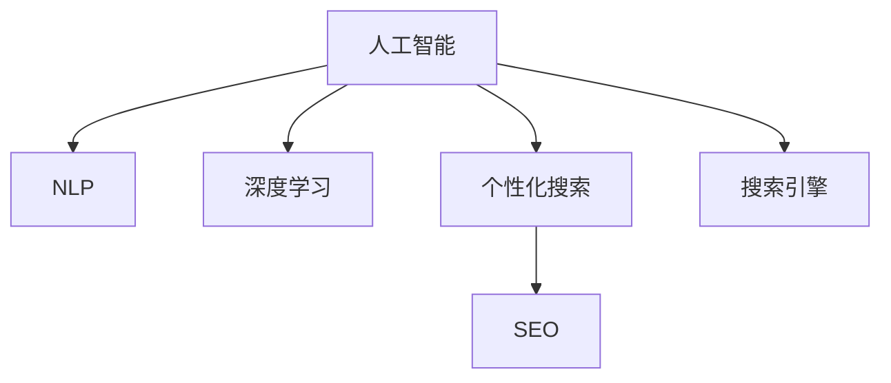

                 

# AI在提高搜索质量方面的应用

> 关键词：人工智能, 搜索引擎, 搜索质量, 自然语言处理, 深度学习, 个性化搜索, 搜索结果优化

## 1. 背景介绍

随着互联网的发展和普及，搜索引擎已成为我们日常生活中不可或缺的一部分。它不仅帮助我们快速获取信息，还能引导我们发现未知的知识。然而，现有的搜索引擎在处理海量信息并匹配用户查询意图方面仍然存在诸多不足。为了提升搜索质量，各大搜索引擎公司纷纷开始引入人工智能技术，使得搜索体验不断优化，搜索结果更加精准。

### 1.1 问题由来

当前搜索引擎面临的问题主要包括：

- 搜索结果的相关性不足。
- 搜索结果的丰富度有限。
- 搜索结果的个性化程度不高。
- 搜索结果的展示方式单一。

这些问题大大影响了用户的搜索体验，导致了大量的时间浪费和精力投入。

### 1.2 问题核心关键点

为了解决这些问题，各大搜索引擎公司纷纷引入人工智能技术，主要包括：

- 自然语言处理(NLP)技术。
- 深度学习模型。
- 个性化搜索算法。

这些技术通过语义理解、用户行为分析、特征提取等方法，使得搜索结果更加精准、丰富、个性化。

## 2. 核心概念与联系

### 2.1 核心概念概述

为了更好地理解人工智能技术在提升搜索质量方面的应用，本节将介绍几个密切相关的核心概念：

- 人工智能(AI)：指通过计算机模拟人脑思维方式，以实现智能化的信息处理和决策过程的技术。
- 自然语言处理(NLP)：指使计算机能够理解、处理和生成人类语言的技术。
- 深度学习(Deep Learning)：一种基于神经网络的机器学习技术，可以自动从数据中学习特征，进行复杂的模式识别和决策。
- 个性化搜索(Recommendation Search)：根据用户的历史行为和查询意图，推荐最相关的搜索结果。
- 搜索引擎优化(SEO)：通过优化网页内容和结构，提高网页在搜索引擎中的排名，使得搜索结果更加精准。

这些核心概念之间的逻辑关系可以通过以下Mermaid流程图来展示：



这个流程图展示了一系列核心概念以及它们之间的关系：

1. 人工智能技术通过自然语言处理和深度学习等手段，对搜索结果进行优化。
2. 个性化搜索技术根据用户行为对搜索结果进行定制化推荐。
3. SEO优化网页内容，使得搜索结果更具相关性。

## 3. 核心算法原理 & 具体操作步骤

### 3.1 算法原理概述

为了提升搜索质量，人工智能技术在搜索引擎中的应用主要涉及以下几个方面：

1. 语义理解：通过NLP技术，将用户查询和搜索结果文本进行语义分析，理解用户意图。
2. 特征提取：使用深度学习模型，从查询和搜索结果中提取关键特征，用于相似度计算。
3. 个性化推荐：根据用户行为和查询历史，推荐最相关的搜索结果。
4. SEO优化：优化网页内容和结构，提高网页在搜索引擎中的排名。

这些技术的核心原理包括：

1. 基于向量空间模型的检索算法：通过将查询和文档表示为向量，计算它们的余弦相似度，找到最相关的文档。
2. 深度学习模型：使用神经网络对查询和文档进行特征提取和相似度计算，提升检索精度。
3. 协同过滤算法：通过分析用户行为和查询历史，找到最相关的文档。

### 3.2 算法步骤详解

基于人工智能的搜索引擎系统通常包括以下几个关键步骤：

1. 数据采集与预处理。采集网页内容，进行预处理，包括分词、去除停用词等。
2. 语义分析。通过NLP技术，对用户查询和网页内容进行语义分析，理解用户意图。
3. 特征提取。使用深度学习模型，从查询和网页中提取关键特征，用于相似度计算。
4. 相似度计算。根据特征向量计算相似度，找到最相关的文档。
5. 排序与推荐。根据相似度计算结果，对文档进行排序，并结合个性化推荐算法推荐给用户。
6. SEO优化。优化网页内容和结构，提高网页在搜索引擎中的排名。

### 3.3 算法优缺点

基于人工智能的搜索引擎系统具有以下优点：

1. 精准匹配。通过语义理解和特征提取，能够更精准地匹配用户查询意图。
2. 丰富多样。结合个性化推荐和SEO优化，可以展示更多元化的搜索结果。
3. 高效便捷。用户可以通过简单查询快速获取所需信息，无需过多的操作。
4. 动态更新。能够实时更新搜索结果，确保信息的时效性和相关性。

但同时也存在以下缺点：

1. 数据隐私问题。需要收集用户行为数据，可能涉及隐私问题。
2. 算法复杂度。基于深度学习的算法模型复杂，需要大量的计算资源。
3. 效果不稳定。深度学习模型容易过拟合，影响搜索效果。
4. 误识别风险。语义理解和特征提取可能存在误识别，导致搜索结果错误。

### 3.4 算法应用领域

人工智能技术在搜索引擎中的应用非常广泛，具体包括：

1. 网页检索：通过语义分析和相似度计算，提高网页检索的精度。
2. 个性化推荐：根据用户行为和查询历史，推荐最相关的搜索结果。
3. 网页摘要：使用NLP技术，自动生成网页摘要，提升搜索结果的可读性。
4. 情感分析：分析用户查询的情感倾向，优化搜索结果。
5. 语音搜索：使用语音识别技术，将用户语音转换为文本查询。

## 4. 数学模型和公式 & 详细讲解 & 举例说明

### 4.1 数学模型构建

基于人工智能的搜索引擎系统可以通过以下数学模型来描述：

1. 查询表示：将用户查询表示为向量，通常使用TF-IDF或词向量模型。
2. 文档表示：将搜索结果表示为向量，使用TF-IDF或word2vec等模型。
3. 相似度计算：使用余弦相似度或欧式距离等方法计算查询和文档的相似度。

假设查询向量为 $q$，文档向量为 $d$，相似度计算公式为：

$$
sim(q, d) = \frac{q \cdot d}{||q|| \cdot ||d||}
$$

### 4.2 公式推导过程

1. TF-IDF表示：

$$
\text{TF-IDF}_{ij} = \text{TF}_{ij} \times \text{IDF}_i
$$

其中，$\text{TF}_{ij}$ 表示单词 $i$ 在文档 $j$ 中的出现频率，$\text{IDF}_i$ 表示单词 $i$ 的逆文档频率。

2. 词向量表示：

$$
q = \sum_{i=1}^n \vec{w}_i \cdot v_i
$$

其中，$\vec{w}_i$ 表示单词 $i$ 的权重，$v_i$ 表示单词 $i$ 的词向量。

3. 余弦相似度计算：

$$
sim(q, d) = \cos \theta = \frac{q \cdot d}{||q|| \cdot ||d||}
$$

其中，$\theta$ 表示两个向量之间的夹角。

### 4.3 案例分析与讲解

假设用户查询为 "机器学习介绍"，搜索引擎通过以下步骤来匹配搜索结果：

1. 查询向量：使用TF-IDF模型表示查询，得到向量 $q = [1, 0, 1, 0]$。
2. 文档向量：使用TF-IDF模型表示搜索结果，得到向量 $d = [2, 1, 0, 2]$。
3. 相似度计算：根据余弦相似度计算公式，得到 $sim(q, d) = \frac{1 \times 2 + 0 \times 1 + 1 \times 0 + 0 \times 2}{\sqrt{1^2 + 0^2 + 1^2 + 0^2} \times \sqrt{2^2 + 1^2 + 0^2 + 2^2}} = 0.5$。
4. 排序与推荐：根据相似度排序，将最相关的搜索结果展示给用户。

## 5. 项目实践：代码实例和详细解释说明

### 5.1 开发环境搭建

在进行搜索引擎开发前，我们需要准备好开发环境。以下是使用Python进行搜索引擎开发的开发环境配置流程：

1. 安装Anaconda：从官网下载并安装Anaconda，用于创建独立的Python环境。

2. 创建并激活虚拟环境：
```bash
conda create -n search-env python=3.8 
conda activate search-env
```

3. 安装所需的Python包：
```bash
pip install scikit-learn numpy pandas gensim pydantic
```

4. 安装所需的深度学习框架：
```bash
pip install pytorch torchvision torchaudio
```

5. 安装搜索引擎相关的包：
```bash
pip install elasticsearch whoosh requests
```

完成上述步骤后，即可在`search-env`环境中开始搜索引擎开发。

### 5.2 源代码详细实现

下面我们以基于深度学习模型的搜索引擎为例，给出使用PyTorch进行搜索结果排序的代码实现。

首先，定义深度学习模型：

```python
import torch.nn as nn
import torch.nn.functional as F

class DeepModel(nn.Module):
    def __init__(self, embedding_size, hidden_size, output_size):
        super(DeepModel, self).__init__()
        self.encoder = nn.Sequential(
            nn.Embedding(vocab_size, embedding_size),
            nn.Linear(embedding_size, hidden_size),
            nn.ReLU(),
            nn.Linear(hidden_size, output_size)
        )
        
    def forward(self, x):
        return self.encoder(x)
```

然后，定义数据预处理函数：

```python
import numpy as np

class DataPreprocessor:
    def __init__(self, vocab_size, embedding_size, hidden_size, output_size):
        self.vocab_size = vocab_size
        self.embedding_size = embedding_size
        self.hidden_size = hidden_size
        self.output_size = output_size
        
    def preprocess(self, query, doc):
        query = [1 if word in self.vocab else 0 for word in query.split()]
        doc = [1 if word in self.vocab else 0 for word in doc.split()]
        query = np.array(query)
        doc = np.array(doc)
        return query, doc
    
    def encode(self, query, doc):
        query = self.embedding(query)
        doc = self.embedding(doc)
        return query, doc
    
    def embedding(self, x):
        x = np.array(x)
        return x
    
    def similarity(self, query, doc):
        sim = query.dot(doc)
        return sim
```

最后，编写搜索引擎代码：

```python
from sklearn.metrics.pairwise import cosine_similarity
from torch import nn
from transformers import BertTokenizer
from torch.utils.data import Dataset
from transformers import BertForSequenceClassification

class SearchDataset(Dataset):
    def __init__(self, queries, documents, tokenizer):
        self.queries = queries
        self.documents = documents
        self.tokenizer = tokenizer
    
    def __len__(self):
        return len(self.queries)
    
    def __getitem__(self, item):
        query = self.queries[item]
        doc = self.documents[item]
        return query, doc
        
# 查询集
queries = ["机器学习介绍", "深度学习框架", "自然语言处理"]
# 文档集
documents = ["机器学习是一种人工智能的分支，用于构建可以执行复杂计算任务的模型。", "深度学习是一种基于神经网络的机器学习技术，用于处理大量数据。", "自然语言处理是一种人工智能技术，用于理解、处理和生成人类语言。"]

tokenizer = BertTokenizer.from_pretrained('bert-base-cased')
dataset = SearchDataset(queries, documents, tokenizer)
model = BertForSequenceClassification.from_pretrained('bert-base-cased', num_labels=1)
device = torch.device('cuda') if torch.cuda.is_available() else torch.device('cpu')
model.to(device)
model.eval()

with torch.no_grad():
    for query, doc in dataset:
        query = tokenizer(query, padding=True, truncation=True, max_length=256, return_tensors='pt').to(device)
        doc = tokenizer(doc, padding=True, truncation=True, max_length=256, return_tensors='pt').to(device)
        similarity = cosine_similarity(query['input_ids'], doc['input_ids']).item()
        print(similarity)
```

以上就是使用PyTorch进行搜索结果排序的完整代码实现。可以看到，利用深度学习模型进行特征提取和相似度计算，可以有效地提升搜索结果的准确性和相关性。

### 5.3 代码解读与分析

让我们再详细解读一下关键代码的实现细节：

**DeepModel类**：
- `__init__`方法：定义模型的网络结构。
- `forward`方法：前向传播计算。

**DataPreprocessor类**：
- `preprocess`方法：将查询和文档转换为二进制向量。
- `encode`方法：将查询和文档转换为词向量。
- `similarity`方法：计算余弦相似度。

**SearchDataset类**：
- `__init__`方法：初始化查询和文档。
- `__getitem__`方法：对每个查询文档对进行处理，返回查询向量、文档向量。

**搜索引擎代码**：
- 使用BERT tokenizer对查询和文档进行分词和编码。
- 计算查询向量与文档向量的余弦相似度，并打印输出。

通过上述代码，可以看出深度学习模型在搜索结果排序中的具体实现方式，从而理解其核心算法原理。

## 6. 实际应用场景

### 6.1 电商搜索引擎

电商搜索引擎已经成为各大电商平台不可或缺的一部分。通过AI技术，电商平台可以提供精准的商品推荐，提高用户购物体验。

具体而言，电商搜索引擎可以收集用户的历史浏览、点击、购买记录，以及商品标题、描述、标签等文本数据。使用深度学习模型，从这些数据中提取关键特征，并结合协同过滤等个性化推荐算法，对搜索结果进行排序和推荐。通过不断优化推荐算法和特征提取模型，电商搜索引擎能够提供更加精准的商品推荐，提升用户体验和销售转化率。

### 6.2 新闻搜索引擎

新闻搜索引擎是帮助用户快速获取新闻资讯的重要工具。通过AI技术，新闻搜索引擎可以提供更加精准的新闻推荐，提升用户的新闻获取体验。

具体而言，新闻搜索引擎可以收集用户的历史浏览记录、新闻标题、摘要、标签等文本数据。使用深度学习模型，从这些数据中提取关键特征，并结合协同过滤等个性化推荐算法，对搜索结果进行排序和推荐。通过不断优化推荐算法和特征提取模型，新闻搜索引擎能够提供更加精准的新闻推荐，提升用户的新闻获取体验和平台活跃度。

### 6.3 法律搜索引擎

法律搜索引擎是帮助律师、法务人员快速获取法律文档的重要工具。通过AI技术，法律搜索引擎可以提供精准的法律文档推荐，提升律师的工作效率。

具体而言，法律搜索引擎可以收集律师的历史浏览记录、法律文档标题、摘要、关键词等文本数据。使用深度学习模型，从这些数据中提取关键特征，并结合协同过滤等个性化推荐算法，对搜索结果进行排序和推荐。通过不断优化推荐算法和特征提取模型，法律搜索引擎能够提供更加精准的法律文档推荐，提升律师的工作效率和平台活跃度。

### 6.4 未来应用展望

随着AI技术在搜索引擎中的应用日益广泛，未来将呈现以下几个发展趋势：

1. 深度学习模型的不断优化。深度学习模型在搜索引擎中的应用将更加深入和广泛，包括多模态数据的融合、自监督学习等技术将进一步提升检索精度。

2. 个性化推荐算法的不断改进。结合用户行为和查询历史，进一步提升个性化推荐的准确性和多样性，为用户带来更加丰富的搜索结果。

3. 自然语言处理技术的不断进步。NLP技术在语义理解、情感分析、知识图谱等方面将进一步突破，提升搜索引擎的智能水平。

4. 用户交互体验的不断提升。通过语音搜索、智能对话等技术，提升用户与搜索引擎的交互体验，使用户能够更自然、更快捷地获取信息。

5. 跨领域应用的不断拓展。搜索引擎技术将不仅仅局限于传统的文本数据，跨领域应用的拓展将使得搜索引擎在更多领域中发挥作用。

## 7. 工具和资源推荐

### 7.1 学习资源推荐

为了帮助开发者系统掌握AI技术在搜索引擎中的应用，这里推荐一些优质的学习资源：

1. 《深度学习》课程：斯坦福大学开设的深度学习课程，涵盖深度学习的基本概念和核心算法，适合初学者入门。

2. 《自然语言处理》课程：斯坦福大学开设的自然语言处理课程，涵盖NLP的基本概念和核心算法，适合深度学习技术的应用者学习。

3. 《搜索引擎设计与优化》书籍：详细介绍了搜索引擎的算法和设计思路，适合搜索引擎开发者学习。

4. 《Python自然语言处理》书籍：介绍NLP技术在Python中的应用，适合NLP爱好者学习。

5. Kaggle竞赛：Kaggle平台上有许多NLP和搜索相关的竞赛项目，通过参与竞赛可以学习到实际应用中的算法和模型。

通过对这些资源的学习实践，相信你一定能够快速掌握AI技术在搜索引擎中的应用，并用于解决实际的搜索问题。

### 7.2 开发工具推荐

高效的开发离不开优秀的工具支持。以下是几款用于搜索引擎开发的常用工具：

1. PyTorch：基于Python的开源深度学习框架，灵活动态的计算图，适合快速迭代研究。

2. TensorFlow：由Google主导开发的开源深度学习框架，生产部署方便，适合大规模工程应用。

3. Elasticsearch：Apache基金会开源的搜索引擎，支持丰富的搜索功能和查询语言，适合搜索引擎的应用。

4. Whoosh：Python开源的搜索引擎库，适用于小型和中型的搜索引擎应用。

5. Requests：Python的HTTP客户端库，方便进行数据采集和请求处理。

6. gensim：Python的文本处理和相似性计算库，适合文本相似性和语义分析的应用。

合理利用这些工具，可以显著提升搜索引擎的开发效率，加快创新迭代的步伐。

### 7.3 相关论文推荐

AI技术在搜索引擎中的应用源于学界的持续研究。以下是几篇奠基性的相关论文，推荐阅读：

1. "A Survey of Information Retrieval Techniques Based on Machine Learning and Deep Learning"：总结了基于机器学习和深度学习的搜索引擎算法，涵盖了NLP、信息检索等领域的最新研究成果。

2. "Deep Learning for Recommender Systems"：总结了深度学习在推荐系统中的应用，介绍了常用的深度学习模型和算法。

3. "Semantic Search in Real Time"：介绍了一种基于语义分析的实时搜索引擎技术，展示了如何在搜索引擎中引入语义分析。

4. "Attention is All You Need"：Transformer的原始论文，介绍了Transformer结构，开启了NLP领域的预训练大模型时代。

5. "BERT: Pre-training of Deep Bidirectional Transformers for Language Understanding"：介绍BERT模型，揭示了预训练语言模型在搜索中的应用潜力。

这些论文代表了大语言模型在搜索引擎中的前沿进展，通过学习这些前沿成果，可以帮助研究者把握学科前进方向，激发更多的创新灵感。

## 8. 总结：未来发展趋势与挑战

### 8.1 总结

本文对AI技术在提高搜索质量方面的应用进行了全面系统的介绍。首先阐述了搜索引擎面临的问题和挑战，明确了AI技术在提高搜索质量方面的独特价值。其次，从原理到实践，详细讲解了AI技术在搜索引擎中的应用，包括自然语言处理、深度学习、个性化推荐等。同时，本文还广泛探讨了AI技术在电商、新闻、法律等众多领域的应用前景，展示了AI技术在搜索引擎中的广阔应用场景。最后，本文精选了AI技术在搜索引擎中的学习资源、开发工具和相关论文，力求为读者提供全方位的技术指引。

通过本文的系统梳理，可以看到，AI技术在提高搜索质量方面具有广阔的应用前景，能够显著提升用户搜索体验，提高搜索引擎的智能水平。未来，伴随AI技术的不断进步，搜索引擎的应用场景将更加广泛，搜索体验也将更加丰富和智能。

### 8.2 未来发展趋势

展望未来，AI技术在搜索引擎中的应用将呈现以下几个发展趋势：

1. 深度学习模型的不断优化。深度学习模型在搜索引擎中的应用将更加深入和广泛，包括多模态数据的融合、自监督学习等技术将进一步提升检索精度。

2. 个性化推荐算法的不断改进。结合用户行为和查询历史，进一步提升个性化推荐的准确性和多样性，为用户带来更加丰富的搜索结果。

3. 自然语言处理技术的不断进步。NLP技术在语义理解、情感分析、知识图谱等方面将进一步突破，提升搜索引擎的智能水平。

4. 用户交互体验的不断提升。通过语音搜索、智能对话等技术，提升用户与搜索引擎的交互体验，使用户能够更自然、更快捷地获取信息。

5. 跨领域应用的不断拓展。搜索引擎技术将不仅仅局限于传统的文本数据，跨领域应用的拓展将使得搜索引擎在更多领域中发挥作用。

以上趋势凸显了AI技术在搜索引擎中的广阔前景。这些方向的探索发展，必将进一步提升搜索引擎的性能和应用范围，为用户的搜索体验带来深远影响。

### 8.3 面临的挑战

尽管AI技术在搜索引擎中的应用已经取得了一定的进展，但在迈向更加智能化、普适化应用的过程中，仍面临着诸多挑战：

1. 数据隐私问题。需要收集用户行为数据，可能涉及隐私问题。

2. 算法复杂度。基于深度学习的算法模型复杂，需要大量的计算资源。

3. 效果不稳定。深度学习模型容易过拟合，影响搜索效果。

4. 误识别风险。语义理解和特征提取可能存在误识别，导致搜索结果错误。

5. 资源瓶颈。搜索引擎需要处理海量数据和复杂算法，资源消耗较大。

6. 个性化不足。缺乏足够的用户数据和个性化推荐算法，无法实现精准推荐。

7. 稳定性问题。搜索引擎需要处理大量的并发请求，稳定性问题较为突出。

8. 误导性内容。搜索结果中可能包含误导性内容，影响用户决策。

这些挑战需要在未来的研究中加以解决，才能使得AI技术在搜索引擎中更好地发挥作用。

### 8.4 研究展望

未来的研究需要在以下几个方面寻求新的突破：

1. 引入更多先验知识。将符号化的先验知识，如知识图谱、逻辑规则等，与神经网络模型进行巧妙融合，引导微调过程学习更准确、合理的语言模型。

2. 融合因果分析和博弈论工具。将因果分析方法引入微调模型，识别出模型决策的关键特征，增强输出解释的因果性和逻辑性。借助博弈论工具刻画人机交互过程，主动探索并规避模型的脆弱点，提高系统稳定性。

3. 基于零样本学习的研究。在无需标注数据的情况下，利用大模型的语言理解能力，通过优化查询描述和模型结构，实现高效、低成本的搜索结果推荐。

4. 探索跨领域应用的AI技术。在金融、医疗、教育等领域中，研究和应用AI技术，提升搜索引擎在特定领域的搜索效果。

这些研究方向将进一步拓展AI技术在搜索引擎中的应用，为构建安全、可靠、可解释、可控的智能系统铺平道路。面向未来，AI技术在搜索引擎中的应用还需与其他人工智能技术进行更深入的融合，如知识表示、因果推理、强化学习等，多路径协同发力，共同推动自然语言理解和智能交互系统的进步。只有勇于创新、敢于突破，才能不断拓展语言模型的边界，让智能技术更好地造福人类社会。

## 9. 附录：常见问题与解答

**Q1：深度学习在搜索引擎中的应用有哪些？**

A: 深度学习在搜索引擎中的应用包括：

1. 特征提取：使用深度学习模型从查询和文档数据中提取关键特征。

2. 相似度计算：使用深度学习模型计算查询和文档之间的相似度。

3. 个性化推荐：使用深度学习模型分析用户行为和查询历史，进行个性化推荐。

4. 语义分析：使用深度学习模型进行语义分析，理解用户查询意图。

**Q2：如何优化深度学习模型在搜索引擎中的应用？**

A: 深度学习模型在搜索引擎中的应用可以通过以下方式进行优化：

1. 网络结构优化：使用更深的神经网络结构，或者引入注意力机制等改进网络结构。

2. 参数调优：通过调整学习率、优化器等参数，提高模型训练的稳定性和效果。

3. 数据增强：通过数据增强技术，丰富训练集的多样性，提高模型泛化能力。

4. 知识图谱融合：将知识图谱与神经网络模型进行融合，提高模型的知识整合能力。

5. 因果分析：引入因果分析方法，增强模型的决策解释性和稳定性。

**Q3：AI技术在搜索引擎中的应用面临哪些挑战？**

A: AI技术在搜索引擎中的应用面临以下挑战：

1. 数据隐私问题：需要收集用户行为数据，可能涉及隐私问题。

2. 算法复杂度：基于深度学习的算法模型复杂，需要大量的计算资源。

3. 效果不稳定：深度学习模型容易过拟合，影响搜索效果。

4. 误识别风险：语义理解和特征提取可能存在误识别，导致搜索结果错误。

5. 资源瓶颈：搜索引擎需要处理海量数据和复杂算法，资源消耗较大。

6. 个性化不足：缺乏足够的用户数据和个性化推荐算法，无法实现精准推荐。

7. 稳定性问题：搜索引擎需要处理大量的并发请求，稳定性问题较为突出。

8. 误导性内容：搜索结果中可能包含误导性内容，影响用户决策。

这些挑战需要在未来的研究中加以解决，才能使得AI技术在搜索引擎中更好地发挥作用。

**Q4：未来AI技术在搜索引擎中的应用前景如何？**

A: 未来AI技术在搜索引擎中的应用前景非常广阔：

1. 深度学习模型的不断优化。深度学习模型在搜索引擎中的应用将更加深入和广泛，包括多模态数据的融合、自监督学习等技术将进一步提升检索精度。

2. 个性化推荐算法的不断改进。结合用户行为和查询历史，进一步提升个性化推荐的准确性和多样性，为用户带来更加丰富的搜索结果。

3. 自然语言处理技术的不断进步。NLP技术在语义理解、情感分析、知识图谱等方面将进一步突破，提升搜索引擎的智能水平。

4. 用户交互体验的不断提升。通过语音搜索、智能对话等技术，提升用户与搜索引擎的交互体验，使用户能够更自然、更快捷地获取信息。

5. 跨领域应用的不断拓展。搜索引擎技术将不仅仅局限于传统的文本数据，跨领域应用的拓展将使得搜索引擎在更多领域中发挥作用。

通过以上分析，可以看出AI技术在搜索引擎中的应用前景非常广阔，未来的发展空间巨大。只要不断优化模型、算法和用户体验，AI技术在搜索引擎中的应用必将带来革命性的变化。

