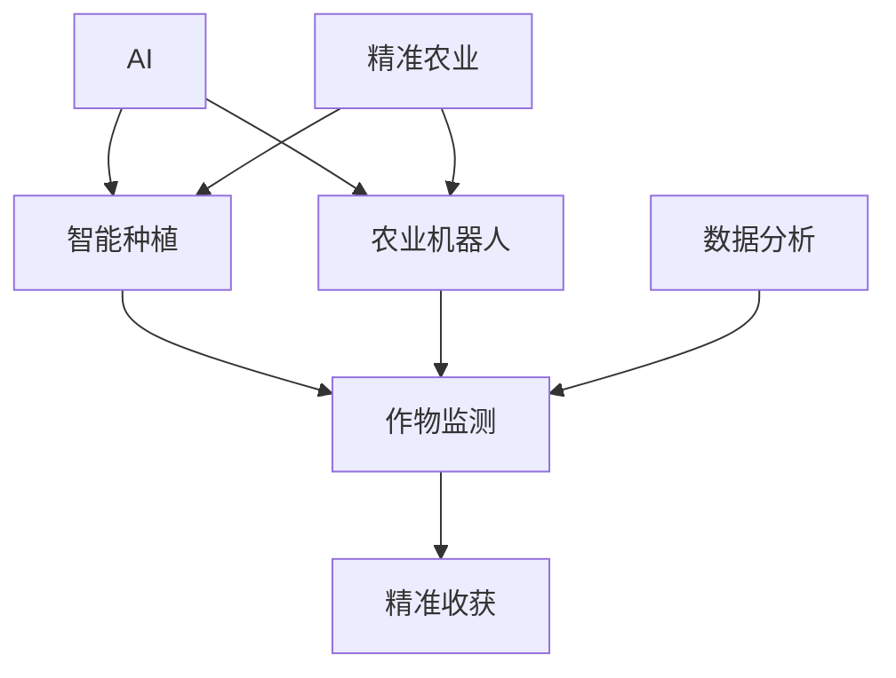

                 

# AI在智能农业中的角色：精准种植与收获

> 关键词：人工智能(AI),精准农业,智能种植,农业机器人,作物监测,遥感技术,数据分析

## 1. 背景介绍

### 1.1 问题由来

随着全球人口的增加和城市化进程的加速，农业资源的紧缺和环境保护的压力愈发突出。如何提高农业生产的效率和可持续性，成为迫切需要解决的问题。在这一背景下，AI技术在农业领域的深度应用，特别是精准农业的发展，成为了缓解全球粮食安全压力的重要手段。

精准农业是一种利用现代信息技术对农业生产全过程进行优化和控制，以实现资源的高效利用和产量的最大化。它将信息技术、地理信息系统、遥感技术、大数据分析等前沿技术，与农业生产实践相结合，形成了集成的、高效的现代农业体系。

### 1.2 问题核心关键点

AI在精准农业中的核心作用在于通过数据驱动和智能决策，优化农作物的种植、管理和收获等环节。具体关键点包括：

- **数据获取与处理**：AI技术能够高效地获取和处理农业生产中的各类数据，如气候、土壤、作物生长状态等。
- **智能决策支持**：基于数据分析的智能算法，辅助农民进行种植决策，优化施肥、灌溉、病虫害防治等管理策略。
- **自动化设备与机器人**：AI技术驱动的农业机器人等自动化设备，提高农业生产的机械化和智能化水平。
- **作物监测与分析**：利用遥感技术和传感器，实时监测作物生长情况，及时调整管理措施。
- **精准收获与加工**：通过智能算法和设备，实现作物的精准收获与加工，提高产品质量和产量。

## 2. 核心概念与联系

### 2.1 核心概念概述

为了更好地理解AI在精准农业中的应用，我们首先梳理几个核心概念及其相互联系：

- **AI**：人工智能，涵盖机器学习、深度学习、自然语言处理、计算机视觉等技术，以自动化、智能化手段辅助人类解决复杂问题。
- **精准农业**：基于现代信息技术，对农业生产过程进行精准管理，提高资源利用率和产量。
- **智能种植**：利用AI技术优化种植过程，包括品种选择、种植间距、施肥、灌溉等。
- **农业机器人**：基于AI技术的农业自动化设备，如无人机、收割机器人、自动化农机等。
- **作物监测**：利用遥感技术、传感器等手段，实时监测作物生长状况，支持智能决策。
- **数据分析**：从农业生产中获取的大量数据，通过AI技术进行分析和建模，为农业决策提供支持。
- **精准收获**：利用AI技术，实现作物的精准收割和加工，提高产品质量和效率。

这些概念相互关联，共同构成了AI在精准农业中的核心应用框架。

### 2.2 核心概念原理和架构的 Mermaid 流程图



该流程图展示了AI技术在精准农业中的应用链条。AI作为核心驱动力，通过智能种植、农业机器人、作物监测、数据分析和精准收获等环节，实现了从生产决策到智能设备控制的全过程智能化。

## 3. 核心算法原理 & 具体操作步骤

### 3.1 算法原理概述

AI在精准农业中的应用主要通过以下几个算法原理实现：

1. **数据采集与处理**：利用传感器、无人机、卫星等设备，采集土壤、气象、作物生长状态等数据，并进行预处理，形成可用于分析的数据集。
2. **图像识别与分析**：利用计算机视觉技术，对农业图像进行分析，识别作物生长状况、病虫害等问题。
3. **预测建模**：基于历史数据和现有信息，建立机器学习模型，预测作物生长趋势、产量等。
4. **智能决策**：结合专家知识和AI算法，辅助农民进行种植决策，优化管理措施。
5. **自动化控制**：通过自动化设备和机器人，执行农作物的种植、施肥、灌溉等操作。

这些算法原理相互配合，形成了一个闭环的农业智能管理系统。

### 3.2 算法步骤详解

以下是AI在精准农业中应用的详细算法步骤：

1. **数据采集与预处理**：
   - 利用传感器、无人机、卫星等设备，收集土壤、气象、作物生长状态等数据。
   - 对数据进行清洗、归一化、标准化等预处理操作，确保数据质量。

2. **图像识别与分析**：
   - 使用计算机视觉技术，对农业图像进行分析，识别作物生长状况、病虫害等问题。
   - 结合卷积神经网络(CNN)、目标检测算法等，实现图像分类和目标检测。

3. **预测建模**：
   - 利用历史数据和现有信息，建立机器学习模型，如随机森林、支持向量机、神经网络等。
   - 通过交叉验证等方法评估模型性能，选择最优模型进行预测。

4. **智能决策支持**：
   - 结合专家知识和AI算法，开发智能决策支持系统，辅助农民进行种植决策。
   - 例如，通过分析土壤、气候、作物生长数据，预测最佳种植时间和管理措施。

5. **自动化控制**：
   - 利用农业机器人等自动化设备，执行农作物的种植、施肥、灌溉等操作。
   - 结合GPS、传感器等技术，实现精准农业机械的自主导航和操作。

6. **实时监测与调整**：
   - 利用遥感技术和传感器，实时监测作物生长状况，及时调整管理措施。
   - 例如，通过无人机或固定传感器，定期采集作物图像，进行健康评估。

### 3.3 算法优缺点

AI在精准农业中的应用具有以下优点：

- **提高生产效率**：通过智能化管理，优化种植、施肥、灌溉等环节，提高资源利用率和产量。
- **降低成本**：自动化设备减少了人工操作，降低了人力成本。
- **精准管理**：实时监测和数据分析，实现精准的种植和病虫害防治，提高农作物品质和产量。

同时，AI在精准农业中也存在一些局限性：

- **数据质量依赖**：AI算法的准确性依赖于数据的质量，低质量的原始数据可能导致错误决策。
- **技术成本高**：初期引入AI技术和设备，可能带来较高的投入成本。
- **适应性问题**：AI算法对特定的农业环境可能存在适应性问题，需要持续优化。
- **隐私和安全问题**：农业数据涉及隐私和食品安全，需要严格的隐私保护和数据安全措施。

### 3.4 算法应用领域

AI在精准农业中的应用已经涵盖了许多领域，包括但不限于：

- **智能种植管理**：基于AI的智能种植决策支持系统，辅助农民进行最佳种植方案选择。
- **作物病虫害防治**：利用图像识别和数据分析技术，识别和防治病虫害。
- **农业机器人自动化**：如无人机施肥、灌溉、喷药等自动化作业。
- **精准收获与加工**：利用AI技术实现作物的精准收割和加工，提高效率和质量。
- **智能农场监控**：通过智能传感器和物联网技术，实时监控农场环境和作物生长状况。

## 4. 数学模型和公式 & 详细讲解 & 举例说明

### 4.1 数学模型构建

AI在精准农业中的应用，涉及大量数据分析和机器学习建模。以下是一个典型的数学模型构建过程：

假设我们有一个包含多个特征的农业数据集，每个样本包含：
- $x$：土壤含水量、pH值、有机质含量等特征。
- $y$：作物生长状况、产量等目标变量。

我们的目标是通过机器学习模型预测作物生长状况和产量。假设我们使用随机森林算法，构建如下数学模型：

$$
y = f(x) = \sum_{i=1}^{m} a_i g_k(x)
$$

其中，$f(x)$ 为预测函数，$g_k(x)$ 为随机森林中的决策树模型，$m$ 为随机森林中决策树的数量。

### 4.2 公式推导过程

假设我们已知训练集 $\mathcal{D} = \{(x_i, y_i)\}_{i=1}^N$，其中 $x_i$ 为特征向量，$y_i$ 为目标变量。我们的目标是寻找最优的参数 $a_i$ 和决策树模型 $g_k(x)$。

随机森林算法的核心思想是通过构建多棵决策树，对数据进行集成学习，提高模型的预测准确性。通过交叉验证等方法，我们可以评估模型的性能，并选择最优的随机森林参数。

### 4.3 案例分析与讲解

例如，假设我们有一个葡萄种植的数据集，其中包含土壤含水量、pH值、有机质含量等特征，以及葡萄产量和成熟时间等目标变量。我们可以通过随机森林算法，建立如下数学模型：

假设我们训练了一个包含10棵决策树的随机森林模型，每个决策树使用10个特征作为输入。那么，预测函数可以表示为：

$$
y = f(x) = \sum_{i=1}^{10} a_i g_k(x)
$$

其中，$g_k(x)$ 为第 $k$ 棵决策树模型，$a_i$ 为模型系数，通过训练集数据求得。

## 5. 项目实践：代码实例和详细解释说明

### 5.1 开发环境搭建

在实践中，我们首先需要搭建好开发环境。以下是搭建环境的步骤：

1. **安装Python**：确保Python版本为3.7或以上，并使用pip管理包依赖。

2. **安装相关库**：安装NumPy、Pandas、Scikit-learn、TensorFlow等常用库，用于数据处理和模型构建。

3. **搭建计算环境**：可以使用Google Colab或AWS Sagemaker等云服务，或者本地搭建GPU环境。

### 5.2 源代码详细实现

以下是一个使用随机森林算法预测葡萄产量的示例代码：

```python
import numpy as np
import pandas as pd
from sklearn.ensemble import RandomForestRegressor
from sklearn.model_selection import train_test_split

# 加载数据集
data = pd.read_csv('grape_data.csv')

# 数据预处理
X = data[['pH', 'nitrogen', 'potassium']]
y = data['yield']

# 划分训练集和测试集
X_train, X_test, y_train, y_test = train_test_split(X, y, test_size=0.2, random_state=42)

# 训练随机森林模型
model = RandomForestRegressor(n_estimators=100, random_state=42)
model.fit(X_train, y_train)

# 预测测试集结果
y_pred = model.predict(X_test)

# 评估模型性能
from sklearn.metrics import mean_squared_error
mse = mean_squared_error(y_test, y_pred)
print(f'Mean Squared Error: {mse:.2f}')
```

### 5.3 代码解读与分析

上述代码中，我们首先加载了葡萄种植数据集，并进行了数据预处理。接着，我们使用了随机森林算法构建了预测模型，并对模型进行了训练和评估。最后，我们计算了模型在测试集上的均方误差，评估了模型的性能。

### 5.4 运行结果展示

假设我们的模型在测试集上的均方误差为0.2，可以认为模型的预测性能较好。

## 6. 实际应用场景

### 6.1 智能种植管理

在智能种植管理中，AI技术可以帮助农民进行最佳的种植决策，优化种植方案。例如，利用机器学习算法，分析不同品种、不同种植条件下的产量和品质，推荐最优种植策略。

### 6.2 作物病虫害防治

利用图像识别和数据分析技术，AI可以实时监测作物的病虫害情况，提前预警并采取防治措施。例如，通过无人机定期采集图像，使用深度学习算法识别病虫害，并及时指导农民采取相应的防治措施。

### 6.3 农业机器人自动化

农业机器人可以大幅提高农业生产的效率和精度。例如，利用AI驱动的无人机，可以进行精准的施肥、灌溉和病虫害防治，降低人工成本，提高产量和品质。

### 6.4 精准收获与加工

通过AI技术，可以实现作物的精准收割和加工，提高效率和质量。例如，利用计算机视觉技术，对农作物进行自动检测和分类，确保收获和加工的精确度。

### 6.5 智能农场监控

利用智能传感器和物联网技术，AI可以实时监测农场环境和作物生长状况。例如，通过固定传感器监测土壤含水量、pH值等指标，及时调整灌溉和施肥策略，保障作物健康生长。

## 7. 工具和资源推荐

### 7.1 学习资源推荐

为了深入学习AI在精准农业中的应用，以下是一些推荐的资源：

1. **《AI在农业中的应用》一书**：详细介绍AI在农业生产中的各种应用，包括精准农业、智能种植、病虫害防治等。

2. **Coursera《机器学习与数据科学在农业中的应用》课程**：由多个顶级大学和机构提供，涵盖农业数据分析和机器学习的相关内容。

3. **Kaggle农业数据集竞赛**：通过参与实际比赛，实践AI在农业中的数据处理和建模技术。

4. **农业机器人与智能农业技术在线课程**：介绍农业机器人、智能农业设备和技术的开发和应用。

5. **Google Colab和AWS Sagemaker**：提供免费的GPU和TPU计算资源，方便进行大规模数据处理和模型训练。

### 7.2 开发工具推荐

以下是一些常用的开发工具：

1. **Python编程语言**：作为AI开发的主流语言，Python具有丰富的库和框架支持。

2. **TensorFlow**：谷歌开源的深度学习框架，支持分布式计算和高效模型训练。

3. **PyTorch**：Facebook开源的深度学习框架，具有动态计算图和高效加速功能。

4. **NumPy和Pandas**：用于数据处理和分析的Python库，提供高效的数据结构和操作函数。

5. **Scikit-learn**：提供简单易用的机器学习算法和模型。

### 7.3 相关论文推荐

以下是一些相关领域的经典论文：

1. **《农业中的智能数据驱动决策支持系统》**：介绍了基于AI的农业决策支持系统，涵盖数据获取、处理和建模等环节。

2. **《利用深度学习技术进行农业图像识别》**：探讨了深度学习在农业图像识别中的应用，如作物生长状况和病虫害检测。

3. **《基于机器学习和大数据技术进行精准农业管理》**：分析了机器学习在精准农业管理中的应用，如作物监测、自动化控制等。

4. **《智能农业机器人和无人机技术》**：介绍了农业机器人和无人机的应用，讨论了AI在自动化作业中的作用。

## 8. 总结：未来发展趋势与挑战

### 8.1 研究成果总结

AI在精准农业中的应用已经取得了显著成效，尤其是在提高生产效率、降低成本和优化资源利用率方面。通过智能化管理、自动化设备和实时监测，AI技术帮助农民提高了农业生产的水平和质量。

### 8.2 未来发展趋势

展望未来，AI在精准农业中的应用将继续深化和发展。以下是一些可能的趋势：

1. **更高效的数据采集与处理**：随着传感器和物联网技术的发展，将实现更精确、更实时的数据采集。
2. **更精确的智能决策支持**：利用更先进的机器学习算法和深度学习模型，提高决策的准确性和智能化水平。
3. **更广泛的应用场景**：AI技术将在更多的农业环节得到应用，如智能灌溉、智能收割等。
4. **更强的环境适应性**：AI模型将更具适应性，能够应对不同地域和气候条件下的农业生产。
5. **更高的自动化水平**：更多农业机械和机器人将实现智能化和自动化控制。

### 8.3 面临的挑战

尽管AI在精准农业中的应用取得了不少进展，但仍面临一些挑战：

1. **数据隐私和安全问题**：农业数据的隐私和安全需要得到保障，防止数据泄露和滥用。
2. **技术成本高**：引入AI技术和设备可能带来较高的初期投入。
3. **模型的可解释性和透明性**：AI模型的决策过程需要更强的可解释性和透明性，以提高用户信任。
4. **技术适用性问题**：AI模型需要更强的适应性和灵活性，以应对不同类型的农业环境和生产需求。
5. **资源和能源消耗**：大规模应用AI技术可能带来较大的资源和能源消耗，需要优化和控制。

### 8.4 研究展望

未来，AI在精准农业中的应用需要在以下几个方面进行深入研究：

1. **数据隐私和安全**：开发更安全、更高效的数据隐私保护技术，确保农业数据的隐私和安全。

2. **模型的可解释性和透明性**：研究更强的AI模型可解释性和透明性，提高用户信任和接受度。

3. **技术适用性**：开发更具有适应性和灵活性的AI模型，以应对不同地域和气候条件下的农业生产。

4. **资源和能源优化**：优化AI技术的应用，减少资源和能源消耗，实现可持续的农业生产。

## 9. 附录：常见问题与解答

### Q1: 精准农业中的AI技术包括哪些方面？

A: 精准农业中的AI技术主要包括以下几个方面：
1. 数据采集与处理：利用传感器、无人机、卫星等设备，收集土壤、气象、作物生长状态等数据。
2. 图像识别与分析：使用计算机视觉技术，对农业图像进行分析，识别作物生长状况、病虫害等问题。
3. 预测建模：利用历史数据和现有信息，建立机器学习模型，预测作物生长趋势、产量等。
4. 智能决策支持：结合专家知识和AI算法，辅助农民进行种植决策，优化管理措施。
5. 自动化控制：利用农业机器人等自动化设备，执行农作物的种植、施肥、灌溉等操作。
6. 实时监测与调整：利用遥感技术和传感器，实时监测作物生长状况，及时调整管理措施。

### Q2: 如何评估AI在精准农业中的模型性能？

A: 评估AI在精准农业中的模型性能，通常使用以下几种指标：
1. 均方误差（MSE）：评估预测值与实际值之间的差异。
2. 平均绝对误差（MAE）：评估预测值与实际值之间的平均差异。
3. 决定系数（R^2）：评估模型对数据变异的解释能力。
4. 准确率、召回率和F1分数：评估分类任务的性能。
5. 精度、召回率和F1分数：评估多分类任务的性能。

### Q3: 农业机器人在精准农业中的应用有哪些？

A: 农业机器人在精准农业中的应用包括：
1. 无人机施肥和灌溉：利用无人机进行精准施肥和灌溉，提高资源利用率。
2. 自动收割：利用收割机器人进行作物自动收割，提高效率和产量。
3. 病虫害防治：利用无人机和农业机器人进行病虫害防治，减少人工成本。
4. 农作物监测：利用机器人进行农作物监测，提供实时数据支持。
5. 自动化农机操作：利用农业机器人进行自动化农机操作，提高生产效率。

### Q4: 如何优化AI在精准农业中的模型？

A: 优化AI在精准农业中的模型，可以采取以下措施：
1. 数据清洗与预处理：对数据进行清洗、归一化、标准化等预处理操作，确保数据质量。
2. 特征工程：通过特征选择、特征提取等方法，提高模型的预测能力。
3. 模型选择与调参：选择最适合的机器学习模型，并进行超参数调优。
4. 模型集成与融合：通过集成多个模型，提高预测性能。
5. 模型更新与优化：定期更新模型，优化算法和参数，提升模型性能。

### Q5: 精准农业中的数据安全与隐私保护有哪些措施？

A: 精准农业中的数据安全与隐私保护可以采取以下措施：
1. 数据加密：对数据进行加密存储和传输，防止数据泄露。
2. 访问控制：设置严格的访问权限，控制数据的访问和使用。
3. 数据匿名化：对数据进行匿名化处理，保护用户隐私。
4. 数据审计与监控：建立数据审计和监控机制，及时发现和处理数据安全问题。
5. 法律合规：遵守相关法律法规，确保数据使用的合法性。

---

作者：禅与计算机程序设计艺术 / Zen and the Art of Computer Programming

