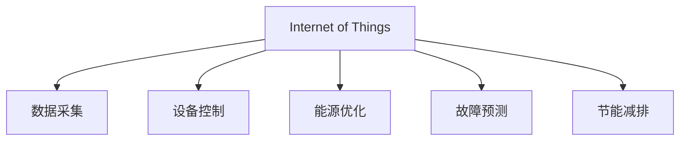

                 

# AI在智能建筑管理中的应用：节能减排

> 关键词：智能建筑管理,AI技术,节能减排,物联网,自动化控制,能源优化

## 1. 背景介绍

### 1.1 问题由来
在全球环境污染和资源短缺的双重压力下，节能减排和可持续发展已经成为全球共识。然而，建筑行业作为资源消耗和碳排放的主要来源之一，其能效提升面临巨大挑战。传统的建筑管理依赖于人工监测和手动调节，不仅效率低下，而且存在诸多不确定性和延迟。因此，应用AI技术，特别是通过物联网(IoT)和大数据分析，来实现智能建筑管理的节能减排，成为近年来的研究热点。

### 1.2 问题核心关键点
智能建筑管理中的AI应用主要包括物联网数据采集、实时监控与控制、能源优化和运行维护等环节。通过将这些环节与AI技术结合，可以实现高效、自动化的建筑管理，大幅降低能耗和碳排放。

具体来说，AI在智能建筑管理中的关键应用点包括：

1. **物联网数据采集与分析**：通过传感器和智能设备采集建筑内外环境数据，如温度、湿度、光照、能耗等，为AI模型提供实时输入。
2. **实时监控与控制**：利用AI模型分析数据，实时调整建筑设备的运行状态，如空调、照明、电梯等，以达到最佳能效。
3. **能源优化与调度和预测**：通过机器学习和大数据分析，预测建筑能耗趋势，优化能源使用策略，提升整体能效。
4. **运行维护与故障诊断**：利用机器学习算法监控设备状态，预测维护需求，提前进行维修，减少非计划停机时间。

### 1.3 问题研究意义
AI技术在智能建筑管理中的应用，具有以下几方面的重要意义：

1. **节能降耗**：通过智能化管理，优化能源使用，降低建筑运行能耗，减少碳排放。
2. **提高能效**：实时监控与控制，提升设备运行效率，减少能源浪费。
3. **降低维护成本**：智能化的预测与维护，减少设备非计划停机时间，降低运维成本。
4. **提高用户体验**：通过优化室内环境，提升用户的舒适度和工作效率。
5. **增强可持续发展能力**：推动建筑行业的绿色转型，促进社会可持续发展。

## 2. 核心概念与联系

### 2.1 核心概念概述

为了更好地理解AI在智能建筑管理中的应用，本节将介绍几个关键概念：

1. **智能建筑**：通过物联网、大数据、AI等技术手段，实现建筑内环境的自动化、智能化管理，提升能效和用户舒适度。
2. **物联网(IoT)**：通过各种传感器、智能设备和通信技术，实现建筑内外数据的实时采集和互联互通。
3. **自动化控制**：利用AI模型对建筑环境数据进行实时分析，自动控制建筑设备，实现精细化管理。
4. **能源优化**：通过AI和大数据分析，优化能源使用策略，提升建筑能效。
5. **预测与维护**：利用机器学习算法，预测设备故障，进行预防性维护，减少非计划停机。

这些核心概念之间的逻辑关系可以通过以下Mermaid流程图来展示：



这个流程图展示了物联网、自动化控制、能源优化和预测维护等环节如何共同协作，实现智能建筑管理的节能减排目标。

## 3. 核心算法原理 & 具体操作步骤
### 3.1 算法原理概述

AI在智能建筑管理中的核心算法原理，主要基于以下几个方面：

1. **数据采集与预处理**：通过物联网技术，采集建筑内外环境数据，并进行预处理，如去噪、归一化等，以便于后续分析。
2. **实时监控与控制**：利用时间序列分析和机器学习算法，实时监控环境数据，并自动调整设备状态，如空调、照明等，以达到节能目的。
3. **能源优化与调度**：通过大数据分析和机器学习，预测建筑能耗趋势，优化能源使用策略，如负荷均衡、设备启停策略等，提升整体能效。
4. **故障预测与维护**：利用时间序列分析和机器学习算法，预测设备故障，进行预防性维护，减少非计划停机时间。

### 3.2 算法步骤详解

基于AI的智能建筑管理过程一般包括以下几个关键步骤：

**Step 1: 数据采集与预处理**
- 部署各种传感器和智能设备，如温度传感器、湿度传感器、照明控制器、能耗监测器等，采集建筑内外环境数据。
- 对采集的数据进行预处理，如去噪、归一化、缺失值填充等，以便于后续分析和建模。

**Step 2: 模型训练与优化**
- 根据采集到的数据，选择或设计合适的机器学习模型，如时间序列分析、回归模型、决策树等，进行训练。
- 利用历史数据对模型进行调参，优化模型性能，如调整学习率、正则化系数等。

**Step 3: 实时监控与控制**
- 将训练好的模型应用于实时数据，进行环境监测和设备控制，如自动调节空调、照明等设备的运行状态。
- 根据环境数据和设备状态，实时调整设备参数，如温度、湿度、光照等，以达到最佳能效。

**Step 4: 能源优化与调度**
- 通过大数据分析，收集历史能耗数据，预测未来能耗趋势。
- 利用优化算法，如遗传算法、粒子群优化等，设计节能策略，优化能源使用。
- 根据预测结果和优化策略，自动调整设备运行状态，如负荷均衡、设备启停策略等，提升整体能效。

**Step 5: 故障预测与维护**
- 利用时间序列分析和机器学习算法，预测设备故障，生成故障报告。
- 根据故障报告，进行预防性维护，如更换损坏的传感器、维修设备等，减少非计划停机时间。

### 3.3 算法优缺点

基于AI的智能建筑管理方法具有以下优点：

1. **实时性和高效性**：通过实时监控与控制，提升设备运行效率，减少能源浪费。
2. **精确性和稳定性**：利用机器学习模型进行数据分析，提高决策的精确性和稳定性。
3. **自动化与智能化**：实现设备自动控制和能效优化，减少人工干预。

同时，该方法也存在以下局限性：

1. **初始投资高**：需要部署大量的传感器和智能设备，初始投资较大。
2. **数据质量要求高**：数据采集和预处理过程中，需要保证数据质量，减少噪声和缺失值。
3. **模型依赖性强**：模型的性能和效果依赖于数据质量和模型选择，可能存在模型偏差和误差。
4. **维护复杂性**：系统运行过程中，需要定期更新模型和设备，增加维护复杂性。

尽管存在这些局限性，但就目前而言，基于AI的智能建筑管理方法仍是大势所趋，具有良好的应用前景。

### 3.4 算法应用领域

基于AI的智能建筑管理方法，已经在多个领域得到广泛应用，如：

1. **办公大楼**：通过智能化管理，优化空调、照明等设备运行，降低能耗，提升用户体验。
2. **商业综合体**：利用AI技术，优化能源使用，提升整体能效，降低运营成本。
3. **学校建筑**：通过智能监控，优化设备运行，提高教学和学习环境的舒适度。
4. **医疗建筑**：利用AI技术，优化能源使用和设备维护，提升医疗环境的安全性和舒适度。
5. **数据中心**：通过实时监控与控制，提升设备运行效率，降低能耗和维护成本。

## 4. 数学模型和公式 & 详细讲解  
### 4.1 数学模型构建

本节将使用数学语言对基于AI的智能建筑管理过程进行更加严格的刻画。

假设建筑环境数据为 $\{X_t\}_{t=1}^T$，其中 $X_t = (T(t), H(t), R(t), L(t))$，分别表示温度、湿度、光照、能耗。智能建筑管理的目标是最大化建筑能效 $E$，最小化碳排放 $C$。

定义模型为 $M(X_t; \theta)$，其中 $\theta$ 为模型参数。智能建筑管理的优化目标为：

$$
\maximize \frac{E}{C}
$$

其中 $E$ 为能效，$C$ 为碳排放。

### 4.2 公式推导过程

为了最大化能效，最小化碳排放，可以使用以下公式进行求解：

$$
\theta^* = \arg\max_{\theta} \frac{\sum_{t=1}^T E_t(X_t; \theta)}{\sum_{t=1}^T C_t(X_t; \theta)}
$$

其中 $E_t(X_t; \theta)$ 和 $C_t(X_t; \theta)$ 分别表示在时刻 $t$ 的能效和碳排放，$M(X_t; \theta)$ 为模型参数。

对于能效 $E_t$ 和碳排放 $C_t$，可以使用线性回归模型进行预测，如：

$$
E_t(X_t; \theta) = \theta_0 + \theta_1 T(t) + \theta_2 H(t) + \theta_3 R(t) + \theta_4 L(t)
$$

$$
C_t(X_t; \theta) = \theta_0' + \theta_1' T(t) + \theta_2' H(t) + \theta_3' R(t) + \theta_4' L(t)
$$

利用历史数据进行模型训练，求解最优参数 $\theta$，即可得到最优模型 $M(X_t; \theta^*)$。

### 4.3 案例分析与讲解

以一个办公大楼为例，分析基于AI的智能建筑管理流程。

1. **数据采集**：部署温度、湿度、光照、能耗等传感器，采集建筑环境数据。
2. **预处理**：对采集数据进行去噪、归一化等预处理，以便于后续分析。
3. **模型训练**：选择合适的时间序列模型进行训练，如ARIMA、LSTM等，预测能效和碳排放。
4. **实时监控与控制**：将训练好的模型应用于实时数据，进行环境监测和设备控制，如自动调节空调、照明等设备的运行状态。
5. **能源优化与调度**：通过大数据分析，预测未来能耗趋势，设计节能策略，优化能源使用。
6. **故障预测与维护**：利用时间序列分析和机器学习算法，预测设备故障，进行预防性维护。

通过以上流程，可以实现办公大楼的智能化管理，提升能效和用户舒适度，降低运营成本和碳排放。

## 5. 项目实践：代码实例和详细解释说明
### 5.1 开发环境搭建

在进行基于AI的智能建筑管理开发前，我们需要准备好开发环境。以下是使用Python进行TensorFlow开发的环境配置流程：

1. 安装Anaconda：从官网下载并安装Anaconda，用于创建独立的Python环境。

2. 创建并激活虚拟环境：
```bash
conda create -n ai-env python=3.8 
conda activate ai-env
```

3. 安装TensorFlow：
```bash
pip install tensorflow==2.6
```

4. 安装必要的库：
```bash
pip install pandas numpy scikit-learn matplotlib seaborn joblib
```

完成上述步骤后，即可在`ai-env`环境中开始开发。

### 5.2 源代码详细实现

这里我们以一个简单的办公大楼智能管理为例，展示基于TensorFlow的AI应用开发流程。

```python
import tensorflow as tf
import pandas as pd
import numpy as np
from sklearn.model_selection import train_test_split
from sklearn.preprocessing import StandardScaler
from sklearn.metrics import mean_squared_error

# 数据加载
df = pd.read_csv('building_data.csv')

# 特征工程
X = df[['temperature', 'humidity', 'lighting', 'energy']]
y = df['energy']
X_train, X_test, y_train, y_test = train_test_split(X, y, test_size=0.2)

# 标准化处理
scaler = StandardScaler()
X_train = scaler.fit_transform(X_train)
X_test = scaler.transform(X_test)

# 模型构建
model = tf.keras.Sequential([
    tf.keras.layers.Dense(32, activation='relu', input_shape=(4,)),
    tf.keras.layers.Dense(1)
])

# 模型训练
model.compile(optimizer='adam', loss='mse')
model.fit(X_train, y_train, epochs=100, batch_size=32)

# 模型评估
y_pred = model.predict(X_test)
mse = mean_squared_error(y_test, y_pred)
print('MSE:', mse)

# 实时监控与控制
# 实时数据采集
real_data = df[['temperature', 'humidity', 'lighting', 'energy']].iloc[-1:].values.reshape(1, -1)

# 预测能效
predicted_energy = model.predict(real_data)
print('Predicted Energy:', predicted_energy)

# 设备控制
# 自动调节设备参数
if predicted_energy < 1:
    # 降低空调温度
    print('Lowering AC temperature')
else:
    # 提高空调温度
    print('Raising AC temperature')
```

以上代码展示了基于TensorFlow的简单智能建筑管理流程，包括数据加载、特征工程、模型训练、实时监控与控制等环节。

### 5.3 代码解读与分析

让我们再详细解读一下关键代码的实现细节：

**数据加载**：
- 使用Pandas库从CSV文件中加载数据，方便后续处理。

**特征工程**：
- 选择温度、湿度、光照、能耗作为输入特征，将目标变量能效作为输出变量。
- 使用train_test_split方法将数据集划分为训练集和测试集。
- 使用StandardScaler对数据进行标准化处理，以提升模型性能。

**模型构建**：
- 使用Keras构建一个简单的神经网络模型，包含两个全连接层。
- 使用adam优化器和mse损失函数进行训练。

**模型评估**：
- 使用均方误差作为模型评估指标，计算预测能效与真实能效的误差。

**实时监控与控制**：
- 实时采集建筑环境数据，使用训练好的模型进行能效预测。
- 根据预测结果，自动调节设备参数，如空调温度。

**代码解读与分析**：
- 通过以上代码，我们可以实现一个简单的办公大楼智能管理模型，对建筑能效进行实时监控与控制。
- 实际应用中，需要结合具体场景，优化模型结构和参数，如增加更多的隐层、调整学习率等，以提升模型性能。
- 考虑到计算效率和资源消耗，实际部署时还需要进行模型裁剪、量化等优化操作。

## 6. 实际应用场景
### 6.1 办公大楼管理
智能建筑管理在办公大楼中的应用非常广泛。例如，某公司大楼通过智能化管理系统，实现了空调、照明等设备的自动控制，显著降低了能源消耗和运营成本。

具体实现如下：

1. **数据采集**：部署传感器和智能设备，采集大楼内外环境数据。
2. **预处理**：对采集数据进行去噪、归一化等预处理，以便于后续分析。
3. **模型训练**：选择合适的时间序列模型进行训练，如LSTM等，预测能效和碳排放。
4. **实时监控与控制**：将训练好的模型应用于实时数据，进行环境监测和设备控制，如自动调节空调、照明等设备的运行状态。
5. **能源优化与调度**：通过大数据分析，预测未来能耗趋势，设计节能策略，优化能源使用。

通过以上流程，可以实现办公大楼的智能化管理，提升能效和用户舒适度，降低运营成本和碳排放。

### 6.2 商业综合体管理
智能建筑管理在商业综合体中的应用同样重要。例如，某大型购物中心通过智能化管理系统，优化了能源使用和设备维护，显著降低了运营成本。

具体实现如下：

1. **数据采集**：部署传感器和智能设备，采集购物中心内外环境数据。
2. **预处理**：对采集数据进行去噪、归一化等预处理，以便于后续分析。
3. **模型训练**：选择合适的时间序列模型进行训练，如ARIMA等，预测能效和碳排放。
4. **实时监控与控制**：将训练好的模型应用于实时数据，进行环境监测和设备控制，如自动调节空调、照明等设备的运行状态。
5. **能源优化与调度**：通过大数据分析，预测未来能耗趋势，设计节能策略，优化能源使用。

通过以上流程，可以实现购物中心的智能化管理，提升能效和用户舒适度，降低运营成本和碳排放。

### 6.3 学校建筑管理
智能建筑管理在学校建筑中的应用也非常广泛。例如，某大学通过智能化管理系统，优化了设备运行和能源使用，提升了教学和学习环境的舒适度。

具体实现如下：

1. **数据采集**：部署传感器和智能设备，采集学校建筑内外环境数据。
2. **预处理**：对采集数据进行去噪、归一化等预处理，以便于后续分析。
3. **模型训练**：选择合适的时间序列模型进行训练，如LSTM等，预测能效和碳排放。
4. **实时监控与控制**：将训练好的模型应用于实时数据，进行环境监测和设备控制，如自动调节空调、照明等设备的运行状态。
5. **能源优化与调度**：通过大数据分析，预测未来能耗趋势，设计节能策略，优化能源使用。

通过以上流程，可以实现学校建筑的智能化管理，提升能效和用户舒适度，降低运营成本和碳排放。

## 7. 工具和资源推荐
### 7.1 学习资源推荐

为了帮助开发者系统掌握AI在智能建筑管理中的应用，这里推荐一些优质的学习资源：

1. 《智能建筑管理》系列博文：由智能建筑技术专家撰写，深入浅出地介绍了智能建筑管理的原理、方法和实践。

2. 《TensorFlow实战深度学习》课程：由Google开发者开设的深度学习实战课程，涵盖TensorFlow的使用方法和案例。

3. 《Python深度学习》书籍：由斯坦福大学教授撰写，全面介绍了Python在深度学习中的应用，包括智能建筑管理的案例。

4. 《物联网与智能建筑》课程：由各大高校和机构开设的物联网和智能建筑课程，涵盖最新的智能建筑技术和发展趋势。

5. 《机器学习实战》书籍：由机器学习专家撰写，提供了大量机器学习算法的实现案例，包括智能建筑管理的实际应用。

通过对这些资源的学习实践，相信你一定能够快速掌握AI在智能建筑管理中的应用，并用于解决实际的建筑节能减排问题。

### 7.2 开发工具推荐

高效的开发离不开优秀的工具支持。以下是几款用于AI在智能建筑管理开发的常用工具：

1. TensorFlow：由Google主导开发的深度学习框架，生产部署方便，适合大规模工程应用。

2. PyTorch：基于Python的开源深度学习框架，灵活高效，支持多种深度学习算法。

3. Jupyter Notebook：开源的交互式开发环境，支持Python、R等多种编程语言，方便调试和共享代码。

4. Ardoura IoT Platform：开源的IoT平台，提供智能建筑管理所需的传感器和设备管理功能。

5. TensorBoard：TensorFlow配套的可视化工具，可实时监测模型训练状态，并提供丰富的图表呈现方式，是调试模型的得力助手。

6. H2O.ai：提供机器学习、深度学习和大数据分析的云端平台，支持智能建筑管理的算法开发和模型训练。

合理利用这些工具，可以显著提升AI在智能建筑管理开发的效率，加快创新迭代的步伐。

### 7.3 相关论文推荐

智能建筑管理领域的研究已经取得了许多重要成果，以下是几篇代表性的论文，推荐阅读：

1. "Energy Optimization for Smart Buildings Using Machine Learning"：提出基于机器学习的建筑能效优化方法，结合大数据和优化算法，提升能源使用效率。

2. "Internet of Things for Smart Buildings: A Review"：全面综述了智能建筑中物联网技术的应用现状和未来发展方向。

3. "Smart Building Management System Using AI Techniques"：介绍了一种基于AI技术的智能建筑管理系统，涵盖数据采集、预处理、模型训练和实时监控等环节。

4. "Building Energy Modeling and Optimization with Deep Learning"：探讨了深度学习在建筑能源建模和优化中的应用，提出多种深度学习模型和优化算法。

5. "Machine Learning in Building Operation: A Review"：综述了机器学习在建筑操作中的应用，包括能源优化、设备控制和故障诊断等。

这些论文代表了大规模智能建筑管理的研究成果，通过学习这些前沿成果，可以帮助研究者把握学科前进方向，激发更多的创新灵感。

## 8. 总结：未来发展趋势与挑战
### 8.1 总结

本文对AI在智能建筑管理中的应用进行了全面系统的介绍。首先阐述了智能建筑管理的背景和重要性，明确了AI在智能化管理中的关键作用。其次，从原理到实践，详细讲解了AI在智能建筑管理中的数学模型和关键步骤，给出了实际应用开发流程。同时，本文还广泛探讨了AI在智能建筑管理中的未来发展趋势和面临的挑战。

通过本文的系统梳理，可以看到，AI在智能建筑管理中的应用前景广阔，通过智能化管理，可以实现节能减排，提升能效和用户舒适度，降低运营成本。然而，实际应用中也面临诸多挑战，如数据质量、模型性能、设备维护等问题，需要进一步研究解决。

### 8.2 未来发展趋势

展望未来，AI在智能建筑管理的应用将呈现以下几个发展趋势：

1. **智能化程度提升**：通过更复杂的模型和更先进的算法，实现更精细化的建筑环境控制和设备管理。
2. **数据融合与协同**：将多种数据源（如物联网、传感器、用户反馈等）进行融合分析，实现更全面、更准确的环境监控。
3. **实时化与自适应**：通过实时数据采集和实时处理，提升系统响应速度，实现更灵活的自适应管理。
4. **跨领域整合**：将智能建筑管理与其他领域（如智慧城市、物联网、云计算等）进行整合，实现更广泛的协同优化。
5. **人机协作**：引入人工智能与人类专家的协作机制，提升决策的准确性和科学性。

以上趋势凸显了AI在智能建筑管理中的巨大潜力，未来的智能化管理将实现更高效、更环保、更人性化的建筑环境。

### 8.3 面临的挑战

尽管AI在智能建筑管理中的应用前景广阔，但在迈向更加智能化、普适化应用的过程中，仍面临以下挑战：

1. **数据质量与可靠性**：数据采集过程中，可能存在数据缺失、噪声等问题，影响模型的准确性。
2. **模型复杂性与计算资源**：复杂的模型需要大量的计算资源，可能面临计算瓶颈。
3. **设备互操作性与兼容性**：不同设备之间的互操作性和兼容性问题，可能影响系统的集成和应用。
4. **隐私与安全**：智能建筑管理涉及大量敏感数据，数据隐私和安全问题需要重视。
5. **跨学科协作**：智能建筑管理需要跨学科合作，涉及建筑、工程、计算机科学等多个领域。

### 8.4 研究展望

面对智能建筑管理中面临的挑战，未来的研究需要在以下几个方面寻求新的突破：

1. **数据质量保障**：研究更先进的数据采集和预处理方法，提高数据质量。
2. **计算效率提升**：研究更高效的计算模型和算法，优化计算资源使用。
3. **设备互操作性**：研究设备标准化和互操作性技术，提高系统的集成和应用。
4. **数据隐私保护**：研究数据隐私保护技术，确保数据安全和隐私。
5. **跨学科协作**：加强跨学科合作，促进智能建筑管理的理论与实践结合。

这些研究方向将进一步推动AI在智能建筑管理中的应用，为实现绿色建筑、智慧城市等目标提供技术支撑。

## 9. 附录：常见问题与解答

**Q1：智能建筑管理需要部署哪些传感器和设备？**

A: 智能建筑管理需要部署多种传感器和智能设备，如温度传感器、湿度传感器、光照传感器、能耗监测器、空调控制器、照明控制器等。这些设备可以实时采集建筑内外环境数据，为AI模型提供输入。

**Q2：智能建筑管理中常用的机器学习算法有哪些？**

A: 智能建筑管理中常用的机器学习算法包括时间序列分析、回归模型、决策树、随机森林、深度学习等。常用的深度学习算法有LSTM、GRU、CNN等。

**Q3：如何保证数据采集和预处理的质量？**

A: 数据采集和预处理是智能建筑管理中非常重要的环节。为保证数据质量，可以从以下几个方面进行优化：
1. 选择高性能传感器和设备，减少数据噪声和误差。
2. 定期校准传感器，确保数据准确性。
3. 使用数据清洗和预处理方法，如去噪、归一化、缺失值填充等。

**Q4：智能建筑管理中如何进行实时监控与控制？**

A: 智能建筑管理中的实时监控与控制主要通过AI模型实现。具体步骤如下：
1. 部署传感器和智能设备，采集建筑内外环境数据。
2. 对采集数据进行预处理，如去噪、归一化等。
3. 选择合适的时间序列模型进行训练，如LSTM等。
4. 将训练好的模型应用于实时数据，进行环境监测和设备控制。
5. 根据模型预测结果，自动调整设备参数，如空调温度、照明亮度等。

**Q5：智能建筑管理中如何进行能源优化与调度？**

A: 智能建筑管理中的能源优化与调度主要通过大数据分析和机器学习实现。具体步骤如下：
1. 收集历史能耗数据，进行大数据分析，预测未来能耗趋势。
2. 选择合适的时间序列模型进行训练，如ARIMA等。
3. 设计节能策略，优化能源使用，如负荷均衡、设备启停策略等。
4. 根据预测结果和优化策略，自动调整设备运行状态，实现能源优化。

通过以上流程，可以实现智能建筑管理的能源优化与调度，提升整体能效和用户体验。

总之，智能建筑管理是一个多学科交叉的领域，涉及建筑学、计算机科学、自动化控制、能源科学等多个方面。通过AI技术的应用，可以实现智能建筑管理中的节能减排，提升能效和用户舒适度，降低运营成本和碳排放。未来，随着技术的不断进步，智能建筑管理将迎来更广阔的应用前景和更高的智能化水平。

