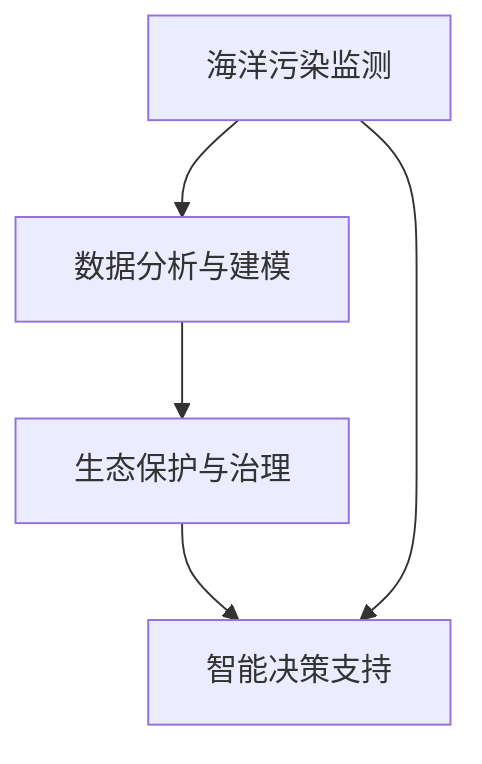

                 

# AI在海洋污染监测中的应用：保护生态环境

> 关键词：人工智能,海洋污染监测,环境监测,数据分析,预测模型,生态保护

## 1. 背景介绍

### 1.1 问题由来

随着全球工业化的推进，海洋污染问题日趋严重。海洋污染不仅破坏了海洋生态系统的平衡，还威胁着人类社会的可持续生存。据统计，全球每年有800万吨塑料垃圾进入海洋，严重影响了海洋生物的生长环境和健康。为了有效应对这一全球性问题，各国政府、科研机构和企业纷纷行动起来，探索利用先进技术手段进行海洋污染监测和治理。

### 1.2 问题核心关键点

- **海洋污染监测**：通过各类传感器、遥感技术等手段，实时收集海洋环境数据，包括水质、水温、悬浮物、生物多样性等，评估海洋污染状况。
- **数据分析与建模**：利用机器学习和深度学习技术，对收集的数据进行分析，构建预测模型，识别污染源，预测污染趋势。
- **生态保护与治理**：根据监测和分析结果，制定科学的治理策略，修复受损生态系统，保护海洋生物多样性。
- **智能决策支持**：将AI技术应用于海洋治理决策过程中，提供科学依据，优化资源配置，提升治理效率。

## 2. 核心概念与联系

### 2.1 核心概念概述

- **海洋污染监测**：通过各种技术手段收集海洋环境数据，评估污染状况，监控污染变化。
- **数据分析与建模**：利用统计分析和机器学习技术，对海洋污染数据进行分析，构建模型，预测污染趋势，识别污染源。
- **生态保护与治理**：基于污染监测和分析结果，制定科学的治理策略，修复受损生态系统，保护海洋生物多样性。
- **智能决策支持**：将AI技术应用于海洋治理决策过程中，提升决策效率和科学性。

这些核心概念之间通过一系列技术手段和方法进行联系，共同构成了海洋污染监测和治理的完整框架。

### 2.2 核心概念原理和架构的 Mermaid 流程图



## 3. 核心算法原理 & 具体操作步骤

### 3.1 算法原理概述

海洋污染监测和治理的AI解决方案主要基于机器学习和深度学习技术。通过收集海洋环境数据，构建数据集，然后使用监督学习、无监督学习或强化学习等方法，训练模型，分析海洋污染状况，预测污染趋势，并制定科学治理策略。

**监督学习**：用于分类和回归问题，如水质分类、悬浮物浓度预测等。通过标注数据集训练模型，对未标注数据进行分类或回归预测。

**无监督学习**：用于聚类和降维问题，如水质聚类、生物多样性分析等。通过未标注数据集训练模型，发现数据的内在结构和规律。

**强化学习**：用于优化问题，如智能调度、路径规划等。通过奖励机制和环境反馈，训练模型，优化决策策略。

### 3.2 算法步骤详解

#### 3.2.1 数据收集

- 使用传感器、遥感技术等手段，收集海洋环境数据，包括水质、水温、悬浮物、生物多样性等。
- 将数据转换为可处理的格式，如CSV、JSON等，供后续分析使用。

#### 3.2.2 数据清洗与预处理

- 清洗数据，去除噪声和异常值，填补缺失值。
- 标准化或归一化数据，使其符合模型输入要求。

#### 3.2.3 特征工程

- 提取和选择有意义的特征，如水质指标、悬浮物浓度、水温等。
- 构建特征组合，如水质指数、生物多样性指数等。

#### 3.2.4 模型训练

- 选择合适的模型，如随机森林、支持向量机、神经网络等。
- 划分训练集、验证集和测试集，使用训练集训练模型。
- 在验证集上调整模型参数，防止过拟合。
- 在测试集上评估模型性能，选择最优模型。

#### 3.2.5 模型评估与优化

- 使用评估指标，如准确率、召回率、F1分数等，评估模型性能。
- 调整模型参数，如学习率、正则化参数等，优化模型性能。

#### 3.2.6 预测与决策支持

- 使用训练好的模型，对新的海洋环境数据进行预测，识别污染源，预测污染趋势。
- 结合领域知识，制定科学的治理策略，修复受损生态系统。
- 提供智能决策支持，优化资源配置，提升治理效率。

### 3.3 算法优缺点

#### 3.3.1 优点

- **自动化**：AI技术可以自动化处理大量数据，减少人力投入，提升效率。
- **精确性**：基于数据驱动的预测模型，可以提供高精度的预测结果，帮助制定科学的治理策略。
- **可扩展性**：模型可以根据新数据进行不断更新和优化，适应环境变化。
- **智能决策支持**：提供科学的决策依据，提升治理效率和效果。

#### 3.3.2 缺点

- **数据依赖**：模型效果依赖于数据质量，数据缺失或错误可能导致模型失效。
- **模型复杂性**：复杂模型可能难以解释，缺乏可解释性，增加了使用难度。
- **计算资源需求高**：训练大型模型需要高性能计算资源，增加了成本。
- **动态适应性不足**：模型需要定期更新，以适应环境变化，增加了维护成本。

### 3.4 算法应用领域

AI技术在海洋污染监测和治理中的应用领域广泛，包括但不限于：

- **水质监测**：通过传感器和遥感技术，实时监测水质变化，识别污染源。
- **悬浮物监测**：利用遥感和传感器技术，监测悬浮物浓度，评估污染程度。
- **生物多样性分析**：通过数据分析，评估生物多样性变化，保护海洋生态。
- **路径规划与调度**：利用强化学习，优化海上作业路径，提高作业效率。
- **智能预警系统**：构建智能预警系统，及时发现海洋污染，减少损失。

## 4. 数学模型和公式 & 详细讲解 & 举例说明

### 4.1 数学模型构建

海洋污染监测和治理的数学模型构建主要包括以下几个部分：

1. **数据预处理模型**：对原始数据进行清洗、归一化等预处理操作。
2. **特征选择与提取模型**：选择和提取对预测任务有帮助的特征。
3. **回归模型**：用于预测连续型变量的模型，如悬浮物浓度、水温等。
4. **分类模型**：用于分类问题的模型，如水质分类、生物多样性分析等。

### 4.2 公式推导过程

以悬浮物浓度预测为例，假设数据集为 $D=\{(x_i,y_i)\}_{i=1}^N$，其中 $x_i$ 为输入特征， $y_i$ 为输出变量（悬浮物浓度）。回归模型选择线性回归模型，表达式为：

$$
y_i = \theta_0 + \sum_{j=1}^n \theta_j x_{ij}
$$

其中 $\theta_0$ 为截距， $\theta_j$ 为特征系数。

通过最小二乘法求解 $\theta_0$ 和 $\theta_j$，使得模型在训练集上的误差最小：

$$
\hat{\theta} = \mathop{\arg\min}_{\theta} \sum_{i=1}^N (y_i - \theta_0 - \sum_{j=1}^n \theta_j x_{ij})^2
$$

求解得到最优参数 $\hat{\theta}$，将其代入模型，即可对新数据进行悬浮物浓度预测。

### 4.3 案例分析与讲解

假设某海域的悬浮物浓度数据集为 $D=\{(x_i,y_i)\}_{i=1}^N$，其中 $x_i$ 为光照、温度、溶解氧等特征， $y_i$ 为悬浮物浓度。

1. **数据预处理**：对原始数据进行缺失值填补、异常值处理等操作。
2. **特征选择**：选择对悬浮物浓度预测有帮助的特征，如光照强度、温度等。
3. **模型训练**：使用线性回归模型，训练模型，调整系数。
4. **模型评估**：使用测试集评估模型性能，选择最优模型。

## 5. 项目实践：代码实例和详细解释说明

### 5.1 开发环境搭建

- **编程语言**：Python
- **框架**：TensorFlow、Pandas、Scikit-learn、Matplotlib
- **工具**：Jupyter Notebook、Google Colab、Pycharm

### 5.2 源代码详细实现

以下是利用TensorFlow进行悬浮物浓度预测的代码实现：

```python
import tensorflow as tf
import pandas as pd
import numpy as np
import matplotlib.pyplot as plt

# 加载数据集
data = pd.read_csv('suspended_particulates.csv')

# 数据预处理
data = data.dropna()  # 删除缺失值
data['light_intensity'] = np.log(data['light_intensity'])  # 对光照强度进行对数处理

# 特征选择
features = ['temperature', 'light_intensity', 'dissolved_oxygen']
target = 'suspended_particulates'

# 划分训练集和测试集
train_data = data.sample(frac=0.8, random_state=42)
test_data = data.drop(train_data.index)

# 数据标准化
from sklearn.preprocessing import StandardScaler
scaler = StandardScaler()
train_data[features] = scaler.fit_transform(train_data[features])
test_data[features] = scaler.transform(test_data[features])

# 构建模型
model = tf.keras.Sequential([
    tf.keras.layers.Dense(64, activation='relu', input_shape=(len(features),)),
    tf.keras.layers.Dense(64, activation='relu'),
    tf.keras.layers.Dense(1)
])

model.compile(optimizer='adam', loss='mse', metrics=['mae'])

# 模型训练
history = model.fit(train_data[features], train_data[target], epochs=50, batch_size=32, validation_split=0.2)

# 模型评估
test_loss, test_mae = model.evaluate(test_data[features], test_data[target])

# 模型预测
predictions = model.predict(test_data[features])

# 输出结果
print('测试集MAE：', test_mae)
plt.plot(history.history['loss'], label='训练集')
plt.plot(history.history['val_loss'], label='验证集')
plt.xlabel('Epoch')
plt.ylabel('损失')
plt.legend()
plt.show()
```

### 5.3 代码解读与分析

以上代码实现了基于TensorFlow的悬浮物浓度预测模型，包括以下关键步骤：

1. **数据加载与预处理**：加载数据集，删除缺失值，对光照强度进行对数处理。
2. **特征选择与标准化**：选择对悬浮物浓度预测有帮助的特征，并使用标准化方法处理数据。
3. **模型构建与训练**：使用Sequential模型，定义网络结构，进行模型训练。
4. **模型评估与预测**：使用测试集评估模型性能，进行模型预测。

## 6. 实际应用场景

### 6.1 水质监测

水质监测是海洋污染监测的重要应用场景之一。通过传感器和遥感技术，实时收集水质数据，利用AI技术进行水质分类和污染预测，为水质治理提供科学依据。

### 6.2 悬浮物监测

悬浮物是海洋污染的重要指标之一。通过传感器和卫星遥感技术，实时监测悬浮物浓度，利用AI技术进行悬浮物浓度预测，评估污染程度，指导治理行动。

### 6.3 生物多样性分析

生物多样性是海洋生态健康的重要标志。通过数据分析和模型构建，评估生物多样性变化，监测物种灭绝风险，保护海洋生态系统。

### 6.4 智能预警系统

智能预警系统是海洋污染监测的重要工具。通过AI技术实时分析海洋环境数据，识别污染源，预测污染趋势，及时发出预警，避免污染事件发生。

## 7. 工具和资源推荐

### 7.1 学习资源推荐

1. **《机器学习实战》**：该书详细介绍了机器学习的基本概念和应用，适合初学者学习。
2. **Coursera《机器学习》课程**：由斯坦福大学教授Andrew Ng主讲，系统讲解了机器学习的基础知识和应用。
3. **Kaggle竞赛平台**：Kaggle平台提供了大量公开数据集和竞赛项目，适合学习数据分析和模型构建。
4. **GitHub**：GitHub上有许多开源项目和代码库，可以用于学习和实践。
5. **DeepLearning.AI在线课程**：由Andrew Ng教授主讲的深度学习课程，适合进阶学习。

### 7.2 开发工具推荐

1. **TensorFlow**：TensorFlow是Google开发的深度学习框架，适合大规模模型训练。
2. **PyTorch**：PyTorch是Facebook开发的深度学习框架，适合快速原型开发。
3. **Jupyter Notebook**：Jupyter Notebook是一个开源的笔记本格式，适合交互式数据分析和模型构建。
4. **Google Colab**：Google Colab是一个在线Jupyter Notebook环境，免费提供GPU算力，适合大数据计算。
5. **Pycharm**：Pycharm是一款Python集成开发环境，支持代码编辑、调试和部署。

### 7.3 相关论文推荐

1. **《海洋污染监测与治理》**：详细介绍了海洋污染监测和治理的技术方法和应用案例。
2. **《基于深度学习的海洋污染监测》**：介绍了深度学习技术在海洋污染监测中的应用。
3. **《海洋生物多样性监测与保护》**：介绍了海洋生物多样性监测和保护的技术方法和应用案例。
4. **《智能预警系统在海洋污染监测中的应用》**：介绍了智能预警系统在海洋污染监测中的应用。

## 8. 总结：未来发展趋势与挑战

### 8.1 研究成果总结

本文系统介绍了AI在海洋污染监测中的应用，包括数据收集、预处理、模型训练、预测与决策支持等关键环节。通过对现有技术的总结和分析，提出未来研究的方向和挑战。

### 8.2 未来发展趋势

未来AI在海洋污染监测中的应用将呈现以下趋势：

1. **自动化与智能化**：自动化处理数据，智能化分析预测，提高监测和治理效率。
2. **多模态融合**：融合多种数据源，如传感器、遥感、卫星等，提供更全面、准确的环境信息。
3. **边缘计算**：将AI模型部署到边缘设备，实时处理数据，提高响应速度。
4. **实时可视化**：构建实时可视化系统，实时展示监测结果，辅助决策。

### 8.3 面临的挑战

未来AI在海洋污染监测中的应用仍面临以下挑战：

1. **数据获取难度大**：海洋环境数据获取难度大，数据缺失和错误可能导致模型失效。
2. **模型复杂性高**：模型复杂度增加，导致计算资源需求高，维护成本增加。
3. **环境适应性不足**：模型需要定期更新，以适应环境变化，增加了维护成本。
4. **数据隐私与安全**：海洋数据涉及敏感信息，数据隐私和安全问题需要特别关注。

### 8.4 研究展望

未来AI在海洋污染监测中的应用需要在以下方面进行深入研究：

1. **大数据与深度学习**：利用大数据和深度学习技术，提升模型的精度和泛化能力。
2. **多模态数据融合**：融合多种数据源，提高模型的鲁棒性和准确性。
3. **实时可视化与决策支持**：构建实时可视化系统，提供智能决策支持，提升治理效率。
4. **模型优化与可解释性**：优化模型结构，提高模型的可解释性，增强治理决策的科学性。

## 9. 附录：常见问题与解答

**Q1：海洋污染监测中数据质量如何保证？**

A：保证数据质量是海洋污染监测的关键。数据获取和处理过程中需要注意以下几点：

1. 传感器和遥感设备的维护和校准，确保数据的准确性和稳定性。
2. 数据清洗和预处理，删除噪声和异常值，填补缺失值。
3. 数据标准化和归一化，使其符合模型输入要求。

**Q2：如何选择和构建适合海洋污染监测的模型？**

A：选择和构建适合海洋污染监测的模型需要考虑以下几个因素：

1. 数据类型和特点：选择与数据类型和特点相匹配的模型，如回归模型、分类模型、聚类模型等。
2. 数据量和复杂度：对于大规模数据，可以使用深度学习模型，如神经网络；对于小规模数据，可以使用传统机器学习模型，如随机森林、支持向量机等。
3. 模型性能和可解释性：选择具有高精度和可解释性的模型，提升模型的可靠性和可信度。

**Q3：如何利用AI技术进行智能决策支持？**

A：利用AI技术进行智能决策支持主要包括以下几个步骤：

1. 数据收集与预处理：收集和处理相关数据，确保数据质量。
2. 模型构建与训练：构建适合的模型，利用训练数据训练模型。
3. 模型评估与优化：使用测试数据评估模型性能，调整模型参数，优化模型性能。
4. 智能决策系统：将训练好的模型集成到智能决策系统中，提供决策依据。

**Q4：AI技术在海洋污染监测中如何处理数据隐私与安全问题？**

A：处理数据隐私与安全问题需要注意以下几点：

1. 数据加密与脱敏：对敏感数据进行加密和脱敏处理，确保数据隐私。
2. 访问控制与权限管理：限制数据访问权限，确保数据安全。
3. 数据匿名化与去标识化：对数据进行匿名化和去标识化处理，减少数据泄露风险。

---

作者：禅与计算机程序设计艺术 / Zen and the Art of Computer Programming

