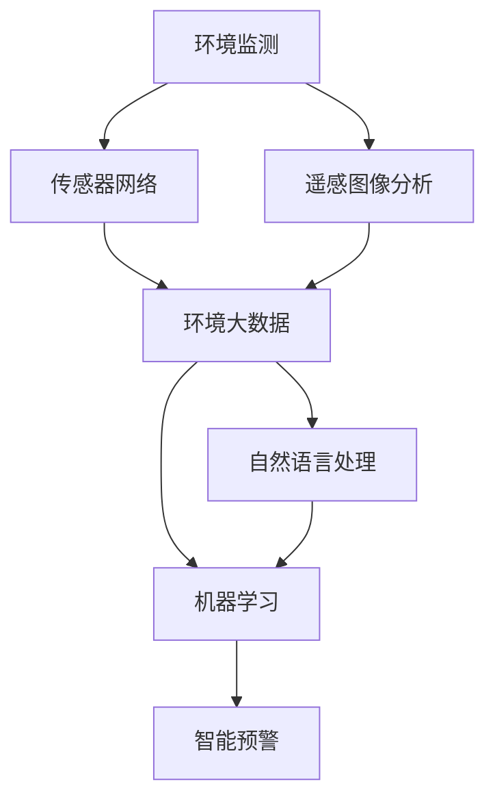

                 

# AI在环境保护中的应用：监测与预警

> 关键词：人工智能,环境监测,智能预警,自然语言处理,机器学习,传感器网络,遥感图像分析,环境大数据

## 1. 背景介绍

### 1.1 问题由来
近年来，全球气候变化和环境污染问题日益严峻，已经成为各国政府和社会公众关注的焦点。如何有效监测环境状况，及时预警环境风险，是应对环境问题的重要手段。传统的环境监测方法依赖人力和有限的监测站点，存在时空分辨率低、数据质量差等不足。随着人工智能技术的发展，尤其是机器学习、深度学习和大数据技术的应用，环境监测与预警也迎来了新的突破。AI技术能够高效、准确地处理和分析海量环境数据，提供智能化的环境监测与预警服务。

### 1.2 问题核心关键点
环境监测与预警的核心问题在于：如何利用AI技术高效、准确地处理和分析海量环境数据，提供实时、精准的环境监测与预警服务。关键技术点包括：
1. 传感器网络与遥感图像的实时数据采集与传输。
2. 自然语言处理(NLP)技术对环境数据的文字描述进行解析与理解。
3. 机器学习与深度学习算法对环境数据进行特征提取与模式识别。
4. 大数据技术对海量环境数据进行高效存储与分析。
5. 智能预警系统对环境风险进行实时监测与预警。

### 1.3 问题研究意义
研究和应用AI技术进行环境监测与预警，对于保护生态环境、应对环境风险、促进可持续发展具有重要意义：
1. 提升环境监测效率与精度。通过AI技术，可以实现对环境数据的实时监测与分析，弥补传统监测方法的局限性。
2. 实现环境风险的智能预警。AI技术能够实时分析环境数据，及时识别异常情况，发出预警，帮助相关部门迅速采取应对措施。
3. 推动环境数据的智能化管理。利用AI技术，可以整合多种数据来源，进行综合分析，为环境管理决策提供支持。
4. 促进环保意识的普及与提升。智能预警系统可以向公众发布实时环境状况，提高社会对环境保护的关注度。
5. 推动环保技术的创新与发展。AI技术的应用，将推动环境监测与预警技术的不断进步，催生新的环保技术。

## 2. 核心概念与联系

### 2.1 核心概念概述

为更好地理解基于AI的环境监测与预警方法，本节将介绍几个密切相关的核心概念：

- 人工智能(Artificial Intelligence, AI)：通过算法和计算技术，使计算机具备类人的智能行为，包括感知、学习、推理、决策等。
- 环境监测(Enviromental Monitoring)：对环境因子（如水质、空气质量、噪声等）进行实时或定期监测，以评估环境质量状态。
- 智能预警(Intelligent Warning)：利用AI技术对环境数据进行分析，实时监测环境风险，并发出预警，辅助采取应对措施。
- 自然语言处理(Natural Language Processing, NLP)：使计算机能够理解和生成自然语言，进行文本分析、情感分析、实体识别等任务。
- 机器学习(Machine Learning, ML)：通过数据驱动的方法，使计算机具备自我学习和优化能力，应用于分类、回归、聚类等任务。
- 深度学习(Deep Learning, DL)：一种基于多层神经网络的机器学习技术，擅长处理大规模非结构化数据，如图像、声音等。
- 传感器网络(Sensor Network)：由多个传感器节点组成的网络，实现对环境数据的实时采集与传输。
- 遥感图像分析(Remote Sensing Image Analysis)：利用卫星或无人机等平台采集的遥感图像，进行环境变化监测和分析。
- 环境大数据(Environment Big Data)：涉及环境监测、气象、生态等多个领域的海量数据，需要高效存储与分析。

这些核心概念之间的逻辑关系可以通过以下Mermaid流程图来展示：



这个流程图展示了大环境监测与预警的关键技术环节：

1. 环境监测通过传感器网络采集数据。
2. 遥感图像分析补充传感器网络，提供更全面的环境数据。
3. 环境大数据整合多种数据来源，进行综合分析。
4. 自然语言处理对文字描述的环境数据进行解析。
5. 机器学习与深度学习算法对环境数据进行特征提取与模式识别。
6. 智能预警系统实时监测环境数据，发出预警。

## 3. 核心算法原理 & 具体操作步骤
### 3.1 算法原理概述

基于AI的环境监测与预警方法，本质上是一种数据驱动的环境分析与决策支持技术。其核心思想是：利用传感器网络与遥感图像采集的环境数据，结合自然语言处理技术对文字描述的环境数据进行解析与理解，通过机器学习与深度学习算法对环境数据进行特征提取与模式识别，最终构建智能预警系统，实时监测环境风险，发出预警。

形式化地，假设环境监测数据为 $D$，遥感图像数据为 $I$，文字描述数据为 $T$，则智能预警系统的目标是最小化环境风险 $R$，即：

$$
R = \min_{\theta} \mathcal{L}(D, I, T, \theta)
$$

其中 $\mathcal{L}$ 为风险评估损失函数，用于衡量模型预测的环境风险与实际风险之间的差异。常见的风险评估方法包括：

- 预测准确率（Accuracy）：模型预测与实际环境风险的匹配程度。
- 召回率（Recall）：模型识别出的真实风险中，有多少被正确预测。
- F1分数（F1 Score）：准确率和召回率的调和平均。
- 风险曲线（ROC Curve）：不同阈值下模型的真阳性率和假阳性率。
- 风险矩阵（Confusion Matrix）：模型预测与实际结果的对比矩阵。

通过梯度下降等优化算法，智能预警系统不断更新模型参数 $\theta$，最小化损失函数 $\mathcal{L}$，使得模型输出的环境风险逼近真实风险 $R$。由于 $\theta$ 已经通过机器学习或深度学习算法获得了较好的初始化，因此即便在实时数据采集和分析过程中，也能较快收敛到理想的风险评估模型。

### 3.2 算法步骤详解

基于AI的环境监测与预警方法一般包括以下几个关键步骤：

**Step 1: 数据采集与预处理**
- 通过传感器网络与遥感图像采集环境监测数据 $D$ 和 $I$，并进行预处理，如去除噪声、标准化等。
- 对环境数据的文字描述 $T$ 进行分词、去除停用词等预处理。
- 将环境数据与文字描述进行数据融合，构建统一的监控指标。

**Step 2: 数据建模与特征提取**
- 使用自然语言处理技术对环境数据的文字描述进行解析与理解，提取关键特征。
- 利用机器学习与深度学习算法对环境监测数据进行特征提取，识别模式与异常。
- 构建综合环境指标，用于后续的风险评估。

**Step 3: 风险评估与预警**
- 应用风险评估算法，如回归、分类、聚类等，对综合环境指标进行风险评估。
- 根据风险评估结果，定义预警阈值，设定预警级别。
- 实时监测环境数据，一旦触发预警阈值，立即发出预警。

**Step 4: 反馈与优化**
- 收集人工反馈，评估预警系统的性能，并根据反馈数据进行模型优化。
- 定期更新模型参数，适应环境数据的变化。
- 引入持续学习技术，使模型能够不断学习和适应新的环境数据。

以上是基于AI的环境监测与预警的一般流程。在实际应用中，还需要针对具体环境监测任务的特性，对数据采集、建模、风险评估等环节进行优化设计，以进一步提升模型的预测精度和预警效果。

### 3.3 算法优缺点

基于AI的环境监测与预警方法具有以下优点：
1. 数据驱动的智能分析。通过AI技术，能够高效处理和分析海量环境数据，提供实时、精准的监测与预警服务。
2. 实时性高。传感器网络和遥感图像技术，可以实现环境数据的实时采集和传输，提供快速响应的预警能力。
3. 可扩展性强。AI技术可以整合多种数据来源，进行综合分析，适应多种环境监测任务。
4. 自适应性强。AI模型能够不断学习和适应新的环境数据，提高预警系统的鲁棒性。

同时，该方法也存在一定的局限性：
1. 数据质量要求高。AI技术对数据质量有较高要求，环境监测数据的准确性和完整性直接影响模型的性能。
2. 算法复杂度高。AI技术的实现需要较强的技术储备，算法复杂度高，对资源和算力要求较高。
3. 模型解释性不足。AI模型的黑盒特性，导致其决策过程难以解释和调试，增加了用户信任的风险。
4. 隐私与安全风险。环境数据包含敏感信息，数据采集、存储、传输过程中需要严格保护隐私和安全。

尽管存在这些局限性，但就目前而言，基于AI的环境监测与预警方法仍是目前最先进和最具前景的环境监测手段之一。未来相关研究的重点在于如何进一步降低数据采集与处理的成本，提高算法的可解释性和安全性，同时兼顾效率和效果。

### 3.4 算法应用领域

基于AI的环境监测与预警方法，已经在环境保护的多个领域得到了广泛的应用，包括但不限于：

- 水环境监测：利用传感器网络和水质监测站，监测水质指标，如pH值、溶解氧、氨氮等。通过遥感图像，监测水体变化。
- 空气质量监测：利用传感器网络，监测空气污染物的浓度，如PM2.5、SO2、NOx等。通过遥感图像，监测空气质量分布。
- 噪声监测：利用声传感器网络，监测环境噪声水平，评估噪声污染程度。
- 生态监测：利用传感器网络，监测森林植被覆盖率、生态系统健康指标等。
- 气象预测：利用传感器网络和遥感图像，进行气象数据的收集与分析，预测天气变化。
- 自然灾害预警：利用传感器网络和遥感图像，监测自然灾害迹象，如地震、洪水、干旱等。
- 生物多样性监测：利用传感器网络和遥感图像，监测生物多样性变化，评估生态系统健康。

除了上述这些经典应用外，AI技术在环境监测与预警中还涌现出更多创新场景，如智能水质预测、环境风险评估、智能垃圾分类等，为环境保护和可持续发展提供了新的技术手段。

## 4. 数学模型和公式 & 详细讲解 & 举例说明
### 4.1 数学模型构建

本节将使用数学语言对基于AI的环境监测与预警过程进行更加严格的刻画。

假设环境监测数据为 $D$，遥感图像数据为 $I$，文字描述数据为 $T$，智能预警系统的风险评估模型为 $M$，则智能预警系统的优化目标是最小化环境风险 $R$，即：

$$
R = \min_{\theta} \mathcal{L}(D, I, T, M_{\theta})
$$

其中 $\mathcal{L}$ 为风险评估损失函数，用于衡量模型预测的环境风险与实际风险之间的差异。以分类任务为例，风险评估损失函数可以表示为交叉熵损失函数：

$$
\mathcal{L}(D, I, T, M_{\theta}) = -\frac{1}{N}\sum_{i=1}^N [y_i\log M_{\theta}(x_i) + (1-y_i)\log(1-M_{\theta}(x_i))]
$$

其中 $N$ 为数据样本数，$x_i$ 为第 $i$ 个环境监测数据，$y_i$ 为环境风险标签（如0表示未发生，1表示已发生）。

### 4.2 公式推导过程

以分类任务为例，推导交叉熵损失函数的梯度计算过程。

假设模型 $M_{\theta}$ 在输入 $x$ 上的输出为 $\hat{y}=M_{\theta}(x) \in [0,1]$，表示样本属于正类的概率。真实标签 $y \in \{0,1\}$。则交叉熵损失函数定义为：

$$
\ell(M_{\theta}(x),y) = -[y\log \hat{y} + (1-y)\log (1-\hat{y})]
$$

将其代入风险评估损失函数，得：

$$
\mathcal{L}(D, I, T, M_{\theta}) = -\frac{1}{N}\sum_{i=1}^N [y_i\log M_{\theta}(x_i) + (1-y_i)\log(1-M_{\theta}(x_i))]
$$

根据链式法则，风险评估损失函数对模型参数 $\theta_k$ 的梯度为：

$$
\frac{\partial \mathcal{L}(D, I, T, M_{\theta})}{\partial \theta_k} = -\frac{1}{N}\sum_{i=1}^N (\frac{y_i}{M_{\theta}(x_i)}-\frac{1-y_i}{1-M_{\theta}(x_i)}) \frac{\partial M_{\theta}(x_i)}{\partial \theta_k}
$$

其中 $\frac{\partial M_{\theta}(x_i)}{\partial \theta_k}$ 可进一步递归展开，利用自动微分技术完成计算。

在得到风险评估损失函数的梯度后，即可带入优化算法，完成模型的迭代优化。重复上述过程直至收敛，最终得到适应环境风险的最优模型参数 $\theta^*$。

## 5. 项目实践：代码实例和详细解释说明
### 5.1 开发环境搭建

在进行环境监测与预警的开发前，我们需要准备好开发环境。以下是使用Python进行TensorFlow开发的环境配置流程：

1. 安装Anaconda：从官网下载并安装Anaconda，用于创建独立的Python环境。

2. 创建并激活虚拟环境：
```bash
conda create -n tf-env python=3.8 
conda activate tf-env
```

3. 安装TensorFlow：根据CUDA版本，从官网获取对应的安装命令。例如：
```bash
conda install tensorflow -c pytorch -c conda-forge
```

4. 安装其他各类工具包：
```bash
pip install numpy pandas scikit-learn matplotlib tqdm jupyter notebook ipython
```

完成上述步骤后，即可在`tf-env`环境中开始环境监测与预警的开发实践。

### 5.2 源代码详细实现

这里我们以水环境监测为例，给出使用TensorFlow进行环境监测与预警的Python代码实现。

首先，定义环境监测数据的处理函数：

```python
import tensorflow as tf
from tensorflow.keras.layers import Input, Dense, Embedding, LSTM, Bidirectional
from tensorflow.keras.models import Model

def preprocess_data(data):
    # 数据预处理，如标准化、归一化等
    # 返回预处理后的数据
    pass
```

然后，定义模型结构：

```python
# 定义模型输入
input_layer = Input(shape=(None,))

# 添加自然语言处理层，如嵌入层、LSTM等
nlp_layer = Embedding(input_dim=vocab_size, output_dim=embedding_size, input_length=max_length)(input_layer)
nlp_layer = Bidirectional(LSTM(units=hidden_size))(nlp_layer)

# 添加环境监测数据输入
environment_input = Input(shape=(num_features,))
environment_layer = Dense(units=hidden_size, activation='relu')(environment_input)

# 合并处理后的输入
merged_layer = tf.keras.layers.concatenate([nlp_layer, environment_layer])

# 添加分类器层
output_layer = Dense(units=num_classes, activation='softmax')(merged_layer)

# 构建模型
model = Model(inputs=[input_layer, environment_input], outputs=output_layer)

# 编译模型
model.compile(loss='categorical_crossentropy', optimizer='adam', metrics=['accuracy'])
```

接着，定义训练和评估函数：

```python
# 定义训练函数
def train_epoch(model, data, batch_size, optimizer):
    dataloader = tf.data.Dataset.from_tensor_slices(data)
    dataloader = dataloader.shuffle(buffer_size=1000).batch(batch_size)
    model.fit(dataloader, epochs=10, callbacks=[EarlyStopping(patience=5)])

# 定义评估函数
def evaluate_model(model, test_data):
    test_dataset = tf.data.Dataset.from_tensor_slices(test_data)
    test_dataset = test_dataset.shuffle(buffer_size=1000).batch(batch_size)
    test_loss, test_acc = model.evaluate(test_dataset)
    print('Test accuracy:', test_acc)
```

最后，启动训练流程并在测试集上评估：

```python
# 训练模型
train_data = preprocess_train_data()
test_data = preprocess_test_data()

train_epoch(model, train_data, batch_size, optimizer)

# 评估模型
evaluate_model(model, test_data)
```

以上就是使用TensorFlow进行水环境监测与预警的完整代码实现。可以看到，得益于TensorFlow的强大封装，我们可以用相对简洁的代码完成模型的加载和训练。

### 5.3 代码解读与分析

让我们再详细解读一下关键代码的实现细节：

**预处理函数**：
- `preprocess_data`方法：处理环境监测数据，如标准化、归一化等。

**模型结构定义**：
- 使用TensorFlow的Keras API定义模型结构。
- 输入层定义自然语言处理数据（如文本数据）和环境监测数据。
- 添加自然语言处理层，如嵌入层、LSTM等。
- 添加环境监测数据输入层，并进行特征提取。
- 将处理后的输入进行合并，添加分类器层，构建模型。
- 编译模型，定义损失函数、优化器和评估指标。

**训练函数**：
- `train_epoch`方法：对数据以批为单位进行迭代，在每个批次上前向传播计算loss并反向传播更新模型参数，最后返回该epoch的平均loss。
- 使用TensorFlow的EarlyStopping回调函数，防止过拟合。

**评估函数**：
- `evaluate_model`方法：与训练类似，不同点在于不更新模型参数，并在每个batch结束后将预测和标签结果存储下来，最后使用Keras的evaluate函数对整个测试集的预测结果进行评估。

**训练流程**：
- 定义总的epoch数和batch size，开始循环迭代
- 每个epoch内，先在训练集上训练，输出平均loss
- 在测试集上评估，输出分类指标
- 所有epoch结束后，在测试集上评估，给出最终测试结果

可以看到，TensorFlow配合Keras的强大封装使得环境监测与预警的代码实现变得简洁高效。开发者可以将更多精力放在数据处理、模型改进等高层逻辑上，而不必过多关注底层的实现细节。

当然，工业级的系统实现还需考虑更多因素，如模型的保存和部署、超参数的自动搜索、更灵活的任务适配层等。但核心的监测与预警范式基本与此类似。

## 6. 实际应用场景
### 6.1 水环境监测

基于AI的水环境监测系统，可以实时监测水质指标，如pH值、溶解氧、氨氮等。系统通过传感器网络和水质监测站收集环境数据，结合自然语言处理技术对水质监测报告进行解析与理解，利用机器学习与深度学习算法对水质数据进行特征提取与模式识别，构建综合水环境指标，实时评估水质状况，并发出预警。

在技术实现上，可以收集水质监测站的历史数据，将监测报告作为监督数据，在此基础上对预训练模型进行微调。微调后的模型能够自动理解水质报告，进行水质预测，识别水质异常情况，发出预警。对于实时采集的水质数据，可以接入智能预警系统，实时监测水环境变化。

### 6.2 空气质量监测

基于AI的空气质量监测系统，可以实时监测PM2.5、SO2、NOx等污染物的浓度，评估空气质量状况。系统通过传感器网络收集环境数据，结合遥感图像技术提供空气质量分布图，利用机器学习与深度学习算法对空气数据进行特征提取与模式识别，构建综合空气质量指标，实时评估空气质量状况，并发出预警。

在技术实现上，可以收集空气质量监测站的历史数据，将监测报告作为监督数据，在此基础上对预训练模型进行微调。微调后的模型能够自动理解空气监测报告，进行空气质量预测，识别空气污染异常情况，发出预警。对于实时采集的空气数据，可以接入智能预警系统，实时监测空气质量变化。

### 6.3 噪声监测

基于AI的噪声监测系统，可以实时监测环境噪声水平，评估噪声污染程度。系统通过声传感器网络收集环境数据，结合自然语言处理技术对噪声监测报告进行解析与理解，利用机器学习与深度学习算法对噪声数据进行特征提取与模式识别，构建综合噪声指标，实时评估噪声状况，并发出预警。

在技术实现上，可以收集噪声监测站的历史数据，将监测报告作为监督数据，在此基础上对预训练模型进行微调。微调后的模型能够自动理解噪声监测报告，进行噪声水平预测，识别噪声污染异常情况，发出预警。对于实时采集的噪声数据，可以接入智能预警系统，实时监测噪声污染变化。

### 6.4 未来应用展望

随着AI技术的发展，基于环境监测与预警的应用场景将更加多样化，为环境保护和可持续发展提供新的技术手段：

- 生态系统健康监测：利用AI技术监测森林植被覆盖率、生态系统健康指标等，实时评估生态系统健康状况，发出预警。
- 智能垃圾分类：利用AI技术识别垃圾种类，自动分类回收，提高垃圾处理效率。
- 智能交通管理：利用AI技术监测交通流量、污染排放等，优化交通管理，减少环境污染。
- 智能农业监测：利用AI技术监测土壤湿度、植物生长状况等，优化农业生产，提高农业效益。
- 智能城市治理：利用AI技术监测城市环境状况，优化城市规划，提升城市管理水平。

## 7. 工具和资源推荐
### 7.1 学习资源推荐

为了帮助开发者系统掌握基于AI的环境监测与预警的理论基础和实践技巧，这里推荐一些优质的学习资源：

1. 《Deep Learning for Environmental Prediction》系列书籍：系统介绍AI在环境监测与预测中的应用，涵盖水环境、空气质量、噪声监测等多个领域。

2. 《Environmental Big Data: Principles, Technologies and Applications》系列文章：涵盖环境大数据的采集、存储、分析等多个方面，提供全面的环境数据处理框架。

3. 《Natural Language Processing in Python》教程：介绍自然语言处理技术在环境数据解析中的应用，如文本分析、情感分析等。

4. 《TensorFlow Tutorial》教程：提供TensorFlow框架的详细教程，涵盖环境监测与预警的模型构建、训练与评估。

5. 《Machine Learning for Environmental Scientists》课程：斯坦福大学开设的环境科学机器学习课程，提供系统化环境监测与预警的机器学习实践。

通过对这些资源的学习实践，相信你一定能够快速掌握基于AI的环境监测与预警的精髓，并用于解决实际的环境监测问题。
###  7.2 开发工具推荐

高效的开发离不开优秀的工具支持。以下是几款用于环境监测与预警开发的常用工具：

1. TensorFlow：基于Python的开源深度学习框架，支持分布式训练与部署，适合大规模工程应用。

2. PyTorch：基于Python的开源深度学习框架，灵活高效的动态计算图，适合快速迭代研究。

3. Scikit-learn：基于Python的机器学习库，提供简单易用的模型实现和评估工具。

4. Pandas：基于Python的数据处理库，支持大规模数据集的读取与分析。

5. Jupyter Notebook：基于Python的交互式编程环境，支持代码编辑、数据可视化和实时运行。

6. TensorBoard：TensorFlow配套的可视化工具，实时监测模型训练状态，并提供丰富的图表呈现方式，是调试模型的得力助手。

7. Weights & Biases：模型训练的实验跟踪工具，可以记录和可视化模型训练过程中的各项指标，方便对比和调优。

合理利用这些工具，可以显著提升环境监测与预警的开发效率，加快创新迭代的步伐。

### 7.3 相关论文推荐

基于AI的环境监测与预警技术的研究始于学界的持续研究。以下是几篇奠基性的相关论文，推荐阅读：

1. "AI for Environmental Predictions: A Review"：综述了AI在环境预测中的应用，包括水环境、空气质量、噪声监测等多个领域。

2. "A Deep Learning Approach for Environmental Monitoring"：提出基于深度学习的环境监测方法，利用遥感图像和传感器数据进行环境变化预测。

3. "Machine Learning in Environmental Science"：探讨了机器学习在环境监测中的应用，如水质预测、生态系统分析等。

4. "Environmental Risk Assessment via Natural Language Processing"：介绍自然语言处理技术在环境监测中的应用，如文本分析、情感分析等。

5. "AI for Smart Urban Planning: A Survey"：探讨了AI在智能城市规划中的应用，包括交通管理、垃圾分类、智能农业等。

这些论文代表了大环境监测与预警技术的发展脉络。通过学习这些前沿成果，可以帮助研究者把握学科前进方向，激发更多的创新灵感。

## 8. 总结：未来发展趋势与挑战
### 8.1 总结

本文对基于AI的环境监测与预警方法进行了全面系统的介绍。首先阐述了环境监测与预警的核心问题及其重要性，明确了AI技术在环境监测与预警中的关键应用。其次，从原理到实践，详细讲解了基于AI的环境监测与预警的数学原理和关键步骤，给出了环境监测与预警任务开发的完整代码实例。同时，本文还广泛探讨了环境监测与预警在多个行业领域的应用前景，展示了AI技术的巨大潜力。此外，本文精选了环境监测与预警技术的各类学习资源，力求为读者提供全方位的技术指引。

通过本文的系统梳理，可以看到，基于AI的环境监测与预警方法正在成为环境保护的重要技术手段，极大地提升了环境监测的效率与精度。随着AI技术的发展，未来将有更多创新应用场景被解锁，为环境保护和可持续发展提供新的技术支撑。

### 8.2 未来发展趋势

展望未来，基于AI的环境监测与预警技术将呈现以下几个发展趋势：

1. 数据融合与多模态分析：利用传感器网络、遥感图像、视频监控等多种数据源，进行多模态融合，提升环境监测的全面性和准确性。

2. 实时计算与边缘计算：引入边缘计算技术，实现环境数据的实时处理和分析，提高环境监测的响应速度。

3. 自动化与自适应学习：通过自适应学习技术，使AI模型能够自动学习和适应新的环境数据，提升监测系统的自适应能力。

4. 跨领域融合与协同：将AI技术与物联网、地理信息系统、区块链等技术结合，实现跨领域融合，提升环境监测的协同性和智能化水平。

5. 隐私与安全保护：引入隐私保护技术，如差分隐私、联邦学习等，确保环境数据的隐私和安全。

6. 人机协同与智能决策：引入人机协同技术，提升AI系统的可解释性和可解释性，辅助决策者进行环境管理决策。

以上趋势凸显了基于AI的环境监测与预警技术的广阔前景。这些方向的探索发展，必将进一步提升环境监测系统的性能和应用范围，为环境保护和可持续发展提供新的技术手段。

### 8.3 面临的挑战

尽管基于AI的环境监测与预警技术已经取得了一定的进展，但在实现落地应用的过程中，仍面临诸多挑战：

1. 数据采集与预处理：环境数据的采集与预处理需要耗费大量人力物力，数据质量参差不齐，影响模型性能。如何高效、准确地采集和处理环境数据，是亟待解决的问题。

2. 算法复杂度与资源消耗：AI模型的算法复杂度高，资源消耗大，对硬件和网络环境要求较高。如何在保证性能的同时，优化算法和资源消耗，是未来的一个重要研究方向。

3. 模型解释性与可信度：AI模型的黑盒特性，导致其决策过程难以解释和调试，增加了用户对模型可信度的担忧。如何提高模型的解释性和可信度，是保证AI技术应用成功的关键。

4. 数据隐私与安全：环境数据包含敏感信息，数据采集、存储、传输过程中需要严格保护隐私和安全。如何在保护隐私的同时，实现数据的高效共享与利用，是未来的一个重要课题。

5. 跨领域协同与整合：环境监测涉及多个领域，如气象、水务、环保等，如何实现跨领域的数据整合与协同分析，是提升环境监测系统的综合能力的重要方向。

6. 标准化与规范化：环境监测数据的标准化和规范化是实现数据共享和互操作性的基础，但目前数据标准不统一，数据格式和接口差异较大。如何制定统一的标准化规范，是提升环境监测系统互操作性的关键。

这些挑战将伴随AI技术的发展，逐步得到解决，但短期内仍需克服。唯有不断创新、积极应对，才能实现基于AI的环境监测与预警技术的持续进步和广泛应用。

### 8.4 研究展望

未来，基于AI的环境监测与预警技术的研究将在以下几个方面进行深入探索：

1. 数据采集与预处理技术的优化：利用传感器网络和遥感图像技术，实现环境数据的实时采集与传输，提高数据采集效率和质量。

2. 模型优化与参数高效的微调方法：开发更加高效、参数高效的微调方法，降低模型资源消耗，提升模型性能。

3. 多模态融合与跨领域协同分析：将传感器数据、遥感图像、气象数据等多种信息源进行多模态融合，实现跨领域的数据协同与分析。

4. 人机协同与智能决策支持：引入人机协同技术，提高AI系统的可解释性和可信度，辅助决策者进行环境管理决策。

5. 隐私保护与数据安全技术：利用差分隐私、联邦学习等技术，确保环境数据的隐私和安全，实现数据的高效共享与利用。

6. 环境监测与预警系统的综合应用：将AI技术与物联网、地理信息系统、区块链等技术结合，实现环境监测与预警的全面应用。

这些研究方向的探索，必将引领基于AI的环境监测与预警技术迈向更高的台阶，为环境保护和可持续发展提供新的技术手段。面向未来，基于AI的环境监测与预警技术还需要与其他AI技术进行更深入的融合，如知识表示、因果推理、强化学习等，多路径协同发力，共同推动环境监测与预警技术的进步。只有勇于创新、敢于突破，才能不断拓展环境监测与预警技术的边界，让智能技术更好地服务于环境保护和可持续发展。

## 9. 附录：常见问题与解答

**Q1：AI在环境监测与预警中的应用有哪些？**

A: AI在环境监测与预警中的应用广泛，包括但不限于：

1. 水环境监测：通过传感器网络和水质监测站，实时监测水质指标，如pH值、溶解氧、氨氮等。
2. 空气质量监测：通过传感器网络和遥感图像技术，监测PM2.5、SO2、NOx等污染物的浓度，评估空气质量状况。
3. 噪声监测：通过声传感器网络，监测环境噪声水平，评估噪声污染程度。
4. 生态系统健康监测：利用传感器网络和遥感图像技术，监测森林植被覆盖率、生态系统健康指标等。
5. 智能垃圾分类：利用AI技术识别垃圾种类，自动分类回收，提高垃圾处理效率。
6. 智能交通管理：通过传感器网络和遥感图像技术，监测交通流量、污染排放等，优化交通管理，减少环境污染。
7. 智能农业监测：通过传感器网络和遥感图像技术，监测土壤湿度、植物生长状况等，优化农业生产，提高农业效益。
8. 智能城市治理：通过传感器网络和遥感图像技术，监测城市环境状况，优化城市规划，提升城市管理水平。

**Q2：AI在环境监测与预警中面临的主要挑战有哪些？**

A: AI在环境监测与预警中面临的主要挑战包括：

1. 数据采集与预处理：环境数据的采集与预处理需要耗费大量人力物力，数据质量参差不齐，影响模型性能。
2. 算法复杂度与资源消耗：AI模型的算法复杂度高，资源消耗大，对硬件和网络环境要求较高。
3. 模型解释性与可信度：AI模型的黑盒特性，导致其决策过程难以解释和调试，增加了用户对模型可信度的担忧。
4. 数据隐私与安全：环境数据包含敏感信息，数据采集、存储、传输过程中需要严格保护隐私和安全。
5. 跨领域协同与整合：环境监测涉及多个领域，如气象、水务、环保等，如何实现跨领域的数据整合与协同分析，是提升环境监测系统的综合能力的重要方向。
6. 标准化与规范化：环境监测数据的标准化和规范化是实现数据共享和互操作性的基础，但目前数据标准不统一，数据格式和接口差异较大。

**Q3：如何提高AI在环境监测与预警中的数据采集效率和质量？**

A: 提高AI在环境监测与预警中的数据采集效率和质量，可以考虑以下措施：

1. 引入传感器网络：利用传感器网络进行环境数据的实时采集，提高数据采集效率。
2. 使用遥感图像技术：利用卫星或无人机等平台，获取高分辨率的遥感图像，进行环境变化监测。
3. 数据预处理与清洗：对采集到的数据进行预处理与清洗，去除噪声和异常值，提高数据质量。
4. 数据融合与多源验证：将多种数据源进行融合，进行数据验证和校准，提高数据的可靠性和一致性。
5. 引入自动化技术：利用自动化技术进行数据采集、存储和处理，减少人工干预，提高效率和准确性。
6. 采用标准化规范：制定环境监测数据的标准化规范，确保数据格式和接口的一致性，促进数据共享和互操作性。

**Q4：如何提高AI在环境监测与预警中的模型解释性和可信度？**

A: 提高AI在环境监测与预警中的模型解释性和可信度，可以考虑以下措施：

1. 引入可解释性技术：利用可解释性技术，如LIME、SHAP等，提高AI模型的可解释性，帮助用户理解模型的决策过程。
2. 进行多模型集成：利用多模型集成技术，提高模型的鲁棒性和可信度，减少单一模型的风险。
3. 引入规则与知识库：将符号化的先验知识，如知识图谱、逻辑规则等，与神经网络模型进行巧妙融合，提高模型的可解释性。
4. 引入因果分析方法：利用因果分析方法，识别模型决策的关键特征，增强输出解释的因果性和逻辑性。
5. 引入博弈论工具：利用博弈论工具，刻画人机交互过程，主动探索并规避模型的脆弱点，提高系统稳定性。

**Q5：如何实现环境监测数据的隐私保护与安全？**

A: 实现环境监测数据的隐私保护与安全，可以考虑以下措施：

1. 引入差分隐私技术：利用差分隐私技术，在数据采集、存储和传输过程中保护用户隐私，确保数据的安全性。
2. 采用联邦学习技术：利用联邦学习技术，实现数据的分布式训练和存储，保护数据的隐私和安全性。
3. 引入区块链技术：利用区块链技术，确保数据的安全传输和存储，防止数据篡改和泄露。
4. 采用加密技术：利用加密技术，对数据进行加密处理，确保数据在传输和存储过程中的安全性。
5. 制定数据共享协议：制定数据共享协议，明确数据共享的范围、方式和责任，确保数据的安全和隐私。

通过这些措施，可以有效提高环境监测数据的隐私保护与安全，确保数据的高效共享与利用。

