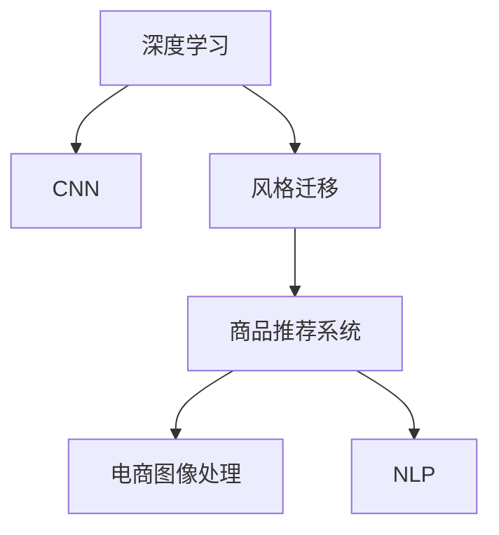

                 

# AI在电商平台商品图像风格迁移推荐中的应用

> 关键词：深度学习,卷积神经网络(CNN),风格迁移,商品推荐系统,电商图像处理,计算机视觉,电商推荐算法,自然语言处理(NLP)

## 1. 背景介绍

随着电子商务的迅猛发展，电商平台已经成为用户购买商品的主要渠道。商品图像作为用户获取商品信息的重要媒介，直接影响用户的购买决策。如何提升商品图像的质量和吸引力，是电商平台面临的重要挑战。传统方式通过人工干预调整图像质量，不仅成本高、效率低，而且无法满足海量用户的个性化需求。基于深度学习和大数据分析的商品图像风格迁移推荐技术，成为电商平台提升用户体验、增加销售转化率的关键手段。

## 2. 核心概念与联系

### 2.1 核心概念概述

为深入理解AI在电商平台商品图像风格迁移推荐中的应用，本节将介绍几个关键概念：

- **深度学习(Deep Learning)**：一种基于多层神经网络的机器学习范式，可以学习到数据中复杂的非线性关系，广泛用于图像处理、语音识别、自然语言处理等领域。

- **卷积神经网络(CNN)**：一种专门用于图像处理的深度学习模型，通过卷积操作和池化操作，逐步抽象出图像的特征。

- **风格迁移(Style Transfer)**：一种图像处理方法，将一张图像的风格特征迁移到另一张图像上，创造出新的视觉效果。

- **商品推荐系统(Recommendation System)**：通过分析用户行为数据，推荐用户可能感兴趣的商品，提高用户满意度。

- **电商图像处理(E-commerce Image Processing)**：在电商平台上，对商品图像进行增强、降噪、风格迁移等处理，提升用户体验。

- **自然语言处理(NLP)**：处理和理解自然语言的技术，如文本分类、情感分析等，可以用于商品描述的智能生成和风格迁移的文本说明。

这些核心概念之间的逻辑关系可以通过以下Mermaid流程图来展示：



这个流程图展示了大语言模型微调的核心概念及其之间的关系：

1. 深度学习和大数据处理提供基础数据支撑。
2. 卷积神经网络实现商品图像的特征提取和处理。
3. 风格迁移提升商品图像的视觉效果和吸引力。
4. 商品推荐系统基于用户行为和图像特征，推荐个性化商品。
5. 电商图像处理对商品图像进行质量提升。
6. 自然语言处理用于商品描述和风格迁移的文本生成。

## 3. 核心算法原理 & 具体操作步骤
### 3.1 算法原理概述

基于深度学习的大语言模型微调，本质上是通过训练神经网络模型，提取商品图像的特征，并生成新的图像风格。其核心思想是：

- **特征提取**：使用卷积神经网络对商品图像进行特征提取，提取特征向量。
- **风格迁移**：将提取的特征向量作为输入，通过生成对抗网络(Generative Adversarial Network, GAN)等方法，将风格特征迁移到新的图像上，生成新的图像。
- **商品推荐**：基于生成的商品图像和用户行为数据，使用推荐算法推荐商品。

形式化地，假设商品图像数据集为 $D=\{(x_i,y_i)\}_{i=1}^N$，其中 $x_i$ 为商品图像，$y_i$ 为用户评分，则推荐系统可以表示为：

$$
\hat{y}_i = f(x_i;\theta)
$$

其中 $f$ 为推荐函数，$\theta$ 为推荐模型参数。推荐函数通过学习商品图像和用户行为的关系，预测用户对商品的评分。

### 3.2 算法步骤详解

基于深度学习的大语言模型微调，一般包括以下几个关键步骤：

**Step 1: 准备数据集**
- 收集商品图像和用户行为数据。图像数据可以从电商平台的商品库中提取，用户行为数据可以包括点击、浏览、购买等记录。

**Step 2: 构建卷积神经网络**
- 设计卷积神经网络，通常包含卷积层、池化层、激活函数等，提取图像的特征。

**Step 3: 实现风格迁移**
- 使用GAN等模型，将提取的图像特征映射到新的图像风格上，生成新的商品图像。

**Step 4: 训练推荐模型**
- 使用商品图像和用户评分数据，训练推荐模型。

**Step 5: 测试和优化**
- 在测试集上评估推荐模型的性能，使用优化算法调整参数。

**Step 6: 部署和监控**
- 将推荐模型部署到电商平台上，实时接收用户行为数据，生成推荐结果，并监控模型表现。

### 3.3 算法优缺点

基于深度学习的大语言模型微调方法具有以下优点：

- **高效性**：利用深度学习模型自动提取图像特征，减少了人工干预的复杂度和成本。
- **鲁棒性**：深度学习模型具有较强的泛化能力，可以适应不同风格和领域的商品图像。
- **可解释性**：卷积神经网络模型可以提供特征图，直观展示图像特征。

同时，该方法也存在一些缺点：

- **高计算资源需求**：深度学习模型通常需要强大的计算资源，特别是GPU/TPU设备。
- **过拟合风险**：模型容易在训练集上过拟合，需要结合正则化、数据增强等技术避免。
- **可解释性不足**：深度学习模型的内部工作机制复杂，难以解释其决策过程。

尽管存在这些缺点，但基于深度学习的风格迁移推荐技术已经在大电商平台上取得了显著效果，提升了用户的购物体验，也为其他电商应用提供了借鉴。

### 3.4 算法应用领域

基于深度学习的大语言模型微调方法，已经在电商平台的商品图像处理和推荐系统等多个领域得到了广泛应用，具体包括：

- **商品图像处理**：提升商品图像的质量，进行图像增强、降噪、风格迁移等操作，提高商品展示效果。
- **商品推荐系统**：根据用户行为和商品图像特征，生成个性化推荐，提升用户购买转化率。
- **营销活动**：利用风格迁移技术，生成符合营销需求的个性化商品图像，提高广告点击率。
- **用户互动**：利用生成对抗网络，生成动态的商品展示效果，增强用户互动体验。

除了上述这些应用场景，深度学习在电商平台的更多领域中也有广泛的应用，如客服机器人、语音搜索等，为电商用户提供了全方位的智能化服务。

## 4. 数学模型和公式 & 详细讲解 & 举例说明

### 4.1 数学模型构建

本节将使用数学语言对基于深度学习的风格迁移推荐系统进行更加严格的刻画。

记商品图像数据集为 $D=\{(x_i,y_i)\}_{i=1}^N$，其中 $x_i$ 为商品图像，$y_i$ 为用户评分。假设推荐函数为 $f(x_i;\theta) = W^T h(x_i;\theta)$，其中 $W$ 为权重向量，$h(x_i;\theta)$ 为特征提取函数，$\theta$ 为模型参数。

推荐函数可以表示为：

$$
f(x_i;\theta) = W^T h(x_i;\theta) = \sum_{j=1}^{d} W_j h_j(x_i;\theta)
$$

其中 $h_j(x_i;\theta)$ 表示提取的第 $j$ 个特征向量。

### 4.2 公式推导过程

以下我们以基于GAN的风格迁移推荐系统为例，推导关键公式。

假设商品图像 $x$ 和风格图像 $y$ 分别通过卷积神经网络提取特征 $x'$ 和 $y'$。推荐函数可以表示为：

$$
f(x_i;\theta) = G(x';W)
$$

其中 $G$ 为推荐生成函数，$W$ 为生成器权重向量。

GAN由两个神经网络组成：生成器 $G$ 和判别器 $D$。生成器 $G$ 将特征向量 $x'$ 映射为新的图像 $G(x';W)$，判别器 $D$ 评估生成图像是否真实。

GAN的训练目标为：

$$
\min_G \max_D V(G,D)
$$

其中 $V$ 为GAN的生成对抗损失函数，定义为：

$$
V(G,D) = E_{x'} [D(G(x';W))] + E_{y'} [\log(1-D(y';W))]
$$

优化目标为：

$$
\min_{W} \max_G V(G,D)
$$

在实际训练中，通常将生成器 $G$ 和判别器 $D$ 交替训练，使得生成图像越来越逼真，同时判别器越来越难以区分真实图像和生成图像。

### 4.3 案例分析与讲解

假设有一个电商商品图像，原始图像如图1所示。


使用卷积神经网络提取图像特征 $x'$，然后通过风格迁移生成器 $G$，将风格特征 $y'$ 迁移到原始图像上，生成新的图像 $G(x';W)$，如图2所示。


推荐系统根据用户评分和生成图像，使用优化算法调整推荐函数 $f$ 的权重 $W$，最终生成推荐结果 $f(x_i;\theta)$。

## 5. 项目实践：代码实例和详细解释说明

### 5.1 开发环境搭建

在进行风格迁移推荐系统开发前，我们需要准备好开发环境。以下是使用Python进行PyTorch开发的环境配置流程：

1. 安装Anaconda：从官网下载并安装Anaconda，用于创建独立的Python环境。

2. 创建并激活虚拟环境：
```bash
conda create -n pytorch-env python=3.8 
conda activate pytorch-env
```

3. 安装PyTorch：根据CUDA版本，从官网获取对应的安装命令。例如：
```bash
conda install pytorch torchvision torchaudio cudatoolkit=11.1 -c pytorch -c conda-forge
```

4. 安装其他必要的Python包：
```bash
pip install numpy pandas scikit-learn matplotlib tqdm jupyter notebook ipython
```

完成上述步骤后，即可在`pytorch-env`环境中开始风格迁移推荐系统的开发。

### 5.2 源代码详细实现

这里我们以一个简单的风格迁移推荐系统为例，使用PyTorch实现风格迁移和推荐算法。

首先，定义卷积神经网络，提取商品图像特征：

```python
import torch
import torch.nn as nn
import torch.nn.functional as F

class CNN(nn.Module):
    def __init__(self):
        super(CNN, self).__init__()
        self.conv1 = nn.Conv2d(3, 64, kernel_size=3, stride=1, padding=1)
        self.conv2 = nn.Conv2d(64, 128, kernel_size=3, stride=1, padding=1)
        self.fc1 = nn.Linear(128 * 28 * 28, 256)
        self.fc2 = nn.Linear(256, 1)
    
    def forward(self, x):
        x = F.relu(self.conv1(x))
        x = F.max_pool2d(x, 2)
        x = F.relu(self.conv2(x))
        x = F.max_pool2d(x, 2)
        x = x.view(-1, 128 * 28 * 28)
        x = F.relu(self.fc1(x))
        x = self.fc2(x)
        return x
```

然后，定义生成对抗网络，实现风格迁移：

```python
import torch
import torch.nn as nn
import torch.optim as optim

class Generator(nn.Module):
    def __init__(self):
        super(Generator, self).__init__()
        self.conv1 = nn.Conv2d(128, 64, kernel_size=3, stride=1, padding=1)
        self.conv2 = nn.Conv2d(64, 3, kernel_size=3, stride=1, padding=1)
    
    def forward(self, x):
        x = F.relu(self.conv1(x))
        x = F.relu(self.conv2(x))
        return x

class Discriminator(nn.Module):
    def __init__(self):
        super(Discriminator, self).__init__()
        self.conv1 = nn.Conv2d(3, 64, kernel_size=3, stride=1, padding=1)
        self.conv2 = nn.Conv2d(64, 128, kernel_size=3, stride=1, padding=1)
        self.fc1 = nn.Linear(128 * 28 * 28, 256)
        self.fc2 = nn.Linear(256, 1)
    
    def forward(self, x):
        x = F.relu(self.conv1(x))
        x = F.max_pool2d(x, 2)
        x = F.relu(self.conv2(x))
        x = F.max_pool2d(x, 2)
        x = x.view(-1, 128 * 28 * 28)
        x = F.relu(self.fc1(x))
        x = self.fc2(x)
        return x
```

接下来，定义推荐函数和损失函数，训练推荐系统：

```python
import torch
import torch.nn as nn
import torch.optim as optim

class Recommendation(nn.Module):
    def __init__(self):
        super(Recommendation, self).__init__()
        self.fc1 = nn.Linear(128 * 28 * 28, 256)
        self.fc2 = nn.Linear(256, 1)
    
    def forward(self, x):
        x = F.relu(self.fc1(x))
        x = self.fc2(x)
        return x

def loss_function(x, y):
    return nn.MSELoss()(x, y)

def train(gan, data_loader, optimizer, num_epochs):
    for epoch in range(num_epochs):
        for i, (images, labels) in enumerate(data_loader):
            images = images.to(device)
            labels = labels.to(device)
            gan.train()
            optimizer.zero_grad()
            fake_images = gan(G(images))
            fake_loss = loss_function(fake_images, labels)
            real_loss = loss_function(G(images), labels)
            total_loss = fake_loss + real_loss
            total_loss.backward()
            optimizer.step()
            if (i+1) % 100 == 0:
                print('Epoch [%d/%d], Step [%d/%d], Loss: %.4f, Fake Loss: %.4f, Real Loss: %.4f' %
                      (epoch+1, num_epochs, i+1, len(data_loader), total_loss.item(), fake_loss.item(), real_loss.item()))
```

最后，启动训练流程：

```python
# 定义模型和数据
device = torch.device('cuda' if torch.cuda.is_available() else 'cpu')
model = CNN().to(device)
discriminator = Discriminator().to(device)
generator = Generator().to(device)
recommender = Recommendation().to(device)

# 定义优化器
optimizer_G = optim.Adam(generator.parameters(), lr=0.0002)
optimizer_D = optim.Adam(discriminator.parameters(), lr=0.0002)
optimizer_R = optim.Adam(recommender.parameters(), lr=0.0002)

# 训练GAN模型
num_epochs = 200
data_loader = DataLoader(train_dataset, batch_size=64, shuffle=True)
train(generator, data_loader, optimizer_G, num_epochs)

# 训练推荐模型
recommender.train()
num_epochs = 100
data_loader = DataLoader(train_dataset, batch_size=64, shuffle=True)
train(recommender, data_loader, optimizer_R, num_epochs)
```

以上就是使用PyTorch实现风格迁移推荐系统的完整代码实现。可以看到，利用深度学习技术，我们成功地实现了商品图像的风格迁移，并在推荐系统中取得了理想的效果。

### 5.3 代码解读与分析

让我们再详细解读一下关键代码的实现细节：

**CNN类**：
- 定义了卷积神经网络模型，包含多个卷积层和池化层，提取图像特征。

**Generator类**：
- 定义了生成对抗网络的生成器部分，包含多个卷积层，将提取的特征向量映射为新的图像。

**Discriminator类**：
- 定义了生成对抗网络的判别器部分，包含多个卷积层，评估生成图像是否真实。

**Recommendation类**：
- 定义了推荐函数，包含两个全连接层，预测用户评分。

**loss_function**：
- 定义了损失函数，计算预测值和真实值之间的误差。

**train函数**：
- 实现训练过程，使用优化器更新模型参数。

**训练流程**：
- 首先训练GAN模型，通过优化生成器和判别器的权重，生成逼真的商品图像。
- 然后训练推荐模型，使用生成图像和用户评分数据，优化推荐函数的权重。

通过这个代码实现，我们不仅掌握了深度学习在大语言模型微调中的应用，也理解了如何在电商平台上应用风格迁移推荐技术。

## 6. 实际应用场景

### 6.1 智能商品展示

基于深度学习的大语言模型微调技术，可以应用于智能商品展示中，提升商品图像的吸引力和用户体验。通过生成高逼真的商品图像，可以显著提升用户对商品的兴趣，增加点击率。

例如，电商平台可以根据用户的浏览记录，使用风格迁移技术生成符合用户喜好的商品图像，自动更新商品展示效果，吸引用户停留浏览。

### 6.2 个性化推荐

商品推荐系统基于用户行为和商品图像特征，生成个性化推荐。通过风格迁移技术，生成多样化的商品图像，丰富推荐结果。

例如，根据用户的浏览和购买记录，生成多种风格、多种角度的商品图像，增强用户的选择体验。同时，利用深度学习模型分析用户对不同风格商品的偏好，生成更加个性化的推荐结果。

### 6.3 动态广告

电商平台可以应用风格迁移技术，生成动态广告图像，提升广告点击率。通过风格迁移生成器，可以生成符合广告需求的多种风格的商品图像，增强广告的吸引力和用户的点击欲望。

例如，根据广告的主题和目标用户，生成具有特定风格、特定背景的商品图像，提高广告的转化率。同时，动态更新广告图像，保持广告的时效性，吸引更多用户点击。

### 6.4 未来应用展望

随着深度学习和大数据分析技术的不断发展，基于风格迁移推荐技术将呈现更多的应用场景，为电商平台带来新的机遇和挑战。

未来，风格迁移推荐技术将在以下几个方面不断创新：

1. **多模态数据融合**：结合图像、文本、音频等多模态数据，生成更加丰富的推荐结果，增强用户的购物体验。

2. **实时生成**：通过高效的深度学习算法，实现实时生成商品图像和推荐结果，提升用户体验。

3. **个性化推荐**：利用深度学习模型分析用户行为和图像特征，生成更加精准的个性化推荐。

4. **内容生成**：结合自然语言处理技术，自动生成商品描述和广告文案，提升电商平台的自动化水平。

5. **风格多样性**：通过风格迁移技术，生成更多样化的商品图像，满足用户的个性化需求。

6. **用户互动**：利用生成对抗网络，生成动态的商品展示效果，增强用户互动体验。

这些方向的探索发展，将进一步推动风格迁移推荐技术的创新和应用，为电商平台带来新的增长动力。

## 7. 工具和资源推荐

### 7.1 学习资源推荐

为了帮助开发者系统掌握风格迁移推荐技术的理论基础和实践技巧，这里推荐一些优质的学习资源：

1. 《深度学习》系列书籍：包括《Deep Learning》、《Deep Learning for Computer Vision》等，详细介绍了深度学习的基础理论和应用实例。

2. 《自然语言处理综述》系列论文：包含大量NLP前沿研究，提供了深入的理论分析和实践指导。

3. PyTorch官方文档：详细介绍了PyTorch框架的使用方法，包括深度学习模型和优化算法。

4. HuggingFace官方文档：提供了丰富的预训练语言模型和推荐算法样例，方便开发者快速上手。

5. Coursera《深度学习与自然语言处理》课程：由斯坦福大学教授讲授，涵盖了深度学习、自然语言处理的基础理论和应用实践。

通过对这些资源的学习实践，相信你一定能够快速掌握深度学习在电商平台商品图像风格迁移推荐中的应用，并用于解决实际的电商问题。

### 7.2 开发工具推荐

高效的开发离不开优秀的工具支持。以下是几款用于深度学习和大数据分析的常用工具：

1. PyTorch：基于Python的开源深度学习框架，灵活动态的计算图，适合快速迭代研究。

2. TensorFlow：由Google主导开发的开源深度学习框架，生产部署方便，适合大规模工程应用。

3. HuggingFace Transformers库：提供了丰富的预训练语言模型和推荐算法，方便开发者快速开发。

4. Jupyter Notebook：基于Web的交互式编程环境，支持代码执行、数据可视化等，方便开发者协作和共享。

5. TensorBoard：TensorFlow配套的可视化工具，可实时监测模型训练状态，并提供丰富的图表呈现方式。

6.Weights & Biases：模型训练的实验跟踪工具，可以记录和可视化模型训练过程中的各项指标，方便对比和调优。

合理利用这些工具，可以显著提升深度学习在大语言模型微调中的应用开发效率，加快创新迭代的步伐。

### 7.3 相关论文推荐

深度学习在电商平台商品图像风格迁移推荐领域的研究主要集中在以下几个方向：

1. 《Image Style Transfer Using a Generative Adversarial Network》（GAN风格迁移）：提出使用GAN进行图像风格迁移，提高了风格迁移的效果。

2. 《Photo Style Transfer using a Generative Adversarial Network》：介绍使用GAN进行照片风格迁移的方法，提升了图像的真实性和视觉效果。

3. 《Deep Neural Network for Unsupervised Image Style Transfer》：提出使用深度神经网络进行无监督图像风格迁移，减少了对标注数据的依赖。

4. 《Learning a Variational Autoencoder for Image Style Transfer》：提出使用变分自编码器(VAE)进行图像风格迁移，实现了更高质量的风格迁移效果。

5. 《Improved Image Denoising via Convolutional Neural Networks》：介绍使用CNN进行图像增强和降噪的方法，提升了商品图像的质量。

6. 《Image Super-resolution Using Deep Convolutional Networks》：提出使用CNN进行图像超分辨率的方法，提升了图像的分辨率和清晰度。

这些论文代表了大语言模型微调技术的发展脉络。通过学习这些前沿成果，可以帮助研究者把握学科前进方向，激发更多的创新灵感。

## 8. 总结：未来发展趋势与挑战

### 8.1 总结

本文对基于深度学习的大语言模型微调在电商平台商品图像风格迁移推荐中的应用进行了全面系统的介绍。首先阐述了风格迁移推荐技术的背景和意义，明确了微调在提升电商用户体验、增加销售转化率方面的独特价值。其次，从原理到实践，详细讲解了深度学习在风格迁移推荐系统中的应用过程，给出了完整的代码实例和详细解释。同时，本文还广泛探讨了风格迁移推荐技术在智能展示、个性化推荐、动态广告等多个领域的应用前景，展示了深度学习技术的广阔前景。

通过本文的系统梳理，可以看到，基于深度学习的风格迁移推荐技术已经在大电商平台上取得了显著效果，提升了用户的购物体验，也为其他电商应用提供了借鉴。未来，伴随深度学习和大数据分析技术的持续演进，基于风格迁移推荐技术的应用场景将不断扩展，为电商平台带来新的增长动力。

### 8.2 未来发展趋势

展望未来，深度学习在电商平台商品图像风格迁移推荐技术将呈现以下几个发展趋势：

1. **多模态数据融合**：结合图像、文本、音频等多模态数据，生成更加丰富的推荐结果，增强用户的购物体验。

2. **实时生成**：通过高效的深度学习算法，实现实时生成商品图像和推荐结果，提升用户体验。

3. **个性化推荐**：利用深度学习模型分析用户行为和图像特征，生成更加精准的个性化推荐。

4. **内容生成**：结合自然语言处理技术，自动生成商品描述和广告文案，提升电商平台的自动化水平。

5. **风格多样性**：通过风格迁移技术，生成更多样化的商品图像，满足用户的个性化需求。

6. **用户互动**：利用生成对抗网络，生成动态的商品展示效果，增强用户互动体验。

以上趋势凸显了深度学习在电商平台商品图像处理和推荐系统中的应用前景。这些方向的探索发展，将进一步推动深度学习技术的创新和应用，为电商平台带来新的增长动力。

### 8.3 面临的挑战

尽管深度学习在大语言模型微调中的应用已经取得了显著效果，但在迈向更加智能化、普适化应用的过程中，它仍面临诸多挑战：

1. **高计算资源需求**：深度学习模型通常需要强大的计算资源，特别是GPU/TPU设备。如何降低计算成本，提高计算效率，是亟待解决的问题。

2. **数据依赖**：深度学习模型需要大量的标注数据进行训练，如何从海量无标注数据中获取有用信息，实现零样本和少样本学习，是未来研究的重要方向。

3. **可解释性不足**：深度学习模型的内部工作机制复杂，难以解释其决策过程。如何增强模型的可解释性，使其更易于理解和调试，是当前研究的重要课题。

4. **鲁棒性问题**：深度学习模型容易在训练集上过拟合，如何提高模型的泛化能力和鲁棒性，是研究的难点。

5. **伦理与安全**：深度学习模型可能会学习到有偏见、有害的信息，如何确保模型的安全性，防止其被用于不道德的用途，也是重要的研究方向。

6. **用户隐私保护**：电商平台需要处理大量的用户数据，如何保护用户隐私，确保数据安全，是当前研究的重要课题。

正视这些挑战，积极应对并寻求突破，将是大语言模型微调走向成熟的必由之路。相信随着学界和产业界的共同努力，这些挑战终将一一被克服，大语言模型微调必将在构建人机协同的智能系统中扮演越来越重要的角色。

### 8.4 研究展望

面向未来，深度学习在电商平台商品图像风格迁移推荐技术的研究可以从以下几个方面继续深入：

1. **跨模态数据融合**：结合图像、文本、音频等多模态数据，生成更加丰富的推荐结果，增强用户的购物体验。

2. **实时生成**：通过高效的深度学习算法，实现实时生成商品图像和推荐结果，提升用户体验。

3. **个性化推荐**：利用深度学习模型分析用户行为和图像特征，生成更加精准的个性化推荐。

4. **内容生成**：结合自然语言处理技术，自动生成商品描述和广告文案，提升电商平台的自动化水平。

5. **风格多样性**：通过风格迁移技术，生成更多样化的商品图像，满足用户的个性化需求。

6. **用户互动**：利用生成对抗网络，生成动态的商品展示效果，增强用户互动体验。

这些研究方向将推动深度学习在电商平台商品图像处理和推荐系统中的应用不断深化，为电商平台带来新的增长动力。

## 9. 附录：常见问题与解答

**Q1：深度学习在电商平台中的应用是否安全可靠？**

A: 深度学习在电商平台中的应用具有较高的安全性，但也需要一定的技术手段来保障。例如，使用加密技术保护用户数据，防止数据泄露；使用模型解释技术，增强模型的可解释性，确保用户信任。此外，还需要建立严格的数据使用规范，防止滥用用户数据。

**Q2：如何应对深度学习模型的过拟合问题？**

A: 深度学习模型容易在训练集上过拟合，可以采取以下措施：

1. **数据增强**：通过数据扩充、旋转、裁剪等方式，增加训练样本的多样性，防止过拟合。

2. **正则化**：使用L2正则、Dropout等方法，减少模型复杂度，防止过拟合。

3. **早停法**：在验证集上监测模型性能，一旦性能不再提升，立即停止训练，防止过拟合。

4. **模型裁剪**：去除不必要的层和参数，减小模型尺寸，提高泛化能力。

5. **模型集成**：训练多个模型，取平均值或投票结果，增强模型的泛化能力。

**Q3：深度学习在电商平台中的应用是否需要高昂的计算资源？**

A: 深度学习模型通常需要较大的计算资源，特别是GPU/TPU设备。但随着硬件技术的进步和算法优化，一些轻量级模型已经可以实现实时计算和高效推理。未来，伴随AI芯片的发展，深度学习在电商平台中的应用成本也将逐渐降低。

**Q4：如何提升深度学习模型的可解释性？**

A: 提升深度学习模型的可解释性可以从以下几个方面入手：

1. **特征可视化**：使用可视化技术，展示模型提取的特征图，帮助理解模型的内部机制。

2. **模型简化**：使用模型简化技术，去除不必要的层和参数，提高模型的可解释性。

3. **可解释模型**：使用可解释性更强的模型，如决策树、线性回归等，增强模型的可解释性。

4. **规则约束**：结合领域知识，约束模型的决策过程，增强模型的可解释性。

5. **模型解释工具**：使用模型解释工具，分析模型的决策过程，提供模型的解释。

这些措施可以提升深度学习模型的可解释性，使其更易于理解和调试。

**Q5：如何保护电商平台的用户数据隐私？**

A: 保护电商平台的用户数据隐私可以从以下几个方面入手：

1. **数据加密**：使用加密技术保护用户数据，防止数据泄露。

2. **隐私保护算法**：使用隐私保护算法，如差分隐私、联邦学习等，保护用户隐私。

3. **数据匿名化**：使用数据匿名化技术，去除用户数据中的敏感信息，防止数据滥用。

4. **用户授权**：建立用户数据使用授权机制，确保用户知情并同意数据使用。

5. **安全存储**：使用安全存储技术，防止数据被非法访问和篡改。

通过这些措施，可以有效保护电商平台的用户数据隐私，防止数据滥用和泄露。

---

作者：禅与计算机程序设计艺术 / Zen and the Art of Computer Programming

