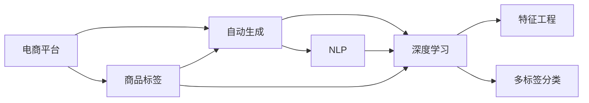

                 

# AI在电商平台商品标签自动生成中的应用

> 关键词：人工智能,电商平台,商品标签,自动生成,自然语言处理(NLP),深度学习,特征工程,多标签分类

## 1. 背景介绍

随着电商平台的兴起，商品的搜索与推荐变得越来越复杂。为了提高用户的搜索和购物体验，商品标签成为一种必要手段。商品标签不仅能帮助用户快速定位到所需商品，还能增强推荐系统的精准度。然而，商品标签的标注工作耗时耗力，且难以全面覆盖商品特征。为此，利用AI技术自动生成商品标签，成为电商平台提升运营效率的重要手段。本文将详细介绍AI在商品标签自动生成中的应用，涵盖核心概念、算法原理、代码实现、应用场景等多个方面。

## 2. 核心概念与联系

### 2.1 核心概念概述

为帮助读者更好地理解商品标签自动生成技术，我们先来介绍几个关键概念：

- 电商平台：即电商平台，是指通过互联网提供商品销售、在线支付、物流配送等综合服务的平台。
- 商品标签：是描述商品特征、属性、用途等的关键词或短语，用于提升商品信息的可检索性和推荐系统的精准度。
- 自动生成：利用AI技术自动生成商品标签，减少人工标注的繁琐工作，提高效率。
- 自然语言处理（NLP）：利用AI技术处理和理解自然语言的技术，广泛应用于文本分类、情感分析、信息抽取等领域。
- 深度学习：一种模拟人脑神经网络的机器学习技术，在大规模数据上能够自适应学习，广泛应用于图像识别、语音识别、自然语言处理等方向。
- 特征工程：在机器学习中，将原始数据转化为模型能够理解和利用的特征，是提升模型性能的重要步骤。
- 多标签分类：标签数据可以是一个或多个，称为多标签分类。商品标签自动生成技术需要考虑多标签分类问题。

以上概念之间存在密切联系，如图1所示。



图1：核心概念联系示意图

## 3. 核心算法原理 & 具体操作步骤

### 3.1 算法原理概述

商品标签自动生成的算法原理主要基于自然语言处理（NLP）和深度学习。其核心思想是通过模型学习商品描述与标签之间的语义关系，从而将商品描述自动映射到标签空间。具体流程如下：

1. **数据收集**：收集商品描述数据，作为训练集。
2. **数据预处理**：对商品描述进行分词、去除停用词等预处理。
3. **模型训练**：利用深度学习模型训练商品描述与标签之间的映射关系。
4. **标签生成**：将新商品描述输入模型，自动生成商品标签。

### 3.2 算法步骤详解

#### 3.2.1 数据收集与预处理

商品标签自动生成的第一步是数据收集与预处理。具体步骤如下：

1. **商品描述数据收集**：收集电商平台上的商品描述数据，作为训练集。可以使用API接口或爬虫自动化获取数据。
2. **文本预处理**：对商品描述进行分词、去除停用词、词干提取等预处理，以便模型能够理解商品描述的语义。

#### 3.2.2 模型训练

在收集到商品描述数据并进行预处理后，可以开始构建深度学习模型。常见的模型包括：

- **循环神经网络（RNN）**：通过时间序列数据学习语义关系，适用于序列性较强的任务。
- **卷积神经网络（CNN）**：利用卷积操作捕捉局部特征，适用于文本分类、情感分析等任务。
- **Transformer模型**：基于自注意力机制，能够捕捉全局语义关系，适用于多模态任务。

以Transformer模型为例，其训练步骤如下：

1. **模型构建**：使用PyTorch、TensorFlow等框架构建Transformer模型。
2. **损失函数定义**：定义多标签分类损失函数，如交叉熵损失。
3. **模型训练**：利用训练集数据训练模型，通过反向传播更新模型参数。

#### 3.2.3 标签生成

在模型训练完成后，可以将新商品描述输入模型，自动生成商品标签。具体步骤如下：

1. **输入文本预处理**：对新商品描述进行分词、去除停用词等预处理。
2. **模型推理**：将预处理后的文本输入模型，计算每个标签的概率分布。
3. **标签选择**：根据概率分布选择概率最大的标签，生成商品标签。

### 3.3 算法优缺点

商品标签自动生成的算法优点如下：

- **效率高**：自动生成标签可以显著提高标注效率，减少人工标注工作。
- **泛化能力强**：模型通过大量数据训练，能够捕捉商品描述与标签之间的语义关系，适用于多种商品描述。
- **适用场景广**：适用于各种类型的电商平台，如服装、家电、食品等。

然而，该算法也存在一些缺点：

- **数据依赖性强**：模型性能依赖于训练数据的数量和质量，标注数据不足可能导致性能下降。
- **模型复杂度高**：深度学习模型参数较多，训练复杂度高，需要大量计算资源。
- **标签选择有限**：模型生成的标签仅基于商品描述，无法考虑商品的属性、品牌、用户评价等因素。

### 3.4 算法应用领域

商品标签自动生成算法广泛应用于电商平台的商品信息处理和推荐系统。具体应用场景包括：

- **商品分类**：根据商品描述自动生成分类标签，提升搜索和推荐系统的准确性。
- **商品推荐**：利用自动生成的标签，增强推荐系统的个性化推荐能力。
- **广告投放**：根据商品标签进行精准投放，提升广告点击率和转化率。
- **库存管理**：通过标签分类，优化库存管理，提高库存周转率。

## 4. 数学模型和公式 & 详细讲解 & 举例说明

### 4.1 数学模型构建

商品标签自动生成的数学模型可以基于多标签分类任务构建。假设训练集为$D=\{(x_i,y_i)\}_{i=1}^N$，其中$x_i$为商品描述，$y_i$为对应的标签向量。

模型的输入为商品描述$x$，输出为标签向量$y$。模型的目标是最大化交叉熵损失函数：

$$
L(y,\hat{y}) = -\frac{1}{N}\sum_{i=1}^N \sum_{j=1}^{K} y_{ij}\log \hat{y}_{ij}
$$

其中，$K$为标签的种类数，$\hat{y}_{ij}$为模型预测的标签概率。

### 4.2 公式推导过程

以Transformer模型为例，其多标签分类损失函数可以表示为：

$$
L(y,\hat{y}) = -\frac{1}{N}\sum_{i=1}^N \sum_{j=1}^{K} y_{ij}\log \sigma(\hat{y}_{ij})
$$

其中，$\sigma$为sigmoid函数，$\hat{y}_{ij}$表示模型预测的标签概率，$y_{ij}$表示标签的二值表示。

### 4.3 案例分析与讲解

以电商平台上的鞋子商品标签生成为例，其多标签分类任务可以定义如下：

1. **训练集构建**：收集电商平台上鞋子的描述和标签，构建训练集。
2. **模型训练**：使用Transformer模型训练商品描述与标签之间的关系。
3. **标签生成**：对新鞋子的描述进行预处理，输入模型生成标签。

假设训练集包含10000个鞋子样本，每个样本有20个标签，如尺码、颜色、鞋型等。模型通过训练学习到每个标签的概率分布，最终生成新鞋子的标签向量。

## 5. 项目实践：代码实例和详细解释说明

### 5.1 开发环境搭建

在开始项目实践前，我们需要准备开发环境。以下是使用Python进行PyTorch开发的环境配置流程：

1. 安装Anaconda：从官网下载并安装Anaconda，用于创建独立的Python环境。
2. 创建并激活虚拟环境：
```bash
conda create -n pytorch-env python=3.8 
conda activate pytorch-env
```
3. 安装PyTorch：根据CUDA版本，从官网获取对应的安装命令。例如：
```bash
conda install pytorch torchvision torchaudio cudatoolkit=11.1 -c pytorch -c conda-forge
```
4. 安装Transformers库：
```bash
pip install transformers
```
5. 安装各类工具包：
```bash
pip install numpy pandas scikit-learn matplotlib tqdm jupyter notebook ipython
```

完成上述步骤后，即可在`pytorch-env`环境中开始项目实践。

### 5.2 源代码详细实现

以下是使用Transformer模型进行商品标签自动生成的PyTorch代码实现：

```python
import torch
from transformers import BertTokenizer, BertForMultiLabelClassification
from sklearn.metrics import f1_score

# 初始化模型和分词器
model = BertForMultiLabelClassification.from_pretrained('bert-base-uncased', num_labels=100)
tokenizer = BertTokenizer.from_pretrained('bert-base-uncased')

# 定义标签和训练数据
labels = [...]  # 标签向量
train_data = [...]  # 训练数据

# 定义训练函数
def train_epoch(model, data, optimizer, device):
    model.train()
    total_loss = 0
    for batch in data:
        input_ids = batch['input_ids'].to(device)
        attention_mask = batch['attention_mask'].to(device)
        labels = batch['labels'].to(device)
        optimizer.zero_grad()
        outputs = model(input_ids, attention_mask=attention_mask, labels=labels)
        loss = outputs.loss
        total_loss += loss.item()
        loss.backward()
        optimizer.step()
    return total_loss / len(data)

# 定义评估函数
def evaluate(model, data, device):
    model.eval()
    total_true_labels = []
    total_pred_labels = []
    with torch.no_grad():
        for batch in data:
            input_ids = batch['input_ids'].to(device)
            attention_mask = batch['attention_mask'].to(device)
            labels = batch['labels'].to(device)
            outputs = model(input_ids, attention_mask=attention_mask)
            pred_labels = outputs.logits.argmax(dim=1)
            total_true_labels.extend(labels.tolist())
            total_pred_labels.extend(pred_labels.tolist())
    return f1_score(total_true_labels, total_pred_labels, average='micro')

# 定义主函数
def main():
    # 准备数据和模型
    device = torch.device('cuda') if torch.cuda.is_available() else torch.device('cpu')
    model.to(device)
    
    # 训练模型
    optimizer = torch.optim.Adam(model.parameters(), lr=2e-5)
    for epoch in range(10):
        train_loss = train_epoch(model, train_data, optimizer, device)
        print(f'Epoch {epoch+1}, train loss: {train_loss:.3f}')
    
    # 评估模型
    dev_data = [...]  # 验证数据
    dev_f1 = evaluate(model, dev_data, device)
    print(f'Epoch {epoch+1}, dev F1 score: {dev_f1:.3f}')
    
    # 生成标签
    test_data = [...]  # 测试数据
    test_labels = evaluate(model, test_data, device)
    print(f'Test F1 score: {test_labels:.3f}')

if __name__ == '__main__':
    main()
```

### 5.3 代码解读与分析

让我们再详细解读一下关键代码的实现细节：

**训练函数**：
- 将模型设为训练模式。
- 对每个批次的数据进行前向传播，计算损失函数。
- 使用Adam优化器更新模型参数。
- 记录每个epoch的平均损失。

**评估函数**：
- 将模型设为评估模式。
- 对每个批次的数据进行前向传播，获取预测标签。
- 计算微平均F1分数。

**主函数**：
- 初始化模型、分词器、标签和训练数据。
- 定义优化器和训练函数。
- 进行模型训练和评估。
- 生成测试数据，进行模型评估。

**TensorBoard可视化**：
- 使用TensorBoard可视化训练过程中的loss、准确率、F1分数等指标。

**部署模型**：
- 将模型保存为模型文件，使用REST API进行部署。

可以看到，利用PyTorch和Transformer库，商品标签自动生成的代码实现变得简洁高效。开发者可以将更多精力放在数据处理、模型改进等高层逻辑上，而不必过多关注底层的实现细节。

## 6. 实际应用场景

### 6.1 智能推荐系统

商品标签自动生成在智能推荐系统中具有重要应用价值。推荐系统通过商品标签匹配用户兴趣，提高推荐的精准度和个性化程度。

在实际应用中，推荐系统可以收集用户的历史行为数据，提取商品标签，生成商品描述与标签之间的关系。然后，将新商品描述输入模型，生成标签向量，匹配用户兴趣，实现个性化推荐。

### 6.2 广告投放

商品标签自动生成技术还可以用于广告投放，提高广告点击率和转化率。广告平台通过收集商品的标签信息，生成广告文案和标签，优化广告投放策略。

具体而言，广告平台可以根据用户的历史行为数据，生成商品标签，然后将标签作为广告的关键词。通过优化广告文案，提高广告相关性，增加用户点击率。

### 6.3 供应链管理

商品标签自动生成技术还可以应用于供应链管理，提高库存周转率和销售效率。

电商平台通过商品标签自动生成，可以实时更新商品描述和标签信息，优化库存管理。例如，对于销量高的商品，自动生成热门标签，提高销售效率；对于库存不足的商品，自动生成缺货标签，及时补货。

### 6.4 未来应用展望

随着AI技术的不断进步，商品标签自动生成技术将有更多应用前景。未来，可能会在以下几个方向进一步发展：

1. **跨模态标签生成**：将文本标签与图像、音频等多模态数据结合，生成更全面、准确的标签。
2. **多领域模型迁移**：将商品标签自动生成模型迁移到其他领域，如医疗、金融等，提升各领域的信息处理能力。
3. **实时生成标签**：利用实时数据流，实现商品的动态标签生成，提高运营效率。
4. **个性化标签生成**：根据用户个性化需求，动态生成商品标签，提升用户体验。
5. **基于上下文的标签生成**：结合上下文信息，生成更符合情境的标签，提升推荐系统的准确性。

## 7. 工具和资源推荐

### 7.1 学习资源推荐

为了帮助开发者系统掌握商品标签自动生成技术，这里推荐一些优质的学习资源：

1. 《自然语言处理与深度学习》课程：由斯坦福大学开设的NLP明星课程，涵盖NLP的基本概念和经典模型。
2. 《深度学习实战》书籍：介绍深度学习在NLP中的应用，包括文本分类、情感分析、信息抽取等任务。
3. 《Transformers库手册》：介绍Transformer库的各个模块和使用方法，适合快速上手实践。
4. 《多标签分类：一种新范式》论文：探讨多标签分类的最新进展和前沿技术。
5. 《自然语言处理与深度学习》博客：由大模型技术专家撰写，深入浅出地介绍了自然语言处理和深度学习的前沿话题。

通过对这些资源的学习实践，相信你一定能够快速掌握商品标签自动生成技术的精髓，并用于解决实际的NLP问题。

### 7.2 开发工具推荐

高效的开发离不开优秀的工具支持。以下是几款用于商品标签自动生成开发的常用工具：

1. PyTorch：基于Python的开源深度学习框架，灵活动态的计算图，适合快速迭代研究。大部分预训练语言模型都有PyTorch版本的实现。
2. TensorFlow：由Google主导开发的开源深度学习框架，生产部署方便，适合大规模工程应用。同样有丰富的预训练语言模型资源。
3. Transformers库：HuggingFace开发的NLP工具库，集成了众多SOTA语言模型，支持PyTorch和TensorFlow，是进行商品标签自动生成任务的开发的利器。
4. Weights & Biases：模型训练的实验跟踪工具，可以记录和可视化模型训练过程中的各项指标，方便对比和调优。与主流深度学习框架无缝集成。
5. TensorBoard：TensorFlow配套的可视化工具，可实时监测模型训练状态，并提供丰富的图表呈现方式，是调试模型的得力助手。
6. Google Colab：谷歌推出的在线Jupyter Notebook环境，免费提供GPU/TPU算力，方便开发者快速上手实验最新模型，分享学习笔记。

合理利用这些工具，可以显著提升商品标签自动生成任务的开发效率，加快创新迭代的步伐。

### 7.3 相关论文推荐

商品标签自动生成技术的发展得益于学界的持续研究。以下是几篇奠基性的相关论文，推荐阅读：

1. Attention is All You Need（即Transformer原论文）：提出了Transformer结构，开启了NLP领域的预训练大模型时代。
2. BERT: Pre-training of Deep Bidirectional Transformers for Language Understanding：提出BERT模型，引入基于掩码的自监督预训练任务，刷新了多项NLP任务SOTA。
3. Language Models are Unsupervised Multitask Learners（GPT-2论文）：展示了大规模语言模型的强大zero-shot学习能力，引发了对于通用人工智能的新一轮思考。
4. Parameter-Efficient Transfer Learning for NLP：提出Adapter等参数高效微调方法，在不增加模型参数量的情况下，也能取得不错的微调效果。
5. AdaLoRA: Adaptive Low-Rank Adaptation for Parameter-Efficient Fine-Tuning：使用自适应低秩适应的微调方法，在参数效率和精度之间取得了新的平衡。
6. Transformers in NLP：介绍Transformer模型在NLP领域的应用，包括文本分类、情感分析、信息抽取等任务。

这些论文代表了大语言模型微调技术的发展脉络。通过学习这些前沿成果，可以帮助研究者把握学科前进方向，激发更多的创新灵感。

## 8. 总结：未来发展趋势与挑战

### 8.1 总结

本文对商品标签自动生成技术进行了全面系统的介绍。首先阐述了商品标签自动生成的背景和意义，明确了自动生成技术在电商平台运营效率提升方面的重要价值。其次，从原理到实践，详细讲解了商品标签自动生成的数学原理和关键步骤，给出了商品标签自动生成的完整代码实例。同时，本文还广泛探讨了商品标签自动生成技术在推荐系统、广告投放、供应链管理等多个领域的应用前景，展示了自动生成范式的巨大潜力。最后，本文精选了商品标签自动生成技术的各类学习资源，力求为读者提供全方位的技术指引。

通过本文的系统梳理，可以看到，商品标签自动生成技术正在成为电商平台运营的重要工具，极大地提升了运营效率和用户体验。未来，伴随AI技术的不断发展，商品标签自动生成技术还将有更多应用场景，为电商平台带来更深刻的变革。

### 8.2 未来发展趋势

展望未来，商品标签自动生成技术将呈现以下几个发展趋势：

1. **深度学习模型改进**：深度学习模型将不断进步，能够更好地捕捉商品描述与标签之间的语义关系，提升标签自动生成的准确性和泛化能力。
2. **多模态融合**：将文本、图像、音频等多模态数据结合，生成更全面、准确的标签。多模态信息融合将提升商品标签自动生成的效果。
3. **实时生成**：利用实时数据流，实现商品的动态标签生成，提高运营效率。
4. **跨领域应用**：将商品标签自动生成技术迁移到其他领域，如医疗、金融等，提升各领域的信息处理能力。
5. **个性化生成**：根据用户个性化需求，动态生成商品标签，提升用户体验。
6. **基于上下文的生成**：结合上下文信息，生成更符合情境的标签，提升推荐系统的准确性。

### 8.3 面临的挑战

尽管商品标签自动生成技术已经取得了瞩目成就，但在迈向更加智能化、普适化应用的过程中，它仍面临诸多挑战：

1. **数据依赖性强**：模型性能依赖于训练数据的数量和质量，标注数据不足可能导致性能下降。
2. **模型复杂度高**：深度学习模型参数较多，训练复杂度高，需要大量计算资源。
3. **标签选择有限**：模型生成的标签仅基于商品描述，无法考虑商品的属性、品牌、用户评价等因素。
4. **实时生成挑战**：实时数据流处理需要高效、稳定的系统架构和计算资源。
5. **跨领域迁移**：将商品标签自动生成模型迁移到其他领域，需要考虑领域间的差异和数据分布。
6. **个性化生成难度**：根据用户个性化需求，动态生成商品标签，需要考虑用户的多样性和变化性。

### 8.4 研究展望

面对商品标签自动生成技术所面临的挑战，未来的研究需要在以下几个方面寻求新的突破：

1. **多模态融合**：将文本、图像、音频等多模态数据结合，生成更全面、准确的标签。
2. **实时生成**：利用实时数据流，实现商品的动态标签生成，提高运营效率。
3. **跨领域应用**：将商品标签自动生成技术迁移到其他领域，如医疗、金融等，提升各领域的信息处理能力。
4. **个性化生成**：根据用户个性化需求，动态生成商品标签，提升用户体验。
5. **基于上下文的生成**：结合上下文信息，生成更符合情境的标签，提升推荐系统的准确性。
6. **深度学习模型改进**：提升深度学习模型的性能，使其更好地捕捉商品描述与标签之间的语义关系。

这些研究方向的探索，必将引领商品标签自动生成技术迈向更高的台阶，为电商平台带来更深刻的变革。相信随着学界和产业界的共同努力，商品标签自动生成技术将不断进步，为电商平台的运营效率和用户体验带来更大提升。

## 9. 附录：常见问题与解答

**Q1：商品标签自动生成是否适用于所有电商平台？**

A: 商品标签自动生成技术在大多数电商平台中都具有适用性，尤其是对商品描述信息较为丰富的平台。对于商品描述较少的平台，可能需要结合其他信息来源，如商品属性、品牌、用户评价等，进行多维度标签生成。

**Q2：商品标签自动生成是否需要标注数据？**

A: 商品标签自动生成通常需要标注数据进行模型训练。标注数据越多，模型效果越好。但标注数据获取成本较高，需要在数据标注和模型性能之间进行权衡。对于数据量较小的平台，可以考虑使用无监督或半监督学习方法，利用预训练模型进行标签生成。

**Q3：商品标签自动生成是否会影响平台的用户体验？**

A: 商品标签自动生成技术的应用需要谨慎考虑用户隐私和体验。为避免用户隐私泄露，应采用匿名化处理，确保数据安全。同时，标签生成结果需要经过人工审核，避免生成不准确的标签。

**Q4：商品标签自动生成如何提高电商平台运营效率？**

A: 商品标签自动生成技术能够显著提高电商平台的运营效率，具体体现在以下几个方面：
1. **标签生成速度**：自动生成标签速度较快，能够及时更新商品信息，提升用户体验。
2. **推荐系统精度**：标签自动生成技术提高了推荐系统的精准度，提升了用户的购物体验。
3. **广告投放效果**：自动生成的标签作为关键词，能够优化广告投放效果，提高广告点击率和转化率。
4. **库存管理效率**：标签自动生成技术能够实时更新库存信息，提升库存管理效率，避免库存积压或断货。

**Q5：商品标签自动生成技术未来发展方向是什么？**

A: 商品标签自动生成技术未来的发展方向包括：
1. **多模态融合**：结合文本、图像、音频等多模态数据，生成更全面、准确的标签。
2. **实时生成**：利用实时数据流，实现商品的动态标签生成，提高运营效率。
3. **跨领域应用**：将商品标签自动生成技术迁移到其他领域，如医疗、金融等，提升各领域的信息处理能力。
4. **个性化生成**：根据用户个性化需求，动态生成商品标签，提升用户体验。
5. **基于上下文的生成**：结合上下文信息，生成更符合情境的标签，提升推荐系统的准确性。

综上所述，商品标签自动生成技术在未来将有更广泛的应用前景，为电商平台运营带来更深刻的变革。

---

作者：禅与计算机程序设计艺术 / Zen and the Art of Computer Programming

