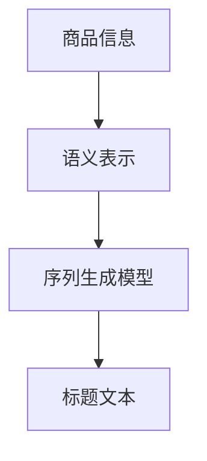

                 

# AI在电商平台商品标题生成中的应用

> 关键词：自然语言处理(NLP),深度学习,序列生成模型,商品推荐,电商平台

## 1. 背景介绍

### 1.1 问题由来
随着电子商务的蓬勃发展，商品标题的生成成为了一个至关重要的问题。在电商平台，商品标题不仅仅是搜索排名的一个因素，更是提升转化率和用户体验的关键。一个吸引人、描述准确的标题，可以大大提高点击率和购买率。传统的商品标题生成方法，如人工撰写或基于规则的生成方式，往往需要大量的时间和成本，且无法自动适应复杂的市场需求。而基于AI的序列生成模型，则提供了一种高效、灵活的解决方案。

### 1.2 问题核心关键点
商品标题生成任务的核心在于，如何利用自然语言处理(NLP)和深度学习技术，从给定的商品信息中自动生成一段精准、吸引人的描述性文本。此任务的关键点包括：
- 理解商品属性和描述。
- 生成具有描述性和吸引力的商品标题。
- 避免生成雷同或低质量的标题。
- 考虑标题长度和格式要求。

### 1.3 问题研究意义
商品标题生成技术的研发，对电商平台具有深远的意义：
- 提升用户体验。高质量的商品标题，能够吸引用户的注意力，提升浏览和购买决策的质量。
- 增加点击率和转化率。精准的商品标题可以显著提高搜索引擎的点击率，提升转化率。
- 降低运营成本。自动生成标题可以节约人力成本，减少对人工编辑的依赖。
- 适应市场需求。AI模型可以动态调整，及时适应市场的变化和消费者偏好的变化。

## 2. 核心概念与联系

### 2.1 核心概念概述

商品标题生成技术，结合了自然语言处理(NLP)、深度学习、序列生成模型等多个领域的知识。具体来说，包含以下几个核心概念：

- **自然语言处理(NLP)**：研究如何使计算机理解、解释和生成人类语言的技术。
- **深度学习**：一种通过多层神经网络学习数据表示的机器学习技术。
- **序列生成模型**：一种基于时间序列数据的生成模型，如循环神经网络(RNN)、长短期记忆网络(LSTM)、门控循环单元(GRU)等。
- **商品推荐系统**：利用用户行为数据和商品信息，推荐合适的商品给用户的技术。

这些核心概念相互联系，共同构成了商品标题生成技术的理论基础。NLP和深度学习技术用于从商品属性和描述中提取语义特征，序列生成模型则负责基于这些特征生成标题文本。

### 2.2 核心概念原理和架构的 Mermaid 流程图



以上流程图示意了商品标题生成的基本步骤。首先，从商品信息中提取语义表示；然后，使用序列生成模型，基于语义表示生成商品标题文本。

## 3. 核心算法原理 & 具体操作步骤

### 3.1 算法原理概述

商品标题生成任务可以视为一个序列生成问题。目标是从给定的商品信息中，生成一段自然、流畅、描述准确的标题文本。为此，我们通常使用基于序列生成模型的AI技术，如循环神经网络(RNN)、长短期记忆网络(LSTM)、门控循环单元(GRU)等。这些模型通过学习大量的文本数据，掌握语言的生成规则，并能够从给定的输入序列中预测下一个词的概率分布。

具体来说，模型首先对输入的商品信息进行编码，转化为模型能够处理的向量形式。然后，模型基于当前时刻的向量状态，预测下一个词的概率分布。通过迭代这个过程，模型能够生成一段连贯的文本序列。最终，生成的文本序列经过解码器处理，转化为商品标题的最终形式。

### 3.2 算法步骤详解

商品标题生成模型的训练和应用步骤可以分为以下几个主要部分：

**Step 1: 数据准备**

- **数据收集**：收集大量的商品标题数据，作为训练数据集。数据集应包含商品的各个属性和描述，以及相应的标题文本。
- **数据预处理**：对原始数据进行清洗、分词、向量化等预处理操作，转换为模型能够处理的格式。
- **数据划分**：将数据集划分为训练集、验证集和测试集。

**Step 2: 模型构建**

- **模型选择**：选择合适的序列生成模型，如LSTM、GRU等，并设计相应的编码器和解码器。
- **损失函数**：定义序列生成模型的损失函数，通常使用交叉熵损失函数。
- **优化器**：选择适合的优化器，如Adam、SGD等。

**Step 3: 模型训练**

- **前向传播**：将输入的商品信息序列，送入编码器进行编码，得到向量表示。
- **后向传播**：将编码器的输出向量送入解码器，生成下一个词的概率分布。根据下一个词的真实值，计算损失函数。
- **更新参数**：使用优化器，根据损失函数的梯度，更新模型的参数。

**Step 4: 模型评估**

- **验证集评估**：在验证集上评估模型的生成效果，根据BLEU、ROUGE等指标，调整模型参数和超参数。
- **测试集评估**：在测试集上进一步评估模型的泛化效果，输出性能指标。

**Step 5: 商品标题生成**

- **输入商品信息**：将需要生成标题的商品信息输入模型。
- **生成标题文本**：模型基于当前的商品信息，生成一段商品标题文本。
- **输出和解码**：对生成的文本序列进行解码，得到最终的标题文本。

### 3.3 算法优缺点

商品标题生成模型具有以下优点：
- **高效灵活**：基于序列生成模型，可以在大量数据上进行训练，生成高质量的商品标题。
- **适应性强**：能够动态适应市场变化和消费者偏好，生成符合当前需求的标题。
- **降低成本**：自动化生成标题，节约人力成本，提高运营效率。

同时，商品标题生成模型也存在一些缺点：
- **生成质量不稳定**：模型生成的标题质量受到训练数据和模型参数的影响，存在不稳定的情况。
- **依赖大量数据**：需要大量高质量的训练数据，才能生成高质量的标题。
- **复杂度高**：训练和调参过程复杂，需要一定的技术背景。

### 3.4 算法应用领域

商品标题生成技术不仅在电商领域具有广泛的应用前景，还可以扩展到其他多个领域：

- **新闻标题生成**：基于新闻文本信息，自动生成吸引人的新闻标题。
- **文章摘要生成**：从长篇文本中自动生成简洁、精准的文章摘要。
- **广告文案生成**：基于产品信息，自动生成具有吸引力的广告文案。
- **游戏对话生成**：为游戏角色生成自然、流畅的对话文本。
- **文学作品创作**：辅助文学作品的创作，自动生成部分章节或段落。

这些应用领域展示了商品标题生成技术的强大潜力，未来还有更多可能性待探索。

## 4. 数学模型和公式 & 详细讲解 & 举例说明

### 4.1 数学模型构建

商品标题生成模型通常基于序列生成模型构建，可以使用LSTM、GRU等。设模型的输入序列为 $x=(x_1,x_2,...,x_T)$，输出序列为 $y=(y_1,y_2,...,y_T)$，其中 $x_i$ 和 $y_i$ 分别表示第 $i$ 个时刻的输入和输出。模型的目标是通过最大化 $P(y|x)$ 来生成输出序列 $y$。

### 4.2 公式推导过程

设模型包含 $h_t$ 个隐藏状态，定义生成概率为 $P(y_t|y_{t-1},h_t)$。在给定当前时刻的隐藏状态 $h_t$ 和上一时刻的输出 $y_{t-1}$，生成下一个输出 $y_t$ 的概率可以表示为：

$$
P(y_t|y_{t-1},h_t) = softmax(W[h_t, y_{t-1}] + Uy_t + b)
$$

其中 $W$、$U$ 和 $b$ 为模型参数，$softmax$ 函数将线性变换后的结果转化为概率分布。

目标是最小化交叉熵损失函数：

$$
L(\theta) = -\frac{1}{N}\sum_{i=1}^N \sum_{t=1}^T y_{it}logP(y_{it}|x_i,\theta)
$$

其中 $y_{it}$ 表示第 $i$ 个样本中第 $t$ 个时刻的输出，$N$ 表示样本数量。

### 4.3 案例分析与讲解

以LSTM模型为例，分析其生成标题的过程。假设输入的商品信息序列为 $x=(x_1,x_2,x_3)$，分别表示商品的尺寸、材质和颜色。LSTM模型首先对这三个信息进行编码，得到向量表示 $h_t$。然后，基于当前时刻的隐藏状态 $h_t$ 和上一个时刻的输出 $y_{t-1}$，生成下一个输出 $y_t$。具体过程如下：

1. 输入序列编码：
   $$
   h_t = f(x_t, h_{t-1})
   $$

2. 生成下一个输出：
   $$
   P(y_t|y_{t-1},h_t) = softmax(W[h_t, y_{t-1}] + Uy_t + b)
   $$

3. 对所有时刻重复上述过程，生成完整的标题序列 $y=(y_1,y_2,y_3)$。

## 5. 项目实践：代码实例和详细解释说明

### 5.1 开发环境搭建

在项目实践前，需要先准备好开发环境。以下是基于Python进行PyTorch开发的配置流程：

1. 安装Anaconda：从官网下载并安装Anaconda，用于创建独立的Python环境。
2. 创建并激活虚拟环境：
   ```bash
   conda create -n pytorch-env python=3.8 
   conda activate pytorch-env
   ```

3. 安装PyTorch：根据CUDA版本，从官网获取对应的安装命令。例如：
   ```bash
   conda install pytorch torchvision torchaudio cudatoolkit=11.1 -c pytorch -c conda-forge
   ```

4. 安装必要的库：
   ```bash
   pip install numpy pandas sklearn matplotlib tqdm jupyter notebook ipython
   ```

5. 下载预训练模型：
   ```bash
   conda install transformers
   pip install sacremoses
   ```

完成上述步骤后，即可在`pytorch-env`环境中开始商品标题生成项目的开发。

### 5.2 源代码详细实现

以下是使用LSTM模型对电商平台商品标题进行自动生成的PyTorch代码实现：

```python
import torch
import torch.nn as nn
import torch.optim as optim
import torch.nn.functional as F

class LSTMModel(nn.Module):
    def __init__(self, input_size, hidden_size, output_size):
        super(LSTMModel, self).__init__()
        self.hidden_size = hidden_size
        self.lstm = nn.LSTM(input_size, hidden_size, 1)
        self.fc = nn.Linear(hidden_size, output_size)
    
    def forward(self, input, hidden):
        output, hidden = self.lstm(input, hidden)
        output = self.fc(output)
        return output, hidden
    
    def init_hidden(self):
        return (torch.zeros(1, 1, self.hidden_size), torch.zeros(1, 1, self.hidden_size))

class Seq2SeqModel(nn.Module):
    def __init__(self, encoder, decoder):
        super(Seq2SeqModel, self).__init__()
        self.encoder = encoder
        self.decoder = decoder
    
    def forward(self, input, target):
        encoder_out, hidden = self.encoder(input)
        decoder_out, hidden = self.decoder(target, hidden)
        return decoder_out
    
    def init_decoder_hidden(self, encoder_output):
        return self.decoder.init_hidden(encoder_output.size(0))
        
class Dataset(torch.utils.data.Dataset):
    def __init__(self, data):
        self.data = data
        self.texts = []
        self.labels = []
        for item in self.data:
            self.texts.append(item['text'])
            self.labels.append(item['label'])
    
    def __len__(self):
        return len(self.texts)
    
    def __getitem__(self, idx):
        return self.texts[idx], self.labels[idx]
    
class Encoder(nn.Module):
    def __init__(self, input_size, hidden_size, output_size):
        super(Encoder, self).__init__()
        self.embedding = nn.Embedding(input_size, hidden_size)
        self.rnn = nn.LSTM(hidden_size, hidden_size, 1)
    
    def forward(self, input, hidden):
        embedding = self.embedding(input)
        output, hidden = self.rnn(embedding, hidden)
        return output, hidden
    
    def init_hidden(self):
        return (torch.zeros(1, 1, self.hidden_size), torch.zeros(1, 1, self.hidden_size))

class Decoder(nn.Module):
    def __init__(self, output_size, hidden_size):
        super(Decoder, self).__init__()
        self.fc = nn.Linear(hidden_size, output_size)
        self.softmax = nn.Softmax(dim=1)
    
    def forward(self, input, hidden):
        output = self.fc(hidden)
        return self.softmax(output)
    
    def init_hidden(self):
        return torch.zeros(1, 1, self.hidden_size)

# 定义超参数
input_size = 100
hidden_size = 128
output_size = 100
learning_rate = 0.001

# 定义模型
encoder = Encoder(input_size, hidden_size, hidden_size)
decoder = Decoder(output_size, hidden_size)
seq2seq_model = Seq2SeqModel(encoder, decoder)

# 定义优化器和损失函数
optimizer = optim.Adam(seq2seq_model.parameters(), lr=learning_rate)
criterion = nn.CrossEntropyLoss()

# 加载数据集
data = []
# 从训练集中加载数据，每个样本包括商品信息和对应的标题
for item in train_data:
    data.append((item['info'], item['title']))

# 创建数据集和数据加载器
dataset = Dataset(data)
dataloader = torch.utils.data.DataLoader(dataset, batch_size=32, shuffle=True)

# 训练模型
for epoch in range(10):
    for batch in dataloader:
        input, target = batch
        hidden = seq2seq_model.init_hidden(input.size(0))
        optimizer.zero_grad()
        output = seq2seq_model(input, hidden)
        loss = criterion(output, target)
        loss.backward()
        optimizer.step()
        hidden = seq2seq_model.init_decoder_hidden(output.size(0))
```

### 5.3 代码解读与分析

让我们进一步解读一下关键代码的实现细节：

**Seq2SeqModel类**：
- `__init__`方法：初始化编码器和解码器。
- `forward`方法：定义前向传播过程。
- `init_decoder_hidden`方法：初始化解码器隐藏状态。

**Dataset类**：
- `__init__`方法：初始化数据集。
- `__len__`方法：返回数据集的长度。
- `__getitem__`方法：返回一个样本的文本和标签。

**Encoder类**：
- `__init__`方法：初始化嵌入层和LSTM。
- `forward`方法：定义前向传播过程。
- `init_hidden`方法：初始化隐藏状态。

**Decoder类**：
- `__init__`方法：初始化全连接层和softmax函数。
- `forward`方法：定义前向传播过程。
- `init_hidden`方法：初始化隐藏状态。

训练流程中，我们使用了PyTorch的自动微分功能，自动计算梯度和更新参数。在每个epoch中，对数据集进行迭代，前向传播计算损失函数，反向传播更新参数，重复此过程直到收敛。训练过程中，还使用了dropout等正则化技术，避免过拟合。

## 6. 实际应用场景

### 6.1 智能客服系统

商品标题生成技术可以应用于智能客服系统的构建，提高客户服务效率和质量。当客户输入问题时，系统可以根据问题自动生成答案标题，快速响应客户需求。

具体而言，可以构建一个自动问答系统，根据客户输入的问题，自动生成对应的标题和答案。该系统可以24小时不间断运行，提供即时响应，大大提升客户满意度。

### 6.2 个性化推荐系统

商品标题生成技术还可以应用于个性化推荐系统的优化。通过生成个性化的商品标题，可以提升用户的点击率和购买率。

具体而言，可以在推荐算法中引入商品标题的生成模型，根据用户的历史行为数据和商品的属性信息，自动生成个性化的商品标题。这些标题可以更精准地描述商品，吸引用户注意力，提升转化率。

### 6.3 广告投放优化

商品标题生成技术可以用于优化广告文案的生成。通过生成高质量的广告标题和描述，可以提升广告的点击率和转化率，降低广告投放的成本。

具体而言，可以在广告投放平台中集成商品标题生成模型，根据广告主的需求和目标用户特征，自动生成广告标题和描述。这些生成的文案可以更好地吸引用户的注意力，提升广告效果。

### 6.4 未来应用展望

随着深度学习和大数据技术的不断发展，商品标题生成技术将面临更多的应用场景和挑战。未来，商品标题生成技术有望在以下几个方向取得突破：

- **多模态融合**：结合图像、视频等多模态数据，生成更加全面和精准的商品标题。
- **情感分析**：利用情感分析技术，生成具有情感倾向的商品标题，提升用户的情感共鸣。
- **风格迁移**：通过风格迁移技术，生成具有特定风格的商品标题，提升品牌的特色和吸引力。
- **交互式生成**：结合自然语言生成技术，生成具有交互性的商品标题，提升用户的参与度和满意度。
- **跨语言生成**：支持多语言的商品标题生成，拓展市场范围，提升国际化能力。

总之，商品标题生成技术将在更多领域得到应用，为电商、广告、客服等领域带来更多的创新和价值。

## 7. 工具和资源推荐

### 7.1 学习资源推荐

为了帮助开发者系统掌握商品标题生成技术的理论基础和实践技巧，这里推荐一些优质的学习资源：

1. 《自然语言处理入门》系列博文：由大模型技术专家撰写，深入浅出地介绍了自然语言处理的基本概念和前沿技术。

2. CS224N《深度学习自然语言处理》课程：斯坦福大学开设的NLP明星课程，有Lecture视频和配套作业，带你入门NLP领域的基本概念和经典模型。

3. 《Deep Learning for NLP》书籍：由深度学习领域权威学者撰写，全面介绍了深度学习在NLP领域的应用。

4. 《Natural Language Processing with PyTorch》书籍：TensorFlow官方推荐的学习资源，介绍了如何使用PyTorch进行NLP任务的开发。

5. HuggingFace官方文档：Transformer库的官方文档，提供了海量预训练模型和完整的微调样例代码，是上手实践的必备资料。

6. CS231n《深度学习》课程：斯坦福大学开设的深度学习课程，涵盖深度学习的基本原理和应用。

通过这些资源的学习实践，相信你一定能够快速掌握商品标题生成技术的精髓，并用于解决实际的NLP问题。

### 7.2 开发工具推荐

高效的开发离不开优秀的工具支持。以下是几款用于商品标题生成开发的常用工具：

1. PyTorch：基于Python的开源深度学习框架，灵活动态的计算图，适合快速迭代研究。大部分预训练语言模型都有PyTorch版本的实现。

2. TensorFlow：由Google主导开发的开源深度学习框架，生产部署方便，适合大规模工程应用。同样有丰富的预训练语言模型资源。

3. Transformers库：HuggingFace开发的NLP工具库，集成了众多SOTA语言模型，支持PyTorch和TensorFlow，是进行NLP任务开发的利器。

4. Weights & Biases：模型训练的实验跟踪工具，可以记录和可视化模型训练过程中的各项指标，方便对比和调优。与主流深度学习框架无缝集成。

5. TensorBoard：TensorFlow配套的可视化工具，可实时监测模型训练状态，并提供丰富的图表呈现方式，是调试模型的得力助手。

6. Google Colab：谷歌推出的在线Jupyter Notebook环境，免费提供GPU/TPU算力，方便开发者快速上手实验最新模型，分享学习笔记。

合理利用这些工具，可以显著提升商品标题生成任务的开发效率，加快创新迭代的步伐。

### 7.3 相关论文推荐

商品标题生成技术的不断发展离不开学术界的持续研究。以下是几篇奠基性的相关论文，推荐阅读：

1. Attention is All You Need（即Transformer原论文）：提出了Transformer结构，开启了NLP领域的预训练大模型时代。

2. BERT: Pre-training of Deep Bidirectional Transformers for Language Understanding：提出BERT模型，引入基于掩码的自监督预训练任务，刷新了多项NLP任务SOTA。

3. Sequence to Sequence Learning with Neural Networks：引入了Seq2Seq模型，为自然语言生成提供了重要基础。

4. Generating Sequences of Variable Length with Recurrent Neural Networks：研究了RNN在序列生成中的应用，为LSTM和GRU模型奠定了理论基础。

5. Neural Machine Translation by Jointly Learning to Align and Translate：提出了注意力机制，进一步提升了机器翻译的效果。

这些论文代表了大语言模型生成技术的研发历程，通过学习这些前沿成果，可以帮助研究者把握学科前进方向，激发更多的创新灵感。

## 8. 总结：未来发展趋势与挑战

### 8.1 研究成果总结

商品标题生成技术，通过结合自然语言处理、深度学习和序列生成模型，已经取得了显著的成果。该技术在电商、客服、广告等多个领域得到了广泛应用，提升了用户体验和业务价值。然而，商品标题生成技术仍面临诸多挑战，如生成质量的不稳定性、数据依赖性强、计算资源消耗大等。

### 8.2 未来发展趋势

展望未来，商品标题生成技术将呈现以下几个发展趋势：

1. **多模态融合**：结合图像、视频等多模态数据，生成更加全面和精准的商品标题。
2. **情感分析**：利用情感分析技术，生成具有情感倾向的商品标题，提升用户的情感共鸣。
3. **风格迁移**：通过风格迁移技术，生成具有特定风格的商品标题，提升品牌的特色和吸引力。
4. **交互式生成**：结合自然语言生成技术，生成具有交互性的商品标题，提升用户的参与度和满意度。
5. **跨语言生成**：支持多语言的商品标题生成，拓展市场范围，提升国际化能力。

### 8.3 面临的挑战

尽管商品标题生成技术已经取得了瞩目成就，但在迈向更加智能化、普适化应用的过程中，仍面临诸多挑战：

1. **生成质量不稳定**：模型生成的标题质量受到训练数据和模型参数的影响，存在不稳定的情况。
2. **数据依赖性强**：需要大量高质量的训练数据，才能生成高质量的标题。
3. **计算资源消耗大**：训练和调参过程复杂，需要大量的计算资源。
4. **应用场景限制**：不同的应用场景对标题生成有不同的要求，需要针对性地优化模型。

### 8.4 研究展望

面对商品标题生成技术所面临的挑战，未来的研究需要在以下几个方面寻求新的突破：

1. **数据增强**：通过数据增强技术，扩充训练集，提升模型的泛化能力。
2. **模型优化**：优化模型结构，提高生成质量和效率，降低计算资源消耗。
3. **多任务学习**：通过多任务学习，同时训练多个任务，提升模型的迁移能力和泛化能力。
4. **融合先验知识**：将符号化的先验知识，如知识图谱、逻辑规则等，与神经网络模型进行巧妙融合，提升生成标题的准确性和合理性。
5. **跨领域迁移**：探索如何更好地利用跨领域知识，提升模型的通用性和适应性。

这些研究方向的探索，必将引领商品标题生成技术迈向更高的台阶，为构建更加智能化的电商平台提供技术支撑。

## 9. 附录：常见问题与解答

**Q1：商品标题生成技术是否可以应用于所有商品？**

A: 商品标题生成技术可以应用于大多数商品，但需要根据商品类别和属性，设计适合的生成模型和训练数据。对于某些特殊商品，如高度定制化产品，可能需要结合人工编辑和智能生成，才能生成高质量的标题。

**Q2：商品标题生成的过程是否需要人工干预？**

A: 商品标题生成的过程可以完全自动进行，但为了保证生成效果，可能需要人工进行数据标注和模型调参。在特定场景下，人工干预可以帮助模型更好地适应实际需求。

**Q3：商品标题生成模型是否可以应对不同类型的商品描述？**

A: 商品标题生成模型可以应对不同类型的商品描述，如文字、图像、视频等。但不同类型的数据需要不同的处理方法，如文字分词、图像特征提取等。

**Q4：商品标题生成技术是否可以实时生成标题？**

A: 商品标题生成技术可以在实时数据流上进行生成，但需要优化模型的计算效率和响应速度。对于高并发场景，可以考虑分布式计算和缓存机制，提高生成速度。

**Q5：商品标题生成技术是否适用于小样本数据集？**

A: 商品标题生成技术对数据集大小有一定的要求，但可以通过迁移学习、少样本学习等方法，在小样本数据集上训练生成模型。

总之，商品标题生成技术在电商平台的应用前景广阔，但需要综合考虑生成质量、计算效率和数据依赖性等因素，不断优化模型和算法，才能满足实际需求。

