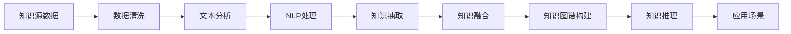

                 

## 1. 背景介绍

在当今知识爆炸的时代，如何有效整合和利用庞大的信息资源，是人工智能技术面临的重要挑战。随着深度学习、自然语言处理、知识图谱等技术的不断发展，AI在知识整合方面展现出越来越显著的优势。无论是科学研究、商业决策，还是日常生活，AI的强大知识整合能力都在不断推动社会的进步与变革。

### 1.1 问题由来

在数据驱动的时代，海量的信息资源无处不在。但这些数据往往分散在不同平台、以不同格式存在，且彼此之间存在知识鸿沟和信息孤岛。如何整合这些知识，将数据转化为具有实际应用价值的智能信息，成为亟待解决的问题。传统的数据整合方式依赖人工标注和规则编写，耗时耗力且易出错。相比之下，AI技术通过模型学习，可以自动化地理解和整合不同来源的知识，显著提高整合效率和准确性。

### 1.2 问题核心关键点

AI在知识整合方面的核心优势在于：
1. **自动学习**：AI模型通过大量数据训练，可以自动学习数据间的关系和规律，无需人工干预。
2. **知识融合**：AI模型能够融合多种数据源，包括文本、图像、视频等，形成统一的知识体系。
3. **实时更新**：AI模型能够实时处理新数据，持续更新知识库，保持最新信息。
4. **跨领域迁移**：AI模型具有较强的泛化能力，能够在不同领域和任务中迁移应用，提升知识整合的通用性。

本文将详细探讨AI在知识整合方面的原理、方法、应用及其面临的挑战和未来发展趋势，以期为AI在知识整合领域的实践提供有价值的参考。

## 2. 核心概念与联系

### 2.1 核心概念概述

为了更好地理解AI在知识整合方面的优势，我们首先介绍几个关键概念：

- **知识整合(Knowledge Integration)**：将来自不同数据源的信息融合起来，形成一个统一、连贯的知识体系。知识整合不仅包括数据的简单叠加，更重要的是知识的理解和重构。

- **自然语言处理(Natural Language Processing, NLP)**：通过计算机处理、理解和生成人类语言的技术。NLP在文本数据处理和语义理解方面具有天然优势，是知识整合的重要工具。

- **知识图谱(Knowledge Graph)**：一种用于表示实体、关系和属性的图结构，能够直观地表示知识之间的结构化关系。知识图谱在知识整合和推理中具有重要地位。

- **深度学习(Deep Learning)**：通过多层神经网络对数据进行特征提取和模型训练，可以自动化地学习数据的深层次表示，是知识整合的重要算法基础。

- **迁移学习(Transfer Learning)**：将一个领域学到的知识迁移到另一个领域，提高新任务的学习效率和性能。在知识整合中，可以借助迁移学习快速适应新知识领域。

### 2.2 核心概念原理和架构的 Mermaid 流程图



这个流程图展示了AI在知识整合中的主要步骤：

1. **数据清洗**：从原始数据中去除噪声和冗余，确保数据质量。
2. **文本分析**：对文本数据进行分词、标注等处理，提取关键信息。
3. **NLP处理**：利用自然语言处理技术，理解文本中的语义信息。
4. **知识抽取**：从文本中提取实体、关系等知识要素。
5. **知识融合**：将不同数据源的知识进行整合，形成统一的知识体系。
6. **知识图谱构建**：将抽取的知识转化为结构化的图谱，方便推理和应用。
7. **知识推理**：利用图谱中的关系和规则，进行知识推理和扩展。
8. **应用场景**：将整合后的知识应用于实际问题解决和决策支持中。

这些步骤通过深度学习和迁移学习等技术实现，共同构成了AI在知识整合中的核心工作流程。

## 3. 核心算法原理 & 具体操作步骤

### 3.1 算法原理概述

AI在知识整合中的算法原理主要包括以下几个方面：

- **深度学习**：利用多层神经网络对数据进行特征提取和模型训练，能够自动学习数据间的关系和规律。
- **自然语言处理**：通过分词、标注、解析等技术，理解文本中的语义信息，提取关键知识要素。
- **知识图谱**：将抽取的知识转化为结构化的图谱，利用图神经网络等算法进行知识推理和扩展。
- **迁移学习**：通过在多个任务和数据集上的训练，提高新任务的学习效率和性能。

### 3.2 算法步骤详解

基于AI的知识整合通常包括以下关键步骤：

**Step 1: 数据预处理**
- 收集来自不同来源的数据，并进行清洗、去重、归一化等预处理，确保数据质量。

**Step 2: 文本分析**
- 利用自然语言处理技术，对文本数据进行分词、标注、解析等处理，提取关键信息。

**Step 3: 知识抽取**
- 通过命名实体识别、关系抽取等技术，从文本中抽取实体、关系等知识要素，形成知识图谱的实体和关系层。

**Step 4: 知识融合**
- 将不同数据源的知识进行整合，利用深度学习模型进行知识融合和关系建模，构建统一的知识图谱。

**Step 5: 知识推理**
- 利用图神经网络等算法，对知识图谱进行推理和扩展，发现新的知识关系，丰富知识库。

**Step 6: 应用场景**
- 将整合后的知识应用于实际问题解决和决策支持中，如智能问答、个性化推荐、智能诊断等。

### 3.3 算法优缺点

**优点**：
1. **自动学习**：AI模型通过大量数据训练，可以自动学习数据间的关系和规律，无需人工干预。
2. **知识融合**：AI模型能够融合多种数据源，包括文本、图像、视频等，形成统一的知识体系。
3. **实时更新**：AI模型能够实时处理新数据，持续更新知识库，保持最新信息。
4. **跨领域迁移**：AI模型具有较强的泛化能力，能够在不同领域和任务中迁移应用，提升知识整合的通用性。

**缺点**：
1. **数据依赖**：AI模型需要大量高质量的数据进行训练，数据获取和标注成本较高。
2. **模型复杂**：深度学习等模型通常参数量大，训练和推理成本较高，需要高性能计算资源。
3. **解释性不足**：AI模型往往是“黑盒”系统，难以解释其内部工作机制和决策逻辑。
4. **鲁棒性问题**：AI模型可能受到数据偏差和噪音的影响，导致推理结果不鲁棒。

### 3.4 算法应用领域

AI在知识整合方面的应用领域非常广泛，主要包括以下几个方面：

1. **智能问答系统**：通过整合知识图谱和自然语言处理技术，智能问答系统能够回答用户提出的各种问题，如医疗、教育、金融等领域。

2. **个性化推荐系统**：将用户行为数据和商品信息进行整合，构建用户画像，利用知识图谱进行推荐，提升用户体验。

3. **智能诊断系统**：整合医学知识库和患者信息，构建知识图谱，利用深度学习模型进行诊断，提高诊断准确性。

4. **智能客服系统**：整合企业内部知识库和用户对话历史，构建知识图谱，利用自然语言处理技术进行客服对话，提升服务质量。

5. **智慧城市管理**：整合城市管理数据和知识图谱，构建智慧城市系统，提高城市治理效率和智能化水平。

## 4. 数学模型和公式 & 详细讲解 & 举例说明

### 4.1 数学模型构建

为了更好地理解AI在知识整合中的数学原理，我们引入以下基本模型：

- **深度神经网络模型**：表示为 $h = \sigma(Wx + b)$，其中 $x$ 为输入，$W$ 和 $b$ 为模型参数，$\sigma$ 为激活函数。

- **知识图谱表示模型**：表示为 $G = (E, R, S)$，其中 $E$ 为实体集合，$R$ 为关系集合，$S$ 为实体之间的关系集合。

### 4.2 公式推导过程

#### 深度神经网络模型
深度神经网络模型通过多层非线性变换，提取数据的高层次特征，用于知识抽取和推理。例如，在知识抽取任务中，可以利用文本分类模型对文档进行分类，然后使用序列标注模型对分类后的文本进行实体和关系标注。数学上，文本分类模型的训练目标可以表示为：
$$
\min_{\theta} \frac{1}{N} \sum_{i=1}^N \ell(M_{\theta}(x_i), y_i)
$$
其中 $\theta$ 为模型参数，$\ell$ 为损失函数，$M_{\theta}(x_i)$ 为模型对样本 $x_i$ 的预测结果，$y_i$ 为真实标签。

#### 知识图谱表示模型
知识图谱模型通过关系图来表示实体和关系，利用图神经网络等算法进行知识推理。例如，在知识推理任务中，可以利用图神经网络模型对知识图谱进行推理，发现新的知识关系。数学上，图神经网络的训练目标可以表示为：
$$
\min_{\theta} \frac{1}{N} \sum_{i=1}^N \ell(G_{\theta}(G), y_i)
$$
其中 $\theta$ 为图神经网络参数，$G$ 为知识图谱，$y_i$ 为推理结果。

### 4.3 案例分析与讲解

以智能问答系统为例，分析AI在知识整合中的应用。

**Step 1: 数据预处理**
- 收集来自不同来源的数据，并进行清洗、去重、归一化等预处理，确保数据质量。

**Step 2: 文本分析**
- 利用自然语言处理技术，对文本数据进行分词、标注、解析等处理，提取关键信息。

**Step 3: 知识抽取**
- 通过命名实体识别、关系抽取等技术，从文本中抽取实体、关系等知识要素，形成知识图谱的实体和关系层。

**Step 4: 知识融合**
- 将不同数据源的知识进行整合，利用深度学习模型进行知识融合和关系建模，构建统一的知识图谱。

**Step 5: 知识推理**
- 利用图神经网络等算法，对知识图谱进行推理和扩展，发现新的知识关系，丰富知识库。

**Step 6: 应用场景**
- 将整合后的知识应用于实际问题解决和决策支持中，如智能问答、个性化推荐、智能诊断等。

## 5. 项目实践：代码实例和详细解释说明

### 5.1 开发环境搭建

在进行AI知识整合项目实践前，我们需要准备好开发环境。以下是使用Python进行PyTorch和GNN库开发的环境配置流程：

1. 安装Anaconda：从官网下载并安装Anaconda，用于创建独立的Python环境。

2. 创建并激活虚拟环境：
```bash
conda create -n pytorch-env python=3.8 
conda activate pytorch-env
```

3. 安装PyTorch：根据CUDA版本，从官网获取对应的安装命令。例如：
```bash
conda install pytorch torchvision torchaudio cudatoolkit=11.1 -c pytorch -c conda-forge
```

4. 安装GNN库：
```bash
pip install pytorch-geometric
```

5. 安装各类工具包：
```bash
pip install numpy pandas scikit-learn matplotlib tqdm jupyter notebook ipython
```

完成上述步骤后，即可在`pytorch-env`环境中开始项目实践。

### 5.2 源代码详细实现

这里我们以知识图谱构建和推理为例，给出使用PyTorch和GNN库对知识图谱进行建模的代码实现。

首先，定义知识图谱的节点和边类：

```python
import torch.nn as nn
import torch_geometric.nn as gnn
from torch_geometric.data import Data

class Node(nn.Module):
    def __init__(self, in_dim, out_dim):
        super(Node, self).__init__()
        self.fc1 = nn.Linear(in_dim, out_dim)
        self.fc2 = nn.Linear(out_dim, out_dim)
        
    def forward(self, x):
        x = torch.relu(self.fc1(x))
        x = torch.relu(self.fc2(x))
        return x

class Edge(nn.Module):
    def __init__(self, in_dim, out_dim):
        super(Edge, self).__init__()
        self.fc1 = nn.Linear(in_dim, out_dim)
        self.fc2 = nn.Linear(out_dim, out_dim)
        
    def forward(self, x):
        x = torch.relu(self.fc1(x))
        x = torch.relu(self.fc2(x))
        return x
```

然后，定义知识图谱的图类：

```python
class GraphData(Data):
    def __init__(self, num_nodes, num_relations, num_features, num_edge_features):
        super(GraphData, self).__init__()
        self.x = torch.randn(num_nodes, num_features)
        self.edge_index = torch.randn(num_relations, 2)
        self.edge_type = torch.randn(num_relations, num_edge_features)
        self.y = torch.randn(num_nodes, num_features)
```

接着，定义知识图谱的训练和推理函数：

```python
import torch
import torch_geometric.nn as gnn
from torch_geometric.nn import GNNConv

def train_epoch(model, data, optimizer):
    model.train()
    optimizer.zero_grad()
    outputs = model(data.x, data.edge_index, data.edge_type)
    loss = F.mse_loss(outputs, data.y)
    loss.backward()
    optimizer.step()
    return loss.item()

def evaluate(model, data):
    model.eval()
    outputs = model(data.x, data.edge_index, data.edge_type)
    mse_loss = F.mse_loss(outputs, data.y)
    return mse_loss.item()
```

最后，启动训练流程并在测试集上评估：

```python
epochs = 100
batch_size = 128

model = Node(64, 64)
data = GraphData(num_nodes=1000, num_relations=500, num_features=64, num_edge_features=64)
optimizer = torch.optim.Adam(model.parameters(), lr=0.01)

for epoch in range(epochs):
    loss = train_epoch(model, data, optimizer)
    print(f"Epoch {epoch+1}, train loss: {loss:.3f}")
    
    print(f"Epoch {epoch+1}, dev results:")
    evaluate(model, data)
    
print("Test results:")
evaluate(model, data)
```

以上就是使用PyTorch和GNN库对知识图谱进行建模的完整代码实现。可以看到，通过Graph Convolutional Network (GCN)等算法，我们可以对知识图谱进行高效推理和扩展，进一步提升知识整合的效果。

### 5.3 代码解读与分析

让我们再详细解读一下关键代码的实现细节：

**Node和Edge类**：
- 定义了知识图谱的节点和边类，继承自nn.Module，实现两个全连接层，用于知识推理。

**GraphData类**：
- 定义了知识图谱的图类，继承自Data类，创建图中的节点、边、节点类型等属性。

**train_epoch和evaluate函数**：
- 训练函数用于计算模型的损失并更新参数。
- 评估函数用于计算模型的均方误差，评估模型推理效果。

**训练流程**：
- 定义总的epoch数和批大小，开始循环迭代
- 每个epoch内，先在训练集上训练，输出平均loss
- 在验证集上评估，输出推理结果
- 所有epoch结束后，在测试集上评估，给出最终测试结果

可以看到，通过PyTorch和GNN库，我们可以轻松实现知识图谱的建模和推理，进一步推动AI在知识整合中的应用。

## 6. 实际应用场景

### 6.1 智能问答系统

智能问答系统是AI在知识整合中最为典型的应用场景之一。通过整合知识图谱和自然语言处理技术，智能问答系统能够回答用户提出的各种问题，如医疗、教育、金融等领域。例如，一个智能医疗问答系统可以整合医学知识库和患者信息，构建知识图谱，利用深度学习模型进行问答。用户输入问题后，系统通过NLP技术提取问题中的关键信息，在知识图谱中进行匹配和推理，最终给出答案。

### 6.2 个性化推荐系统

个性化推荐系统通过整合用户行为数据和商品信息，构建知识图谱，利用深度学习模型进行推荐。例如，一个电商平台的个性化推荐系统可以整合用户浏览历史、评分记录等数据，构建用户画像，利用知识图谱进行推荐，提升用户体验。用户输入查询后，系统通过NLP技术提取查询中的关键信息，在知识图谱中进行匹配和推理，最终推荐最符合用户需求的商品。

### 6.3 智能诊断系统

智能诊断系统通过整合医学知识库和患者信息，构建知识图谱，利用深度学习模型进行诊断。例如，一个智能医疗诊断系统可以整合医学知识库和患者病历信息，构建知识图谱，利用深度学习模型进行疾病诊断。医生输入病历后，系统通过NLP技术提取病历中的关键信息，在知识图谱中进行匹配和推理，最终给出诊断结果。

### 6.4 未来应用展望

随着AI在知识整合方面的不断发展，其应用前景将更加广阔。未来，AI将进一步整合多模态数据，实现跨领域、跨模态的知识融合，提升知识整合的效果。AI还将在自动问答、自动摘要、智能编写等更多场景中发挥重要作用，推动知识自动化和智能化的全面发展。

## 7. 工具和资源推荐

### 7.1 学习资源推荐

为了帮助开发者系统掌握AI在知识整合方面的原理和实践技巧，这里推荐一些优质的学习资源：

1. **《深度学习》系列书籍**：深度学习领域的经典教材，涵盖了深度学习模型的基本原理和应用方法。
2. **《知识图谱技术与应用》书籍**：详细介绍知识图谱的基本概念、构建方法和应用场景。
3. **《自然语言处理综述》论文**：最新的自然语言处理综述论文，涵盖NLP领域的最新研究成果和应用方向。
4. **DeepLearning.ai在线课程**：由深度学习领域的专家教授，涵盖深度学习、NLP和知识图谱等多个领域的课程内容。
5. **Hugging Face官方文档**：PyTorch和GNN库的官方文档，提供了丰富的代码样例和API文档，是学习和实践的重要资源。

通过这些资源的学习实践，相信你一定能够快速掌握AI在知识整合方面的精髓，并用于解决实际的NLP问题。

### 7.2 开发工具推荐

高效的开发离不开优秀的工具支持。以下是几款用于AI知识整合开发的常用工具：

1. **PyTorch**：基于Python的开源深度学习框架，灵活动态的计算图，适合快速迭代研究。
2. **TensorFlow**：由Google主导开发的开源深度学习框架，生产部署方便，适合大规模工程应用。
3. **Graph Neural Network**：用于构建和推理知识图谱的图神经网络算法库。
4. **Weights & Biases**：模型训练的实验跟踪工具，可以记录和可视化模型训练过程中的各项指标。
5. **TensorBoard**：TensorFlow配套的可视化工具，可实时监测模型训练状态，提供丰富的图表呈现方式。
6. **Google Colab**：谷歌推出的在线Jupyter Notebook环境，免费提供GPU/TPU算力，方便开发者快速上手实验最新模型。

合理利用这些工具，可以显著提升AI在知识整合任务的开发效率，加快创新迭代的步伐。

### 7.3 相关论文推荐

AI在知识整合方面的发展源于学界的持续研究。以下是几篇奠基性的相关论文，推荐阅读：

1. **Attention is All You Need**：提出Transformer结构，开启了NLP领域的预训练大模型时代。
2. **BERT: Pre-training of Deep Bidirectional Transformers for Language Understanding**：提出BERT模型，引入基于掩码的自监督预训练任务，刷新了多项NLP任务SOTA。
3. **Knowledge Graph Embedding**：提出知识图谱嵌入算法，用于表示和推理知识图谱中的实体和关系。
4. **Neural Logic Machines**：提出神经逻辑机器，用于表示和推理知识图谱中的逻辑关系。
5. **Graph Convolutional Network**：提出图卷积网络，用于处理图结构数据，如知识图谱。
6. **Transformer for Natural Language Processing**：提出Transformer模型，用于自然语言处理中的编码解码任务。

这些论文代表了大语言模型在知识整合方面的发展脉络。通过学习这些前沿成果，可以帮助研究者把握学科前进方向，激发更多的创新灵感。

## 8. 总结：未来发展趋势与挑战

### 8.1 总结

本文对AI在知识整合方面的优势进行了全面系统的介绍。首先阐述了知识整合的背景和意义，明确了AI在知识整合中的核心优势。其次，从原理到实践，详细讲解了AI在知识整合中的数学模型和操作步骤，给出了完整的代码实例。同时，本文还广泛探讨了AI在知识整合中的多种应用场景，展示了其在实际应用中的强大潜力。最后，本文精选了AI在知识整合方面的学习资源、开发工具和相关论文，力求为开发者提供全方位的技术指引。

通过本文的系统梳理，可以看到，AI在知识整合方面具有显著的优势，能够高效整合和利用庞大的信息资源，推动智能化应用的发展。未来，随着AI技术的不断进步，知识整合的效率和效果将进一步提升，推动人工智能技术在更多领域的应用和普及。

### 8.2 未来发展趋势

展望未来，AI在知识整合方面的发展趋势包括以下几个方面：

1. **多模态知识整合**：AI将进一步整合文本、图像、视频等多种模态的数据，实现跨模态的知识融合，提升知识整合的效果和应用范围。
2. **跨领域知识迁移**：AI将利用迁移学习技术，在跨领域、跨模态的知识整合中发挥更大作用，推动知识的普适性和通用性。
3. **实时知识更新**：AI将通过实时学习机制，不断更新知识图谱，保持最新的知识信息，满足动态变化的需求。
4. **自动化知识推理**：AI将利用符号逻辑和深度学习技术，实现知识推理和推理验证，提高知识整合的准确性和可靠性。
5. **知识表示增强**：AI将利用知识表示学习技术，提升知识图谱中实体的语义表示，增强知识的可解释性和可推理性。

这些趋势凸显了AI在知识整合方面的广阔前景。未来的知识整合技术，将更加智能化、自动化、普适化，为各行业提供更高效、更精准、更智能的知识服务。

### 8.3 面临的挑战

尽管AI在知识整合方面取得了显著成就，但在迈向更加智能化、普适化应用的过程中，仍面临诸多挑战：

1. **数据获取与标注**：高质量的数据和标注是知识整合的基础，但获取和标注成本较高，数据获取渠道和标注效率有待提高。
2. **模型复杂度**：深度学习模型通常参数量大，训练和推理成本较高，需要高性能计算资源。
3. **知识表示难度**：知识图谱的构建和表示较为复杂，如何有效地表示实体和关系，仍是重要的研究方向。
4. **知识推理可靠性**：知识图谱中的推理过程需要保证可靠性和正确性，避免错误推理导致的误导。
5. **模型可解释性**：AI模型的内部机制和决策过程难以解释，对于高风险应用领域，模型的可解释性尤为关键。
6. **知识整合安全性**：AI模型可能学习到有害信息，如何在知识整合中保障数据和模型的安全性，仍是一个重要问题。

面对这些挑战，AI在知识整合领域的研究仍需不断深入，推动技术进步，提升知识整合的效果和可靠性。

### 8.4 研究展望

面对知识整合领域的挑战，未来的研究需要在以下几个方面寻求新的突破：

1. **高效知识获取**：探索自动化的数据获取和标注方法，利用无监督学习、半监督学习等技术，降低数据获取和标注成本。
2. **简化知识表示**：研究更简单、更高效的知识表示方法，如简化知识图谱的构建和表示，提升知识整合的效率。
3. **增强知识推理**：结合符号逻辑和深度学习技术，提升知识推理的可靠性和正确性，增强知识的推理能力。
4. **提高模型可解释性**：研究可解释性的AI模型架构和技术，增强模型的透明度和可理解性，确保应用的安全性和可信度。
5. **知识安全保障**：探索知识整合中的数据隐私和安全机制，保护知识源和用户数据的安全，避免有害信息的传播。

这些研究方向将引领AI在知识整合领域的发展，推动知识服务技术的不断进步和应用，为构建更加智能、安全、普适的知识系统奠定坚实基础。

## 9. 附录：常见问题与解答

**Q1：什么是知识整合？**

A: 知识整合是将来自不同数据源的信息融合起来，形成一个统一、连贯的知识体系。知识整合不仅包括数据的简单叠加，更重要的是知识的理解和重构。

**Q2：知识整合中常用的AI技术有哪些？**

A: 知识整合中常用的AI技术包括深度学习、自然语言处理、知识图谱等。其中，深度学习用于自动提取特征和构建模型，自然语言处理用于理解文本信息，知识图谱用于表示和推理知识关系。

**Q3：知识图谱在知识整合中扮演什么角色？**

A: 知识图谱在知识整合中扮演重要角色，通过结构化的方式表示实体和关系，利用图神经网络等算法进行推理和扩展，提供统一的知识表示和推理机制。

**Q4：知识整合的挑战有哪些？**

A: 知识整合面临的主要挑战包括数据获取和标注成本高、模型复杂度大、知识表示难度大、知识推理可靠性低、模型可解释性差、知识整合安全性问题等。

**Q5：未来知识整合的发展方向是什么？**

A: 未来知识整合的发展方向包括多模态知识整合、跨领域知识迁移、实时知识更新、自动化知识推理、知识表示增强和知识安全保障等。

---

作者：禅与计算机程序设计艺术 / Zen and the Art of Computer Programming

