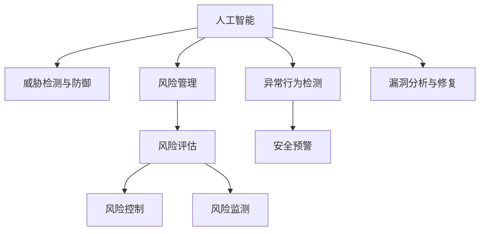

                 

# AI在网络安全和风险管理中的应用

> 关键词：人工智能,网络安全,风险管理,数据隐私,威胁检测,安全防护,漏洞分析,异常行为检测

## 1. 背景介绍

### 1.1 问题由来
随着互联网技术的飞速发展，网络安全问题日益严重。黑客攻击、数据泄露、恶意软件等威胁层出不穷，对企业和个人的网络安全带来了巨大挑战。传统的安全防护手段，如防火墙、入侵检测系统等，已经难以应对日益复杂的网络攻击。

面对这些严峻挑战，人工智能(AI)技术逐渐成为网络安全领域的利器。AI技术能够通过大数据分析和机器学习算法，实现对网络威胁的快速识别、分析和应对。尤其是在威胁检测、风险评估、异常行为检测等方面，AI已经展现出显著的优势，成为网络安全领域不可替代的关键技术。

### 1.2 问题核心关键点
AI在网络安全领域的应用，主要集中在以下几个方面：
- 威胁检测与防御：通过机器学习算法，实时监控网络流量，识别和防御潜在威胁。
- 风险评估与管理：基于数据驱动的分析和预测模型，对网络安全风险进行评估和控制。
- 异常行为检测与分析：利用深度学习等AI技术，检测和分析网络中的异常行为，提高安全预警能力。
- 漏洞分析与修复：通过自动化的漏洞扫描和分析，发现和修复网络系统中的安全漏洞。

这些应用领域不仅体现了AI技术的强大能力，也凸显了网络安全领域对AI技术的迫切需求。本文将深入探讨AI在网络安全和风险管理中的应用，包括核心算法原理、具体操作步骤、实际应用场景等。

## 2. 核心概念与联系

### 2.1 核心概念概述

为更好地理解AI在网络安全和风险管理中的应用，本节将介绍几个密切相关的核心概念：

- **人工智能(AI)**：以数据和算法为基础，通过模拟人类的思维和行为能力，实现对复杂问题的自主理解和处理。AI技术包括机器学习、深度学习、自然语言处理等。
- **网络安全**：保护网络系统和数据不受未经授权的访问、攻击和破坏。包括防火墙、入侵检测、安全审计等技术。
- **风险管理**：识别、分析和控制组织面临的风险，确保业务连续性和合规性。包括风险评估、控制和监测等环节。
- **威胁检测与防御**：实时监控网络流量，识别和防御潜在的安全威胁。包括入侵检测系统(IDS)、入侵防御系统(IPS)等。
- **异常行为检测**：利用机器学习算法，检测和分析网络中的异常行为，提高安全预警能力。包括基于规则的检测、基于统计的检测等。
- **漏洞分析与修复**：通过自动化的漏洞扫描和分析，发现和修复网络系统中的安全漏洞。

这些核心概念之间的逻辑关系可以通过以下Mermaid流程图来展示：



这个流程图展示了AI技术在网络安全和风险管理中的关键应用，它们共同构成了安全系统的核心逻辑。

## 3. 核心算法原理 & 具体操作步骤
### 3.1 算法原理概述

AI在网络安全和风险管理中的应用，主要基于以下核心算法原理：

- **机器学习与深度学习**：通过数据驱动的方式，从大量历史数据中学习和预测，实现威胁检测、风险评估和异常行为检测等任务。
- **自然语言处理(NLP)**：对网络流量中的文本信息进行分析，识别出恶意代码、钓鱼邮件等攻击手段。
- **强化学习**：通过与环境的交互，不断优化安全防护策略，提高防御效果。
- **数据挖掘与分析**：利用算法从大规模数据中发现模式和关联，辅助风险管理和漏洞分析。

这些算法通过不同的方式，从数据中提取特征和模式，用于网络安全中的各个环节。

### 3.2 算法步骤详解

基于AI的网络安全和风险管理，通常包括以下几个关键步骤：

**Step 1: 数据收集与预处理**

- 收集网络流量、日志文件、系统配置等数据。
- 对数据进行清洗、去重、归一化等预处理，确保数据质量。
- 将数据分为训练集和测试集，用于模型训练和效果评估。

**Step 2: 模型选择与训练**

- 根据任务需求选择合适的算法模型，如随机森林、支持向量机、卷积神经网络(CNN)、循环神经网络(RNN)等。
- 对模型进行训练，使用训练集数据调整模型参数，优化模型性能。
- 在测试集上评估模型效果，调整模型参数，确保模型泛化能力。

**Step 3: 威胁检测与防御**

- 实时监控网络流量，使用训练好的模型检测潜在威胁。
- 根据检测结果，触发防御措施，如防火墙拦截、安全事件报警等。
- 定期更新模型，确保其对新威胁的识别能力。

**Step 4: 风险评估与管理**

- 对网络系统进行全面的风险评估，识别潜在的安全风险。
- 使用机器学习模型预测未来风险，制定风险控制策略。
- 实时监测风险变化，及时调整控制措施。

**Step 5: 异常行为检测**

- 使用机器学习算法分析用户和系统的行为模式。
- 检测出异常行为，如登录异常、文件访问异常等。
- 触发安全告警，通知管理员进行调查。

**Step 6: 漏洞分析与修复**

- 使用自动化工具扫描网络系统，发现潜在的漏洞。
- 利用机器学习分析漏洞的严重性和影响范围。
- 生成修复建议，指导管理员进行漏洞修复。

以上是基于AI的网络安全和风险管理的一般流程。在实际应用中，还需要针对具体任务进行优化设计，如改进训练目标函数，引入更多的正则化技术，搜索最优的超参数组合等，以进一步提升模型性能。

### 3.3 算法优缺点

AI在网络安全和风险管理中的应用，具有以下优点：

- **高效性**：AI技术能够快速处理大量数据，实时检测和响应威胁，提高安全防护效率。
- **自动化**：通过自动化工具和算法，减少人工干预，降低人为错误和安全漏洞的风险。
- **灵活性**：AI技术可以根据数据和任务的变化，动态调整策略，适应新的安全需求。

同时，AI技术也存在一些缺点：

- **依赖数据**：AI模型的性能依赖于数据的质量和数量，获取高质量数据需要较高的成本和技术门槛。
- **复杂性**：AI模型的设计和实现相对复杂，需要专业的知识和技能。
- **模型鲁棒性**：AI模型对数据分布和噪声敏感，可能存在过拟合或泛化能力不足的问题。

尽管存在这些缺点，但就目前而言，AI技术在网络安全和风险管理中的应用已经展现出了显著的优势，成为推动网络安全领域进步的重要力量。未来相关研究的方向在于如何进一步提高模型的鲁棒性和泛化能力，降低对数据的依赖，以及提升模型的可解释性和可解释性。

### 3.4 算法应用领域

AI在网络安全和风险管理中的应用，已经涵盖了多个领域，包括但不限于：

- **威胁检测与防御**：在网络流量、日志文件等数据中，实时检测和防御各种网络攻击，如DDoS攻击、SQL注入、零日攻击等。
- **风险评估与管理**：对网络系统进行全面的安全风险评估，制定和优化安全策略，确保业务连续性和合规性。
- **异常行为检测**：通过分析用户和系统的行为模式，检测异常行为，提高安全预警能力。
- **漏洞分析与修复**：利用自动化工具扫描网络系统，发现和修复安全漏洞，提高系统安全性。

除了这些核心应用领域，AI技术还被创新性地应用到更多的场景中，如网络流量预测、网络流量异常检测、入侵检测系统等，为网络安全领域带来了全新的突破。随着AI技术的不断进步，相信在网络安全和风险管理中的应用将会更加广泛和深入。

## 4. 数学模型和公式 & 详细讲解 & 举例说明

### 4.1 数学模型构建

本节将使用数学语言对AI在网络安全和风险管理中的应用进行更加严格的刻画。

记网络安全系统为 $S$，威胁检测模型为 $M$，威胁数据集为 $D=\{(x_i,y_i)\}_{i=1}^N$，其中 $x_i$ 为网络流量样本，$y_i$ 为威胁类型标签。

定义模型 $M$ 在输入 $x_i$ 上的损失函数为 $\ell(M(x_i),y_i)$，则在数据集 $D$ 上的经验风险为：

$$
\mathcal{L}(\theta) = \frac{1}{N} \sum_{i=1}^N \ell(M(x_i),y_i)
$$

其中 $\theta$ 为模型参数。

微调的优化目标是最小化经验风险，即找到最优参数：

$$
\theta^* = \mathop{\arg\min}_{\theta} \mathcal{L}(\theta)
$$

在实践中，我们通常使用基于梯度的优化算法（如SGD、Adam等）来近似求解上述最优化问题。设 $\eta$ 为学习率，$\lambda$ 为正则化系数，则参数的更新公式为：

$$
\theta \leftarrow \theta - \eta \nabla_{\theta}\mathcal{L}(\theta) - \eta\lambda\theta
$$

其中 $\nabla_{\theta}\mathcal{L}(\theta)$ 为损失函数对参数 $\theta$ 的梯度，可通过反向传播算法高效计算。

### 4.2 公式推导过程

以下我们以异常行为检测任务为例，推导机器学习模型检测异常行为的过程。

假设模型 $M$ 在输入 $x$ 上的输出为 $\hat{y}=M(x) \in [0,1]$，表示样本属于异常的概率。真实标签 $y \in \{0,1\}$。则二分类交叉熵损失函数定义为：

$$
\ell(M(x),y) = -[y\log \hat{y} + (1-y)\log (1-\hat{y})]
$$

将其代入经验风险公式，得：

$$
\mathcal{L}(\theta) = -\frac{1}{N}\sum_{i=1}^N [y_i\log M(x_i)+(1-y_i)\log(1-M(x_i))]
$$

根据链式法则，损失函数对参数 $\theta_k$ 的梯度为：

$$
\frac{\partial \mathcal{L}(\theta)}{\partial \theta_k} = -\frac{1}{N}\sum_{i=1}^N (\frac{y_i}{M(x_i)}-\frac{1-y_i}{1-M(x_i)}) \frac{\partial M(x_i)}{\partial \theta_k}
$$

其中 $\frac{\partial M(x_i)}{\partial \theta_k}$ 可进一步递归展开，利用自动微分技术完成计算。

在得到损失函数的梯度后，即可带入参数更新公式，完成模型的迭代优化。重复上述过程直至收敛，最终得到适应网络系统异常行为检测的最优模型参数 $\theta^*$。

## 5. 项目实践：代码实例和详细解释说明
### 5.1 开发环境搭建

在进行AI在网络安全和风险管理的应用实践前，我们需要准备好开发环境。以下是使用Python进行TensorFlow开发的环境配置流程：

1. 安装Anaconda：从官网下载并安装Anaconda，用于创建独立的Python环境。

2. 创建并激活虚拟环境：
```bash
conda create -n ai-env python=3.8 
conda activate ai-env
```

3. 安装TensorFlow：根据CUDA版本，从官网获取对应的安装命令。例如：
```bash
conda install tensorflow -c tf
```

4. 安装各类工具包：
```bash
pip install numpy pandas scikit-learn matplotlib tqdm jupyter notebook ipython
```

完成上述步骤后，即可在`ai-env`环境中开始AI在网络安全和风险管理的应用实践。

### 5.2 源代码详细实现

下面我们以异常行为检测任务为例，给出使用TensorFlow对神经网络进行训练的PyTorch代码实现。

首先，定义异常行为检测任务的数据处理函数：

```python
import tensorflow as tf
import numpy as np
from tensorflow.keras.datasets import mnist

def load_data():
    (x_train, y_train), (x_test, y_test) = mnist.load_data()
    x_train = x_train / 255.0
    x_test = x_test / 255.0
    y_train = tf.keras.utils.to_categorical(y_train, 10)
    y_test = tf.keras.utils.to_categorical(y_test, 10)
    return (x_train, y_train), (x_test, y_test)

# 加载数据
(x_train, y_train), (x_test, y_test) = load_data()
```

然后，定义模型和优化器：

```python
from tensorflow.keras import layers, models

def create_model():
    model = models.Sequential([
        layers.Flatten(input_shape=(28, 28)),
        layers.Dense(128, activation='relu'),
        layers.Dense(10, activation='softmax')
    ])
    model.compile(optimizer='adam', loss='categorical_crossentropy', metrics=['accuracy'])
    return model

# 创建模型
model = create_model()
```

接着，定义训练和评估函数：

```python
from tensorflow.keras import callbacks

def train_model(model, x_train, y_train, x_test, y_test):
    batch_size = 32
    epochs = 10
    history = model.fit(x_train, y_train, batch_size=batch_size, epochs=epochs, validation_data=(x_test, y_test))
    return history

# 训练模型
history = train_model(model, x_train, y_train, x_test, y_test)
```

最后，评估模型性能：

```python
def evaluate_model(model, x_test, y_test):
    test_loss, test_acc = model.evaluate(x_test, y_test)
    print('Test accuracy:', test_acc)

# 评估模型
evaluate_model(model, x_test, y_test)
```

以上就是使用TensorFlow对神经网络进行异常行为检测任务微调的完整代码实现。可以看到，TensorFlow提供了便捷的高级API，使得模型创建、训练和评估变得简单高效。

### 5.3 代码解读与分析

让我们再详细解读一下关键代码的实现细节：

**load_data函数**：
- 使用TensorFlow内置的MNIST数据集加载器，将原始的图像数据转化为模型所需的张量形式。
- 将像素值归一化到[0,1]区间，将标签转化为one-hot编码。

**create_model函数**：
- 创建一个包含两个全连接层的神经网络，其中最后一层使用softmax激活函数输出10个类别的概率分布。
- 使用Adam优化器和交叉熵损失函数进行模型训练。

**train_model函数**：
- 定义训练时的超参数，包括批次大小和迭代次数。
- 使用`fit`方法训练模型，同时记录训练过程中的各项指标。

**evaluate_model函数**：
- 使用`evaluate`方法评估模型在测试集上的性能，并打印出测试准确率。

通过这些代码，我们能够快速搭建一个基本的神经网络模型，用于异常行为检测任务。可以看到，TensorFlow提供了丰富的API，使得模型开发和训练变得简单快捷。

## 6. 实际应用场景

### 6.1 威胁检测与防御

AI在威胁检测与防御中的应用，已经广泛应用于各种网络安全场景中。例如：

- **网络入侵检测**：通过实时监控网络流量，检测和防御各种网络攻击，如DDoS攻击、SQL注入、零日攻击等。
- **恶意代码分析**：利用NLP技术分析恶意代码的特征，识别和防御恶意软件的传播。
- **高级持续性威胁(APT)**：通过机器学习算法分析网络流量，检测和防御APT攻击。

在技术实现上，可以收集网络流量、日志文件、系统配置等数据，将其作为输入数据，训练和部署威胁检测模型。在模型训练过程中，需要结合异常检测、恶意代码识别、流量分析等多种技术，构建全面的威胁检测系统。

### 6.2 风险评估与管理

AI在风险评估与管理中的应用，主要体现在以下几个方面：

- **风险评估模型**：基于历史数据和专家知识，构建风险评估模型，对网络系统的安全风险进行预测和评估。
- **风险控制策略**：根据风险评估结果，制定和优化安全策略，降低风险发生的可能性。
- **实时监测与调整**：实时监测风险变化，及时调整控制措施，确保业务连续性和合规性。

在实践中，可以通过收集和分析网络系统的配置信息、历史安全事件、漏洞信息等数据，构建风险评估模型。利用机器学习算法，预测未来风险，制定和优化安全策略，并实时监测风险变化，及时调整控制措施。

### 6.3 异常行为检测

AI在异常行为检测中的应用，已经覆盖了网络系统的各个环节。例如：

- **用户登录检测**：通过分析用户的登录行为，检测异常登录尝试，防止恶意攻击。
- **文件访问检测**：分析系统的文件访问记录，检测异常访问行为，防止数据泄露。
- **系统操作检测**：通过分析系统的操作日志，检测异常操作行为，防止内部威胁。

在技术实现上，可以收集和分析用户登录记录、文件访问日志、系统操作日志等数据，构建异常行为检测模型。利用机器学习算法，检测出异常行为，触发安全告警，通知管理员进行调查和处理。

### 6.4 未来应用展望

随着AI技术的不断进步，基于AI的网络安全和风险管理将会迎来更加广泛和深入的应用，为网络安全领域带来更多的突破和创新。

- **智能威胁防御系统**：通过AI技术构建智能威胁防御系统，实现自动化的威胁检测、防御和响应。
- **自适应风险管理**：利用AI技术构建自适应风险管理系统，根据网络环境的动态变化，实时调整风险控制策略。
- **跨领域安全分析**：结合多模态数据的AI分析技术，实现跨领域的综合安全分析，提高网络安全防护的全面性和深度。
- **自动化漏洞管理**：利用AI技术自动化扫描和分析网络系统中的安全漏洞，生成修复建议，辅助管理员进行漏洞修复。

未来，AI在网络安全和风险管理中的应用将更加广泛和深入，成为推动网络安全领域发展的重要力量。

## 7. 工具和资源推荐
### 7.1 学习资源推荐

为了帮助开发者系统掌握AI在网络安全和风险管理中的应用，这里推荐一些优质的学习资源：

1. **《机器学习实战》**：适合初学者入门，通过实例讲解机器学习算法，包括异常检测、威胁检测等任务。
2. **《深度学习》**：斯坦福大学开设的深度学习课程，涵盖深度学习基础知识和实际应用，适合进阶学习。
3. **《TensorFlow实战》**：通过实例讲解TensorFlow的使用，适合TensorFlow用户学习和实践。
4. **《自然语言处理入门》**：介绍自然语言处理的基本概念和技术，适合NLP应用开发者学习。
5. **《网络安全导论》**：介绍网络安全的核心概念和基本技术，适合网络安全领域初学者学习。

通过对这些资源的学习实践，相信你一定能够快速掌握AI在网络安全和风险管理中的应用，并用于解决实际的安全问题。

### 7.2 开发工具推荐

高效的开发离不开优秀的工具支持。以下是几款用于AI在网络安全和风险管理开发的工具：

1. **TensorFlow**：由Google主导开发的开源深度学习框架，生产部署方便，适合大规模工程应用。
2. **PyTorch**：基于Python的开源深度学习框架，灵活易用，适合快速迭代研究。
3. **Scikit-learn**：Python的机器学习库，提供了丰富的机器学习算法和工具，适合数据预处理和特征工程。
4. **Anaconda**：Python的开发环境，提供了便捷的环境管理和包管理功能，适合Python项目开发。

合理利用这些工具，可以显著提升AI在网络安全和风险管理的应用开发效率，加快创新迭代的步伐。

### 7.3 相关论文推荐

AI在网络安全和风险管理领域的研究，源于学界的持续探索。以下是几篇奠基性的相关论文，推荐阅读：

1. **《异常检测与预测》**：介绍异常检测的基本方法和应用，适合入门学习。
2. **《网络安全分析》**：通过实例讲解网络安全的核心技术和方法，适合网络安全领域开发者学习。
3. **《深度学习在网络安全中的应用》**：介绍深度学习在网络安全中的实际应用，适合深度学习用户学习。
4. **《自适应威胁检测与防御》**：介绍自适应威胁检测与防御技术，适合网络安全领域高级开发者学习。
5. **《跨领域安全分析》**：介绍跨领域安全分析的方法和技术，适合安全领域研究者学习。

这些论文代表了大数据和AI在网络安全和风险管理领域的研究进展，通过学习这些前沿成果，可以帮助研究者把握学科前进方向，激发更多的创新灵感。

## 8. 总结：未来发展趋势与挑战

### 8.1 总结

本文对AI在网络安全和风险管理中的应用进行了全面系统的介绍。首先阐述了AI技术在网络安全中的重要地位，明确了威胁检测、风险评估、异常行为检测等核心任务。其次，从原理到实践，详细讲解了AI模型的构建、训练和应用过程，给出了具体的代码实例。同时，本文还广泛探讨了AI技术在网络安全中的实际应用场景，展示了AI技术在安全领域中的广泛应用和巨大潜力。

通过本文的系统梳理，可以看到，AI技术在网络安全和风险管理中发挥了重要作用，成为推动网络安全领域发展的重要力量。未来，伴随AI技术的不断进步，基于AI的网络安全和风险管理必将在更多领域得到应用，为网络安全领域带来更多的突破和创新。

### 8.2 未来发展趋势

展望未来，AI在网络安全和风险管理的应用将呈现以下几个发展趋势：

1. **自动化与智能化**：随着AI技术的发展，网络安全和风险管理将更加自动化和智能化。智能威胁检测、自动化漏洞管理等技术将逐渐普及。
2. **自适应与动态性**：网络环境动态变化，AI系统需要具备自适应能力，能够实时调整策略，应对新的安全威胁。
3. **多模态与跨领域**：AI技术将结合多模态数据的综合分析，实现跨领域的综合安全分析，提高网络安全防护的全面性和深度。
4. **可解释性与透明性**：AI模型需要具备更高的可解释性，能够解释其决策过程和依据，提高系统的透明性和可信度。
5. **协同与安全共享**：基于AI的网络安全系统将实现更多的协同与共享，通过大数据和云计算技术，实现更全面和高效的安全防护。

以上趋势凸显了AI技术在网络安全和风险管理中的广阔前景。这些方向的探索发展，必将进一步提升AI系统的性能和应用范围，为网络安全领域带来更多的突破和创新。

### 8.3 面临的挑战

尽管AI在网络安全和风险管理中的应用已经取得了显著成果，但在迈向更加智能化、普适化应用的过程中，它仍面临着诸多挑战：

1. **数据隐私与伦理**：AI模型需要大量的数据进行训练，如何在保护数据隐私和伦理的前提下获取高质量数据，是一个重要的挑战。
2. **模型鲁棒性**：AI模型对数据分布和噪声敏感，可能存在过拟合或泛化能力不足的问题。如何提高模型的鲁棒性和泛化能力，还需要更多理论和实践的积累。
3. **资源消耗**：AI模型需要大量的计算资源进行训练和推理，如何降低资源消耗，提高模型效率，是未来的重要研究方向。
4. **模型可解释性**：AI模型需要具备更高的可解释性，能够解释其决策过程和依据，提高系统的透明性和可信度。
5. **模型安全**：AI模型容易受到对抗样本攻击，如何提高模型的安全性，避免被恶意攻击，是一个重要的研究方向。

这些挑战需要在未来不断攻克，才能进一步推动AI在网络安全和风险管理中的应用，实现更加智能和高效的安全防护。

### 8.4 研究展望

面对AI在网络安全和风险管理中面临的挑战，未来的研究需要在以下几个方面寻求新的突破：

1. **数据隐私保护**：研究如何在大数据和AI模型的基础上，保护数据隐私和伦理，确保数据的合法使用。
2. **模型鲁棒性提升**：开发更加鲁棒的AI模型，提高模型对新数据和新攻击的识别能力，降低过拟合和泛化能力不足的问题。
3. **资源优化**：研究如何降低AI模型的资源消耗，提高模型的效率和实时性，实现更加轻量级和高效的部署。
4. **模型可解释性增强**：研究如何增强AI模型的可解释性，提高系统的透明性和可信度，确保模型的决策过程能够被理解和解释。
5. **模型安全性提高**：研究如何提高AI模型的安全性，防止模型受到对抗样本攻击，确保模型在面对新威胁时依然可靠和安全。

这些研究方向将推动AI在网络安全和风险管理中的进步，为构建更加智能和可靠的安全系统提供支持。面向未来，AI在网络安全和风险管理中的应用将更加广泛和深入，为网络安全领域带来更多的突破和创新。

## 9. 附录：常见问题与解答

**Q1：AI在网络安全和风险管理中的应用是否适用于所有场景？**

A: AI在网络安全和风险管理中的应用，已经覆盖了多个领域，包括但不限于威胁检测、风险评估、异常行为检测等。然而，对于某些特定场景，如低资源设备、高实时性要求等，AI技术可能无法满足要求。此时需要结合其他技术，如规则引擎、传统安全设备等，才能实现更全面的安全防护。

**Q2：AI在网络安全和风险管理中的应用是否需要大量的标注数据？**

A: AI在网络安全和风险管理中的应用，通常需要大量的标注数据进行模型训练。然而，获取高质量标注数据需要较高的成本和技术门槛。此时可以结合无监督学习和半监督学习等技术，利用少量标注数据和大量非标注数据进行模型训练，降低对标注数据的依赖。

**Q3：AI在网络安全和风险管理中的应用是否会对隐私和安全带来风险？**

A: AI在网络安全和风险管理中的应用，涉及对大量数据的收集和分析。如何在保护数据隐私和伦理的前提下，获取高质量数据，是一个重要的挑战。为此，可以采用数据去标识化、差分隐私等技术，确保数据隐私和安全。

**Q4：AI在网络安全和风险管理中的应用是否会受到对抗攻击的影响？**

A: AI模型可能受到对抗样本攻击，导致误识别和误防御。如何提高模型的鲁棒性和安全性，防止模型受到对抗攻击，是一个重要的研究方向。通过对抗训练、鲁棒模型训练等技术，可以提高模型的安全性，确保模型在面对新威胁时依然可靠和安全。

**Q5：AI在网络安全和风险管理中的应用是否需要高成本的技术门槛？**

A: AI在网络安全和风险管理中的应用，需要一定的技术门槛和资源投入。然而，随着技术的不断进步和开源社区的壮大，许多AI模型和工具已经免费开放，使得AI技术变得更加容易获取和部署。

这些问答解答，可以帮助开发者更好地理解和应用AI在网络安全和风险管理中的技术，解决实际问题。

---

作者：禅与计算机程序设计艺术 / Zen and the Art of Computer Programming

