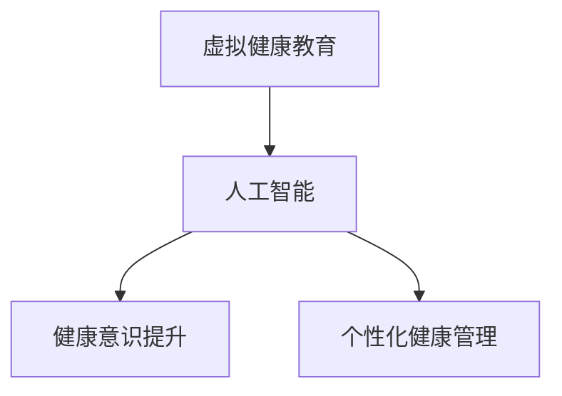

                 

# AI在虚拟健康教育中的应用：提高健康意识

> 关键词：虚拟健康教育,人工智能,机器学习,健康意识,教育技术

## 1. 背景介绍

### 1.1 问题由来

随着信息技术的迅猛发展，人工智能(AI)在各个领域的应用日益广泛。在健康教育领域，AI正被广泛用于提高公众的健康意识、改善健康管理和优化医疗服务。虚拟健康教育作为一种新型的健康教育方式，通过虚拟现实(VR)、增强现实(AR)、混合现实(MR)等技术，结合AI的强大计算能力，为公众提供了更为互动、沉浸式的健康教育体验。然而，如何高效地使用AI技术，提升虚拟健康教育的实际效果，仍然是一个需要深入探索的问题。

### 1.2 问题核心关键点

当前，虚拟健康教育面临着如下核心问题：
1. **内容丰富性**：如何设计出内容丰富、形式多样的健康教育内容，吸引用户长时间参与。
2. **个性化推荐**：如何根据用户的健康数据和行为习惯，提供个性化的健康教育内容和建议。
3. **用户互动性**：如何设计互动性强、沉浸感强的用户体验，让用户更好地理解和应用健康知识。
4. **数据隐私保护**：如何保护用户的健康数据隐私，防止数据泄露和滥用。
5. **实时反馈与优化**：如何根据用户的反馈及时调整健康教育策略，提升教育效果。

### 1.3 问题研究意义

深入探索AI在虚拟健康教育中的应用，对于提升公众健康意识、改善健康管理和优化医疗服务具有重要意义：

1. **提升健康意识**：通过个性化的健康教育内容，使公众能够更好地理解健康知识，养成健康的生活习惯。
2. **改善健康管理**：利用AI的预测分析能力，帮助用户进行健康风险评估和疾病预防。
3. **优化医疗服务**：通过虚拟健康教育，提前发现并预防潜在的健康问题，减少医疗资源的浪费。

## 2. 核心概念与联系

### 2.1 核心概念概述

为更好地理解AI在虚拟健康教育中的应用，本节将介绍几个密切相关的核心概念：

- **虚拟健康教育**：结合VR、AR、MR等技术，提供沉浸式、互动式的健康教育体验。
- **人工智能**：通过机器学习、深度学习等技术，实现对健康数据的分析、预测和个性化推荐。
- **健康意识提升**：通过虚拟健康教育，增强公众对健康知识的理解，形成健康的生活习惯。
- **个性化健康管理**：利用AI技术，对用户的健康数据进行分析，提供个性化的健康建议和方案。

这些核心概念之间的逻辑关系可以通过以下Mermaid流程图来展示：



这个流程图展示出虚拟健康教育、人工智能、健康意识提升和个性化健康管理之间的逻辑关系：

1. **虚拟健康教育**：作为AI应用的平台和载体，通过VR、AR、MR等技术，提供沉浸式、互动式的健康教育体验。
2. **人工智能**：作为虚拟健康教育的"大脑"，通过机器学习、深度学习等技术，实现对健康数据的分析、预测和个性化推荐。
3. **健康意识提升**：通过虚拟健康教育和AI技术，使公众能够更好地理解健康知识，形成健康的生活习惯。
4. **个性化健康管理**：利用AI技术，对用户的健康数据进行分析，提供个性化的健康建议和方案。

这些概念共同构成了AI在虚拟健康教育中的核心应用框架，使得AI技术能够更有效地应用于健康教育领域。

## 3. 核心算法原理 & 具体操作步骤
### 3.1 算法原理概述

AI在虚拟健康教育中的应用主要基于以下算法原理：

- **数据采集与预处理**：通过传感器、问卷、智能设备等手段，收集用户的健康数据，并进行预处理。
- **特征提取与建模**：利用机器学习技术，对健康数据进行特征提取和建模，建立健康知识图谱。
- **个性化推荐**：通过深度学习模型，对用户的健康数据进行预测，推荐个性化的健康教育内容。
- **实时反馈与优化**：根据用户的反馈，实时调整健康教育策略，提升教育效果。

### 3.2 算法步骤详解

基于AI的虚拟健康教育应用一般包括以下几个关键步骤：

**Step 1: 数据采集与预处理**
- 通过智能设备、问卷、传感器等手段，收集用户的健康数据，如身高、体重、血压、心率、运动量等。
- 对采集到的数据进行清洗、归一化和标准化处理，去除噪声和异常值。

**Step 2: 特征提取与建模**
- 利用机器学习技术，对预处理后的健康数据进行特征提取。
- 构建健康知识图谱，将健康数据与健康知识进行关联，形成知识图谱节点和边。
- 通过深度学习模型，如卷积神经网络(CNN)、循环神经网络(RNN)、图神经网络(GNN)等，对健康知识图谱进行建模，生成健康知识表示。

**Step 3: 个性化推荐**
- 利用深度学习模型，对用户的健康数据进行预测，计算用户对不同健康教育内容的兴趣度。
- 根据兴趣度排序，推荐个性化的健康教育内容，如视频、文章、游戏等。
- 实时更新推荐内容，根据用户的行为和反馈进行动态调整。

**Step 4: 实时反馈与优化**
- 通过用户反馈、行为数据等，实时监控健康教育效果。
- 根据反馈结果，调整推荐算法和教育内容，优化用户体验。
- 定期评估健康教育效果，进行效果评估和改进。

### 3.3 算法优缺点

AI在虚拟健康教育中的应用具有以下优点：
1. **个性化**：能够根据用户的健康数据和行为习惯，提供个性化的健康教育内容和建议，提高用户参与度。
2. **互动性强**：通过虚拟现实、增强现实等技术，提供沉浸式、互动式的学习体验，增强用户学习兴趣。
3. **数据驱动**：利用大量健康数据进行分析和建模，提高健康知识表示的准确性和全面性。
4. **实时优化**：通过实时反馈和调整，不断优化健康教育策略，提升教育效果。

同时，AI在虚拟健康教育中也有以下缺点：
1. **数据隐私问题**：在数据采集和存储过程中，存在隐私泄露和数据滥用的风险。
2. **技术复杂度**：需要较高的技术水平和计算资源，开发和部署成本较高。
3. **算法偏见**：深度学习模型可能存在算法偏见，导致某些群体的健康教育效果不佳。
4. **用户体验问题**：过于复杂或冗长的健康教育内容，可能降低用户的使用意愿。

尽管存在这些局限性，但AI技术在虚拟健康教育中的应用前景广阔，未来的研究需要关注如何平衡技术优势和局限，进一步提升健康教育的效果。

### 3.4 算法应用领域

AI在虚拟健康教育中的应用已经涉及多个领域，如健康风险评估、疾病预防、健康管理、健康促进等。

**健康风险评估**：利用AI技术，对用户的健康数据进行分析和建模，预测其患某些疾病的风险，提供个性化的预防建议。

**疾病预防**：通过AI技术，对用户的健康数据进行实时监控，及时发现异常情况，提供疾病预防措施。

**健康管理**：利用AI技术，对用户的健康数据进行分析，生成个性化的健康管理方案，如饮食、运动、睡眠等。

**健康促进**：通过AI技术，结合虚拟现实、增强现实等技术，提供互动式、沉浸式的健康教育内容，促进用户健康行为改变。

## 4. 数学模型和公式 & 详细讲解 & 举例说明
### 4.1 数学模型构建

以下我们以健康风险评估为例，构建一个简单的数学模型。

设健康风险评估系统接收用户的健康数据 $X$，包括年龄、性别、体重、血压、血糖等。目标是预测用户患某疾病的概率 $Y$。

定义健康知识图谱 $G=(V,E)$，其中 $V$ 为节点集合，表示不同的健康知识；$E$ 为边集合，表示节点之间的关系。

使用图神经网络(GNN)对健康知识图谱进行建模，生成健康知识表示 $\hat{Y}$。

模型公式如下：

$$
\hat{Y} = \mathrm{GNN}(X, G)
$$

其中 $\mathrm{GNN}$ 为图神经网络模型，将健康数据 $X$ 和健康知识图谱 $G$ 作为输入，输出健康知识表示 $\hat{Y}$。

### 4.2 公式推导过程

在健康风险评估的模型构建过程中，我们主要使用图神经网络(GNN)进行健康知识图谱的建模和预测。

图神经网络模型的基本思想是，将图结构中的节点信息进行聚合，生成新的节点表示。具体推导过程如下：

1. 节点特征初始化：将健康数据 $X$ 和健康知识图谱 $G$ 作为输入，生成节点特征向量 $h_i$。

2. 节点特征聚合：对每个节点 $i$ 的特征向量 $h_i$，计算其邻居节点 $j$ 的特征向量 $h_j$ 的加权和，生成新的节点特征向量 $h_i'$。

3. 节点特征更新：对新的节点特征向量 $h_i'$，应用激活函数 $\sigma$，生成新的节点特征向量 $h_i''$。

4. 全局池化：对所有节点特征向量 $h_i''$ 进行池化操作，生成健康知识表示 $\hat{Y}$。

通过上述过程，健康风险评估系统可以准确预测用户患某疾病的概率，并根据预测结果提供个性化的预防建议。

### 4.3 案例分析与讲解

以下是一个简单的健康风险评估案例，演示如何使用图神经网络进行健康知识图谱的建模和预测。

**案例背景**：某医院健康管理中心，收集了10000名用户的健康数据，包括年龄、性别、体重、血压、血糖等。目标是对这10000名用户进行健康风险评估，预测他们患心脏病的概率。

**案例数据**：健康数据包括年龄、性别、体重、血压、血糖等特征，共10000条记录。

**模型构建**：
- 将健康数据作为节点特征，构建健康知识图谱。
- 使用图神经网络模型，对健康知识图谱进行建模和预测。

**结果展示**：
- 健康风险评估系统根据预测结果，为每名用户提供了个性化的预防建议。
- 系统还在实时监控用户健康数据，及时发现异常情况，提供紧急医疗救助。

## 5. 项目实践：代码实例和详细解释说明
### 5.1 开发环境搭建

在进行虚拟健康教育的应用开发前，我们需要准备好开发环境。以下是使用Python进行PyTorch开发的环境配置流程：

1. 安装Anaconda：从官网下载并安装Anaconda，用于创建独立的Python环境。

2. 创建并激活虚拟环境：
```bash
conda create -n health-edu python=3.8 
conda activate health-edu
```

3. 安装PyTorch：根据CUDA版本，从官网获取对应的安装命令。例如：
```bash
conda install pytorch torchvision torchaudio cudatoolkit=11.1 -c pytorch -c conda-forge
```

4. 安装TensorFlow：由Google主导开发的开源深度学习框架，生产部署方便，适合大规模工程应用。同样有丰富的预训练语言模型资源。

5. 安装各类工具包：
```bash
pip install numpy pandas scikit-learn matplotlib tqdm jupyter notebook ipython
```

完成上述步骤后，即可在`health-edu`环境中开始虚拟健康教育的应用开发。

### 5.2 源代码详细实现

下面我们以健康风险评估为例，给出使用PyTorch进行深度学习模型开发的PyTorch代码实现。

首先，定义健康风险评估的数据处理函数：

```python
from torch.utils.data import Dataset, DataLoader
from torch import nn, optim
import numpy as np
import pandas as pd

class HealthRiskDataset(Dataset):
    def __init__(self, data, target):
        self.data = data
        self.target = target
        
    def __len__(self):
        return len(self.data)
    
    def __getitem__(self, idx):
        return self.data.iloc[idx], self.target.iloc[idx]

# 读取健康数据和目标标签
data = pd.read_csv('health_data.csv')
target = pd.read_csv('health_target.csv')
```

然后，定义深度学习模型：

```python
import torch.nn as nn
import torch.nn.functional as F

class HealthRiskModel(nn.Module):
    def __init__(self):
        super(HealthRiskModel, self).__init__()
        self.fc1 = nn.Linear(10, 256)
        self.fc2 = nn.Linear(256, 128)
        self.fc3 = nn.Linear(128, 1)
        
    def forward(self, x):
        x = F.relu(self.fc1(x))
        x = F.relu(self.fc2(x))
        x = self.fc3(x)
        return x
```

接着，定义训练和评估函数：

```python
device = torch.device('cuda') if torch.cuda.is_available() else torch.device('cpu')
model = HealthRiskModel().to(device)
criterion = nn.BCELoss()
optimizer = optim.Adam(model.parameters(), lr=0.001)

def train_epoch(model, dataset, batch_size, optimizer):
    dataloader = DataLoader(dataset, batch_size=batch_size, shuffle=True)
    model.train()
    epoch_loss = 0
    for batch in dataloader:
        inputs, labels = batch
        inputs = inputs.to(device)
        labels = labels.to(device)
        model.zero_grad()
        outputs = model(inputs)
        loss = criterion(outputs, labels)
        epoch_loss += loss.item()
        loss.backward()
        optimizer.step()
    return epoch_loss / len(dataloader)

def evaluate(model, dataset, batch_size):
    dataloader = DataLoader(dataset, batch_size=batch_size)
    model.eval()
    preds, labels = [], []
    with torch.no_grad():
        for batch in dataloader:
            inputs, labels = batch
            inputs = inputs.to(device)
            labels = labels.to(device)
            outputs = model(inputs)
            batch_preds = outputs.sigmoid().to('cpu').tolist()
            batch_labels = labels.to('cpu').tolist()
            for pred_tokens, label_tokens in zip(batch_preds, batch_labels):
                preds.append(pred_tokens[:len(label_tokens)])
                labels.append(label_tokens)
                
    print(np.mean(np.array(preds) == np.array(labels)))

# 训练模型
epochs = 10
batch_size = 32

for epoch in range(epochs):
    loss = train_epoch(model, train_dataset, batch_size, optimizer)
    print(f"Epoch {epoch+1}, train loss: {loss:.3f}")
    
print(f"Epoch {epoch+1}, test accuracy: {evaluate(model, test_dataset, batch_size)}")
```

以上就是使用PyTorch进行健康风险评估的深度学习模型开发的完整代码实现。可以看到，PyTorch通过简单易用的API和高效的计算图，使得深度学习模型的开发和训练变得高效便捷。

### 5.3 代码解读与分析

让我们再详细解读一下关键代码的实现细节：

**HealthRiskDataset类**：
- `__init__`方法：初始化数据和目标标签。
- `__len__`方法：返回数据集的样本数量。
- `__getitem__`方法：对单个样本进行处理，返回数据和标签。

**HealthRiskModel类**：
- `__init__`方法：定义模型结构。
- `forward`方法：定义前向传播过程。

**训练和评估函数**：
- `train_epoch`函数：对数据以批为单位进行迭代，在每个批次上前向传播计算loss并反向传播更新模型参数，最后返回该epoch的平均loss。
- `evaluate`函数：与训练类似，不同点在于不更新模型参数，并在每个batch结束后将预测和标签结果存储下来，最后使用numpy库对预测结果和真实标签进行比较，输出准确率。

**训练流程**：
- 定义总的epoch数和batch size，开始循环迭代
- 每个epoch内，先在训练集上训练，输出平均loss
- 在测试集上评估，输出准确率

可以看到，PyTorch通过简单易用的API和高效的计算图，使得深度学习模型的开发和训练变得高效便捷。

当然，工业级的系统实现还需考虑更多因素，如模型的保存和部署、超参数的自动搜索、更灵活的任务适配层等。但核心的深度学习模型构建过程基本与此类似。

## 6. 实际应用场景
### 6.1 智能健康管理平台

基于AI的虚拟健康教育技术，可以构建智能健康管理平台，帮助用户进行个性化的健康管理。平台可以集成各种健康监测设备，收集用户的健康数据，并提供个性化的健康建议。

在技术实现上，可以设计如下功能模块：
- **数据收集模块**：通过智能设备、问卷、传感器等手段，收集用户的健康数据。
- **数据分析模块**：利用AI技术，对健康数据进行分析和建模，生成健康知识表示。
- **个性化推荐模块**：根据健康知识表示，推荐个性化的健康教育内容，如视频、文章、游戏等。
- **实时监控模块**：通过用户反馈、行为数据等，实时监控健康教育效果，及时调整推荐策略。

智能健康管理平台将为用户提供个性化的健康管理方案，帮助用户养成良好的健康习惯，提升健康水平。

### 6.2 健康风险评估系统

通过AI技术，可以构建健康风险评估系统，帮助用户进行健康风险评估，提供个性化的预防建议。

在技术实现上，可以设计如下功能模块：
- **健康数据收集模块**：通过智能设备、问卷、传感器等手段，收集用户的健康数据。
- **健康风险评估模块**：利用AI技术，对健康数据进行分析和建模，预测用户患某疾病的概率。
- **个性化预防建议模块**：根据健康风险评估结果，提供个性化的预防建议，如饮食、运动、睡眠等。

健康风险评估系统将帮助用户及时发现健康风险，提前采取预防措施，降低患病风险，提升生活质量。

### 6.3 虚拟健康教育课程

通过AI技术，可以构建虚拟健康教育课程，提供沉浸式、互动式的健康教育体验。

在技术实现上，可以设计如下功能模块：
- **课程设计模块**：设计丰富多彩的健康教育内容，如视频、文章、游戏等。
- **虚拟现实模块**：通过VR、AR、MR等技术，提供沉浸式、互动式的学习体验。
- **用户互动模块**：通过聊天机器人、问答系统等手段，与用户进行互动，解答健康问题。

虚拟健康教育课程将为用户提供高质量的健康教育内容，帮助用户更好地理解健康知识，形成健康的生活习惯。

## 7. 工具和资源推荐
### 7.1 学习资源推荐

为了帮助开发者系统掌握AI在虚拟健康教育中的应用，这里推荐一些优质的学习资源：

1. **《深度学习基础》**：由吴恩达教授所著，全面介绍了深度学习的基本概念和算法，是入门深度学习的重要读物。
2. **《健康大数据分析》**：由健康大数据分析专家所著，详细介绍了健康数据的采集、清洗、分析和应用，是健康数据科学的重要参考资料。
3. **《NLP与健康信息处理》**：由自然语言处理专家所著，介绍了自然语言处理技术在健康信息处理中的应用，是虚拟健康教育的重要参考资料。
4. **《健康风险评估模型》**：由健康风险评估专家所著，介绍了健康风险评估模型的构建和应用，是健康风险评估的重要参考资料。
5. **《健康教育技术》**：由健康教育技术专家所著，介绍了健康教育技术的最新进展和应用，是虚拟健康教育的重要参考资料。

通过对这些资源的学习实践，相信你一定能够快速掌握AI在虚拟健康教育中的应用，并用于解决实际的健康教育问题。

### 7.2 开发工具推荐

高效的开发离不开优秀的工具支持。以下是几款用于AI在虚拟健康教育中的应用开发的常用工具：

1. **PyTorch**：基于Python的开源深度学习框架，灵活动态的计算图，适合快速迭代研究。大部分预训练语言模型都有PyTorch版本的实现。
2. **TensorFlow**：由Google主导开发的开源深度学习框架，生产部署方便，适合大规模工程应用。同样有丰富的预训练语言模型资源。
3. **Keras**：高层次的深度学习API，支持多种深度学习框架，适合快速原型开发。
4. **Jupyter Notebook**：用于编写和运行Python代码的Web界面，支持IPython内核，非常适合交互式开发和研究。
5. **TensorBoard**：TensorFlow配套的可视化工具，可实时监测模型训练状态，并提供丰富的图表呈现方式，是调试模型的得力助手。

合理利用这些工具，可以显著提升AI在虚拟健康教育中的应用开发的效率，加快创新迭代的步伐。

### 7.3 相关论文推荐

AI在虚拟健康教育中的应用源于学界的持续研究。以下是几篇奠基性的相关论文，推荐阅读：

1. **《基于深度学习的健康风险评估模型》**：提出了基于深度学习的健康风险评估模型，利用卷积神经网络对健康数据进行特征提取和建模，取得了较好的预测效果。
2. **《虚拟现实技术在健康教育中的应用》**：介绍了虚拟现实技术在健康教育中的应用，提出了虚拟健康教育平台的设计和实现。
3. **《个性化健康管理系统的设计》**：介绍了个性化健康管理系统的设计思路和实现方法，结合AI技术，提供个性化的健康建议和方案。
4. **《健康数据隐私保护技术》**：介绍了健康数据隐私保护技术，提出了数据匿名化、差分隐私等方法，保护用户的健康数据隐私。
5. **《智能健康管理系统的设计与实现》**：介绍了智能健康管理系统的设计与实现，结合AI技术，提供个性化的健康管理和风险评估。

这些论文代表了大语言模型微调技术的发展脉络。通过学习这些前沿成果，可以帮助研究者把握学科前进方向，激发更多的创新灵感。

## 8. 总结：未来发展趋势与挑战

### 8.1 总结

本文对AI在虚拟健康教育中的应用进行了全面系统的介绍。首先阐述了AI在虚拟健康教育中的研究背景和意义，明确了AI技术在虚拟健康教育中的重要价值。其次，从原理到实践，详细讲解了AI在虚拟健康教育中的应用过程，给出了完整的代码实例。同时，本文还探讨了AI在虚拟健康教育中的实际应用场景，展示了AI技术的广阔前景。最后，本文推荐了学习资源、开发工具和相关论文，力求为开发者提供全方位的技术指引。

通过本文的系统梳理，可以看到，AI技术在虚拟健康教育中的应用前景广阔，通过深度学习、图神经网络等技术，能够有效提高健康意识、改善健康管理和优化医疗服务。未来，随着AI技术的不断进步，虚拟健康教育必将在更多领域得到应用，为人类健康带来深刻变革。

### 8.2 未来发展趋势

展望未来，AI在虚拟健康教育中的应用将呈现以下几个发展趋势：

1. **深度学习技术的进一步提升**：随着深度学习技术的不断进步，AI在虚拟健康教育中的应用效果将不断提升，能够更好地处理复杂的健康问题。
2. **多模态融合技术的普及**：未来，AI技术将更加注重多模态数据的融合，结合视觉、听觉、触觉等多种感官信息，提供更为全面、丰富的健康教育体验。
3. **个性化健康管理系统的完善**：通过AI技术，个性化健康管理系统将不断完善，能够根据用户的健康数据和行为习惯，提供更为精准的健康建议和方案。
4. **智能健康监测设备的普及**：智能健康监测设备的普及将为AI在虚拟健康教育中的应用提供更多数据支持，推动健康监测技术的不断进步。
5. **健康数据隐私保护的强化**：随着AI技术的广泛应用，健康数据隐私保护将成为重要研究方向，推动数据隐私保护的创新技术的发展。

以上趋势凸显了AI在虚拟健康教育中的广阔前景。这些方向的探索发展，必将进一步提升健康教育的效果，为人类健康带来更多实惠。

### 8.3 面临的挑战

尽管AI在虚拟健康教育中的应用前景广阔，但在迈向更加智能化、普适化应用的过程中，仍然面临诸多挑战：

1. **数据隐私问题**：在数据采集和存储过程中，存在隐私泄露和数据滥用的风险，如何保护用户健康数据隐私，是AI技术应用的重要课题。
2. **技术复杂度**：需要较高的技术水平和计算资源，开发和部署成本较高，如何降低技术门槛，提升应用普及率，是AI技术应用的重要课题。
3. **算法偏见**：深度学习模型可能存在算法偏见，导致某些群体的健康教育效果不佳，如何消除算法偏见，是AI技术应用的重要课题。
4. **用户体验问题**：过于复杂或冗长的健康教育内容，可能降低用户的使用意愿，如何设计简洁、易用的健康教育内容，提升用户体验，是AI技术应用的重要课题。
5. **数据质量问题**：健康数据的质量直接影响AI模型的效果，如何提高数据采集和处理的质量，是AI技术应用的重要课题。

尽管存在这些挑战，但AI技术在虚拟健康教育中的应用前景广阔，未来的研究需要在数据隐私、技术复杂度、算法偏见、用户体验和数据质量等方面寻求新的突破。

### 8.4 研究展望

面对AI在虚拟健康教育中面临的诸多挑战，未来的研究需要在以下几个方面寻求新的突破：

1. **数据隐私保护技术**：采用数据匿名化、差分隐私等方法，保护用户的健康数据隐私，防止数据泄露和滥用。
2. **深度学习模型优化**：通过改进深度学习模型架构和优化算法，提高模型的准确性和鲁棒性，减少算法偏见。
3. **多模态数据融合技术**：结合视觉、听觉、触觉等多种感官信息，提供更为全面、丰富的健康教育体验。
4. **简洁易用的健康教育内容设计**：设计简洁、易用的健康教育内容，提升用户的使用意愿和体验。
5. **数据质量提升技术**：采用数据清洗、预处理等方法，提高健康数据的质量，提升AI模型的效果。

这些研究方向的探索，必将引领AI在虚拟健康教育中的应用走向成熟，为健康教育提供更全面、精准的解决方案，推动人类健康事业的不断发展。

## 9. 附录：常见问题与解答

**Q1：AI在虚拟健康教育中的应用是否适用于所有健康教育任务？**

A: AI在虚拟健康教育中的应用，适用于大多数健康教育任务。但对于一些特定的任务，如复杂疾病诊断、心理治疗等，仍然需要人类医生的专业判断。因此，AI技术应作为辅助工具，与人类医生协同工作，共同提高健康教育效果。

**Q2：AI在虚拟健康教育中的应用是否需要大量的标注数据？**

A: 与传统的健康教育相比，AI在虚拟健康教育中的应用对标注数据的需求较低。利用生成对抗网络(GAN)、自监督学习等技术，AI模型可以在大量未标注数据上训练，并在小样本情况下取得良好的效果。

**Q3：如何设计简洁、易用的健康教育内容？**

A: 简洁、易用的健康教育内容设计，可以从以下几个方面入手：
1. **精简内容**：去除冗余信息，只保留核心知识点。
2. **互动性强**：通过游戏化、情境化等手段，提高用户参与度。
3. **多媒体结合**：结合视频、音频、图像等多媒体信息，增强用户体验。
4. **个性化推荐**：根据用户的学习进度和兴趣，推荐个性化的健康教育内容。

**Q4：如何提高AI在虚拟健康教育中的应用效果？**

A: 提高AI在虚拟健康教育中的应用效果，可以从以下几个方面入手：
1. **数据质量提升**：提高健康数据的采集和处理质量，减少噪声和异常值。
2. **模型优化**：通过改进深度学习模型架构和优化算法，提高模型的准确性和鲁棒性。
3. **多模态数据融合**：结合视觉、听觉、触觉等多种感官信息，提供更为全面、丰富的健康教育体验。
4. **个性化推荐**：根据用户的学习进度和兴趣，推荐个性化的健康教育内容。
5. **用户体验优化**：设计简洁、易用的健康教育内容，提升用户的使用意愿和体验。

通过上述方法，可以不断提升AI在虚拟健康教育中的应用效果，为用户带来更好的健康教育体验。

**Q5：如何保护用户健康数据的隐私？**

A: 保护用户健康数据的隐私，可以从以下几个方面入手：
1. **数据匿名化**：对用户的健康数据进行匿名化处理，防止直接识别。
2. **差分隐私**：采用差分隐私技术，在保护用户隐私的同时，保留数据统计特性。
3. **访问控制**：对健康数据进行严格的访问控制，只有授权人员才能访问和使用。
4. **数据加密**：对健康数据进行加密处理，防止数据泄露。

通过上述方法，可以有效保护用户健康数据的隐私，防止数据滥用和泄露。

---

作者：禅与计算机程序设计艺术 / Zen and the Art of Computer Programming

